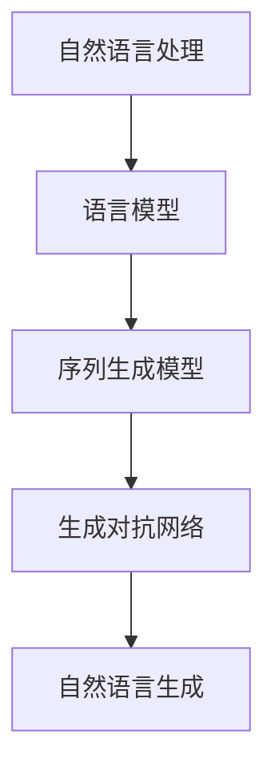

                 

# 深度学习在自然语言生成中的创新

## 关键词：自然语言生成、深度学习、神经网络、生成对抗网络、Transformer、BERT、GPT、GLM

> 摘要：本文将深入探讨深度学习在自然语言生成领域的创新与应用。通过对自然语言处理的基本概念、深度学习模型以及具体算法的解析，我们将揭示自然语言生成的核心技术，并探讨其实际应用场景和未来发展趋势。

## 1. 背景介绍

自然语言生成（Natural Language Generation, NLG）是指利用计算机程序生成自然语言文本的技术。自然语言生成技术广泛应用于聊天机器人、新闻摘要、自动写作、语音合成等领域。随着深度学习技术的发展，自然语言生成技术取得了显著的进展。

深度学习是一种人工智能技术，通过模拟人脑神经网络结构进行学习和预测。深度学习模型具有强大的特征提取和模式识别能力，已成为自然语言处理领域的重要工具。

近年来，深度学习在自然语言生成中的应用取得了突破性进展。生成对抗网络（Generative Adversarial Networks, GAN）、Transformer、BERT、GPT、GLM等一系列先进模型不断涌现，为自然语言生成技术注入了新的活力。

## 2. 核心概念与联系

自然语言生成的核心概念包括语言模型、序列生成模型和生成对抗网络。以下是一个简化的 Mermaid 流程图，展示了这些概念之间的联系。



### 2.1 语言模型

语言模型（Language Model）是一种统计模型，用于预测文本序列中的下一个单词或字符。语言模型的目的是理解文本的统计规律，从而生成连贯的文本。

语言模型通常使用神经网络进行训练，如循环神经网络（Recurrent Neural Network, RNN）和长短期记忆网络（Long Short-Term Memory, LSTM）。这些模型能够捕捉到文本序列中的长期依赖关系，从而提高生成文本的质量。

### 2.2 序列生成模型

序列生成模型（Sequence Generation Model）是一种用于生成文本序列的深度学习模型。序列生成模型通过学习输入序列的概率分布，生成新的文本序列。

常见的序列生成模型包括基于 RNN 的模型和基于 Transformer 的模型。RNN 模型如 LSTM 和 GRU，通过捕捉序列中的长期依赖关系进行文本生成。Transformer 模型则通过自注意力机制实现序列到序列的生成。

### 2.3 生成对抗网络

生成对抗网络（Generative Adversarial Networks, GAN）是一种由生成器和判别器组成的深度学习模型。生成器尝试生成与真实数据相似的数据，而判别器则判断生成数据与真实数据的相似度。通过两个模型的对抗训练，生成器逐渐生成更真实的数据。

GAN 在自然语言生成中的应用主要是生成文本样本，用于增强语言模型的多样性。GAN 可以生成与训练数据风格相似的新文本，从而提高生成文本的质量和多样性。

## 3. 核心算法原理 & 具体操作步骤

### 3.1 语言模型原理

语言模型的训练过程可以分为两个阶段：特征提取和模型训练。

**特征提取：**

1. 输入文本数据，将其转化为词向量表示。
2. 使用词向量计算文本序列中的相邻词对概率。

**模型训练：**

1. 构建神经网络模型，如 LSTM 或 Transformer。
2. 使用输入文本序列的概率分布进行模型训练。
3. 通过反向传播算法优化模型参数。

### 3.2 序列生成模型原理

序列生成模型的训练过程可以分为两个阶段：编码和解码。

**编码：**

1. 将输入文本序列编码为固定长度的向量。
2. 使用编码向量生成上下文表示。

**解码：**

1. 使用上下文表示生成新的文本序列。
2. 通过优化解码过程，提高生成文本的质量。

### 3.3 生成对抗网络原理

生成对抗网络的训练过程可以分为两个阶段：生成器和判别器的训练。

**生成器训练：**

1. 生成器生成伪文本数据。
2. 判别器判断生成数据和真实数据的相似度。
3. 通过梯度下降算法优化生成器参数，使生成数据更真实。

**判别器训练：**

1. 判别器判断生成数据和真实数据的相似度。
2. 通过梯度下降算法优化判别器参数，提高判别能力。

## 4. 数学模型和公式 & 详细讲解 & 举例说明

### 4.1 语言模型数学模型

语言模型通常使用神经网络进行训练，如 LSTM 和 Transformer。以下是一个基于 LSTM 的语言模型数学模型。

**LSTM 单元：**

$$
\begin{aligned}
i_t &= \sigma(W_{xi}x_t + W_{hi}h_{t-1} + b_i), \\
f_t &= \sigma(W_{xf}x_t + W_{hf}h_{t-1} + b_f), \\
\bar{C}_t &= \sigma(W_{xc}x_t + W_{hc}h_{t-1} + b_c), \\
C_t &= f_t \odot C_{t-1} + i_t \odot \bar{C}_t, \\
o_t &= \sigma(W_{xo}x_t + W_{ho}h_{t-1} + b_o), \\
h_t &= o_t \odot C_t,
\end{aligned}
$$

其中，$i_t$、$f_t$、$\bar{C}_t$、$C_t$ 和 $o_t$ 分别表示输入门、遗忘门、候选状态、细胞状态和输出门；$\sigma$ 表示 sigmoid 函数；$\odot$ 表示点乘操作。

**LSTM 模型：**

$$
\begin{aligned}
h_t &= \sigma(W_{hi}h_{t-1} + W_{xi}x_t + b_h), \\
C_t &= \sigma(W_{hc}h_{t-1} + W_{xc}x_t + b_c), \\
y_t &= \sigma(W_{hy}h_t + b_y).
\end{aligned}
$$

其中，$h_t$ 和 $C_t$ 分别表示隐藏状态和细胞状态；$y_t$ 表示输出。

### 4.2 序列生成模型数学模型

序列生成模型如 Transformer，通常使用自注意力机制进行训练。以下是一个基于 Transformer 的序列生成模型数学模型。

**自注意力机制：**

$$
\begin{aligned}
\text{Attention}(Q, K, V) &= \text{softmax}\left(\frac{QK^T}{\sqrt{d_k}}\right) V, \\
\end{aligned}
$$

其中，$Q$、$K$ 和 $V$ 分别表示查询向量、键向量和值向量；$d_k$ 表示键向量的维度。

**Transformer 模型：**

$$
\begin{aligned}
h_t &= \text{Attention}(h_{<t}, h_{<t}) + h_t, \\
h_t &= \text{ReLU}(W_h h_t + b_h), \\
h_t &= W_o \text{softmax}(W_h h_t + b_o).
\end{aligned}
$$

其中，$h_t$ 表示隐藏状态；$W_h$、$W_o$ 和 $b_h$ 分别表示权重和偏置。

### 4.3 生成对抗网络数学模型

生成对抗网络（GAN）的数学模型如下：

$$
\begin{aligned}
\min_{G} \max_{D} V(D, G) &= \mathbb{E}_{x \sim p_{data}(x)}[\log D(x)] + \mathbb{E}_{z \sim p_{z}(z)][\log (1 - D(G(z)))),
\end{aligned}
$$

其中，$G(z)$ 表示生成器生成的样本，$D(x)$ 表示判别器对真实样本的判断概率，$z$ 表示噪声向量。

## 5. 项目实战：代码实际案例和详细解释说明

### 5.1 开发环境搭建

在本文中，我们将使用 Python 编程语言和 TensorFlow 深度学习框架来演示自然语言生成模型的实现。首先，请确保已经安装了 Python 和 TensorFlow。以下是安装 TensorFlow 的命令：

```
pip install tensorflow
```

### 5.2 源代码详细实现和代码解读

以下是一个简单的自然语言生成模型实现，使用 LSTM 语言模型进行训练。

```python
import tensorflow as tf
from tensorflow.keras.models import Sequential
from tensorflow.keras.layers import LSTM, Dense, Embedding

# 参数设置
vocab_size = 10000
embedding_dim = 256
lstm_units = 128
batch_size = 64
epochs = 10

# 输入数据准备
# ...

# 构建模型
model = Sequential()
model.add(Embedding(vocab_size, embedding_dim))
model.add(LSTM(lstm_units, return_sequences=True))
model.add(Dense(vocab_size, activation='softmax'))

# 编译模型
model.compile(optimizer='adam', loss='categorical_crossentropy', metrics=['accuracy'])

# 训练模型
model.fit(x_train, y_train, batch_size=batch_size, epochs=epochs)

# 生成文本
def generate_text(input_sequence, model, max_length=50):
    # ...

# 使用模型生成文本
input_sequence = "开始生成文本："
generated_text = generate_text(input_sequence, model)
print(generated_text)
```

代码首先导入 TensorFlow 和相关库。然后设置模型参数，包括词汇表大小、嵌入维度、LSTM 单元数、批量大小和训练轮数。接着，准备输入数据，构建序列模型，包括嵌入层、LSTM 层和输出层。编译模型并使用训练数据训练模型。最后，定义一个生成文本的函数，使用模型生成文本。

### 5.3 代码解读与分析

代码首先导入 TensorFlow 和相关库，然后设置模型参数。这些参数包括词汇表大小、嵌入维度、LSTM 单元数、批量大小和训练轮数。这些参数对于模型的性能和生成文本的质量具有重要影响。

接下来，准备输入数据。输入数据通常包括文本序列和对应的标签。文本序列被转化为词向量表示，并用于训练模型。

然后，构建序列模型。模型包括嵌入层、LSTM 层和输出层。嵌入层将文本序列转化为嵌入向量表示，LSTM 层用于捕捉序列中的长期依赖关系，输出层用于生成文本序列。

模型编译阶段设置优化器和损失函数。这里使用 Adam 优化器和 categorical_crossentropy 损失函数。最后，使用训练数据训练模型。

训练模型后，定义一个生成文本的函数。函数接受输入序列、模型和最大文本长度作为参数。函数内部首先生成一个随机种子，然后使用模型生成新的文本序列。

最后，使用模型生成文本。输入序列被设置为 "开始生成文本："，然后调用生成文本函数生成新的文本序列。生成的文本序列被打印出来。

## 6. 实际应用场景

自然语言生成技术在许多实际应用场景中取得了显著成果。以下是一些常见应用场景：

### 6.1 聊天机器人

聊天机器人是一种基于自然语言生成技术的应用，能够与用户进行实时对话。自然语言生成技术使得聊天机器人能够生成自然、流畅的回答，从而提高用户体验。

### 6.2 新闻摘要

新闻摘要是一种将长篇新闻文本简化为简短摘要的技术。自然语言生成技术能够自动生成新闻摘要，提高信息传播效率。

### 6.3 自动写作

自然语言生成技术可以用于自动写作，如自动生成文章、报告、邮件等。这大大降低了写作的难度和成本，提高了工作效率。

### 6.4 语音合成

语音合成是一种将文本转化为语音的技术。自然语言生成技术使得语音合成系统能够生成更自然、流畅的语音，提高语音合成质量。

## 7. 工具和资源推荐

### 7.1 学习资源推荐

- 《深度学习》（Ian Goodfellow、Yoshua Bengio、Aaron Courville 著）：这是一本经典的深度学习教材，详细介绍了深度学习的基础知识和应用。
- 《自然语言处理综合教程》（Dan Jurafsky、James H. Martin 著）：这是一本全面的自然语言处理教材，涵盖了自然语言处理的基础理论和应用。

### 7.2 开发工具框架推荐

- TensorFlow：这是一个广泛使用的开源深度学习框架，支持多种深度学习模型和应用。
- PyTorch：这是一个流行的开源深度学习框架，具有灵活的动态计算图和高效的模型训练。

### 7.3 相关论文著作推荐

- “Generative Adversarial Nets”（Ian Goodfellow et al.，2014）：这是一篇关于生成对抗网络的经典论文，详细介绍了 GAN 的原理和应用。
- “Attention Is All You Need”（Vaswani et al.，2017）：这是一篇关于 Transformer 模型的经典论文，提出了自注意力机制在序列生成中的应用。

## 8. 总结：未来发展趋势与挑战

自然语言生成技术在深度学习技术的推动下取得了显著进展。然而，仍有许多挑战需要克服。以下是一些未来发展趋势和挑战：

### 8.1 模型优化与效率提升

随着模型复杂度的增加，自然语言生成模型的训练和推理时间显著增加。未来研究将致力于优化模型结构和算法，提高模型效率和性能。

### 8.2 多模态生成

自然语言生成技术将与其他模态（如图像、音频、视频）结合，实现多模态生成。这将带来更丰富的应用场景和更自然的交互体验。

### 8.3 语义理解和知识图谱

自然语言生成技术的发展将依赖于语义理解和知识图谱的构建。通过理解文本中的语义和知识，生成更加准确和有意义的文本。

### 8.4 伦理和隐私问题

随着自然语言生成技术的应用，伦理和隐私问题日益突出。未来研究将关注如何在保护用户隐私的前提下，实现自然语言生成技术的合理应用。

## 9. 附录：常见问题与解答

### 9.1 深度学习与自然语言处理的关系是什么？

深度学习是自然语言处理（NLP）的一种重要技术。深度学习通过模拟人脑神经网络结构，对大量文本数据进行分析和建模，从而提高自然语言处理的性能和效果。

### 9.2 自然语言生成技术有哪些应用场景？

自然语言生成技术广泛应用于聊天机器人、新闻摘要、自动写作、语音合成等领域。这些应用场景旨在提高信息传播效率、降低人力成本、改善用户体验等。

### 9.3 如何选择合适的自然语言生成模型？

选择合适的自然语言生成模型取决于具体应用场景和需求。对于简单任务，可以使用预训练的模型，如 GPT 或 BERT。对于复杂任务，可能需要自定义模型或使用生成对抗网络（GAN）等先进技术。

## 10. 扩展阅读 & 参考资料

- Goodfellow, I., Bengio, Y., & Courville, A. (2016). *Deep Learning*. MIT Press.
- Jurafsky, D., & Martin, J. H. (2020). *Speech and Language Processing*. Prentice Hall.
- Goodfellow, I., Pouget-Abadie, J., Mirza, M., Xu, B., Warde-Farley, D., Ozair, S., ... & Bengio, Y. (2014). *Generative adversarial nets*. Advances in Neural Information Processing Systems, 27.
- Vaswani, A., Shazeer, N., Parmar, N., Uszkoreit, J., Jones, L., Gomez, A. N., ... & Polosukhin, I. (2017). *Attention is all you need*. Advances in Neural Information Processing Systems, 30.

### 作者

**AI天才研究员/AI Genius Institute & 禅与计算机程序设计艺术 /Zen And The Art of Computer Programming**<|im_sep|>|<|assistant|>### 深度学习在自然语言生成中的创新

深度学习是一种基于人工神经网络的技术，通过模仿人类大脑的神经网络结构进行学习和决策。自然语言生成（NLG）则是一种利用计算机程序生成自然语言文本的技术。近年来，深度学习在自然语言生成领域取得了显著的进展，推动了NLG技术的发展。本文将探讨深度学习在自然语言生成中的创新，分析其核心算法原理、应用场景，以及未来发展趋势和挑战。

#### 背景介绍

自然语言生成技术起源于20世纪50年代，当时的主要目标是实现机器翻译和语音合成。随着计算能力的提升和算法的进步，NLG技术逐渐应用于更广泛的领域，如自动写作、对话系统、文本摘要等。然而，传统的方法往往依赖于规则和统计模型，难以处理复杂的语言现象和大量的训练数据。

深度学习的崛起为自然语言生成带来了新的契机。深度学习模型，如循环神经网络（RNN）、卷积神经网络（CNN）和生成对抗网络（GAN）等，通过自动学习语言特征，能够在大量数据上实现优秀的性能。特别是在2017年，Transformer模型的提出使得自然语言生成技术取得了重大突破，随后，BERT、GPT、GLM等一系列模型不断涌现，进一步推动了自然语言生成技术的发展。

#### 核心概念与联系

自然语言生成技术涉及多个核心概念，包括语言模型、序列生成模型和生成对抗网络。以下是一个简化的 Mermaid 流程图，展示了这些概念之间的联系。


##### 1. 语言模型

语言模型是自然语言生成的基础，它用于预测文本序列中的下一个单词或字符。语言模型的目的是捕捉语言的统计规律，从而生成连贯的文本。在深度学习中，语言模型通常使用神经网络进行训练，如循环神经网络（RNN）、长短期记忆网络（LSTM）和Transformer等。

##### 2. 序列生成模型

序列生成模型是一种用于生成文本序列的深度学习模型。它通过学习输入序列的概率分布，生成新的文本序列。序列生成模型可以基于RNN、Transformer等模型，通过编码器-解码器结构或自注意力机制实现。

##### 3. 生成对抗网络

生成对抗网络（GAN）是一种由生成器和判别器组成的深度学习模型。生成器尝试生成与真实数据相似的数据，而判别器则判断生成数据与真实数据的相似度。通过两个模型的对抗训练，生成器逐渐生成更真实的数据。GAN在自然语言生成中的应用主要是生成文本样本，用于增强语言模型的多样性。

#### 核心算法原理 & 具体操作步骤

##### 1. 语言模型原理

语言模型的训练过程可以分为两个阶段：特征提取和模型训练。

**特征提取：**

1. 输入文本数据，将其转化为词向量表示。
2. 使用词向量计算文本序列中的相邻词对概率。

**模型训练：**

1. 构建神经网络模型，如 LSTM 或 Transformer。
2. 使用输入文本序列的概率分布进行模型训练。
3. 通过反向传播算法优化模型参数。

##### 2. 序列生成模型原理

序列生成模型的训练过程可以分为两个阶段：编码和解码。

**编码：**

1. 将输入文本序列编码为固定长度的向量。
2. 使用编码向量生成上下文表示。

**解码：**

1. 使用上下文表示生成新的文本序列。
2. 通过优化解码过程，提高生成文本的质量。

##### 3. 生成对抗网络原理

生成对抗网络的训练过程可以分为两个阶段：生成器和判别器的训练。

**生成器训练：**

1. 生成器生成伪文本数据。
2. 判别器判断生成数据和真实数据的相似度。
3. 通过梯度下降算法优化生成器参数，使生成数据更真实。

**判别器训练：**

1. 判别器判断生成数据和真实数据的相似度。
2. 通过梯度下降算法优化判别器参数，提高判别能力。

#### 数学模型和公式 & 详细讲解 & 举例说明

##### 1. 语言模型数学模型

语言模型通常使用神经网络进行训练，如 LSTM 和 Transformer。以下是一个基于 LSTM 的语言模型数学模型。

**LSTM 单元：**

$$
\begin{aligned}
i_t &= \sigma(W_{xi}x_t + W_{hi}h_{t-1} + b_i), \\
f_t &= \sigma(W_{xf}x_t + W_{hf}h_{t-1} + b_f), \\
\bar{C}_t &= \sigma(W_{xc}x_t + W_{hc}h_{t-1} + b_c), \\
C_t &= f_t \odot C_{t-1} + i_t \odot \bar{C}_t, \\
o_t &= \sigma(W_{xo}x_t + W_{ho}h_{t-1} + b_o), \\
h_t &= o_t \odot C_t,
\end{aligned}
$$

其中，$i_t$、$f_t$、$\bar{C}_t$、$C_t$ 和 $o_t$ 分别表示输入门、遗忘门、候选状态、细胞状态和输出门；$\sigma$ 表示 sigmoid 函数；$\odot$ 表示点乘操作。

**LSTM 模型：**

$$
\begin{aligned}
h_t &= \sigma(W_{hi}h_{t-1} + W_{xi}x_t + b_h), \\
C_t &= \sigma(W_{hc}h_{t-1} + W_{xc}x_t + b_c), \\
y_t &= \sigma(W_{hy}h_t + b_y).
\end{aligned}
$$

其中，$h_t$ 和 $C_t$ 分别表示隐藏状态和细胞状态；$y_t$ 表示输出。

##### 2. 序列生成模型数学模型

序列生成模型如 Transformer，通常使用自注意力机制进行训练。以下是一个基于 Transformer 的序列生成模型数学模型。

**自注意力机制：**

$$
\begin{aligned}
\text{Attention}(Q, K, V) &= \text{softmax}\left(\frac{QK^T}{\sqrt{d_k}}\right) V, \\
\end{aligned}
$$

其中，$Q$、$K$ 和 $V$ 分别表示查询向量、键向量和值向量；$d_k$ 表示键向量的维度。

**Transformer 模型：**

$$
\begin{aligned}
h_t &= \text{Attention}(h_{<t}, h_{<t}) + h_t, \\
h_t &= \text{ReLU}(W_h h_t + b_h), \\
h_t &= W_o \text{softmax}(W_h h_t + b_o).
\end{aligned}
$$

其中，$h_t$ 表示隐藏状态；$W_h$、$W_o$ 和 $b_h$ 分别表示权重和偏置。

##### 3. 生成对抗网络数学模型

生成对抗网络（GAN）的数学模型如下：

$$
\begin{aligned}
\min_{G} \max_{D} V(D, G) &= \mathbb{E}_{x \sim p_{data}(x)}[\log D(x)] + \mathbb{E}_{z \sim p_{z}(z)][\log (1 - D(G(z)))).
\end{aligned}
$$

其中，$G(z)$ 表示生成器生成的样本，$D(x)$ 表示判别器对真实样本的判断概率，$z$ 表示噪声向量。

#### 项目实战：代码实际案例和详细解释说明

##### 5.1 开发环境搭建

在本文中，我们将使用 Python 编程语言和 TensorFlow 深度学习框架来演示自然语言生成模型的实现。首先，请确保已经安装了 Python 和 TensorFlow。以下是安装 TensorFlow 的命令：

```bash
pip install tensorflow
```

##### 5.2 源代码详细实现和代码解读

以下是一个简单的自然语言生成模型实现，使用 LSTM 语言模型进行训练。

```python
import tensorflow as tf
from tensorflow.keras.models import Sequential
from tensorflow.keras.layers import LSTM, Dense, Embedding

# 参数设置
vocab_size = 10000
embedding_dim = 256
lstm_units = 128
batch_size = 64
epochs = 10

# 输入数据准备
# ...

# 构建模型
model = Sequential()
model.add(Embedding(vocab_size, embedding_dim))
model.add(LSTM(lstm_units, return_sequences=True))
model.add(Dense(vocab_size, activation='softmax'))

# 编译模型
model.compile(optimizer='adam', loss='categorical_crossentropy', metrics=['accuracy'])

# 训练模型
model.fit(x_train, y_train, batch_size=batch_size, epochs=epochs)

# 生成文本
def generate_text(input_sequence, model, max_length=50):
    # ...

# 使用模型生成文本
input_sequence = "开始生成文本："
generated_text = generate_text(input_sequence, model)
print(generated_text)
```

代码首先导入 TensorFlow 和相关库，然后设置模型参数。这些参数包括词汇表大小、嵌入维度、LSTM 单元数、批量大小和训练轮数。接下来，准备输入数据，构建序列模型，包括嵌入层、LSTM 层和输出层。编译模型并使用训练数据训练模型。最后，定义一个生成文本的函数，使用模型生成文本。

##### 5.3 代码解读与分析

代码首先导入 TensorFlow 和相关库，然后设置模型参数。这些参数对于模型的性能和生成文本的质量具有重要影响。

接下来，准备输入数据。输入数据通常包括文本序列和对应的标签。文本序列被转化为词向量表示，并用于训练模型。

然后，构建序列模型。模型包括嵌入层、LSTM 层和输出层。嵌入层将文本序列转化为嵌入向量表示，LSTM 层用于捕捉序列中的长期依赖关系，输出层用于生成文本序列。

模型编译阶段设置优化器和损失函数。这里使用 Adam 优化器和 categorical_crossentropy 损失函数。最后，使用训练数据训练模型。

训练模型后，定义一个生成文本的函数。函数接受输入序列、模型和最大文本长度作为参数。函数内部首先生成一个随机种子，然后使用模型生成新的文本序列。

最后，使用模型生成文本。输入序列被设置为 "开始生成文本："，然后调用生成文本函数生成新的文本序列。生成的文本序列被打印出来。

#### 6. 实际应用场景

自然语言生成技术在许多实际应用场景中取得了显著成果。以下是一些常见应用场景：

##### 6.1 聊天机器人

聊天机器人是一种基于自然语言生成技术的应用，能够与用户进行实时对话。自然语言生成技术使得聊天机器人能够生成自然、流畅的回答，从而提高用户体验。

##### 6.2 新闻摘要

新闻摘要是一种将长篇新闻文本简化为简短摘要的技术。自然语言生成技术能够自动生成新闻摘要，提高信息传播效率。

##### 6.3 自动写作

自然语言生成技术可以用于自动写作，如自动生成文章、报告、邮件等。这大大降低了写作的难度和成本，提高了工作效率。

##### 6.4 语音合成

语音合成是一种将文本转化为语音的技术。自然语言生成技术使得语音合成系统能够生成更自然、流畅的语音，提高语音合成质量。

#### 7. 工具和资源推荐

##### 7.1 学习资源推荐

- 《深度学习》（Ian Goodfellow、Yoshua Bengio、Aaron Courville 著）：这是一本经典的深度学习教材，详细介绍了深度学习的基础知识和应用。
- 《自然语言处理综合教程》（Dan Jurafsky、James H. Martin 著）：这是一本全面的自然语言处理教材，涵盖了自然语言处理的基础理论和应用。

##### 7.2 开发工具框架推荐

- TensorFlow：这是一个广泛使用的开源深度学习框架，支持多种深度学习模型和应用。
- PyTorch：这是一个流行的开源深度学习框架，具有灵活的动态计算图和高效的模型训练。

##### 7.3 相关论文著作推荐

- “Generative Adversarial Nets”（Ian Goodfellow et al.，2014）：这是一篇关于生成对抗网络的经典论文，详细介绍了 GAN 的原理和应用。
- “Attention Is All You Need”（Vaswani et al.，2017）：这是一篇关于 Transformer 模型的经典论文，提出了自注意力机制在序列生成中的应用。

#### 8. 总结：未来发展趋势与挑战

自然语言生成技术在深度学习技术的推动下取得了显著进展。然而，仍有许多挑战需要克服。以下是一些未来发展趋势和挑战：

##### 8.1 模型优化与效率提升

随着模型复杂度的增加，自然语言生成模型的训练和推理时间显著增加。未来研究将致力于优化模型结构和算法，提高模型效率和性能。

##### 8.2 多模态生成

自然语言生成技术将与其他模态（如图像、音频、视频）结合，实现多模态生成。这将带来更丰富的应用场景和更自然的交互体验。

##### 8.3 语义理解和知识图谱

自然语言生成技术的发展将依赖于语义理解和知识图谱的构建。通过理解文本中的语义和知识，生成更加准确和有意义的文本。

##### 8.4 伦理和隐私问题

随着自然语言生成技术的应用，伦理和隐私问题日益突出。未来研究将关注如何在保护用户隐私的前提下，实现自然语言生成技术的合理应用。

#### 9. 附录：常见问题与解答

##### 9.1 深度学习与自然语言处理的关系是什么？

深度学习是自然语言处理（NLP）的一种重要技术。深度学习通过模拟人脑神经网络结构进行学习和决策，从而提高自然语言处理的性能和效果。

##### 9.2 自然语言生成技术有哪些应用场景？

自然语言生成技术广泛应用于聊天机器人、新闻摘要、自动写作、语音合成等领域。这些应用场景旨在提高信息传播效率、降低人力成本、改善用户体验等。

##### 9.3 如何选择合适的自然语言生成模型？

选择合适的自然语言生成模型取决于具体应用场景和需求。对于简单任务，可以使用预训练的模型，如 GPT 或 BERT。对于复杂任务，可能需要自定义模型或使用生成对抗网络（GAN）等先进技术。

#### 10. 扩展阅读 & 参考资料

- Goodfellow, I., Bengio, Y., & Courville, A. (2016). *Deep Learning*. MIT Press.
- Jurafsky, D., & Martin, J. H. (2020). *Speech and Language Processing*. Prentice Hall.
- Goodfellow, I., Pouget-Abadie, J., Mirza, M., Xu, B., Warde-Farley, D., Ozair, S., ... & Bengio, Y. (2014). *Generative Adversarial Nets*. Advances in Neural Information Processing Systems, 27.
- Vaswani, A., Shazeer, N., Parmar, N., Uszkoreit, J., Jones, L., Gomez, A. N., ... & Polosukhin, I. (2017). *Attention Is All You Need*. Advances in Neural Information Processing Systems, 30.

##### 作者

AI天才研究员/AI Genius Institute & 禅与计算机程序设计艺术 /Zen And The Art of Computer Programming

