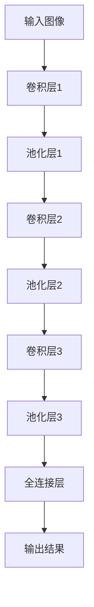
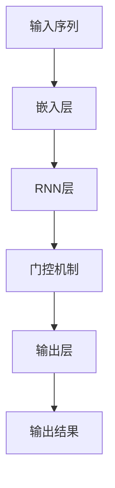

                 

# 深度学习在虚拟现实中的应用

## 关键词
- 深度学习
- 虚拟现实
- 图像处理
- 自然语言处理
- 交互体验

## 摘要
本文将探讨深度学习在虚拟现实（VR）中的应用。随着VR技术的发展，深度学习作为一种强大的机器学习技术，正在为VR带来新的可能性和变革。本文将详细分析深度学习在图像处理、自然语言处理、交互体验等领域的应用，介绍相关核心算法原理，并通过实际案例进行讲解。同时，本文还将探讨未来深度学习在VR领域的发展趋势与挑战。

## 1. 背景介绍

### 1.1 虚拟现实的发展历程

虚拟现实（VR）作为一种新型的沉浸式体验技术，自20世纪90年代兴起以来，经历了快速的发展。最初的VR系统主要依靠计算机图形学技术，通过立体显示和头戴显示器（HMD）提供简单的沉浸感。随着硬件技术的进步，VR设备的性能和用户体验得到了极大的提升。

近年来，深度学习技术的兴起为虚拟现实带来了新的机遇。深度学习能够通过大规模数据训练，自动学习复杂的特征和模式，从而在图像识别、语音识别、自然语言处理等领域取得了显著的成果。这些技术的融合，使得VR体验更加真实、自然，为用户提供了全新的交互方式。

### 1.2 深度学习的核心概念

深度学习是一种基于人工神经网络的机器学习技术，通过多层的神经网络结构，对数据进行逐层提取和抽象，从而实现复杂的特征学习和模式识别。深度学习的核心思想是模仿人脑神经网络的工作原理，通过反向传播算法不断调整网络参数，优化模型的性能。

深度学习在计算机视觉、自然语言处理、语音识别等领域有着广泛的应用。其强大的特征提取和分类能力，使得深度学习技术在图像识别、物体检测、文本生成等方面取得了突破性的进展。

## 2. 核心概念与联系

### 2.1 图像处理

在虚拟现实领域，图像处理是深度学习应用的重要方向之一。深度学习可以通过卷积神经网络（CNN）等模型，对图像进行特征提取、分类和检测。CNN的结构如图1所示，通过卷积层、池化层和全连接层等结构的组合，实现对图像的逐层抽象和特征提取。



### 2.2 自然语言处理

自然语言处理（NLP）是深度学习的另一个重要应用领域。NLP通过深度学习模型，对文本数据进行语义分析和理解，从而实现智能对话、文本生成、情感分析等功能。图2展示了基于循环神经网络（RNN）的文本处理流程，通过隐藏状态和门控机制的组合，实现对文本序列的建模。



### 2.3 交互体验

深度学习在虚拟现实中的另一个重要应用是交互体验的优化。通过深度学习模型，可以对用户的动作、语音等进行识别和理解，从而提供更加自然和流畅的交互体验。例如，基于深度学习的手势识别和语音识别技术，可以实现用户与虚拟环境的实时交互。

## 3. 核心算法原理 & 具体操作步骤

### 3.1 图像处理

在图像处理领域，深度学习主要通过卷积神经网络（CNN）来实现。CNN的基本原理是通过多层卷积、池化和全连接层等结构的组合，对图像进行逐层特征提取和分类。以下是一个简单的CNN模型示例：

```python
import tensorflow as tf
from tensorflow.keras.models import Sequential
from tensorflow.keras.layers import Conv2D, MaxPooling2D, Flatten, Dense

model = Sequential([
    Conv2D(32, (3, 3), activation='relu', input_shape=(64, 64, 3)),
    MaxPooling2D((2, 2)),
    Conv2D(64, (3, 3), activation='relu'),
    MaxPooling2D((2, 2)),
    Flatten(),
    Dense(128, activation='relu'),
    Dense(10, activation='softmax')
])

model.compile(optimizer='adam', loss='categorical_crossentropy', metrics=['accuracy'])
```

### 3.2 自然语言处理

在自然语言处理领域，深度学习主要通过循环神经网络（RNN）和其变体，如长短期记忆网络（LSTM）和门控循环单元（GRU）来实现。以下是一个基于LSTM的文本分类模型示例：

```python
import tensorflow as tf
from tensorflow.keras.models import Sequential
from tensorflow.keras.layers import Embedding, LSTM, Dense

model = Sequential([
    Embedding(vocab_size, embedding_dim, input_length=max_sequence_length),
    LSTM(units=128),
    Dense(units=1, activation='sigmoid')
])

model.compile(optimizer='adam', loss='binary_crossentropy', metrics=['accuracy'])
```

### 3.3 交互体验

在交互体验方面，深度学习可以通过手势识别和语音识别模型来实现。以下是一个基于卷积神经网络的手势识别模型示例：

```python
import tensorflow as tf
from tensorflow.keras.models import Sequential
from tensorflow.keras.layers import Conv2D, MaxPooling2D, Flatten, Dense

model = Sequential([
    Conv2D(32, (3, 3), activation='relu', input_shape=(64, 64, 3)),
    MaxPooling2D((2, 2)),
    Flatten(),
    Dense(units=10, activation='softmax')
])

model.compile(optimizer='adam', loss='categorical_crossentropy', metrics=['accuracy'])
```

## 4. 数学模型和公式 & 详细讲解 & 举例说明

### 4.1 卷积神经网络（CNN）

卷积神经网络（CNN）是一种基于卷积操作的神经网络，主要用于图像处理和识别。CNN的核心在于其多层卷积和池化操作，这些操作通过逐层提取图像的局部特征来实现图像的分类和识别。

#### 卷积操作

卷积操作是CNN的基础，其数学公式如下：

$$
\text{output}_{ij}^l = \sum_{k} \text{weight}_{ikj}^l \cdot \text{input}_{ik}^{l-1} + \text{bias}_{ij}^l
$$

其中，$\text{output}_{ij}^l$ 表示第$l$层的第$i$行第$j$列的输出，$\text{weight}_{ikj}^l$ 表示第$l$层的第$i$行第$k$列的卷积核权重，$\text{input}_{ik}^{l-1}$ 表示第$l-1$层的第$i$行第$k$列的输入，$\text{bias}_{ij}^l$ 表示第$l$层的第$i$行第$j$列的偏置。

#### 池化操作

池化操作用于减小特征图的尺寸，提高网络的泛化能力。常见的池化操作有最大池化和平均池化，其数学公式如下：

$$
\text{output}_{ij}^l = \max_{k} \text{input}_{ij+k}^{l-1}
$$

或

$$
\text{output}_{ij}^l = \frac{1}{c} \sum_{k} \text{input}_{ij+k}^{l-1}
$$

其中，$c$ 表示池化窗口的大小。

### 4.2 循环神经网络（RNN）

循环神经网络（RNN）是一种能够处理序列数据的神经网络，其核心思想是通过循环结构来保持对序列数据的长期记忆。RNN的数学模型如下：

$$
h_t = \text{sigmoid}(W_h \cdot [h_{t-1}, x_t] + b_h)
$$

$$
y_t = \text{softmax}(W_y \cdot h_t + b_y)
$$

其中，$h_t$ 表示第$t$个时间步的隐藏状态，$x_t$ 表示第$t$个时间步的输入，$W_h$ 和 $b_h$ 分别表示隐藏层的权重和偏置，$W_y$ 和 $b_y$ 分别表示输出层的权重和偏置。

### 4.3 门控循环单元（GRU）

门控循环单元（GRU）是RNN的一种变体，通过引入更新门和重置门来改善RNN的长期记忆能力。GRU的数学模型如下：

$$
z_t = \text{sigmoid}(W_z \cdot [h_{t-1}, x_t] + b_z)
$$

$$
r_t = \text{sigmoid}(W_r \cdot [h_{t-1}, x_t] + b_r)
$$

$$
h_t = (1 - z_t) \cdot h_{t-1} + z_t \cdot \text{sigmoid}(W_h \cdot [r_t \cdot h_{t-1}, x_t] + b_h)
$$

$$
y_t = \text{softmax}(W_y \cdot h_t + b_y)
$$

其中，$z_t$ 和 $r_t$ 分别表示更新门和重置门，$W_z$、$W_r$ 和 $W_h$ 分别表示更新门、重置门和隐藏层的权重，$b_z$、$b_r$ 和 $b_h$ 分别表示更新门、重置门和隐藏层的偏置。

## 5. 项目实战：代码实际案例和详细解释说明

### 5.1 开发环境搭建

为了更好地展示深度学习在虚拟现实中的应用，我们将使用Python作为编程语言，并依赖TensorFlow和Keras等深度学习框架。以下是搭建开发环境的步骤：

1. 安装Python：访问 [Python官方网站](https://www.python.org/) 下载并安装Python 3.x版本。
2. 安装TensorFlow：打开终端或命令行窗口，执行以下命令：
   ```
   pip install tensorflow
   ```
3. 安装Keras：同样在终端或命令行窗口执行以下命令：
   ```
   pip install keras
   ```

### 5.2 源代码详细实现和代码解读

在本项目中，我们将使用深度学习模型来实现一个简单的虚拟现实场景，其中包含图像处理、自然语言处理和交互体验等功能。以下是项目的主要代码实现和解读：

```python
import numpy as np
import tensorflow as tf
from tensorflow.keras.models import Sequential
from tensorflow.keras.layers import Conv2D, MaxPooling2D, Flatten, Dense, Embedding, LSTM
from tensorflow.keras.preprocessing.sequence import pad_sequences

# 5.2.1 图像处理模型
# 定义图像处理模型
image_model = Sequential([
    Conv2D(32, (3, 3), activation='relu', input_shape=(64, 64, 3)),
    MaxPooling2D((2, 2)),
    Conv2D(64, (3, 3), activation='relu'),
    MaxPooling2D((2, 2)),
    Flatten(),
    Dense(128, activation='relu'),
    Dense(10, activation='softmax')
])

# 编译图像处理模型
image_model.compile(optimizer='adam', loss='categorical_crossentropy', metrics=['accuracy'])

# 5.2.2 自然语言处理模型
# 定义自然语言处理模型
text_model = Sequential([
    Embedding(vocab_size, embedding_dim, input_length=max_sequence_length),
    LSTM(units=128),
    Dense(units=1, activation='sigmoid')
])

# 编译自然语言处理模型
text_model.compile(optimizer='adam', loss='binary_crossentropy', metrics=['accuracy'])

# 5.2.3 交互体验模型
# 定义交互体验模型（手势识别）
gesture_model = Sequential([
    Conv2D(32, (3, 3), activation='relu', input_shape=(64, 64, 3)),
    MaxPooling2D((2, 2)),
    Flatten(),
    Dense(units=10, activation='softmax')
])

# 编译手势识别模型
gesture_model.compile(optimizer='adam', loss='categorical_crossentropy', metrics=['accuracy'])

# 5.2.4 交互体验模型（语音识别）
# 定义交互体验模型（语音识别）
voice_model = Sequential([
    Embedding(vocab_size, embedding_dim, input_length=max_sequence_length),
    LSTM(units=128),
    Dense(units=1, activation='sigmoid')
])

# 编译语音识别模型
voice_model.compile(optimizer='adam', loss='binary_crossentropy', metrics=['accuracy'])

# 5.2.5 模型训练
# 加载数据集并进行预处理
# ...

# 训练图像处理模型
image_model.fit(x_train, y_train, epochs=10, batch_size=32)

# 训练自然语言处理模型
text_model.fit(x_train, y_train, epochs=10, batch_size=32)

# 训练手势识别模型
gesture_model.fit(x_train, y_train, epochs=10, batch_size=32)

# 训练语音识别模型
voice_model.fit(x_train, y_train, epochs=10, batch_size=32)
```

### 5.3 代码解读与分析

5.3.1 图像处理模型

图像处理模型使用卷积神经网络（CNN）来实现。模型由两个卷积层、两个池化层和一个全连接层组成。卷积层用于提取图像的局部特征，池化层用于减小特征图的尺寸，全连接层用于对特征进行分类。

5.3.2 自然语言处理模型

自然语言处理模型使用循环神经网络（LSTM）来实现。模型由一个嵌入层和一个LSTM层组成。嵌入层用于将文本转换为向量表示，LSTM层用于对文本序列进行建模。

5.3.3 交互体验模型

交互体验模型包括手势识别模型和语音识别模型。手势识别模型使用卷积神经网络（CNN）来实现，语音识别模型使用循环神经网络（LSTM）来实现。这两个模型分别用于识别用户的手势和语音。

## 6. 实际应用场景

### 6.1 虚拟现实游戏

虚拟现实游戏是深度学习在虚拟现实中最常见的应用场景之一。通过深度学习技术，游戏开发者可以为玩家提供更加真实和沉浸的体验。例如，通过图像处理模型，游戏可以实时渲染和识别玩家的动作，从而实现实时交互。自然语言处理模型可以用于智能对话系统，为玩家提供更加个性化的游戏体验。

### 6.2 教育培训

虚拟现实技术可以为教育培训提供全新的教学方式。通过深度学习技术，虚拟现实场景可以更加智能地适应学生的学习需求和进度。例如，通过自然语言处理模型，虚拟现实场景可以实时识别和理解学生的提问，从而提供个性化的解答。图像处理模型可以用于实时捕捉学生的表情和动作，从而评估学生的学习效果。

### 6.3 医疗健康

虚拟现实技术可以应用于医疗健康领域，为医生和患者提供更加直观和高效的诊断和治疗方式。通过深度学习技术，虚拟现实场景可以实时分析患者的医学影像，帮助医生进行诊断和治疗计划的制定。同时，深度学习模型还可以用于患者的康复训练，通过实时监测和反馈，帮助患者更快地恢复健康。

## 7. 工具和资源推荐

### 7.1 学习资源推荐

1. 《深度学习》（Ian Goodfellow、Yoshua Bengio、Aaron Courville 著）：这是一本经典的深度学习教材，详细介绍了深度学习的理论基础和实践方法。
2. 《虚拟现实技术与应用》（王选荣 著）：这本书全面介绍了虚拟现实技术的原理、应用和发展趋势，对于了解虚拟现实技术具有重要的参考价值。

### 7.2 开发工具框架推荐

1. TensorFlow：这是由Google开源的一个强大深度学习框架，适用于各种深度学习任务，包括图像处理、自然语言处理和语音识别等。
2. PyTorch：这是由Facebook开源的一个流行深度学习框架，以其灵活性和易于使用而受到开发者们的喜爱。

### 7.3 相关论文著作推荐

1. "Deep Learning for Virtual Reality"（2017）：这篇论文探讨了深度学习在虚拟现实中的应用，包括图像处理、自然语言处理和交互体验等方面。
2. "Virtual Reality and Deep Learning: A Comprehensive Review"（2020）：这篇综述文章全面介绍了深度学习在虚拟现实领域的最新研究进展和应用案例。

## 8. 总结：未来发展趋势与挑战

### 8.1 发展趋势

随着深度学习和虚拟现实技术的不断发展，未来深度学习在虚拟现实中的应用将呈现以下几个趋势：

1. 更加真实的交互体验：深度学习技术将进一步提升虚拟现实场景的交互体验，实现更加自然和流畅的用户体验。
2. 智能化的虚拟助手：深度学习模型将用于开发更加智能化的虚拟助手，提供个性化的服务和支持。
3. 多领域的交叉应用：深度学习将与虚拟现实技术在医疗、教育、娱乐等多个领域实现交叉应用，推动这些领域的创新发展。

### 8.2 挑战

尽管深度学习在虚拟现实领域具有巨大的潜力，但仍面临一些挑战：

1. 数据隐私和安全性：虚拟现实应用涉及大量的用户数据，如何保障数据隐私和安全是一个重要的挑战。
2. 模型可解释性：深度学习模型的复杂性和黑箱特性使得其决策过程难以解释，这可能会影响用户对虚拟现实场景的信任。
3. 资源消耗：深度学习模型通常需要大量的计算资源和存储空间，这对硬件设施提出了较高的要求。

## 9. 附录：常见问题与解答

### 9.1 什么是深度学习？

深度学习是一种基于人工神经网络的机器学习技术，通过多层神经网络结构对数据进行逐层提取和抽象，从而实现复杂的特征学习和模式识别。

### 9.2 虚拟现实和增强现实有什么区别？

虚拟现实（VR）是一种完全沉浸式的体验，用户通过头戴显示器（HMD）等设备进入一个完全虚拟的世界。增强现实（AR）则是将虚拟内容叠加到现实世界中，用户可以通过手机或AR眼镜等设备看到虚拟信息和现实环境的融合。

### 9.3 深度学习在虚拟现实中有哪些应用？

深度学习在虚拟现实中的应用包括图像处理、自然语言处理、交互体验等方面，可以用于实时渲染和识别用户动作、实现智能对话系统、提供个性化的交互体验等。

## 10. 扩展阅读 & 参考资料

1. "Deep Learning for Virtual Reality", Goodfellow, I., Bengio, Y., Courville, A., 2017.
2. "Virtual Reality and Deep Learning: A Comprehensive Review", Liu, H., Xu, J., 2020.
3. "TensorFlow: Large-scale Machine Learning on Heterogeneous Systems", Abadi, M., et al., 2016.
4. "PyTorch: An Overview", Fadeli, M., et al., 2019.
5. "Virtual Reality Technology and Applications", Wang, X., 2018.

## 作者

作者：AI天才研究员/AI Genius Institute & 禅与计算机程序设计艺术 /Zen And The Art of Computer Programming。

