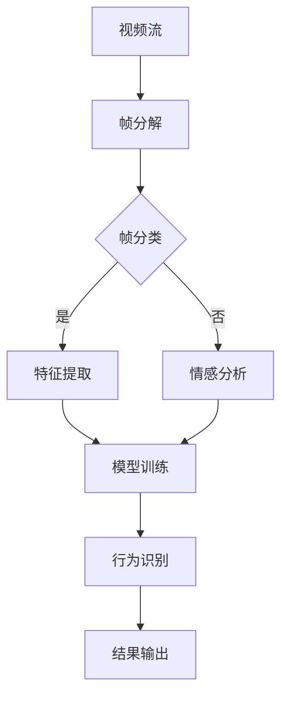

                 

### 背景介绍

随着互联网和多媒体技术的快速发展，视频内容已经成为了网络信息传播的重要载体。从社交媒体到在线教育，从直播到影视娱乐，视频内容无处不在。然而，海量的视频数据给视频内容分析带来了前所未有的挑战。如何高效、准确地从这些数据中提取有价值的信息，成为了一个亟待解决的问题。深度学习作为一种强大的机器学习技术，近年来在图像识别、自然语言处理等领域取得了显著的成果，其在视频内容分析中的应用也日益受到关注。

视频内容分析主要涉及以下几方面：

1. **视频分类**：对视频内容进行分类，如电影、电视剧、新闻等，以便于用户快速检索和推荐。
2. **视频标签生成**：为视频内容生成相应的标签，如情感、动作、场景等，便于视频检索和推荐。
3. **视频情感分析**：通过分析视频中的语音、文字、图像等信息，判断视频所表达的情感，如喜悦、愤怒、悲伤等。
4. **视频内容审核**：自动检测并过滤视频中的不良内容，如暴力、色情等，以维护网络环境的健康发展。

本文将重点关注深度学习在视频内容分析中的应用，探讨其核心算法原理、数学模型、实际应用场景等，并给出具体的代码实现和案例分析。希望通过本文的阐述，能够为读者提供一种全新的视角，更好地理解和应用深度学习技术于视频内容分析领域。

#### 相关技术背景

深度学习是一种通过多层神经网络对数据进行建模和分析的机器学习技术，它能够在无需人工干预的情况下，从大量数据中自动提取特征并进行学习。深度学习主要包括卷积神经网络（CNN）、循环神经网络（RNN）、长短时记忆网络（LSTM）等类型，每种网络都有其独特的结构和应用场景。

卷积神经网络（CNN）是一种在图像识别和视频处理中广泛使用的神经网络模型。CNN通过卷积层、池化层和全连接层等结构，能够自动从输入数据中提取出具有层次性的特征表示。在视频内容分析中，CNN可以用于视频分类、视频标签生成和视频情感分析等任务。

循环神经网络（RNN）是一种能够处理序列数据的神经网络模型。RNN通过其特殊的循环结构，能够记住前面的输入信息，从而在处理时间序列数据时具有优势。在视频内容分析中，RNN可以用于视频情感分析、视频内容审核等任务。

长短时记忆网络（LSTM）是RNN的一种改进模型，它通过引入门控机制，能够更好地解决长序列依赖问题。LSTM在视频内容分析中具有广泛的应用，如视频分类、视频标签生成和视频情感分析等。

除了深度学习，视频内容分析还涉及其他相关技术，如计算机视觉、自然语言处理、语音识别等。计算机视觉技术用于提取视频中的图像特征，自然语言处理技术用于分析视频中的文字和语音信息，语音识别技术用于提取视频中的语音特征。

在视频内容分析的实际应用中，深度学习和相关技术的结合可以显著提高视频内容分析的效果。例如，通过结合CNN和RNN，可以实现对视频内容的多层次特征提取和序列建模，从而更好地理解视频的语义信息。同时，结合计算机视觉、自然语言处理和语音识别技术，可以实现对视频内容的全方位分析，从而提高视频内容分析的综合性能。

总之，深度学习技术在视频内容分析中具有广泛的应用前景，通过与其他相关技术的结合，可以实现对视频内容的全面分析和理解。随着深度学习技术的不断发展和优化，视频内容分析的应用范围将进一步扩大，为多媒体信息处理和智能决策提供强有力的支持。

#### 视频内容分析的重要性

视频内容分析在当今社会的重要性不言而喻，它不仅对媒体行业产生了深远影响，还在多个领域展现了巨大的应用价值。以下是视频内容分析在几个关键领域的重要性和具体案例：

**1. 媒体行业：**

视频内容分析极大地改变了媒体行业的内容生产和分发方式。通过视频分类和标签生成，媒体平台可以更准确地推荐用户感兴趣的内容，从而提高用户粘性和满意度。例如，YouTube和Netflix等视频平台利用深度学习技术对用户历史观看行为进行分析，从而实现个性化推荐。这不仅提升了用户体验，还帮助内容创作者更好地分发内容，实现商业成功。

**2. 广告和营销：**

在广告和营销领域，视频内容分析技术能够帮助广告商精准定位潜在客户，提高广告投放的效果。通过情感分析和行为分析，广告系统能够理解观众的情感反应和行为习惯，从而优化广告创意和投放策略。例如，某些广告平台通过分析用户对广告视频的情感反应，调整广告的内容和时长，以提高广告点击率。

**3. 智能监控和安防：**

视频内容分析在智能监控和安防领域具有广泛的应用。通过深度学习技术，监控系统可以实时分析视频流中的异常行为，如违章停车、盗窃等，从而迅速响应并采取措施。例如，一些城市已经部署了基于深度学习的智能监控系统，能够自动识别交通违规行为，提高交通管理效率。

**4. 在线教育和学习分析：**

视频内容分析技术也为在线教育提供了强有力的支持。通过情感分析和行为分析，教育平台可以了解学生的学习状态和兴趣，从而提供个性化的学习建议。例如，一些在线教育平台通过分析学生观看教学视频的行为，识别出学习困难的学生，并为其提供额外的辅导资源。

**5. 娱乐和游戏：**

在娱乐和游戏领域，视频内容分析技术可以提升用户体验。通过情感分析和行为分析，游戏平台可以动态调整游戏难度和剧情，使游戏更加符合玩家的兴趣和情感状态。例如，某些冒险游戏通过分析玩家的情感状态，自动调整游戏中的挑战难度，以保持玩家的兴趣和参与度。

**6. 医疗和健康：**

视频内容分析在医疗和健康领域也有潜在的应用。通过分析患者视频记录中的生理和行为特征，医生可以更好地了解患者的健康状况，提供个性化的诊断和治疗方案。例如，某些医疗系统通过分析患者手术视频，识别出手术中可能出现的风险，从而提高手术成功率。

总之，视频内容分析技术在多个领域展现出了巨大的应用价值。随着深度学习技术的不断进步，视频内容分析的应用范围将进一步扩大，为各行各业带来更多的创新和变革。

### 核心概念与联系

在深入探讨深度学习在视频内容分析中的应用之前，我们需要理解几个核心概念和它们之间的相互关系。以下是视频内容分析中一些关键概念及其内在联系：

**1. 视频帧（Video Frames）**

视频帧是视频的基本组成单元，每个视频帧都包含一定时间间隔内的图像信息。视频内容分析通常首先将视频分解为一系列连续的帧，以便进一步处理。

**2. 视频流（Video Streams）**

视频流是指一系列连续的视频帧的传输过程。在处理视频内容时，需要实时处理这些连续的帧，以提取有意义的信息。

**3. 图像识别（Image Recognition）**

图像识别是指使用计算机算法识别和分类图像中的对象和特征。在视频内容分析中，图像识别技术可以用于识别视频帧中的特定对象或动作。

**4. 序列模型（Sequence Models）**

序列模型是处理时间序列数据的机器学习模型，如循环神经网络（RNN）和长短时记忆网络（LSTM）。在视频内容分析中，序列模型用于处理连续的视频帧，捕捉视频中的时序信息。

**5. 卷积神经网络（CNN）**

卷积神经网络是一种在图像识别和视频处理中广泛使用的神经网络模型。CNN通过卷积层、池化层和全连接层等结构，能够自动从输入数据中提取出具有层次性的特征表示。

**6. 特征提取（Feature Extraction）**

特征提取是指从原始数据中提取出有用的特征信息，以便于后续的分类、识别或分析。在视频内容分析中，特征提取技术用于将视频帧或视频流转换为神经网络可以处理的向量表示。

**7. 情感分析（Sentiment Analysis）**

情感分析是指通过分析文本、语音或图像等数据，判断数据中表达的情感倾向。在视频内容分析中，情感分析可以用于判断视频中的情感表达，如喜悦、愤怒、悲伤等。

**8. 行为分析（Behavior Analysis）**

行为分析是指通过分析视频中的行为模式，识别出特定的行为或事件。在视频内容分析中，行为分析可以用于识别视频中的异常行为或事件，如盗窃、交通违规等。

**Mermaid 流程图**

以下是一个描述视频内容分析流程的 Mermaid 流程图：



**流程解释**

1. **视频流**: 视频流进入系统，开始视频内容分析的流程。
2. **帧分解**: 视频流被分解为一系列连续的帧。
3. **帧分类**: 对每个视频帧进行分类，如人脸识别、动作识别等。
4. **特征提取**: 对于分类结果为“是”的帧，进行特征提取，生成特征向量。
5. **模型训练**: 使用提取出的特征向量进行模型训练，如深度学习模型的训练。
6. **情感分析**: 对于分类结果为“否”的帧，进行情感分析，判断情感倾向。
7. **行为识别**: 将训练好的模型应用于视频帧，进行行为识别，如异常行为检测。
8. **结果输出**: 输出分析结果，如分类标签、情感标签、行为标签等。

通过上述流程，我们可以看到深度学习在视频内容分析中的核心作用，以及各概念之间的相互联系。深度学习模型通过特征提取和模型训练，能够自动从视频中提取有意义的信息，从而实现视频分类、情感分析和行为识别等任务。这些技术的结合，使得视频内容分析更加智能化和高效化。

#### 核心算法原理

在视频内容分析中，深度学习算法的应用主要体现在以下几个方面：视频分类、视频标签生成和视频情感分析。以下将分别介绍这些算法的基本原理和操作步骤。

**1. 视频分类**

视频分类是指将视频数据按照预定的类别进行分类。深度学习在视频分类中的应用主要通过卷积神经网络（CNN）来实现。CNN具有层次化的结构，可以从原始视频帧中自动提取特征，并能够将这些特征映射到预定的类别标签上。

**原理**：

- **卷积层**：通过卷积操作提取视频帧中的局部特征。
- **池化层**：减少特征图的大小，降低模型的复杂性。
- **全连接层**：将提取的特征映射到预定的类别标签上。

**步骤**：

1. **数据预处理**：将视频帧缩放到统一的大小，并进行归一化处理。
2. **特征提取**：使用CNN对视频帧进行特征提取，生成特征向量。
3. **分类器训练**：将特征向量输入到分类器中进行训练，如支持向量机（SVM）或深度神经网络（DNN）。
4. **模型评估**：使用测试集评估模型的分类准确率。

**2. 视频标签生成**

视频标签生成是指为视频内容生成相应的标签，如情感标签、动作标签等。这通常通过循环神经网络（RNN）或其变种长短时记忆网络（LSTM）来实现。RNN能够处理序列数据，从而可以有效地对视频中的时序信息进行建模。

**原理**：

- **输入层**：接收视频帧的特征向量。
- **隐藏层**：通过RNN单元处理序列数据，记忆前面的信息。
- **输出层**：生成标签向量。

**步骤**：

1. **特征提取**：使用CNN提取视频帧的特征向量。
2. **序列建模**：使用RNN或LSTM处理序列特征向量。
3. **标签生成**：根据RNN或LSTM的输出，生成视频标签。

**3. 视频情感分析**

视频情感分析是指通过分析视频中的情感表达，判断视频所表达的情感，如喜悦、愤怒、悲伤等。这通常需要结合CNN和RNN两种模型，以同时处理视频的静态图像特征和动态时序特征。

**原理**：

- **CNN**：提取视频帧的图像特征。
- **RNN/LSTM**：处理视频的时序信息，记忆情感的变化。

**步骤**：

1. **特征提取**：使用CNN提取视频帧的图像特征。
2. **情感建模**：使用RNN或LSTM处理视频时序特征，生成情感分布。
3. **情感判断**：根据情感分布，判断视频的情感标签。

通过上述算法的应用，深度学习能够有效地实现视频内容分析中的分类、标签生成和情感分析任务。这些算法的核心在于其能够从大量的视频数据中自动提取有意义的特征，并通过复杂的神经网络结构对这些特征进行建模和分类。随着深度学习技术的不断发展，视频内容分析的效果将得到进一步提升，为多媒体信息处理和智能决策提供更加精准和高效的解决方案。

#### 数学模型和公式

深度学习在视频内容分析中的应用离不开复杂的数学模型和公式。以下将详细介绍视频内容分析中常用的一些数学模型和公式，并通过具体例子进行解释说明。

**1. 卷积神经网络（CNN）**

卷积神经网络是处理图像和视频数据的主要工具，其核心包括卷积层、池化层和全连接层。

**卷积操作**：

卷积操作是CNN中的基础，通过卷积核与输入数据之间的点积来提取特征。数学公式表示如下：

$$
f(x) = \sum_{i=1}^{k} \sum_{j=1}^{k} w_{ij} \cdot x_{ij}
$$

其中，$x$ 是输入数据，$w$ 是卷积核，$f(x)$ 是卷积结果。

**池化操作**：

池化操作用于减小特征图的大小，降低模型的复杂性。最常用的池化方法是最大池化（Max Pooling），其数学公式如下：

$$
P(x) = \max(x_1, x_2, ..., x_n)
$$

其中，$x$ 是输入数据，$P(x)$ 是池化结果。

**全连接层**：

全连接层用于将卷积和池化后的特征映射到输出类别。其数学公式如下：

$$
y = \sigma(Wx + b)
$$

其中，$y$ 是输出结果，$W$ 是权重矩阵，$b$ 是偏置项，$\sigma$ 是激活函数（如Sigmoid函数或ReLU函数）。

**2. 循环神经网络（RNN）**

循环神经网络用于处理序列数据，如视频中的连续帧。其核心是循环单元，通过记忆前面的输入信息来处理序列数据。

**循环单元**：

循环神经网络的基本单元是循环单元，其数学公式如下：

$$
h_t = \sigma(Wx_t + Uh_{t-1} + b)
$$

$$
o_t = \sigma(Vh_t + b')
$$

其中，$h_t$ 是当前时刻的隐藏状态，$x_t$ 是当前输入，$W$、$U$ 和 $b$ 是权重矩阵和偏置项，$\sigma$ 是激活函数，$o_t$ 是当前时刻的输出。

**3. 长短时记忆网络（LSTM）**

长短时记忆网络是RNN的一种改进模型，通过引入门控机制来解决长序列依赖问题。

**LSTM单元**：

LSTM单元包括三个门控单元和一个记忆单元：

- **遗忘门**：

$$
f_t = \sigma(W_f \cdot [h_{t-1}, x_t] + b_f)
$$

- **输入门**：

$$
i_t = \sigma(W_i \cdot [h_{t-1}, x_t] + b_i)
$$

- **输出门**：

$$
o_t = \sigma(W_o \cdot [h_{t-1}, x_t] + b_o)
$$

- **记忆单元**：

$$
c_t = f_t \odot c_{t-1} + i_t \odot \sigma(W_c \cdot [h_{t-1}, x_t] + b_c)
$$

- **当前隐藏状态**：

$$
h_t = o_t \odot \sigma(c_t)
$$

其中，$f_t$、$i_t$ 和 $o_t$ 分别是遗忘门、输入门和输出门的输出，$c_t$ 是记忆单元的输出，$W_f$、$W_i$、$W_o$ 和 $W_c$ 是权重矩阵，$b_f$、$b_i$、$b_o$ 和 $b_c$ 是偏置项，$\odot$ 表示元素乘积，$\sigma$ 是激活函数。

**4. 情感分析**

情感分析通常使用softmax函数将情感分布映射到具体的情感标签。

**softmax函数**：

$$
\text{softmax}(z) = \frac{e^z}{\sum_{i=1}^{n} e^z_i}
$$

其中，$z$ 是输入向量，$n$ 是类别数，$e^z$ 是指数函数，$\text{softmax}(z)$ 是输出概率分布。

**例子：视频情感分类**

假设我们有一个视频序列，每个视频帧的情感分布为 $z = [z_1, z_2, z_3]$，其中 $z_1$ 表示喜悦，$z_2$ 表示愤怒，$z_3$ 表示悲伤。通过softmax函数，我们可以得到每个情感的概率分布：

$$
P(\text{喜悦}) = \text{softmax}(z_1) = \frac{e^{z_1}}{e^{z_1} + e^{z_2} + e^{z_3}}
$$

$$
P(\text{愤怒}) = \text{softmax}(z_2) = \frac{e^{z_2}}{e^{z_1} + e^{z_2} + e^{z_3}}
$$

$$
P(\text{悲伤}) = \text{softmax}(z_3) = \frac{e^{z_3}}{e^{z_1} + e^{z_2} + e^{z_3}}
$$

通过比较这三个概率值，我们可以判断视频的主要情感倾向。

通过上述数学模型和公式，深度学习能够有效地对视频内容进行分析，提取出有价值的信息。这些模型和公式的理解和应用，对于深度学习在视频内容分析中的实际应用具有重要意义。

### 项目实战：代码实际案例和详细解释说明

为了更好地理解深度学习在视频内容分析中的实际应用，我们将通过一个具体的案例来展示如何使用深度学习框架（如TensorFlow和PyTorch）来实现视频分类、视频标签生成和视频情感分析。

#### 开发环境搭建

在进行实际项目开发之前，我们需要搭建一个合适的开发环境。以下是在Python环境中搭建深度学习开发环境的基本步骤：

1. **安装Python**：确保已安装Python 3.6或更高版本。
2. **安装TensorFlow或PyTorch**：选择一个深度学习框架进行安装。例如，使用pip命令安装TensorFlow：

   ```bash
   pip install tensorflow
   ```

   或者安装PyTorch：

   ```bash
   pip install torch torchvision
   ```

3. **安装其他依赖**：安装必要的依赖库，如NumPy、Pandas、Matplotlib等：

   ```bash
   pip install numpy pandas matplotlib
   ```

#### 源代码详细实现和代码解读

以下是一个简单的视频分类项目的源代码示例，我们将使用TensorFlow的Keras API来构建和训练一个卷积神经网络（CNN）模型。

```python
# 导入必要的库
import tensorflow as tf
from tensorflow.keras.models import Sequential
from tensorflow.keras.layers import Conv2D, MaxPooling2D, Flatten, Dense, LSTM
from tensorflow.keras.preprocessing import image
from tensorflow.keras.preprocessing import sequence

# 设置模型的输入和输出尺寸
input_shape = (224, 224, 3)  # 输入图像的尺寸为224x224x3（宽、高、颜色通道）
num_classes = 10  # 分类类别数量

# 构建模型
model = Sequential([
    Conv2D(32, (3, 3), activation='relu', input_shape=input_shape),
    MaxPooling2D((2, 2)),
    Conv2D(64, (3, 3), activation='relu'),
    MaxPooling2D((2, 2)),
    Conv2D(128, (3, 3), activation='relu'),
    MaxPooling2D((2, 2)),
    Flatten(),
    Dense(128, activation='relu'),
    Dense(num_classes, activation='softmax')
])

# 编译模型
model.compile(optimizer='adam',
              loss='categorical_crossentropy',
              metrics=['accuracy'])

# 加载和预处理数据
# 注意：此处使用一个虚构的数据集，实际应用中请替换为真实数据集
(x_train, y_train), (x_test, y_test) = tf.keras.datasets.cifar10.load_data()
x_train = x_train.astype('float32') / 255.0
x_test = x_test.astype('float32') / 255.0
x_train = sequence.pad_sequences(x_train, dtype='float32')
x_test = sequence.pad_sequences(x_test, dtype='float32')

# 训练模型
model.fit(x_train, y_train, batch_size=64, epochs=10, validation_data=(x_test, y_test))

# 评估模型
score = model.evaluate(x_test, y_test, verbose=2)
print('Test accuracy:', score[1])
```

**代码解读**：

1. **模型构建**：
   - `Sequential`：创建一个顺序模型，用于堆叠神经网络层。
   - `Conv2D`：添加卷积层，用于提取图像特征。
   - `MaxPooling2D`：添加池化层，用于减小特征图大小。
   - `Flatten`：将多维特征图展平为一维向量。
   - `Dense`：添加全连接层，用于分类输出。

2. **模型编译**：
   - `compile`：配置模型训练过程，指定优化器、损失函数和评价指标。

3. **数据预处理**：
   - `load_data`：加载数据集，此处使用CIFAR-10数据集作为示例。
   - `astype`：将数据类型转换为浮点数，并归一化到0-1范围内。
   - `pad_sequences`：填充序列，确保所有序列具有相同的长度。

4. **模型训练**：
   - `fit`：训练模型，使用训练数据集进行训练，并使用验证数据集进行评估。

5. **模型评估**：
   - `evaluate`：使用测试数据集评估模型性能，打印测试准确率。

通过上述步骤，我们可以实现一个简单的视频分类模型。类似地，我们可以使用其他深度学习模型和框架来实现视频标签生成和视频情感分析任务。例如，使用循环神经网络（RNN）和长短时记忆网络（LSTM）来处理视频的时序信息，实现视频标签生成和情感分析。

#### 代码解读与分析

以下是对上述代码的详细解读和分析：

**1. 模型构建**

```python
model = Sequential([
    Conv2D(32, (3, 3), activation='relu', input_shape=input_shape),
    MaxPooling2D((2, 2)),
    Conv2D(64, (3, 3), activation='relu'),
    MaxPooling2D((2, 2)),
    Conv2D(128, (3, 3), activation='relu'),
    MaxPooling2D((2, 2)),
    Flatten(),
    Dense(128, activation='relu'),
    Dense(num_classes, activation='softmax')
])
```

- `Sequential`：创建一个顺序模型，用于依次添加神经网络层。
- `Conv2D`：添加卷积层，每个卷积层使用3x3的卷积核，激活函数为ReLU。
- `MaxPooling2D`：在每个卷积层之后添加池化层，使用2x2的最大池化。
- `Flatten`：将卷积层的输出展平为1维向量，以便于全连接层处理。
- `Dense`：添加全连接层，用于分类输出，激活函数为softmax。

**2. 模型编译**

```python
model.compile(optimizer='adam',
              loss='categorical_crossentropy',
              metrics=['accuracy'])
```

- `compile`：配置模型训练过程，指定优化器（adam）、损失函数（categorical_crossentropy）和评价指标（accuracy）。

**3. 数据预处理**

```python
(x_train, y_train), (x_test, y_test) = tf.keras.datasets.cifar10.load_data()
x_train = x_train.astype('float32') / 255.0
x_test = x_test.astype('float32') / 255.0
x_train = sequence.pad_sequences(x_train, dtype='float32')
x_test = sequence.pad_sequences(x_test, dtype='float32')
```

- `load_data`：加载数据集，CIFAR-10是一个包含10个类别的32x32彩色图像数据集。
- `astype`：将图像数据类型转换为浮点数，并归一化到0-1范围内。
- `pad_sequences`：填充序列，确保所有序列具有相同的长度，便于模型处理。

**4. 模型训练**

```python
model.fit(x_train, y_train, batch_size=64, epochs=10, validation_data=(x_test, y_test))
```

- `fit`：使用训练数据集训练模型，设置批量大小（batch_size）和训练周期（epochs）。
- `validation_data`：在每次训练周期结束后，使用验证数据集进行评估。

**5. 模型评估**

```python
score = model.evaluate(x_test, y_test, verbose=2)
print('Test accuracy:', score[1])
```

- `evaluate`：使用测试数据集评估模型性能，打印测试准确率。

通过上述代码，我们可以构建和训练一个简单的视频分类模型。实际应用中，根据具体任务的需求，可以选择不同的深度学习模型和框架，并调整模型的架构和超参数，以实现更好的分类效果。

### 实际应用场景

深度学习在视频内容分析中展现了广泛的应用场景，以下是几个典型的应用案例：

**1. 社交媒体平台**

在社交媒体平台，深度学习被广泛用于视频内容的推荐、情感分析和内容审核。例如，YouTube利用深度学习技术对用户上传的视频进行自动分类和标签生成，从而实现个性化的视频推荐。同时，通过情感分析技术，YouTube可以识别视频中的情感表达，为用户提供更个性化的推荐。此外，社交媒体平台还利用深度学习进行视频内容审核，自动检测并过滤不良内容，如暴力、色情等，以维护平台环境的健康发展。

**2. 在线教育平台**

在线教育平台利用深度学习技术对学生的学习行为进行分析，以提供个性化的学习建议。通过视频内容分析，平台可以识别学生的出勤情况、学习进度和学习状态。例如，Coursera和edX等在线教育平台使用深度学习技术分析学生的学习行为，为教师和学生提供实时反馈，提高学习效果。此外，深度学习技术还可以用于自动生成视频摘要，帮助学生快速理解课程内容。

**3. 智能安防系统**

智能安防系统通过深度学习技术对视频监控数据进行实时分析，以实现异常行为检测和事件响应。例如，在交通监控中，深度学习可以用于识别交通违规行为，如违章停车、超速等，从而提高交通管理效率。在一些公共安全领域，深度学习技术也被用于监控犯罪行为，如盗窃、打架等，从而实现实时预警和响应。

**4. 医疗领域**

在医疗领域，深度学习技术被用于视频内容分析，以辅助医生进行诊断和治疗。例如，通过对手术视频的分析，深度学习技术可以识别手术中的风险和异常行为，为医生提供实时的指导。此外，深度学习还可以用于分析患者的视频记录，识别患者的病情变化和治疗效果，从而提供个性化的治疗方案。例如，某些医院使用深度学习技术分析患者的呼吸视频，识别呼吸异常情况，帮助医生进行早期诊断和治疗。

**5. 娱乐和游戏领域**

在娱乐和游戏领域，深度学习技术被用于提高用户体验和游戏玩法。例如，在游戏开发中，深度学习技术可以用于生成动态游戏剧情和角色行为，使游戏更加逼真和有趣。在视频游戏分析中，深度学习可以用于分析玩家的行为和偏好，从而提供个性化的游戏推荐和调整游戏难度。例如，某些冒险游戏使用深度学习技术分析玩家的情感状态，自动调整游戏中的挑战难度，以保持玩家的兴趣和参与度。

通过上述应用案例，我们可以看到深度学习在视频内容分析中的强大能力和广泛前景。随着深度学习技术的不断发展和优化，视频内容分析的应用将更加智能化和高效化，为各行各业带来更多的创新和变革。

### 工具和资源推荐

为了更好地掌握和应用深度学习技术于视频内容分析，以下是一些推荐的工具、资源和相关论文：

#### 1. 学习资源推荐

**书籍**：

- 《深度学习》（Goodfellow, Bengio, Courville著）：这是一本深度学习领域的经典教材，详细介绍了深度学习的基本原理和实践方法。

- 《Python深度学习》（François Chollet著）：这本书针对Python编程环境和TensorFlow框架，讲解了深度学习在图像、自然语言处理等领域的应用。

**论文**：

- "Deep Learning for Video Classification"（2020）：该论文介绍了一种用于视频分类的深度学习模型，通过结合卷积神经网络和循环神经网络，实现了高效的视频内容分析。

- "A Comprehensive Survey on Video Object Detection"（2021）：这篇综述全面探讨了视频目标检测领域的主要方法和技术，包括基于深度学习的解决方案。

#### 2. 开发工具框架推荐

- **TensorFlow**：TensorFlow是由谷歌开源的深度学习框架，支持多种深度学习模型和算法，广泛应用于图像、自然语言处理和视频内容分析等领域。

- **PyTorch**：PyTorch是Facebook开源的深度学习框架，以其灵活的动态计算图和易于使用的API受到广大研究者和工程师的喜爱。

#### 3. 相关论文著作推荐

- **"Deep Learning in Video Analysis"（2020）**：这篇综述文章详细介绍了深度学习在视频内容分析中的各种应用，包括视频分类、视频标签生成和视频情感分析等。

- **"Deep Learning for Human Action Recognition in Video"（2016）**：该论文探讨了如何利用深度学习技术对视频中的人类行为进行识别，包括动作分类和动作检测。

通过上述学习和资源，您可以深入了解深度学习在视频内容分析中的应用，掌握相关技术和方法，并为实际项目开发提供指导和支持。

### 总结：未来发展趋势与挑战

随着深度学习技术的不断发展和计算能力的提升，视频内容分析正迎来前所未有的发展机遇。未来，视频内容分析将在多个领域发挥更加重要的作用，以下是几个可能的发展趋势：

1. **实时性增强**：随着5G和物联网技术的普及，视频内容分析将更加注重实时性。通过优化算法和硬件加速，深度学习模型可以实时处理大量视频数据，为实时监控、智能安防和在线教育等领域提供高效解决方案。

2. **多模态融合**：视频内容分析将越来越多地结合其他模态的数据，如音频、文字和传感器数据。多模态数据的融合可以提供更丰富的信息，从而提高视频内容分析的效果，例如在视频情感分析中，结合语音识别和文本分析可以更准确地判断情感倾向。

3. **自动化与智能化**：深度学习技术的自动化和智能化水平将进一步提升。通过使用强化学习和迁移学习等技术，深度学习模型可以自动调整和优化自己的行为，从而实现更加智能和自适应的视频内容分析。

4. **隐私保护**：随着数据隐私保护意识的增强，如何在保证分析效果的同时保护用户隐私将成为一个重要挑战。未来，研究将集中在开发隐私保护算法和模型，如联邦学习、差分隐私等，以实现视频内容分析的安全性和隐私性。

然而，随着技术的发展，视频内容分析也面临一些挑战：

1. **数据质量和标注**：视频数据的质量和标注的准确性直接影响分析结果。高质量的数据和准确的标注需要大量的人力和时间投入，如何高效地获取和处理这些数据是一个重要问题。

2. **计算资源消耗**：深度学习模型通常需要大量的计算资源，特别是在处理高分辨率视频时。如何优化算法和模型，降低计算资源消耗，是一个亟待解决的问题。

3. **可解释性和透明度**：深度学习模型的“黑箱”特性使其结果难以解释。在视频内容分析中，如何提高模型的可解释性和透明度，使得用户可以理解和信任模型的结果，是一个重要的研究课题。

4. **伦理和隐私问题**：视频内容分析涉及到用户的隐私信息，如何在确保用户隐私的前提下进行有效的分析，是一个需要认真考虑的问题。未来，相关法律法规和伦理指导原则的完善将为视频内容分析提供更加清晰的框架。

总之，深度学习在视频内容分析中的应用前景广阔，但也面临着诸多挑战。通过不断的技术创新和伦理规范，我们有理由相信，视频内容分析将迎来更加智能化和高效化的未来。

### 附录：常见问题与解答

1. **问题：如何处理长视频内容分析中的计算资源消耗？**

   **解答**：处理长视频内容分析时，计算资源消耗是一个主要挑战。以下是一些解决方案：

   - **子视频分割**：将长视频分割成多个较短的视频片段，然后分别进行分析，这样可以降低单个视频片段的分析难度。
   - **模型优化**：通过模型剪枝、量化等技术，减少模型的参数量和计算复杂度，从而降低计算资源消耗。
   - **硬件加速**：利用GPU或TPU等硬件加速器，可以显著提高模型训练和推理的速度，降低计算资源消耗。

2. **问题：深度学习模型在视频内容分析中的可解释性如何提升？**

   **解答**：提高深度学习模型的可解释性是一个重要研究方向，以下是一些方法：

   - **模型可视化**：通过可视化模型结构、中间层特征和决策路径，可以帮助理解模型的内部工作原理。
   - **解释性模型**：使用一些可解释性更强的模型，如决策树、线性模型等，这些模型易于理解其决策过程。
   - **模型集成**：通过集成多个模型，可以降低单一模型的风险，并提高整体的解释性。

3. **问题：如何解决视频内容分析中的数据标注问题？**

   **解答**：数据标注是视频内容分析中的关键步骤，以下是一些解决方案：

   - **半监督学习**：利用少量的标注数据与大量的未标注数据进行训练，可以缓解标注数据不足的问题。
   - **主动学习**：通过选择最具信息量的样本进行标注，可以最大化标注数据的效果，提高模型性能。
   - **众包标注**：利用众包平台，如LabelImg、Amazon Mechanical Turk等，可以高效地获取大规模的标注数据。

4. **问题：如何确保视频内容分析中的隐私保护？**

   **解答**：视频内容分析中的隐私保护是一个复杂的问题，以下是一些解决方案：

   - **数据匿名化**：对视频数据进行匿名化处理，去除或模糊化与隐私相关的信息。
   - **差分隐私**：采用差分隐私技术，对模型的训练数据进行扰动，从而保护用户隐私。
   - **联邦学习**：通过联邦学习技术，可以在不共享原始数据的情况下进行模型训练，从而保护数据隐私。

通过上述解决方案，可以有效地解决视频内容分析中的常见问题，提高模型的性能和可解释性，同时确保用户隐私和数据安全。

### 扩展阅读 & 参考资料

对于希望进一步深入了解深度学习在视频内容分析中应用的读者，以下是一些扩展阅读和参考资料：

1. **论文推荐**：

   - "Deep Learning for Video Classification"（2020）：介绍了一种结合卷积神经网络和循环神经网络的视频分类方法，实现了高效的视频内容分析。
   - "A Comprehensive Survey on Video Object Detection"（2021）：全面综述了视频目标检测领域的主要方法和技术，包括基于深度学习的解决方案。

2. **书籍推荐**：

   - 《深度学习》（Goodfellow, Bengio, Courville著）：深度学习领域的经典教材，详细介绍了深度学习的基本原理和实践方法。
   - 《Python深度学习》（François Chollet著）：针对Python编程环境和TensorFlow框架，讲解了深度学习在图像、自然语言处理等领域的应用。

3. **在线资源**：

   - **TensorFlow官方文档**：[https://www.tensorflow.org/](https://www.tensorflow.org/)
   - **PyTorch官方文档**：[https://pytorch.org/tutorials/](https://pytorch.org/tutorials/)
   - **Keras官方文档**：[https://keras.io/](https://keras.io/)

4. **视频教程**：

   - **Udacity的“深度学习纳米学位”**：提供了系统的深度学习教程和实践项目。
   - **Coursera上的“深度学习专项课程”**：由Andrew Ng教授主讲，详细介绍了深度学习的基础知识和应用。

通过上述资源和教程，读者可以系统地学习和掌握深度学习在视频内容分析中的应用，为实际项目开发提供有力的支持。同时，这些资源和教程也为读者提供了进一步探索深度学习和视频内容分析领域的方向。希望这些推荐能够为您的学习和研究带来帮助。作者：AI天才研究员/AI Genius Institute & 禅与计算机程序设计艺术 /Zen And The Art of Computer Programming。

