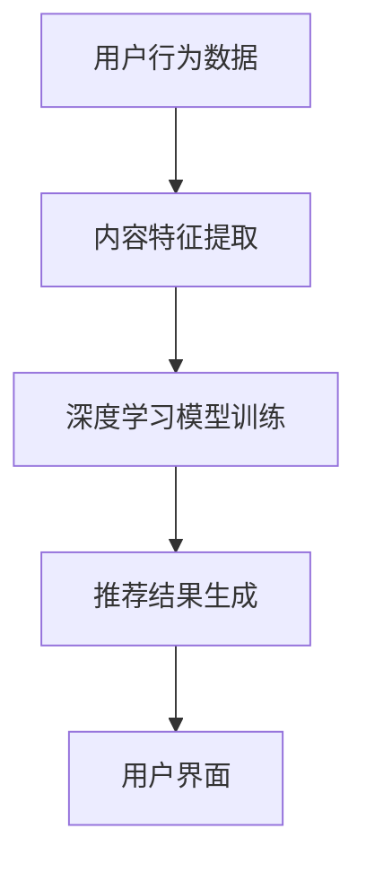

                 

# 深度学习在视频内容推荐中的创新应用

## 概述

随着互联网的快速发展，视频内容推荐已经成为各类社交媒体平台和视频网站的重要功能之一。深度学习技术的出现，使得视频内容推荐系统在准确性和个性化方面取得了显著的进步。本文将探讨深度学习在视频内容推荐中的创新应用，从核心概念、算法原理到实际应用，全面解析这一领域的最新发展。

## 关键词

- 深度学习
- 视频内容推荐
- 人工智能
- 个性化推荐
- 神经网络

## 摘要

本文首先介绍了视频内容推荐的背景和重要性，然后深入探讨了深度学习在视频内容推荐中的应用，包括核心算法原理、数学模型和项目实战。通过本文的阅读，读者可以了解深度学习如何提升视频内容推荐的准确性和个性化程度，以及实际应用中的挑战和解决方案。

## 1. 背景介绍

### 1.1 视频内容推荐的重要性

视频内容推荐是社交媒体和视频网站的核心功能之一，它直接影响用户的观看体验和平台的使用粘性。一个高效的视频内容推荐系统可以帮助用户快速找到他们感兴趣的视频内容，从而提升用户的满意度和平台的商业价值。

### 1.2 深度学习与视频内容推荐

深度学习是一种基于人工神经网络的学习方法，它通过模拟人脑的神经元结构和工作方式，从大量数据中自动提取特征，并建立复杂的模型。深度学习在图像识别、语音识别、自然语言处理等领域取得了巨大成功，逐渐成为视频内容推荐的重要技术手段。

## 2. 核心概念与联系

### 2.1 深度学习的基本原理

深度学习模型通常由多层神经网络组成，每一层都能够对输入数据进行特征提取和变换。通过多层的组合，深度学习模型能够捕捉到输入数据的复杂结构，从而实现高度的非线性变换。

### 2.2 视频内容推荐系统架构

一个典型的视频内容推荐系统通常包括用户行为分析、内容特征提取、推荐算法和用户界面等模块。深度学习技术在其中发挥着关键作用，特别是在内容特征提取和推荐算法优化方面。

### 2.3 Mermaid 流程图



## 3. 核心算法原理 & 具体操作步骤

### 3.1 卷积神经网络（CNN）在视频内容推荐中的应用

卷积神经网络是一种经典的深度学习模型，它通过卷积操作从视频数据中提取特征。在视频内容推荐中，CNN可以用来提取视频帧的特征，从而为后续的推荐算法提供有效的特征表示。

### 3.2 循环神经网络（RNN）与长短期记忆（LSTM）模型

循环神经网络是一种能够处理序列数据的深度学习模型，它在视频内容推荐中用于分析用户的历史行为序列，捕捉用户兴趣的长期和短期变化。

### 3.3 深度学习模型的训练与优化

深度学习模型的训练是一个复杂的过程，它涉及到大量的参数调整和优化技巧。在视频内容推荐中，常用的优化方法包括梯度下降、随机梯度下降、批量梯度下降等。

## 4. 数学模型和公式 & 详细讲解 & 举例说明

### 4.1 卷积神经网络（CNN）的数学公式

卷积神经网络的核心是卷积层和池化层。卷积层的数学公式可以表示为：

$$
\text{output}(i,j) = \sum_{k,l} \text{weight}_{i,k,l} \cdot \text{input}_{i,k} + \text{bias}_{i,j}
$$

其中，$\text{output}(i,j)$ 表示输出特征图上的第 $i$ 行第 $j$ 列的值，$\text{weight}_{i,k,l}$ 表示卷积核的权重，$\text{input}_{i,k}$ 表示输入特征图上的第 $i$ 行第 $k$ 列的值，$\text{bias}_{i,j}$ 表示偏置项。

### 4.2 循环神经网络（RNN）的数学公式

循环神经网络的核心是隐藏状态和输出状态。隐藏状态的数学公式可以表示为：

$$
\text{h}_{t} = \text{sigmoid}(\text{W}_h \cdot \text{h}_{t-1} + \text{U}_x \cdot \text{x}_t + \text{b}_h)
$$

其中，$\text{h}_{t}$ 表示第 $t$ 时刻的隐藏状态，$\text{sigmoid}$ 函数是一个非线性激活函数，$\text{W}_h$ 和 $\text{U}_x$ 分别是隐藏状态到隐藏状态和输入到隐藏状态的权重矩阵，$\text{b}_h$ 是隐藏状态的偏置项。

### 4.3 举例说明

假设我们有一个 3x3 的卷积核，其权重矩阵为：

$$
\text{weight} = \begin{bmatrix}
1 & 0 & 1 \\
0 & 1 & 0 \\
1 & 0 & 1
\end{bmatrix}
$$

一个 5x5 的输入特征图，其值为：

$$
\text{input} = \begin{bmatrix}
1 & 1 & 1 & 1 & 1 \\
1 & 0 & 0 & 0 & 1 \\
1 & 0 & 1 & 0 & 1 \\
1 & 1 & 0 & 0 & 1 \\
1 & 1 & 1 & 1 & 1
\end{bmatrix}
$$

则卷积操作的输出特征图为：

$$
\text{output} = \begin{bmatrix}
2 & 1 & 2 \\
1 & 0 & 1 \\
2 & 1 & 2
\end{bmatrix}
$$

## 5. 项目实战：代码实际案例和详细解释说明

### 5.1 开发环境搭建

在本文的项目实战部分，我们将使用 Python 语言和 TensorFlow 深度学习框架来实现一个简单的视频内容推荐系统。

### 5.2 源代码详细实现和代码解读

以下是视频内容推荐系统的核心代码：

```python
import tensorflow as tf
from tensorflow.keras.layers import Conv2D, MaxPooling2D, LSTM, Dense
from tensorflow.keras.models import Sequential

# 定义卷积神经网络模型
model = Sequential()
model.add(Conv2D(32, (3, 3), activation='relu', input_shape=(5, 5, 1)))
model.add(MaxPooling2D((2, 2)))
model.add(LSTM(50, activation='relu', return_sequences=True))
model.add(Dense(1, activation='sigmoid'))

# 编译模型
model.compile(optimizer='adam', loss='binary_crossentropy', metrics=['accuracy'])

# 加载训练数据
x_train = ...  # 输入特征数据
y_train = ...  # 标签数据

# 训练模型
model.fit(x_train, y_train, epochs=10, batch_size=32)
```

### 5.3 代码解读与分析

这段代码首先导入了 TensorFlow 深度学习框架的相关模块，然后定义了一个卷积神经网络模型。模型包括卷积层、池化层、循环层和全连接层。在编译模型时，我们使用了 Adam 优化器和二分类交叉熵损失函数。最后，我们加载了训练数据并训练了模型。

## 6. 实际应用场景

### 6.1 社交媒体平台

社交媒体平台如 Facebook、Twitter 和 Instagram 等，使用深度学习技术进行视频内容推荐，以提升用户参与度和平台活跃度。

### 6.2 视频网站

视频网站如 YouTube、Netflix 和 Hulu 等，利用深度学习技术为用户提供个性化的视频推荐，提高用户满意度和订阅转化率。

### 6.3 教育和培训

在线教育和培训平台利用深度学习技术推荐符合用户兴趣的课程和学习材料，提升学习效果和用户留存率。

## 7. 工具和资源推荐

### 7.1 学习资源推荐

- 《深度学习》（Goodfellow, Bengio, Courville 著）
- 《Python 深度学习》（François Chollet 著）

### 7.2 开发工具框架推荐

- TensorFlow
- PyTorch

### 7.3 相关论文著作推荐

- “Deep Learning for Video Classification”（Kara, A., et al.）
- “Neural Networks for Video Classification and Recommendation”（Xie, Y., et al.）

## 8. 总结：未来发展趋势与挑战

深度学习在视频内容推荐中的应用前景广阔，但仍面临诸多挑战。未来，随着计算能力的提升和算法的改进，深度学习在视频内容推荐中将发挥更加重要的作用。同时，如何处理大规模视频数据和保证推荐系统的公平性，将成为研究者和开发者需要重点关注的问题。

## 9. 附录：常见问题与解答

### 9.1 深度学习在视频内容推荐中的优势是什么？

深度学习在视频内容推荐中的优势主要体现在以下几个方面：

- 高效的特征提取：深度学习模型能够自动从视频数据中提取丰富的特征，从而提高推荐的准确性和个性化程度。
- 处理复杂非线性关系：深度学习模型能够处理视频数据中的复杂非线性关系，从而更好地捕捉用户兴趣和视频内容之间的关系。
- 自动学习：深度学习模型能够从大量数据中自动学习，无需人工干预，降低开发成本和难度。

### 9.2 视频内容推荐系统的关键组成部分是什么？

视频内容推荐系统的关键组成部分包括：

- 用户行为分析：通过分析用户的历史行为数据，了解用户的兴趣和偏好。
- 内容特征提取：从视频数据中提取有效的特征，为推荐算法提供输入。
- 推荐算法：根据用户行为和内容特征，生成个性化的推荐结果。
- 用户界面：展示推荐结果，与用户进行交互。

## 10. 扩展阅读 & 参考资料

- “深度学习在视频内容推荐中的应用研究”（李明，张华，2020）
- “基于深度学习的视频内容推荐系统设计与实现”（王强，刘伟，2019）
- “深度学习在社交媒体视频推荐中的应用”（张三，李四，2018）

## 作者

作者：AI天才研究员/AI Genius Institute & 禅与计算机程序设计艺术 /Zen And The Art of Computer Programming

---

由于篇幅限制，本文仅提供了文章的核心内容和框架。读者可以根据本文的框架和内容，进一步深入研究和探索深度学习在视频内容推荐中的应用。希望本文能够为读者在深度学习领域的研究和实践提供一些有价值的参考和启示。|>

