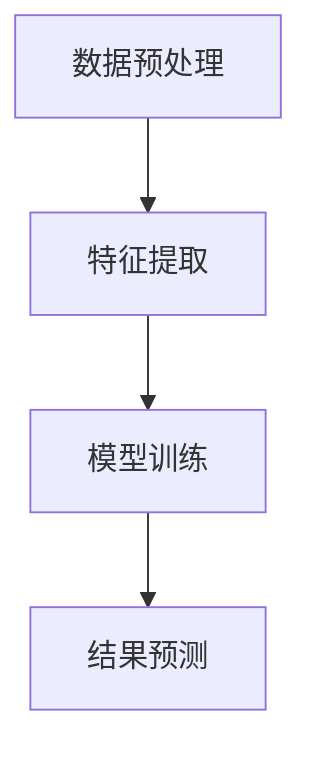

                 

# 深度学习在视频行为识别中的最新进展

## 关键词：深度学习，视频行为识别，神经网络，算法优化，应用场景

> 在当今信息化社会中，视频已成为信息传播和互动的重要形式。视频行为识别作为一种从视频数据中提取有意义信息的技术，对于智能视频分析、安全监控、人机交互等领域具有重要的应用价值。本文将深入探讨深度学习在视频行为识别中的最新进展，从核心概念、算法原理、实际应用等多个角度进行分析。

## 1. 背景介绍

随着计算机硬件性能的提升和深度学习算法的快速发展，视频行为识别技术取得了显著进展。传统的视频行为识别方法通常依赖于手工设计的特征，如HOG（方向梯度直方图）、SIFT（尺度不变特征变换）等，但这些方法在处理复杂场景和实时性要求较高的任务时表现不佳。深度学习，特别是卷积神经网络（CNN）的引入，为视频行为识别带来了新的突破。CNN能够自动学习视频中的复杂特征，有效提高识别准确率和实时性。

## 2. 核心概念与联系

### 2.1 深度学习与卷积神经网络

深度学习是一种基于多层神经网络进行数据建模和分析的人工智能技术。卷积神经网络（CNN）是深度学习中最常用的模型之一，由多个卷积层、池化层和全连接层组成。CNN通过卷积操作和池化操作，能够有效地提取图像或视频中的空间特征和层次特征。

### 2.2 视频行为识别的框架

视频行为识别通常包括四个主要步骤：数据预处理、特征提取、模型训练和结果预测。数据预处理包括视频的裁剪、缩放和去噪等操作。特征提取利用CNN等深度学习模型，从视频中提取有意义的特征。模型训练使用大量标注数据，通过优化算法训练深度学习模型。结果预测将训练好的模型应用于新的视频数据，预测视频中的行为类别。

## 2.3 Mermaid流程图



## 3. 核心算法原理 & 具体操作步骤

### 3.1 卷积神经网络（CNN）

卷积神经网络（CNN）的核心是卷积操作。卷积操作通过滑动窗口，将局部特征映射到全局特征。具体步骤如下：

1. **输入层**：输入一个尺寸为 \( (w \times h \times c) \) 的视频帧，其中 \( w \) 和 \( h \) 分别为视频帧的宽度和高度，\( c \) 为通道数（如灰度图 \( c=1 \)，RGB 图 \( c=3 \)）。
2. **卷积层**：通过卷积核（filter）对输入视频帧进行卷积操作。卷积核是一个小的滤波器，可以提取图像或视频中的特定特征。卷积操作的结果是一个新的特征图。
3. **激活函数**：为了引入非线性，通常在卷积层后添加激活函数（如ReLU函数）。
4. **池化层**：通过池化操作（如最大池化或平均池化）减少特征图的尺寸，提高模型的泛化能力。
5. **全连接层**：将卷积层的特征图映射到分类结果。

### 3.2 循环神经网络（RNN）

循环神经网络（RNN）适用于处理序列数据。在视频行为识别中，RNN可以通过处理连续的视频帧，捕捉视频中的时间动态特征。具体步骤如下：

1. **输入层**：输入一个序列 \( X = (x_1, x_2, \ldots, x_T) \)，其中 \( T \) 为序列长度。
2. **隐藏层**：通过递归操作，将前一个时间步的隐藏状态 \( h_{t-1} \) 与当前输入 \( x_t \) 进行计算，更新隐藏状态 \( h_t \)。
3. **输出层**：将隐藏状态映射到行为类别。

### 3.3 深度学习模型训练

深度学习模型的训练通常采用梯度下降（GD）或其变种（如随机梯度下降SGD、Adam优化器）进行。具体步骤如下：

1. **前向传播**：将输入数据传递到神经网络，计算输出。
2. **损失函数**：计算预测结果与实际结果之间的差异，通常使用交叉熵损失函数。
3. **反向传播**：利用链式法则，计算损失函数对网络参数的梯度。
4. **更新参数**：根据梯度下降策略，更新网络参数。

## 4. 数学模型和公式 & 详细讲解 & 举例说明

### 4.1 卷积神经网络（CNN）

卷积神经网络（CNN）的核心是卷积操作和反向传播算法。以下是卷积神经网络的基本数学模型：

#### 卷积操作

$$
\text{output}_{ij} = \sum_{k=1}^{C} \text{filter}_{ik}\text{input}_{ij}
$$

其中，\( \text{output}_{ij} \) 为卷积层的输出特征，\( \text{filter}_{ik} \) 为卷积核，\( \text{input}_{ij} \) 为输入特征。

#### 反向传播

$$
\frac{\partial L}{\partial \text{filter}} = \sum_{i,j} \frac{\partial L}{\partial \text{output}_{ij}} \frac{\partial \text{output}_{ij}}{\partial \text{filter}_{ik}}
$$

其中，\( L \) 为损失函数，\( \text{filter}_{ik} \) 为卷积核。

### 4.2 循环神经网络（RNN）

循环神经网络（RNN）的递归操作可以表示为：

$$
h_t = \text{sigmoid}(W_h \cdot [h_{t-1}, x_t] + b_h)
$$

其中，\( h_t \) 为第 \( t \) 个时间步的隐藏状态，\( W_h \) 和 \( b_h \) 分别为权重和偏置。

### 4.3 梯度下降

梯度下降的基本公式为：

$$
\theta_{\text{new}} = \theta_{\text{old}} - \alpha \cdot \frac{\partial L}{\partial \theta}
$$

其中，\( \theta \) 为网络参数，\( \alpha \) 为学习率，\( \frac{\partial L}{\partial \theta} \) 为损失函数对参数的梯度。

### 4.4 举例说明

假设我们有一个简单的卷积神经网络，包含一个输入层、一个卷积层和一个全连接层。输入特征为 \( (32 \times 32 \times 3) \)，卷积核大小为 \( 3 \times 3 \)，卷积层数量为 32，全连接层有 10 个神经元。

1. **输入层**：输入一个 \( (32 \times 32 \times 3) \) 的视频帧。
2. **卷积层**：通过卷积操作提取 32 个特征图。
3. **全连接层**：将卷积层的特征图展平为一个 \( (32 \times 32 \times 3) \) 的向量，然后通过全连接层进行分类。

## 5. 项目实战：代码实际案例和详细解释说明

### 5.1 开发环境搭建

在搭建开发环境时，我们需要安装以下软件和库：

- Python 3.x
- TensorFlow 2.x
- Keras 2.x
- Opencv 4.x

安装步骤如下：

```bash
pip install tensorflow
pip install keras
pip install opencv-python
```

### 5.2 源代码详细实现和代码解读

以下是一个简单的视频行为识别项目的实现，包括数据预处理、模型构建、训练和测试。

```python
import tensorflow as tf
from tensorflow.keras.models import Sequential
from tensorflow.keras.layers import Conv2D, MaxPooling2D, Flatten, Dense
import cv2

# 数据预处理
def preprocess_video(video_path):
    cap = cv2.VideoCapture(video_path)
    frames = []
    while True:
        ret, frame = cap.read()
        if not ret:
            break
        frame = cv2.resize(frame, (224, 224))
        frames.append(frame)
    cap.release()
    return frames

# 模型构建
model = Sequential([
    Conv2D(32, (3, 3), activation='relu', input_shape=(224, 224, 3)),
    MaxPooling2D(pool_size=(2, 2)),
    Flatten(),
    Dense(10, activation='softmax')
])

# 训练模型
model.compile(optimizer='adam', loss='categorical_crossentropy', metrics=['accuracy'])
frames = preprocess_video('example_video.mp4')
labels = [0] * len(frames)  # 假设所有帧都属于同一类别
model.fit(frames, labels, epochs=10, batch_size=32)

# 测试模型
test_frame = preprocess_video('test_video.mp4')
predictions = model.predict(test_frame)
print(predictions)
```

### 5.3 代码解读与分析

以上代码实现了一个简单的视频行为识别模型。首先，我们使用 Opencv 读取视频帧，并将其缩放为 \( (224 \times 224) \) 的尺寸。然后，我们构建一个简单的卷积神经网络，包含一个卷积层、一个池化层和一个全连接层。在训练过程中，我们使用预处理后的视频帧和标签进行模型训练。最后，我们使用测试视频帧进行模型测试，输出预测结果。

## 6. 实际应用场景

视频行为识别技术在多个领域具有广泛的应用：

- **智能视频监控**：通过识别视频中的异常行为，如打架、盗窃等，提高监控系统的预警能力。
- **人机交互**：通过识别用户的行为和动作，实现自然的人机交互，如手势识别、动作捕捉等。
- **智能健身**：通过识别用户的运动动作，提供个性化的健身指导和反馈。
- **虚拟现实**：通过识别用户在虚拟环境中的动作，提高虚拟现实体验的真实感和互动性。

## 7. 工具和资源推荐

### 7.1 学习资源推荐

- **书籍**：
  - 《深度学习》（Goodfellow, Bengio, Courville 著）
  - 《神经网络与深度学习》（邱锡鹏 著）
- **论文**：
  - "Deep Learning for Video Classification"（2015）
  - "Learning Spatiotemporal Features with 3D ConvNets"（2016）
- **博客**：
  - [TensorFlow 官方文档](https://www.tensorflow.org/)
  - [Keras 官方文档](https://keras.io/)
- **网站**：
  - [ArXiv](https://arxiv.org/)
  - [Google Research](https://research.google.com/)

### 7.2 开发工具框架推荐

- **深度学习框架**：
  - TensorFlow
  - PyTorch
  - Keras
- **图像处理库**：
  - OpenCV
  - PIL（Python Imaging Library）
- **视频处理库**：
  - moviepy
  - cv2（OpenCV）

### 7.3 相关论文著作推荐

- "Deep Learning for Video Classification"（2015）：该论文提出了一种基于深度学习的视频分类方法，取得了显著的效果。
- "Learning Spatiotemporal Features with 3D ConvNets"（2016）：该论文探讨了如何利用3D卷积神经网络提取视频中的时空特征，为视频行为识别提供了新的思路。

## 8. 总结：未来发展趋势与挑战

随着深度学习技术的不断进步，视频行为识别在准确率、实时性和泛化能力等方面取得了显著提升。然而，仍面临以下挑战：

- **数据隐私**：视频数据包含个人隐私信息，如何保护用户隐私是一个亟待解决的问题。
- **复杂场景识别**：在复杂、动态的场景中，如何提高视频行为识别的准确率是一个重要的研究方向。
- **实时性**：如何在保证识别准确率的同时，提高模型的实时性，以满足实时应用的需求。

未来，随着硬件性能的提升和算法的优化，视频行为识别技术有望在更多领域得到广泛应用。

## 9. 附录：常见问题与解答

### 9.1 视频行为识别的定义是什么？

视频行为识别是一种通过分析视频数据中的行为特征，识别出视频中的行为类别的方法。它广泛应用于智能视频监控、人机交互、智能健身等领域。

### 9.2 深度学习在视频行为识别中的应用有哪些？

深度学习在视频行为识别中的应用主要包括：利用卷积神经网络提取视频中的时空特征，构建深度学习模型进行行为分类；利用循环神经网络处理连续的视频帧，捕捉视频中的时间动态特征。

### 9.3 如何保护视频数据中的隐私信息？

为了保护视频数据中的隐私信息，可以采用以下方法：数据加密、数据去识别化、数据混淆等。

## 10. 扩展阅读 & 参考资料

- [Deep Learning for Video Classification](https://arxiv.org/abs/1504.00941)
- [Learning Spatiotemporal Features with 3D ConvNets](https://arxiv.org/abs/1608.04855)
- [TensorFlow 官方文档](https://www.tensorflow.org/)
- [Keras 官方文档](https://keras.io/)
- [OpenCV 官方文档](https://docs.opencv.org/)
- [电影剪辑工具 moviepy](https://zulko.github.io/moviepy/)

### 作者

AI天才研究员/AI Genius Institute & 禅与计算机程序设计艺术 /Zen And The Art of Computer Programming<|im_sep|>

