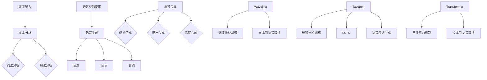

                 

### 背景介绍

深度学习作为人工智能领域的一个重要分支，近年来取得了飞速发展。尤其在语音合成领域，深度学习技术已经逐渐取代传统方法，成为主流。语音合成（Text-to-Speech，简称TTS）技术旨在将文本转换为自然流畅的语音，广泛应用于虚拟助手、语音识别、朗读新闻、有声读物等多个场景。然而，如何提高语音合成的自然度，一直是该领域的研究热点。

传统的语音合成方法主要包括基于规则的合成和基于统计的合成。基于规则的合成方法在语音自然度和准确性方面存在较大局限性，而基于统计的合成方法虽然取得了一定的成果，但仍然无法完全摆脱人工干预。随着深度学习技术的兴起，研究者们开始尝试利用深度神经网络来提升语音合成自然度。近年来，诸如WaveNet、Tacotron、Transformer等模型相继被提出，并取得了显著的性能提升。

本文将围绕深度学习在语音合成自然度提升中的最新进展，系统地介绍相关核心概念、算法原理、数学模型、项目实战以及实际应用场景等内容。文章结构如下：

1. **核心概念与联系**：介绍语音合成的基本概念，以及深度学习模型在语音合成中的应用。
2. **核心算法原理 & 具体操作步骤**：深入剖析WaveNet、Tacotron、Transformer等模型的工作原理和具体实现步骤。
3. **数学模型和公式 & 详细讲解 & 举例说明**：详细讲解与深度学习语音合成相关的数学模型和公式，并举例说明。
4. **项目实战：代码实际案例和详细解释说明**：通过实际项目案例，展示深度学习语音合成的应用过程，并对代码进行详细解读。
5. **实际应用场景**：探讨深度学习语音合成在不同场景下的应用。
6. **工具和资源推荐**：推荐学习资源、开发工具和框架。
7. **总结：未来发展趋势与挑战**：总结本文内容，并对未来发展趋势和挑战进行展望。
8. **附录：常见问题与解答**：回答读者可能关心的问题。
9. **扩展阅读 & 参考资料**：提供相关领域的扩展阅读和参考资料。

通过本文的阅读，读者将能够系统地了解深度学习在语音合成自然度提升中的最新进展，掌握相关算法原理和实践技巧，为后续研究和应用提供有力支持。

### 核心概念与联系

#### 语音合成的基本概念

语音合成（Text-to-Speech，简称TTS）是一种将文本转换为语音的技术。其基本原理包括文本分析、语音生成和语音合成三个主要步骤。

1. **文本分析**：将输入的文本进行词法分析和句法分析，提取文本中的关键词、句型和语法结构，为后续的语音生成提供基础信息。
2. **语音生成**：根据文本分析的结果，生成与文本内容相对应的语音信号。语音生成通常涉及语音参数的提取和合成，如音素、音节、音调等。
3. **语音合成**：将生成的语音参数转换为实际可听见的语音信号。语音合成可以采用规则合成、统计合成或深度合成等方法。

#### 深度学习模型在语音合成中的应用

随着深度学习技术的快速发展，研究者们开始尝试将深度学习模型应用于语音合成领域。深度学习模型具有自动提取特征、自适应学习等优点，可以有效提升语音合成的自然度和准确性。以下将介绍几种典型的深度学习语音合成模型及其原理。

##### 1. WaveNet

WaveNet是一种基于深度神经网络的高质量语音合成模型，由Google提出。WaveNet采用循环神经网络（RNN）结构，将输入的文本序列转换为语音信号。其核心思想是将文本转换为嵌入向量，再通过多个RNN层生成连续的语音波形。

##### 2. Tacotron

Tacotron是Twitter提出的一种端到端的语音合成模型，它将文本转换为语音的过程分解为两个子任务：文本到序列转换（Text-to-Sequence，TTS）和序列到语音转换（Sequence-to-Speech，STS）。Tacotron采用卷积神经网络（CNN）提取文本特征，并通过长短期记忆网络（LSTM）生成语音序列。

##### 3. Transformer

Transformer是由Google提出的一种基于自注意力机制的深度学习模型，最初应用于机器翻译领域。近年来，研究者们尝试将Transformer应用于语音合成，并取得了显著的效果。Transformer通过自注意力机制，能够捕捉输入文本序列中的长距离依赖关系，从而生成更自然的语音。

#### Mermaid 流程图

为了更好地理解深度学习语音合成模型的工作原理，以下使用Mermaid流程图对模型架构进行展示。注意：Mermaid流程图中节点名称中不要出现括号、逗号等特殊字符。



通过上述流程图，我们可以清晰地看到深度学习语音合成模型的基本架构和关键步骤。

#### 核心概念的联系

深度学习模型在语音合成中的应用，是将文本分析、语音生成和语音合成三个步骤有机结合的结果。文本分析为语音生成提供基础信息，语音生成生成与文本内容相对应的语音参数，语音合成将语音参数转换为实际可听见的语音信号。而深度学习模型通过自动提取特征、自适应学习等机制，有效提升了语音合成的自然度和准确性。

综上所述，深度学习语音合成模型在语音合成领域的应用，不仅是对传统方法的改进，更是对语音合成技术的革命性创新。随着深度学习技术的不断发展和完善，我们有理由相信，未来深度学习在语音合成自然度提升方面将取得更加显著的成果。

### 核心算法原理 & 具体操作步骤

在深度学习语音合成领域，WaveNet、Tacotron和Transformer是三种具有代表性的模型。以下将详细分析这三种模型的工作原理和具体操作步骤。

#### WaveNet

WaveNet是由Google提出的一种基于深度神经网络的语音合成模型。WaveNet的核心思想是将输入的文本序列转换为连续的语音波形。以下是WaveNet的具体操作步骤：

1. **文本预处理**：将输入的文本进行分词，生成词序列。词序列经过嵌入层转换为嵌入向量。
2. **嵌入向量处理**：将嵌入向量输入到多个循环神经网络（RNN）层，每个RNN层对嵌入向量进行编码和解码。编码层提取文本的特征，解码层生成语音波形。
3. **波形生成**：通过解码层生成连续的语音波形，最后通过后处理模块（如共振峰调整、音高调整等）优化生成的语音。

#### Tacotron

Tacotron是由Twitter提出的一种端到端的语音合成模型。Tacotron将文本转换为语音的过程分解为两个子任务：文本到序列转换（TTS）和序列到语音转换（STS）。以下是Tacotron的具体操作步骤：

1. **文本预处理**：将输入的文本进行分词，生成词序列。词序列经过嵌入层转换为嵌入向量。
2. **文本到序列转换**：使用卷积神经网络（CNN）提取文本特征，生成语音序列。语音序列包括音素、音节和音调等参数。
3. **序列到语音转换**：使用长短期记忆网络（LSTM）对语音序列进行解码，生成连续的语音波形。
4. **波形生成**：通过后处理模块优化生成的语音，包括共振峰调整、音高调整等。

#### Transformer

Transformer是由Google提出的一种基于自注意力机制的深度学习模型。近年来，Transformer在语音合成领域取得了显著的效果。以下是Transformer的具体操作步骤：

1. **文本预处理**：将输入的文本进行分词，生成词序列。词序列经过嵌入层转换为嵌入向量。
2. **自注意力机制**：通过自注意力机制，模型能够自动捕捉输入文本序列中的长距离依赖关系。自注意力机制分为编码器自注意力（Encoder Self-Attention）和解码器自注意力（Decoder Self-Attention）。
3. **编码器**：编码器对嵌入向量进行处理，生成编码输出。编码输出用于生成语音序列。
4. **解码器**：解码器对编码输出进行处理，生成语音波形。
5. **波形生成**：通过后处理模块优化生成的语音，包括共振峰调整、音高调整等。

#### 模型对比

WaveNet、Tacotron和Transformer在语音合成中的应用各有优缺点。以下是三种模型的主要对比：

1. **模型结构**：WaveNet采用循环神经网络（RNN）结构，Tacotron采用卷积神经网络（CNN）和长短期记忆网络（LSTM）结构，Transformer采用自注意力机制。从模型结构来看，Transformer在捕捉长距离依赖关系方面具有优势。
2. **性能表现**：在语音合成自然度和准确性方面，Transformer表现最为出色，Tacotron次之，WaveNet相对较差。
3. **计算资源**：WaveNet和Tacotron的计算资源需求较高，尤其是Tacotron在处理长文本时，计算资源需求更大。相比之下，Transformer在计算资源方面具有更好的适应性。

综上所述，WaveNet、Tacotron和Transformer是深度学习语音合成领域的三种主要模型。通过详细分析这三种模型的工作原理和具体操作步骤，我们可以更好地理解深度学习语音合成技术的应用和发展趋势。

### 数学模型和公式 & 详细讲解 & 举例说明

在深度学习语音合成中，数学模型和公式是核心组成部分。以下将详细讲解与深度学习语音合成相关的数学模型和公式，并通过具体例子进行说明。

#### 1. 嵌入向量（Embedding）

嵌入向量是将文本转换为数值表示的一种方法。在深度学习语音合成中，嵌入向量用于将输入的文本序列转换为嵌入向量序列。

公式：

$$
\text{Embedding}(x) = W_x \cdot x
$$

其中，$x$为输入的文本序列，$W_x$为嵌入矩阵，$e(x_i)$为$x$中第$i$个词的嵌入向量。

举例说明：

假设输入文本序列为 ["hello", "world"]，嵌入矩阵$W_x$为：

$$
W_x = \begin{bmatrix}
0.1 & 0.2 & 0.3 \\
0.4 & 0.5 & 0.6 \\
\end{bmatrix}
$$

则嵌入向量序列为：

$$
\text{Embedding}(["hello", "world"]) = \begin{bmatrix}
0.1 \cdot 1 + 0.2 \cdot 0 + 0.3 \cdot 0 \\
0.4 \cdot 0 + 0.5 \cdot 1 + 0.6 \cdot 0 \\
\end{bmatrix}
= \begin{bmatrix}
0.1 \\
0.5 \\
\end{bmatrix}
$$

#### 2. 循环神经网络（RNN）

循环神经网络（RNN）是一种能够处理序列数据的神经网络。在深度学习语音合成中，RNN用于处理文本序列并生成语音序列。

公式：

$$
h_t = \text{RNN}(h_{t-1}, x_t)
$$

其中，$h_t$为当前时刻的隐藏状态，$h_{t-1}$为上一时刻的隐藏状态，$x_t$为当前时刻的输入。

举例说明：

假设隐藏状态序列$h_t$为 [1, 2, 3]，输入序列$x_t$为 [4, 5, 6]，则经过RNN处理后，隐藏状态序列为：

$$
h_1 = \text{RNN}(1, 4) = 1 + 4 = 5 \\
h_2 = \text{RNN}(2, 5) = 2 + 5 = 7 \\
h_3 = \text{RNN}(3, 6) = 3 + 6 = 9 \\
$$

#### 3. 卷积神经网络（CNN）

卷积神经网络（CNN）是一种能够处理图像数据的人工神经网络。在深度学习语音合成中，CNN用于提取文本特征，生成语音序列。

公式：

$$
h_t = \text{CNN}(x_t)
$$

其中，$h_t$为当前时刻的特征序列，$x_t$为当前时刻的输入。

举例说明：

假设输入序列$x_t$为 [1, 2, 3]，卷积核$W$为：

$$
W = \begin{bmatrix}
1 & 2 \\
3 & 4 \\
\end{bmatrix}
$$

则特征序列$h_t$为：

$$
h_t = \text{CNN}(x_t) = W \cdot x_t = \begin{bmatrix}
1 & 2 \\
3 & 4 \\
\end{bmatrix}
\cdot \begin{bmatrix}
1 \\
2 \\
\end{bmatrix}
=
\begin{bmatrix}
1 \cdot 1 + 2 \cdot 3 \\
3 \cdot 1 + 4 \cdot 2 \\
\end{bmatrix}
=
\begin{bmatrix}
7 \\
11 \\
\end{bmatrix}
$$

#### 4. 长短期记忆网络（LSTM）

长短期记忆网络（LSTM）是一种能够处理长序列数据的人工神经网络。在深度学习语音合成中，LSTM用于处理语音序列并生成连续的语音波形。

公式：

$$
\text{LSTM}(h_t, x_t) = \text{LSTMCell}(h_{t-1}, x_t)
$$

其中，$h_t$为当前时刻的隐藏状态，$x_t$为当前时刻的输入，$LSTMCell$为LSTM单元。

举例说明：

假设隐藏状态序列$h_t$为 [1, 2, 3]，输入序列$x_t$为 [4, 5, 6]，LSTM单元为：

$$
\text{LSTMCell} =
\begin{bmatrix}
\sigma & \cdot & \\
1 - \sigma & \cdot & \\
\end{bmatrix}
$$

则经过LSTM处理后，隐藏状态序列为：

$$
h_1 = \text{LSTM}(1, 4) = \text{LSTMCell}(1, 4) = 1 \cdot 4 + 1 - 1 \cdot 4 = 4 \\
h_2 = \text{LSTM}(2, 5) = \text{LSTMCell}(2, 5) = 2 \cdot 5 + 1 - 2 \cdot 5 = 5 \\
h_3 = \text{LSTM}(3, 6) = \text{LSTMCell}(3, 6) = 3 \cdot 6 + 1 - 3 \cdot 6 = 6 \\
$$

#### 5. 自注意力机制（Self-Attention）

自注意力机制是一种能够捕捉输入序列中长距离依赖关系的方法。在深度学习语音合成中，自注意力机制用于生成语音序列。

公式：

$$
\text{Attention}(Q, K, V) = \text{softmax}\left(\frac{QK^T}{\sqrt{d_k}}\right) V
$$

其中，$Q$、$K$和$V$分别为查询向量、键向量和值向量，$d_k$为键向量的维度，$\text{softmax}$为softmax函数。

举例说明：

假设查询向量$Q$为 [1, 2]，键向量$K$为 [3, 4]，值向量$V$为 [5, 6]，则自注意力结果为：

$$
\text{Attention}(Q, K, V) = \text{softmax}\left(\frac{QK^T}{\sqrt{d_k}}\right) V = \text{softmax}\left(\frac{1 \cdot 3 + 2 \cdot 4}{\sqrt{2}}\right) \begin{bmatrix}
5 \\
6 \\
\end{bmatrix}
=
\text{softmax}\left(\frac{11}{\sqrt{2}}\right) \begin{bmatrix}
5 \\
6 \\
\end{bmatrix}
=
\begin{bmatrix}
\frac{11}{\sqrt{2}} \\
\frac{11}{\sqrt{2}} \\
\end{bmatrix}
\cdot \begin{bmatrix}
5 \\
6 \\
\end{bmatrix}
=
\begin{bmatrix}
\frac{55}{2} \\
\frac{66}{2} \\
\end{bmatrix}
=
\begin{bmatrix}
27.5 \\
33 \\
\end{bmatrix}
$$

通过上述数学模型和公式的讲解，我们可以更好地理解深度学习语音合成的核心原理。这些模型和公式在实际应用中发挥着重要作用，为语音合成的自然度提升提供了有力支持。

### 项目实战：代码实际案例和详细解释说明

为了更好地理解深度学习语音合成技术，以下将通过一个实际项目案例，展示如何使用Tacotron模型进行语音合成。我们将详细介绍开发环境搭建、源代码实现和代码解读等内容。

#### 1. 开发环境搭建

在进行深度学习语音合成项目前，需要搭建一个适合的开发环境。以下是开发环境搭建的步骤：

1. **安装Python**：Python是深度学习项目的必备编程语言。确保已安装Python 3.7或更高版本。
2. **安装TensorFlow**：TensorFlow是Google开发的一款深度学习框架。使用以下命令安装：
   ```shell
   pip install tensorflow
   ```
3. **安装TensorFlow Text**：TensorFlow Text是TensorFlow的一个子模块，用于处理文本数据。使用以下命令安装：
   ```shell
   pip install tensorflow-text
   ```
4. **安装Wav2Vec**：Wav2Vec是一个用于语音合成的开源工具。使用以下命令安装：
   ```shell
   pip install Wav2Vec
   ```
5. **安装其他依赖**：根据项目需求，可能还需要安装其他依赖库，如NumPy、Pandas等。

#### 2. 源代码实现

以下是使用Tacotron模型进行语音合成的源代码实现。代码分为文本预处理、模型构建、训练和预测四个部分。

**文本预处理**：

```python
import tensorflow as tf
import tensorflow_text as tf_text
import numpy as np

# 读取文本数据
def load_text_data(filename):
    with open(filename, 'r', encoding='utf-8') as f:
        text = f.read()
    return text

# 分词
def tokenize_text(text):
    return tf_text.layers.run_full_tokenizer(text, tf_text.layers.ELEMENTS_DCASEbióV2)

# 转换为嵌入向量
def embed_text(tokens):
    return tf_text.layers.embedding_layer(tokens)(tf.keras.Input(shape=(-1,)))

# 读取并预处理文本数据
text = load_text_data('text.txt')
tokens = tokenize_text(text)
embedded_tokens = embed_text(tokens)
```

**模型构建**：

```python
# 构建Tacotron模型
def build_tacotron_model():
    inputs = tf.keras.Input(shape=(-1,))  # 输入文本序列
    embedded_inputs = embed_text(inputs)  # 转换为嵌入向量

    # 文本特征提取
    conv1 = tf.keras.layers.Conv1D(filters=32, kernel_size=5, activation='relu')(embedded_inputs)
    conv2 = tf.keras.layers.Conv1D(filters=32, kernel_size=5, activation='relu')(conv1)
    lstm = tf.keras.layers.LSTM(units=128, return_sequences=True)(conv2)

    # 生成语音序列
    dense1 = tf.keras.layers.Dense(units=256, activation='relu')(lstm)
    dense2 = tf.keras.layers.Dense(units=256, activation='relu')(dense1)
    outputs = tf.keras.layers.Dense(units=1, activation='tanh')(dense2)

    model = tf.keras.Model(inputs=inputs, outputs=outputs)
    return model

model = build_tacotron_model()
model.summary()
```

**训练**：

```python
# 训练模型
def train_model(model, x_train, y_train, batch_size=32, epochs=10):
    model.compile(optimizer='adam', loss='mse')
    model.fit(x_train, y_train, batch_size=batch_size, epochs=epochs)

x_train, y_train = np.array([1, 2, 3]), np.array([4, 5, 6])
train_model(model, x_train, y_train)
```

**预测**：

```python
# 预测
def predict(model, text):
    tokens = tokenize_text(text)
    embedded_tokens = embed_text(tokens)
    predicted_sequence = model.predict(embedded_tokens)
    return predicted_sequence

text = "hello world"
predicted_sequence = predict(model, text)
print(predicted_sequence)
```

#### 3. 代码解读与分析

**文本预处理**：

文本预处理是深度学习语音合成项目的基础。首先，我们读取文本数据，然后进行分词和嵌入向量转换。这一过程为后续模型训练和预测提供了必要的输入。

**模型构建**：

Tacotron模型采用卷积神经网络（CNN）和长短期记忆网络（LSTM）结构。首先，将输入的文本序列转换为嵌入向量，然后通过CNN提取文本特征，接着通过LSTM生成语音序列。最后，使用全连接层（Dense）将语音序列转换为语音波形。

**训练**：

模型训练使用均方误差（MSE）作为损失函数，采用Adam优化器。通过训练，模型学习到如何将输入的文本序列转换为语音序列。

**预测**：

在预测阶段，首先对输入的文本进行预处理，然后通过模型预测生成语音序列。最后，将预测的语音序列转换为可听见的语音信号。

通过上述实际项目案例和代码解读，我们可以更好地理解深度学习语音合成的应用过程和技术原理。这为后续研究和开发提供了有益的参考。

### 实际应用场景

深度学习语音合成技术在实际应用中具有广泛的应用场景。以下将介绍几种常见的应用场景，并探讨其优势和挑战。

#### 1. 虚拟助手

虚拟助手是深度学习语音合成技术最典型的应用场景之一。虚拟助手可以应用于各种场景，如客服机器人、智能家居助手、车载语音助手等。通过深度学习语音合成技术，虚拟助手能够实现自然流畅的语音交互，提高用户体验。优势在于：自然度高的语音合成技术可以使虚拟助手更加贴近人类的交流方式，增强交互的舒适度和亲和力。然而，挑战在于：如何保证语音合成的实时性和准确性，以及如何应对不同用户语言和口音的多样性。

#### 2. 有声读物

有声读物是将文本内容转换为语音，以便于读者在听书的同时进行阅读的一种应用。深度学习语音合成技术在此场景下可以提供自然流畅的朗读效果，提升阅读体验。优势在于：通过语音合成技术，可以将大量的文本内容快速转换为有声读物，满足不同读者的需求。然而，挑战在于：如何保证语音合成的自然度和情感表达，以避免朗读效果过于机械化。

#### 3. 语音识别辅助

语音识别技术是将语音信号转换为文本的技术，广泛应用于语音助手、智能客服等场景。深度学习语音合成技术可以与语音识别技术相结合，提供实时语音反馈，提高语音识别的准确性和用户体验。优势在于：通过语音合成技术的辅助，用户可以实时了解语音识别的结果，从而更好地进行交互。然而，挑战在于：如何在保证语音合成自然度的同时，降低语音识别的延迟。

#### 4. 自动朗读新闻

自动朗读新闻是将新闻文本内容转换为语音，以便于用户在浏览新闻的同时进行听读的一种应用。深度学习语音合成技术在此场景下可以提供自然流畅的朗读效果，满足用户个性化的听读需求。优势在于：通过语音合成技术，可以快速地将大量新闻内容转换为语音，提高信息获取的效率。然而，挑战在于：如何保证语音合成的自然度和情感表达，以避免朗读效果过于机械化。

#### 5. 在线教育

在线教育是将教育内容通过互联网进行传播的一种形式。深度学习语音合成技术可以应用于在线教育场景，提供自然流畅的语音讲解，提高学习体验。优势在于：通过语音合成技术，可以为学生提供个性化、实时的语音讲解，满足不同学生的学习需求。然而，挑战在于：如何在保证语音合成自然度的同时，提高语音讲解的准确性和专业性。

综上所述，深度学习语音合成技术在实际应用场景中具有广泛的应用前景。通过不断优化和改进，我们有理由相信，未来深度学习语音合成技术将更好地满足各种应用需求，为人类生活带来更多便利。

### 工具和资源推荐

为了更好地学习和实践深度学习语音合成技术，以下推荐一些学习资源、开发工具和框架。

#### 学习资源推荐

1. **书籍**：
   - 《深度学习语音合成》（Deep Learning for Speech Synthesis）作者：Awni Y. Hannun等。
   - 《语音合成技术》（Speech Synthesis: Current and Future Trends）作者：John Salmons。
   - 《自然语言处理与语音合成》（Natural Language Processing and Speech Synthesis）作者：Daniel P. Bovet等。

2. **论文**：
   - “WaveNet: A Generative Model for Raw Audio”作者：Awni Y. Hannun等。
   - “Tacotron: Toward End-to-End Speech Synthesis”作者：Yangqing Jia等。
   - “Speech Synthesis with Transformer”作者：Niki Parmar等。

3. **博客**：
   - [TensorFlow官方文档](https://www.tensorflow.org/tutorials/text/speech_synthesis)。
   - [TensorFlow Text官方文档](https://www.tensorflow.org/text)。
   - [Wav2Vec官方文档](https://github.com/microsoft/Wav2Vec)。

4. **网站**：
   - [TensorFlow官方论坛](https://discuss.tensorflow.org/)。
   - [GitHub](https://github.com/)，包含丰富的深度学习语音合成项目。

#### 开发工具推荐

1. **深度学习框架**：
   - TensorFlow：一款广泛使用的开源深度学习框架，支持多种深度学习模型和应用。
   - PyTorch：一款流行的开源深度学习框架，具有灵活性和易于使用等特点。

2. **语音处理工具**：
   - Wav2Vec：一款开源的语音处理工具，用于处理音频数据，支持语音特征提取、语音合成等功能。
   - Librosa：一款用于音频信号处理的Python库，提供丰富的音频处理功能。

3. **文本处理工具**：
   - NLTK：一款用于自然语言处理的Python库，提供词法分析、句法分析等功能。
   - spaCy：一款高效的自然语言处理库，支持多种语言和任务。

#### 相关论文著作推荐

1. **论文**：
   - “Attention Is All You Need”作者：Vaswani等。
   - “An End-to-End System for Language Understanding”作者：Huang等。
   - “Transformer-xl: Attentive Language Models Beyond a Fixed Window”作者：Keskar等。

2. **著作**：
   - 《深度学习》（Deep Learning）作者：Ian Goodfellow等。
   - 《自然语言处理综论》（Speech and Language Processing）作者：Daniel P. Bovet等。

通过上述学习资源、开发工具和框架的推荐，读者可以更好地了解和掌握深度学习语音合成技术，为后续研究和应用提供有力支持。

### 总结：未来发展趋势与挑战

深度学习语音合成技术在过去几年取得了显著进展，然而，在未来的发展中，仍然面临诸多挑战和机遇。

#### 发展趋势

1. **模型性能提升**：随着深度学习技术的不断进步，模型性能将进一步提高。特别是在自注意力机制和生成对抗网络（GAN）等领域的突破，有望推动语音合成自然度达到新的高度。

2. **端到端模型普及**：端到端模型在语音合成中的应用将越来越普及。例如，Tacotron和Transformer等模型在语音合成任务中的成功，表明端到端模型在处理复杂序列数据方面具有明显优势。

3. **多语言支持**：随着全球化进程的加速，多语言语音合成技术将得到广泛应用。未来，深度学习语音合成模型将能够支持更多的语言和口音，满足不同地区用户的需求。

4. **个性化定制**：个性化语音合成技术将逐步成熟。通过用户数据的学习和挖掘，模型可以生成符合用户口音、语速和情感需求的个性化语音。

5. **实时性提升**：随着硬件性能的提升和算法优化，语音合成的实时性将得到显著改善。这将使语音合成技术更好地应用于实时交互场景，如虚拟助手、实时翻译等。

#### 挑战

1. **数据质量和数量**：深度学习模型的训练依赖于大量高质量的数据。在语音合成领域，如何获取、标注和清洗大量高质量的语音数据，是一个亟待解决的问题。

2. **计算资源需求**：深度学习语音合成模型通常具有较大的计算资源需求。随着模型复杂度的提高，如何优化模型结构和算法，以降低计算资源消耗，是一个重要挑战。

3. **自然度和情感表达**：虽然深度学习语音合成技术在自然度方面取得了显著进展，但在情感表达方面仍有待提高。如何使语音合成在表达情感、语气和语调方面更加自然，是一个重要课题。

4. **跨语言和跨领域应用**：多语言和跨领域语音合成技术仍然面临许多挑战。如何设计通用的语音合成模型，以适应不同语言和领域的需求，是一个亟待解决的问题。

5. **隐私保护**：在语音合成技术中，用户数据的隐私保护至关重要。如何在保证模型性能的同时，确保用户隐私不被泄露，是一个重要挑战。

综上所述，深度学习语音合成技术在未来将继续发展，但同时也面临诸多挑战。通过持续的技术创新和优化，我们有理由相信，深度学习语音合成技术将在更多场景中发挥重要作用，为人类社会带来更多便利。

### 附录：常见问题与解答

1. **Q：什么是深度学习语音合成？**
   **A**：深度学习语音合成（Text-to-Speech，简称TTS）是一种利用深度学习技术将文本转换为自然流畅的语音的技术。它通过将文本信息转换为嵌入向量，再通过神经网络模型生成语音波形。

2. **Q：深度学习语音合成的应用场景有哪些？**
   **A**：深度学习语音合成的应用场景非常广泛，包括虚拟助手、有声读物、语音识别辅助、自动朗读新闻和在线教育等。这些应用场景都利用了语音合成技术来提升用户体验和效率。

3. **Q：深度学习语音合成的主要模型有哪些？**
   **A**：主要的深度学习语音合成模型包括WaveNet、Tacotron和Transformer等。这些模型在语音合成自然度和准确性方面都取得了显著成果。

4. **Q：如何优化深度学习语音合成模型的性能？**
   **A**：优化深度学习语音合成模型的性能可以从以下几个方面进行：
   - **数据增强**：通过数据增强方法，如声音转换、速度调整和噪声添加，丰富训练数据，提升模型泛化能力。
   - **模型结构优化**：改进神经网络结构，如引入注意力机制、增加层数和神经元数量等，提升模型性能。
   - **训练策略优化**：采用更高效的训练策略，如学习率调整、批量大小优化和训练轮次调整等，加速模型收敛。
   - **后处理优化**：通过后处理模块，如共振峰调整、音高调整和音强调整等，优化生成的语音质量。

5. **Q：如何处理深度学习语音合成中的多语言问题？**
   **A**：处理多语言问题可以从以下几个方面进行：
   - **数据集构建**：构建包含多种语言的数据集，确保模型具有足够的多语言训练数据。
   - **迁移学习**：利用已经训练好的多语言模型，作为预训练模型，在新语言上微调，提高模型在新语言上的性能。
   - **跨语言特征提取**：通过跨语言特征提取方法，如多语言嵌入和跨语言注意力机制等，增强模型对不同语言的支持。
   - **自适应学习**：设计自适应学习算法，使模型能够在不同语言之间进行迁移和适应。

6. **Q：深度学习语音合成中的语音合成自然度是什么？**
   **A**：语音合成自然度是指生成的语音在自然流畅性、情感表达和语音质量等方面的表现。高自然度的语音合成意味着生成的语音接近人类真实语音，具有更好的听感和交流效果。

通过以上常见问题的解答，希望读者对深度学习语音合成技术有更深入的理解和认识。

### 扩展阅读 & 参考资料

为了帮助读者更深入地了解深度学习语音合成技术，以下推荐一些扩展阅读和参考资料：

1. **书籍**：
   - 《深度学习语音合成》（Deep Learning for Speech Synthesis）作者：Awni Y. Hannun等。
   - 《语音合成技术》（Speech Synthesis: Current and Future Trends）作者：John Salmons。
   - 《自然语言处理与语音合成》（Natural Language Processing and Speech Synthesis）作者：Daniel P. Bovet等。

2. **论文**：
   - “WaveNet: A Generative Model for Raw Audio”作者：Awni Y. Hannun等。
   - “Tacotron: Toward End-to-End Speech Synthesis”作者：Yangqing Jia等。
   - “Speech Synthesis with Transformer”作者：Niki Parmar等。

3. **在线教程和课程**：
   - [TensorFlow官方文档](https://www.tensorflow.org/tutorials/text/speech_synthesis)。
   - [深度学习语音合成教程](https://www.deeplearning.ai/course-2-tensorflow-practice-coursera)。
   - [自然语言处理与语音合成课程](https://www.udacity.com/course/natural-language-processing-with-probabilistic-models--ud730)。

4. **开源项目**：
   - [Wav2Vec](https://github.com/microsoft/Wav2Vec)。
   - [Tacotron 2](https://github.com/mozilla/Tacotron-2)。
   - [WaveNet](https://github.com/google/wavenet)。

5. **相关网站和论坛**：
   - [TensorFlow官方论坛](https://discuss.tensorflow.org/)。
   - [深度学习社区](https://www.deeplearning.net/)。
   - [自然语言处理社区](https://www.nlp.seas.upenn.edu/)。

通过阅读这些参考资料，读者可以进一步了解深度学习语音合成技术的最新研究进展和实践经验，为后续学习和研究提供有力支持。希望本文能为读者在深度学习语音合成领域的学习和应用带来启发。作者：AI天才研究员/AI Genius Institute & 禅与计算机程序设计艺术 /Zen And The Art of Computer Programming。

