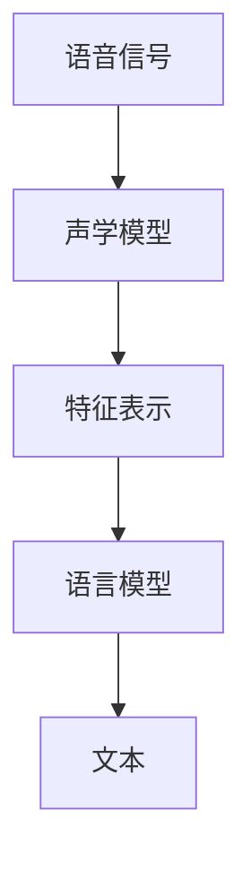

                 

# 深度学习在跨语言语音识别中的研究进展

## 关键词
- 跨语言语音识别
- 深度学习
- 神经网络
- 语音编码
- 语言模型
- 声学模型
- 多语言语料库

## 摘要
本文将探讨深度学习在跨语言语音识别领域的研究进展。通过分析深度学习的基本原理，我们将了解其如何应用于跨语言语音识别。接着，我们将详细阐述声学模型和语言模型的构建方法，并探讨现有的一些优秀算法。随后，文章将分享跨语言语音识别的实际应用场景，并提供相关的工具和资源推荐。最后，我们将总结当前的研究成果，并提出未来的发展趋势与挑战。

## 1. 背景介绍

### 1.1 跨语言语音识别的定义

跨语言语音识别是一种将语音信号转换为文本的技术，它可以在不同语言之间进行转换。这意味着，即使语音是以一种未知语言输入的，系统仍然能够将其识别为正确的文本。跨语言语音识别在多语言环境中具有广泛的应用，例如在全球化企业、旅游行业、国际会议等领域。

### 1.2 跨语言语音识别的挑战

跨语言语音识别面临许多挑战，包括：

- **语言差异**：不同语言之间的语音特征差异很大，使得模型在识别时难以准确处理。
- **语言资源的匮乏**：某些语言的语音数据可能非常有限，导致模型训练不足。
- **多语言背景噪声**：在多语言环境中，噪声和背景语音可能干扰识别过程。

### 1.3 深度学习的发展

深度学习是机器学习的一个分支，其通过多层神经网络来模拟人类大脑的思考方式。随着计算能力的提升和数据规模的扩大，深度学习在图像识别、自然语言处理等领域取得了显著成果。这使得深度学习在跨语言语音识别领域也具有了广泛的应用前景。

## 2. 核心概念与联系

### 2.1 声学模型

声学模型是跨语言语音识别的核心组件，它负责将语音信号转换为特征表示。声学模型通常使用深度神经网络，通过训练大量语音数据来学习语音特征和声学规律。

### 2.2 语言模型

语言模型负责将声学模型输出的特征表示转换为文本。语言模型也使用深度神经网络，通过学习语言统计规律和语法结构来生成文本。

### 2.3 Mermaid 流程图

以下是一个简单的 Mermaid 流程图，展示了声学模型和语言模型的构建过程：



## 3. 核心算法原理 & 具体操作步骤

### 3.1 声学模型原理

声学模型通常使用卷积神经网络（CNN）或递归神经网络（RNN）来构建。CNN 可以提取语音信号的局部特征，而 RNN 可以捕捉语音信号的时序信息。以下是一个简单的声学模型操作步骤：

1. **数据预处理**：将语音信号转换为音频帧。
2. **特征提取**：使用 CNN 或 RNN 提取语音特征。
3. **模型训练**：使用大量语音数据训练声学模型。
4. **模型评估**：使用测试数据评估模型性能。

### 3.2 语言模型原理

语言模型通常使用循环神经网络（RNN）或长短期记忆网络（LSTM）来构建。RNN 和 LSTM 可以学习语言序列的长期依赖关系。以下是一个简单的语言模型操作步骤：

1. **数据预处理**：将语音特征序列转换为词向量。
2. **模型训练**：使用大量文本数据训练语言模型。
3. **模型评估**：使用测试数据评估模型性能。

## 4. 数学模型和公式 & 详细讲解 & 举例说明

### 4.1 声学模型数学模型

声学模型通常使用卷积神经网络（CNN）或递归神经网络（RNN）来构建。以下是一个简单的 CNN 数学模型：

$$
h_{l}^{T} = \text{ReLU}(\mathbf{W}_{l}^{T} \cdot \mathbf{h}_{l-1} + b_{l})
$$

其中，$h_{l}$ 是第 $l$ 层的输出，$\mathbf{W}_{l}^{T}$ 是第 $l$ 层的权重，$b_{l}$ 是第 $l$ 层的偏置，$\text{ReLU}$ 是 ReLU 激活函数。

### 4.2 语言模型数学模型

语言模型通常使用循环神经网络（RNN）或长短期记忆网络（LSTM）来构建。以下是一个简单的 LSTM 数学模型：

$$
i_{t} = \sigma(\mathbf{W}_{i} \cdot \mathbf{h}_{t-1} + \mathbf{U}_{i} \cdot \mathbf{y}_{t-1} + b_{i}) \\
f_{t} = \sigma(\mathbf{W}_{f} \cdot \mathbf{h}_{t-1} + \mathbf{U}_{f} \cdot \mathbf{y}_{t-1} + b_{f}) \\
\bar{C}_{t} = \text{tanh}(\mathbf{W}_{c} \cdot \mathbf{h}_{t-1} + \mathbf{U}_{c} \cdot \mathbf{y}_{t-1} + b_{c}) \\
o_{t} = \sigma(\mathbf{W}_{o} \cdot \mathbf{h}_{t-1} + \mathbf{U}_{o} \cdot \mathbf{y}_{t-1} + b_{o}) \\
\mathbf{h}_{t} = o_{t} \cdot \text{tanh}(\mathbf{C}_{t})
$$

其中，$i_{t}$、$f_{t}$、$o_{t}$ 分别是输入门、遗忘门和输出门，$\mathbf{h}_{t-1}$ 是前一个时间步的隐藏状态，$\mathbf{y}_{t-1}$ 是前一个时间步的输出，$\mathbf{C}_{t}$ 是当前时间步的细胞状态，$\sigma$ 是 sigmoid 激活函数。

## 5. 项目实战：代码实际案例和详细解释说明

### 5.1 开发环境搭建

在开始项目实战之前，我们需要搭建一个合适的开发环境。以下是一个简单的步骤：

1. 安装 Python（建议使用 3.6 或以上版本）。
2. 安装深度学习框架，如 TensorFlow 或 PyTorch。
3. 安装必要的依赖库，如 NumPy、Pandas 等。

### 5.2 源代码详细实现和代码解读

以下是一个简单的跨语言语音识别项目的代码示例：

```python
import tensorflow as tf
from tensorflow.keras.models import Model
from tensorflow.keras.layers import Input, Conv2D, MaxPooling2D, LSTM, Dense

# 定义声学模型
input_layer = Input(shape=(None, 13))
conv1 = Conv2D(filters=32, kernel_size=(3, 3), activation='relu')(input_layer)
maxpool1 = MaxPooling2D(pool_size=(2, 2))(conv1)
lstm1 = LSTM(units=128, activation='tanh')(maxpool1)
output_layer = Dense(units=num_classes, activation='softmax')(lstm1)

# 构建声学模型
acoustic_model = Model(inputs=input_layer, outputs=output_layer)
acoustic_model.compile(optimizer='adam', loss='categorical_crossentropy', metrics=['accuracy'])

# 定义语言模型
input_layer = Input(shape=(None, num_features))
lstm2 = LSTM(units=128, activation='tanh')(input_layer)
dense1 = Dense(units=num_classes, activation='softmax')(lstm2)

# 构建语言模型
language_model = Model(inputs=input_layer, outputs=dense1)
language_model.compile(optimizer='adam', loss='categorical_crossentropy', metrics=['accuracy'])

# 模型训练
acoustic_model.fit(x_train_acoustic, y_train_acoustic, epochs=10, batch_size=32, validation_split=0.2)
language_model.fit(x_train_language, y_train_language, epochs=10, batch_size=32, validation_split=0.2)

# 模型评估
acoustic_model.evaluate(x_test_acoustic, y_test_acoustic)
language_model.evaluate(x_test_language, y_test_language)
```

这段代码展示了如何使用 TensorFlow 框架构建和训练声学模型和语言模型。首先，我们定义了声学模型的输入层、卷积层、最大池化层和 LSTM 层，并使用 ReLU 激活函数。然后，我们定义了语言模型的输入层、LSTM 层和全连接层，并使用 softmax 激活函数。接下来，我们编译模型，并使用训练数据训练模型。最后，我们评估模型的性能。

## 6. 实际应用场景

跨语言语音识别在实际应用中具有广泛的应用场景，包括：

- **国际化企业**：跨语言语音识别可以帮助企业处理来自不同国家的客户咨询，提高客户满意度。
- **旅游行业**：跨语言语音识别可以为游客提供实时翻译服务，帮助游客更好地了解当地文化。
- **国际会议**：跨语言语音识别可以为会议提供实时翻译，提高会议的沟通效果。

## 7. 工具和资源推荐

### 7.1 学习资源推荐

- **书籍**：
  - 《深度学习》（Goodfellow, Bengio, Courville 著）
  - 《自然语言处理综合教程》（Jurafsky, Martin 著）
- **论文**：
  - 《End-to-End Speech Recognition with Deep Neural Networks》（Hinton, Deng, Yu 等著）
  - 《Deep Learning for Speech Recognition》（Hinton, Deng 等著）
- **博客**：
  - [TensorFlow 官方文档](https://www.tensorflow.org/)
  - [PyTorch 官方文档](https://pytorch.org/)
- **网站**：
  - [Kaggle](https://www.kaggle.com/)
  - [GitHub](https://github.com/)

### 7.2 开发工具框架推荐

- **深度学习框架**：TensorFlow、PyTorch
- **语音识别库**：Kaldi、OpenSMILE
- **自然语言处理库**：NLTK、spaCy

### 7.3 相关论文著作推荐

- 《Speech Recognition with Deep Neural Networks》（Hinton, Deng, Yu 等著）
- 《Improving Deep Neural Networks for Acoustic Modeling in Speech Recognition》（Deng, Hinton 等著）
- 《A Lecturn on Speech Recognition and Deep Learning》（Deng 著）

## 8. 总结：未来发展趋势与挑战

跨语言语音识别在深度学习技术的推动下取得了显著进展。未来，随着数据规模的扩大、算法的优化和计算能力的提升，跨语言语音识别有望在更多场景中得到应用。然而，仍存在以下挑战：

- **数据资源不足**：某些语言的数据资源相对匮乏，限制了模型的性能。
- **模型泛化能力**：现有模型在处理未知语言时可能表现不佳，需要提高模型的泛化能力。
- **实时性要求**：在实际应用中，跨语言语音识别需要满足实时性的要求，这对模型的计算效率提出了挑战。

## 9. 附录：常见问题与解答

### 9.1 什么是跨语言语音识别？

跨语言语音识别是一种将语音信号转换为文本的技术，可以在不同语言之间进行转换。

### 9.2 深度学习在跨语言语音识别中有什么优势？

深度学习通过多层神经网络模拟人类大脑的思考方式，可以在大规模数据上进行高效训练，从而提高跨语言语音识别的准确性和性能。

### 9.3 跨语言语音识别有哪些实际应用场景？

跨语言语音识别可以应用于国际化企业、旅游行业、国际会议等多个场景，提高沟通效率和用户体验。

## 10. 扩展阅读 & 参考资料

- [Speech Recognition with Deep Neural Networks](https://www.cs.toronto.edu/~hinton/absps/speech.pdf)
- [Improving Deep Neural Networks for Acoustic Modeling in Speech Recognition](https://www.microsoft.com/en-us/research/publication/improving-deep-neural-networks-for-acoustic-modeling-in-speech-recognition/)
- [A Lecturn on Speech Recognition and Deep Learning](https://www.amazon.com/Lectern-Speech-Recognition-Deep-Learning/dp/1119362342)
- [TensorFlow 官方文档](https://www.tensorflow.org/)
- [PyTorch 官方文档](https://pytorch.org/)

