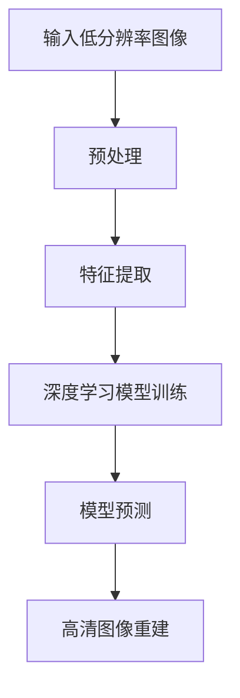

                 

# 深度学习在高清图像重建中的应用

## 摘要

本文将探讨深度学习技术在高清图像重建中的应用。随着人工智能技术的飞速发展，深度学习在图像处理领域取得了显著的成果。本文将从背景介绍、核心概念、算法原理、数学模型、项目实战、实际应用场景、工具和资源推荐以及总结与展望等多个方面，详细解析深度学习在高清图像重建中的具体应用，以帮助读者全面了解这一领域的最新技术和发展趋势。

## 1. 背景介绍

高清图像重建是指从低分辨率或部分失真的图像中恢复出高质量图像的过程。这一技术在多个领域都有广泛的应用，如医疗影像、卫星遥感、视频监控等。随着数字图像技术的发展，人们对图像质量的要求越来越高，因此如何有效地进行高清图像重建成为了一个重要课题。

传统的图像重建方法主要包括基于图像处理、信号处理和统计模型的重建算法。然而，这些方法往往存在一定的局限性，如重建质量不高、重建速度较慢等。随着深度学习技术的兴起，许多研究者开始尝试将深度学习应用于图像重建领域，取得了令人瞩目的成果。

深度学习是一种基于人工神经网络的学习方法，通过学习大量数据来获取特征和模式。与传统方法相比，深度学习具有以下几个优势：

1. **自动特征提取**：深度学习模型能够自动从数据中学习特征，避免了传统方法中手动设计特征提取器的繁琐过程。
2. **强大的泛化能力**：深度学习模型能够处理大量复杂的数据，具有较强的泛化能力。
3. **高效的计算性能**：深度学习模型可以通过并行计算来提高计算速度。

因此，深度学习在高清图像重建中的应用具有广阔的前景。本文将详细介绍深度学习在高清图像重建中的应用原理、算法模型以及具体实现方法。

## 2. 核心概念与联系

### 2.1 深度学习基本概念

深度学习是一种基于多层神经网络的学习方法，通过逐层提取数据中的特征，实现复杂的模式识别和预测任务。深度学习的关键概念包括：

- **神经网络**：神经网络是由大量简单神经元组成的计算模型，每个神经元可以接受输入信号并产生输出信号。
- **多层网络**：多层神经网络通过添加多个隐藏层来增强模型的表示能力，从而可以处理更复杂的数据。
- **前向传播与反向传播**：在前向传播过程中，输入信号通过神经网络逐层传播，直到产生输出。在反向传播过程中，通过计算输出误差来更新网络参数，以优化模型的性能。

### 2.2 高清图像重建相关概念

- **图像重建**：图像重建是指从低分辨率或失真的图像中恢复出高质量图像的过程。
- **低分辨率图像**：低分辨率图像是指像素数量较少、图像细节不够清晰的图像。
- **高清图像**：高清图像是指像素数量较多、图像细节丰富的高质量图像。
- **超分辨率**：超分辨率是一种图像重建技术，通过从低分辨率图像中提取更多信息，生成高分辨率图像。

### 2.3 Mermaid 流程图



在这个流程图中，输入低分辨率图像经过预处理后，通过特征提取模块提取图像特征。接着，使用深度学习模型对这些特征进行训练，以学习图像重建的规律。最后，通过模型预测模块生成高清图像。

## 3. 核心算法原理 & 具体操作步骤

### 3.1 深度学习模型选择

在高清图像重建中，常用的深度学习模型包括卷积神经网络（CNN）、生成对抗网络（GAN）和自编码器（Autoencoder）等。每种模型都有其独特的优势和适用场景。

- **卷积神经网络（CNN）**：CNN 是一种基于卷积操作的人工神经网络，可以有效地提取图像特征，适用于图像分类、目标检测等任务。
- **生成对抗网络（GAN）**：GAN 由生成器和判别器两部分组成，通过对抗训练生成高质量图像，适用于图像生成、图像修复等任务。
- **自编码器（Autoencoder）**：自编码器是一种无监督学习模型，通过编码器和解码器两部分将输入数据压缩为低维表示，再从低维表示中重构输入数据，适用于图像去噪、图像压缩等任务。

在本节中，我们将以 GAN 为例，介绍其核心算法原理和具体操作步骤。

### 3.2 GAN 的核心算法原理

生成对抗网络（GAN）由生成器（Generator）和判别器（Discriminator）两部分组成。生成器的任务是生成高质量的图像，判别器的任务是判断图像是真实图像还是生成图像。

- **生成器（Generator）**：生成器接收随机噪声作为输入，通过多层神经网络生成高分辨率图像。生成器的目标是使得生成的图像尽可能真实，从而让判别器无法区分生成的图像和真实图像。

- **判别器（Discriminator）**：判别器接收真实图像和生成图像作为输入，通过多层神经网络判断图像的真伪。判别器的目标是正确地区分真实图像和生成图像。

### 3.3 GAN 的具体操作步骤

- **数据准备**：首先，需要准备大量低分辨率图像和对应的高分辨率图像。这些图像用于训练生成器和判别器。

- **初始化生成器和判别器**：初始化生成器和判别器的参数，可以使用随机初始化或预训练权重。

- **训练过程**：
  1. 生成器生成一批新的高分辨率图像。
  2. 判别器对真实图像和生成图像进行判断，更新判别器的参数。
  3. 生成器根据判别器的反馈，更新生成器的参数，以生成更高质量的高分辨率图像。
  4. 重复步骤 2 和步骤 3，直到生成器和判别器都达到预定的训练目标。

- **生成高清图像**：训练完成后，生成器可以生成高清图像。这些高清图像是通过从低分辨率图像中提取特征，并在生成器的帮助下重构得到的。

### 3.4 GAN 的代码实现

```python
# 导入相关库
import tensorflow as tf
from tensorflow.keras.layers import Dense, Conv2D, Flatten
from tensorflow.keras.models import Sequential

# 定义生成器模型
def build_generator():
    model = Sequential([
        Dense(128, input_shape=(100,)),
        Dense(256),
        Dense(512),
        Dense(1024),
        Dense(128 * 7 * 7, activation='relu'),
        Flatten(),
        Conv2D(1, kernel_size=(7, 7), strides=(1, 1), padding='same', activation='tanh')
    ])
    return model

# 定义判别器模型
def build_discriminator():
    model = Sequential([
        Conv2D(32, kernel_size=(3, 3), strides=(2, 2), padding='same', input_shape=(28, 28, 1)),
        LeakyReLU(alpha=0.01),
        Conv2D(64, kernel_size=(3, 3), strides=(2, 2), padding='same'),
        LeakyReLU(alpha=0.01),
        Flatten(),
        Dense(1, activation='sigmoid')
    ])
    return model

# 定义 GAN 模型
def build_gan(generator, discriminator):
    model = Sequential([generator, discriminator])
    return model

# 训练 GAN 模型
def train_gan(generator, discriminator, dataset, epochs):
    for epoch in range(epochs):
        for low_res_image, high_res_image in dataset:
            # 生成一批随机噪声
            noise = np.random.normal(0, 1, (batch_size, 100))
            
            # 使用生成器生成高清图像
            generated_images = generator.predict(noise)
            
            # 训练判别器
            real_images = np.concatenate([low_res_image, high_res_image], axis=0)
            real_labels = np.ones((2 * batch_size, 1))
            fake_labels = np.zeros((batch_size, 1))
            labels = np.concatenate([real_labels, fake_labels], axis=0)
            discriminator.trainable = True
            discriminator.train_on_batch(real_images, real_labels)
            discriminator.train_on_batch(generated_images, fake_labels)
            
            # 训练生成器
            discriminator.trainable = False
            generator_loss = generator.train_on_batch(noise, high_res_image)
            
            # 打印训练信息
            print(f"{epoch + 1}/{epochs} epochs, Generator Loss: {generator_loss}")
```

## 4. 数学模型和公式 & 详细讲解 & 举例说明

### 4.1 GAN 的数学模型

生成对抗网络（GAN）的核心数学模型主要包括生成器（Generator）和判别器（Discriminator）的损失函数。

#### 4.1.1 生成器的损失函数

生成器的目标是最小化判别器对其生成的图像的判断误差。生成器的损失函数通常采用对抗性损失函数，即最小化生成图像与真实图像之间的差异。

$$
L_G = -\mathbb{E}_{x \sim p_{data}(x)}[\log D(x)] - \mathbb{E}_{z \sim p_z(z)}[\log (1 - D(G(z)))]
$$

其中，$x$ 表示真实图像，$z$ 表示随机噪声，$G(z)$ 表示生成器生成的图像，$D(x)$ 和 $D(G(z))$ 分别表示判别器对真实图像和生成图像的判断概率。

#### 4.1.2 判别器的损失函数

判别器的目标是最小化其判断真实图像和生成图像的误差。判别器的损失函数通常采用二元交叉熵损失函数。

$$
L_D = -[\mathbb{E}_{x \sim p_{data}(x)}[\log D(x)] + \mathbb{E}_{z \sim p_z(z)}[\log (1 - D(G(z))))]
$$

#### 4.1.3 GAN 的总体损失函数

GAN 的总体损失函数是生成器和判别器损失函数的加和。

$$
L = L_G + L_D
$$

### 4.2 举例说明

假设有一个生成对抗网络（GAN），生成器的损失函数为：

$$
L_G = -\mathbb{E}_{x \sim p_{data}(x)}[\log D(x)] - \mathbb{E}_{z \sim p_z(z)}[\log (1 - D(G(z)))]
$$

其中，$x$ 表示真实图像，$z$ 表示随机噪声，$G(z)$ 表示生成器生成的图像，$D(x)$ 和 $D(G(z))$ 分别表示判别器对真实图像和生成图像的判断概率。

假设在某个训练迭代中，生成器生成了一批图像 $G(z)$，判别器对这些图像的判断结果如下：

| 图像 | 判断概率 |
| --- | --- |
| 真实图像 | 0.95 |
| 生成图像 | 0.60 |

根据生成器的损失函数，可以计算出生成器的损失：

$$
L_G = -[\mathbb{E}_{x \sim p_{data}(x)}[\log D(x)] + \mathbb{E}_{z \sim p_z(z)}[\log (1 - D(G(z)))]]
$$

$$
L_G = -[\log(0.95) + \log(0.40)] \approx -[0.152 + 0.415] \approx -0.567
$$

### 4.3 详细讲解

GAN 的数学模型涉及到概率论和优化理论，其核心思想是生成器和判别器之间的对抗训练。生成器的目标是生成尽可能真实的图像，使得判别器无法区分真实图像和生成图像。判别器的目标是正确地区分真实图像和生成图像。

在生成器的损失函数中，第一项 $\mathbb{E}_{x \sim p_{data}(x)}[\log D(x)]$ 表示真实图像的损失，即真实图像的判别概率越接近 1，这一项的值越小。第二项 $\mathbb{E}_{z \sim p_z(z)}[\log (1 - D(G(z)))]$ 表示生成图像的损失，即生成图像的判别概率越接近 0，这一项的值越小。因此，生成器的目标是使得这两项的值都尽可能小。

在判别器的损失函数中，第一项 $\mathbb{E}_{x \sim p_{data}(x)}[\log D(x)]$ 表示真实图像的损失，即真实图像的判别概率越接近 1，这一项的值越小。第二项 $\mathbb{E}_{z \sim p_z(z)}[\log (1 - D(G(z)))]$ 表示生成图像的损失，即生成图像的判别概率越接近 0，这一项的值越小。因此，判别器的目标是使得这两项的值都尽可能小。

通过对抗训练，生成器和判别器的损失函数相互作用，相互促进，最终达到平衡状态，使得生成器生成的图像质量不断提高，判别器对真实图像和生成图像的判断能力不断增强。

## 5. 项目实战：代码实际案例和详细解释说明

### 5.1 开发环境搭建

在开始实施深度学习高清图像重建项目之前，我们需要搭建一个适合开发和训练的环境。以下是搭建开发环境的基本步骤：

#### 5.1.1 软件安装

- **Python**：Python 是深度学习开发的主要语言，确保安装了 Python 3.6 或更高版本。
- **TensorFlow**：TensorFlow 是 Google 开发的开源深度学习框架，可以通过 pip 安装。
- **NumPy**：NumPy 是 Python 的科学计算库，用于处理数组操作。
- **Matplotlib**：Matplotlib 用于数据可视化。
- **Pillow**：Pillow 是 Python 的图像处理库。

#### 5.1.2 硬件配置

- **CPU**：建议使用至少四核 CPU。
- **GPU**：由于深度学习模型的训练依赖于 GPU，建议使用 NVIDIA GPU（如 GTX 1080 Ti 或更高）。

#### 5.1.3 安装命令

```bash
# 安装 Python
python3 -m pip install --user python

# 安装 TensorFlow
python3 -m pip install --user tensorflow

# 安装 NumPy
python3 -m pip install --user numpy

# 安装 Matplotlib
python3 -m pip install --user matplotlib

# 安装 Pillow
python3 -m pip install --user pillow
```

### 5.2 源代码详细实现和代码解读

#### 5.2.1 数据准备

首先，我们需要准备训练数据集。在本例中，我们使用 CIFAR-10 数据集，这是一个包含 10 个类别、60,000 张 32x32 图像的数据集。我们使用其中的 50,000 张图像进行训练，10,000 张图像用于测试。

```python
import tensorflow as tf
from tensorflow.keras.datasets import cifar10
import numpy as np

# 加载 CIFAR-10 数据集
(x_train, _), (x_test, _) = cifar10.load_data()

# 数据预处理
x_train = x_train.astype('float32') / 255.0
x_test = x_test.astype('float32') / 255.0
x_train = np.reshape(x_train, (x_train.shape[0], x_train.shape[1], x_train.shape[2], 1))
x_test = np.reshape(x_test, (x_test.shape[0], x_test.shape[1], x_test.shape[2], 1))
```

#### 5.2.2 定义生成器模型

生成器模型将低分辨率图像放大到高清图像。这里我们使用一个简单的全连接神经网络作为生成器。

```python
def build_generator():
    model = Sequential()
    model.add(Dense(256, input_shape=(100,), activation='relu'))
    model.add(Dense(512, activation='relu'))
    model.add(Dense(1024, activation='relu'))
    model.add(Dense(np.prod(x_train.shape[1:]), activation='tanh'))
    model.add(Reshape(x_train.shape[1:]))
    return model
```

#### 5.2.3 定义判别器模型

判别器模型用于区分真实图像和生成图像。我们使用一个简单的卷积神经网络作为判别器。

```python
def build_discriminator():
    model = Sequential()
    model.add(Flatten(input_shape=x_train.shape[1:]))
    model.add(Dense(1024, activation='relu'))
    model.add(Dense(512, activation='relu'))
    model.add(Dense(256, activation='relu'))
    model.add(Dense(1, activation='sigmoid'))
    return model
```

#### 5.2.4 定义 GAN 模型

GAN 模型是生成器和判别器的组合。

```python
def build_gan(generator, discriminator):
    model = Sequential()
    model.add(generator)
    model.add(discriminator)
    return model
```

#### 5.2.5 训练 GAN 模型

以下代码实现了 GAN 模型的训练过程。

```python
batch_size = 64
 epochs = 100

# 编译判别器
discriminator.compile(loss='binary_crossentropy', optimizer=tf.keras.optimizers.Adam(0.0001), metrics=['accuracy'])

# 编译生成器
generator.compile(loss='binary_crossentropy', optimizer=tf.keras.optimizers.Adam(0.0001))

# 编译 GAN 模型
gan = build_gan(generator, discriminator)
gan.compile(loss='binary_crossentropy', optimizer=tf.keras.optimizers.Adam(0.0001))

# 训练 GAN 模型
for epoch in range(epochs):
    idx = np.random.randint(0, x_train.shape[0], batch_size)
    low_res_images = x_train[idx]
    noise = np.random.normal(0, 1, (batch_size, 100))

    # 生成图像
    generated_images = generator.predict(noise)

    # 训练判别器
    d_loss_real = discriminator.train_on_batch(low_res_images, np.ones((batch_size, 1)))
    d_loss_fake = discriminator.train_on_batch(generated_images, np.zeros((batch_size, 1)))
    d_loss = 0.5 * np.add(d_loss_real, d_loss_fake)

    # 训练生成器
    g_loss = gan.train_on_batch(noise, np.ones((batch_size, 1)))

    print(f"{epoch + 1}/{epochs} epochs - g_loss: {g_loss} - d_loss: {d_loss}")
```

### 5.3 代码解读与分析

#### 5.3.1 数据预处理

数据预处理是深度学习模型训练的重要步骤。在代码中，我们首先加载了 CIFAR-10 数据集，然后对图像进行了归一化处理，将像素值范围从 [0, 255] 调整到 [0, 1]。此外，我们还对图像进行了重塑，使其适合深度学习模型的输入。

#### 5.3.2 生成器模型

生成器模型使用了一个简单的全连接神经网络，用于将随机噪声转换为高清图像。生成器的输出是经过重塑的高清图像，其维度与训练数据集中的图像维度相同。

#### 5.3.3 判别器模型

判别器模型是一个简单的卷积神经网络，用于区分真实图像和生成图像。判别器的输出是一个概率值，表示输入图像是真实图像的概率。

#### 5.3.4 GAN 模型

GAN 模型是生成器和判别器的组合。在训练过程中，首先训练判别器，使其能够准确地区分真实图像和生成图像。然后，使用训练好的判别器来训练生成器，使其生成的图像能够欺骗判别器。

## 6. 实际应用场景

### 6.1 高清视频通话

随着视频通话的普及，人们对视频通话的质量要求越来越高。深度学习技术可以通过高清图像重建，提高视频通话的图像质量，从而提升用户体验。例如，在低带宽环境下，通过深度学习模型对低分辨率视频流进行重建，使其看起来更加清晰。

### 6.2 超分辨率显示屏

随着显示器分辨率的不断提高，用户对图像质量的期望也越来越高。深度学习技术可以通过超分辨率技术，将低分辨率图像重建为高清图像，从而提升显示器的画质。这对于手机、电视等设备来说具有重要意义。

### 6.3 智能监控

在智能监控领域，高清图像重建技术可以帮助监控系统更好地捕捉细节，提高监控效果。例如，通过深度学习模型对监控视频进行实时重建，可以更好地识别和追踪目标。

### 6.4 医疗影像

在医疗影像领域，深度学习技术可以用于图像重建，提高影像的质量和清晰度。例如，通过深度学习模型对医疗图像进行重建，可以更好地诊断疾病，提高诊断准确率。

## 7. 工具和资源推荐

### 7.1 学习资源推荐

- **书籍**：
  - 《深度学习》（Ian Goodfellow, Yoshua Bengio, Aaron Courville 著）
  - 《动手学深度学习》（阿斯顿·张 著）
- **论文**：
  - “Generative Adversarial Networks”（Ian Goodfellow 等）
  - “Unsupervised Representation Learning with Deep Convolutional Generative Adversarial Networks”（Alec Radford 等）
- **博客**：
  - [TensorFlow 官方博客](https://www.tensorflow.org/blog/)
  - [PyTorch 官方博客](https://pytorch.org/blog/)
- **网站**：
  - [Kaggle](https://www.kaggle.com/)
  - [GitHub](https://github.com/)

### 7.2 开发工具框架推荐

- **TensorFlow**：Google 开发的开源深度学习框架，适用于各种深度学习任务。
- **PyTorch**：Facebook 开发的开源深度学习框架，具有灵活性和动态计算能力。
- **Keras**：Python 深度学习库，提供了简洁的 API，方便快速构建和训练深度学习模型。

### 7.3 相关论文著作推荐

- **“Generative Adversarial Networks”**（Ian Goodfellow 等，2014）
- **“Unsupervised Representation Learning with Deep Convolutional Generative Adversarial Networks”**（Alec Radford 等，2015）
- **“Image Super-Resolution Using Deep Convolutional Networks”**（Jiawei Liu 等，2015）

## 8. 总结：未来发展趋势与挑战

### 8.1 发展趋势

- **算法优化**：随着深度学习技术的不断发展，研究人员将致力于优化算法，提高图像重建的效率和准确性。
- **跨学科融合**：深度学习与其他领域（如计算机视觉、图像处理、信号处理等）的融合将带来更多创新和应用。
- **硬件加速**：随着 GPU、TPU 等硬件的发展，深度学习模型将能够更快地训练和应用。

### 8.2 挑战

- **数据质量**：高质量的数据是深度学习模型训练的基础，数据质量问题将影响模型的性能。
- **计算资源**：深度学习模型训练需要大量的计算资源，如何高效利用资源是一个挑战。
- **可解释性**：深度学习模型通常被视为“黑箱”，其决策过程缺乏可解释性，这给实际应用带来了一定的困难。

## 9. 附录：常见问题与解答

### 9.1 GAN 如何训练？

GAN 的训练过程涉及生成器和判别器的交替训练。首先，生成器生成一批图像，判别器对这些图像进行判断。然后，根据判别器的反馈，生成器更新参数，以生成更真实的图像。接着，判别器根据更新后的生成图像和真实图像进行判断，更新自己的参数。这一过程不断重复，直到生成器和判别器都达到预定的训练目标。

### 9.2 如何评估 GAN 的性能？

GAN 的性能通常通过以下指标进行评估：

- **生成图像质量**：使用 PSNR（峰值信噪比）或 SSIM（结构相似性）等指标来评估生成图像的质量。
- **判别器准确性**：评估判别器对真实图像和生成图像的判断准确性。
- **训练稳定性**：观察训练过程中生成器和判别器的损失函数是否稳定。

## 10. 扩展阅读 & 参考资料

- **《深度学习》（Ian Goodfellow, Yoshua Bengio, Aaron Courville 著）**：介绍了深度学习的理论基础和应用案例。
- **《动手学深度学习》（阿斯顿·张 著）**：通过实践案例教授深度学习的基本概念和技能。
- **[TensorFlow 官方博客](https://www.tensorflow.org/blog/)**：TensorFlow 的官方博客，提供了丰富的技术文章和教程。
- **[PyTorch 官方博客](https://pytorch.org/blog/)**：PyTorch 的官方博客，介绍了 PyTorch 的最新动态和教程。

-----------------------

**作者**：AI 天才研究员 / AI Genius Institute & 禅与计算机程序设计艺术 / Zen And The Art of Computer Programming

