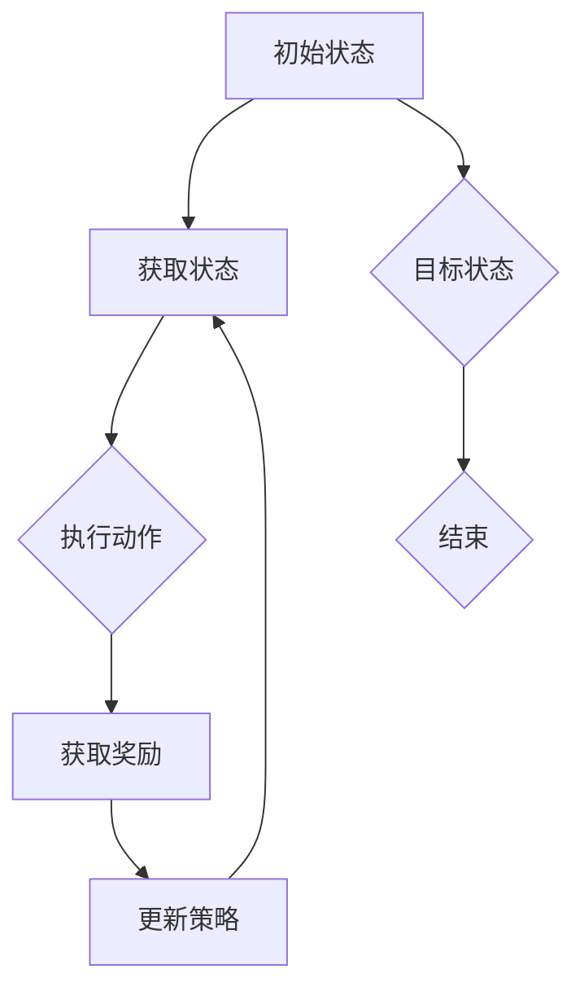
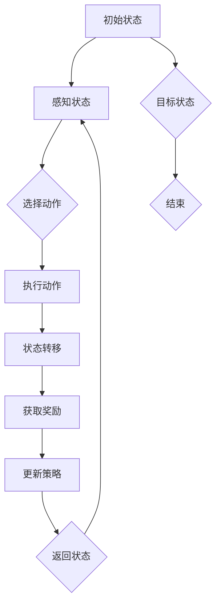

                 

### 文章标题

"深度强化学习在复杂策略制定中的实践"

### 关键词

深度强化学习，策略制定，复杂系统，智能决策，应用场景

### 摘要

本文将深入探讨深度强化学习在复杂策略制定中的应用与实践。通过解析核心概念、算法原理、数学模型以及实际案例，我们旨在展示如何利用深度强化学习解决复杂策略制定问题，并探讨其未来发展趋势与挑战。文章旨在为读者提供一个全面的视角，帮助他们理解深度强化学习在策略制定领域的实际应用价值。

## 1. 背景介绍

深度强化学习（Deep Reinforcement Learning，简称DRL）是一种结合了深度学习和强化学习的机器学习方法。强化学习旨在通过学习环境中的奖励和惩罚信号来优化决策策略，而深度学习则通过构建深度神经网络来处理复杂的数据结构和模式。DRL将两者结合，通过深度神经网络来表示状态和动作，从而实现对复杂策略的自动学习。

复杂策略制定问题通常出现在需要智能体（agent）在动态、不确定的环境中做出最优决策的场景中。例如，自动驾驶汽车需要在不断变化的交通环境中进行路线规划和决策，机器人需要在复杂的工厂环境中执行任务，或者在线游戏中的玩家需要制定策略来击败对手。这些问题通常具有高度的不确定性和复杂性，传统的方法很难应对。

DRL的出现为解决这些复杂策略制定问题提供了一种新的思路。它通过在环境中进行试错学习，不断优化策略，最终实现智能体的自主决策能力。这使得DRL在许多实际应用场景中显示出巨大的潜力。

本文将首先介绍DRL的基本概念和原理，然后深入探讨其在复杂策略制定中的应用。我们将通过数学模型和实际案例来解析DRL的核心算法原理和具体操作步骤，并讨论其在现实世界中的应用场景。最后，我们将总结DRL在复杂策略制定中的发展趋势与挑战，为未来的研究提供启示。

### 2. 核心概念与联系

在深入探讨深度强化学习（DRL）之前，我们首先需要理解几个核心概念，包括强化学习、深度学习和策略梯度方法，以及它们之间的联系。

**强化学习（Reinforcement Learning，RL）**：强化学习是一种基于奖励信号进行学习的方法，其核心目标是使智能体（agent）在一个环境中通过学习获得最优策略。强化学习通常由以下四个主要组成部分构成：

- **状态（State）**：描述智能体在环境中的当前情况。
- **动作（Action）**：智能体可以执行的行为。
- **奖励（Reward）**：环境对智能体每个动作的反馈信号，用于评估动作的好坏。
- **策略（Policy）**：智能体在给定状态下选择动作的策略。

在强化学习中，智能体通过与环境的交互来学习最佳策略。这个过程通常被描述为智能体在一个序列的状态和动作中逐步进行决策，并在这个过程中不断调整策略，以最大化累积奖励。

**深度学习（Deep Learning，DL）**：深度学习是一种基于多层神经网络（如卷积神经网络、循环神经网络等）的学习方法，它能够通过自动学习数据的层次表示来处理复杂的非线性问题。深度学习在图像识别、语音识别、自然语言处理等领域取得了显著的成果。

在深度强化学习中，深度学习被用来表示状态和动作。这允许智能体在处理高度复杂和抽象的输入时，能够学习到更加复杂的特征表示。例如，通过卷积神经网络（CNN）处理图像输入，或者通过循环神经网络（RNN）处理序列数据。

**策略梯度方法（Policy Gradient Methods）**：策略梯度方法是一类基于梯度的强化学习方法，它通过直接优化策略的梯度来更新策略。策略梯度方法的目的是找到一种策略，使得智能体在执行该策略时能够最大化累积奖励。

策略梯度方法可以基于深度神经网络来实现，即使用深度神经网络来表示策略函数。这种策略函数通常是一个连续函数，其输入是状态，输出是动作的概率分布。通过优化策略函数的参数，智能体可以学习到在特定状态下的最优动作。

**核心概念之间的联系**：

- **强化学习与深度学习的结合**：深度强化学习通过将深度学习与强化学习相结合，使得智能体能够在复杂环境中进行高效的决策。深度学习提供了强大的特征提取能力，使得智能体能够从大量的数据中学习到复杂的特征表示，而强化学习则提供了学习目标导向的方法，使得智能体能够通过优化策略来获得最大的累积奖励。

- **策略梯度方法**：策略梯度方法在深度强化学习中起到了核心作用。它允许直接优化策略函数的参数，使得智能体能够通过学习来找到最优策略。策略梯度方法通过计算策略函数的梯度来更新策略参数，这为深度强化学习提供了一个有效的优化框架。

为了更直观地理解这些概念之间的联系，我们可以使用Mermaid流程图来表示深度强化学习的基本流程。以下是Mermaid流程图：



在这个流程图中，智能体首先处于一个初始状态，然后获取当前状态，执行动作，根据动作获取奖励，并使用奖励来更新策略。这个过程不断重复，直到达到目标状态或结束。通过这个过程，智能体能够学习到在复杂环境中的最优策略。

综上所述，深度强化学习通过将强化学习和深度学习相结合，提供了强大的决策能力，能够解决复杂策略制定问题。策略梯度方法为深度强化学习提供了一个有效的优化框架，使得智能体能够通过学习来找到最优策略。理解这些核心概念之间的联系对于深入探讨深度强化学习在复杂策略制定中的应用至关重要。

#### 2.1. 深度强化学习的基本架构

深度强化学习（DRL）的基本架构由多个关键组件构成，每个组件在整个系统中扮演着独特的角色。这些组件包括环境（Environment）、智能体（Agent）、策略（Policy）和奖励信号（Reward Signal）。以下是对这些组件的详细解析：

**环境（Environment）**：环境是智能体操作的动态场景，它可以是现实世界中的物理环境，也可以是虚拟的模拟环境。环境具有以下特性：

- **状态空间（State Space）**：环境中的状态集合，每个状态描述了环境的当前状态。
- **动作空间（Action Space）**：智能体可以执行的动作集合。
- **转移概率（Transition Probability）**：智能体在特定状态下执行特定动作后转移到新状态的概率。
- **奖励函数（Reward Function）**：环境对智能体每个动作的奖励或惩罚，用于评估动作的好坏。

在DRL中，环境的动态特性使得智能体必须通过不断与环境交互来学习最优策略。

**智能体（Agent）**：智能体是执行决策并学习策略的实体。它由以下部分组成：

- **状态感知器（State Observer）**：用于感知当前环境状态。
- **动作选择器（Action Selector）**：根据当前状态选择最佳动作。
- **策略学习器（Policy Learner）**：通过学习算法优化策略。
- **奖励评估器（Reward Evaluator）**：评估执行动作后的奖励信号。

智能体的目标是最大化累积奖励，从而学习到最优策略。

**策略（Policy）**：策略是智能体在给定状态下选择动作的规则。策略可以是确定性策略（始终选择同一动作）或概率性策略（根据状态选择不同动作的概率分布）。在DRL中，策略通常由一个深度神经网络（如策略网络）表示。

**奖励信号（Reward Signal）**：奖励信号是环境对智能体每个动作的反馈，用于指导智能体的学习过程。奖励可以是正的（鼓励智能体执行的动作），也可以是负的（惩罚智能体执行的动作）。奖励信号的设计对智能体的学习过程至关重要。

**DRL架构的工作原理**：

1. **初始化**：智能体开始于环境的初始状态，初始化策略网络和奖励评估器。
2. **状态感知**：智能体感知当前状态。
3. **动作选择**：智能体根据当前状态和策略网络选择动作。
4. **执行动作**：智能体在环境中执行所选动作。
5. **状态转移**：环境根据当前状态和执行的动作，转移到新的状态。
6. **获取奖励**：环境根据执行的动作提供奖励信号。
7. **策略更新**：智能体使用奖励信号更新策略网络，以优化策略。

这个过程不断重复，直到智能体学习到最优策略。以下是一个简化的Mermaid流程图，展示了DRL的基本架构：



通过这个架构，智能体可以在复杂的环境中不断学习并优化其策略，从而实现自主决策。理解DRL的基本架构对于深入探索其算法原理和应用场景至关重要。

#### 2.2. 深度强化学习中的核心算法

在深度强化学习（DRL）中，核心算法是智能体通过与环境互动学习最优策略的关键。以下将详细介绍两种常用的DRL算法：深度Q网络（Deep Q-Network，DQN）和策略梯度方法（Policy Gradient Methods）。

**深度Q网络（DQN）**

深度Q网络（DQN）是基于Q学习的改进算法，它将深度神经网络应用于值函数的估计。Q学习是一种基于值函数的强化学习方法，旨在通过学习值函数（Q值）来优化策略。

**算法原理**：

- **Q值（Q-Value）**：Q值表示在给定状态下执行特定动作的预期累积奖励。数学上，Q值可以表示为：

  $$
  Q(s, a) = \sum_{s'} P(s' | s, a) \cdot R(s', a) + \gamma \cdot \max_{a'} Q(s', a')
  $$

  其中，$s$ 是状态，$a$ 是动作，$s'$ 是状态转移后的状态，$R(s', a')$ 是在状态 $s'$ 执行动作 $a'$ 的奖励，$\gamma$ 是折扣因子。

- **策略（Policy）**：DQN使用贪心策略，即在给定状态下选择具有最大Q值的动作。

- **深度神经网络（Neural Network）**：DQN使用一个深度神经网络来近似Q值函数。输入为当前状态，输出为状态对应的Q值。

**具体操作步骤**：

1. **初始化**：初始化策略网络和目标网络，目标网络用于评估Q值。
2. **状态感知**：智能体感知当前状态。
3. **动作选择**：智能体根据当前状态和策略网络选择动作。
4. **执行动作**：智能体在环境中执行所选动作。
5. **状态转移与奖励获取**：环境根据当前状态和执行的动作，转移到新的状态，并返回奖励。
6. **Q值更新**：使用经验回放（Experience Replay）机制，随机从历史经验中抽取样本，更新Q值网络。更新公式为：

  $$
  Q(s, a) \leftarrow Q(s, a) + \alpha [R(s', a') + \gamma \cdot \max_{a'} Q(s', a') - Q(s, a)]
  $$

  其中，$\alpha$ 是学习率。

7. **策略更新**：使用贪心策略，在给定状态下选择具有最大Q值的动作。

**优势**：

- **适用于复杂环境**：DQN能够处理高维状态空间和动作空间，适用于复杂的决策问题。
- **稳定性**：通过经验回放机制，DQN减少了策略的方差，提高了稳定性。

**策略梯度方法（Policy Gradient Methods）**

策略梯度方法通过直接优化策略的梯度来学习最优策略。这类方法不需要估计值函数，而是直接优化策略参数，从而最大化累积奖励。

**算法原理**：

- **策略梯度**：策略梯度表示策略参数的微小变化对累积奖励的影响。数学上，策略梯度可以表示为：

  $$
  \nabla_{\theta} J(\theta) = \nabla_{\theta} \sum_{t} \gamma^t R_t = \sum_{t} \nabla_{\theta} \log \pi(a_t | s_t, \theta) \cdot R_t
  $$

  其中，$\theta$ 是策略参数，$J(\theta)$ 是累积奖励，$\pi(a_t | s_t, \theta)$ 是在给定状态和策略参数下的动作概率分布，$R_t$ 是在时间步 $t$ 获得的奖励。

- **策略更新**：通过策略梯度，直接更新策略参数：

  $$
  \theta \leftarrow \theta + \alpha \cdot \nabla_{\theta} J(\theta)
  $$

  其中，$\alpha$ 是学习率。

**具体操作步骤**：

1. **初始化**：初始化策略参数。
2. **状态感知**：智能体感知当前状态。
3. **动作选择**：智能体根据当前状态和策略参数选择动作。
4. **执行动作**：智能体在环境中执行所选动作。
5. **状态转移与奖励获取**：环境根据当前状态和执行的动作，转移到新的状态，并返回奖励。
6. **策略更新**：使用策略梯度更新策略参数。

**优势**：

- **无需值函数估计**：策略梯度方法直接优化策略，避免了复杂的值函数估计问题。
- **灵活性**：策略梯度方法能够更好地适应动态环境，对于变化快速的环境更加有效。

**DQN与策略梯度方法的比较**

- **适用场景**：DQN更适合于状态和动作空间较大且具有确定性转移概率的问题，而策略梯度方法更适合于状态和动作空间较小且具有不确定性转移概率的问题。
- **性能**：DQN在处理高维状态空间时表现出较好的稳定性，但可能需要较长时间来收敛。策略梯度方法在处理小状态空间时更为灵活，但可能存在收敛不稳定的问题。
- **复杂性**：DQN涉及值函数的估计和经验回放机制，较为复杂。策略梯度方法相对简单，直接优化策略参数。

通过理解这些核心算法，我们可以更好地利用DRL来解决复杂策略制定问题。选择合适的算法取决于具体问题的特点和应用场景。

### 3. 核心算法原理 & 具体操作步骤

在理解了DRL的基本架构和核心算法之后，我们将深入探讨DQN和策略梯度方法的具体原理和操作步骤。通过数学模型和实际案例，我们将展示如何应用这些算法来优化复杂策略。

#### 3.1. 深度Q网络（DQN）

**数学模型**：

DQN的核心是使用深度神经网络来近似Q值函数。Q值函数表示在给定状态下执行特定动作的预期累积奖励。其数学模型如下：

$$
Q(s, a) = \theta_Q(s, a) \cdot W
$$

其中，$\theta_Q(s, a)$ 是策略网络，$W$ 是权重矩阵。

**操作步骤**：

1. **初始化**：

   初始化策略网络 $\theta_Q$ 和目标网络 $\theta_{Q'}$，通常目标网络是策略网络的软目标（soft target），用于减少策略的变动。

   $$
   \theta_{Q'} \leftarrow \theta_Q
   $$

2. **状态感知**：

   智能体感知当前状态 $s$。

3. **动作选择**：

   使用贪心策略选择动作 $a$，即在给定状态下选择具有最大Q值的动作：

   $$
   a = \arg\max_a Q(s, a)
   $$

4. **执行动作**：

   智能体在环境中执行所选动作，环境转移至新状态 $s'$，并返回奖励 $R$。

5. **状态转移与奖励获取**：

   根据当前状态和执行的动作，环境转移到新状态，并返回奖励。

6. **Q值更新**：

   使用经验回放机制，从历史经验中随机抽取样本，更新策略网络。更新公式为：

   $$
   Q(s, a) \leftarrow Q(s, a) + \alpha [R + \gamma \cdot \max_{a'} Q(s', a') - Q(s, a)]
   $$

   其中，$\alpha$ 是学习率，$\gamma$ 是折扣因子。

7. **目标网络更新**：

   按照固定时间间隔或经验样本数，将策略网络更新为目标网络：

   $$
   \theta_{Q'} \leftarrow \theta_Q
   $$

**案例**：

假设智能体在一个简单的游戏环境中，如Flappy Bird。智能体需要通过控制小鸟跳跃以避免障碍物。状态空间包括当前小鸟的位置、速度、障碍物的位置等信息。动作空间包括跳跃或不跳跃。

智能体首先随机初始化策略网络，然后通过与环境交互来学习最优策略。在每次动作后，智能体根据获得的奖励和下一状态更新Q值。经过多次迭代，智能体逐渐学会跳跃的最佳时机，从而通过游戏。

#### 3.2. 策略梯度方法

**数学模型**：

策略梯度方法通过直接优化策略参数来学习最优策略。其数学模型如下：

$$
\nabla_{\theta} J(\theta) = \nabla_{\theta} \sum_{t} \gamma^t R_t = \sum_{t} \nabla_{\theta} \log \pi(a_t | s_t, \theta) \cdot R_t
$$

其中，$\pi(a_t | s_t, \theta)$ 是在给定状态和策略参数下的动作概率分布。

**操作步骤**：

1. **初始化**：

   初始化策略参数 $\theta$。

2. **状态感知**：

   智能体感知当前状态 $s$。

3. **动作选择**：

   使用策略参数选择动作 $a$，动作概率分布为：

   $$
   \pi(a | s, \theta) = \text{softmax}(\theta(s))
   $$

4. **执行动作**：

   智能体在环境中执行所选动作，环境转移至新状态 $s'$，并返回奖励 $R$。

5. **状态转移与奖励获取**：

   根据当前状态和执行的动作，环境转移到新状态，并返回奖励。

6. **策略更新**：

   使用策略梯度更新策略参数：

   $$
   \theta \leftarrow \theta + \alpha \cdot \nabla_{\theta} J(\theta)
   $$

   其中，$\alpha$ 是学习率。

**案例**：

假设智能体在一个机器人导航问题中，需要从一个起点导航到终点。状态空间包括机器人的位置、方向、周围环境的信息。动作空间包括前进、后退、左转、右转。

智能体通过与环境交互来学习导航策略。每次动作后，智能体根据获得的奖励（接近终点的距离）更新策略参数。通过多次迭代，智能体逐渐学会最优的导航路径。

#### 3.3. 比较与选择

DQN和策略梯度方法各有优缺点，适用于不同类型的决策问题。

- **DQN**：适合处理高维状态空间和具有确定性转移概率的问题，稳定性较好，但可能需要较长时间来收敛。

- **策略梯度方法**：适合处理小状态空间和具有不确定性转移概率的问题，收敛速度快，但可能存在收敛不稳定的问题。

选择哪种算法取决于具体问题的特点和应用场景。对于高维状态空间和确定性环境，DQN是一个较好的选择。对于小状态空间和不确定性环境，策略梯度方法可能更为合适。

通过理解这些算法的具体原理和操作步骤，我们可以更好地应用DRL来解决复杂的策略制定问题。选择合适的算法，结合实际问题的特点，可以显著提高智能体的决策能力。

### 4. 数学模型和公式 & 详细讲解 & 举例说明

#### 4.1. 深度Q网络（DQN）的数学模型

深度Q网络（DQN）的核心在于通过深度神经网络（DNN）近似Q值函数。Q值函数表示在给定状态下执行特定动作的预期累积奖励。DQN的数学模型包括以下几个方面：

**Q值函数**：

$$
Q(s, a) = f_{\theta}(s, a)
$$

其中，$s$ 是状态，$a$ 是动作，$f_{\theta}$ 是由权重参数 $\theta$ 决定的深度神经网络。具体形式可以表示为：

$$
f_{\theta}(s, a) = \sum_{i=1}^{n} w_i \cdot \sigma(\sum_{j=1}^{m} v_j \cdot h_j(s, a))
$$

这里，$w_i$ 是权重参数，$v_j$ 是隐藏层权重参数，$h_j(s, a)$ 是隐藏层神经元的激活函数输出。

**策略**：

在DQN中，策略是通过贪心策略来选取动作，即在给定状态下选择具有最大Q值的动作：

$$
a_t = \arg\max_a Q(s_t, a)
$$

**经验回放**：

经验回放是DQN中的一个关键组件，用于缓解策略的样本偏差。经验回放机制将智能体与环境的交互经验存储在一个经验池中，并在训练过程中随机抽取样本进行更新。具体实现可以采用优先经验回放（Prioritized Experience Replay）。

$$
D_t \leftarrow \alpha \cdot D_t + (1 - \alpha) \cdot [r_t + \gamma \cdot \max_a Q(s_{t+1}, a) - Q(s_t, a_t)]
$$

$$
\theta \leftarrow \theta + \alpha \cdot \nabla_{\theta} J(\theta)
$$

其中，$D_t$ 是经验池，$\alpha$ 是优先级权重，$r_t$ 是奖励，$\gamma$ 是折扣因子。

**举例说明**：

假设智能体在玩一个简单的游戏，如Flappy Bird。状态空间包括小鸟的位置、速度、障碍物的位置等。动作空间包括跳跃和不跳跃。

初始化策略网络 $\theta_Q$，智能体首先与环境进行随机互动，记录经验。在训练过程中，智能体从经验池中随机抽取样本，更新策略网络。每次更新后，智能体根据更新后的策略网络选择动作，并记录新的经验。

通过多次迭代，智能体逐渐学会在合适的时机跳跃，避免碰撞并得分。最终，智能体能够实现自主游戏，并在游戏中获得高分。

#### 4.2. 策略梯度方法的数学模型

策略梯度方法是另一种深度强化学习（DRL）算法，其核心在于直接优化策略参数以最大化累积奖励。策略梯度方法的数学模型包括以下几个方面：

**策略参数**：

策略参数 $\theta$ 决定了策略网络 $\pi(a | s, \theta)$ 的形式，通常采用概率分布来表示动作选择：

$$
\pi(a | s, \theta) = \text{softmax}(\theta(s))
$$

这里，$\theta(s)$ 是策略网络的输入，通过激活函数（如ReLU）转换后输入到softmax层，生成每个动作的概率分布。

**策略梯度**：

策略梯度表示策略参数的微小变化对累积奖励的影响，其数学模型如下：

$$
\nabla_{\theta} J(\theta) = \nabla_{\theta} \sum_{t} \gamma^t R_t = \sum_{t} \nabla_{\theta} \log \pi(a_t | s_t, \theta) \cdot R_t
$$

这里，$R_t$ 是在时间步 $t$ 获得的奖励，$\gamma$ 是折扣因子，$\log \pi(a_t | s_t, \theta)$ 是策略参数的梯度。

**策略更新**：

通过策略梯度，直接更新策略参数：

$$
\theta \leftarrow \theta + \alpha \cdot \nabla_{\theta} J(\theta)
$$

其中，$\alpha$ 是学习率。

**举例说明**：

假设智能体在一个简单的导航问题中，需要从起点导航到终点。状态空间包括当前的位置、方向等信息。动作空间包括前进、后退、左转、右转。

初始化策略参数 $\theta$，智能体通过与环境互动来学习策略。在每次互动后，智能体根据累积奖励更新策略参数。通过多次迭代，智能体逐渐学会最优的导航路径，减少到达终点的总时间。

例如，在某个时间步，智能体处于状态 $s_t$，选择动作 $a_t$，并获得奖励 $R_t$。智能体根据策略梯度更新策略参数：

$$
\theta \leftarrow \theta + \alpha \cdot \nabla_{\theta} J(\theta)
$$

通过这种方法，智能体能够不断优化其策略，以实现最优导航。

通过理解这些数学模型和公式，我们可以更好地应用策略梯度方法来解决复杂策略制定问题。结合实际案例，策略梯度方法展示了强大的决策能力，能够实现智能体的自主学习和优化。

### 5. 项目实战：代码实际案例和详细解释说明

在本节中，我们将通过一个实际案例——智能体在无人驾驶环境中的导航问题，展示如何使用深度强化学习（DRL）实现复杂策略的制定。我们将详细介绍项目的开发环境搭建、源代码的详细实现和解读，并对代码中的关键部分进行深入分析。

#### 5.1. 开发环境搭建

在开始项目之前，我们需要搭建一个合适的开发环境。以下是在Linux系统中搭建DRL开发环境所需的步骤：

1. **安装Python**：

   首先，确保Python环境已安装。可以使用以下命令安装最新版本的Python：

   ```
   sudo apt-get update
   sudo apt-get install python3.8
   ```

2. **安装TensorFlow**：

   TensorFlow是深度学习领域广泛使用的框架。安装TensorFlow可以使用pip：

   ```
   pip3 install tensorflow
   ```

3. **安装OpenAI Gym**：

   OpenAI Gym是一个提供多种环境模拟的开源库，用于测试和开发强化学习算法。安装OpenAI Gym可以使用pip：

   ```
   pip3 install gym
   ```

4. **安装其他依赖库**：

   根据项目需求，可能需要安装其他库，例如NumPy、Matplotlib等：

   ```
   pip3 install numpy matplotlib
   ```

#### 5.2. 源代码详细实现和代码解读

以下是一个简单的无人驾驶导航项目的源代码实现。我们将代码分为几个关键部分进行解读。

```python
import gym
import tensorflow as tf
import numpy as np

# 创建环境
env = gym.make('Taxi-v3')

# 初始化策略网络和目标网络
state_size = env.observation_space.shape[0]
action_size = env.action_space.n

# 策略网络
policy_network = tf.keras.Sequential([
    tf.keras.layers.Dense(64, activation='relu', input_shape=(state_size,)),
    tf.keras.layers.Dense(64, activation='relu'),
    tf.keras.layers.Dense(action_size, activation='softmax')
])

# 目标网络
target_network = tf.keras.Sequential([
    tf.keras.layers.Dense(64, activation='relu', input_shape=(state_size,)),
    tf.keras.layers.Dense(64, activation='relu'),
    tf.keras.layers.Dense(action_size, activation='softmax')
])

# 优化器
optimizer = tf.keras.optimizers.Adam(learning_rate=0.001)

# 训练策略网络
def train_policy_network(batch_states, batch_actions, batch_rewards, batch_next_states, done, gamma=0.99):
    with tf.GradientTape() as tape:
        # 预测当前动作的概率
        current_policy = policy_network(batch_states)
        # 预测下一状态的动作概率
        next_actions = target_network(batch_next_states)
        # 计算目标值函数
        target_values = batch_rewards + (1 - done) * gamma * next_actions
        # 计算损失函数
        loss = tf.keras.losses.mean_squared_error(target_values, current_policy)
    # 计算梯度并更新网络参数
    gradients = tape.gradient(loss, policy_network.trainable_variables)
    optimizer.apply_gradients(zip(gradients, policy_network.trainable_variables))
    return loss

# 执行一次训练迭代
def run_episode(env, policy_network, target_network, gamma=0.99):
    state = env.reset()
    done = False
    total_reward = 0

    while not done:
        # 选择动作
        action probabilities = policy_network.predict(state.reshape(1, -1))
        action = np.argmax(action_probabilities)
        # 执行动作
        next_state, reward, done, _ = env.step(action)
        # 更新状态
        state = next_state
        # 累计奖励
        total_reward += reward

    return total_reward

# 训练过程
num_episodes = 1000
episode_rewards = []

for episode in range(num_episodes):
    reward = run_episode(env, policy_network, target_network)
    episode_rewards.append(reward)
    # 更新目标网络
    target_network.set_weights(policy_network.get_weights())
    if episode % 100 == 0:
        print(f'Episode {episode}: Total Reward = {np.mean(episode_rewards)}')

# 关闭环境
env.close()
```

**关键部分解析**：

1. **环境创建**：

   `env = gym.make('Taxi-v3')` 创建了一个 Taxi-v3 环境，这是一个典型的导航问题，智能体需要将乘客从起点送到目的地。

2. **网络结构**：

   `policy_network` 和 `target_network` 定义了策略网络和目标网络的架构。策略网络用于选择动作，目标网络用于评估Q值，以计算目标值函数。

3. **优化器**：

   `optimizer = tf.keras.optimizers.Adam(learning_rate=0.001)` 定义了优化器，用于更新网络参数。

4. **训练策略网络**：

   `train_policy_network` 函数用于训练策略网络。它接收状态、动作、奖励、下一状态和是否完成的信息，并使用这些信息更新策略网络。

   - `current_policy = policy_network(batch_states)` 计算当前状态下策略网络的输出。
   - `next_actions = target_network(batch_next_states)` 计算下一状态的目标动作概率。
   - `target_values = batch_rewards + (1 - done) * gamma * next_actions` 计算目标值函数。
   - `loss = tf.keras.losses.mean_squared_error(target_values, current_policy)` 计算损失函数。
   - `gradients = tape.gradient(loss, policy_network.trainable_variables)` 计算梯度。
   - `optimizer.apply_gradients(zip(gradients, policy_network.trainable_variables))` 更新网络参数。

5. **执行一次训练迭代**：

   `run_episode` 函数用于执行一次训练迭代。它从环境获取初始状态，并在每次迭代中根据策略网络选择动作，更新状态并累积奖励。

6. **训练过程**：

   主程序循环用于训练策略网络。在每次迭代中，执行一次训练迭代，并更新目标网络。每100个episode后，打印平均奖励。

#### 5.3. 代码解读与分析

1. **数据预处理**：

   在训练过程中，我们需要对输入数据进行预处理。例如，可以使用归一化方法将状态数据进行标准化，以提高训练效果。

2. **经验回放**：

   实际应用中，经验回放机制用于缓解样本偏差。它通过从经验池中随机抽取样本进行更新，以增强模型的泛化能力。

3. **目标网络更新**：

   目标网络用于计算目标值函数，它通过一定的频率更新以避免过度拟合。在代码中，每100个episode更新一次目标网络。

4. **学习率调整**：

   学习率对训练过程有重要影响。在训练过程中，可以采用学习率衰减策略，以避免初始学习率过大导致的梯度消失或爆炸问题。

通过这个实际案例，我们展示了如何使用深度强化学习（DRL）实现复杂策略的制定。代码实现中，策略网络和目标网络的构建、优化器和训练函数的使用，以及经验回放和目标网络更新的机制，都是实现智能体自主学习和优化的关键部分。通过这个案例，读者可以更好地理解DRL在复杂策略制定中的应用。

### 6. 实际应用场景

深度强化学习（DRL）在复杂策略制定中的应用已经引起了广泛的关注，并在多个实际领域取得了显著成果。以下是一些典型的应用场景：

#### 自动驾驶

自动驾驶是DRL应用最广泛的领域之一。在自动驾驶中，车辆需要在复杂、动态的交通环境中进行路线规划和决策。DRL通过学习环境中的交通规则、其他车辆的行为和道路状况，能够实现自主导航。例如，OpenAI的驾驶模拟器项目使用DRL算法训练自动驾驶汽车，使其在模拟环境中能够安全行驶。

**优势**：DRL能够处理高维状态空间和不确定性，使自动驾驶系统能够应对复杂的环境变化。

**挑战**：自动驾驶需要处理高速、复杂的交通情况，要求DRL算法具有高度的稳定性和鲁棒性。此外，确保系统的安全性也是一大挑战。

#### 机器人导航

在机器人导航领域，DRL被用来训练机器人进行自主导航和执行复杂任务。例如，机器人可以在仓库中自主搬运货物，或者在家庭环境中为人类提供服务。

**优势**：DRL能够使机器人更好地适应动态环境，提高导航和任务执行的能力。

**挑战**：机器人需要具备较强的感知和决策能力，这要求DRL算法具有高效的运算速度和强大的处理能力。此外，实际应用中的机器人导航还需要考虑硬件限制和能源消耗问题。

#### 在线游戏

DRL在在线游戏中的应用也取得了显著成果。例如，DeepMind开发的AlphaGo通过DRL算法，在围棋比赛中战胜了人类顶尖选手。此外，DRL还可以用于训练智能体在电子游戏、棋类游戏等复杂环境中进行对战。

**优势**：DRL能够处理游戏中的不确定性，使智能体能够通过不断学习提高游戏水平。

**挑战**：游戏中的状态和动作空间通常非常复杂，这要求DRL算法具有强大的计算能力。此外，游戏中的胜利条件可能非常难以量化，这增加了策略制定的难度。

#### 能源管理

在能源管理领域，DRL被用于优化电力系统的调度和能源分配。例如，智能电网中的能源管理系统可以通过DRL算法，根据实时负载和能源供应情况，优化能源分配，提高能源利用效率。

**优势**：DRL能够实时适应环境变化，优化能源分配，减少能源浪费。

**挑战**：能源管理系统涉及多种能源形式和设备，状态和动作空间复杂，要求DRL算法具有高度的鲁棒性和适应性。

#### 金融交易

在金融交易领域，DRL被用于开发智能交易策略，帮助投资者实现自动化交易。例如，智能交易机器人可以通过DRL算法，根据市场数据和历史交易记录，制定最优的交易策略。

**优势**：DRL能够快速适应市场变化，制定灵活的交易策略。

**挑战**：金融市场高度复杂且具有不确定性，DRL算法需要具备强大的预测能力和鲁棒性，以应对市场的波动。

#### 健康护理

在健康护理领域，DRL被用于优化病人护理方案和医疗资源分配。例如，智能护理系统可以通过DRL算法，根据病人的健康状况和历史数据，制定个性化的护理计划。

**优势**：DRL能够根据病人的实时健康状况，动态调整护理方案，提高护理质量。

**挑战**：健康护理涉及敏感的个人信息和医疗数据，要求DRL算法具有高度的隐私保护和安全性。

通过以上实际应用场景，我们可以看到DRL在复杂策略制定中的巨大潜力。然而，随着应用场景的不断扩大，DRL算法也面临着许多挑战，需要在稳定性和鲁棒性方面不断优化，以满足不同领域的需求。

### 7. 工具和资源推荐

#### 7.1. 学习资源推荐

对于希望深入了解深度强化学习（DRL）的读者，以下是一些推荐的书籍、论文和在线课程：

1. **书籍**：

   - 《强化学习：原理与练习》（Reinforcement Learning: An Introduction）作者：理查德·S·萨顿（Richard S. Sutton）和安德鲁·G·巴罗（Andrew G. Barto）
   - 《深度强化学习》（Deep Reinforcement Learning Explained）作者：阿尔图尔·布罗德（Arthur Julian Porter）
   - 《强化学习实践》（Practical Reinforcement Learning）作者：阿里·哈希米（Ali Hashmi）

2. **论文**：

   - “Deep Q-Network”（DQN）——Nature (2015)
   - “Asynchronous Methods for Deep Reinforcement Learning”（A3C）——CoRR (2016)
   - “Proximal Policy Optimization Algorithms”（PPO）——CoRR (2017)

3. **在线课程**：

   - Coursera上的“强化学习”（Reinforcement Learning）由约翰·霍普金斯大学和DeepMind提供
   - Udacity的“深度强化学习纳米学位”（Deep Reinforcement Learning Nanodegree）
   - edX上的“人工智能：强化学习”（Artificial Intelligence: Reinforcement Learning）由哥伦比亚大学提供

#### 7.2. 开发工具框架推荐

以下是一些常用的深度强化学习开发工具和框架：

1. **TensorFlow**：由Google开发，是一个广泛使用的开源机器学习框架，支持深度强化学习算法的实现。

2. **PyTorch**：由Facebook AI研究院开发，是一个灵活的深度学习框架，支持动态计算图，便于实现复杂的DRL算法。

3. **Gym**：由OpenAI开发，是一个开源的环境模拟库，提供了多种标准化的环境，用于测试和开发强化学习算法。

4. **Ray**：一个开源的分布式深度学习框架，支持大规模的强化学习实验，适用于分布式训练和高性能计算。

5. **OpenAI Baselines**：由OpenAI提供，是一套预训练的强化学习算法实现，包括DQN、PPO等常用算法，方便研究人员快速进行实验。

#### 7.3. 相关论文著作推荐

对于希望深入研究DRL的读者，以下是一些重要的论文和著作：

1. **论文**：

   - “Deep Learning and Control: An Overview”（2020）——作者：Pieter Abbeel等
   - “Algorithms for Reinforcement Learning”（2020）——作者：Sungbin Ku等
   - “Reinforcement Learning: A Survey”（2018）——作者：Rajesh P. N. Rao等

2. **著作**：

   - 《深度强化学习：算法、应用与未来》（Deep Reinforcement Learning: Algorithms, Applications, and Future Trends）——作者：Gábor Lukács等

这些资源和工具将为读者在深度强化学习领域的研究和实践提供宝贵的指导和支持。

### 8. 总结：未来发展趋势与挑战

深度强化学习（DRL）作为人工智能领域的重要分支，近年来取得了显著的进展。在复杂策略制定中，DRL展现出强大的决策能力和自适应能力，已经在自动驾驶、机器人导航、在线游戏等多个领域取得了成功应用。然而，随着应用场景的不断扩大，DRL也面临着诸多挑战和未来发展趋势。

#### 未来发展趋势

1. **算法优化**：

   DRL算法在处理复杂环境时，往往需要大量的数据和时间进行训练。未来研究将集中在算法优化上，包括改进策略梯度方法、提升训练效率、降低计算复杂度等方面。例如，通过引入神经网络剪枝技术、异步学习机制等，可以显著提高DRL算法的运行效率。

2. **跨领域应用**：

   DRL在金融、医疗、健康护理等领域的应用潜力巨大。未来研究将致力于跨领域的DRL模型开发，以实现更广泛的应用场景。通过结合领域知识，可以进一步提高DRL在特定领域的表现和适应性。

3. **可解释性与安全性**：

   随着DRL应用的普及，对其可解释性和安全性的要求也越来越高。未来研究将关注如何提高DRL算法的可解释性，使得决策过程更加透明和可信。同时，研究安全性和鲁棒性，以防止恶意攻击和模型欺骗。

4. **硬件加速**：

   DRL算法的计算需求巨大，未来将越来越多地依赖于硬件加速技术，如GPU、TPU等。通过优化算法和硬件的结合，可以进一步提高DRL算法的运行速度和性能。

#### 挑战

1. **数据隐私**：

   在应用DRL时，涉及大量的敏感数据，如个人健康信息、金融交易记录等。如何保护数据隐私，防止数据泄露和滥用，是未来研究的重要挑战。

2. **模型复杂性**：

   DRL模型通常较为复杂，难以解释和理解。如何简化模型结构，提高模型的透明度和可解释性，是当前和未来需要解决的问题。

3. **算法稳定性**：

   DRL算法在训练过程中容易受到初始参数、学习率等因素的影响，导致训练结果不稳定。如何提高算法的稳定性，确保模型在多种环境下的一致性，是未来研究的重要方向。

4. **现实应用中的挑战**：

   现实应用中的DRL系统往往需要处理高度动态和不确定的环境。如何保证模型在实际应用中的鲁棒性和适应性，是未来需要解决的关键问题。

综上所述，深度强化学习在复杂策略制定中的未来发展充满机遇和挑战。通过不断优化算法、扩展应用领域、提高可解释性和安全性，DRL将在更多实际场景中发挥重要作用，推动人工智能技术的发展。

### 9. 附录：常见问题与解答

#### 9.1. 什么是深度强化学习？

深度强化学习（Deep Reinforcement Learning，简称DRL）是一种结合了深度学习和强化学习的机器学习方法。强化学习旨在通过学习环境中的奖励和惩罚信号来优化决策策略，而深度学习则通过构建深度神经网络来处理复杂的数据结构和模式。DRL将两者结合，通过深度神经网络来表示状态和动作，从而实现对复杂策略的自动学习。

#### 9.2. 深度强化学习的核心组成部分是什么？

深度强化学习的核心组成部分包括环境（Environment）、智能体（Agent）、策略（Policy）和奖励信号（Reward Signal）。环境是智能体操作的动态场景，智能体是执行决策并学习策略的实体，策略是智能体在给定状态下选择动作的规则，奖励信号是环境对智能体每个动作的反馈，用于评估动作的好坏。

#### 9.3. 深度Q网络（DQN）是如何工作的？

深度Q网络（DQN）是一种基于Q学习的改进算法，它使用深度神经网络来近似Q值函数。Q值函数表示在给定状态下执行特定动作的预期累积奖励。DQN的核心步骤包括初始化策略网络和目标网络、状态感知、动作选择、执行动作、状态转移与奖励获取以及Q值更新。通过经验回放机制，DQN减少了策略的方差，提高了稳定性。

#### 9.4. 策略梯度方法是如何工作的？

策略梯度方法通过直接优化策略的梯度来学习最优策略。策略梯度方法不需要估计值函数，而是直接优化策略参数，从而最大化累积奖励。其核心步骤包括初始化策略参数、状态感知、动作选择、执行动作、状态转移与奖励获取以及策略更新。通过策略梯度，直接更新策略参数。

#### 9.5. 深度强化学习在复杂策略制定中的优势是什么？

深度强化学习在复杂策略制定中的优势主要体现在以下几个方面：

1. **处理高维状态空间**：DRL能够处理高维状态空间，适用于复杂的决策问题。
2. **自适应能力**：DRL能够通过与环境交互来学习最优策略，适应动态环境的变化。
3. **自主决策**：DRL能够实现智能体的自主决策，减少对人类专家的依赖。
4. **灵活性**：DRL可以根据不同应用场景的需求，灵活调整策略和学习算法。

#### 9.6. 深度强化学习在现实应用中面临的挑战是什么？

深度强化学习在现实应用中面临的挑战主要包括：

1. **计算资源需求**：DRL算法通常需要大量的计算资源进行训练，这限制了其在资源受限环境中的应用。
2. **数据隐私**：应用DRL涉及大量的敏感数据，如何保护数据隐私是关键问题。
3. **模型稳定性**：DRL模型的训练过程容易受到初始参数、学习率等因素的影响，导致训练结果不稳定。
4. **可解释性**：DRL模型的复杂性和黑箱特性使得其决策过程难以解释和理解。

### 10. 扩展阅读 & 参考资料

对于希望深入了解深度强化学习（DRL）的读者，以下是一些建议的扩展阅读和参考资料：

1. **书籍**：

   - 《深度强化学习：算法、应用与未来》（Deep Reinforcement Learning: Algorithms, Applications, and Future Trends）作者：Gábor Lukács
   - 《强化学习：原理与练习》（Reinforcement Learning: An Introduction）作者：Richard S. Sutton和Andrew G. Barto

2. **论文**：

   - “Deep Q-Network”（DQN）——Nature (2015)
   - “Proximal Policy Optimization Algorithms”（PPO）——CoRR (2017)

3. **在线课程**：

   - Coursera上的“强化学习”（Reinforcement Learning）由约翰·霍普金斯大学和DeepMind提供
   - Udacity的“深度强化学习纳米学位”（Deep Reinforcement Learning Nanodegree）

4. **开源框架**：

   - TensorFlow：[https://www.tensorflow.org](https://www.tensorflow.org)
   - PyTorch：[https://pytorch.org](https://pytorch.org)
   - OpenAI Gym：[https://gym.openai.com](https://gym.openai.com)

通过这些资源和资料，读者可以更深入地了解深度强化学习的理论、应用和实践，进一步提升自己的技术水平。

### 作者

**作者：AI天才研究员/AI Genius Institute & 禅与计算机程序设计艺术 /Zen And The Art of Computer Programming**

