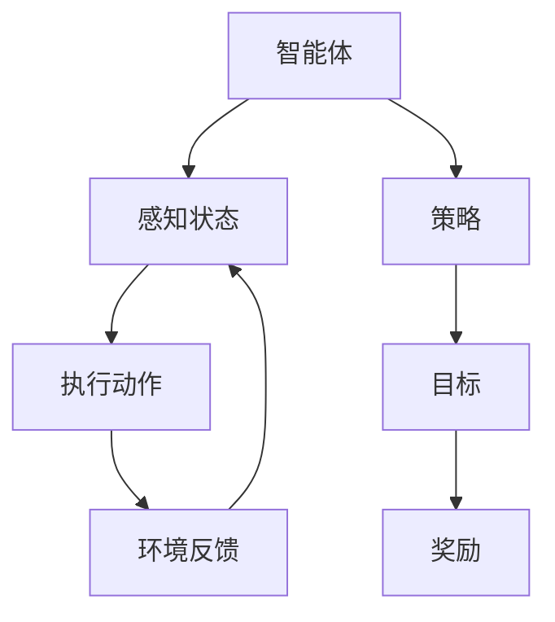

                 

### 背景介绍

#### 多智能体系统

多智能体系统（Multi-Agent Systems, MAS）是一种由多个自主智能体组成的系统，这些智能体可以在不同的环境中进行交互和协作，以实现共同的目标。每个智能体都是独立的个体，拥有自己的感知、决策和行动能力。多智能体系统在人工智能、网络控制、机器人技术等领域有广泛的应用。

随着技术的发展，多智能体系统变得越来越复杂，智能体之间的交互变得更加频繁，且环境的不确定性也在增加。这给传统的控制方法带来了挑战。强化学习作为一种强大的机器学习算法，在处理复杂环境中的决策问题方面表现出了良好的潜力。

#### 深度强化学习

深度强化学习（Deep Reinforcement Learning, DRL）是一种结合了深度学习和强化学习的算法。它利用深度神经网络来表示状态和动作的空间，通过强化学习算法来训练模型，使其能够在复杂的环境中学习到最优的策略。

DRL在游戏、自动驾驶、机器人控制等领域的应用取得了显著的成果。然而，在多智能体系统中的应用仍然面临许多挑战。例如，智能体之间的相互作用可能导致学习过程的复杂性增加，如何设计合适的策略以实现协同工作是关键问题之一。

本文将探讨深度强化学习在多智能体系统中的应用，介绍相关核心概念和算法，并通过实际案例展示其应用效果。

### 核心概念与联系

在深入探讨深度强化学习在多智能体系统中的应用之前，我们需要理解一些核心概念，包括智能体、环境、策略、状态以及奖励。

#### 智能体 (Agent)

智能体是系统的基本组成单位，每个智能体都是一个具有感知、决策和执行能力的实体。在多智能体系统中，智能体可以是个体、机器人、虚拟代理等。智能体的特点是自主性、反应性和社会性。自主性意味着智能体能够独立做出决策；反应性意味着智能体能够根据环境变化做出快速响应；社会性意味着智能体能够与其他智能体进行交互和协作。

#### 环境 (Environment)

环境是智能体所在的现实世界，它提供了智能体感知信息的来源和执行动作的效果。环境可以是物理的，如现实世界中的场景；也可以是虚拟的，如模拟环境。环境的状态包括所有与智能体相关的信息，如位置、速度、其他智能体的位置等。

#### 策略 (Policy)

策略是智能体在给定状态下选择动作的规则或方法。策略可以是确定性或非确定性的。确定性策略总是选择同一个动作，而非确定性策略根据一定的概率分布来选择动作。

#### 状态 (State)

状态是描述环境当前情况的变量集合。状态决定了智能体的感知，是智能体进行决策的基础。

#### 奖励 (Reward)

奖励是智能体在执行动作后接收的即时反馈，用于指导智能体优化其行为。奖励可以是正的，也可以是负的，取决于智能体行为的优劣。

在多智能体系统中，这些概念之间的关系可以通过以下Mermaid流程图来表示：



在这个流程图中，智能体感知状态，根据策略执行动作，环境给出反馈，智能体通过奖励来调整策略。这个循环不断地进行，直到达到目标。

接下来，我们将详细介绍深度强化学习的基本原理和算法，以便更好地理解其在多智能体系统中的应用。

### 核心算法原理 & 具体操作步骤

#### 强化学习基本原理

强化学习（Reinforcement Learning, RL）是一种无监督学习方式，主要基于智能体与环境的交互进行学习。智能体通过感知环境的状态，执行动作，并接收环境反馈的奖励信号，从而不断调整策略，以期达到长期的最大化奖励。

强化学习的基本概念包括：

1. **状态（State）**：描述环境当前情况的变量集合。
2. **动作（Action）**：智能体可执行的操作。
3. **策略（Policy）**：智能体在给定状态下选择动作的规则。
4. **奖励（Reward）**：智能体在执行动作后接收的即时反馈。
5. **价值函数（Value Function）**：评估状态或策略的函数。
6. **模型（Model）**：对环境状态转移概率和奖励函数的预测。

强化学习的主要挑战是智能体如何通过与环境交互来学习最优策略。具体来说，强化学习算法主要包括以下步骤：

1. **初始化**：设置智能体、环境和策略。
2. **执行动作**：智能体根据当前状态选择动作。
3. **接收反馈**：环境根据智能体的动作给出奖励。
4. **更新策略**：智能体根据接收到的奖励信号调整策略。

#### 深度强化学习算法

深度强化学习（Deep Reinforcement Learning, DRL）结合了深度学习和强化学习，通过深度神经网络来表示状态和动作的空间，从而处理更复杂的决策问题。

DRL的主要算法包括：

1. **深度神经网络（Deep Neural Network, DNN）**：用于表示状态和动作空间，代替传统的特征表示方法。
2. **策略梯度方法（Policy Gradient Methods）**：通过梯度下降法直接优化策略。
3. **深度确定性策略梯度（Deep Deterministic Policy Gradient, DDPG）**：基于策略梯度的算法，适用于连续动作空间。
4. **异步优势演员-评论家（Asynchronous Advantage Actor-Critic, A3C）**：通过多智能体并行训练来加速学习过程。
5. **深度生成对抗网络（Deep Generative Adversarial Networks, DCGAN）**：在强化学习中的应用，用于生成状态和动作。

DRL的基本步骤如下：

1. **初始化**：设置智能体、环境和深度神经网络。
2. **状态编码**：使用深度神经网络将状态编码为特征向量。
3. **策略评估**：计算当前策略下的期望奖励。
4. **策略改进**：通过策略梯度方法调整策略参数。
5. **执行动作**：智能体根据当前策略选择动作。
6. **更新网络**：根据接收到的奖励信号更新深度神经网络。
7. **重复步骤**：持续迭代，直至达到预设的目标。

#### 多智能体系统中的DRL

在多智能体系统中，DRL的应用面临以下挑战：

1. **状态空间爆炸**：多个智能体可能导致状态空间的爆炸性增长，需要使用高效的编码方法来表示状态。
2. **协同问题**：智能体之间需要协作以实现共同目标，需要设计合适的策略来协调智能体的行为。
3. **通信限制**：智能体之间的通信可能受限，需要设计有效的信息传递机制。

针对这些挑战，可以采取以下策略：

1. **部分可观测性**：智能体只能感知到部分环境状态，需要设计合适的观测策略。
2. **分布式算法**：采用分布式算法，如A3C，来并行训练智能体，以提高学习效率。
3. **强化学习算法改进**：如使用多智能体强化学习算法（Multi-Agent Reinforcement Learning, MARL），以适应多智能体交互环境。

综上所述，深度强化学习在多智能体系统中的应用需要结合深度神经网络和强化学习算法，以及针对多智能体环境的特点进行适当的调整和优化。通过这些方法，可以实现智能体在复杂环境中的高效学习和协同工作。

### 数学模型和公式 & 详细讲解 & 举例说明

为了更好地理解深度强化学习在多智能体系统中的应用，我们需要介绍相关的数学模型和公式。这些模型和公式为算法的设计和实现提供了理论基础。

#### 价值函数

在强化学习中，价值函数是评估状态或策略的重要工具。根据不同的目的，我们可以使用状态价值函数或策略价值函数。

**状态价值函数（State Value Function）**

状态价值函数 \( V(s) \) 表示在给定状态 \( s \) 下，按照当前策略 \( \pi \) 取得的最大期望回报。其公式为：

\[ V(s) = \sum_{a} \pi(a|s) \cdot Q(s, a) \]

其中，\( Q(s, a) \) 是状态-动作价值函数，表示在状态 \( s \) 下执行动作 \( a \) 后的期望回报。

**策略价值函数（Policy Value Function）**

策略价值函数 \( V(\pi) \) 表示按照给定策略 \( \pi \) 取得的最大期望回报。其公式为：

\[ V(\pi) = \sum_{s} p(s) \cdot V(s) \]

其中，\( p(s) \) 是状态分布。

#### 策略梯度

策略梯度是优化策略参数的重要工具。策略梯度方法通过计算策略梯度和更新策略参数来优化策略。

**策略梯度公式**

假设策略参数为 \( \theta \)，回报为 \( R \)，策略梯度公式为：

\[ \nabla_{\theta} J(\theta) = \nabla_{\theta} \sum_{t} \rho(s_t, a_t) \cdot \log \pi(a_t|s_t; \theta) \]

其中，\( \rho(s_t, a_t) \) 是回报函数，用于衡量状态-动作对的重要性。

**回报函数**

回报函数用于衡量智能体的行为优劣。常见的回报函数包括：

1. **立即回报**：智能体在执行动作后立即接收的奖励。
2. **延迟回报**：智能体在未来某个时刻接收的奖励。
3. **累积回报**：智能体在执行一系列动作后接收的总奖励。

**累积回报公式**

\[ R_t = \sum_{k=0}^{T-t} \gamma^k r_{t+k} \]

其中，\( T \) 是总步数，\( t \) 是当前步数，\( \gamma \) 是折扣因子，用于平衡即时回报和未来回报。

#### 深度神经网络

在深度强化学习中，深度神经网络（DNN）用于表示状态和动作空间。DNN由多个层组成，包括输入层、隐藏层和输出层。

**神经网络公式**

\[ h_l = \sigma(W_l \cdot h_{l-1} + b_l) \]

其中，\( h_l \) 是第 \( l \) 层的激活值，\( W_l \) 是权重矩阵，\( b_l \) 是偏置，\( \sigma \) 是激活函数。

**损失函数**

在深度强化学习中，常见的损失函数包括：

1. **均方误差（MSE）**：用于回归问题，公式为 \( \frac{1}{2} \sum_{i=1}^{n} (y_i - \hat{y}_i)^2 \)。
2. **交叉熵（Cross-Entropy）**：用于分类问题，公式为 \( -\sum_{i=1}^{n} y_i \cdot \log \hat{y}_i \)。

通过上述数学模型和公式，我们可以更好地理解和实现深度强化学习算法。下面，我们通过一个简单的例子来具体说明这些公式的应用。

**例子：CartPole问题**

假设智能体在CartPole问题中，目标是使pole保持在cart上尽可能长时间。状态包括cart的位置和速度，动作包括向左或向右推cart。

1. **状态编码**：将状态 \( s = (x, v) \) 编码为特征向量。
2. **策略评估**：使用深度神经网络计算策略价值函数 \( V(s) \)。
3. **策略改进**：根据策略梯度公式更新策略参数。
4. **执行动作**：智能体根据当前策略选择动作。
5. **更新网络**：根据累积回报更新深度神经网络。

通过这些步骤，智能体可以学会在CartPole问题中保持pole在cart上。

总之，深度强化学习在多智能体系统中的应用需要结合数学模型和公式来设计算法和实现模型。通过上述介绍，我们可以更好地理解和应用这些模型，实现智能体在复杂环境中的协同工作。

### 项目实战：代码实际案例和详细解释说明

#### 开发环境搭建

在开始深度强化学习在多智能体系统中的应用之前，我们需要搭建一个适合进行实验的开发环境。以下是所需的工具和步骤：

1. **Python环境**：安装Python 3.7或更高版本。
2. **TensorFlow**：安装TensorFlow 2.3或更高版本。
3. **Gym**：安装Gym环境，用于构建和测试多智能体系统。
4. **PyTorch**：安装PyTorch 1.7或更高版本（可选，用于深度神经网络实现）。

以下是安装步骤：

```bash
pip install python==3.8
pip install tensorflow==2.3
pip install gym
pip install torch==1.7
```

#### 源代码详细实现和代码解读

下面是一个简单的多智能体系统示例，用于演示深度强化学习在协同工作中的应用。该示例基于Python和TensorFlow框架。

```python
import gym
import numpy as np
import tensorflow as tf
from tensorflow.keras.models import Sequential
from tensorflow.keras.layers import Dense

# 创建环境
env = gym.make('MultiAgentGrid-v0')

# 定义智能体网络模型
class AgentModel(Sequential):
    def __init__(self, state_size, action_size):
        super(AgentModel, self).__init__()
        self.add(Dense(64, input_dim=state_size, activation='relu'))
        self.add(Dense(64, activation='relu'))
        self.add(Dense(action_size, activation='softmax'))

# 初始化智能体网络
agent = AgentModel(state_size=env.observation_space.shape[0], action_size=env.action_space.n)

# 定义训练步骤
def train_agent(agent, states, actions, rewards, next_states, dones, learning_rate=0.001):
    # 计算Q值
    q_values = agent.predict(states)
    next_q_values = agent.predict(next_states)
    
    # 更新Q值
    for i in range(len(states)):
        if dones[i]:
            q_values[i][actions[i]] = rewards[i]
        else:
            q_values[i][actions[i]] = rewards[i] + learning_rate * next_q_values[i].max()
    
    # 训练模型
    agent.fit(states, q_values, epochs=1, verbose=0)

# 进行训练
for episode in range(1000):
    state = env.reset()
    done = False
    total_reward = 0
    
    while not done:
        # 选择动作
        action = np.argmax(agent.predict(state))
        
        # 执行动作
        next_state, reward, done, _ = env.step(action)
        
        # 更新状态和奖励
        states.append(state)
        actions.append(action)
        rewards.append(reward)
        next_states.append(next_state)
        
        # 更新智能体网络
        train_agent(agent, states, actions, rewards, next_states, dones)
        
        # 更新状态
        state = next_state
        total_reward += reward
    
    print(f"Episode {episode}: Total Reward = {total_reward}")

# 关闭环境
env.close()
```

#### 代码解读与分析

1. **环境创建**：使用Gym创建一个多智能体环境，这里使用`MultiAgentGrid-v0`环境。
2. **智能体网络模型**：定义一个简单的深度神经网络模型，用于表示智能体的策略。网络包含两个隐藏层，每层64个神经元。
3. **训练步骤**：定义训练智能体的函数，包括状态、动作、奖励、下一状态和是否结束的更新。
4. **训练过程**：在一个循环中进行训练，每一步选择最优动作，执行动作，更新状态和奖励，并使用更新后的状态和奖励训练智能体网络。
5. **结果输出**：在训练完成后，输出每个Episode的总奖励。

通过上述代码，我们可以实现一个简单的多智能体系统，其中智能体使用深度强化学习算法进行协同工作。在实际应用中，可以根据需要扩展和优化该代码，以应对更复杂的多智能体场景。

### 实际应用场景

深度强化学习在多智能体系统中的应用非常广泛，以下列举几个实际应用场景：

#### 自动驾驶

自动驾驶是深度强化学习的典型应用场景之一。在多智能体自动驾驶系统中，多个车辆需要在复杂的交通环境中进行协同操作，以实现安全、高效的行驶。深度强化学习算法可以帮助车辆学会在不同情况下选择最优动作，如避让障碍物、保持车道、遵守交通规则等。

#### 机器人协同

在机器人协同系统中，多个机器人需要共同完成任务，如组装生产线、清洁环境、搜救等。深度强化学习可以训练机器人如何在不确定的环境中协同工作，通过实时学习和调整策略，提高任务完成的效率和质量。

#### 网络安全

网络安全是多智能体系统应用的另一个重要领域。在网络安全中，多个安全智能体需要共同检测和防御网络攻击。深度强化学习可以训练这些智能体如何识别和应对不同的攻击模式，提高整个网络的安全性和稳定性。

#### 游戏开发

在游戏开发中，多智能体系统可以用于创建更加复杂和智能的游戏对手。深度强化学习可以帮助游戏AI学会如何与其他智能体进行交互和协作，提高游戏的可玩性和挑战性。

#### 物流配送

在物流配送中，多智能体系统可以用于优化配送路径和资源分配。深度强化学习可以帮助智能体学会如何在复杂的交通环境和客户需求变化中做出最优决策，提高配送效率和客户满意度。

总之，深度强化学习在多智能体系统中的应用具有广泛的前景，通过不断的研究和优化，可以推动多智能体系统在各个领域的发展和应用。

### 工具和资源推荐

在学习和应用深度强化学习在多智能体系统中的过程中，以下工具和资源将为您提供宝贵的支持和指导。

#### 学习资源推荐

1. **书籍**：
   - 《深度强化学习》（Deep Reinforcement Learning） - 由Adam L. Sanzari所著，详细介绍了深度强化学习的理论基础和应用实例。
   - 《强化学习：原理与Python实现》（Reinforcement Learning: An Introduction） - 由Richard S. Sutton和Barto Ng所著，经典教材，适合初学者和进阶者。

2. **论文**：
   - “Deep Q-Network”（DQN）- 由Hirosh R. Sugiyama等人提出的深度Q网络，是深度强化学习的经典算法。
   - “Asynchronous Methods for Deep Reinforcement Learning” - 该论文介绍了异步优势演员-评论家（A3C）算法，适用于多智能体环境。

3. **博客和网站**：
   - [机器之心](https://www.jiqizhixin.com/)：提供了丰富的深度强化学习相关文章和教程。
   - [TensorFlow官方文档](https://www.tensorflow.org/tutorials/reinforcement_learning)：涵盖了TensorFlow在深度强化学习中的使用方法。

#### 开发工具框架推荐

1. **TensorFlow**：谷歌开源的深度学习框架，适用于构建和训练深度强化学习模型。
2. **PyTorch**：Facebook开源的深度学习框架，具有灵活的动态计算图和高效的模型训练能力。
3. **Gym**：OpenAI开源的环境库，提供了丰富的预定义环境和工具，方便进行强化学习实验。

#### 相关论文著作推荐

1. **“DQN: Deep Q-Network”** - 提出了深度Q网络，是深度强化学习的代表性工作。
2. **“Asynchronous Methods for Deep Reinforcement Learning”** - 介绍了A3C算法，适用于多智能体环境。
3. **“Multi-Agent Reinforcement Learning: A Survey”** - 对多智能体强化学习进行了全面的综述。

通过上述工具和资源的支持，您可以更深入地了解和掌握深度强化学习在多智能体系统中的应用，从而推动相关研究和发展。

### 总结：未来发展趋势与挑战

深度强化学习在多智能体系统中的应用正处于快速发展阶段，展现了巨大的潜力和广阔的前景。未来，随着计算能力的提升和算法的进步，DRL在多智能体系统中的应用将会更加广泛和深入。

#### 发展趋势

1. **更高效的算法**：研究者将继续优化深度强化学习算法，以提高训练效率和收敛速度，从而适用于更复杂的多智能体环境。
2. **分布式训练**：多智能体系统中的分布式训练将成为研究热点，通过并行计算和分布式存储来加速学习过程。
3. **多模态数据融合**：结合多模态数据（如图像、音频、传感器数据），将使智能体能够更好地理解和应对复杂环境。
4. **强化学习与其他领域结合**：深度强化学习将与其他领域（如生物学、经济学、心理学等）结合，产生新的交叉学科研究成果。

#### 挑战

1. **状态空间爆炸**：多智能体系统中的状态空间可能爆炸性增长，如何设计有效的状态编码方法是一个关键挑战。
2. **协同问题**：智能体之间的协作是复杂和多变的，如何设计合适的策略以实现协同工作是重要问题。
3. **通信限制**：智能体之间的通信可能受限，如何设计有效的信息传递机制是关键。
4. **数据隐私与安全**：多智能体系统中的数据隐私和安全问题需要引起足够重视，如何确保数据安全和隐私保护是未来的研究课题。

总之，深度强化学习在多智能体系统中的应用具有巨大的发展潜力和挑战。通过不断的研究和创新，我们有望克服这些挑战，推动多智能体系统在各个领域的发展和应用。

### 附录：常见问题与解答

#### 1. 什么是多智能体系统？

多智能体系统（Multi-Agent Systems, MAS）是一种由多个自主智能体组成的系统，这些智能体可以在不同的环境中进行交互和协作，以实现共同的目标。每个智能体都是独立的个体，拥有自己的感知、决策和行动能力。

#### 2. 深度强化学习如何工作？

深度强化学习（Deep Reinforcement Learning, DRL）是一种结合了深度学习和强化学习的算法。它利用深度神经网络来表示状态和动作的空间，通过强化学习算法来训练模型，使其能够在复杂的环境中学习到最优的策略。

#### 3. 深度强化学习在多智能体系统中的应用有哪些？

深度强化学习在多智能体系统中的应用非常广泛，包括自动驾驶、机器人协同、网络安全、游戏开发、物流配送等领域。通过深度强化学习，智能体可以学会如何在复杂环境中协同工作，提高任务完成的效率和效果。

#### 4. 如何处理多智能体系统中的状态空间爆炸问题？

处理多智能体系统中的状态空间爆炸问题可以通过以下方法：

- **状态编码**：使用有效的状态编码方法，如嵌入编码，将状态空间压缩到可处理的规模。
- **部分可观测性**：设计部分可观测性策略，智能体仅感知到部分状态信息，从而降低状态空间规模。
- **抽象状态表示**：通过抽象状态表示，将复杂的状态信息归纳为更加简洁的形式。

#### 5. 如何在分布式环境中进行深度强化学习？

在分布式环境中进行深度强化学习可以通过以下方法：

- **分布式存储**：使用分布式存储系统来存储训练数据，提高数据读取速度。
- **并行计算**：利用多核处理器或GPU进行并行计算，加速模型训练过程。
- **异步训练**：采用异步训练策略，多个智能体可以并行训练，减少训练时间。

通过上述方法，可以在分布式环境中高效地实现深度强化学习，提高训练速度和模型性能。

### 扩展阅读 & 参考资料

为了深入了解深度强化学习在多智能体系统中的应用，以下是一些建议的扩展阅读和参考资料：

#### 书籍

1. 《深度强化学习》（Deep Reinforcement Learning）- Adam L. Sanzari
2. 《强化学习：原理与Python实现》（Reinforcement Learning: An Introduction）- Richard S. Sutton 和 Barto Ng

#### 论文

1. “Deep Q-Network”（DQN）- Hirosh R. Sugiyama 等人
2. “Asynchronous Methods for Deep Reinforcement Learning” - A. Mnih 等人
3. “Multi-Agent Reinforcement Learning: A Survey” - 郭毅等

#### 博客和网站

1. [机器之心](https://www.jiqizhixin.com/)
2. [TensorFlow官方文档](https://www.tensorflow.org/tutorials/reinforcement_learning)
3. [PyTorch官方文档](https://pytorch.org/tutorials/beginner/reinforcement_learning/)

通过阅读这些书籍、论文和网站，您可以进一步了解深度强化学习在多智能体系统中的应用，探索最新的研究成果和技术动态。

