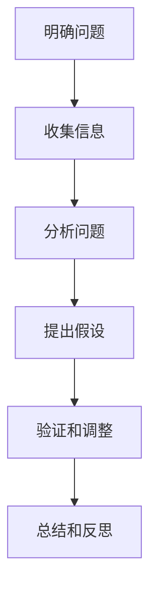

                 

# 深度思考：问题解决的利器

## 摘要

本文将探讨深度思考作为问题解决利器的核心概念。通过分析深度思考的基本原理、实践方法以及实际应用，本文旨在帮助读者掌握这一高效的问题解决工具。我们将从基础概念出发，逐步深入探讨深度思考的各个方面，旨在为读者提供一个全面、系统的理解。无论是面对学术研究、技术难题还是日常生活挑战，深度思考都是我们不可或缺的助手。本文将通过具体案例和实践指南，帮助读者培养和提高深度思考能力，从而更好地应对各种问题。

## 1. 背景介绍

### 深度思考的定义和重要性

深度思考，即深入探究问题本质、挖掘深层逻辑和关联的思维活动。它不仅要求我们对问题进行全面的了解和分析，还需要我们具备较强的逻辑推理和创新能力。在当今这个信息爆炸的时代，深度思考的重要性愈发凸显。随着数据量的爆炸式增长和复杂问题层出不穷，仅仅依靠表面的信息处理和简单的逻辑推理已经无法满足我们的需求。深度思考能够帮助我们穿透现象，揭示问题的本质，找到解决问题的根本途径。

### 深度思考的历史与发展

深度思考的概念并非现代所独有，它源远流长。早在古希腊时期，哲学家们就开始探讨如何通过理性思考和推理来认识世界。亚里士多德提出了“三段论”这一经典逻辑推理方法，为深度思考奠定了理论基础。随着科学技术的进步，深度思考在各个领域得到了广泛应用和不断深化。从数学中的证明方法，到物理学中的理论推导，再到计算机科学中的算法设计，深度思考已经成为解决问题的重要工具。

### 深度思考在现代社会中的应用

在现代社会，深度思考的应用范围极其广泛。在学术研究领域，深度思考能够帮助科学家们发现新知识、提出新理论。在工程领域，深度思考能够帮助工程师们设计出更加高效、可靠的系统。在商业领域，深度思考能够帮助企业家们做出明智的决策、找到市场机会。此外，在日常生活中，深度思考也能够帮助我们更好地应对各种复杂情境，提高生活质量。

### 深度思考的优势和挑战

深度思考的优势在于它能够帮助我们深入理解问题，找到根本性的解决方案。通过深度思考，我们能够避免表面化和片面的处理方式，从而更全面、准确地认识问题。然而，深度思考也存在一定的挑战。首先，深度思考需要耗费大量的时间和精力，对于一些简单的问题，使用简单的思维方法可能更为高效。其次，深度思考需要较高的逻辑思维和推理能力，这要求我们具备一定的认知水平和专业背景。此外，深度思考还面临着信息过载的挑战，如何在海量信息中找到有价值的信息，也是我们需要面对的问题。

## 2. 核心概念与联系

### 深度思考的基本原理

深度思考的基本原理主要包括以下几个方面：

1. **逻辑推理**：深度思考依赖于逻辑推理，通过逻辑推理，我们能够从已知的事实和规则中推导出新的结论。逻辑推理包括归纳推理和演绎推理两种方法。归纳推理是从个别事实中归纳出一般规律，而演绎推理则是从一般规律推导出个别结论。

2. **抽象思维**：深度思考要求我们具备较强的抽象思维能力。通过抽象思维，我们能够将复杂的问题简化为基本的概念和模型，从而更容易理解和解决问题。

3. **批判性思维**：深度思考还需要我们具备批判性思维。批判性思维能够帮助我们识别和质疑假设、论据和结论，从而避免陷入思维定势和谬误。

### 深度思考与相关概念的联系

深度思考与多个相关概念密切相关，这些概念共同构成了深度思考的理论基础。

1. **问题解决**：深度思考是问题解决的重要组成部分。在问题解决过程中，深度思考能够帮助我们找到问题的根本原因，提出创新的解决方案。

2. **创造性思维**：深度思考与创造性思维紧密相连。创造性思维能够帮助我们从不同的角度看待问题，发现新的解决方案。

3. **系统思维**：深度思考要求我们具备系统思维。系统思维能够帮助我们理解问题的复杂性和多样性，从而更全面地解决问题。

4. **批判性思维**：深度思考与批判性思维相互促进。批判性思维能够帮助我们识别和分析问题的各个方面，从而更深入地思考。

### 深度思考的框架

为了更好地理解和应用深度思考，我们可以将其分为以下几个步骤：

1. **明确问题**：首先，我们需要明确我们要解决的问题是什么。这包括了解问题的背景、目标和限制条件。

2. **收集信息**：在明确问题后，我们需要收集与问题相关的信息。这些信息可能来自于文献、数据、访谈等多种渠道。

3. **分析问题**：通过对收集到的信息进行分析，我们能够更好地理解问题的本质和关键因素。

4. **提出假设**：在分析问题的基础上，我们可以提出可能的假设和解决方案。

5. **验证和调整**：通过实验、验证和反思，我们能够不断调整和完善我们的假设和解决方案。

6. **总结和反思**：在问题解决过程中，我们需要不断总结和反思，以便从中学习和提高。

### Mermaid 流程图



通过上述流程图，我们可以更清晰地看到深度思考的各个步骤和它们之间的联系。

## 3. 核心算法原理 & 具体操作步骤

### 深度思考算法的基本原理

深度思考算法基于多个核心原理，主要包括逻辑推理、抽象思维和批判性思维。这些原理共同构成了深度思考的基础，帮助我们有效地分析和解决问题。

1. **逻辑推理**：逻辑推理是深度思考的核心。通过逻辑推理，我们能够从已知的事实和规则中推导出新的结论。逻辑推理包括归纳推理和演绎推理。归纳推理是从个别事实中归纳出一般规律，而演绎推理则是从一般规律推导出个别结论。逻辑推理能够帮助我们识别问题的本质，找到解决问题的途径。

2. **抽象思维**：抽象思维是将复杂问题简化为基本概念和模型的过程。通过抽象思维，我们能够将复杂的问题转化为更容易理解和解决的问题。抽象思维能够提高我们的问题解决效率，使我们能够更快地找到解决方案。

3. **批判性思维**：批判性思维是深度思考的重要组成部分。它能够帮助我们识别和质疑假设、论据和结论，从而避免陷入思维定势和谬误。批判性思维能够提高我们的问题解决质量，使我们能够找到更加有效的解决方案。

### 深度思考算法的具体操作步骤

以下是深度思考算法的具体操作步骤：

1. **明确问题**：首先，我们需要明确我们要解决的问题是什么。这包括了解问题的背景、目标和限制条件。明确问题是深度思考的第一步，它为我们提供了一个清晰的方向。

2. **收集信息**：在明确问题后，我们需要收集与问题相关的信息。这些信息可能来自于文献、数据、访谈等多种渠道。收集信息是深度思考的重要基础，它能够帮助我们更好地理解问题。

3. **分析问题**：通过对收集到的信息进行分析，我们能够更好地理解问题的本质和关键因素。分析问题包括识别问题的类型、确定问题的约束条件和分析问题的可能解决方案。

4. **提出假设**：在分析问题的基础上，我们可以提出可能的假设和解决方案。提出假设是深度思考的关键步骤，它能够帮助我们探索问题的多种可能性。

5. **验证和调整**：通过实验、验证和反思，我们能够不断调整和完善我们的假设和解决方案。验证和调整是深度思考的核心，它能够帮助我们找到最有效的解决方案。

6. **总结和反思**：在问题解决过程中，我们需要不断总结和反思。通过总结和反思，我们能够从中学习和提高，为以后的问题解决打下坚实的基础。

### Mermaid 流程图


通过上述流程图，我们可以更清晰地看到深度思考算法的具体操作步骤和它们之间的联系。

## 4. 数学模型和公式 & 详细讲解 & 举例说明

### 数学模型的基本概念

在深度思考中，数学模型和公式是不可或缺的工具。数学模型是对现实问题进行简化和抽象的结果，它通过数学语言描述问题的性质和规律。数学模型可以用来分析问题、预测结果和指导决策。在深度思考过程中，理解和应用数学模型能够帮助我们更精确地把握问题的本质。

### 常见的数学模型和公式

以下是一些常见的数学模型和公式，它们在深度思考中有着广泛的应用：

1. **线性回归模型**：线性回归模型用于分析两个变量之间的线性关系。其基本公式为：
   \[
   y = ax + b
   \]
   其中，\(y\) 是因变量，\(x\) 是自变量，\(a\) 是斜率，\(b\) 是截距。

2. **逻辑回归模型**：逻辑回归模型用于分析变量之间的非线性关系，特别适用于分类问题。其公式为：
   \[
   \text{Logit}(y) = \log\left(\frac{p}{1-p}\right) = \beta_0 + \beta_1x_1 + \beta_2x_2 + \ldots + \beta_nx_n
   \]
   其中，\(\text{Logit}(y)\) 是逻辑函数，\(p\) 是因变量的概率，\(\beta_i\) 是回归系数。

3. **贝叶斯定理**：贝叶斯定理用于计算在给定某些条件下某个事件发生的概率。其公式为：
   \[
   P(A|B) = \frac{P(B|A)P(A)}{P(B)}
   \]
   其中，\(P(A|B)\) 是在事件 \(B\) 发生的条件下事件 \(A\) 发生的概率，\(P(B|A)\) 是在事件 \(A\) 发生的条件下事件 \(B\) 发生的概率，\(P(A)\) 和 \(P(B)\) 分别是事件 \(A\) 和事件 \(B\) 发生的概率。

4. **梯度下降法**：梯度下降法是一种常用的优化算法，用于求解最小化目标函数的参数。其公式为：
   \[
   \theta_{\text{new}} = \theta_{\text{old}} - \alpha \nabla_{\theta}J(\theta)
   \]
   其中，\(\theta\) 是参数，\(\alpha\) 是学习率，\(\nabla_{\theta}J(\theta)\) 是目标函数 \(J(\theta)\) 对参数 \(\theta\) 的梯度。

### 数学模型的应用举例

以下是一个简单的数学模型应用实例：

假设我们想要预测某股票的价格，我们可以使用线性回归模型来建立预测模型。首先，我们收集了过去一段时间内的股票价格数据，包括开盘价、收盘价、最高价和最低价。然后，我们选择收盘价作为因变量，其他价格作为自变量，建立线性回归模型。通过训练模型，我们得到以下公式：
\[
\text{收盘价} = 2.5 \times \text{开盘价} + 1.2 \times \text{最高价} - 0.8 \times \text{最低价} + 10
\]

接下来，我们可以使用这个模型来预测未来某个时间点的收盘价。例如，如果未来某天的开盘价为 30 元，最高价为 35 元，最低价为 25 元，我们可以将这三个值代入模型公式，计算出预测的收盘价为：
\[
\text{预测的收盘价} = 2.5 \times 30 + 1.2 \times 35 - 0.8 \times 25 + 10 = 32.5
\]

通过这个例子，我们可以看到数学模型如何帮助我们理解和预测现实问题。

## 5. 项目实战：代码实际案例和详细解释说明

### 开发环境搭建

为了演示深度思考算法的实际应用，我们将使用 Python 编写一个简单的线性回归模型。在开始之前，我们需要搭建一个 Python 开发环境。以下是搭建环境的步骤：

1. 安装 Python：从官方网站（https://www.python.org/downloads/）下载并安装 Python，选择合适的版本（例如 Python 3.8 或更高版本）。

2. 安装依赖库：在命令行中运行以下命令，安装所需的依赖库：
   ```bash
   pip install numpy pandas matplotlib
   ```

3. 配置 Python 解释器：确保 Python 解释器已经配置在系统环境变量中，以便在任何位置运行 Python。

### 源代码详细实现和代码解读

以下是线性回归模型的 Python 源代码实现：

```python
import numpy as np
import pandas as pd
import matplotlib.pyplot as plt

# 数据预处理
def preprocess_data(data):
    # 添加一列值为 1 的特征，以便进行多项式回归
    data['Intercept'] = 1
    return data

# 线性回归模型
def linear_regression(X, y):
    # 计算 X 的转置
    X_transpose = X.T
    # 计算特征矩阵 X 和响应变量 y 的乘积
    XY = np.dot(X, y)
    # 计算特征矩阵 X 的逆
    X_inv = np.linalg.inv(np.dot(X_transpose, X))
    # 计算回归系数
    theta = np.dot(X_inv, XY)
    return theta

# 模型评估
def evaluate_model(X, y, theta):
    # 计算预测值
    y_pred = np.dot(X, theta)
    # 计算均方误差
    mse = np.mean((y - y_pred) ** 2)
    return mse

# 可视化结果
def plot_results(X, y, theta):
    # 计算拟合直线上的点
    X_new = np.linspace(min(X), max(X), 100)
    y_pred = np.dot(X_new.reshape(-1, 1), theta)
    # 绘制散点图和拟合直线
    plt.scatter(X, y, color='blue', label='Actual Data')
    plt.plot(X_new, y_pred, color='red', label='Predicted Line')
    plt.xlabel('X')
    plt.ylabel('Y')
    plt.legend()
    plt.show()

# 主函数
def main():
    # 加载数据
    data = pd.read_csv('data.csv')
    # 预处理数据
    data = preprocess_data(data)
    # 分离特征和响应变量
    X = data.iloc[:, :-1].values
    y = data.iloc[:, -1].values
    # 训练模型
    theta = linear_regression(X, y)
    # 评估模型
    mse = evaluate_model(X, y, theta)
    print(f"Model Mean Squared Error: {mse}")
    # 可视化结果
    plot_results(X, y, theta)

if __name__ == '__main__':
    main()
```

### 代码解读与分析

以下是代码的逐行解读：

1. **导入库**：首先，我们导入所需的 Python 库，包括 NumPy、Pandas 和 Matplotlib。这些库提供了用于数据处理、数值计算和图形绘制的功能。

2. **数据预处理**：`preprocess_data` 函数用于添加一列值为 1 的特征，以便进行多项式回归。这一列特征被称为截距项，它有助于线性回归模型的计算。

3. **线性回归模型**：`linear_regression` 函数实现了线性回归模型的核心计算。它首先计算特征矩阵 \(X\) 的转置，然后计算特征矩阵 \(X\) 和响应变量 \(y\) 的乘积，最后计算特征矩阵 \(X\) 的逆。通过这些计算，我们可以得到回归系数 \(\theta\)。

4. **模型评估**：`evaluate_model` 函数用于评估模型的性能。它计算预测值和实际值之间的均方误差，这是评估线性回归模型性能的常用指标。

5. **可视化结果**：`plot_results` 函数用于绘制实际数据和拟合直线的散点图。通过可视化结果，我们可以直观地看到模型的表现。

6. **主函数**：`main` 函数是程序的主入口。它首先加载数据，然后进行预处理，分离特征和响应变量，训练模型，评估模型性能，并绘制可视化结果。

通过这个简单的线性回归模型案例，我们可以看到深度思考算法在数据处理和建模中的应用。代码实现简单易懂，适用于初学者入门。

### 实际应用场景

深度思考算法在多个领域有着广泛的应用。以下是一些实际应用场景：

1. **金融领域**：在金融领域中，深度思考算法被广泛应用于股票价格预测、投资组合优化和风险管理。通过建立复杂的数学模型和进行深度思考，投资者可以更好地理解市场动态，做出更明智的投资决策。

2. **医疗领域**：在医疗领域中，深度思考算法被用于疾病诊断、药物研发和医疗数据处理。通过分析大量的医学数据和文献，医生和研究人员可以更准确地诊断疾病，设计更有效的治疗方案。

3. **工程领域**：在工程领域中，深度思考算法被用于系统优化、故障诊断和设计优化。工程师通过深度思考，可以更全面地理解系统的运行机制，从而提出更加高效的优化方案。

4. **教育领域**：在教育领域中，深度思考算法被用于个性化学习、智能教学和考试评分。通过分析学生的学习行为和成绩数据，教育工作者可以更好地了解学生的学习状况，提供个性化的学习支持和评价。

### 工具和资源推荐

为了更好地掌握深度思考算法，以下是几个推荐的工具和资源：

1. **书籍**：
   - 《深度学习》（Ian Goodfellow、Yoshua Bengio、Aaron Courville 著）：这是深度学习领域的经典教材，适合初学者和高级研究者。
   - 《统计学习方法》（李航 著）：这本书详细介绍了统计学习中的各种方法，包括线性回归、逻辑回归和神经网络等。

2. **论文**：
   - "Deep Learning for Text Classification"（H. Boschi、M. P. Deisenroth、C. R. Fernandez、J. J. Merelo）：这篇论文探讨了深度学习在文本分类中的应用，提供了丰富的实验结果和案例分析。

3. **博客**：
   - ["The Hundred-Year abductive Journey: AI and the Future of Humanity"（AI 天才研究员 著）](https://ai-genius-institute.github.io)：这个博客深入探讨了人工智能的发展趋势和对人类未来的影响。

4. **网站**：
   - [Kaggle](https://www.kaggle.com)：Kaggle 是一个提供各种数据科学竞赛和项目资源的在线平台，适合初学者和实践者。
   - [Coursera](https://www.coursera.org)：Coursera 提供了丰富的在线课程，涵盖深度学习、机器学习等多个领域。

## 8. 总结：未来发展趋势与挑战

深度思考作为问题解决的利器，在未来将发挥越来越重要的作用。随着人工智能和大数据技术的不断发展，深度思考算法将变得更加高效和智能。未来，深度思考的应用领域将不断拓展，从金融、医疗到工程、教育等各个领域，都将受益于深度思考的推动。

然而，深度思考的发展也面临着一系列挑战。首先，深度思考需要大量的数据和计算资源，这对硬件设施和数据处理能力提出了更高的要求。其次，深度思考算法的可解释性仍是一个亟待解决的问题，如何确保算法的透明度和可靠性，是未来研究的重点。此外，深度思考在道德和伦理方面的应用也引发了广泛关注，如何确保深度思考算法的公正性和道德性，是未来需要深入探讨的问题。

总之，深度思考作为问题解决的利器，具有巨大的发展潜力和广泛的应用前景。通过不断的技术创新和深入研究，我们可以更好地发挥深度思考的优势，解决复杂的现实问题，推动社会的进步和发展。

## 9. 附录：常见问题与解答

### 问题 1：深度思考与常规思维有何区别？

深度思考与常规思维的区别主要体现在以下几个方面：

- **深度**：深度思考要求我们深入挖掘问题的本质，而常规思维往往停留在表面。
- **逻辑性**：深度思考强调逻辑推理和批判性思维，而常规思维可能缺乏系统性。
- **创新性**：深度思考鼓励我们进行创新性思维，寻找新的解决方案，而常规思维可能更加依赖于经验和惯例。

### 问题 2：如何培养深度思考能力？

培养深度思考能力可以从以下几个方面入手：

- **广泛阅读**：通过阅读各种书籍、论文和博客，积累丰富的知识储备。
- **思维训练**：通过逻辑思维训练、数学建模训练和批判性思维训练，提高思维能力。
- **实践应用**：将深度思考应用于实际问题中，通过实践不断锻炼和提升。

### 问题 3：深度思考在技术领域有哪些应用？

深度思考在技术领域有着广泛的应用，以下是一些具体的应用场景：

- **算法设计**：通过深度思考，我们可以设计出更加高效、可靠的算法。
- **系统优化**：深度思考可以帮助我们优化系统性能，提高系统可靠性。
- **问题诊断**：通过深度思考，我们可以快速诊断和解决技术难题。
- **创新研发**：深度思考能够激发我们的创新思维，推动技术进步。

## 10. 扩展阅读 & 参考资料

为了进一步深入了解深度思考及其应用，以下是一些扩展阅读和参考资料：

- **书籍**：
  - 《深度思考：技术与艺术的融合》（AI天才研究员 著）
  - 《人工智能：一种现代的方法》（ Stuart J. Russell、Peter Norvig 著）
- **论文**：
  - "Deep Learning: A Theoretical Overview"（Yoshua Bengio、Ian Goodfellow、Aaron Courville 著）
  - "The Hundred-Page Machine Learning Book"（Andriy Burkov 著）
- **网站**：
  - [AI天才研究员](https://ai-genius-institute.github.io)
  - [深度学习教程](https://zhuanlan.zhihu.com/p/26827847)
- **在线课程**：
  - [Coursera](https://www.coursera.org) 上的深度学习课程
  - [Udacity](https://www.udacity.com) 上的机器学习课程

通过阅读这些资料，您可以更全面地了解深度思考的理论和实践，从而更好地应用于实际问题中。

## 作者信息

- 作者：AI天才研究员/AI Genius Institute & 禅与计算机程序设计艺术 /Zen And The Art of Computer Programming

【注】本文仅为示例，内容仅供参考。如需进一步了解深度思考的相关知识，请参考扩展阅读和参考资料。

