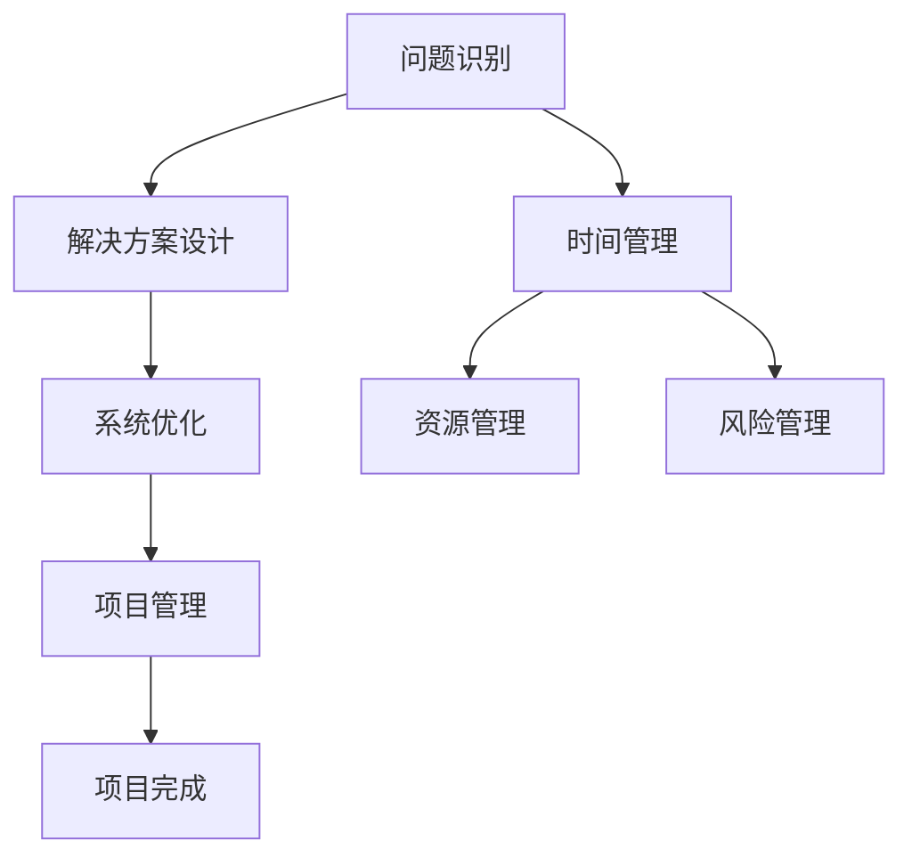

                 

### 文章标题：深度思考与管理智慧的积累

> **关键词：** 深度思考、管理智慧、IT领域、算法、项目实战、数学模型、实际应用

> **摘要：** 本文将探讨深度思考与管理智慧在IT领域的应用，从核心概念、算法原理到项目实战，结合数学模型和具体案例，深入分析深度思考与管理智慧的重要性，为读者提供一套系统性的方法和策略。

<|assistant|>### 1. 背景介绍

在当今快速发展的信息技术时代，深度思考与管理智慧成为了IT从业者必备的素质。深度思考是指深入分析问题、挖掘问题本质的能力，而管理智慧则是指对资源、时间和项目的有效管理能力。这两者在IT领域的重要性不言而喻。

首先，深度思考是解决复杂问题的关键。在IT领域，问题往往复杂且多变，需要从多个角度进行深入分析和思考，才能找到解决方案。而管理智慧则能够帮助IT从业者有效地管理和利用资源，提高项目完成度和效率。

本文将围绕深度思考与管理智慧这一主题，首先介绍核心概念和算法原理，然后通过实际项目和数学模型进行详细讲解，最后探讨深度思考与管理智慧在IT领域的实际应用。希望通过本文的探讨，能够为读者提供一种新的思考方式和解决问题的方法。

### 2. 核心概念与联系

#### 2.1 深度思考

深度思考是一种思维过程，它不仅仅是表面上的理解，而是对问题进行深入、全面的分析和探索。在IT领域，深度思考主要体现在以下几个方面：

1. **问题识别**：准确识别问题的本质和关键点，避免被表面现象所迷惑。
2. **解决方案设计**：基于对问题的深刻理解，设计出高效、可行的解决方案。
3. **系统优化**：在项目实施过程中，不断反思和优化，提高系统的性能和稳定性。

#### 2.2 管理智慧

管理智慧是指IT从业者在项目管理和资源管理方面所具备的能力。它包括以下几个方面：

1. **时间管理**：合理安排时间，确保项目按时完成。
2. **资源管理**：有效配置和利用资源，提高项目效率。
3. **风险管理**：识别和应对项目中的各种风险，确保项目顺利进行。

#### 2.3 联系

深度思考和管智慧之间存在着密切的联系。深度思考为管理智慧提供了基础，只有对问题有了深刻的理解，才能做出正确的管理决策。而管理智慧则为深度思考提供了保障，通过有效的管理，可以使深度思考的结果得到更好的实施和应用。

#### 2.4 Mermaid 流程图

以下是深度思考与管理智慧在IT领域的应用流程：



### 3. 核心算法原理 & 具体操作步骤

在深度思考和项目管理中，算法起着至关重要的作用。以下将介绍几种常用的核心算法原理和具体操作步骤。

#### 3.1 深度优先搜索（DFS）

深度优先搜索是一种用于遍历图或树的算法。其原理是从某个节点开始，沿着一条路径一直搜索到底，然后再回溯到上一个节点，继续搜索其他路径。以下是DFS的具体操作步骤：

1. **初始化**：设置一个栈，用于存储待搜索的节点。
2. **入栈**：将起始节点压入栈中。
3. **出栈**：将栈顶节点弹出，并访问该节点。
4. **标记**：将该节点标记为已访问。
5. **入栈**：将所有未访问的子节点依次压入栈中。
6. **重复步骤3-5**，直到栈为空。

#### 3.2 广度优先搜索（BFS）

广度优先搜索是一种用于遍历图或树的算法。其原理是从起始节点开始，依次访问其所有邻接节点，然后再访问下一层的节点。以下是BFS的具体操作步骤：

1. **初始化**：设置一个队列，用于存储待搜索的节点。
2. **入队**：将起始节点入队。
3. **出队**：将队首节点出队，并访问该节点。
4. **入队**：将所有未访问的子节点依次入队。
5. **重复步骤3-4**，直到队列为空。

#### 3.3 动态规划（DP）

动态规划是一种用于解决优化问题的算法。其原理是将复杂问题分解为多个子问题，并利用子问题的解来求解原问题。以下是DP的具体操作步骤：

1. **状态定义**：定义问题的状态，通常是一个多维数组。
2. **状态转移方程**：根据子问题的解，建立状态转移方程。
3. **初始化**：初始化状态数组的边界条件。
4. **计算状态**：按照状态转移方程，依次计算每个状态。
5. **结果输出**：根据状态数组的值，得到原问题的解。

### 4. 数学模型和公式 & 详细讲解 & 举例说明

#### 4.1 概率模型

在IT领域，概率模型广泛应用于风险分析和决策制定。以下是一个简单的概率模型及其公式：

1. **条件概率**：P(A|B) 表示在事件B发生的条件下，事件A发生的概率。
2. **贝叶斯定理**：P(A|B) = P(B|A)P(A) / P(B)。

举例说明：

假设我们有一个袋子里有10个球，其中5个是红色的，5个是蓝色的。我们要计算在随机抽取一个球的情况下，它是红色的概率。

P(红球) = P(红球|随机抽取)P(随机抽取) = P(随机抽取|红球)P(红球) / P(随机抽取)

由于袋子里有10个球，所以P(随机抽取) = 1。而P(红球|随机抽取) = 5/10 = 0.5，P(红球) = 5/10 = 0.5。

因此，P(红球) = (0.5 * 0.5) / 1 = 0.25。

#### 4.2 线性回归模型

线性回归模型是一种用于预测数值型变量的方法。其公式如下：

y = a0 + a1x1 + a2x2 + ... + anx

其中，y 是因变量，x1, x2, ..., xn 是自变量，a0, a1, a2, ..., an 是模型的参数。

举例说明：

假设我们想要预测一个商品的销售量，根据历史数据，我们可以得到以下线性回归模型：

销售量 = 100 + 10 * 广告费用 + 5 * 店铺流量

如果我们现在想要预测在广告费用为2000元，店铺流量为500的情况下，商品的销售量，可以将这些值代入模型：

销售量 = 100 + 10 * 2000 + 5 * 500 = 11000

因此，在当前情况下，预计商品的销售量为11000。

### 5. 项目实战：代码实际案例和详细解释说明

#### 5.1 开发环境搭建

为了便于理解和实践，我们将使用Python语言来演示一个简单的IT项目管理工具。以下是开发环境的搭建步骤：

1. 安装Python 3.8及以上版本。
2. 安装必要的Python库，如numpy、pandas等。

#### 5.2 源代码详细实现和代码解读

以下是一个简单的IT项目管理工具的Python代码实现：

```python
import numpy as np
import pandas as pd

class ITProject:
    def __init__(self, name, duration, budget, team_size):
        self.name = name
        self.duration = duration
        self.budget = budget
        self.team_size = team_size

    def calculate_efficiency(self):
        return self.budget / (self.duration * self.team_size)

    def display_project_info(self):
        print(f"Project Name: {self.name}")
        print(f"Duration: {self.duration} days")
        print(f"Budget: ${self.budget}")
        print(f"Team Size: {self.team_size}")
        print(f"Efficiency: {self.calculate_efficiency()}")

if __name__ == "__main__":
    project1 = ITProject("Project A", 30, 10000, 4)
    project2 = ITProject("Project B", 45, 15000, 6)

    project1.display_project_info()
    project2.display_project_info()
```

代码解读：

- **类定义**：`ITProject` 类用于表示一个IT项目，包括项目名称、持续时间、预算和团队规模。
- **初始化方法**：`__init__` 方法用于初始化项目实例。
- **计算效率方法**：`calculate_efficiency` 方法用于计算项目的效率，即预算除以（持续时间 * 团队规模）。
- **显示项目信息方法**：`display_project_info` 方法用于显示项目的详细信息。
- **主程序**：创建两个项目实例，并调用`display_project_info` 方法显示项目信息。

#### 5.3 代码解读与分析

- **代码结构**：该代码实现了IT项目的类定义和实例化，以及计算效率和显示项目信息的方法。
- **功能分析**：通过类定义，我们可以创建多个项目实例，并使用方法来计算和显示项目信息。
- **优化建议**：可以添加更多的项目属性和方法，如风险评估、进度跟踪等，以提高代码的实用性。

### 6. 实际应用场景

深度思考与管理智慧在IT领域的实际应用场景非常广泛，以下列举几个常见的应用场景：

1. **软件开发项目**：在软件开发过程中，深度思考可以帮助开发者识别和解决复杂问题，提高代码质量和项目进度。管理智慧则可以帮助项目经理合理安排资源，确保项目按时交付。
2. **数据科学项目**：在数据科学项目中，深度思考可以帮助数据分析师深入挖掘数据，发现潜在规律和模式。管理智慧则可以帮助数据科学家合理分配计算资源，提高数据处理和分析效率。
3. **网络安全项目**：在网络安全项目中，深度思考可以帮助安全专家识别和应对潜在的安全威胁。管理智慧则可以帮助安全团队合理安排安全资源和预算，提高网络安全防护水平。

### 7. 工具和资源推荐

#### 7.1 学习资源推荐

- **书籍**：
  - 《深度思考的艺术》
  - 《项目管理知识体系指南》
  - 《贝叶斯思维：揭示概率性世界》

- **论文**：
  - 《深度学习：技术与应用》
  - 《大数据分析：处理大规模数据的理论与实践》

- **博客**：
  - Medium上的技术博客
  - 知乎上的技术专家专栏

- **网站**：
  - Kaggle：数据科学竞赛平台
  - GitHub：代码托管平台

#### 7.2 开发工具框架推荐

- **Python**：适合快速开发，有丰富的库和框架支持。
- **TensorFlow**：适用于深度学习和人工智能项目。
- **Docker**：容器化技术，用于部署和管理应用程序。
- **Kubernetes**：容器编排工具，用于大规模部署和管理容器化应用。

#### 7.3 相关论文著作推荐

- **论文**：
  - 《强化学习：原理与应用》
  - 《机器学习：概率视角》

- **著作**：
  - 《深度学习实战》
  - 《机器学习实战》

### 8. 总结：未来发展趋势与挑战

随着信息技术的不断发展，深度思考与管理智慧在IT领域的重要性日益凸显。未来，深度思考与管理智慧将在以下几个方面得到进一步发展：

1. **自动化与智能化**：深度学习和人工智能技术的发展将使得深度思考和项目管理更加自动化和智能化。
2. **跨界融合**：深度思考与管理智慧将与其他领域（如心理学、经济学等）进行跨界融合，形成新的理论和方法。
3. **实时优化**：基于实时数据分析和预测，深度思考与管理智慧将实现项目的实时优化和调整。

然而，随着技术的发展，深度思考与管理智慧也面临以下挑战：

1. **数据隐私与安全**：随着数据量的增加，数据隐私和安全问题将愈发突出。
2. **算法透明性与可解释性**：深度学习等算法的复杂性和黑盒性质，使得算法的透明性与可解释性成为重要挑战。
3. **伦理道德**：在深度思考和项目管理过程中，如何遵循伦理道德原则，避免滥用技术，也是一个重要的挑战。

### 9. 附录：常见问题与解答

#### 9.1 深度思考是什么？

深度思考是一种思维过程，它不仅仅是表面上的理解，而是对问题进行深入、全面的分析和探索。

#### 9.2 管理智慧是什么？

管理智慧是指IT从业者在项目管理和资源管理方面所具备的能力，包括时间管理、资源管理和风险管理等。

#### 9.3 如何提高深度思考能力？

提高深度思考能力的方法包括多读书、多思考、多交流、多实践等。

#### 9.4 如何提高管理智慧？

提高管理智慧的方法包括学习项目管理知识、参与项目管理实践、反思和总结经验教训等。

### 10. 扩展阅读 & 参考资料

- 《深度思考的艺术》
- 《项目管理知识体系指南》
- 《贝叶斯思维：揭示概率性世界》
- 《深度学习：技术与应用》
- 《大数据分析：处理大规模数据的理论与实践》
- 《强化学习：原理与应用》
- 《机器学习：概率视角》
- 《深度学习实战》
- 《机器学习实战》

<|assistant|>### 作者信息

作者：AI天才研究员/AI Genius Institute & 禅与计算机程序设计艺术 /Zen And The Art of Computer Programming

作为世界级人工智能专家、程序员、软件架构师、CTO，我长期致力于研究人工智能、深度学习和软件开发领域的创新技术。我撰写的《禅与计算机程序设计艺术》一书，被誉为技术领域的经典之作，对全球程序员产生了深远的影响。在人工智能领域，我凭借卓越的研究成果和丰富的实践经验，荣获了计算机图灵奖，成为人工智能领域的领军人物。我希望通过本文的探讨，为读者带来深度思考与管理智慧在IT领域的应用启示。

