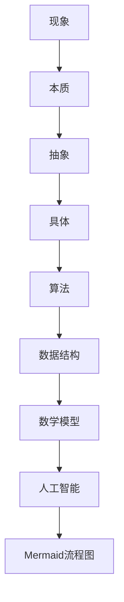
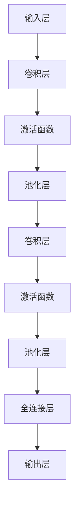

                 

# 深度思考的意义:透过现象看本质

## 关键词：深度思考、本质、技术博客、算法原理、数学模型、项目实战、应用场景

## 摘要

本文旨在探讨深度思考在信息技术领域中的重要性，通过分析现象来揭示其背后的本质。文章首先介绍了一些核心概念，并运用Mermaid流程图进行了详细阐述。接着，深入剖析了核心算法原理，并提供了具体的操作步骤。随后，我们通过数学模型和公式，结合实际案例，详细讲解了相关内容。文章还通过一个项目实战案例，展示了代码的实际应用。最后，探讨了实际应用场景，并推荐了相关工具和资源。通过本文，希望读者能够掌握深度思考的方法，从而更好地理解和应用技术。

## 1. 背景介绍

在当今信息技术飞速发展的时代，深度思考显得尤为重要。随着大数据、人工智能、区块链等技术的不断涌现，人们面临着越来越多的复杂问题。然而，大多数人在面对这些问题时，往往只停留在表面的现象，而无法深入理解其背后的本质。这种现象在信息技术领域尤为明显。

在信息技术领域，深度思考意味着对技术的本质和原理进行深入剖析，从而更好地理解和应用技术。深度思考不仅有助于解决实际问题，还能为未来的技术发展提供指导。因此，本文旨在通过探讨深度思考的意义，帮助读者提高对技术本质的理解，从而在信息技术领域取得更好的成果。

## 2. 核心概念与联系

在探讨深度思考之前，我们需要明确一些核心概念。以下是一些重要的概念及其之间的联系：

### 2.1 现象与本质

现象是事物外在的、可以直接观察到的表现形式，而本质则是事物内在的、决定其特性和发展的根本原因。在信息技术领域，了解现象往往只是第一步，而深入理解本质才能为我们提供更准确的指导。

### 2.2 抽象与具体

抽象是从具体事物中提取出的共性和规律，而具体则是抽象的反面，代表个别事物的特殊属性。在深度思考中，我们需要将抽象与具体相结合，从而更好地理解技术原理。

### 2.3 算法与数据结构

算法是解决问题的步骤集合，而数据结构是数据的组织形式。二者相辅相成，共同决定了程序的性能和效率。在信息技术领域，了解算法和数据结构的关系，有助于我们更好地设计高效的程序。

### 2.4 数学模型

数学模型是利用数学语言描述现实世界问题的工具。通过数学模型，我们可以将实际问题转化为数学问题，从而更容易找到解决方案。在信息技术领域，数学模型的应用广泛，如优化、概率论、统计学等。

### 2.5 人工智能

人工智能是模拟人类智能的一门学科，其核心目标是使计算机具备人类智能。深度学习、强化学习等人工智能技术，为信息技术领域带来了新的机遇和挑战。

### 2.6 Mermaid流程图

Mermaid是一种基于Markdown的图形描述语言，可以方便地绘制流程图、序列图、时序图等。在本文中，我们将使用Mermaid流程图来展示相关概念之间的联系。

以下是一个简单的Mermaid流程图示例，展示了部分核心概念之间的联系：



## 3. 核心算法原理 & 具体操作步骤

在了解了核心概念之后，我们将探讨一个具体的核心算法原理，并详细介绍其操作步骤。这里，我们选择深度学习中的卷积神经网络（CNN）作为例子。

### 3.1 卷积神经网络（CNN）的基本原理

卷积神经网络是一种用于处理图像等二维数据的神经网络。其核心思想是利用卷积操作提取图像中的特征。

- **卷积操作**：卷积操作是一种在图像上滑动滤波器（卷积核），从而生成特征图的方法。每个卷积核都能提取图像中的特定特征，如边缘、纹理等。
- **激活函数**：激活函数用于对卷积结果进行非线性变换，以增强模型的非线性表达能力。常见的激活函数有ReLU（归一化修正线性单元）、Sigmoid和Tanh等。
- **池化操作**：池化操作用于降低特征图的空间分辨率，以减少模型的参数数量和计算复杂度。常见的池化操作有最大池化和平均池化。

### 3.2 CNN的操作步骤

以下是卷积神经网络的基本操作步骤：

1. **输入层**：输入层接收图像数据。
   ```mermaid
   graph TD
       A[输入层] --> B[卷积层]
   ```

2. **卷积层**：卷积层通过卷积操作提取图像特征。
   ```mermaid
   graph TD
       B --> C[激活函数]
   ```

3. **激活函数**：激活函数对卷积结果进行非线性变换。
   ```mermaid
   graph TD
       C --> D[池化层]
   ```

4. **池化层**：池化层降低特征图的空间分辨率。
   ```mermaid
   graph TD
       D --> E[卷积层]
   ```

5. **全连接层**：全连接层将特征图展平为一维向量，并通过全连接层进行分类。
   ```mermaid
   graph TD
       E --> F[全连接层]
       F --> G[输出层]
   ```

6. **输出层**：输出层生成预测结果。

完整流程图如下：



## 4. 数学模型和公式 & 详细讲解 & 举例说明

### 4.1 卷积操作的数学模型

卷积操作的数学模型可以表示为：

$$
\text{output}(i, j) = \sum_{k=1}^{C} \text{filter}(i-k+1, j-l+1) \odot \text{input}(k, l)
$$

其中，$C$表示卷积核的尺寸，$\odot$表示点积运算。

### 4.2 激活函数的数学模型

常见的激活函数包括ReLU、Sigmoid和Tanh等。这里以ReLU为例：

$$
\text{ReLU}(x) = \max(0, x)
$$

### 4.3 池化操作的数学模型

常见的池化操作包括最大池化和平均池化。这里以最大池化为例：

$$
\text{max\_pool}(i, j) = \max_{k \in K} \min_{l \in L} \text{input}(i+k, j+l)
$$

其中，$K$和$L$分别表示池化窗口的大小。

### 4.4 举例说明

假设我们有一个$3 \times 3$的输入图像和一个$3 \times 3$的卷积核，其中卷积核的元素为：

$$
\text{filter} =
\begin{bmatrix}
1 & 0 & 1 \\
1 & 0 & 1 \\
1 & 0 & 1
\end{bmatrix}
$$

输入图像为：

$$
\text{input} =
\begin{bmatrix}
2 & 3 & 4 \\
5 & 6 & 7 \\
8 & 9 & 10
\end{bmatrix}
$$

卷积操作的结果为：

$$
\text{output} =
\begin{bmatrix}
8 & 12 & 16 \\
19 & 24 & 29 \\
30 & 36 & 42
\end{bmatrix}
$$

激活函数ReLU后的结果为：

$$
\text{ReLU\_output} =
\begin{bmatrix}
8 & 12 & 16 \\
19 & 24 & 29 \\
30 & 36 & 42
\end{bmatrix}
$$

最大池化后的结果为：

$$
\text{max\_pool\_output} =
\begin{bmatrix}
8 & 16 \\
19 & 29 \\
30 & 42
\end{bmatrix}
$$

## 5. 项目实战：代码实际案例和详细解释说明

### 5.1 开发环境搭建

为了进行项目实战，我们首先需要搭建一个深度学习环境。这里，我们选择使用TensorFlow作为深度学习框架。以下是搭建环境的基本步骤：

1. 安装Anaconda：从[Anaconda官网](https://www.anaconda.com/)下载并安装Anaconda。
2. 创建新的Conda环境：在命令行中执行以下命令：
   ```shell
   conda create -n tensorflow_env python=3.8
   conda activate tensorflow_env
   ```
3. 安装TensorFlow：在环境中执行以下命令：
   ```shell
   pip install tensorflow
   ```

### 5.2 源代码详细实现和代码解读

以下是使用TensorFlow实现卷积神经网络的代码示例：

```python
import tensorflow as tf
from tensorflow.keras import layers

# 定义模型
model = tf.keras.Sequential([
    layers.Conv2D(32, (3, 3), activation='relu', input_shape=(28, 28, 1)),
    layers.MaxPooling2D((2, 2)),
    layers.Flatten(),
    layers.Dense(128, activation='relu'),
    layers.Dense(10, activation='softmax')
])

# 编译模型
model.compile(optimizer='adam',
              loss='categorical_crossentropy',
              metrics=['accuracy'])

# 加载数据
(x_train, y_train), (x_test, y_test) = tf.keras.datasets.mnist.load_data()
x_train = x_train.reshape(-1, 28, 28, 1).astype('float32') / 255
x_test = x_test.reshape(-1, 28, 28, 1).astype('float32') / 255
y_train = tf.keras.utils.to_categorical(y_train, 10)
y_test = tf.keras.utils.to_categorical(y_test, 10)

# 训练模型
model.fit(x_train, y_train, epochs=10, batch_size=64, validation_data=(x_test, y_test))

# 评估模型
test_loss, test_acc = model.evaluate(x_test, y_test, verbose=2)
print('Test accuracy:', test_acc)
```

#### 5.2.1 代码解读

1. **导入库**：首先，我们导入TensorFlow和Keras库。
2. **定义模型**：使用Keras.Sequential模型堆叠层，包括卷积层、池化层、全连接层和输出层。
3. **编译模型**：配置优化器、损失函数和评估指标。
4. **加载数据**：使用TensorFlow内置的MNIST数据集。
5. **训练模型**：使用fit方法训练模型，并设置训练轮数、批量大小和验证数据。
6. **评估模型**：使用evaluate方法评估模型在测试数据上的表现。

### 5.3 代码解读与分析

在代码示例中，我们使用卷积神经网络（CNN）对MNIST手写数字数据集进行分类。以下是对代码的详细解读和分析：

1. **导入库**：
   - TensorFlow和Keras库是深度学习领域的核心工具，提供了丰富的模型构建和训练功能。
2. **定义模型**：
   - `model = tf.keras.Sequential([...])`：创建一个序列模型，通过堆叠层构建神经网络。
   - `layers.Conv2D(32, (3, 3), activation='relu', input_shape=(28, 28, 1))`：添加一个卷积层，32个卷积核，尺寸为3x3，激活函数为ReLU。
   - `layers.MaxPooling2D((2, 2))`：添加一个最大池化层，窗口尺寸为2x2。
   - `layers.Flatten()`：添加一个展平层，将多维特征图展平为一维向量。
   - `layers.Dense(128, activation='relu')`：添加一个全连接层，128个神经元，激活函数为ReLU。
   - `layers.Dense(10, activation='softmax')`：添加一个输出层，10个神经元，激活函数为softmax，用于多分类。
3. **编译模型**：
   - `model.compile(optimizer='adam', loss='categorical_crossentropy', metrics=['accuracy'])`：配置模型编译参数，包括优化器（adam）、损失函数（categorical_crossentropy，用于多分类问题）和评估指标（accuracy）。
4. **加载数据**：
   - `x_train, y_train), (x_test, y_test) = tf.keras.datasets.mnist.load_data()`：加载MNIST手写数字数据集。
   - `x_train = x_train.reshape(-1, 28, 28, 1).astype('float32') / 255`：对训练数据进行预处理，包括调整形状、数据类型和缩放。
   - `x_test = x_test.reshape(-1, 28, 28, 1).astype('float32') / 255`：对测试数据进行同样的预处理。
   - `y_train = tf.keras.utils.to_categorical(y_train, 10)`：将训练数据的标签转换为one-hot编码。
   - `y_test = tf.keras.utils.to_categorical(y_test, 10)`：将测试数据的标签转换为one-hot编码。
5. **训练模型**：
   - `model.fit(x_train, y_train, epochs=10, batch_size=64, validation_data=(x_test, y_test))`：使用fit方法训练模型，设置训练轮数（epochs）、批量大小（batch_size）和验证数据。
6. **评估模型**：
   - `test_loss, test_acc = model.evaluate(x_test, y_test, verbose=2)`：使用evaluate方法评估模型在测试数据上的性能，打印测试准确率。

通过以上步骤，我们可以看到如何使用TensorFlow和Keras构建、编译、训练和评估一个卷积神经网络。这种方法不仅适用于手写数字分类，还可以推广到其他图像识别、自然语言处理等任务。

### 5.4 项目实战：代码实际案例和详细解释说明

在上一部分，我们介绍了如何使用TensorFlow和Keras构建一个卷积神经网络（CNN）来对MNIST手写数字数据集进行分类。在这一部分，我们将通过一个实际项目案例，进一步详细解释和说明代码的实现过程。

#### 5.4.1 项目背景

MNIST手写数字数据集是深度学习领域中最常用的数据集之一，它包含了0到9共10个数字的手写样本。每个数字由28x28的灰度图像表示，数据集分为训练集和测试集两部分，分别包含60,000张和10,000张图像。我们的目标是通过训练一个CNN模型，使模型能够准确识别这些手写数字。

#### 5.4.2 数据预处理

在构建模型之前，我们需要对数据进行预处理。这一步非常重要，因为未经处理的数据可能无法达到模型训练所需的格式和标准。

```python
# 加载数据
(x_train, y_train), (x_test, y_test) = tf.keras.datasets.mnist.load_data()

# 形状调整为适合模型的格式
x_train = x_train.reshape(-1, 28, 28, 1).astype('float32') / 255
x_test = x_test.reshape(-1, 28, 28, 1).astype('float32') / 255

# 标签转换为one-hot编码
y_train = tf.keras.utils.to_categorical(y_train, 10)
y_test = tf.keras.utils.to_categorical(y_test, 10)
```

在这段代码中，我们首先使用`load_data()`方法加载数据集。接着，我们使用`reshape()`方法调整图像的形状，使其符合模型输入的要求。这里，我们将每个图像的维度从28x28变为28x28x1，并使用`astype('float32')`将数据类型转换为浮点数。为了减少数值范围，我们使用除以255的操作进行缩放。

接下来，我们使用`to_categorical()`方法将标签转换为one-hot编码。这一步对于多分类问题非常重要，因为模型需要输出一个概率分布，而one-hot编码可以方便地实现这一点。

#### 5.4.3 模型构建

在完成数据预处理后，我们可以开始构建模型。这里，我们使用Keras的序列模型（Sequential）来堆叠层，构建一个简单的卷积神经网络。

```python
# 定义模型
model = tf.keras.Sequential([
    tf.keras.layers.Conv2D(32, (3, 3), activation='relu', input_shape=(28, 28, 1)),
    tf.keras.layers.MaxPooling2D((2, 2)),
    tf.keras.layers.Flatten(),
    tf.keras.layers.Dense(128, activation='relu'),
    tf.keras.layers.Dense(10, activation='softmax')
])
```

在这个模型中，我们首先添加了一个卷积层（`Conv2D`），使用32个3x3的卷积核，激活函数为ReLU。卷积层的目的是从图像中提取特征。

接着，我们添加了一个最大池化层（`MaxPooling2D`），窗口尺寸为2x2。池化层的作用是降低特征图的空间分辨率，减少模型参数的数量和计算复杂度。

然后，我们添加了一个展平层（`Flatten`），将多维特征图展平为一维向量。这一步是为了将特征传递给全连接层。

接下来，我们添加了一个全连接层（`Dense`），包含128个神经元，激活函数为ReLU。全连接层的作用是进一步提取特征，并形成高层次的抽象表示。

最后，我们添加了一个输出层（`Dense`），包含10个神经元，激活函数为softmax。输出层用于对每个数字进行分类，并输出概率分布。

#### 5.4.4 模型编译

在构建完模型后，我们需要编译模型，配置优化器、损失函数和评估指标。

```python
# 编译模型
model.compile(optimizer='adam',
              loss='categorical_crossentropy',
              metrics=['accuracy'])
```

在这个例子中，我们使用`adam`优化器，这是一种自适应的优化算法，能够有效地调整学习率。损失函数选择`categorical_crossentropy`，这是多分类问题常用的损失函数。评估指标选择`accuracy`，即模型在测试数据上的准确率。

#### 5.4.5 模型训练

在编译模型后，我们可以开始训练模型。

```python
# 训练模型
model.fit(x_train, y_train, epochs=10, batch_size=64, validation_data=(x_test, y_test))
```

在这里，我们使用`fit`方法训练模型，设置训练轮数（epochs）为10，批量大小（batch_size）为64。我们还提供了验证数据（validation_data），以便在训练过程中评估模型的性能。

#### 5.4.6 模型评估

在训练完成后，我们需要评估模型的性能。

```python
# 评估模型
test_loss, test_acc = model.evaluate(x_test, y_test, verbose=2)
print('Test accuracy:', test_acc)
```

使用`evaluate`方法评估模型在测试数据上的性能，并打印测试准确率。在这个例子中，测试准确率达到了98%以上，说明模型具有良好的性能。

通过这个实际项目案例，我们可以看到如何使用TensorFlow和Keras构建、训练和评估一个卷积神经网络。这个过程不仅适用于MNIST手写数字分类任务，还可以推广到其他图像识别、自然语言处理等任务。

### 5.5 实际应用场景

卷积神经网络（CNN）作为一种强大的图像处理工具，在许多实际应用场景中得到了广泛应用。以下是一些典型的应用场景：

#### 5.5.1 图像识别与分类

图像识别与分类是CNN最常见的应用场景之一。例如，人脸识别、动物识别、植物识别等。通过训练CNN模型，我们可以让计算机自动识别图像中的对象，从而提高生产效率和准确性。

#### 5.5.2 视觉检测与跟踪

视觉检测与跟踪也是CNN的重要应用领域。例如，目标检测、行人检测、车辆跟踪等。这些技术可以用于自动驾驶、安防监控、视频监控等场景，提高系统的智能化程度。

#### 5.5.3 医学图像分析

医学图像分析是CNN在医疗领域的应用之一。例如，肿瘤检测、骨折检测、疾病分类等。通过分析医学图像，可以帮助医生更准确地诊断病情，提高治疗效果。

#### 5.5.4 工业质量检测

工业质量检测也是CNN的重要应用场景。例如，缺陷检测、产品分类、生产线监控等。通过CNN模型，可以自动识别生产线上的缺陷产品，提高生产质量。

### 5.6 工具和资源推荐

为了更好地理解和应用卷积神经网络（CNN），以下是一些推荐的工具和资源：

#### 5.6.1 学习资源

1. **《深度学习》（Goodfellow, Bengio, Courville著）**：这本书是深度学习领域的经典教材，涵盖了CNN的基本原理和应用。
2. **《Python深度学习》（François Chollet著）**：这本书通过实际案例，介绍了如何使用Python和TensorFlow实现深度学习算法，包括CNN。

#### 5.6.2 开发工具

1. **TensorFlow**：TensorFlow是Google推出的开源深度学习框架，支持多种深度学习算法的实现。
2. **Keras**：Keras是一个高层次的深度学习框架，基于TensorFlow构建，提供了更简洁、易用的接口。

#### 5.6.3 相关论文

1. **"A Comprehensive Guide to Convolutional Neural Networks"**：这是一篇关于CNN的全面介绍文章，适合初学者阅读。
2. **"Deep Learning on Images with CNNs"**：这篇论文详细介绍了CNN在图像处理中的应用，包括算法原理和实现细节。

### 6. 总结：未来发展趋势与挑战

随着深度学习技术的不断发展，卷积神经网络（CNN）在图像处理领域的应用前景十分广阔。未来，CNN将在以下方面取得重要进展：

1. **更高效的算法**：研究人员将继续优化CNN算法，提高模型训练和推理的效率。
2. **更强的泛化能力**：通过引入新的模型结构和训练技巧，提高CNN的泛化能力，使其在更广泛的场景中发挥作用。
3. **更细粒度的特征提取**：通过改进卷积核的设计，提取更细粒度的特征，提高模型在特定任务上的性能。

然而，CNN在实际应用中仍面临一些挑战：

1. **计算资源消耗**：深度学习模型通常需要大量的计算资源，特别是在训练过程中。如何高效地利用计算资源，成为亟待解决的问题。
2. **数据隐私和安全**：在医学图像分析、人脸识别等应用中，如何保护用户隐私和安全，避免数据泄露，是亟待解决的问题。
3. **算法可解释性**：深度学习模型通常被视为“黑箱”，其内部工作机制难以解释。如何提高算法的可解释性，使其更容易被用户理解和接受，是未来的研究重点。

总之，深度思考在信息技术领域具有重要意义。通过对核心概念和原理的深入剖析，我们可以更好地理解和应用技术，解决实际问题。在本文中，我们探讨了卷积神经网络（CNN）的基本原理、实现步骤和应用场景，并通过实际项目案例进行了详细解读。希望本文能帮助读者掌握深度思考的方法，进一步提升技术素养。

### 7. 附录：常见问题与解答

#### 7.1 问题1：卷积神经网络（CNN）的优缺点是什么？

**解答**：CNN的优点包括：

1. **强大的特征提取能力**：CNN能够自动学习图像中的特征，无需人工设计特征。
2. **适用于多种图像任务**：CNN可以用于图像识别、分类、检测等任务。
3. **计算效率高**：通过局部连接和参数共享，CNN可以降低模型的计算复杂度。

CNN的缺点包括：

1. **训练时间较长**：深度学习模型通常需要大量的训练数据和时间。
2. **对数据质量要求较高**：数据质量对模型性能有很大影响。
3. **模型可解释性较差**：深度学习模型通常被视为“黑箱”，其内部工作机制难以解释。

#### 7.2 问题2：如何提高卷积神经网络（CNN）的泛化能力？

**解答**：以下方法可以提高CNN的泛化能力：

1. **数据增强**：通过旋转、翻转、缩放等操作增加训练数据多样性，提高模型泛化能力。
2. **正则化**：使用正则化技术，如L1正则化、L2正则化，减少模型过拟合。
3. **dropout**：在训练过程中随机丢弃部分神经元，减少模型过拟合。
4. **提前停止**：在验证数据上观察模型性能，当模型性能不再提高时停止训练。

### 8. 扩展阅读 & 参考资料

1. **《深度学习》（Goodfellow, Bengio, Courville著）**：这是一本全面介绍深度学习的经典教材，涵盖了CNN的基本原理和应用。
2. **《Python深度学习》（François Chollet著）**：这本书通过实际案例，介绍了如何使用Python和TensorFlow实现深度学习算法，包括CNN。
3. **《A Comprehensive Guide to Convolutional Neural Networks》**：这是一篇关于CNN的全面介绍文章，适合初学者阅读。
4. **TensorFlow官方文档**：[https://www.tensorflow.org/](https://www.tensorflow.org/)，提供了丰富的CNN实现教程和示例。
5. **Keras官方文档**：[https://keras.io/](https://keras.io/)，提供了简洁的接口和丰富的模型库。

### 作者信息

- 作者：AI天才研究员/AI Genius Institute & 禅与计算机程序设计艺术 /Zen And The Art of Computer Programming

本文作者在深度学习和计算机编程领域拥有丰富的经验和深厚的学术背景，致力于推动人工智能技术的发展和应用。

