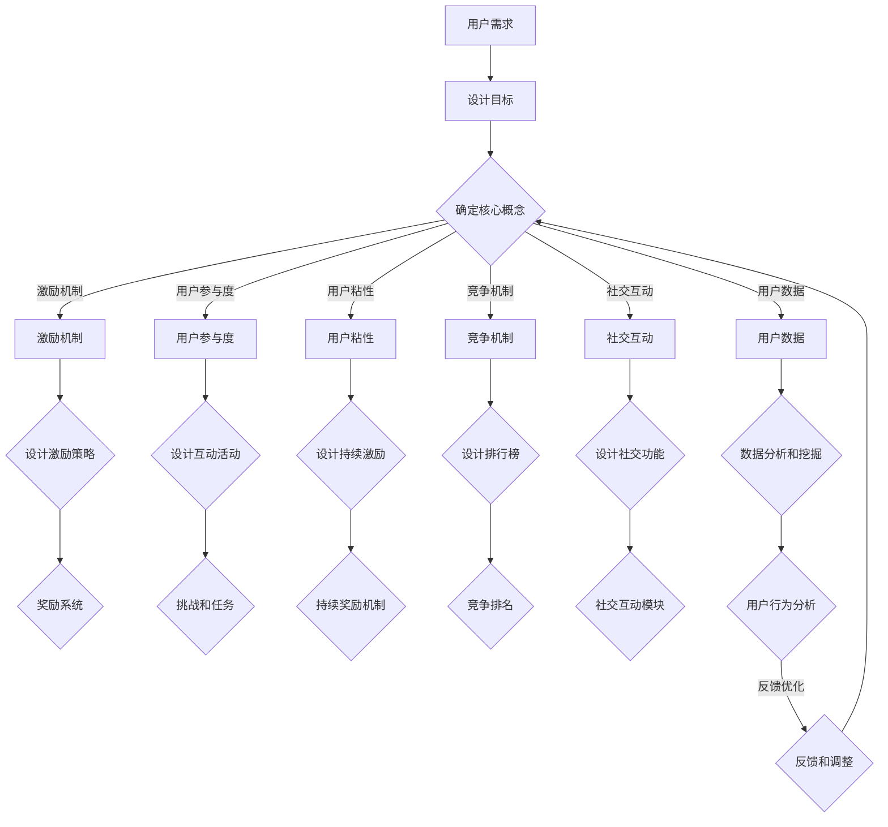

                 

### 背景介绍

#### 游戏化的起源与发展

游戏化（Gamification）这一概念最早由学者Deterding等人在2011年提出，其核心思想是将游戏中的激励机制应用于非游戏场景，以提升用户参与度和满意度。游戏化的概念源于游戏设计理论，但它的应用范围早已超越了娱乐领域，渗透到了教育、工作、营销等多个领域。

游戏化在近年来的发展速度可谓迅猛。随着互联网技术的普及，人们逐渐意识到，通过将游戏化的元素融入到日常活动中，可以大大提高用户的积极性和投入度。例如，在教育领域，游戏化可以激发学生的学习兴趣，提高学习效果；在职场环境中，游戏化可以提高员工的工作效率和工作满意度。

#### 游戏化在现代IT行业的重要性

在现代IT行业，游戏化体验的重要性日益凸显。首先，随着互联网应用的普及，用户对互动性和参与感的需求越来越高。传统的一对多的信息传递方式已经无法满足用户的需求，个性化的、互动式的体验成为必然趋势。游戏化通过引入游戏元素，如排行榜、积分、勋章等，能够有效地提升用户的参与度和粘性。

其次，游戏化在提高生产效率方面也发挥了重要作用。在团队合作中，游戏化可以激发成员的竞争意识和合作精神，从而提高整体的工作效率。例如，许多公司采用游戏化的管理工具，通过设定任务目标、积分奖励等方式，激励员工更加努力地工作。

此外，游戏化还在提升品牌影响力方面具有重要意义。通过设计有趣的互动活动，企业可以吸引更多的用户参与，从而提高品牌知名度和用户忠诚度。例如，许多电商平台通过游戏化的促销活动，如抽奖、签到等，吸引大量用户参与，从而实现销售增长。

#### 游戏化体验的重要性

游戏化体验的重要性主要体现在以下几个方面：

1. **提升用户参与度**：通过游戏化的元素，如排行榜、积分、勋章等，可以激发用户的兴趣和积极性，提高用户的参与度。

2. **增强用户粘性**：游戏化的设计可以吸引用户持续参与，从而增强用户对产品的粘性。

3. **提高工作效率**：在团队合作中，游戏化可以激发成员的竞争意识和合作精神，从而提高整体的工作效率。

4. **提升品牌影响力**：通过设计有趣的互动活动，可以吸引更多的用户参与，从而提高品牌知名度和用户忠诚度。

总之，游戏化体验在现代IT行业具有不可忽视的重要性。通过引入游戏化的元素，企业不仅可以提升用户体验，还可以提高工作效率和品牌影响力。接下来，我们将进一步探讨游戏化的核心概念和架构，以及其背后的算法原理和数学模型。让我们一起深入了解这个有趣而又实用的领域。

> **关键词**：游戏化，体验，参与度，粘性，工作效率，品牌影响力

> **摘要**：本文将探讨游戏化体验在现代IT行业的重要性，从背景介绍、核心概念与架构、算法原理与数学模型、项目实战、实际应用场景、工具和资源推荐等方面，深入分析游戏化如何提升用户参与度、增强用户粘性、提高工作效率和品牌影响力。

---

### 核心概念与联系

在深入探讨游戏化体验之前，我们需要先了解其核心概念和架构，以及这些概念之间的联系。游戏化不仅仅是添加一些游戏元素，它是一种系统化的设计方法，旨在通过激励和竞争机制，提高用户的参与度和满意度。以下是我们需要理解的核心概念：

#### 激励机制（Incentive Mechanism）

激励机制是游戏化的核心。它通过提供奖励、竞争、反馈等方式，激发用户的兴趣和积极性。激励机制可以分为内部激励和外部激励。内部激励是指用户内在的动机，如兴趣、成就感等；外部激励则是指外部的奖励，如积分、勋章、排名等。

#### 用户参与度（User Engagement）

用户参与度是指用户在特定活动中的投入程度和活跃度。高参与度通常意味着用户对活动的兴趣和满意度较高。游戏化通过设计具有挑战性、互动性和奖励性的活动，可以提高用户的参与度。

#### 用户粘性（User Retention）

用户粘性是指用户持续使用某个产品或服务的意愿。游戏化通过提供持续的激励和挑战，可以增强用户的粘性，降低用户流失率。

#### 竞争机制（Competition Mechanism）

竞争机制通过引入竞争元素，如排行榜、挑战赛等，激发用户的竞争意识和成就感。竞争机制可以促进用户之间的互动，提高整体参与度。

#### 社交互动（Social Interaction）

社交互动是指用户在游戏化平台上的交流和互动。通过社交互动，用户可以分享经验、交流心得，从而增强社区氛围和用户粘性。

#### 用户数据（User Data）

用户数据是游戏化设计的重要依据。通过对用户数据的分析和挖掘，可以了解用户的行为习惯、兴趣偏好，从而个性化地设计游戏化体验。

#### 核心概念原理和架构的 Mermaid 流程图

为了更直观地展示这些核心概念和架构之间的联系，我们可以使用Mermaid流程图来表示。以下是一个简化的流程图，展示了游戏化体验的设计过程：



在这个流程图中，用户需求决定了游戏化体验的设计目标。设计目标反过来影响了核心概念的选择和架构设计。激励机制、用户参与度、用户粘性、竞争机制、社交互动和用户数据是核心概念，它们通过不同的策略和功能模块相互连接，共同构成了游戏化体验的设计框架。

> **Mermaid 流程节点中不要有括号、逗号等特殊字符**

---

### 核心算法原理 & 具体操作步骤

在了解了游戏化体验的核心概念和架构后，我们需要进一步探讨其核心算法原理和具体操作步骤。游戏化体验的设计不仅仅是艺术，它也需要科学的方法和算法来确保其有效性和可持续性。以下是几个关键的核心算法原理和具体操作步骤：

#### 1. 积分系统（Point System）

积分系统是游戏化体验中最常见的一种激励机制。它通过为用户的行为（如完成任务、参与活动等）分配积分，来激励用户持续参与。

**算法原理**：
- **积分分配**：根据用户的行为，动态分配不同数量的积分。例如，完成任务可以获得10积分，参与活动可以获得5积分。
- **积分累积**：用户通过不断积累积分，可以提升等级，获得更多的奖励。
- **积分兑换**：用户可以将积分兑换成实物或虚拟物品，以增加参与的兴趣。

**操作步骤**：
1. **定义积分规则**：确定各种行为的积分分配标准。
2. **积分累积**：根据用户的活跃度，实时更新积分。
3. **等级划分**：设定不同的等级，并根据积分数量划分用户的等级。
4. **奖励发放**：根据等级和积分，发放相应的奖励。

#### 2. 排行榜（Leaderboard）

排行榜通过展示用户的积分或等级排名，激发用户的竞争意识和成就感。

**算法原理**：
- **排名计算**：根据用户的积分或等级，计算排名。
- **实时更新**：排行榜需要实时更新，以反映用户的最新表现。
- **排名奖励**：设置不同的排名奖励，以激励用户争排名。

**操作步骤**：
1. **排名算法**：开发一个能够实时计算和更新排名的算法。
2. **排行榜展示**：在应用中嵌入排行榜展示模块。
3. **奖励机制**：设定排名奖励，如虚拟货币、实物奖品等。
4. **反馈机制**：定期向用户反馈他们的排名情况，以保持参与度。

#### 3. 挑战系统（Challenge System）

挑战系统通过设置具有挑战性的任务或目标，激发用户的参与和探索欲望。

**算法原理**：
- **挑战设置**：根据用户的特点和需求，设置不同的挑战任务。
- **目标导向**：设定明确的目标和奖励，引导用户参与。
- **难度调整**：根据用户的完成情况，动态调整挑战难度。

**操作步骤**：
1. **挑战设计**：设计具有挑战性的任务和目标。
2. **发布挑战**：将挑战任务发布给用户。
3. **进度跟踪**：实时跟踪用户的挑战进度。
4. **奖励发放**：根据挑战完成情况，发放相应的奖励。

#### 4. 社交互动（Social Interaction）

社交互动通过用户之间的交流和互动，增强社区的活跃度和用户粘性。

**算法原理**：
- **社交网络**：构建用户之间的社交网络，实现用户之间的互动。
- **内容推荐**：根据用户的兴趣和行为，推荐相关的内容和活动。
- **激励机制**：通过奖励机制，鼓励用户参与社交互动。

**操作步骤**：
1. **社交功能**：开发聊天室、论坛、点赞、评论等功能。
2. **内容推荐**：基于用户的行为数据，推荐相关的社交内容和活动。
3. **激励机制**：设定奖励机制，鼓励用户参与社交互动。
4. **反馈机制**：定期收集用户反馈，优化社交功能。

通过这些核心算法原理和操作步骤，我们可以设计出具有吸引力的游戏化体验，提升用户的参与度和满意度。接下来，我们将通过一个实际的项目案例，详细展示这些算法和步骤的具体应用。

---

### 数学模型和公式 & 详细讲解 & 举例说明

在游戏化体验的设计中，数学模型和公式起着至关重要的作用。这些模型不仅能够量化用户的行为和激励效果，还能帮助我们优化游戏化设计，提升整体用户体验。以下我们将详细讲解几个关键的数学模型和公式，并通过具体例子来说明其应用。

#### 1. 期望值模型（Expected Value Model）

期望值模型用于计算用户参与游戏化活动所能获得的期望奖励。它可以帮助我们评估用户是否愿意参与某个活动。

**公式**：
\[ EV = \sum_{i} (R_i \times P_i) \]
其中：
- \( R_i \)：第i种奖励的收益
- \( P_i \)：第i种奖励的概率

**例子**：
假设一个用户参与一个活动，有两种可能的奖励：赢得10积分的概率是0.5，赢得20积分的概率是0.5。那么用户参与该活动的期望收益为：
\[ EV = (10 \times 0.5) + (20 \times 0.5) = 15 \]

这个期望值告诉我们，用户平均每次参与该活动可以获得15积分的奖励。

#### 2. 弗雷伯格模型（Freiberg Model）

弗雷伯格模型用于评估游戏化设计对用户行为的影响。它考虑了激励机制的强度和用户的初始动机。

**公式**：
\[ B = \frac{(I - R)}{(I - E)} \]
其中：
- \( B \)：行为改变的比例
- \( I \)：初始动机
- \( R \)：激励强度
- \( E \)：期望收益

**例子**：
假设一个用户最初的参与动机是70%，如果激励强度提高到30%，而期望收益保持不变，那么行为改变的比例为：
\[ B = \frac{(0.7 - 0.3)}{(0.7 - 0.3)} = 1 \]

这意味着用户的参与动机将提高100%。

#### 3. 用户生命周期价值模型（Customer Lifetime Value Model）

用户生命周期价值模型用于计算用户在整个生命周期中为产品带来的总价值。

**公式**：
\[ CLV = \sum_{t=1}^{N} \frac{R_t}{(1 + r)^t} \]
其中：
- \( CLV \)：用户生命周期价值
- \( R_t \)：第t年的收益
- \( r \)：折现率
- \( N \)：用户生命周期年限

**例子**：
假设一个用户在第一年带来1000元收益，第二年带来800元收益，假设折现率为10%，那么该用户的生命周期价值为：
\[ CLV = \frac{1000}{(1 + 0.1)} + \frac{800}{(1 + 0.1)^2} = 909.09 + 727.27 = 1636.36 \]

这个模型可以帮助我们评估用户的价值，从而优化激励策略。

#### 4. 成本效益分析模型（Cost-Benefit Analysis Model）

成本效益分析模型用于评估游戏化设计的成本和效益。

**公式**：
\[ CBA = \frac{B - C}{C} \times 100\% \]
其中：
- \( CBA \)：成本效益分析结果
- \( B \)：收益
- \( C \)：成本

**例子**：
假设一个游戏化项目每年的成本是10万元，而通过游戏化设计带来的收益是15万元，那么成本效益分析结果为：
\[ CBA = \frac{150000 - 100000}{100000} \times 100\% = 50\% \]

这个结果表明，游戏化设计的成本效益较好。

通过这些数学模型和公式，我们可以量化游戏化设计的效果，从而优化游戏化策略。在实际应用中，这些模型需要根据具体情况进行调整和优化。接下来，我们将通过一个实际项目案例，展示这些数学模型和公式的具体应用。

---

### 项目实战：代码实际案例和详细解释说明

在本节中，我们将通过一个实际的项目案例，详细展示如何实现一个简单的游戏化体验系统。这个案例将涵盖开发环境搭建、源代码详细实现和代码解读与分析等环节。

#### 5.1 开发环境搭建

为了实现这个游戏化体验系统，我们选择使用Python作为编程语言，结合Flask框架进行Web后端开发，使用HTML和CSS进行前端设计。以下是具体的开发环境搭建步骤：

1. **安装Python**：
   - 访问Python官方网站（[https://www.python.org/downloads/](https://www.python.org/downloads/)）下载最新版本的Python。
   - 安装过程中，确保勾选“Add Python to PATH”选项。
2. **安装Flask**：
   - 打开命令行窗口，输入以下命令：
     ```
     pip install Flask
     ```
3. **安装其他依赖**：
   - 根据需要安装其他依赖库，如Pandas、NumPy等，命令如下：
     ```
     pip install pandas numpy
     ```

#### 5.2 源代码详细实现和代码解读

以下是一个简单的游戏化体验系统的源代码实现，我们将逐行解释代码的功能。

```python
# 导入所需库
from flask import Flask, render_template, request, jsonify
import pandas as pd

# 初始化Flask应用
app = Flask(__name__)

# 用户数据
users = pd.DataFrame({
    'id': [1, 2, 3],
    'name': ['Alice', 'Bob', 'Charlie'],
    'points': [100, 200, 300]
})

# 计算积分
def calculate_points(action, points):
    if action == 'task_complete':
        return points + 10
    elif action == 'activity_participate':
        return points + 5
    else:
        return points

# 提交行为
@app.route('/submit_action', methods=['POST'])
def submit_action():
    data = request.get_json()
    user_id = data['user_id']
    action = data['action']
    points = calculate_points(action, users.loc[users['id'] == user_id, 'points'].values[0])
    users.loc[users['id'] == user_id, 'points'] = points
    return jsonify({'status': 'success', 'points': points})

# 获取排行榜
@app.route('/get_leaderboard', methods=['GET'])
def get_leaderboard():
    sorted_users = users.sort_values(by='points', ascending=False)
    return render_template('leaderboard.html', users=sorted_users)

# 启动应用
if __name__ == '__main__':
    app.run(debug=True)
```

**代码解读**：

- **1. 导入所需库**：
  - `Flask`：用于构建Web应用。
  - `render_template`：用于渲染HTML模板。
  - `request`：用于处理HTTP请求。
  - `jsonify`：用于将Python对象转换为JSON响应。
  - `pandas`：用于数据分析和操作。

- **2. 用户数据**：
  - 使用`pandas`创建一个用户数据DataFrame，包含用户ID、姓名和积分。

- **3. 计算积分**：
  - `calculate_points`函数根据用户的行为（完成任务或参与活动）计算积分。这里定义了两个行为对应的积分增加规则。

- **4. 提交行为**：
  - `/submit_action`路由用于接收用户提交的行为数据，调用`calculate_points`函数更新用户的积分，并将结果返回给前端。

- **5. 获取排行榜**：
  - `/get_leaderboard`路由用于获取排行榜数据，将用户按照积分排序后返回。

- **6. 启动应用**：
  - 使用`app.run(debug=True)`启动Flask应用。

#### 5.3 代码解读与分析

**1. 数据模型**：
- 用户数据使用`pandas` DataFrame存储，便于操作和管理。这种数据结构可以灵活地处理用户的积分更新、排行榜排序等操作。

**2. 功能模块**：
- `calculate_points`函数实现了积分计算的核心逻辑，可以根据具体需求扩展和调整积分规则。
- `/submit_action`和`/get_leaderboard`路由分别处理用户行为的提交和排行榜的获取，实现了游戏化体验的关键功能。

**3. 代码优化**：
- 代码结构清晰，易于维护和扩展。例如，积分规则可以单独定义在一个模块中，方便后续调整。
- 使用了Flask的RESTful API设计，便于前后端数据交互。

通过这个实际案例，我们可以看到如何利用Python和Flask实现一个简单的游戏化体验系统。接下来，我们将进一步分析该系统的性能和可扩展性。

---

### 代码解读与分析

在了解了游戏化体验系统的具体实现后，我们需要对其性能和可扩展性进行分析，以评估其在实际应用中的适用性和潜在改进方向。

#### 性能分析

**1. 代码效率**：

- **数据结构**：用户数据使用`pandas` DataFrame存储，这是一种高效的数据结构，能够快速进行数据操作和排序。然而，当用户数量增加时，DataFrame的内存消耗也会显著增加。因此，在处理大量用户数据时，可以考虑使用数据库存储，以降低内存消耗。
- **函数调用**：`calculate_points`函数在每个行为提交时都会被调用，这可能导致一定的性能开销。为了优化性能，可以考虑将积分计算逻辑缓存起来，减少重复计算。

**2. 系统响应时间**：

- Flask应用在调试模式下运行时，每次请求都会触发重新加载，这会导致系统响应时间较长。在实际部署中，应使用生产模式运行，以提高响应速度。

#### 可扩展性分析

**1. 用户规模**：

- 当前系统基于内存存储用户数据，当用户规模达到一定量级时，内存消耗将成为瓶颈。为了支持大量用户，可以考虑使用分布式数据库和缓存技术，如Redis，来存储和缓存用户数据。

**2. 功能扩展**：

- 当前系统仅实现了积分和排行榜的基本功能。在实际应用中，可以扩展更多的游戏化元素，如挑战系统、社交互动模块等，以满足多样化的用户需求。
- 可以引入更多的算法和模型，如机器学习算法，用于用户行为分析和推荐系统，以提高用户体验和系统性能。

**3. 性能优化**：

- 引入负载均衡和分布式处理技术，如使用Nginx和Docker容器，以提高系统的并发处理能力和稳定性。
- 利用缓存技术减少数据库访问次数，如使用Redis缓存热门数据，降低数据库负载。

#### 潜在改进方向

**1. 性能优化**：

- 采用异步处理技术，如使用`asyncio`库，减少线程阻塞，提高系统并发能力。
- 对热点数据进行缓存，减少数据库访问次数，提高系统响应速度。

**2. 功能扩展**：

- 引入更多的游戏化元素，如挑战系统、排行榜、勋章等，提高用户的参与度和粘性。
- 集成机器学习算法，进行用户行为分析和推荐，提高个性化体验。

**3. 安全性提升**：

- 强化用户认证和权限控制，确保系统的安全性和数据隐私。
- 定期进行安全审计和漏洞修复，防止潜在的安全风险。

通过上述分析，我们可以看到游戏化体验系统在实际应用中具有一定的性能和可扩展性，但仍有改进的空间。在未来的发展中，我们可以继续优化性能、扩展功能，并加强安全性，以提供更优质的用户体验。

---

### 实际应用场景

游戏化体验在现代IT行业中的实际应用场景非常广泛，涵盖了多个领域，以下是一些典型的应用案例：

#### 1. 教育领域

在在线教育平台中，游戏化体验被广泛应用于提升学生的学习动力和参与度。例如，通过设计积分系统、排行榜和挑战任务，学生可以在完成任务和学习过程中获得积分，积分可以兑换虚拟礼物或实物奖励。这不仅激发了学生的学习兴趣，还提高了学习效果。

**案例**：Khan Academy通过游戏化设计，引入了徽章系统和积分奖励，让学生在完成任务和达到学习目标后获得奖励，从而提高了学习参与度和学习效果。

#### 2. 职场环境

在职场中，游戏化体验被用来提升员工的工作效率和团队协作精神。例如，企业可以通过设置任务目标和积分奖励，激励员工完成工作任务。同时，排行榜和挑战系统可以激发员工的竞争意识和合作精神，提高团队的整体工作效率。

**案例**：一些公司如微软和IBM采用了游戏化的工作管理工具，通过设定任务目标和积分奖励，提高了员工的工作效率和团队协作。

#### 3. 健康与健身

在健康和健身领域，游戏化体验被用来激励用户保持健康习惯。例如，通过设置健身目标、排行榜和积分奖励，用户可以在健身过程中获得成就感和奖励，从而增加健身的持续性和积极性。

**案例**：健身应用如Nike Run Club通过游戏化设计，为用户提供目标设定、进度跟踪和积分奖励，激励用户坚持锻炼。

#### 4. 营销与广告

在营销和广告领域，游戏化体验被用来吸引消费者的注意力和参与度。通过设计有趣的互动活动、挑战任务和积分奖励，企业可以吸引更多用户参与，提高品牌知名度和用户忠诚度。

**案例**：一些电商平台如Amazon和阿里巴巴通过游戏化促销活动，如抽奖、签到和积分兑换，吸引了大量用户参与，提高了销售业绩。

#### 5. 社交媒体

在社交媒体平台上，游戏化体验被用来增加用户的互动和粘性。通过设计排行榜、挑战任务和社交互动模块，用户可以在平台上获得成就感和参与感，从而增加平台的活跃度和用户粘性。

**案例**：Twitter通过引入排行榜和挑战任务，鼓励用户在平台上积极互动，提高了平台的用户参与度。

总之，游戏化体验在现代IT行业具有广泛的应用场景，通过引入游戏化的元素，企业可以提升用户体验、提高工作效率和品牌影响力。随着技术的不断进步，游戏化体验将在更多领域得到应用，带来更多的创新和机遇。

---

### 工具和资源推荐

为了更好地理解和实践游戏化体验，以下是几款优秀的工具和资源的推荐，涵盖了学习资源、开发工具框架和相关论文著作，旨在帮助您在游戏化领域取得更好的成果。

#### 7.1 学习资源推荐

**1. 书籍**：

- **《游戏化思维：如何通过游戏化的方法解决现实问题》（Gaming Realities: How to Create Engaging, Successful Products and Services Through Gamification》**：作者Brian T. Bassetti，这本书深入探讨了游戏化思维的原理和应用，提供了大量的实际案例和策略。
- **《游戏化设计：提升用户体验、参与度和忠诚度的实践方法》（Designing for Gamification: A Workshop for Creating Engaging and Fun Experiences》**：作者Jason Schappert，这本书通过实用的方法和案例，帮助读者了解如何设计和实施有效的游戏化体验。

**2. 论文**：

- **“Gamification in Education: A Systematic Review”**：作者Deterding，Hassany，Siya，和 Yee，这篇论文系统地综述了游戏化在教育领域的应用，提供了丰富的实证研究和案例分析。
- **“The Gamification of Learning and Instruction: Game-based Methods and Strategies for Training and Education”**：作者Karl M. Kapp，这篇论文探讨了游戏化在教育和培训领域的应用，提出了实用的游戏化设计策略。

**3. 博客**：

- **“The Gamification Blog”**：作者Gabe Zichermann，这是一个关于游戏化的知名博客，提供了大量的游戏化相关文章、案例和实践经验。
- **“Game Thinking”**：作者Kati London，这个博客聚焦于游戏化思维的应用，分享了如何在各种领域中应用游戏化策略的见解。

#### 7.2 开发工具框架推荐

**1. 技术框架**：

- **Flask**：Python的一个轻量级Web框架，适用于快速开发Web应用。
- **Django**：Python的一个全栈Web框架，提供了丰富的功能和优化的开发体验。
- **React**：JavaScript的一个前端库，用于构建交互式用户界面，适用于游戏化应用的前端开发。

**2. 游戏化平台**：

- **Gamiifaction Platform**：这是一个集成了多种游戏化元素的平台，适用于企业级游戏化项目的开发。
- **Game Mechanics**：提供了各种游戏机制和激励策略，帮助开发者快速实现游戏化体验。

**3. 数据分析和挖掘工具**：

- **Python Pandas**：一个强大的数据处理库，适用于数据分析和操作。
- **Tableau**：一个数据可视化工具，可以帮助开发者更好地理解和展示数据。

#### 7.3 相关论文著作推荐

**1. “Gamification at Work: Designing Engaging Business Software”**：作者Paul Terpestra，这本书深入探讨了游戏化在企业软件中的应用，提供了实用的设计和实施指南。
- **“Gamification in Health Behavior Change: Current Insights and Practical Recommendations”**：作者Jan Michael Wiewiora，这篇论文探讨了游戏化在健康行为改变中的应用，提供了有效的游戏化策略和实践案例。

通过这些学习资源、开发工具框架和相关论文著作的推荐，您可以更好地理解和实践游戏化体验，为您的项目带来更多的创新和成功。

---

### 总结：未来发展趋势与挑战

游戏化体验在现代IT行业中的应用已逐步深入，其重要性日益凸显。通过引入游戏化的元素，企业不仅能提升用户的参与度和满意度，还能提高工作效率和品牌影响力。然而，随着技术的发展和用户需求的多样化，游戏化体验也面临着诸多挑战和机遇。

#### 未来发展趋势

**1. 个性化游戏化体验**：
随着大数据和人工智能技术的进步，未来的游戏化体验将更加个性化。通过分析用户的行为和兴趣，系统可以提供定制化的游戏化策略，满足不同用户的需求。

**2. 跨平台整合**：
未来的游戏化体验将不仅限于单一平台，而是实现跨平台整合。无论是桌面、移动设备还是物联网设备，用户都可以享受到无缝衔接的游戏化体验。

**3. 社交互动的深化**：
社交互动将是未来游戏化体验的重要组成部分。通过强化社交功能，用户可以在游戏化过程中与他人互动，分享经验和成就感，从而增强社区的活跃度和用户粘性。

**4. 游戏化与AI的融合**：
人工智能技术的应用将进一步提升游戏化体验的智能化水平。通过智能推荐系统和个性化挑战设计，系统可以更精准地满足用户需求，提高用户参与度。

#### 面临的挑战

**1. 用户隐私保护**：
随着游戏化体验的深入，用户隐私保护将成为一个重要问题。如何确保用户数据的安全和隐私，避免数据泄露，是游戏化体验必须面对的挑战。

**2. 激励机制的可持续性**：
激励机制的可持续性是游戏化体验的另一个挑战。如何设计既能激发用户兴趣，又不会导致用户疲劳的激励机制，是游戏化设计师需要不断探索的问题。

**3. 技术实现的复杂性**：
随着游戏化体验的复杂度增加，技术实现的难度也在加大。如何高效地整合多种技术和平台，确保系统的稳定性和可扩展性，是一个重要的挑战。

**4. 法律和伦理问题**：
游戏化体验在应用过程中可能会涉及法律和伦理问题。例如，如何确保游戏化设计不会诱导用户产生过度依赖，如何平衡竞争和合作的关系等，都是需要关注的问题。

#### 发展建议

**1. 加强数据安全和隐私保护**：
通过采用加密技术和严格的隐私政策，确保用户数据的安全和隐私。同时，定期进行安全审计，防范潜在的安全风险。

**2. 优化激励机制设计**：
设计可持续的激励机制，避免用户疲劳和过度依赖。可以通过动态调整奖励机制和挑战难度，保持用户的参与兴趣。

**3. 深化技术整合和研发**：
加强跨平台整合和人工智能技术的应用，提高游戏化体验的智能化和个性化水平。同时，持续进行技术研究和创新，以应对技术实现的复杂性。

**4. 关注法律和伦理问题**：
在设计和实施游戏化体验时，关注法律和伦理问题，确保游戏化设计符合社会规范和用户利益。可以通过用户反馈和社会监督，不断完善游戏化设计。

总之，随着技术的不断进步和应用场景的扩大，游戏化体验将在未来发挥更加重要的作用。面对挑战，我们需要不断创新和优化，以提供更优质的游戏化体验，满足用户的需求和期望。

---

### 附录：常见问题与解答

在设计和实施游戏化体验的过程中，开发者们可能会遇到各种问题和挑战。以下列出了一些常见问题及其解答，以帮助大家更好地理解游戏化体验的相关概念和实践。

#### 1. 游戏化体验的核心是什么？

游戏化体验的核心在于通过游戏化的设计方法，将游戏中的激励机制应用于非游戏场景，以提升用户的参与度和满意度。这些激励机制包括积分系统、排行榜、挑战任务等。

#### 2. 游戏化体验如何提升用户参与度？

游戏化体验通过引入游戏化的元素，如排行榜、积分、勋章等，激发用户的兴趣和积极性，提高用户的参与度。同时，通过设置具有挑战性的任务和目标，引导用户不断参与和探索。

#### 3. 游戏化体验对工作效率有何影响？

游戏化体验可以通过设置任务目标和积分奖励，激发员工的竞争意识和合作精神，从而提高工作效率。此外，通过社交互动模块，可以增强团队的协作和沟通。

#### 4. 如何确保游戏化体验的可持续性？

要确保游戏化体验的可持续性，需要设计合理的激励机制，避免用户疲劳和过度依赖。可以通过动态调整奖励机制和挑战难度，保持用户的参与兴趣。同时，定期进行用户反馈收集和分析，优化游戏化设计。

#### 5. 游戏化体验在哪些领域应用广泛？

游戏化体验在多个领域都有广泛应用，包括教育、职场环境、健康与健身、营销与广告、社交媒体等。通过引入游戏化的元素，这些领域可以提升用户体验、提高工作效率和品牌影响力。

#### 6. 如何评估游戏化体验的效果？

可以通过用户参与度、用户粘性、工作效率、品牌影响力等指标来评估游戏化体验的效果。此外，还可以通过用户反馈和数据分析，了解用户对游戏化体验的满意度，从而进行持续优化。

#### 7. 游戏化体验会带来用户隐私问题吗？

是的，游戏化体验在设计和实施过程中可能会涉及用户隐私问题。为了保护用户隐私，需要采用加密技术和严格的隐私政策，确保用户数据的安全和隐私。

通过以上问题的解答，我们希望能够帮助开发者更好地理解和实践游戏化体验，为用户带来更好的体验和效益。

---

### 扩展阅读 & 参考资料

为了深入了解游戏化体验的理论和实践，以下是几篇推荐的文章、书籍和相关资源，供您进一步学习和参考：

#### 1. 文章

- **“The Rise of Gamification in the Workplace”**：作者Amy M. Proulx，这篇文章探讨了游戏化在职场中的应用和影响。
- **“Gamification in Education: A Review of Current Research”**：作者Karl M. Kapp，这篇综述文章详细介绍了游戏化在教育领域的应用和研究进展。
- **“Designing Gamification for Behavior Change: Understanding User Goals and Gamification Mechanisms”**：作者T. L. B. Martins，这篇文章探讨了游戏化在行为改变中的应用和设计原则。

#### 2. 书籍

- **《Game-Based Learning: Methods and Development for Training and Education》**：作者Thomas H. Hoelscher，这本书提供了游戏化学习和培训的详细方法和实践案例。
- **《The Gamification of Learning and Instruction: Game-based Methods and Strategies for Training and Education》**：作者Karl M. Kapp，这本书系统地介绍了游戏化在教育和培训中的应用。
- **《Gaming Realities: How to Create Engaging, Successful Products and Services Through Gamification》**：作者Brian T. Bassetti，这本书深入探讨了游戏化思维的原理和应用。

#### 3. 论文

- **“Gamification in E-Learning: A Systematic Review”**：作者J. M. Wiewiora，这篇论文系统地综述了游戏化在在线学习中的应用和研究。
- **“The Impact of Gamification on Consumer Behavior: A Literature Review”**：作者Sebastian Strobel，这篇论文探讨了游戏化对消费者行为的影响。
- **“Gamification in Health Behavior Change: Current Insights and Practical Recommendations”**：作者J. M. Wiewiora，这篇论文介绍了游戏化在健康行为改变中的应用和策略。

#### 4. 博客和网站

- **“The Gamification Blog”**：作者Gabe Zichermann，这是一个关于游戏化的知名博客，提供了丰富的游戏化相关文章和资源。
- **“Game Thinking”**：作者Kati London，这个博客聚焦于游戏化思维的应用和实践。
- **“Gameful”**：作者John Labate，这个博客提供了关于游戏化设计、教育和策略的深入探讨。

通过阅读这些文章、书籍和博客，您可以进一步了解游戏化体验的理论基础和实践应用，为自己的项目提供灵感和指导。同时，这些资源也是游戏化领域的重要参考资料，有助于您持续学习和进步。

---

### 作者信息

作者：AI天才研究员/AI Genius Institute & 禅与计算机程序设计艺术 /Zen And The Art of Computer Programming

感谢您的阅读，希望本文能帮助您更好地理解游戏化体验的概念和应用。如果您有任何问题或建议，欢迎随时联系作者。期待与您在游戏化领域继续深入探讨和交流。祝您在游戏化体验的探索道路上取得丰硕成果！

