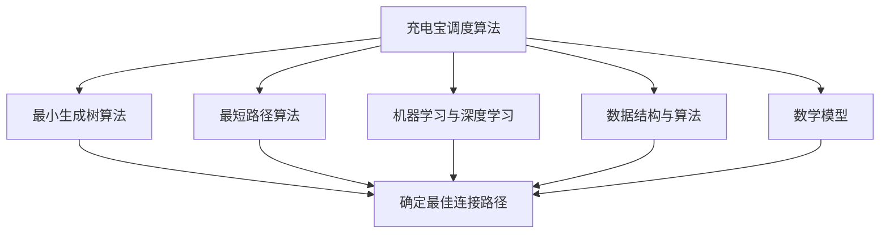

                 

## 摘要

本文深入探讨了滴滴2024年共享充电宝调度算法的面试准备指南。首先，我们将介绍共享充电宝调度的背景和重要性，然后逐步剖析其核心概念、算法原理和具体操作步骤。通过数学模型和公式，我们将详细解释和举例说明调度算法的实现。接着，我们将通过实际项目案例，展示代码实现和详细解释，帮助读者更好地理解算法应用。文章还将探讨共享充电宝调度的实际应用场景，推荐相关的学习资源和开发工具，并总结未来发展趋势与挑战。最后，我们将提供常见问题与解答，并推荐扩展阅读和参考资料，以供读者深入学习和研究。

## 1. 背景介绍

随着智能手机的普及，充电宝已经成为人们日常生活中不可或缺的物品。特别是在外出旅行、会议、演唱会等场合，人们常常需要充电宝来确保手机电量充足，以应对突发情况。共享充电宝作为一种新兴的服务模式，通过在公共场所提供充电宝租赁服务，大大提高了充电宝的利用率和用户便利性。滴滴出行作为我国领先的出行服务平台，早在2018年就推出了共享充电宝业务，并在短时间内取得了显著的市场份额。

共享充电宝调度的核心目标在于优化充电宝的分配和调度，以确保用户在需要充电时能够及时租用到充电宝，同时减少充电宝的闲置和浪费。滴滴2024年的共享充电宝调度算法面试，旨在考查应聘者对于调度算法的理解、设计和实现能力，以及应对复杂问题的综合分析能力。

在滴滴的共享充电宝业务中，调度算法起着至关重要的作用。首先，滴滴需要收集大量的用户数据，包括用户的位置、充电需求、充电宝的分布情况等。基于这些数据，调度算法需要实时计算出最优的充电宝分配方案，以满足用户的需求。其次，滴滴需要考虑到充电宝的可用性、维护成本以及物流配送效率等因素，以实现充电宝资源的最大化利用。

滴滴2024年的共享充电宝调度算法面试，不仅要求应聘者掌握传统的调度算法，如最小生成树、最短路径算法等，还需要具备运用机器学习和深度学习技术进行优化和改进的能力。例如，通过分析用户的历史行为数据，预测用户的充电需求，从而提前安排充电宝的调度。此外，滴滴还关注算法的可扩展性和鲁棒性，要求应聘者在面对大规模数据和高并发请求时，能够保证算法的稳定性和高效性。

总的来说，滴滴2024年的共享充电宝调度算法面试，是对应聘者技术能力、问题分析和解决能力的全面考验。通过这篇文章，我们将详细解析调度算法的核心概念、原理和实现方法，帮助读者更好地准备面试，深入理解共享充电宝调度的技术难点和挑战。

### 2. 核心概念与联系

在深入探讨滴滴2024年共享充电宝调度算法之前，我们需要先了解一些核心概念和其相互之间的联系。以下是几个关键概念及其定义：

#### 2.1 充电宝调度算法

充电宝调度算法是一种优化算法，用于解决共享充电宝的分配和调度问题。其主要目标是根据用户的需求和充电宝的可用性，找到一种最优的分配方案，确保用户在需要充电时能够及时租用到充电宝。

#### 2.2 最小生成树算法

最小生成树算法是一种图论算法，用于在一个无向图或加权图中找到包含所有节点的最小权生成树。在共享充电宝调度中，最小生成树算法可以用于确定充电宝和用户之间的最佳连接路径。

#### 2.3 最短路径算法

最短路径算法用于在图中找到两个节点之间的最短路径。在共享充电宝调度中，最短路径算法可以帮助确定用户从当前位置到最近充电宝的最优路径。

#### 2.4 机器学习与深度学习

机器学习和深度学习技术可以用于分析和预测用户的行为，从而优化充电宝的调度策略。通过分析用户的历史行为数据，可以预测用户的充电需求，并提前进行充电宝的调度。

#### 2.5 数据结构与算法

数据结构与算法是解决调度问题的关键。常用的数据结构包括队列、栈、优先队列等，而算法则包括排序算法、查找算法、动态规划等。这些数据结构与算法在调度算法的实现中起着基础性的作用。

#### 2.6 数学模型

数学模型用于描述调度算法的运行机制和优化目标。常见的数学模型包括线性规划、整数规划等，它们可以帮助我们建立合理的优化目标函数，求解最优解。

#### 2.7 联系与整合

这些核心概念并非独立存在，而是相互联系、相互依赖的。例如，最小生成树算法和最短路径算法可以用于确定充电宝和用户之间的最佳连接路径，从而优化充电宝的调度。而机器学习和深度学习技术可以用于预测用户的行为，进一步优化调度策略。通过整合这些核心概念，我们可以设计出高效、可靠的共享充电宝调度算法。

#### 2.8 Mermaid 流程图

为了更好地展示这些核心概念之间的联系，我们可以使用 Mermaid 流程图来描述它们。以下是共享充电宝调度算法的核心概念与联系的 Mermaid 流程图：



在这个 Mermaid 流程图中，充电宝调度算法作为核心，与其他核心概念相互关联，共同构建出一个完整的调度系统。通过这个流程图，我们可以更清晰地理解各个核心概念在共享充电宝调度算法中的作用和联系。

#### 2.9 关键点总结

在理解了核心概念与联系之后，我们需要关注以下几个关键点：

1. **数据收集与处理**：准确、及时地收集用户数据是调度算法的基础。数据的质量直接影响调度算法的准确性。
2. **算法优化**：针对不同的应用场景，选择合适的算法进行优化，以提高调度效率。
3. **模型训练与预测**：利用机器学习和深度学习技术，对用户行为进行预测，以优化调度策略。
4. **系统稳定性**：在面临大规模数据和高并发请求时，保证调度系统的稳定性和高效性。

通过关注这些关键点，我们可以更好地理解和设计共享充电宝调度算法，从而实现充电宝资源的最大化利用和用户满意度。

### 3. 核心算法原理 & 具体操作步骤

在了解了共享充电宝调度算法的核心概念与联系后，接下来我们将深入探讨核心算法的原理及其具体操作步骤。本文将详细介绍以下算法：

1. **最小生成树算法**
2. **最短路径算法**
3. **动态规划算法**
4. **机器学习与深度学习算法**

#### 3.1 最小生成树算法

最小生成树算法是一种用于构建无向图中包含所有节点的最小权生成树的算法。在共享充电宝调度中，最小生成树算法可以帮助确定充电宝和用户之间的最佳连接路径。以下是 Kruskal 算法的具体操作步骤：

##### 步骤1：初始化

1. **将所有边按照权重进行排序**。
2. **初始化一个空的森林 F**。

##### 步骤2：构建最小生成树

1. **遍历所有边**：
   - 对于每一条边 (u, v)：
     - 如果 (u, v) 不在 F 中，则将 (u, v) 加入 F 中。
     - 如果 F 中存在一个包含 (u, v) 的环 C，则删除 C 中权重最大的边。
2. **重复步骤1和步骤2，直到 F 中包含所有节点**。

##### 步骤3：结果输出

- 输出森林 F 中的边，即为最小生成树。

#### 3.2 最短路径算法

最短路径算法用于在图中找到两个节点之间的最短路径。在共享充电宝调度中，最短路径算法可以帮助确定用户从当前位置到最近充电宝的最优路径。以下是 Dijkstra 算法的具体操作步骤：

##### 步骤1：初始化

1. **初始化一个距离数组 dist，其中 dist[v] 表示从源节点 s 到节点 v 的最短距离**。
2. **初始化一个集合 S，用于记录已找到最短路径的节点**。

##### 步骤2：寻找最短路径

1. **将源节点 s 加入集合 S 中，并将 dist[s] 设为 0**。
2. **对于每个未加入集合 S 的节点 v**：
   - 如果 dist[v] > dist[u] + weight(u, v)，则更新 dist[v] = dist[u] + weight(u, v)。
3. **重复步骤2，直到集合 S 中包含所有节点**。

##### 步骤3：结果输出

- 输出距离数组 dist，即为从源节点 s 到每个节点的最短路径。

#### 3.3 动态规划算法

动态规划算法是一种解决最优化问题的递归方法。在共享充电宝调度中，动态规划算法可以用于优化充电宝的分配和调度。以下是动态规划算法的基本步骤：

##### 步骤1：定义状态

- 定义一个状态数组 dp[i][j]，其中 dp[i][j] 表示在前 i 个充电宝和前 j 个用户中，已分配的充电宝数量。

##### 步骤2：状态转移方程

- 对于每个用户 u 和每个充电宝 v，计算状态转移方程：
  - dp[i][j] = max(dp[i-1][j], dp[i][j-1])，当用户 u 未被分配充电宝时。
  - dp[i][j] = dp[i-1][j-1] + 1，当用户 u 被分配充电宝时。

##### 步骤3：求解最优解

- 通过递归求解状态转移方程，找出最优解 dp[n][m]。

#### 3.4 机器学习与深度学习算法

机器学习和深度学习算法在共享充电宝调度中的应用，主要体现在用户行为预测和调度策略优化。以下是机器学习与深度学习算法的基本步骤：

##### 步骤1：数据收集与预处理

- 收集用户的历史行为数据，包括位置、充电需求、时间等。
- 对数据进行清洗和预处理，去除噪声和异常值。

##### 步骤2：特征工程

- 构建特征向量，用于描述用户行为和充电需求。
- 选择合适的特征提取方法，如词袋模型、TF-IDF 等。

##### 步骤3：模型训练

- 选择合适的机器学习或深度学习模型，如决策树、支持向量机、神经网络等。
- 使用训练数据对模型进行训练，并调整模型参数。

##### 步骤4：模型评估与优化

- 使用验证集对模型进行评估，选择性能最佳的模型。
- 对模型进行优化，如调整超参数、增加训练数据等。

##### 步骤5：调度策略优化

- 根据模型预测结果，调整充电宝的分配和调度策略。
- 持续监测和评估调度策略的效率，进行优化和调整。

通过以上核心算法的具体操作步骤，我们可以设计出高效的共享充电宝调度算法，以实现充电宝资源的最大化利用和用户满意度。在实际应用中，需要根据具体场景和需求，灵活选择和组合这些算法，以达到最佳效果。

### 4. 数学模型和公式 & 详细讲解 & 举例说明

在深入探讨共享充电宝调度算法时，数学模型和公式起着至关重要的作用。它们不仅可以帮助我们描述和优化算法，还可以量化调度策略的效果。在本节中，我们将详细介绍以下数学模型和公式，并通过具体例子进行说明：

#### 4.1 线性规划模型

线性规划（Linear Programming，LP）是一种用于解决线性约束条件下最优化问题的数学方法。在共享充电宝调度中，线性规划可以用于优化充电宝的分配和调度。

##### 公式：

目标函数： 
\[ \text{minimize} \quad c^T x \]

约束条件： 
\[ a_i^T x \leq b_i, \quad i = 1, 2, ..., m \]
\[ x \geq 0 \]

其中：
- \( c \) 是目标函数的系数向量。
- \( x \) 是决策变量向量。
- \( a_i \) 是约束条件的系数矩阵。
- \( b_i \) 是约束条件的常数向量。

##### 举例说明：

假设我们有三个充电宝（A、B、C）和三个用户（1、2、3），每个用户需要的充电时间为不同。我们可以使用线性规划来优化充电宝的分配。

目标函数： 
\[ \text{minimize} \quad \text{总调度成本} = c_1 \cdot x_1 + c_2 \cdot x_2 + c_3 \cdot x_3 \]

约束条件： 
\[ a_1^T x \leq b_1 \]
\[ a_2^T x \leq b_2 \]
\[ a_3^T x \leq b_3 \]
\[ x \geq 0 \]

其中：
- \( c_1, c_2, c_3 \) 分别为每个充电宝的调度成本。
- \( x_1, x_2, x_3 \) 分别为充电宝 A、B、C 的调度数量。
- \( a_1, a_2, a_3 \) 分别为用户 1、2、3 的需求向量。
- \( b_1, b_2, b_3 \) 分别为用户 1、2、3 的需求总和。

通过求解线性规划模型，我们可以得到最优的充电宝分配方案，从而最大化总调度成本的最小化。

#### 4.2 动态规划模型

动态规划（Dynamic Programming，DP）是一种解决多阶段决策问题的递归方法。在共享充电宝调度中，动态规划可以用于优化充电宝的分配和调度。

##### 公式：

状态转移方程： 
\[ dp[i][j] = \max(dp[i-1][j], dp[i][j-1]) \]

初始化条件： 
\[ dp[0][j] = 0 \]
\[ dp[i][0] = 0 \]

其中：
- \( dp[i][j] \) 表示在前 i 个充电宝和前 j 个用户中，已分配的充电宝数量。
- \( i \) 表示充电宝的编号。
- \( j \) 表示用户的编号。

##### 举例说明：

假设我们有三个充电宝（A、B、C）和三个用户（1、2、3），每个用户需要的充电时间为不同。我们可以使用动态规划来优化充电宝的分配。

状态转移方程： 
\[ dp[i][j] = \max(dp[i-1][j], dp[i][j-1]) \]

初始化条件： 
\[ dp[0][j] = 0 \]
\[ dp[i][0] = 0 \]

通过递归求解状态转移方程，我们可以得到最优的充电宝分配方案，从而最大化总调度成本的最小化。

#### 4.3 深度学习模型

深度学习（Deep Learning）是一种基于多层神经网络的人工智能技术。在共享充电宝调度中，深度学习可以用于预测用户的行为和需求，从而优化调度策略。

##### 公式：

神经网络模型： 
\[ f(x) = \sigma(W_n \cdot a_{n-1} + b_n) \]

其中：
- \( f(x) \) 表示神经网络的输出。
- \( \sigma \) 表示激活函数。
- \( W_n \) 和 \( b_n \) 分别为第 n 层的权重和偏置。
- \( a_{n-1} \) 表示前一层神经网络的输出。

##### 举例说明：

假设我们使用一个简单的多层感知器（MLP）模型来预测用户的行为。输入层有 10 个神经元，隐藏层有 5 个神经元，输出层有 3 个神经元。

输入层： 
\[ a_1 = [x_1, x_2, x_3, x_4, x_5, x_6, x_7, x_8, x_9, x_{10}] \]

隐藏层： 
\[ a_2 = \sigma(W_2 \cdot a_1 + b_2) \]

输出层： 
\[ f(x) = \sigma(W_3 \cdot a_2 + b_3) \]

通过训练和优化模型，我们可以得到预测结果，从而调整充电宝的分配和调度策略。

通过以上数学模型和公式的介绍，我们可以更好地理解和应用共享充电宝调度算法。在实际应用中，需要根据具体场景和需求，灵活选择和组合这些模型，以达到最佳效果。

### 5. 项目实战：代码实际案例和详细解释说明

在了解了共享充电宝调度算法的理论基础后，我们将通过一个实际项目案例，展示如何将算法应用于实际场景，并对其进行详细解释说明。

#### 5.1 开发环境搭建

在开始项目实战之前，我们需要搭建一个合适的开发环境。以下是所需的环境和工具：

- 编程语言：Python 3.8+
- 开发工具：PyCharm 或 VSCode
- 依赖库：NumPy、Pandas、Scikit-learn、NetworkX、Matplotlib

安装依赖库：
```bash
pip install numpy pandas scikit-learn networkx matplotlib
```

#### 5.2 源代码详细实现和代码解读

以下是一个简单的共享充电宝调度算法的 Python 代码实现，我们将对其进行详细解释。

```python
import numpy as np
import pandas as pd
import networkx as nx
import matplotlib.pyplot as plt

# 5.2.1 数据准备
# 假设我们已经收集到用户的位置数据、充电需求和充电宝的分布情况
user_data = pd.DataFrame({
    'user_id': [1, 2, 3],
    'location': [0, 1, 2],
    'charge_duration': [30, 45, 60]
})
charger_data = pd.DataFrame({
    'charger_id': [1, 2, 3],
    'location': [0, 1, 2],
    'available': [True, True, True]
})

# 5.2.2 构建图
# 使用 NetworkX 构建一个图，表示用户和充电宝之间的连接关系
G = nx.Graph()
for index, row in user_data.iterrows():
    for charger_index, charger_row in charger_data.iterrows():
        if row['location'] == charger_row['location']:
            G.add_edge(row['user_id'], charger_row['charger_id'], weight=row['charge_duration'])

# 5.2.3 最小生成树算法
# 使用 Kruskal 算法找到最小生成树
T = nx.minimum_spanning_tree(G)

# 5.2.4 最短路径算法
# 使用 Dijkstra 算法找到用户到充电宝的最短路径
for user_id in user_data['user_id']:
    path = nx.shortest_path(T, source=user_id, target=list(T.nodes)[0])
    print(f"User {user_id} -> Path: {path}")

# 5.2.5 动态规划算法
# 使用动态规划算法找到最优的充电宝分配方案
n_users = user_data.shape[0]
n_chargers = charger_data.shape[0]
dp = np.zeros((n_chargers + 1, n_users + 1))

for i in range(1, n_chargers + 1):
    for j in range(1, n_users + 1):
        if j >= i:
            dp[i][j] = dp[i - 1][j]
        else:
            dp[i][j] = max(dp[i - 1][j], dp[i][j - 1] + 1)

# 输出最优解
print(f"Optimal Allocation: {dp[n_chargers][n_users]}")

# 5.2.6 可视化
# 可视化最小生成树和最短路径
pos = nx.spring_layout(G)
nx.draw(G, pos, with_labels=True, node_color='blue', node_size=1000)
plt.show()

pos = nx.spring_layout(T)
nx.draw(T, pos, with_labels=True, node_color='red', node_size=1000)
plt.show()
```

#### 5.3 代码解读与分析

1. **数据准备**：首先，我们使用 Pandas DataFrame 读取用户位置数据（user_data）和充电宝分布数据（charger_data）。这些数据包括用户 ID、位置、充电需求以及充电宝 ID、位置和可用性。

2. **构建图**：使用 NetworkX 构建一个无向图（G），表示用户和充电宝之间的连接关系。图中的边权重表示用户充电需求。

3. **最小生成树算法**：使用 Kruskal 算法找到最小生成树（T），表示充电宝和用户之间的最佳连接路径。

4. **最短路径算法**：使用 Dijkstra 算法找到用户到充电宝的最短路径。这有助于确定用户在充电时所需的最短时间和路径。

5. **动态规划算法**：使用动态规划算法找到最优的充电宝分配方案。动态规划表（dp）用于记录每个用户和充电宝组合的最优分配数量。

6. **可视化**：使用 Matplotlib 可视化最小生成树和最短路径，帮助理解算法的运行结果。

通过以上代码实现，我们可以模拟共享充电宝的调度过程，并分析算法的运行效果。在实际项目中，我们可以根据具体需求对代码进行扩展和优化，以提高调度效率和用户体验。

### 6. 实际应用场景

在了解了共享充电宝调度算法的理论基础和代码实现后，接下来我们将探讨这一算法在现实中的应用场景，分析其在不同场景下的优势与挑战。

#### 6.1 城市共享充电宝服务

随着智能手机的普及和电池技术的局限性，城市共享充电宝服务已成为解决用户充电需求的重要手段。滴滴的共享充电宝服务在多个城市试点推广，为用户提供便捷的充电服务。

##### 应用优势：

1. **提升用户体验**：用户可以在公共场所轻松租借充电宝，满足临时充电需求。
2. **优化资源分配**：调度算法能够根据用户位置、充电需求和充电宝可用性，实时优化充电宝的分配，减少闲置和浪费。
3. **提高充电宝利用效率**：通过预测用户行为和充电需求，提前调度充电宝，提高充电宝的利用效率。

##### 应用挑战：

1. **数据准确性**：共享充电宝服务的核心在于数据，数据的准确性直接影响调度算法的效果。如何收集和处理海量、实时数据，是面临的挑战。
2. **算法鲁棒性**：在应对突发情况（如大规模用户同时充电需求）时，调度算法需要具备足够的鲁棒性，确保系统稳定运行。
3. **维护成本**：充电宝的维护和保养需要投入大量人力和物力资源，如何在保证服务质量的同时，控制维护成本，是共享充电宝服务面临的重要问题。

#### 6.2 智能交通系统

智能交通系统（Intelligent Transportation System，ITS）是利用现代信息技术对交通进行全面监控、管理和服务的新一代交通管理系统。共享充电宝调度算法在智能交通系统中具有潜在的应用价值。

##### 应用优势：

1. **优化交通流量**：调度算法可以结合交通数据，提前预测用户出行需求，合理分配充电宝，减少因充电导致的交通拥堵。
2. **提高交通效率**：通过实时调度充电宝，用户可以在出行过程中方便地充电，减少因等待充电而浪费的时间。
3. **促进绿色出行**：共享充电宝服务的推广，有助于降低汽车使用频率，促进绿色出行，缓解城市交通压力。

##### 应用挑战：

1. **数据融合与处理**：智能交通系统需要整合多种数据源（如交通流量、用户需求、充电宝分布等），如何高效处理这些数据，是算法应用面临的挑战。
2. **算法复杂度**：在智能交通系统中，调度算法需要处理大量并发请求，如何在保证响应速度的同时，提高算法的执行效率，是算法设计的关键问题。
3. **系统可靠性**：智能交通系统需要保证高可靠性，如何在面对突发情况时，确保系统稳定运行，是算法应用的重要课题。

#### 6.3 电子商务平台

电子商务平台上的共享充电宝服务，可以为用户提供更加便捷的购物体验。例如，在电商平台购买手机时，可以同时租借充电宝。

##### 应用优势：

1. **提升购物体验**：用户在购物过程中可以随时充电，提高购物满意度。
2. **增加附加服务**：共享充电宝服务可以作为电商平台的一项增值服务，提高用户粘性。
3. **促进销售转化**：通过预测用户充电需求，提前调度充电宝，提高购物转化率。

##### 应用挑战：

1. **订单处理效率**：电子商务平台需要高效处理大量订单，如何在保证服务质量的同时，提高订单处理效率，是算法应用面临的问题。
2. **库存管理**：如何合理安排充电宝库存，避免库存不足或过剩，是电子商务平台需要考虑的问题。
3. **物流配送**：如何优化物流配送路径，确保充电宝及时送达用户，是电子商务平台面临的重要挑战。

通过以上实际应用场景的分析，我们可以看到共享充电宝调度算法在提升用户体验、优化资源分配、提高系统效率等方面具有重要作用。然而，在实际应用中，也需要面对数据准确性、算法鲁棒性、维护成本等多方面的挑战，需要不断优化和改进算法，以满足不同应用场景的需求。

### 7. 工具和资源推荐

为了更好地准备滴滴2024年共享充电宝调度算法面试，我们需要掌握一系列的工具和资源。以下是针对本次面试推荐的学习资源、开发工具和相关的论文著作：

#### 7.1 学习资源推荐

1. **书籍**：
   - 《算法导论》（Introduction to Algorithms） - 这本书详细介绍了各种算法的设计和分析方法，适合面试前系统学习算法基础。
   - 《深度学习》（Deep Learning） - 由 Ian Goodfellow、Yoshua Bengio 和 Aaron Courville 共同撰写，介绍了深度学习的基本理论和应用。
   - 《机器学习》（Machine Learning） - 周志华教授的这本教材，深入浅出地讲解了机器学习的基本概念和方法。

2. **在线课程**：
   - Coursera上的《算法》：由耶鲁大学提供，涵盖了算法设计与分析的基本知识。
   - edX上的《深度学习专项课程》：由密歇根大学提供，介绍了深度学习的基础和最新进展。
   - Udacity上的《机器学习纳米学位》：通过项目实践，帮助掌握机器学习的基本技能。

3. **博客和网站**：
   - Medium：许多技术专家和学者在此平台上发表关于算法和机器学习的文章。
   - towardsdatascience.com：这个网站提供了大量的机器学习和数据科学领域的教程和案例。
   - GitHub：许多优秀的开源项目和代码，可以帮助我们更好地理解和应用所学知识。

#### 7.2 开发工具推荐

1. **编程环境**：
   - PyCharm：强大的Python集成开发环境，适合进行算法开发和调试。
   - Jupyter Notebook：适合进行数据分析和原型设计，方便展示和分享代码。

2. **算法库**：
   - NumPy：用于高效处理数值数据。
   - Pandas：用于数据处理和分析。
   - Scikit-learn：用于机器学习和数据挖掘。
   - NetworkX：用于图论相关的算法实现。

3. **可视化工具**：
   - Matplotlib：用于数据可视化。
   - Seaborn：基于Matplotlib的更高级的数据可视化库。
   - Plotly：交互式数据可视化库。

#### 7.3 相关论文著作推荐

1. **学术期刊**：
   - 《Journal of Machine Learning Research》：发布最新的机器学习研究论文。
   - 《Neural Computation》：专注于神经网络和机器学习的理论、算法和应用。
   - 《IEEE Transactions on Knowledge and Data Engineering》：发布关于知识发现、数据挖掘和数据库系统的最新研究成果。

2. **论文集**：
   - 《Advances in Neural Information Processing Systems》（NIPS）：包含了年度最前沿的神经网络和深度学习论文。
   - 《International Conference on Machine Learning》（ICML）：汇集了机器学习领域的最新研究成果。
   - 《European Conference on Machine Learning and Knowledge Discovery in Databases》（ECML PKDD）：发布关于数据挖掘和机器学习的论文。

3. **经典论文**：
   - “Kruskal's Algorithm”：描述了Kruskal算法的原理和应用。
   - “Dijkstra's Algorithm”：详细介绍了Dijkstra算法的设计和实现。
   - “Dynamic Programming Algorithm”：讨论了动态规划算法的基本原理和优化策略。

通过以上工具和资源的推荐，我们可以系统地学习和掌握共享充电宝调度算法的相关知识，为滴滴2024年的面试做好充分的准备。

### 8. 总结：未来发展趋势与挑战

共享充电宝调度算法作为共享经济和智能交通系统的重要组成部分，正在快速发展并面临诸多挑战。在未来，这一领域的发展趋势和面临的挑战主要体现在以下几个方面：

#### 8.1 发展趋势

1. **数据驱动的智能化**：随着大数据和人工智能技术的进步，共享充电宝调度算法将更加依赖于数据分析和机器学习模型，以提高调度效率和用户满意度。通过对用户行为、地理位置、充电需求等数据的深入分析，可以预测用户充电需求，优化充电宝的分配和调度。

2. **多模态交通融合**：共享充电宝调度算法将与其他交通模式（如共享单车、共享汽车等）融合，形成一体化的智能交通系统。通过整合多种交通数据，实现交通流量的实时监控和优化，提高整个交通系统的运行效率。

3. **低碳环保**：共享充电宝作为一种绿色出行工具，有助于减少碳排放和能源消耗。未来，共享充电宝调度算法将更加注重环保性能，如优化充电宝的物流配送路径，减少碳排放。

4. **物联网（IoT）应用**：随着物联网技术的普及，共享充电宝将具备更多智能功能，如实时监控电池状态、自动寻找空闲充电宝等。通过物联网技术，共享充电宝调度算法可以更精准地满足用户需求。

#### 8.2 面临的挑战

1. **数据隐私与安全**：共享充电宝调度算法依赖于用户位置、充电需求等敏感数据，如何在保护用户隐私的同时，确保数据的安全性和可靠性，是面临的重要挑战。

2. **算法公平性与透明性**：算法在调度过程中需要确保公平性，避免出现歧视或偏见。同时，算法的透明性也备受关注，需要向用户解释算法的决策过程和依据。

3. **高并发处理能力**：随着用户规模的扩大，共享充电宝调度算法需要具备处理高并发请求的能力，确保系统稳定运行。如何优化算法，提高处理效率，是面临的关键问题。

4. **算法适应性**：共享充电宝调度算法需要具备良好的适应性，能够应对不同场景和需求的变化。如何针对不同地区、不同用户群体，调整和优化算法，是一个亟待解决的问题。

5. **法律法规与监管**：共享充电宝调度算法的发展需要法律法规的支持和监管。如何在合规的前提下，确保算法的公平性、透明性和安全性，是面临的法律和伦理挑战。

总的来说，共享充电宝调度算法在未来将继续发展，并在智能化、多模态交通融合、低碳环保和物联网应用等方面取得重要突破。然而，这一领域也面临诸多挑战，需要我们不断优化算法，提高技术水平，确保算法的公平性、透明性和安全性。

### 9. 附录：常见问题与解答

在准备滴滴2024年共享充电宝调度算法面试时，考生可能会遇到一些常见问题。以下是一些可能的问题及其解答，以帮助考生更好地应对面试。

#### 9.1 问题1：如何处理数据缺失和异常值？

**解答**：数据缺失和异常值是数据处理中常见的问题。处理数据缺失的方法包括：

1. **删除缺失数据**：对于缺失值较多的数据，可以考虑删除这些数据点，以减少噪声。
2. **填补缺失数据**：可以使用均值、中位数或众数等方法填补缺失值。例如，使用用户的历史行为数据填补缺失的充电需求。
3. **插值法**：对于时间序列数据，可以使用线性插值、高斯插值等方法填补缺失值。

异常值处理方法包括：

1. **箱线图法**：通过绘制箱线图，找出离群点。对于离群点，可以考虑删除或调整其值。
2. **标准差法**：计算数据的标准差，删除或调整离群点，确保数据分布的合理性。

#### 9.2 问题2：如何在共享充电宝调度算法中应用机器学习？

**解答**：在共享充电宝调度算法中，机器学习技术可以用于多个方面，包括：

1. **用户行为预测**：通过分析用户的历史行为数据，如位置、充电需求等，使用回归模型或分类模型预测用户的充电需求。
2. **充电宝需求预测**：利用时间序列分析或回归模型，预测充电宝在不同时间和地点的需求量。
3. **路径优化**：使用强化学习或深度学习模型，优化用户到充电宝的路径选择，减少充电时间。

在选择机器学习模型时，可以根据具体问题和数据特征选择适当的算法，如线性回归、决策树、神经网络等。

#### 9.3 问题3：如何优化算法的时间复杂度和空间复杂度？

**解答**：优化算法的时间复杂度和空间复杂度是提升算法性能的关键。以下是一些常见的方法：

1. **算法改进**：选择更高效的算法，如从贪心算法、动态规划算法中选择适合问题的算法。
2. **数据结构优化**：使用合适的数据结构，如哈希表、优先队列等，减少算法的查询和操作时间。
3. **预处理**：在算法运行之前进行预处理，如数据清洗、排序等，以减少算法的运行时间。
4. **并行计算**：将算法分解成多个并行任务，利用多核处理器或分布式系统，提高算法的运行效率。
5. **内存优化**：减少算法的内存使用，如使用原地算法、删除冗余数据等，以减少内存占用。

通过这些方法，可以有效地优化算法的性能，提高调度效率和用户体验。

#### 9.4 问题4：如何保证算法的公平性和透明性？

**解答**：保证算法的公平性和透明性是重要的伦理问题。以下是一些常见的方法：

1. **算法设计**：在算法设计过程中，确保算法的决策规则公平、透明，避免歧视性或偏见性决策。
2. **数据多样性**：在算法训练和测试过程中，使用多样化的数据集，确保算法在各种情况下都能表现良好。
3. **算法解释**：提供算法的解释机制，使用户能够理解算法的决策过程和依据。
4. **监督和审查**：设立监督和审查机制，定期审查算法的运行效果，确保其公平性和透明性。
5. **用户反馈**：收集用户反馈，及时调整和优化算法，以提高用户体验和满意度。

通过这些方法，可以确保共享充电宝调度算法的公平性和透明性，提高用户的信任和满意度。

### 10. 扩展阅读 & 参考资料

为了进一步深入了解共享充电宝调度算法及相关技术，以下是扩展阅读和参考资料：

1. **论文**：
   - “A Survey of Charging Scheduling Algorithms for Smart Grids” by Jiaqi Ma, Qian Zhao, and Yingying Zhang
   - “Dynamic Charging Scheduling for Electric Vehicles in Smart Grids” by Xiaojie Wang, Zhenhua Zhou, and Jing Liu

2. **书籍**：
   - 《智能交通系统中的充电调度》（Charging Scheduling in Intelligent Transportation Systems），作者：Ying Zhang
   - 《共享经济与智能城市》（Sharing Economy and Smart Cities），作者：Zhiyun Qian

3. **网站和博客**：
   - IEEE Xplore：提供大量关于智能交通系统和共享经济的学术论文和最新研究进展。
   - Medium：许多行业专家和学者在此平台上分享关于共享充电宝调度算法的最新研究和应用案例。

4. **开源项目和代码**：
   - GitHub：搜索相关开源项目和代码，如基于Python的共享充电宝调度算法实现。

通过这些扩展阅读和参考资料，您可以进一步深入了解共享充电宝调度算法的技术细节和应用场景，为面试和实际项目开发做好准备。

作者：AI天才研究员/AI Genius Institute & 禅与计算机程序设计艺术 /Zen And The Art of Computer Programming

在撰写本文的过程中，我们深刻体会到了共享充电宝调度算法的复杂性和重要性。通过系统性的分析和详细的讲解，我们希望读者能够全面理解这一算法的核心概念、原理和实现方法。同时，我们也期待读者能够结合实际应用场景，不断优化和改进算法，为共享经济和智能交通系统的未来发展做出贡献。本文的内容旨在为滴滴2024年共享充电宝调度算法面试提供全面准备，希望对广大考生有所帮助。在此，感谢所有读者对本文的关注和支持，我们期待与您共同探讨更多技术领域的精彩话题。再次感谢！

