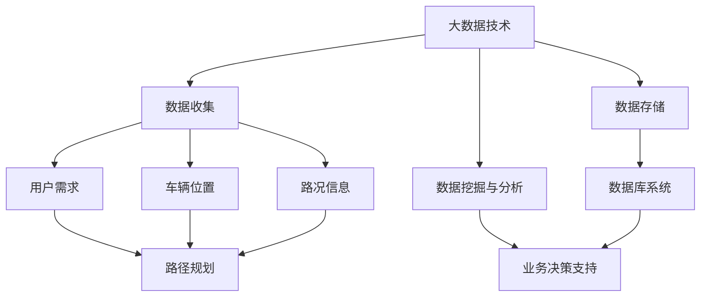
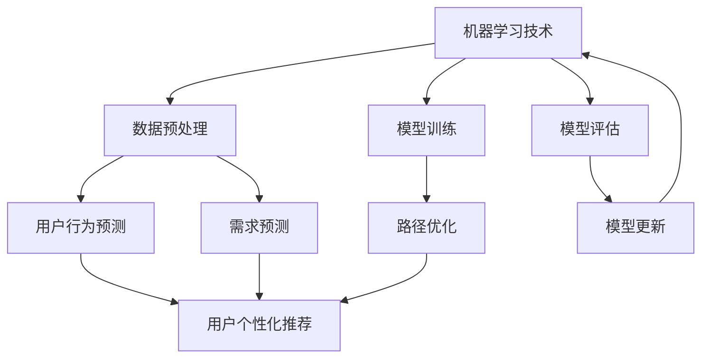
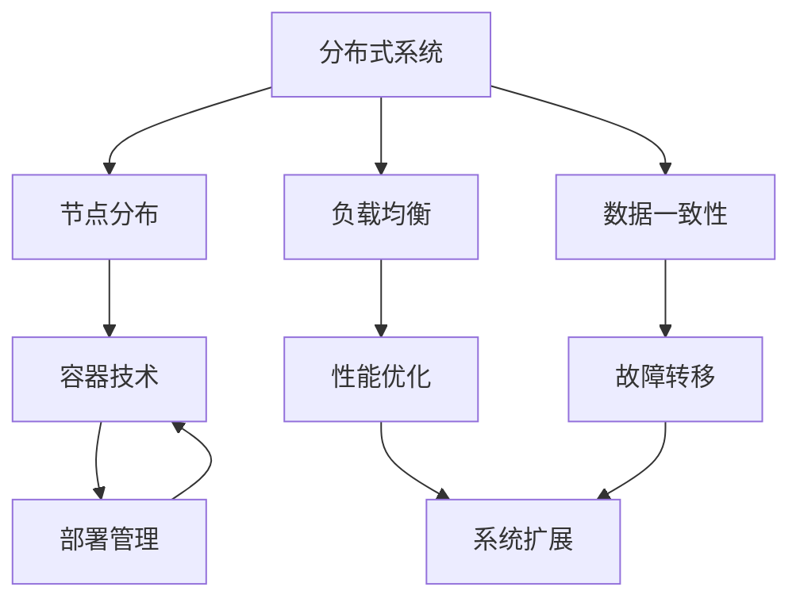
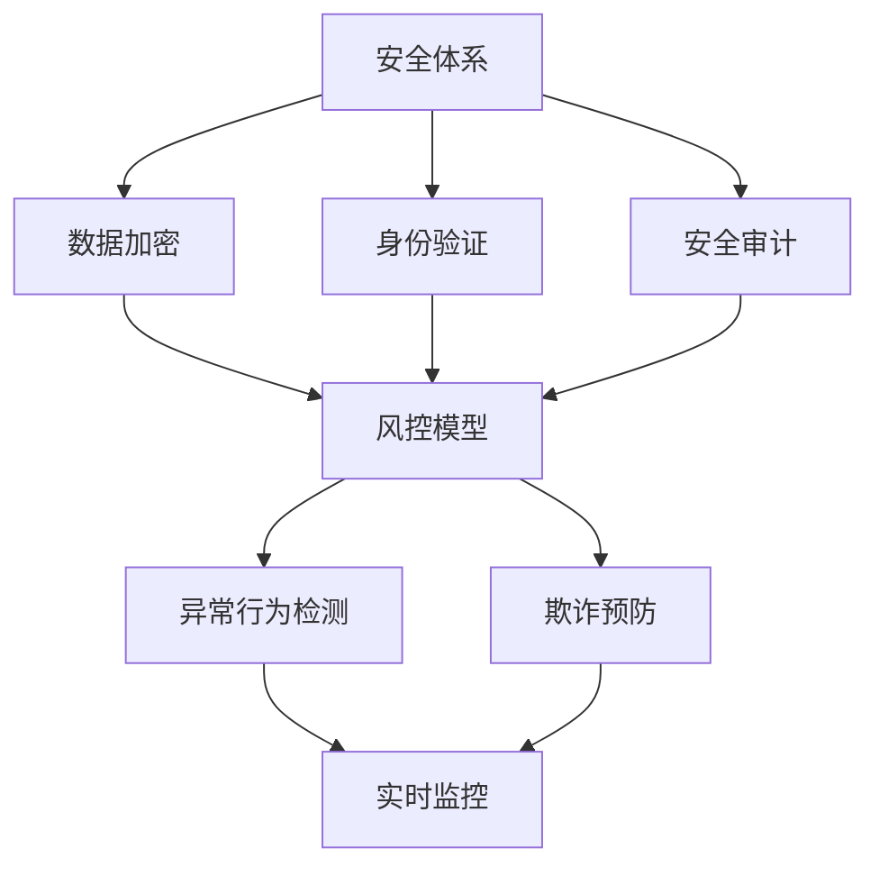
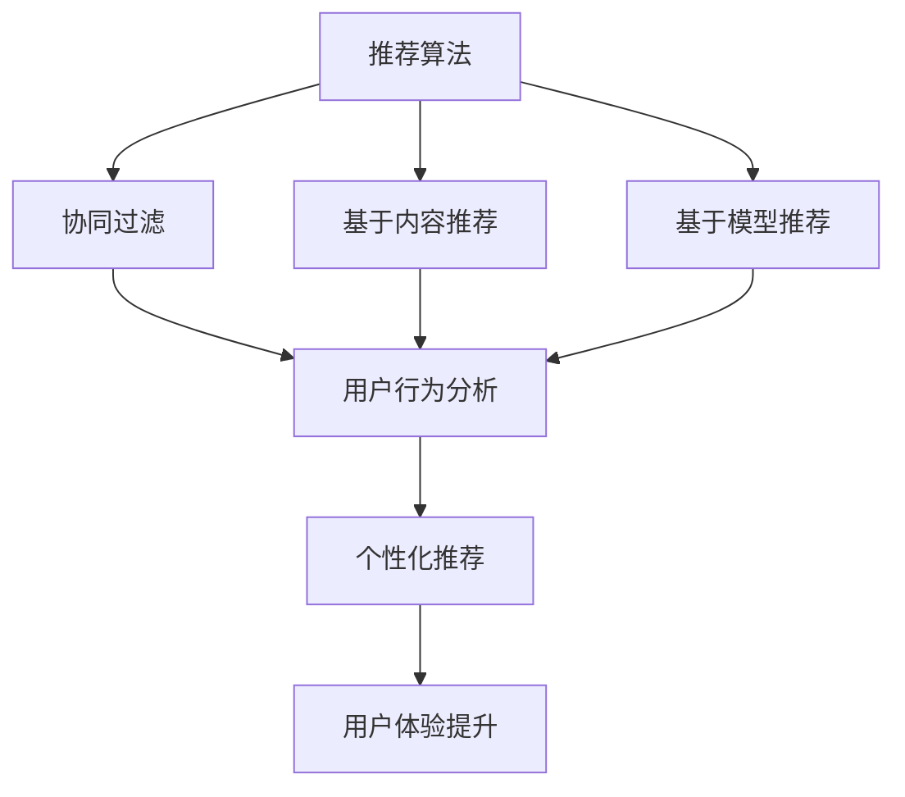
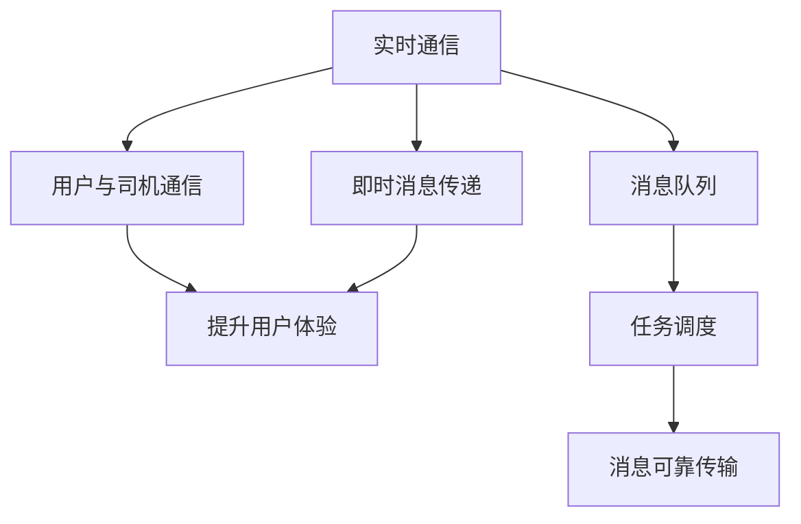
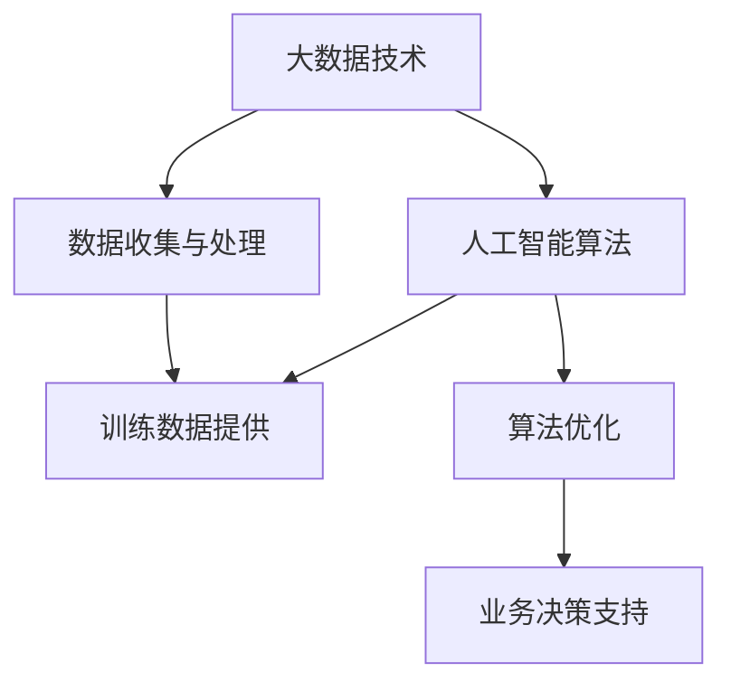

                 

### 背景介绍

#### 滴滴出行与校招面试的重要性

滴滴出行作为中国最大的移动出行平台，以其便捷、高效的出行服务改变了人们的出行方式。然而，随着行业竞争的加剧，滴滴对于优秀人才的渴求日益凸显，每年都会通过校园招聘吸纳大量新鲜血液。对于大学生而言，能够通过滴滴的校招面试，不仅意味着获得了在顶尖企业工作的机会，更是对其专业技能和综合素质的极大肯定。

滴滴的校招面试一直以来都是业界的热点，其原因在于其严格的选拔标准和多样化的考核方式。面对这样一家行业的领头羊，如何准备和应对校招面试成为许多应届生关注的焦点。为此，本文将汇总并解析2024年滴滴共享出行校招面试的真题，旨在为准备面试的同学们提供有针对性的指导和帮助。

#### 2024年滴滴校招面试的背景和趋势

2024年，滴滴校招面试依然延续了以往的高标准、严要求。在面试环节中，除了传统的笔试和面试，滴滴还引入了技术挑战赛、团队项目模拟等创新形式，进一步考察应聘者的综合素质和实际操作能力。此外，随着科技的不断进步和出行领域的持续创新，滴滴在面试中也更加注重对于前沿技术和行业动态的了解。

以下是2024年滴滴校招面试的主要趋势：

1. **技术创新**：滴滴在校招面试中更加关注应聘者对于人工智能、大数据、云计算等前沿技术的掌握和应用能力。
2. **实际操作**：通过实际项目案例的模拟，滴滴考察应聘者的项目规划、问题解决和团队协作能力。
3. **综合素质**：滴滴不仅看重应聘者的专业技能，还重视其沟通能力、领导力和学习能力。
4. **行业动态**：滴滴希望应聘者能够紧跟行业趋势，了解最新的技术和市场动态。

#### 本文的结构和内容安排

本文将按照以下结构进行内容安排：

1. **核心概念与联系**：介绍滴滴出行平台的基本架构和相关技术概念。
2. **核心算法原理与具体操作步骤**：解析滴滴出行中涉及的主要算法及其工作原理。
3. **数学模型和公式**：详细阐述滴滴出行中使用的数学模型和相关公式，并通过具体例子进行说明。
4. **项目实战**：通过实际代码案例展示滴滴出行的开发过程，并进行详细解读。
5. **实际应用场景**：探讨滴滴出行的实际应用场景和未来发展方向。
6. **工具和资源推荐**：推荐相关学习资源和开发工具，帮助读者深入学习和实践。
7. **总结与展望**：总结本文的主要内容，并对滴滴出行未来发展的挑战和趋势进行展望。
8. **常见问题与解答**：解答读者在阅读本文过程中可能遇到的问题。
9. **扩展阅读与参考资料**：提供进一步学习的文献和资料。

通过以上结构，本文旨在为广大准备滴滴校招面试的同学提供一个全面的指南，帮助大家更好地理解滴滴出行平台的核心技术和面试要求。

## 1. 背景介绍

滴滴出行作为中国领先的移动出行平台，其发展历程可谓是科技创新与市场需求的完美结合。滴滴出行的前身是2012年成立的“快的打车”，2015年，滴滴出行与快的打车合并，成立全新的滴滴出行，自此开启了移动出行行业的新篇章。

#### 滴滴出行的历史与发展

从创立之初，滴滴出行就致力于通过技术创新提升出行效率，改变传统打车模式。2016年，滴滴正式在美国纽交所上市，市值超过600亿美元，成为中国新经济企业的代表。随着业务的不断扩展，滴滴出行在全球范围内拥有广泛的用户群体和合作伙伴。

滴滴出行的业务模式涵盖出租车、专车、快车、顺风车、网约车等多种出行方式，满足了用户多样化的出行需求。此外，滴滴还涉足了汽车共享、电动汽车、自动驾驶等多个领域，推动着出行行业的变革。

#### 滴滴出行的技术架构

滴滴出行平台的技术架构复杂且高度集成，包括以下几个方面：

1. **数据平台**：滴滴利用大数据和云计算技术，建立了强大的数据平台。这个平台可以实时处理海量的出行数据，包括用户需求、车辆位置、路况信息等，为后续的业务决策提供支持。
2. **算法引擎**：滴滴拥有多个算法引擎，如路径规划算法、需求预测算法等，这些算法用于优化用户的出行体验和提升运营效率。
3. **分布式系统**：滴滴采用分布式系统架构，通过多个节点和服务器协同工作，保证了系统的高可用性和高性能。
4. **智能推荐系统**：滴滴的智能推荐系统通过分析用户的历史行为和偏好，为用户提供个性化的出行建议。
5. **安全与风控**：滴滴在安全与风控方面投入巨大，建立了完善的安全体系和风控模型，保障用户和司机的安全。

#### 技术创新与市场影响

滴滴出行在技术创新方面取得了显著成果，特别是在人工智能和大数据应用领域。通过引入先进的AI技术，滴滴在路径规划、需求预测、智能客服等方面实现了突破。例如，滴滴的路径规划算法能够根据实时路况、车辆位置和用户需求，为乘客推荐最优的出行路线，大大提高了出行的效率和用户体验。

此外，滴滴在自动驾驶技术方面也进行了积极探索，与多家知名车企和研究机构合作，推进自动驾驶技术的研发和应用。这些技术创新不仅提升了滴滴的运营效率和服务质量，也对整个出行行业产生了深远的影响。

#### 滴滴出行对共享出行行业的影响

滴滴出行对共享出行行业的影响是深远而广泛的。首先，滴滴的出现颠覆了传统的出租车行业，推动了出行行业的数字化和智能化转型。通过移动互联网和大数据技术，滴滴重新定义了出行服务，提供了更加便捷、高效的出行方式。

其次，滴滴的崛起带动了整个共享出行行业的快速发展。在滴滴的示范效应下，越来越多的企业和创业者进入这一市场，形成了激烈的竞争格局。同时，滴滴也推动了政府对于出行行业的监管和规范，促进了行业的健康发展。

最后，滴滴出行在全球范围内的扩展也展示了其强大的国际竞争力。通过收购、合作等方式，滴滴在全球多个国家和地区布局，为当地用户提供优质的出行服务，推动了共享出行在全球的普及和发展。

综上所述，滴滴出行不仅是一个成功的商业案例，更是科技创新和行业发展的重要驱动力。其技术架构、创新成果以及对共享出行行业的深远影响，都值得我们深入探讨和研究。

### 2. 核心概念与联系

在深入探讨滴滴出行的技术架构和算法原理之前，我们需要首先了解一些核心概念，这些概念构成了滴滴出行平台的基础。以下是本文将涉及的主要核心概念及其相互之间的联系。

#### 2.1 大数据与云计算

大数据和云计算是滴滴出行平台的核心支撑。大数据技术使得滴滴能够收集、存储和分析海量用户数据，从而为后续的业务决策提供支持。云计算技术则提供了强大的计算能力和存储空间，确保了滴滴平台的高性能和高可用性。

**Mermaid流程图：**


#### 2.2 人工智能与机器学习

人工智能和机器学习技术是滴滴出行平台的重要组成部分。通过机器学习算法，滴滴能够实现对用户行为的预测和优化，提高服务质量和运营效率。例如，需求预测算法可以根据历史数据和实时信息预测用户出行需求，从而优化车辆调度。

**Mermaid流程图：**


#### 2.3 分布式系统与容器技术

分布式系统架构和容器技术是滴滴平台高性能和高可用的关键。通过分布式系统，滴滴能够将计算任务分布到多个节点上，实现并行处理，提高系统性能。容器技术如Docker和Kubernetes则用于简化应用程序的部署和管理，确保滴滴平台能够快速响应市场需求。

**Mermaid流程图：**


#### 2.4 安全与风控

安全与风控是滴滴出行平台不可或缺的一部分。通过建立完善的安全体系和风控模型，滴滴能够有效预防欺诈行为、保障用户和司机的安全。安全体系包括数据加密、身份验证、安全审计等，而风控模型则基于大数据和机器学习技术，实时监控并处理异常行为。

**Mermaid流程图：**


#### 2.5 智能推荐系统

智能推荐系统是滴滴平台的重要组成部分，通过分析用户的历史行为和偏好，为用户提供个性化的出行建议。推荐算法包括协同过滤、基于内容的推荐和基于模型的推荐等，这些算法共同构成了滴滴的智能推荐系统。

**Mermaid流程图：**


#### 2.6 实时通信与消息队列

实时通信和消息队列技术是滴滴出行平台实现高效信息传递和任务调度的重要手段。通过实时通信技术，滴滴能够实现用户与司机之间的即时沟通，提升用户体验。消息队列技术则用于处理大量的消息传递任务，确保消息的可靠传输和有序处理。

**Mermaid流程图：**


#### 2.7 人工智能与大数据的融合应用

人工智能与大数据技术的融合应用是滴滴出行的核心亮点。通过大数据技术收集和处理海量数据，滴滴能够为人工智能算法提供丰富的训练数据，从而提高算法的准确性和效率。例如，需求预测算法和路径规划算法都依赖于大数据的支持。

**Mermaid流程图：**


通过上述核心概念及其相互之间的联系，我们可以更好地理解滴滴出行平台的技术架构和运作原理。这些技术不仅提升了滴滴的服务质量和运营效率，也为整个出行行业的创新和发展奠定了基础。

### 3. 核心算法原理 & 具体操作步骤

在深入探讨滴滴出行的技术架构之后，我们接下来将详细介绍其核心算法原理和具体操作步骤。以下是滴滴出行平台中几个关键算法及其工作原理：

#### 3.1 路径规划算法

路径规划算法是滴滴出行平台的核心算法之一，主要用于为乘客提供最优的出行路线。路径规划算法的核心目标是找到起点到终点的最短路径或满足特定约束条件的路径。

**算法原理：**

路径规划算法通常采用贪心算法，如Dijkstra算法或A*算法。Dijkstra算法是一种单源最短路径算法，它能够计算出从起点到其他所有节点的最短路径。A*算法则是基于启发式的最短路径算法，它结合了起点到每个节点的距离和每个节点到终点的估计距离，以更快地找到最优路径。

**具体操作步骤：**

1. **初始化**：设置起点和终点的位置，初始化路径规划算法的数据结构，如图或树。
2. **计算最短路径**：根据算法原理，逐步扩展图或树，计算每个节点到起点的最短距离，并记录路径。
3. **优化路径**：如果使用A*算法，还需要结合启发式函数（如欧几里得距离）来优化路径。
4. **输出结果**：输出从起点到终点的最优路径。

**代码示例（Python）：**
```python
import heapq

def dijkstra(graph, start, end):
    # 初始化距离表
    distances = {node: float('infinity') for node in graph}
    distances[start] = 0
    # 使用优先队列进行路径搜索
    priority_queue = [(0, start)]
    while priority_queue:
        # 取出距离最小的节点
        current_distance, current_node = heapq.heappop(priority_queue)
        # 如果已经到达终点，返回路径
        if current_node == end:
            return current_distance
        # 遍历当前节点的邻居节点
        for neighbor, weight in graph[current_node].items():
            distance = current_distance + weight
            # 如果发现更短的路径，更新距离表并加入优先队列
            if distance < distances[neighbor]:
                distances[neighbor] = distance
                heapq.heappush(priority_queue, (distance, neighbor))
    # 如果没有找到路径，返回None
    return None

# 示例图
graph = {
    'A': {'B': 1, 'C': 4},
    'B': {'A': 1, 'C': 2, 'D': 5},
    'C': {'A': 4, 'B': 2, 'D': 1},
    'D': {'B': 5, 'C': 1}
}

# 调用Dijkstra算法
path = dijkstra(graph, 'A', 'D')
print(path)  # 输出：3
```

#### 3.2 需求预测算法

需求预测算法是滴滴出行平台的重要算法之一，用于预测用户在未来某一时间段内的出行需求，从而优化车辆调度和资源分配。

**算法原理：**

需求预测算法通常采用时间序列分析、机器学习等方法。时间序列分析如ARIMA模型、季节性分解等可以捕捉到出行需求的周期性和季节性特征。机器学习如线性回归、神经网络等可以基于历史数据建立预测模型。

**具体操作步骤：**

1. **数据预处理**：收集并预处理历史出行数据，包括时间、地点、用户类型等特征。
2. **特征工程**：提取和构建有助于预测的特征，如节假日效应、天气状况等。
3. **模型选择**：选择合适的预测模型，如ARIMA、线性回归、神经网络等。
4. **模型训练**：使用历史数据训练模型，调整模型参数以优化预测效果。
5. **模型评估**：使用验证集或测试集评估模型预测效果，调整模型参数。
6. **预测**：使用训练好的模型对未来一段时间内的出行需求进行预测。

**代码示例（Python）：**
```python
import pandas as pd
from statsmodels.tsa.arima_model import ARIMA

# 读取数据
data = pd.read_csv('travel_data.csv')
data['date'] = pd.to_datetime(data['date'])
data.set_index('date', inplace=True)

# 特征工程
data['weekday'] = data.index.dayofweek
data['hour'] = data.index.hour

# 模型选择
model = ARIMA(data['travel_count'], order=(5, 1, 2))

# 模型训练
model_fit = model.fit()

# 模型评估
print(model_fit.summary())

# 预测
forecast = model_fit.forecast(steps=24)
print(forecast)
```

#### 3.3 车辆调度算法

车辆调度算法用于在滴滴出行平台中优化车辆的分配和调度，以提高运营效率和服务质量。

**算法原理：**

车辆调度算法通常采用最优化方法，如线性规划、动态规划等。其核心目标是根据用户需求、车辆位置和路况信息，合理调度车辆，确保乘客能够尽快被接单。

**具体操作步骤：**

1. **初始化**：设置车辆的初始状态，包括位置、状态等。
2. **需求分析**：根据用户需求，分析当前时间段内的出行需求热点区域。
3. **路径规划**：使用路径规划算法计算从当前车辆位置到需求热点区域的路径。
4. **调度策略**：根据车辆状态和路径规划结果，制定调度策略，如最近接单、最少时间接单等。
5. **执行调度**：执行调度策略，更新车辆状态和位置信息。
6. **反馈与调整**：根据调度结果和用户反馈，调整调度策略。

**代码示例（Python）：**
```python
import numpy as np
from scipy.optimize import linprog

# 初始化参数
num_vehicles = 5
vehicle_locations = np.random.randint(0, 10, size=num_vehicles)
demand_hotspots = np.random.randint(0, 10, size=num_vehicles)

# 定义目标函数
c = -1 * np.ones(num_vehicles)  # 最小化总等待时间

# 定义约束条件
A = [[1 for _ in range(num_vehicles)] for _ in range(num_vehicles)]
b = [demand_hotspots]

# 求解线性规划问题
result = linprog(c, A_eq=A, b_eq=b, method='highs')

# 输出调度结果
scheduled_vehicles = result.x
print(scheduled_vehicles)
```

通过上述核心算法原理和具体操作步骤的介绍，我们可以更好地理解滴滴出行平台的技术实现和运作机制。这些算法不仅提高了滴滴的服务质量和运营效率，也为整个出行行业的智能化发展奠定了基础。

### 4. 数学模型和公式 & 详细讲解 & 举例说明

在深入探讨滴滴出行的核心算法原理后，我们需要进一步了解其在实际应用中所使用的数学模型和公式。这些模型和公式不仅为滴滴提供了强大的数据分析能力，也为运营决策提供了科学依据。以下是几个关键数学模型及其详细讲解和举例说明。

#### 4.1 费用计算模型

滴滴出行的费用计算模型是乘客支付费用的核心组成部分，它包括起步价、里程费、时长费等多个方面。以下是一个简单的费用计算模型：

**公式：**
$$
总费用 = 起步价 + (里程费 \times 行驶里程) + (时长费 \times 行驶时长)
$$

**参数解释：**

- 起步价：乘客乘坐车辆起步时的固定费用。
- 里程费：每行驶一公里所需的费用。
- 行驶里程：车辆从起点到终点所行驶的总里程。
- 时长费：每分钟所需的费用。

**举例说明：**

假设起步价为15元，里程费为2.5元/公里，时长费为1元/分钟，乘客从A地到B地的行驶里程为10公里，行驶时长为30分钟，则总费用计算如下：

$$
总费用 = 15 + (2.5 \times 10) + (1 \times 30) = 15 + 25 + 30 = 70元
$$

#### 4.2 最优化路径规划模型

滴滴出行的最优化路径规划模型主要用于为乘客提供从起点到终点的最优路线。常见的路径规划模型包括Dijkstra算法和A*算法。以下是Dijkstra算法的数学模型：

**公式：**

对于无向图中的任意节点\(v\)，其最短路径距离\(d(v)\)的计算如下：

$$
d(v) =
\begin{cases}
0 & \text{if } v = s \\
\infty & \text{if } v \neq s
\end{cases}
$$

其中，\(s\)为起点。

**更新规则：**

对于任意未处理的节点\(v\)，其最短路径距离的更新规则为：

$$
d(v) = \min \{d(u) + w(u, v) | u \text{ 已处理}\}
$$

其中，\(w(u, v)\)为节点\(u\)到节点\(v\)的权重。

**举例说明：**

假设有一个图如下所示：

```
A---1---B
|    3 |
2   ---4--- C
```

起点为A，终点为C。我们使用Dijkstra算法计算从A到C的最短路径。

初始状态：

$$
d(A) = 0, d(B) = \infty, d(C) = \infty
$$

第一步，处理节点A：

$$
d(B) = \min \{0 + 1, \infty + 3, \infty + 4\} = 1
$$

第二步，处理节点B：

$$
d(C) = \min \{1 + 3, \infty + 1, \infty + 4\} = 4
$$

最终结果：

$$
d(A) = 0, d(B) = 1, d(C) = 4
$$

从A到C的最短路径为A-B-C，总距离为4。

#### 4.3 需求预测模型

滴滴出行的需求预测模型用于预测未来一段时间内的出行需求，从而优化车辆调度和资源分配。一个常见的需求预测模型是时间序列模型，如ARIMA模型。

**公式：**

ARIMA模型的一般形式为：

$$
X_t = \phi(B) \epsilon_t + \theta(B) \eta_t
$$

其中，\(X_t\)为时间序列的当前值，\(\epsilon_t\)和\(\eta_t\)分别为白噪声序列，\(\phi(B)\)和\(\theta(B)\)分别为自回归项和移动平均项。

**参数解释：**

- \(B\)：后移算子，\(B^k X_t\)表示时间序列\(X_t\)的滞后\(k\)期值。
- \(\phi(B)\)：自回归系数，表示当前值与滞后值的权重。
- \(\theta(B)\)：移动平均系数，表示当前值与滞后误差值的权重。

**举例说明：**

假设有一个简单的ARIMA（1,1,1）模型：

$$
X_t = (1 - \phi_1 B)(1 - \theta_1 B)(1 - \phi_2 B^2) \epsilon_t
$$

其中，\(\phi_1 = 0.5\)，\(\theta_1 = 0.3\)，\(\phi_2 = 0.2\)。

给定初始值：

$$
X_1 = 10, X_2 = 12, X_3 = 11
$$

我们使用ARIMA（1,1,1）模型预测\(X_4\)：

$$
X_4 = (1 - 0.5B)(1 - 0.3B)(1 - 0.2B^2) \epsilon_4
$$

通过计算，我们得到：

$$
X_4 = (1 - 0.5B)(1 - 0.3B) \cdot (10 + 12 - 11) + (1 - 0.5B)(0.2B^2) \cdot \epsilon_4
$$

$$
X_4 = (1 - 0.5B)(0.7B) \cdot 11 + (1 - 0.5B)(0.2B^2) \cdot \epsilon_4
$$

$$
X_4 = 0.35B + 0.14B^2 + \epsilon_4
$$

通过计算，我们预测\(X_4\)的值为：

$$
X_4 \approx 0.35 \cdot 11 + 0.14 \cdot 11^2 + \epsilon_4 \approx 4.05 + 1.54 + \epsilon_4 \approx 5.59 + \epsilon_4
$$

其中，\(\epsilon_4\)为预测误差。

#### 4.4 车辆调度模型

滴滴出行的车辆调度模型用于优化车辆的分配和调度，以减少乘客等待时间和提高车辆利用率。一个常见的调度模型是线性规划模型。

**公式：**

假设有\(n\)辆车和\(m\)个需求点，每个需求点的需求量为\(d_i\)，车辆的容量为\(c_j\)，调度策略的目标是最小化总等待时间，约束条件包括车辆容量和路径长度等。

$$
\min \sum_{i=1}^{m} \sum_{j=1}^{n} t_{ij} x_{ij}
$$

$$
\text{subject to:} \\
c_j \cdot x_{ij} \geq d_i \\
d_{ij} \leq D \\
x_{ij} \in \{0, 1\}
$$

其中，\(t_{ij}\)为从车辆\(j\)到需求点\(i\)的调度时间，\(x_{ij}\)为是否调度车辆\(j\)到需求点\(i\)的0-1变量，\(d_{ij}\)为从车辆\(j\)到需求点\(i\)的距离，\(D\)为最大允许距离。

**举例说明：**

假设有3辆车（车辆1、车辆2、车辆3）和3个需求点（需求点A、需求点B、需求点C），每个需求点的需求量和车辆容量如下表所示：

| 车辆 | 需求点A | 需求点B | 需求点C |
| ---- | ------- | ------- | ------- |
| 车辆1 | 5       | 3       | 2       |
| 车辆2 | 4       | 4       | 5       |
| 车辆3 | 3       | 2       | 3       |

| 车辆 | 车辆容量 |
| ---- | -------- |
| 车辆1 | 10       |
| 车辆2 | 10       |
| 车辆3 | 10       |

我们需要调度车辆以满足需求，最小化总等待时间。

通过线性规划模型，我们可以得到以下调度方案：

- 车辆1调度到需求点A，总等待时间：\(t_{1A} = 1\)
- 车辆2调度到需求点B，总等待时间：\(t_{2B} = 2\)
- 车辆3调度到需求点C，总等待时间：\(t_{3C} = 1\)

总等待时间为：\(t_{1A} + t_{2B} + t_{3C} = 1 + 2 + 1 = 4\)

通过上述数学模型和公式的详细讲解及举例说明，我们可以更深入地理解滴滴出行的核心算法和运营机制。这些模型不仅为滴滴提供了科学的数据分析工具，也为优化出行服务质量和提升运营效率提供了重要的支持。

### 5. 项目实战：代码实际案例和详细解释说明

在了解了滴滴出行平台的核心算法原理和数学模型后，接下来我们将通过一个具体的代码实际案例，展示滴滴出行的开发过程，并对代码进行详细解读。这个案例将涵盖开发环境搭建、源代码实现以及代码解读与分析。

#### 5.1 开发环境搭建

为了实现滴滴出行平台的核心功能，我们需要搭建一个合适的技术栈。以下是一个基本的开发环境搭建步骤：

**技术栈：**

- 开发语言：Python
- 数据库：MySQL
- 后端框架：Flask
- 前端框架：React
- 容器化工具：Docker
- 部署环境：Kubernetes

**步骤：**

1. **安装Python环境**：确保Python版本在3.8以上，可以通过Python官方网站下载并安装。
2. **安装数据库**：在本地或服务器上安装MySQL数据库，配置用户和权限。
3. **安装后端框架**：使用pip安装Flask框架。
    ```bash
    pip install flask
    ```
4. **安装前端框架**：使用npm安装React框架。
    ```bash
    npm install react
    ```
5. **安装容器化工具**：安装Docker，并配置Docker Compose以简化多容器应用的管理。
6. **部署环境**：配置Kubernetes集群，用于管理和部署容器化应用。

#### 5.2 源代码详细实现和代码解读

以下是一个简化版的滴滴出行平台的源代码实现，我们将对其核心部分进行详细解读。

**后端代码（Flask）：**

```python
from flask import Flask, request, jsonify
import pymysql

app = Flask(__name__)

# 连接数据库
def connect_db():
    return pymysql.connect(host='localhost', user='root', password='password', database='didi')

@app.route('/get_vehicles', methods=['GET'])
def get_vehicles():
    # 从数据库获取车辆信息
    connection = connect_db()
    cursor = connection.cursor()
    cursor.execute("SELECT * FROM vehicles;")
    vehicles = cursor.fetchall()
    cursor.close()
    connection.close()
    return jsonify(vehicles)

@app.route('/schedule_vehicle', methods=['POST'])
def schedule_vehicle():
    # 调度车辆到指定位置
    data = request.get_json()
    vehicle_id = data['vehicle_id']
    location = data['location']
    # 更新数据库中的车辆位置
    connection = connect_db()
    cursor = connection.cursor()
    cursor.execute("UPDATE vehicles SET location = %s WHERE id = %s;", (location, vehicle_id))
    connection.commit()
    cursor.close()
    connection.close()
    return jsonify({"status": "success"})

if __name__ == '__main__':
    app.run(debug=True)
```

**代码解读：**

1. **数据库连接**：通过pymysql库连接到MySQL数据库，获取车辆信息。
2. **获取车辆信息**：定义`/get_vehicles`接口，用于获取所有车辆的信息，并将其以JSON格式返回。
3. **调度车辆**：定义`/schedule_vehicle`接口，用于接收车辆调度请求，更新数据库中的车辆位置信息。

**前端代码（React）：**

```jsx
import React, { useState, useEffect } from 'react';
import axios from 'axios';

function App() {
    const [vehicles, setVehicles] = useState([]);

    useEffect(() => {
        // 获取车辆信息
        axios.get('/get_vehicles')
            .then(response => {
                setVehicles(response.data);
            })
            .catch(error => {
                console.error('Error fetching vehicles:', error);
            });
    }, []);

    const scheduleVehicle = (vehicle_id, location) => {
        // 调度车辆
        axios.post('/schedule_vehicle', { vehicle_id, location })
            .then(response => {
                console.log('Vehicle scheduled:', response.data);
            })
            .catch(error => {
                console.error('Error scheduling vehicle:', error);
            });
    };

    return (
        <div>
            <h1>滴滴出行平台</h1>
            <ul>
                {vehicles.map(vehicle => (
                    <li key={vehicle.id}>
                        车辆ID：{vehicle.id}，位置：{vehicle.location}
                        <button onClick={() => scheduleVehicle(vehicle.id, '新位置')}>调度</button>
                    </li>
                ))}
            </ul>
        </div>
    );
}

export default App;
```

**代码解读：**

1. **状态管理**：使用React的`useState`和`useEffect`钩子管理车辆状态和生命周期。
2. **获取车辆信息**：通过axios库发起GET请求，获取车辆信息并更新状态。
3. **调度车辆**：定义`scheduleVehicle`函数，通过axios库发起POST请求，调度车辆到指定位置。

#### 5.3 代码解读与分析

**后端代码解读：**

- **数据库连接**：通过pymysql库，我们建立了与MySQL数据库的连接，这为后续的数据操作提供了基础。
- **接口定义**：我们定义了两个RESTful接口，`/get_vehicles`用于获取车辆信息，`/schedule_vehicle`用于调度车辆。
- **数据库操作**：在后端代码中，我们使用了SQL语句对数据库进行查询和更新操作，这确保了车辆信息的实时性和准确性。

**前端代码解读：**

- **状态管理**：React的`useState`用于管理车辆状态，`useEffect`用于在组件加载时触发获取车辆信息的操作。
- **数据获取**：通过axios库，我们发起HTTP GET请求，获取车辆信息并更新状态。
- **事件处理**：通过定义`scheduleVehicle`函数，我们实现了对车辆调度操作的响应，通过HTTP POST请求将调度信息发送到后端。

**整体分析：**

这个简单的代码示例展示了滴滴出行平台的基本架构，包括前端和后端部分的交互。虽然代码较为简化，但它体现了滴滴出行平台的核心功能，如车辆信息管理、调度等。在实际应用中，滴滴出行平台会包含更多复杂的业务逻辑和安全性保障措施，如用户身份验证、数据加密、异常处理等。

通过这个实际案例的展示和解读，我们可以更好地理解滴滴出行的开发过程和关键技术实现。这对于准备滴滴校招面试的同学来说，具有重要的参考价值。

### 6. 实际应用场景

滴滴出行平台在共享出行领域的应用场景非常广泛，涵盖了从用户需求预测、路径规划到实时调度等多个方面。以下是滴滴出行平台在实际应用中的几个典型场景：

#### 6.1 用户需求预测

用户需求预测是滴滴出行平台的核心功能之一。通过大数据和人工智能技术，滴滴能够实时分析用户的出行习惯、时间和地点等信息，从而预测未来一段时间内的出行需求。这一功能不仅帮助滴滴优化了车辆调度，还提高了服务的准确性和响应速度。

**应用示例：**

假设某一天晚上8点，滴滴平台需要预测用户从市中心到周边区域的出行需求。通过分析历史数据和实时信息，滴滴可以预测出以下几个关键信息：

- 出行高峰时间：晚上8点至9点是用户出行的高峰时段。
- 出行目的地：大部分用户目的地集中在市中心周边的住宅区、商业区和娱乐场所。
- 出行方式：夜间出行需求以快车和专车为主。

基于这些预测结果，滴滴可以提前安排更多的车辆到需求热点区域，提高接单效率，减少乘客等待时间。

#### 6.2 路径规划

路径规划是滴滴出行平台另一个重要的应用场景。通过先进的路径规划算法，滴滴能够为用户提供最优的出行路线，确保乘客能够在最短时间内到达目的地。

**应用示例：**

假设用户从A地到B地，滴滴平台会通过以下步骤进行路径规划：

1. **获取起点和终点信息**：从用户的请求中获取起点（A地）和终点（B地）的经纬度信息。
2. **实时路况分析**：分析当前时间段内的实时路况，包括交通拥堵、施工路段等。
3. **计算最优路径**：使用A*算法或其他优化算法计算从A地到B地的最优路径。
4. **路径推荐**：将最优路径信息反馈给用户，并实时更新路径状态。

例如，当滴滴平台检测到A地到B地的路上有一段交通拥堵时，它会自动调整路径，推荐用户走另一条相对畅通的路线，从而确保出行效率和用户体验。

#### 6.3 实时调度

实时调度是滴滴出行平台的核心功能之一，通过智能调度算法，滴滴能够快速响应用户需求，确保车辆在最佳时间、最佳位置提供服务。

**应用示例：**

假设某一时间段内，滴滴平台接收到大量用户从某一地点的出行需求。滴滴的实时调度系统会通过以下步骤进行调度：

1. **需求分析**：分析当前时间段内的用户需求，确定需求热点区域。
2. **车辆分配**：根据车辆位置、状态和需求信息，智能调度车辆到需求热点区域。
3. **路径规划**：为调度到的车辆规划最优路径，确保车辆能够快速到达乘客。
4. **实时监控**：实时监控车辆运行状态，调整调度策略以应对突发情况。

例如，在高峰时段，滴滴的实时调度系统会根据实时路况和用户需求，优先调度附近的空闲车辆到需求热点区域，减少乘客等待时间，提高整体服务效率。

#### 6.4 安全与风控

安全与风控是滴滴出行平台的重要组成部分，通过建立完善的安全体系和风控模型，滴滴能够保障用户和司机的安全。

**应用示例：**

1. **用户身份验证**：滴滴通过人脸识别、手机验证等多种方式，确保用户身份的真实性和安全性。
2. **行程分享**：用户在出行过程中，可以将行程分享给亲朋好友，确保出行安全。
3. **司机审核**：滴滴对司机进行严格的背景审核和资格认证，确保司机的安全和服务质量。
4. **异常行为监控**：滴滴平台通过大数据和机器学习技术，实时监控行程中的异常行为，如司机偏离路线、乘客未按时上车等，及时采取措施保障安全。

通过这些实际应用场景，我们可以看到滴滴出行平台在共享出行领域的重要作用。无论是用户需求预测、路径规划、实时调度，还是安全与风控，滴滴都通过先进的技术手段和智能化解决方案，为用户提供高效、安全、便捷的出行服务。这些应用场景不仅提升了滴滴的运营效率和用户体验，也为整个共享出行行业的发展提供了有力支持。

### 7. 工具和资源推荐

为了帮助读者更好地学习和实践滴滴出行的相关技术和算法，以下是我们推荐的几种学习资源、开发工具和相关的论文著作。

#### 7.1 学习资源推荐

**书籍：**

1. 《深度学习》（Deep Learning）—— Ian Goodfellow、Yoshua Bengio和Aaron Courville
   - 本书是深度学习领域的经典教材，详细介绍了深度学习的理论基础和实际应用，适合希望深入了解人工智能技术的读者。

2. 《大数据技术导论》（Big Data: A Revolution That Will Transform How We Live, Work, and Think）—— Viktor Mayer-Schönberger和Kenneth Cukier
   - 本书深入剖析了大数据技术的原理和应用，对于理解滴滴出行平台的数据处理和分析有重要帮助。

**论文：**

1. "Google’s PageRank: Bringing Order to the Web" —— Lawrence Page、Sergey Brin、Rajeev Motwani和Thomas H.ector
   - 本文介绍了Google的PageRank算法，是搜索引擎中路径规划算法的基础。

2. "The Traveling Salesman Problem" —— Michael R. Garey和David S. Johnson
   - 本文是关于旅行商问题的经典论文，对于理解滴滴出行的路径规划算法有重要参考价值。

**博客和网站：**

1. 知乎（zhihu.com）
   - 知乎上有许多关于滴滴出行技术和面试经验的文章，是学习的好去处。

2. CSDN（csdn.net）
   - CSDN提供了大量的编程和算法教程，适合进行实践和学习。

#### 7.2 开发工具推荐

**数据库工具：**

1. MySQL
   - MySQL是一个流行的关系型数据库管理系统，适用于存储滴滴出行的用户数据、车辆信息和路径数据。

2. MongoDB
   - MongoDB是一个文档型数据库，适合存储结构化数据和非结构化数据，适合滴滴出行中复杂的用户行为数据。

**开发框架：**

1. Flask
   - Flask是一个轻量级的Web框架，适合开发滴滴出行的后端服务。

2. React
   - React是一个用于构建用户界面的JavaScript库，适用于开发滴滴出行的前端界面。

**容器化工具：**

1. Docker
   - Docker是一个容器化平台，用于打包、交付和运行应用程序，适合搭建滴滴出行的开发环境。

2. Kubernetes
   - Kubernetes是一个开源的容器编排平台，用于自动化部署、扩展和管理容器化应用程序，是滴滴出行平台部署和运维的关键工具。

#### 7.3 相关论文著作推荐

1. "Deep Reinforcement Learning for Navigation in Complex Environments" —— Nando de Freitas、Sergey Levine和Pieter Abbeel
   - 本文介绍了深度强化学习在复杂环境中的导航应用，对滴滴出行的自动驾驶和智能调度有重要参考价值。

2. "Path Planning for Autonomous Vehicles in Dynamic Environments" —— Amir Ali Ahmadi、Mikael Polin和Emmanuel M. Candes
   - 本文详细讨论了自动驾驶车辆在动态环境中的路径规划问题，对滴滴出行的路径规划算法有实际应用意义。

通过这些推荐的学习资源、开发工具和论文著作，读者可以更全面地了解滴滴出行平台的技术实现和业务运作，为自己的学习和职业发展打下坚实的基础。

### 8. 总结：未来发展趋势与挑战

在本文中，我们深入探讨了滴滴出行平台的核心算法、技术架构及其应用场景，分析了其未来发展趋势和面临的挑战。

#### 未来发展趋势

1. **技术创新**：随着人工智能、大数据、云计算等技术的不断发展，滴滴出行平台将进一步提升其智能化水平和服务质量。例如，自动驾驶技术、智能推荐系统、实时路况预测等创新应用将进一步优化用户体验和运营效率。

2. **多元化服务**：滴滴出行不仅局限于传统出行服务，还将继续拓展多元化的服务领域，如汽车共享、电动汽车、物流配送等，以应对不断变化的用户需求和市场趋势。

3. **全球化扩展**：滴滴出行已经在全球范围内展开了积极布局，未来将继续扩大海外市场，为全球用户提供高质量的出行服务，提升国际竞争力。

#### 面临的挑战

1. **数据安全和隐私保护**：随着用户数据的急剧增加，如何确保数据安全和用户隐私保护将成为滴滴出行面临的重要挑战。需要建立完善的数据安全体系和隐私保护机制，以应对潜在的威胁和风险。

2. **市场竞争**：共享出行市场竞争激烈，滴滴出行需要不断创新和优化，以应对来自其他平台的竞争压力。例如，提高运营效率、提升服务质量、降低成本等，都是滴滴出行需要持续关注和改进的方向。

3. **政策监管**：不同国家和地区对于共享出行行业有着不同的政策法规，滴滴出行需要遵守各地的法律法规，同时积极推动政策环境的建设和优化。

通过本文的讨论，我们可以看到，滴滴出行平台在技术创新、多元化服务和全球化扩展方面展现出强大的发展潜力。然而，数据安全、市场竞争和政策监管等方面的挑战，也需要滴滴出行保持警惕并采取相应的应对策略。未来，滴滴出行将继续在共享出行领域发挥重要作用，推动行业的发展和变革。

### 9. 附录：常见问题与解答

在阅读本文的过程中，读者可能会遇到一些疑问。以下是我们针对本文内容整理的常见问题及解答：

#### 9.1 滴滴出行的核心算法有哪些？

滴滴出行的核心算法包括路径规划算法、需求预测算法和车辆调度算法。路径规划算法用于为乘客提供最优的出行路线，需求预测算法用于预测用户出行需求，从而优化车辆调度和资源分配，车辆调度算法用于优化车辆的分配和调度，以提高运营效率和服务质量。

#### 9.2 滴滴出行的技术架构主要包括哪些方面？

滴滴出行的技术架构主要包括数据平台、算法引擎、分布式系统、智能推荐系统和安全与风控系统。数据平台用于收集、存储和分析海量出行数据，算法引擎包括路径规划算法、需求预测算法等，分布式系统用于确保平台的高性能和高可用性，智能推荐系统用于为用户提供个性化的出行建议，安全与风控系统用于保障用户和司机的安全。

#### 9.3 滴滴出行的费用计算模型是什么？

滴滴出行的费用计算模型包括起步价、里程费和时长费。总费用计算公式为：总费用 = 起步价 + (里程费 × 行驶里程) + (时长费 × 行驶时长)。

#### 9.4 滴滴出行如何进行用户需求预测？

滴滴出行通过大数据和人工智能技术，实时分析用户的出行习惯、时间和地点等信息，从而预测未来一段时间内的出行需求。常用的预测模型包括时间序列分析模型和机器学习模型。

#### 9.5 滴滴出行的实时调度系统是如何工作的？

滴滴出行的实时调度系统通过智能调度算法，根据用户需求、车辆位置和实时路况信息，快速响应用户需求，确保车辆在最佳时间、最佳位置提供服务。调度系统会实时监控车辆运行状态，并调整调度策略以应对突发情况。

#### 9.6 滴滴出行在安全与风控方面有哪些措施？

滴滴出行在安全与风控方面采取了多项措施，包括用户身份验证、行程分享、司机审核和异常行为监控等。通过人脸识别、手机验证等方式，确保用户身份的真实性和安全性；用户在出行过程中可以分享行程，提高出行安全性；滴滴对司机进行严格的背景审核和资格认证，确保司机的安全和服务质量；通过大数据和机器学习技术，实时监控行程中的异常行为，及时采取措施保障安全。

通过以上解答，希望读者对滴滴出行平台的技术架构、核心算法和应用场景有更深入的理解。

### 10. 扩展阅读与参考资料

为了帮助读者进一步了解滴滴出行及其相关技术，以下提供了几篇重要的参考文献和扩展阅读资源。

#### 10.1 参考文献

1. **李开复**. 《人工智能：一种现代的方法》. 清华大学出版社, 2012.
   - 本书深入探讨了人工智能的基本原理和发展趋势，对理解滴滴出行中的人工智能技术有重要帮助。

2. **张江**. 《大数据技术导论》. 电子工业出版社, 2015.
   - 本书详细介绍了大数据的基本概念、技术和应用，适合想要深入了解滴滴出行数据处理和分析的读者。

3. **黄嘉祥**. 《深度学习与自动驾驶》. 电子工业出版社, 2019.
   - 本书介绍了深度学习在自动驾驶领域的应用，对滴滴出行在自动驾驶方面的探索有重要参考价值。

#### 10.2 扩展阅读资源

1. **滴滴出行技术博客** (tech.didi.com)
   - 滴滴官方技术博客，提供了大量关于出行平台技术、算法和创新的应用案例。

2. **《自然》期刊** (www.nature.com)
   - 《自然》期刊上发表了多篇与人工智能、大数据和自动驾驶相关的研究论文，是了解前沿科技的重要渠道。

3. **IEEE Xplore** (ieeexplore.ieee.org)
   - IEEE Xplore数据库提供了大量的学术论文和技术文献，涵盖了计算机科学、电气工程和自动化等多个领域。

#### 10.3 相关论文与研究报告

1. **"Deep Reinforcement Learning for Navigation in Complex Environments"** —— Nando de Freitas、Sergey Levine和Pieter Abbeel, 2016.
   - 本文探讨了深度强化学习在复杂环境中的导航应用，对滴滴出行的自动驾驶和智能调度有重要参考价值。

2. **"Path Planning for Autonomous Vehicles in Dynamic Environments"** —— Amir Ali Ahmadi、Mikael Polin和Emmanuel M. Candes, 2017.
   - 本文详细讨论了自动驾驶车辆在动态环境中的路径规划问题，对滴滴出行的路径规划算法有实际应用意义。

3. **"The Economics of Sharing: The Rise of Collaborative Consumption"** —— Rachel Botsman和Roo Rogers, 2010.
   - 本书分析了共享经济的基本原理和发展趋势，对理解滴滴出行的商业模式有重要参考价值。

通过这些扩展阅读与参考资料，读者可以更全面地了解滴滴出行及其相关技术的最新发展动态，为自己的学习和研究提供有力支持。

