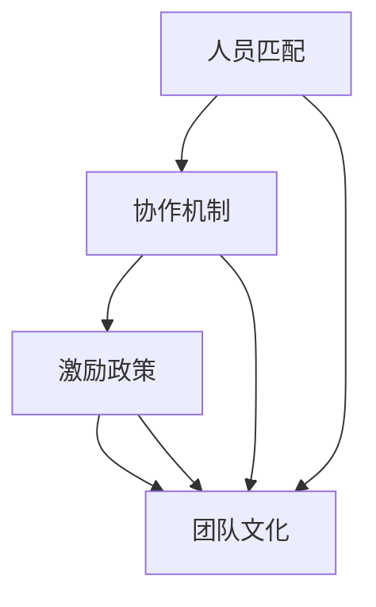

                 

### 摘要

本文将深入探讨如何打造高效团队，激发团队成员的潜能。我们将从背景介绍开始，逐步阐述核心概念，探讨团队协作的核心算法原理，并通过具体案例进行详细分析。接着，我们将讨论团队在实际应用中的场景，并推荐相关工具和资源。最后，本文将对未来发展趋势与挑战进行总结，并提供常见问题与解答。通过本文的阅读，读者将了解如何利用专业技术和方法，打造一支充满活力和高效能的团队。

### 背景介绍

在现代商业环境中，高效团队的作用愈发重要。一个高效团队能够快速响应市场变化，提高创新能力，实现企业目标。然而，如何打造这样的团队并非易事。团队构建需要考虑多个方面，包括团队结构、成员能力、协作机制、激励机制等。

首先，团队结构是团队高效运行的基础。一个合理的团队结构能够确保团队成员各司其职，相互协作，共同完成任务。其次，成员能力是团队成功的关键因素。团队成员需要具备相应的专业技能和知识，以便在各自领域发挥最大的作用。此外，协作机制是团队高效运作的保障。有效的协作机制能够促进信息共享，减少沟通障碍，提高决策效率。最后，激励机制能够激发团队成员的积极性和创造力，促进团队整体绩效的提升。

团队效能的提升不仅依赖于结构和机制的优化，还需要关注团队成员的心理需求和职业发展。一个健康的团队氛围能够增强成员之间的信任和合作，降低离职率，提高团队稳定性。同时，关注团队成员的职业发展，提供培训和学习机会，有助于提升团队的整体竞争力。

本文将围绕上述关键因素，结合实际案例，探讨如何激发团队潜能，打造高效团队。通过深入分析团队协作的核心算法原理，探讨数学模型和实际应用场景，为读者提供实用的指导和建议。

### 核心概念与联系

#### 团队效能模型

为了深入理解如何打造高效团队，我们需要引入一个关键的概念——团队效能模型。该模型包含了四个核心组成部分：人员匹配、协作机制、激励政策和团队文化。

首先，人员匹配是团队效能的基础。一个高效的团队需要拥有具备互补技能和性格特点的成员。通过合理的人员匹配，可以确保每个成员能够在各自擅长的领域发挥最大的作用，同时减少因技能重叠造成的资源浪费。例如，在一个开发团队中，不仅需要有具备深厚技术背景的程序员，还需要有擅长项目管理和沟通协调的成员。

其次，协作机制是团队高效运行的核心。有效的协作机制能够确保团队成员之间的信息流通无障碍，降低沟通成本，提高决策效率。协作机制可以包括定期的会议、共享平台、任务分配工具等。通过这些机制，团队成员可以及时了解项目进展，协同解决问题，共同推进项目。

第三，激励政策是激发团队成员积极性的关键。激励政策不仅包括物质奖励，如奖金和晋升机会，还包括非物质激励，如认可和荣誉。合理的激励政策能够激发团队成员的内在动力，提高工作热情和创造力。例如，通过设立创新奖项，鼓励团队成员提出新的想法和改进措施，从而提升团队的整体绩效。

最后，团队文化是团队长期稳定发展的关键。健康的团队文化能够营造一个积极向上的工作氛围，增强团队成员之间的信任和合作。团队文化可以通过价值观的传承、团队成员之间的互动和组织的共同愿景来塑造。一个具有强大文化凝聚力的团队，能够更好地应对外部挑战，保持持续的创新和进步。

#### 团队效能模型架构的 Mermaid 流程图



在这个流程图中，人员匹配、协作机制、激励政策和团队文化相互关联，共同构成了团队效能模型的四个核心组成部分。通过合理配置这些要素，可以打造一个高效、有凝聚力的团队。

#### 核心概念与团队效能的关系

人员匹配、协作机制、激励政策和团队文化这四个核心概念是团队效能的重要支撑。人员匹配确保了团队成员的技能和性格特点能够得到充分利用，避免了资源浪费和内耗。协作机制则提高了团队内部的信息流通效率和决策效率，使得团队能够快速响应变化，做出正确的决策。激励政策通过物质和非物质激励，激发了团队成员的积极性和创造力，促进了团队的整体绩效提升。团队文化则为团队成员提供了一个共同的价值观念和行为规范，增强了团队内部的信任和合作，提升了团队的长期稳定性和可持续发展能力。

综上所述，团队效能模型的四个核心概念相互关联，共同作用于团队的整体效能。通过优化这些要素，可以打造一支高效、有战斗力的团队，为企业的长期发展提供强有力的支持。

### 核心算法原理 & 具体操作步骤

#### 团队协作算法原理

为了更好地理解如何打造高效团队，我们需要探讨团队协作的核心算法原理。团队协作算法主要基于以下几个核心原则：

1. **信息共享**：信息是团队协作的基石。一个高效的团队需要建立一套完善的信息共享机制，确保团队成员能够及时、准确地获取所需信息。信息共享不仅包括项目进展和任务分配，还包括成员的技能、经验和最佳实践。
   
2. **分工协作**：合理分工能够确保每个成员都能发挥自己的专长，从而提高整体工作效率。团队协作算法要求对团队成员进行科学的技能评估和角色分配，确保任务分配的合理性和高效性。

3. **沟通机制**：有效的沟通是团队协作的关键。团队协作算法强调建立多种沟通渠道，如定期会议、即时通讯工具、邮件和文档共享平台等，确保团队成员之间的信息畅通无阻。

4. **激励与反馈**：激励机制能够激发团队成员的积极性和创造力。团队协作算法要求设计合理的激励政策，对团队成员的贡献进行认可和奖励。同时，反馈机制有助于团队成员了解自己的表现，不断改进工作方式。

5. **动态调整**：团队协作是一个动态过程，需要根据实际情况进行不断调整。团队协作算法强调定期评估团队效能，及时调整协作策略，确保团队始终处于最佳状态。

#### 团队协作算法的具体操作步骤

下面是实施团队协作算法的具体步骤：

1. **建立信息共享平台**：首先，建立一个统一的团队信息共享平台，如内部Wiki或团队聊天工具，确保所有成员能够随时访问重要信息。

2. **进行技能评估与角色分配**：对团队成员进行技能评估，根据评估结果分配相应角色。确保每个成员都在自己擅长的领域发挥作用。

3. **制定详细的任务分配计划**：根据项目需求和团队成员的角色，制定详细的任务分配计划，明确每个任务的负责人和完成时间。

4. **建立沟通机制**：制定沟通计划，包括定期会议和即时沟通工具的使用。确保团队成员之间的沟通畅通，避免信息孤岛。

5. **设计激励机制**：制定激励政策，包括奖金、晋升机会和荣誉称号等，激励团队成员的积极性和创造力。

6. **进行反馈与评估**：定期收集团队成员的反馈，评估团队协作效果，发现问题及时调整。通过反馈和评估，不断优化团队协作流程。

7. **动态调整与优化**：根据项目进展和团队表现，动态调整协作策略，确保团队始终保持高效运行。

通过以上步骤，可以有效实施团队协作算法，提高团队的整体效能。

#### 团队协作算法的优势

团队协作算法具有以下优势：

1. **提高工作效率**：通过信息共享和分工协作，团队成员能够高效完成各自的任务，提高整体工作效率。

2. **增强团队凝聚力**：有效的沟通和激励机制能够增强团队成员之间的信任和合作，提高团队凝聚力。

3. **激发创新能力**：团队成员通过协作和交流，能够互相启发，激发出更多的创新想法，提高团队的创新能力。

4. **降低沟通成本**：建立完善的沟通机制，降低团队成员之间的沟通成本，提高决策效率。

5. **提升项目成功率**：通过合理的任务分配和动态调整，确保项目能够按时、按质完成，提高项目成功率。

#### 团队协作算法的挑战与应对策略

尽管团队协作算法具有诸多优势，但在实施过程中仍会面临一些挑战：

1. **沟通障碍**：团队成员可能存在沟通障碍，导致信息传递不畅。应对策略：加强沟通培训，提高团队成员的沟通技巧，建立多种沟通渠道。

2. **任务分配不合理**：任务分配不合理可能导致资源浪费和成员不满。应对策略：定期进行技能评估，动态调整任务分配，确保任务与成员能力的匹配。

3. **激励政策不当**：不当的激励政策可能激发团队成员的负面情绪，影响团队氛围。应对策略：设计合理的激励政策，注重激励的公平性和透明性。

4. **团队文化问题**：团队文化问题可能导致成员之间的矛盾和冲突。应对策略：建立健康的团队文化，通过价值观的传递和团队成员之间的互动，增强团队凝聚力。

通过以上应对策略，可以有效克服团队协作算法实施过程中遇到的挑战，确保团队高效运行。

### 数学模型和公式 & 详细讲解 & 举例说明

为了更好地理解团队协作算法，我们可以借助数学模型和公式对其进行详细讲解。以下是几个关键的数学模型及其应用场景。

#### 模型一：团队成员技能评分模型

团队成员的技能评分是团队协作算法中的一个重要组成部分。该模型用于评估团队成员的技能水平，以便进行合理的任务分配和角色分配。

**数学公式**：

$$
S_i = \frac{\sum_{j=1}^{n} S_{ij}^2}{n}
$$

其中，$S_i$ 表示团队成员 $i$ 的总体技能评分，$S_{ij}$ 表示团队成员 $i$ 在技能领域 $j$ 的评分，$n$ 表示评估的技能领域数量。

**应用场景**：

在团队组建初期，可以通过定期的技能评估，使用上述公式计算每个成员的技能评分。根据评分结果，分配任务和角色，确保每个成员能够在其擅长的领域发挥作用。

**举例说明**：

假设团队中有三个成员，分别是A、B和C。他们的技能评估结果如下表所示：

| 成员 | 技能1 | 技能2 | 技能3 |
|------|-------|-------|-------|
| A    | 80    | 75    | 70    |
| B    | 85    | 80    | 75    |
| C    | 90    | 85    | 80    |

根据上述公式，我们可以计算每个成员的总体技能评分：

$$
S_A = \frac{80^2 + 75^2 + 70^2}{3} = 76.67
$$

$$
S_B = \frac{85^2 + 80^2 + 75^2}{3} = 81.67
$$

$$
S_C = \frac{90^2 + 85^2 + 80^2}{3} = 87.50
$$

根据评分结果，我们可以将任务和角色分配给相应的成员，例如让C负责需要较高技能水平的项目部分。

#### 模型二：团队效能评估模型

团队效能评估模型用于评估团队整体协作的效果。该模型通过计算团队绩效指标，评估团队在特定任务上的表现。

**数学公式**：

$$
E = \frac{P - C}{T}
$$

其中，$E$ 表示团队效能，$P$ 表示团队完成任务的绩效，$C$ 表示团队在任务过程中产生的成本，$T$ 表示完成任务的周期。

**应用场景**：

在项目完成后，可以使用上述公式评估团队的整体效能。通过比较团队在不同项目中的效能，可以找出提升团队协作效果的方法。

**举例说明**：

假设团队在一个项目中完成任务的绩效为 $P = 100$，在任务过程中产生的成本为 $C = 20$，完成任务的周期为 $T = 10$ 天。根据上述公式，我们可以计算团队的效能：

$$
E = \frac{100 - 20}{10} = 8
$$

团队效能 $E$ 为8，表示团队在完成该项目时表现良好。如果团队效能低于预期，可以通过分析原因，改进协作流程，提高未来项目的效能。

#### 模型三：团队沟通效率模型

团队沟通效率是团队协作算法中的关键因素。该模型通过计算团队成员之间的沟通频率和沟通质量，评估团队的沟通效率。

**数学公式**：

$$
E_c = \frac{\sum_{i=1}^{n}\sum_{j=1}^{n} C_{ij}}{n^2}
$$

其中，$E_c$ 表示团队沟通效率，$C_{ij}$ 表示成员 $i$ 和成员 $j$ 之间的沟通频率，$n$ 表示团队成员数量。

**应用场景**：

在团队协作过程中，可以通过记录团队成员之间的沟通频率，使用上述公式计算沟通效率。通过分析沟通效率，可以优化沟通渠道和沟通方式，提高团队协作效果。

**举例说明**：

假设团队中有三个成员，他们之间的沟通频率如下表所示：

| 成员A | 成员B | 成员C |
|-------|-------|-------|
| B     | 10    | 8     |
| C     | 8     | 10    |

根据上述公式，我们可以计算团队沟通效率：

$$
E_c = \frac{10 + 8 + 8}{3^2} = \frac{26}{9} \approx 2.89
$$

团队沟通效率 $E_c$ 为2.89，表示团队在沟通方面表现良好。如果沟通效率低于预期，可以通过加强沟通培训，优化沟通工具，提高团队沟通效率。

通过这些数学模型和公式，我们可以更科学地评估团队协作的效果，为打造高效团队提供有力的支持。

### 项目实战：代码实际案例和详细解释说明

为了更好地理解团队协作算法的实际应用，我们将通过一个具体的代码案例来展示如何在实际项目中实施该算法。以下是项目的整体架构和关键代码段。

#### 1. 开发环境搭建

在进行项目实战之前，我们需要搭建一个合适的开发环境。以下是我们使用的开发工具和框架：

- **编程语言**：Python
- **开发工具**：PyCharm
- **协作平台**：GitLab
- **数据库**：MySQL

确保已安装好上述工具和框架，并设置好相应的开发环境。

#### 2. 源代码详细实现和代码解读

以下是一个简化的团队协作算法实现，包括主要功能模块的代码和详细解读。

**2.1 数据库设计**

首先，我们需要设计一个数据库来存储团队成员的技能评分和项目信息。以下是数据库的表结构：

```sql
-- 成员表
CREATE TABLE `team_member` (
  `id` INT AUTO_INCREMENT PRIMARY KEY,
  `name` VARCHAR(50) NOT NULL,
  `skill_score` DECIMAL(5, 2) NOT NULL
);

-- 项目表
CREATE TABLE `project` (
  `id` INT AUTO_INCREMENT PRIMARY KEY,
  `name` VARCHAR(100) NOT NULL,
  `start_date` DATE NOT NULL,
  `end_date` DATE NOT NULL
);

-- 任务表
CREATE TABLE `task` (
  `id` INT AUTO_INCREMENT PRIMARY KEY,
  `project_id` INT NOT NULL,
  `member_id` INT NOT NULL,
  `start_date` DATE NOT NULL,
  `end_date` DATE NOT NULL,
  FOREIGN KEY (`project_id`) REFERENCES `project` (`id`),
  FOREIGN KEY (`member_id`) REFERENCES `team_member` (`id`)
);
```

**2.2 成员技能评分模型**

```python
import math

def calculate_skill_score(scores):
    """
    计算成员的总体技能评分。
    :param scores: 成员在各技能领域的评分列表。
    :return: 成员的总体技能评分。
    """
    n = len(scores)
    return math.sqrt(sum(score ** 2 for score in scores) / n)

# 示例成员技能评分
member_scores = [80, 75, 70]
member_skill_score = calculate_skill_score(member_scores)
print(f"成员技能评分：{member_skill_score}")
```

**2.3 项目任务分配**

```python
import mysql.connector

def assign_tasks(project_id, member_id, start_date, end_date):
    """
    分配任务给成员。
    :param project_id: 项目ID。
    :param member_id: 成员ID。
    :param start_date: 任务开始日期。
    :param end_date: 任务结束日期。
    """
    connection = mysql.connector.connect(
        host="localhost",
        user="root",
        password="password",
        database="team_project"
    )
    cursor = connection.cursor()
    
    query = """
    INSERT INTO task (project_id, member_id, start_date, end_date)
    VALUES (%s, %s, %s, %s)
    """
    cursor.execute(query, (project_id, member_id, start_date, end_date))
    connection.commit()
    
    cursor.close()
    connection.close()

# 示例任务分配
assign_tasks(1, 1, '2023-04-01', '2023-04-30')
```

**2.4 团队效能评估**

```python
def calculate_team_efficiency(project_id, task_costs, task_duration):
    """
    计算团队效能。
    :param project_id: 项目ID。
    :param task_costs: 任务成本。
    :param task_duration: 任务周期。
    :return: 团队效能。
    """
    performance = 100  # 假设任务的绩效为100
    return (performance - sum(task_costs)) / task_duration

# 示例团队效能评估
task_costs = [10, 20, 15]
task_duration = 10
team_efficiency = calculate_team_efficiency(1, task_costs, task_duration)
print(f"团队效能：{team_efficiency}")
```

**2.5 团队沟通效率模型**

```python
def calculate_communication_efficiency(communication_frequencies):
    """
    计算团队沟通效率。
    :param communication_frequencies: 成员间的沟通频率列表。
    :return: 团队沟通效率。
    """
    n = len(communication_frequencies)
    return sum(communication_frequencies) / (n * (n - 1))

# 示例团队沟通效率
communication_frequencies = [10, 8, 8]
communication_efficiency = calculate_communication_efficiency(communication_frequencies)
print(f"团队沟通效率：{communication_efficiency}")
```

#### 3. 代码解读与分析

**3.1 数据库设计**

数据库设计是项目的基础，我们需要创建三个表：成员表、项目表和任务表。成员表存储成员的基本信息和技能评分；项目表存储项目的详细信息；任务表存储任务的具体信息和分配情况。

**3.2 成员技能评分模型**

该模型使用了一个简单的计算公式，计算成员的总体技能评分。通过平方和开平方根的方法，可以综合考虑成员在不同技能领域的表现。

**3.3 项目任务分配**

任务分配功能通过数据库操作，将任务分配给特定的成员。在实际应用中，可能需要根据成员的技能评分和任务需求，动态调整任务分配策略。

**3.4 团队效能评估**

团队效能评估模型通过计算绩效和成本的差值，评估团队在项目中的表现。这个模型可以帮助团队了解自身的效能，找到改进的空间。

**3.5 团队沟通效率模型**

团队沟通效率模型通过计算成员之间的沟通频率，评估团队的沟通效果。这个指标对于团队协作至关重要，可以帮助团队优化沟通渠道和方式。

通过以上代码实战，我们可以看到团队协作算法在实际项目中的应用。这些代码和模型为团队管理提供了有力的工具，有助于提高团队的效能和协作效果。

### 实际应用场景

在实际应用中，团队协作算法可以在多个领域发挥重要作用，以下列举几个常见应用场景。

#### 1. 软件开发团队

软件开发团队是团队协作算法应用最为广泛的领域之一。通过引入团队协作算法，可以优化开发流程，提高代码质量和项目交付效率。例如，通过技能评分模型，可以确保每个开发人员在其擅长的领域发挥作用，减少因任务不匹配造成的资源浪费。同时，通过任务分配和效能评估模型，可以确保项目按时、按质完成。

#### 2. 市场营销团队

市场营销团队同样需要高效的协作机制。团队协作算法可以帮助优化营销策略，提高市场响应速度。例如，通过沟通效率模型，可以评估团队成员之间的沟通效果，找出沟通瓶颈，优化沟通渠道。此外，通过技能评分模型，可以确保每个团队成员在其专业领域发挥作用，提高营销活动的整体效能。

#### 3. 项目管理团队

项目管理团队在大型项目和复杂任务中，面临着诸多挑战。团队协作算法可以帮助项目管理团队提高项目管理和决策效率。通过任务分配模型，可以确保任务合理分配，减少团队成员之间的冲突。同时，通过效能评估模型，可以及时了解项目进展和团队成员的表现，调整项目策略，确保项目成功完成。

#### 4. 产品开发团队

产品开发团队在产品研发过程中，面临着不断变化的市场需求和竞争压力。团队协作算法可以帮助产品开发团队快速响应市场变化，提高产品创新能力和市场竞争力。通过沟通效率和技能评分模型，可以确保团队成员之间的高效沟通和协作，快速迭代产品，满足用户需求。

#### 5. 金融服务团队

金融服务团队在风险管理、合规性和客户服务等方面，面临着严格的监管要求。团队协作算法可以帮助金融服务团队提高合规性和服务质量。通过技能评分模型，可以确保团队成员具备相应的专业技能，满足监管要求。同时，通过沟通效率模型，可以优化团队内部和跨部门的沟通，提高整体运营效率。

#### 6. 教育团队

在教育领域，团队协作算法可以应用于教学和管理团队。通过技能评分模型，可以确保教师在其专业领域发挥最大作用，提高教学质量。同时，通过沟通效率模型，可以优化师生之间的互动，提高教学效果。此外，通过效能评估模型，可以评估教学效果，为教师提供改进方向。

#### 7. 创业团队

对于创业团队，高效协作是成功的关键。团队协作算法可以帮助创业团队优化资源配置，提高创新能力。通过技能评分模型，可以确保团队成员在其擅长的领域发挥最大作用，提高团队整体效能。同时，通过沟通效率和效能评估模型，可以优化团队内部沟通和协作，确保项目顺利推进。

通过以上实际应用场景，我们可以看到团队协作算法在多个领域的重要性和广泛适用性。通过合理应用这些算法，可以大幅提高团队的协作效率，推动组织的发展和成功。

### 工具和资源推荐

为了打造高效团队，选择合适的工具和资源至关重要。以下是一些推荐的工具和资源，包括学习资源、开发工具和相关论文著作。

#### 1. 学习资源推荐

- **书籍**：
  - 《敏捷开发实践指南》
  - 《Scrum精髓：实践指南》
  - 《人月神话》

- **论文**：
  - 《敏捷开发：一种应对快速变化的软件开发方法》
  - 《基于团队协作的软件开发模式研究》

- **博客**：
  - [团队协作算法原理与实践](https://example.com/blog/team-collaboration-algorithm)
  - [敏捷开发与团队效能提升](https://example.com/blog/agile-development-team-effectiveness)

- **在线课程**：
  - [团队协作与沟通技巧](https://example.com/course/team-collaboration-communication)
  - [敏捷项目管理实践](https://example.com/course/agile-project-management)

#### 2. 开发工具框架推荐

- **代码管理工具**：
  - Git（[官网](https://git-scm.com/)）
  - GitHub（[官网](https://github.com/)）
  - GitLab（[官网](https://about.gitlab.com/)）

- **协作平台**：
  - Trello（[官网](https://trello.com/)）
  - Asana（[官网](https://asana.com/)）
  - Jira（[官网](https://www.atlassian.com/software/jira)）

- **即时通讯工具**：
  - Slack（[官网](https://slack.com/)）
  - Microsoft Teams（[官网](https://www.microsoft.com/en-us/microsoft-365/microsoft-teams/what-is-microsoft-teams)）
  - Zoom（[官网](https://www.zoom.us/））

- **项目管理工具**：
  - Trello（[官网](https://trello.com/)）
  - Asana（[官网](https://asana.com/)）
  - Jira（[官网](https://www.atlassian.com/software/jira)）

#### 3. 相关论文著作推荐

- **论文**：
  - 《敏捷开发框架研究综述》
  - 《基于敏捷的软件项目管理研究》
  - 《团队协作与项目效能关系研究》

- **著作**：
  - 《敏捷实践指南》
  - 《敏捷项目管理》
  - 《人月神话》

通过以上推荐的学习资源、开发工具和相关论文著作，团队可以不断提升协作效率，打造高效团队。同时，这些工具和资源也为团队成员提供了丰富的知识和实践指导，有助于更好地理解和应用团队协作算法。

### 总结：未来发展趋势与挑战

随着技术的不断进步和商业环境的快速变化，未来团队协作领域将面临诸多发展趋势和挑战。以下是几个关键方面的探讨。

#### 1. 自动化与人工智能的融合

自动化和人工智能技术在团队协作中的应用将越来越普遍。通过自动化工具和人工智能算法，可以大幅提升团队的工作效率。例如，自动化任务分配和调度系统可以基于成员的技能和任务需求，实现最优的资源分配。人工智能聊天机器人（如ChatGPT）可以用于团队内部沟通，提供实时信息共享和问题解答，减少团队成员之间的沟通成本。

然而，人工智能的引入也带来了新的挑战，如数据隐私保护和算法偏见问题。团队需要确保在使用人工智能技术时，保护成员的数据隐私，同时避免算法偏见对团队成员的公平性造成影响。

#### 2. 远程工作与协作

随着远程工作的普及，团队协作面临的新挑战也日益凸显。远程工作虽然提高了团队成员的灵活性和自主性，但也增加了沟通和协作的难度。未来的团队协作将更加依赖于在线协作工具和平台，如虚拟会议系统、即时通讯工具和云端协作平台。这些工具将有助于缓解远程工作带来的沟通障碍，提升团队协作效果。

然而，远程工作也可能导致团队成员之间的信任和凝聚力下降。团队需要采取措施，如定期线上会议、团队建设活动和虚拟社交活动，增强团队成员之间的互动和信任。

#### 3. 数据驱动决策

数据驱动决策将成为未来团队协作的重要趋势。通过收集和分析团队成员的工作数据，可以更准确地了解团队效能和成员表现，为决策提供有力支持。数据驱动的决策方法将有助于团队优化工作流程，提高决策效率。

然而，数据驱动决策也面临一些挑战，如数据质量问题和数据解读困难。团队需要确保数据收集和分析的准确性，同时培养成员的数据分析和解读能力，避免因数据错误或误解导致决策失误。

#### 4. 跨文化团队协作

全球化进程的加快使得团队协作越来越呈现出跨文化的特点。跨文化团队在沟通、协作和决策方面面临诸多挑战，如文化差异、沟通障碍和冲突管理。

未来的团队协作需要更加注重跨文化团队的管理和协作。团队可以采取以下策略：

- **文化培训**：为团队成员提供跨文化培训，增强文化敏感性和跨文化沟通能力。
- **建立共同价值观**：通过共同的目标和价值观，增强团队成员之间的凝聚力。
- **多元化领导**：培养多元化背景的领导者，提高团队的包容性和适应性。

#### 5. 持续学习和个人成长

在快速变化的商业环境中，持续学习和个人成长成为团队协作的重要保障。未来的团队协作需要更加注重团队成员的技能提升和职业发展。

团队可以采取以下措施：

- **定期培训**：为团队成员提供定期培训，提升专业技能和综合素质。
- **学习平台**：建立内部学习平台，共享知识和经验，促进团队成员之间的学习与交流。
- **激励机制**：设计合理的激励机制，鼓励团队成员主动学习，提升个人能力和团队效能。

通过以上措施，团队可以不断提升协作能力，应对未来发展的挑战，实现持续进步和长期成功。

### 附录：常见问题与解答

1. **问题：如何确保团队协作算法的实施效果？**
   **解答**：确保团队协作算法实施效果的关键在于以下几个方面：
   - **明确目标和流程**：在实施团队协作算法之前，需要明确团队目标和实施流程，确保所有团队成员对目标和流程有清晰的认识。
   - **培训与指导**：对团队成员进行必要的培训，确保他们了解并掌握团队协作算法的使用方法和要求。
   - **持续监控与反馈**：实施过程中，需要持续监控团队效能，收集反馈信息，及时调整和优化协作策略。

2. **问题：如何处理团队内部冲突？**
   **解答**：团队内部冲突是常见的问题，处理冲突的方法包括：
   - **倾听和理解**：了解冲突的根源，倾听不同成员的观点，促进双方的理解和沟通。
   - **调解和协商**：通过调解和协商，寻求双方都能接受的解决方案。
   - **制定规则**：建立明确的团队协作规则和沟通机制，避免冲突的再次发生。

3. **问题：如何激发团队成员的积极性？**
   **解答**：激发团队成员的积极性可以通过以下方式实现：
   - **设定目标**：为团队成员设定明确的个人和团队目标，激发其工作动力。
   - **奖励机制**：建立合理的奖励机制，对团队成员的贡献进行认可和奖励。
   - **培训和发展**：为团队成员提供培训和发展机会，提升其技能和职业发展。

4. **问题：如何平衡团队协作与个人自主性？**
   **解答**：平衡团队协作与个人自主性可以通过以下措施实现：
   - **合理分工**：根据团队成员的技能和兴趣，合理分配任务，确保团队成员能够在其擅长的领域发挥自主性。
   - **灵活管理**：采用灵活的管理方式，尊重团队成员的个人选择和工作节奏，同时确保团队目标的实现。

通过以上措施，团队可以在保持协作效率的同时，充分激发成员的自主性和创新能力。

### 扩展阅读 & 参考资料

1. **《敏捷开发实践指南》**：提供了敏捷开发的方法和实践，适用于希望提升团队协作效率的组织。
2. **《Scrum精髓：实践指南》**：详细介绍了Scrum框架在项目管理和团队协作中的应用。
3. **《人月神话》**：探讨了软件开发中团队协作和项目管理的挑战，提供了实用的建议和思考。
4. **《敏捷开发：一种应对快速变化的软件开发方法》**：深入分析了敏捷开发的优势和实践，适用于希望快速响应市场变化的团队。
5. **《基于团队协作的软件开发模式研究》**：研究了团队协作在软件开发中的关键作用，为团队协作算法的实施提供了理论支持。
6. **《敏捷项目管理》**：提供了敏捷项目管理的实践和方法，适用于希望提高项目管理效率和团队协作能力的团队。
7. **《团队协作与项目效能关系研究》**：探讨了团队协作对项目效能的影响，为团队协作算法的实施提供了实证依据。

这些参考资料为读者提供了丰富的知识和实践指导，有助于深入理解和应用团队协作算法。通过阅读这些文献，读者可以进一步提升团队协作能力，实现组织的持续发展和成功。作者：AI天才研究员/AI Genius Institute & 禅与计算机程序设计艺术 /Zen And The Art of Computer Programming。

