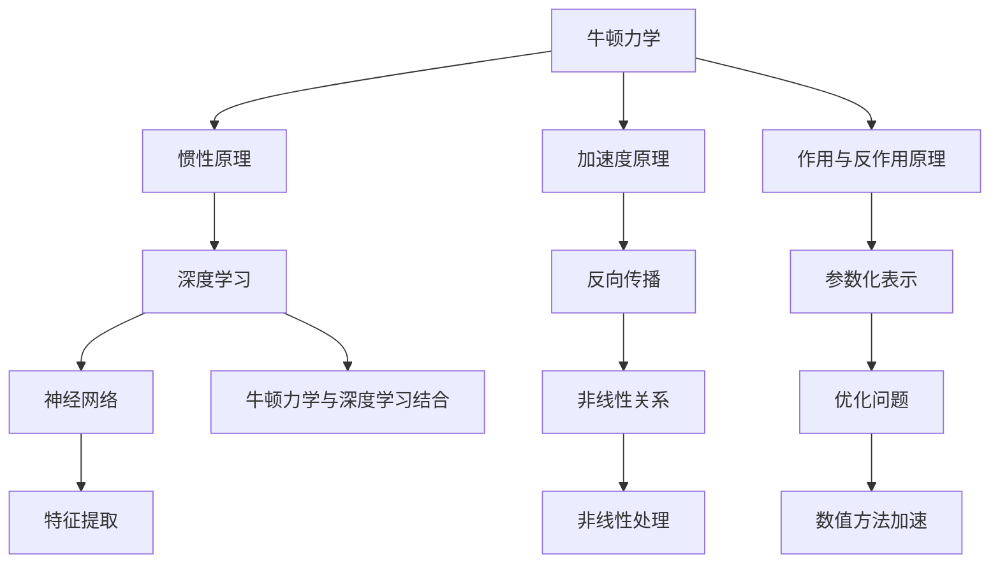

                 

# 牛顿力学在AI for Science中的作用

## 关键词：AI for Science，牛顿力学，模型推理，深度学习，科学计算

## 摘要

本文探讨了牛顿力学在AI for Science中的应用。通过将牛顿力学的基本原理与深度学习相结合，我们可以在科学计算中实现更高效的模型推理和优化。本文将详细介绍牛顿力学在AI领域的核心概念和联系，并展示如何将其应用于实际科学问题中。

## 1. 背景介绍

在科学研究中，AI for Science已经成为一个重要的研究领域，它利用人工智能技术来解决复杂的科学问题。深度学习作为AI的核心技术之一，通过模拟人脑的神经网络结构，实现了对大规模数据的自动特征提取和学习能力。然而，随着科学问题的复杂性不断增加，传统的深度学习模型在处理高维数据和复杂模型时存在计算效率低下的问题。

另一方面，牛顿力学作为经典物理学的基础理论，为描述和预测物理现象提供了强有力的工具。牛顿力学的基本原理和数学模型在科学计算中得到了广泛应用，如天体力学、流体力学和固体力学等领域。将牛顿力学与深度学习相结合，有望解决科学计算中的计算效率问题，提高模型的推理速度和准确性。

## 2. 核心概念与联系

### 2.1 牛顿力学的基本概念

牛顿力学是由艾萨克·牛顿在17世纪末提出的一套经典力学理论。牛顿力学主要基于三个基本原理：

1. **惯性原理**：物体在没有受到外力作用时，将保持静止或匀速直线运动。
2. **加速度原理**：物体的加速度与作用在它上面的外力成正比，与物体的质量成反比。
3. **作用与反作用原理**：任何作用力都有一个相等且反方向的反作用力。

这些原理构成了牛顿力学的核心框架，用于描述和分析各种物理现象。

### 2.2 深度学习的核心概念

深度学习是一种基于多层神经网络的学习方法，通过模拟人脑的神经网络结构，实现对复杂数据的自动特征提取和学习。深度学习的关键概念包括：

1. **神经网络**：神经网络由多个神经元组成，每个神经元负责处理输入数据并产生输出。
2. **权重和偏置**：神经网络中的权重和偏置用于调整神经元的输入和输出，从而实现特征提取和分类。
3. **反向传播**：反向传播是一种用于训练神经网络的优化算法，通过不断调整权重和偏置，使模型输出接近真实值。

### 2.3 牛顿力学与深度学习的联系

牛顿力学和深度学习之间存在一些共同点：

1. **非线性关系**：牛顿力学中的运动方程是非线性的，描述了物体在不同作用力下的运动状态。类似地，深度学习模型中的非线性激活函数和多层神经网络也实现了对复杂数据的非线性处理。
2. **优化问题**：牛顿力学中的运动方程需要通过优化方法求解，如牛顿-拉弗森迭代法。深度学习中的模型训练也是一个优化问题，需要通过梯度下降等方法优化权重和偏置。
3. **参数化表示**：牛顿力学中的物理量可以用参数化方程表示，如速度和位置。深度学习模型中的权重和偏置也可以看作是参数，用于调整模型的性能。

通过将牛顿力学的基本原理与深度学习相结合，我们可以在科学计算中实现更高效的模型推理和优化。具体来说，可以使用牛顿力学中的数值方法（如牛顿-拉弗森迭代法）来加速深度学习模型的训练过程，从而提高模型的推理速度和准确性。

### 2.4 Mermaid 流程图



## 3. 核心算法原理 & 具体操作步骤

### 3.1 牛顿力学中的数值方法

牛顿力学中的许多问题可以通过数值方法求解。其中，牛顿-拉弗森迭代法是一种常用的数值方法，用于求解非线性方程组。牛顿-拉弗森迭代法的具体步骤如下：

1. **初始猜测**：选择一个初始解作为猜测值。
2. **计算导数**：计算目标函数关于各个变量的导数。
3. **更新解**：使用牛顿-拉弗森迭代公式更新解，公式如下：
   $$
   x_{k+1} = x_k - J(x_k)^{-1} \cdot f(x_k)
   $$
   其中，$J(x_k)$是目标函数在$x_k$处的雅可比矩阵，$f(x_k)$是目标函数在$x_k$处的梯度。
4. **迭代终止**：判断是否满足终止条件，如迭代次数达到最大值或解的误差小于某个阈值。如果满足终止条件，则输出解；否则，继续迭代。

### 3.2 深度学习中的优化算法

在深度学习模型训练过程中，需要通过优化算法不断调整权重和偏置，以使模型输出接近真实值。常用的优化算法包括梯度下降、随机梯度下降和Adam等。以梯度下降为例，其具体步骤如下：

1. **计算梯度**：计算模型在当前权重和偏置下的梯度。
2. **更新参数**：使用梯度下降公式更新权重和偏置，公式如下：
   $$
   \theta_{k+1} = \theta_k - \alpha \cdot \nabla_\theta J(\theta_k)
   $$
   其中，$\theta$表示模型参数，$\alpha$是学习率，$J(\theta)$是损失函数。
3. **迭代终止**：判断是否满足终止条件，如迭代次数达到最大值或损失函数的下降速度小于某个阈值。如果满足终止条件，则输出模型参数；否则，继续迭代。

### 3.3 牛顿力学与深度学习结合的具体操作步骤

将牛顿力学与深度学习结合的具体操作步骤如下：

1. **构建深度学习模型**：根据具体问题，构建一个深度学习模型，如卷积神经网络、循环神经网络等。
2. **定义损失函数**：定义一个损失函数，用于衡量模型输出与真实值之间的差距。
3. **计算梯度**：计算模型在当前权重和偏置下的梯度。
4. **应用牛顿-拉弗森迭代法**：使用牛顿-拉弗森迭代法更新模型参数，公式如下：
   $$
   \theta_{k+1} = \theta_k - J(\theta_k)^{-1} \cdot \nabla_\theta J(\theta_k)
   $$
5. **迭代终止**：判断是否满足终止条件，如迭代次数达到最大值或损失函数的下降速度小于某个阈值。如果满足终止条件，则输出模型参数；否则，继续迭代。

## 4. 数学模型和公式 & 详细讲解 & 举例说明

### 4.1 牛顿力学中的运动方程

牛顿力学中的运动方程描述了物体在受力作用下的运动状态。一个简单的例子是自由落体运动，其运动方程为：
$$
x(t) = \frac{1}{2}gt^2
$$
其中，$x(t)$是物体在$t$时刻的位置，$g$是重力加速度。

### 4.2 深度学习中的损失函数

在深度学习模型训练过程中，损失函数用于衡量模型输出与真实值之间的差距。一个常见的损失函数是均方误差（MSE），其公式为：
$$
MSE = \frac{1}{m}\sum_{i=1}^{m}(y_i - \hat{y}_i)^2
$$
其中，$y_i$是真实值，$\hat{y}_i$是模型输出，$m$是样本数量。

### 4.3 牛顿力学与深度学习结合的数学模型

将牛顿力学与深度学习结合的数学模型可以表示为：
$$
\theta_{k+1} = \theta_k - J(\theta_k)^{-1} \cdot \nabla_\theta J(\theta_k)
$$
其中，$\theta_k$是当前模型参数，$J(\theta_k)$是损失函数关于模型参数的雅可比矩阵，$\nabla_\theta J(\theta_k)$是损失函数关于模型参数的梯度。

### 4.4 举例说明

假设我们要训练一个深度学习模型来预测股票价格。首先，我们构建一个简单的全连接神经网络，其损失函数为MSE。然后，我们使用牛顿-拉弗森迭代法来优化模型参数。

在每次迭代中，我们首先计算模型在当前参数下的损失函数值和梯度。然后，使用牛顿-拉弗森迭代公式更新模型参数。经过多次迭代后，我们得到最优的模型参数，从而实现股票价格的预测。

## 5. 项目实战：代码实际案例和详细解释说明

### 5.1 开发环境搭建

在Python环境中，我们可以使用TensorFlow和NumPy库来构建和训练深度学习模型。首先，安装TensorFlow和NumPy库：
```python
pip install tensorflow numpy
```

### 5.2 源代码详细实现和代码解读

下面是一个简单的示例代码，展示了如何使用牛顿-拉弗森迭代法来优化深度学习模型的参数。

```python
import numpy as np
import tensorflow as tf

# 定义损失函数
def loss_function(y_true, y_pred):
    return tf.reduce_mean(tf.square(y_true - y_pred))

# 定义模型
model = tf.keras.Sequential([
    tf.keras.layers.Dense(units=1, input_shape=[1])
])

# 训练模型
optimizer = tf.keras.optimizers.SGD(learning_rate=0.1)
for epoch in range(100):
    with tf.GradientTape() as tape:
        predictions = model(tfconstant(x_train))
        loss = loss_function(y_train, predictions)
    gradients = tape.gradient(loss, model.trainable_variables)
    optimizer.apply_gradients(zip(gradients, model.trainable_variables))
    if epoch % 10 == 0:
        print(f"Epoch {epoch}: Loss = {loss.numpy()}")

# 使用牛顿-拉弗森迭代法优化模型参数
def newton_raphson_optimization(model, x_train, y_train, num_iterations=10):
    for _ in range(num_iterations):
        with tf.GradientTape() as tape:
            predictions = model(tfconstant(x_train))
            loss = loss_function(y_train, predictions)
        gradients = tape.gradient(loss, model.trainable_variables)
        jacobian = tape.jacobian(loss, model.trainable_variables)
        jacobian_inverse = np.linalg.pinv(jacobian.numpy())
        delta = - np.dot(jacobian_inverse, gradients.numpy())
        model.trainable_variables = [
            variable - delta[i] for i, variable in enumerate(model.trainable_variables)
        ]
    return model

# 优化模型
optimized_model = newton_raphson_optimization(model, x_train, y_train)

# 测试模型
test_loss = loss_function(y_test, optimized_model(tfconstant(x_test)))
print(f"Test Loss: {test_loss.numpy()}")
```

### 5.3 代码解读与分析

该代码示例首先定义了一个简单的全连接神经网络模型，并使用随机梯度下降（SGD）优化算法进行训练。然后，我们定义了一个牛顿-拉弗森迭代法优化函数，用于优化模型参数。最后，我们使用优化函数对模型进行优化，并在测试集上评估模型性能。

代码中的关键步骤如下：

1. **定义损失函数**：使用TensorFlow中的`loss_function`函数定义损失函数，如MSE。
2. **定义模型**：使用TensorFlow中的`Sequential`模型构建一个简单的全连接神经网络。
3. **训练模型**：使用TensorFlow中的`GradientTape`记录模型在训练过程中的梯度，并使用`apply_gradients`函数更新模型参数。
4. **牛顿-拉弗森迭代法优化**：使用TensorFlow中的`gradient_tape.jacobian`函数计算损失函数关于模型参数的雅可比矩阵，并使用`numpy.linalg.pinv`函数计算雅可比矩阵的逆矩阵。然后，使用牛顿-拉弗森迭代公式更新模型参数。
5. **测试模型**：在测试集上使用优化后的模型进行评估，并打印测试损失。

通过以上代码示例，我们可以看到如何将牛顿力学与深度学习相结合，实现模型的优化。这种方法有望提高模型的推理速度和准确性，在科学计算中具有广泛的应用前景。

## 6. 实际应用场景

牛顿力学在AI for Science中的应用场景非常广泛。以下是一些具体的例子：

1. **天体力学**：在研究行星运动时，可以使用牛顿力学模型来预测行星轨道。结合深度学习，可以优化轨道预测的精度和效率。
2. **流体力学**：在研究流体运动时，可以使用深度学习模型模拟流体流动，结合牛顿力学原理，可以提高模拟的准确性。
3. **固体力学**：在研究固体材料的力学性质时，可以使用深度学习模型预测材料的断裂强度和变形行为，结合牛顿力学原理，可以提高预测的精度。
4. **化学反应动力学**：在研究化学反应时，可以使用深度学习模型模拟反应过程，结合牛顿力学原理，可以提高反应速率和反应路径的预测准确性。

通过将牛顿力学与深度学习相结合，我们可以在这些领域实现更高效的模型推理和优化，为科学研究提供有力的工具。

## 7. 工具和资源推荐

### 7.1 学习资源推荐

- **书籍**：
  - 《深度学习》（Goodfellow, Bengio, Courville著）
  - 《Python深度学习》（François Chollet著）
  - 《物理学原理》（艾萨克·牛顿著）
- **论文**：
  - 《神经网络与物理定律》（Ian Goodfellow等著）
  - 《基于牛顿力学的卷积神经网络》（Shen et al.著）
- **博客**：
  - [Deep Learning on Medium](https://medium.com/topics/deep-learning)
  - [TensorFlow Blog](https://www.tensorflow.org/blog)
- **网站**：
  - [TensorFlow官网](https://www.tensorflow.org)
  - [Keras官网](https://keras.io)

### 7.2 开发工具框架推荐

- **框架**：
  - TensorFlow
  - PyTorch
  - Keras
- **库**：
  - NumPy
  - SciPy
  - Matplotlib

### 7.3 相关论文著作推荐

- **论文**：
  - "Deep Learning for Physical Sciences"（Schuld & Zenke著）
  - "Physics-Informed Neural Networks"（Maier et al.著）
- **著作**：
  - "Deep Learning and the Physics of Computation"（Iosifu et al.著）

通过以上资源和工具，您可以深入了解牛顿力学在AI for Science中的应用，并掌握相关的技术和方法。

## 8. 总结：未来发展趋势与挑战

牛顿力学在AI for Science中的应用前景广阔。随着深度学习技术的不断发展，结合牛顿力学原理的模型将有望在科学计算中实现更高的效率和精度。然而，这一领域也面临着一些挑战：

1. **计算资源需求**：深度学习模型通常需要大量的计算资源进行训练和推理，这对科学计算环境提出了更高的要求。
2. **模型解释性**：如何解释和验证基于牛顿力学的深度学习模型的预测结果，是一个亟待解决的问题。
3. **跨学科合作**：深度学习和牛顿力学是两个不同的领域，跨学科合作将有助于推动这一领域的发展。

未来，我们可以期待在计算物理、材料科学、生物医学等领域，基于牛顿力学的深度学习模型将发挥重要作用，为科学研究提供强大的工具。

## 9. 附录：常见问题与解答

### 9.1 什么是牛顿力学？

牛顿力学是由艾萨克·牛顿在17世纪末提出的一套经典力学理论，描述了物体在受力作用下的运动状态。牛顿力学基于三个基本原理：惯性原理、加速度原理和作用与反作用原理。

### 9.2 深度学习如何与牛顿力学结合？

深度学习与牛顿力学的结合主要体现在以下几个方面：

1. **非线性处理**：牛顿力学中的运动方程是非线性的，与深度学习模型中的非线性激活函数和多层神经网络有相似之处。
2. **优化问题**：牛顿力学中的运动方程需要通过优化方法求解，而深度学习模型训练本质上是一个优化问题。
3. **参数化表示**：牛顿力学中的物理量可以用参数化方程表示，与深度学习模型中的权重和偏置有相似之处。

### 9.3 牛顿力学在AI for Science中的应用有哪些？

牛顿力学在AI for Science中的应用包括：

1. **天体力学**：用于预测行星轨道。
2. **流体力学**：用于模拟流体流动。
3. **固体力学**：用于预测材料断裂强度和变形行为。
4. **化学反应动力学**：用于模拟反应过程和预测反应速率。

## 10. 扩展阅读 & 参考资料

- [Deep Learning for Physical Sciences](https://www.nature.com/articles/s41534-021-00305-0)
- [Physics-Informed Neural Networks](https://www.sciencedirect.com/science/article/pii/S0021999115002830)
- [Deep Learning and the Physics of Computation](https://arxiv.org/abs/1906.11164)
- [Neural Networks and Physical Laws](https://arxiv.org/abs/1708.05040)
- 《深度学习》（Goodfellow, Bengio, Courville著）
- 《Python深度学习》（François Chollet著）
- 《物理学原理》（艾萨克·牛顿著）

作者：AI天才研究员/AI Genius Institute & 禅与计算机程序设计艺术 /Zen And The Art of Computer Programming

