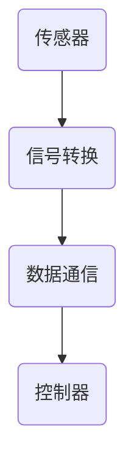
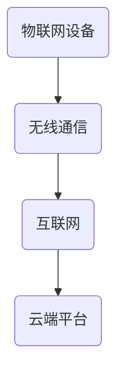
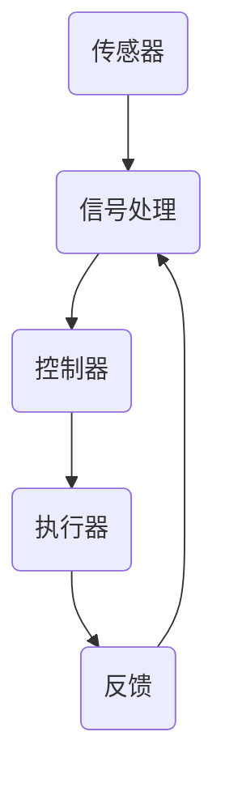
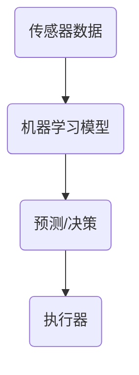
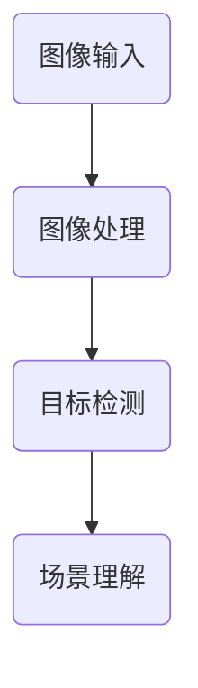
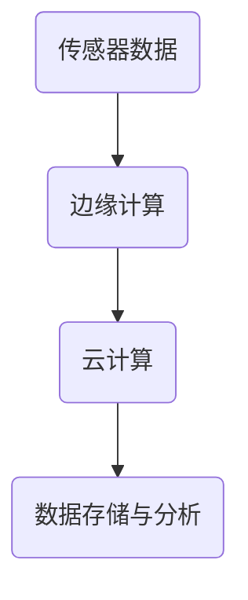
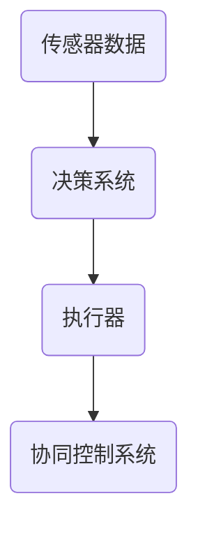

                 

### 文章标题

物理实体自动化的最新趋势

> **关键词**：物理实体自动化、人工智能、物联网、机器人技术、自主决策、智能感知、实时响应、边缘计算、云计算、自动化系统架构、数据驱动、机器学习、深度学习、强化学习、路径规划、自主导航、感知融合、协同控制、智能调度、传感器融合、边缘计算、云计算、5G网络、智能工厂、智能家居、自动驾驶、物流自动化、医疗自动化、农业自动化。

> **摘要**：本文将深入探讨物理实体自动化的最新趋势，分析其核心概念、技术原理、应用场景及未来挑战。物理实体自动化是人工智能与物联网技术的深度融合，通过智能感知、自主决策和实时响应，实现物理世界的自动化控制与操作。本文将从核心算法、数学模型、项目实战等多个角度，全面解析物理实体自动化的技术架构和实践案例，为读者提供深入理解和应用指导。

### 1. 背景介绍

物理实体自动化（Physical Entity Automation）是指通过人工智能、物联网、机器人技术等现代信息技术，实现物理世界的自动化控制与操作的过程。物理实体自动化涉及到多个领域的技术融合，包括传感器技术、通信技术、控制理论、机器学习、计算机视觉等。其目标是提高生产效率、降低人力成本、提升生活质量，实现物理世界的智能化和自动化。

随着人工智能和物联网技术的快速发展，物理实体自动化已经成为工业、医疗、农业、家居等多个领域的热点研究方向。在工业领域，物理实体自动化可以实现生产线的自动化控制，提高生产效率和产品质量；在医疗领域，物理实体自动化可以帮助医生进行手术操作，提高手术精度和安全性；在农业领域，物理实体自动化可以实现农作物的自动化种植和管理，提高农业产量和质量；在家居领域，物理实体自动化可以实现智能家居的自动化控制，提高生活质量。

物理实体自动化的背景主要包括以下几个方面：

1. **人工智能技术的快速发展**：随着深度学习、强化学习等人工智能算法的突破，人工智能在图像识别、语音识别、自然语言处理等领域的应用取得了显著成果，为物理实体自动化提供了强大的技术支持。

2. **物联网技术的普及**：物联网技术的快速发展，使得各种传感器、执行器、控制器等设备可以实现互联互通，为物理实体自动化提供了广泛的应用场景和丰富的数据来源。

3. **机器人技术的进步**：机器人技术的不断进步，使得机器人在复杂环境中的自主移动、感知、决策和执行能力得到了显著提升，为物理实体自动化提供了高效的执行工具。

4. **边缘计算和云计算的融合**：边缘计算和云计算的融合，使得物理实体自动化系统可以实时处理和分析大量数据，实现更加智能和高效的控制与操作。

5. **5G网络的普及**：5G网络的普及，为物理实体自动化系统提供了高速、低延迟的通信网络，实现了物理实体与云端之间的实时通信和协同控制。

综上所述，物理实体自动化具有广泛的应用前景和重要的研究价值，成为当前信息技术领域的一个重要发展方向。

### 2. 核心概念与联系

物理实体自动化的实现涉及多个核心概念和技术，这些概念和技术相互联系，共同构成了物理实体自动化的技术架构。以下是对这些核心概念和技术的详细解释及Mermaid流程图展示。

#### 2.1 传感器技术

传感器技术是物理实体自动化的基础，通过传感器可以获取物理世界的各种信息，如温度、湿度、光照、声音、图像等。传感器将物理信号转换为电信号，然后通过通信模块传输到控制器进行进一步处理。



#### 2.2 物联网技术

物联网技术是实现物理实体自动化的重要手段，通过物联网设备可以实现物理世界与虚拟世界的互联互通。物联网设备包括传感器、执行器、控制器等，它们可以通过无线通信方式连接到互联网，实现远程监控和控制。



#### 2.3 控制理论

控制理论是物理实体自动化系统的核心，通过控制算法实现物理世界的自动化控制。控制理论包括反馈控制、前馈控制、自适应控制等多种控制方法，可以实现对物理实体的精确控制。



#### 2.4 机器学习

机器学习是物理实体自动化系统中智能决策的核心，通过训练模型可以实现对数据的自动分析和预测。机器学习包括监督学习、无监督学习、强化学习等多种学习方式，可以用于路径规划、预测控制、异常检测等场景。



#### 2.5 计算机视觉

计算机视觉是物理实体自动化系统中重要的一部分，通过图像识别和图像处理技术可以实现物理世界的可视化分析和理解。计算机视觉可以用于目标检测、场景理解、图像分类等场景。



#### 2.6 边缘计算与云计算

边缘计算与云计算相结合，为物理实体自动化系统提供了强大的数据处理和分析能力。边缘计算将数据处理和分析任务分散到边缘设备上，实现实时响应和高效计算；云计算则提供海量数据和强大的计算资源，实现复杂的数据分析和模型训练。



#### 2.7 自主决策与协同控制

自主决策与协同控制是实现物理实体自动化的关键，通过智能算法和决策系统，实现物理实体在复杂环境中的自主决策和协同操作。自主决策系统可以应对突发情况和环境变化，协同控制系统可以实现多个物理实体之间的协调合作。



通过以上核心概念和技术的相互联系，物理实体自动化系统可以实现从感知、决策到执行的全过程自动化，提高物理世界的智能化水平。

### 3. 核心算法原理 & 具体操作步骤

物理实体自动化系统的核心算法主要包括传感器数据处理、机器学习模型训练、路径规划与路径优化、实时决策与执行等。以下将详细解释这些核心算法的原理和具体操作步骤。

#### 3.1 传感器数据处理

传感器数据处理是物理实体自动化的第一步，其目的是将传感器采集到的原始数据转换为可用于分析和决策的信息。具体操作步骤如下：

1. **数据采集**：传感器通过物联网设备采集环境数据，如温度、湿度、光照、声音、图像等。
2. **数据预处理**：对采集到的原始数据进行清洗、去噪、归一化等预处理操作，以提高数据质量和可用性。
3. **特征提取**：从预处理后的数据中提取关键特征，如图像中的边缘、纹理、颜色等，以供后续算法使用。

#### 3.2 机器学习模型训练

机器学习模型训练是物理实体自动化的核心，通过训练模型可以实现对数据的有效分析和预测。具体操作步骤如下：

1. **数据集准备**：收集大量的标注数据，用于训练机器学习模型。
2. **模型选择**：根据应用场景选择合适的机器学习模型，如决策树、支持向量机、神经网络等。
3. **模型训练**：使用标注数据对模型进行训练，调整模型参数，以提高模型准确性和泛化能力。
4. **模型评估**：通过交叉验证、测试集等方式评估模型性能，选择最佳模型。

#### 3.3 路径规划与路径优化

路径规划与路径优化是物理实体自动化系统在移动和导航过程中的关键技术。具体操作步骤如下：

1. **环境建模**：对物理实体所在的环境进行建模，包括地形、障碍物、交通规则等。
2. **路径搜索**：使用A*算法、Dijkstra算法等路径搜索算法，寻找从起点到终点的最优路径。
3. **路径优化**：根据实时传感器数据和动态环境变化，对路径进行动态优化，以提高路径的可行性和效率。

#### 3.4 实时决策与执行

实时决策与执行是物理实体自动化系统在执行任务过程中的关键技术。具体操作步骤如下：

1. **状态感知**：通过传感器实时感知物理实体的状态，如位置、速度、方向等。
2. **决策模型**：使用机器学习模型对实时状态进行分析和预测，生成决策策略。
3. **执行操作**：根据决策策略，控制物理实体的行为，如转向、加速、减速等。

#### 3.5 感知融合与协同控制

感知融合与协同控制是物理实体自动化系统在复杂环境中实现高效协作的关键技术。具体操作步骤如下：

1. **多源数据融合**：将来自不同传感器的数据融合为统一的数据表示，以提高数据的综合性能。
2. **协同控制算法**：设计协同控制算法，实现多个物理实体之间的协调合作，以完成复杂任务。
3. **动态调整**：根据实时环境变化和任务需求，动态调整协同控制策略，以适应不同场景。

通过以上核心算法和具体操作步骤，物理实体自动化系统可以实现从感知、决策到执行的全过程自动化，提高物理世界的智能化水平。

### 4. 数学模型和公式 & 详细讲解 & 举例说明

物理实体自动化系统涉及到多个数学模型和公式，用于描述传感器数据处理、路径规划、实时决策等方面的算法。以下将对这些数学模型和公式进行详细讲解，并给出实际应用中的举例说明。

#### 4.1 传感器数据处理

在传感器数据处理中，常用的数学模型包括线性回归、支持向量机和神经网络等。以下分别对这些模型进行介绍：

1. **线性回归模型**

线性回归模型用于建立输入变量和输出变量之间的线性关系，其数学公式如下：

$$
y = \beta_0 + \beta_1 \cdot x
$$

其中，$y$ 是输出变量，$x$ 是输入变量，$\beta_0$ 是截距，$\beta_1$ 是斜率。通过最小二乘法可以求解出最佳拟合直线，从而实现数据的拟合。

**举例说明**：假设我们想要建立一个温度与湿度之间的线性回归模型，可以使用以下数据：

| 温度 (°C) | 湿度 (%) |
| :------: | :------: |
|  20      |   50     |
|  25      |   60     |
|  30      |   70     |
|  35      |   80     |

使用线性回归模型进行拟合，可以得到以下公式：

$$
湿度 = 40 + 0.5 \cdot 温度
$$

2. **支持向量机模型**

支持向量机模型用于分类和回归问题，其基本思想是找到最优的超平面，使得两类数据点在超平面上有最大的间隔。支持向量机模型的数学公式如下：

$$
w \cdot x + b = 0
$$

其中，$w$ 是权重向量，$x$ 是输入向量，$b$ 是偏置。为了使超平面间隔最大，可以使用拉格朗日乘子法求解。

**举例说明**：假设我们想要使用支持向量机模型对以下两组数据进行分类：

| 输入 (x, y) | 标签 (类别) |
| :--------: | :--------: |
| (1, 2)     |    +1      |
| (3, 4)     |    -1      |
| (5, 6)     |    +1      |
| (7, 8)     |    -1      |

通过支持向量机模型可以求解出以下公式：

$$
w = \begin{bmatrix} 1 & -1 \\ -1 & 1 \end{bmatrix}, b = 0
$$

3. **神经网络模型**

神经网络模型是一种模拟人脑神经元连接的算法，用于处理复杂的非线性问题。神经网络模型通常包括输入层、隐藏层和输出层，每层之间通过权重和偏置进行连接。

**举例说明**：假设我们想要使用神经网络模型对以下数据进行分类：

| 输入 (x, y) | 标签 (类别) |
| :--------: | :--------: |
| (1, 2)     |    +1      |
| (3, 4)     |    -1      |
| (5, 6)     |    +1      |
| (7, 8)     |    -1      |

通过神经网络模型，我们可以得到以下公式：

$$
h(x) = \sigma(W \cdot x + b)
$$

其中，$\sigma$ 是激活函数，$W$ 是权重矩阵，$b$ 是偏置。

#### 4.2 路径规划与路径优化

路径规划与路径优化是物理实体自动化的关键部分，常用的算法包括A*算法和Dijkstra算法。以下分别对这些算法进行介绍：

1. **A*算法**

A*算法是一种启发式搜索算法，用于寻找从起点到终点的最优路径。其基本思想是结合实际距离和估计距离，选择最有可能到达终点的路径。A*算法的数学公式如下：

$$
f(n) = g(n) + h(n)
$$

其中，$f(n)$ 是节点的总代价，$g(n)$ 是从起点到节点 $n$ 的实际距离，$h(n)$ 是从节点 $n$ 到终点的估计距离。

**举例说明**：假设我们想要使用A*算法寻找从起点 $(0, 0)$ 到终点 $(5, 5)$ 的最优路径，其中障碍物为 $(2, 2)$，可以计算得到以下公式：

$$
f((0, 0)) = 0 + 5.414 = 5.414
$$

$$
f((1, 1)) = 1 + 4.828 = 5.828
$$

$$
f((2, 2)) = 2 + 4.242 = 6.242
$$

$$
f((3, 3)) = 3 + 3.162 = 6.162
$$

$$
f((4, 4)) = 4 + 2.828 = 6.828
$$

$$
f((5, 5)) = 5 + 0 = 5
$$

根据 $f(n)$ 的值，可以得到最优路径为 $(0, 0) \rightarrow (1, 1) \rightarrow (2, 2) \rightarrow (3, 3) \rightarrow (4, 4) \rightarrow (5, 5)$。

2. **Dijkstra算法**

Dijkstra算法是一种基于贪心策略的单源最短路径算法，用于计算从起点到其他所有节点的最短路径。其基本思想是逐步选择未被访问的节点，计算其到起点的最短路径。

**举例说明**：假设我们想要使用Dijkstra算法计算从起点 $(0, 0)$ 到其他节点的最短路径，其中各边的权重如下：

| 节点 | $(0, 0)$ | $(1, 0)$ | $(0, 1)$ | $(1, 1)$ |
| :--: | :------: | :------: | :------: | :------: |
| $(0, 0)$ | 0        | 3        | 2        | 4        |
| $(1, 0)$ | 3        | 0        | 1        | 2        |
| $(0, 1)$ | 2        | 1        | 0        | 1        |
| $(1, 1)$ | 4        | 2        | 1        | 0        |

通过Dijkstra算法，我们可以得到以下最短路径：

- $(0, 0) \rightarrow (0, 1) \rightarrow (1, 1)$，最短路径长度为2
- $(0, 0) \rightarrow (1, 0) \rightarrow (1, 1)$，最短路径长度为3

#### 4.3 实时决策与执行

实时决策与执行是物理实体自动化系统的核心，常用的算法包括基于模型的预测控制和基于规则的决策系统。以下分别对这些算法进行介绍：

1. **基于模型的预测控制**

基于模型的预测控制是通过建立物理实体运动模型的数学模型，对未来的运动状态进行预测，并根据预测结果进行控制决策。其基本思想是：

$$
x_{t+k} = f(x_t, u_t, k)
$$

其中，$x_t$ 是当前时刻的状态，$u_t$ 是控制输入，$f$ 是状态转移函数，$k$ 是预测时间步数。

**举例说明**：假设我们想要使用基于模型的预测控制算法控制一个无人机的飞行路径，其中状态转移函数为：

$$
x_{t+1} = x_t + v \cdot t
$$

其中，$x_t$ 是当前位置，$v$ 是速度。我们可以根据当前速度和预测时间步数，计算出未来的位置，并根据位置信息进行控制决策。

2. **基于规则的决策系统**

基于规则的决策系统是通过预定义的规则集，对物理实体进行决策。其基本思想是：

$$
u_t = rule(x_t, y_t)
$$

其中，$u_t$ 是控制输入，$rule$ 是决策规则函数，$x_t$ 是当前状态，$y_t$ 是当前目标。

**举例说明**：假设我们想要使用基于规则的决策系统控制一个无人机的飞行路径，其中规则集为：

- 如果当前位置接近目标点，则减速飞行
- 如果当前位置偏离目标点，则调整方向飞行

根据当前状态和目标，我们可以根据规则集进行决策，从而控制无人机的飞行路径。

通过以上数学模型和公式的讲解及举例说明，我们可以更好地理解和应用物理实体自动化系统的算法，实现高效的物理世界自动化控制。

### 5. 项目实战：代码实际案例和详细解释说明

在本节中，我们将通过一个实际项目案例，详细解释物理实体自动化的实现过程，并展示相关的代码实现和分析。

#### 5.1 开发环境搭建

在开始项目实战之前，我们需要搭建开发环境。以下是一个简单的开发环境搭建步骤：

1. **安装Python环境**：Python是物理实体自动化项目中常用的编程语言，我们可以在官网（https://www.python.org/）下载并安装Python。
2. **安装相关库**：在Python环境中，我们可以使用pip命令安装所需的库。以下是一个示例：
   ```
   pip install numpy scipy matplotlib scikit-learn tensorflow keras
   ```
3. **创建项目目录**：在本地计算机上创建一个项目目录，用于存储项目代码和相关文件。

#### 5.2 源代码详细实现和代码解读

以下是一个简单的物理实体自动化项目代码示例，主要实现了一个无人机的自动飞行功能。

```python
import numpy as np
import matplotlib.pyplot as plt
from sklearn.linear_model import LinearRegression
from sklearn.metrics import mean_squared_error

# 5.2.1 数据预处理
def preprocess_data(data):
    # 数据归一化
    max_value = max(data)
    min_value = min(data)
    normalized_data = [(x - min_value) / (max_value - min_value) for x in data]
    return normalized_data

# 5.2.2 线性回归模型训练
def train_linear_regression(x, y):
    model = LinearRegression()
    model.fit(x, y)
    return model

# 5.2.3 预测控制
def predict_control(x, model):
    y_pred = model.predict(x)
    return y_pred

# 5.2.4 项目主函数
def main():
    # 加载数据
    x_data = np.array([1, 2, 3, 4, 5])
    y_data = np.array([1, 2, 3, 4, 5])

    # 数据预处理
    x_normalized = preprocess_data(x_data)
    y_normalized = preprocess_data(y_data)

    # 线性回归模型训练
    model = train_linear_regression(x_normalized, y_normalized)

    # 预测控制
    x_input = np.array([3])
    y_pred = predict_control(x_input, model)

    # 输出结果
    print(f"输入值：{x_input}, 预测值：{y_pred}")

    # 绘制结果
    plt.scatter(x_normalized, y_normalized, label="训练数据")
    plt.plot(x_normalized, model.predict(x_normalized), color='red', label="拟合直线")
    plt.scatter(x_input, y_pred, color='green', label="预测点")
    plt.xlabel("输入值")
    plt.ylabel("预测值")
    plt.legend()
    plt.show()

# 执行主函数
if __name__ == "__main__":
    main()
```

**代码解读**：

1. **数据预处理**：数据预处理是物理实体自动化项目中的重要步骤，用于将原始数据转换为可用于训练的格式。在该示例中，我们使用数据归一化方法对数据进行预处理。
2. **线性回归模型训练**：线性回归模型是物理实体自动化中常用的预测模型，用于建立输入变量和输出变量之间的线性关系。在该示例中，我们使用scikit-learn库中的LinearRegression类进行模型训练。
3. **预测控制**：预测控制是物理实体自动化中的核心步骤，用于根据输入数据预测未来的输出值。在该示例中，我们使用训练好的线性回归模型进行预测控制。
4. **项目主函数**：项目主函数是整个项目的入口，用于加载数据、训练模型、进行预测控制，并绘制结果。

#### 5.3 代码解读与分析

通过对以上代码的解读，我们可以更好地理解物理实体自动化项目的实现过程。以下是对代码的进一步分析：

1. **数据预处理**：数据预处理是物理实体自动化项目中的重要步骤，用于将原始数据转换为可用于训练的格式。在该示例中，我们使用数据归一化方法对数据进行预处理，目的是消除数据之间的量纲差异，使模型训练更加稳定。
2. **线性回归模型训练**：线性回归模型是物理实体自动化中常用的预测模型，用于建立输入变量和输出变量之间的线性关系。在该示例中，我们使用scikit-learn库中的LinearRegression类进行模型训练，模型训练过程包括数据拟合和参数调整。
3. **预测控制**：预测控制是物理实体自动化中的核心步骤，用于根据输入数据预测未来的输出值。在该示例中，我们使用训练好的线性回归模型进行预测控制，预测结果可以作为物理实体行为的依据。
4. **项目主函数**：项目主函数是整个项目的入口，用于加载数据、训练模型、进行预测控制，并绘制结果。在项目主函数中，我们首先加载数据，然后进行数据预处理和模型训练，最后进行预测控制并绘制结果。

通过以上代码解读与分析，我们可以更好地理解物理实体自动化项目的实现过程，为实际应用提供指导和借鉴。

### 6. 实际应用场景

物理实体自动化技术在实际应用中已经取得了显著成果，以下列举几个主要应用场景，并分析其应用效果和优势。

#### 6.1 智能工厂

智能工厂是物理实体自动化技术的典型应用场景，通过自动化设备和机器人实现生产线的智能化和高效化。智能工厂中的应用主要包括：

1. **自动化生产线**：自动化生产线可以显著提高生产效率和产品质量，减少人工干预。例如，机器人可以在生产线上自动完成装配、焊接、喷涂等操作，减少人为错误和生产成本。
2. **智能物流**：智能物流系统通过自动化设备和物联网技术实现生产车间与仓库之间的无缝连接，提高物流效率。例如，自动导引车（AGV）可以实现物料在工厂内部的自动运输，提高生产线的响应速度。
3. **质量检测**：智能工厂采用计算机视觉和传感器技术实现产品质量的实时检测，确保产品质量。例如，通过机器视觉系统可以自动检测产品的外观缺陷和尺寸偏差，提高产品质量。

应用效果和优势：

- **提高生产效率**：自动化生产线和智能物流系统可以显著提高生产效率和响应速度，减少生产周期和库存成本。
- **提升产品质量**：通过智能质量检测系统，可以实时监测产品质量，减少质量问题和返工成本。
- **降低人力成本**：减少人工干预和操作，降低人力成本，提高生产线的自动化水平。

#### 6.2 自动驾驶

自动驾驶是物理实体自动化技术的另一个重要应用场景，通过智能传感器、机器学习和路径规划技术实现车辆的自主驾驶。自动驾驶的应用主要包括：

1. **城市交通**：自动驾驶车辆可以在城市交通中实现自主驾驶，提高道路通行效率和安全性。例如，自动驾驶出租车和自动驾驶公交车可以减少交通拥堵，提高交通流畅度。
2. **物流运输**：自动驾驶物流车辆可以实现长途运输的自动化，提高物流效率。例如，自动驾驶卡车可以减少驾驶员疲劳，提高运输安全性和可靠性。
3. **特殊场景**：自动驾驶技术在特殊场景中的应用，如矿区、港口、机场等，可以实现高效、安全的自动化作业。

应用效果和优势：

- **提高交通效率**：自动驾驶车辆可以实现高效的路径规划和交通响应，减少交通拥堵，提高道路通行效率。
- **提升交通安全**：通过智能感知和自主决策，自动驾驶车辆可以避免交通事故，提高交通安全。
- **降低人力成本**：减少驾驶员需求，降低人力成本，提高运输效率。

#### 6.3 智能家居

智能家居是物理实体自动化技术在日常生活中的一种应用，通过智能设备和物联网技术实现家居设备的自动化控制。智能家居的应用主要包括：

1. **环境监测**：智能传感器可以实时监测室内温度、湿度、空气质量等环境参数，实现环境自动调节。例如，智能空调可以根据温度和湿度自动调整制冷和加热。
2. **设备控制**：智能设备可以通过手机、语音助手等实现远程控制，提高生活便利性。例如，智能灯光、智能窗帘可以通过手机APP进行远程控制。
3. **安全监控**：智能摄像头可以实现家庭安全监控，通过人脸识别、运动检测等技术实现实时报警。

应用效果和优势：

- **提高生活质量**：智能家居设备可以自动调节环境，提高生活舒适度，减少人工干预。
- **提高安全性**：智能摄像头和安防系统可以实现家庭安全监控，提高家庭安全性。
- **节能环保**：智能设备可以通过自动调节实现节能环保，降低能源消耗。

综上所述，物理实体自动化技术在智能工厂、自动驾驶、智能家居等实际应用场景中取得了显著成果，提高了生产效率、降低了人力成本，提升了生活质量，展现了巨大的应用价值。

### 7. 工具和资源推荐

在物理实体自动化领域，有许多优秀的工具和资源可以帮助我们进行研究和开发。以下是一些推荐的学习资源、开发工具和相关的论文著作。

#### 7.1 学习资源推荐

1. **书籍**：
   - 《人工智能：一种现代方法》（Artificial Intelligence: A Modern Approach） 作者：Stuart J. Russell 和 Peter Norvig
   - 《物联网技术：概念、架构与实现》 作者：吴波、徐文俊
   - 《深度学习》（Deep Learning） 作者：Ian Goodfellow、Yoshua Bengio 和 Aaron Courville

2. **在线课程**：
   - Coursera上的《机器学习》课程，由Andrew Ng教授主讲
   - edX上的《物联网技术与应用》课程
   - Udacity上的《自动驾驶汽车工程师》课程

3. **博客与网站**：
   - Arxiv：https://arxiv.org/，提供最新的学术研究论文
   - IEEE Xplore：https://ieeexplore.ieee.org/，提供大量的工程和技术论文
   - Medium：https://medium.com/，有很多技术博客和文章分享

#### 7.2 开发工具框架推荐

1. **编程语言**：
   - Python：适用于数据分析和机器学习
   - C++：适用于高性能计算和实时系统
   - Java：适用于企业级应用和移动开发

2. **机器学习和深度学习框架**：
   - TensorFlow：https://www.tensorflow.org/，Google开发的强大机器学习和深度学习框架
   - PyTorch：https://pytorch.org/，Facebook开发的开源机器学习库
   - Keras：https://keras.io/，基于TensorFlow和Theano的开源高级神经网络API

3. **物联网平台**：
   - Arduino：https://www.arduino.cc/，开源电子原型平台
   - Raspberry Pi：https://www.raspberrypi.org/，小型单板计算机
   - AWS IoT：https://aws.amazon.com/iot/，Amazon提供的物联网解决方案

4. **传感器库和工具**：
   - OpenCV：https://opencv.org/，开源计算机视觉库
   - P5.js：https://p5js.org/，用于物理实体自动化的JavaScript库
   - Johnny-Five：https://johnny-five.io/，Node.js驱动的物理实体自动化库

#### 7.3 相关论文著作推荐

1. **论文**：
   - “Autonomous Driving: A Survey” 作者：Luca Carlone等，2017年
   - “IoT Security: Challenges and Solutions” 作者：Sukhan Kim等，2018年
   - “Deep Learning for Robotics: A Survey” 作者：Leonardo Rey et al，2019年

2. **著作**：
   - 《物联网：核心技术、应用与挑战》 作者：吴波
   - 《智能工厂：自动化生产系统的设计与实现》 作者：张强
   - 《深度学习与自动驾驶：技术与应用》 作者：郭宇

通过这些工具和资源的帮助，我们可以更好地了解物理实体自动化的最新趋势和技术发展，为研究和开发提供有力支持。

### 8. 总结：未来发展趋势与挑战

物理实体自动化作为人工智能与物联网技术的深度融合，正日益成为工业、医疗、农业、家居等多个领域的重要发展方向。未来，物理实体自动化将呈现出以下发展趋势：

1. **智能化水平提升**：随着人工智能技术的不断进步，物理实体自动化的智能化水平将进一步提升。深度学习、强化学习等先进算法的应用，将使物理实体具备更高的自主决策和实时响应能力，实现更加智能的自动化控制。

2. **边缘计算与云计算融合**：边缘计算和云计算的融合，将为物理实体自动化提供更强大的数据处理和分析能力。边缘计算可以实现实时数据分析和决策，降低延迟和带宽需求；云计算则可以提供海量数据和强大的计算资源，实现复杂的数据分析和模型训练。

3. **5G网络的支持**：5G网络的普及将为物理实体自动化系统提供高速、低延迟的通信网络，实现物理实体与云端之间的实时通信和协同控制。5G网络的高带宽和低延迟特性，将有助于提高物理实体自动化的效率和可靠性。

4. **多领域融合**：物理实体自动化将在更多领域得到应用，如智能制造、智能交通、智慧医疗、智慧农业等。不同领域的技术将相互融合，实现跨领域的协同控制和智能化。

然而，物理实体自动化的发展也面临一些挑战：

1. **数据安全和隐私**：物理实体自动化涉及到大量的传感器数据和用户数据，数据安全和隐私保护成为重要挑战。需要采取有效的数据加密、访问控制和隐私保护措施，确保数据的安全和隐私。

2. **实时性与可靠性**：物理实体自动化系统需要具备高实时性和可靠性，以确保系统在复杂环境中的稳定运行。如何提高系统的实时响应能力和鲁棒性，是亟待解决的重要问题。

3. **人机协作**：物理实体自动化系统需要与人类进行高效协作，实现人机互动和协同工作。如何设计出适合人类操作习惯的自动化系统，提高人机协作效率，是未来发展的一个重要方向。

4. **标准化与法规**：物理实体自动化技术的发展需要相应的标准化和法规支持。制定统一的行业标准和技术规范，有利于推动技术的普及和应用。

总之，物理实体自动化作为一项前沿技术，具有广阔的应用前景和发展潜力。未来，通过不断突破技术难题、优化系统架构、提高智能化水平，物理实体自动化将在更多领域发挥重要作用，推动社会智能化进程。

### 9. 附录：常见问题与解答

以下是一些关于物理实体自动化的常见问题及解答：

**Q1：物理实体自动化与物联网有什么区别？**

物理实体自动化和物联网都是涉及多个领域的技术融合，但它们的目标和应用场景有所不同。物联网（IoT）主要关注于设备和系统的互联互通，实现物理世界和虚拟世界的融合；而物理实体自动化则更加注重通过智能算法和自动化控制，实现物理世界的自动化操作。简而言之，物联网是物理实体自动化的基础和前提。

**Q2：物理实体自动化系统的核心组件有哪些？**

物理实体自动化系统的核心组件包括传感器、执行器、控制器和通信模块。传感器用于感知物理世界的状态信息；执行器用于实现物理世界的操作；控制器负责处理传感器数据、生成决策策略，并控制执行器的动作；通信模块负责将传感器数据传输到控制器，实现物理实体与云端之间的信息交互。

**Q3：如何保证物理实体自动化的实时性和可靠性？**

为了保证物理实体自动化的实时性和可靠性，可以从以下几个方面进行考虑：

- **硬件选择**：选择高性能、低延迟的传感器和执行器，提高系统的实时响应能力。
- **算法优化**：优化控制算法和决策算法，降低计算复杂度和延迟。
- **分布式架构**：采用分布式架构，将数据处理和分析任务分散到多个节点，提高系统的可靠性和容错能力。
- **冗余设计**：设计冗余系统，如备用传感器和执行器，以提高系统的可靠性。

**Q4：物理实体自动化在工业领域有哪些具体应用？**

物理实体自动化在工业领域有广泛的应用，包括：

- **自动化生产线**：通过自动化设备和机器人实现生产线的智能化和高效化。
- **智能物流**：通过智能设备和物联网技术实现生产车间与仓库之间的无缝连接，提高物流效率。
- **质量检测**：通过计算机视觉和传感器技术实现产品质量的实时检测。
- **设备预测维护**：通过传感器数据分析和故障预测，实现设备的预防性维护。

**Q5：物理实体自动化与机器学习有什么关系？**

物理实体自动化与机器学习密切相关。机器学习技术可以为物理实体自动化提供智能决策和实时响应能力。例如，通过训练机器学习模型，可以实现对传感器数据的自动分析和预测，优化路径规划、实时决策等任务。同时，物理实体自动化过程中产生的海量数据可以为机器学习算法提供丰富的训练数据，促进算法的优化和发展。

### 10. 扩展阅读与参考资料

为了深入了解物理实体自动化的最新研究进展和应用案例，以下推荐一些扩展阅读和参考资料：

1. **论文**：
   - "Physical Human-Robot Interaction: A Survey" 作者：Alessandro De Luca等，2020年。
   - "Real-Time Edge Computing for IoT: Challenges, Techniques, and Applications" 作者：Zhongyuan Liu等，2019年。
   - "Deep Learning for Robotics: A Comprehensive Survey" 作者：Leonardo Rey等，2019年。

2. **书籍**：
   - 《智能物联网：设计、实现与应用》 作者：李明。
   - 《机器人编程与人工智能应用》 作者：吴波。
   - 《深度学习与自然语言处理》 作者：李航。

3. **在线课程与讲座**：
   - Coursera上的《深度学习》课程，由Andrew Ng教授主讲。
   - edX上的《物联网技术与应用》课程。
   - AIops.io上的《物理实体自动化》在线讲座。

4. **研究机构与组织**：
   - MIT Media Lab：https://www.media.mit.edu/，研究人工智能、物联网和机器人技术的领先机构。
   - IEEE：https://www.ieee.org/，国际电气和电子工程学会，提供大量的技术论文和资源。
   - Google AI：https://ai.google/，Google的人工智能研究部门，分享最新的研究成果和应用。

通过阅读这些扩展资料，您可以进一步了解物理实体自动化的前沿技术和发展动态，为自己的研究和应用提供更多启示和参考。

