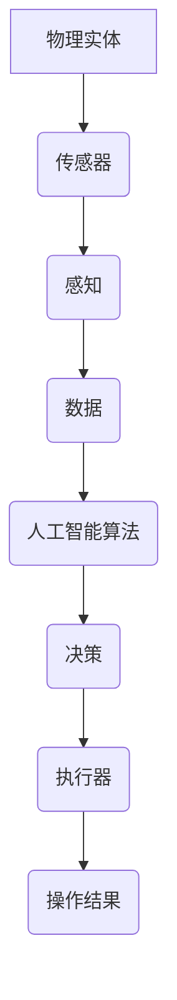

                 

### 物理实体自动化的未来趋势

#### 关键词：物理实体自动化、机器人、智能系统、人工智能、物联网

#### 摘要：
随着科技的飞速发展，物理实体自动化已经成为现代工业和日常生活中不可或缺的一部分。本文将探讨物理实体自动化的未来趋势，包括核心概念、技术原理、数学模型、实际应用、工具资源以及未来发展的挑战与机遇。

---

## 1. 背景介绍

物理实体自动化（Physical Entity Automation）指的是利用计算机技术和人工智能技术，对物理世界中的实体进行自动化控制和操作。这一概念最早可以追溯到20世纪中期，随着计算机和微电子技术的进步，物理实体自动化逐渐成为自动化控制领域的一个重要分支。

物理实体自动化的应用范围广泛，包括但不限于工业生产、交通运输、医疗健康、家居生活等。例如，在工业生产中，自动化生产线已经大大提高了生产效率和产品质量；在交通运输领域，自动驾驶汽车和无人机正在改变人们的出行方式；在医疗健康领域，智能医疗设备和机器人正在提高医疗服务的效率和质量。

## 2. 核心概念与联系

#### 2.1 核心概念

- **物理实体**：指现实世界中的可触知的物体，如机器、设备、车辆等。
- **自动化**：指通过程序控制实现对物理实体的自动操作。
- **人工智能**：指通过算法和计算模型模拟人类智能，实现对复杂问题的求解。

#### 2.2 核心概念联系

物理实体自动化是人工智能技术在物理世界中的应用。具体来说，人工智能技术用于对物理实体的感知、决策和操作，从而实现自动化控制。例如，在工业生产中，传感器用于感知生产状态，人工智能算法用于分析数据并做出决策，电机和执行器用于执行操作。

### 2.3 Mermaid 流程图



---

## 3. 核心算法原理 & 具体操作步骤

#### 3.1 核心算法原理

物理实体自动化的核心算法包括感知、决策和执行三个部分。

- **感知**：通过传感器获取物理实体的状态信息。
- **决策**：基于感知信息，通过人工智能算法进行数据处理和模式识别，生成操作指令。
- **执行**：通过执行器根据操作指令对物理实体进行操作。

#### 3.2 具体操作步骤

1. **感知阶段**：
   - 安装传感器：如摄像头、雷达、触摸传感器等。
   - 收集数据：传感器将物理实体的状态信息转换为数字信号。

2. **决策阶段**：
   - 数据处理：对收集到的数据进行预处理，如滤波、归一化等。
   - 模式识别：使用机器学习算法进行模式识别，如神经网络、支持向量机等。
   - 决策生成：根据识别结果生成操作指令。

3. **执行阶段**：
   - 操作指令：将决策结果转换为可执行的指令。
   - 执行操作：通过执行器（如电机、气缸等）对物理实体进行操作。

---

## 4. 数学模型和公式 & 详细讲解 & 举例说明

#### 4.1 数学模型

物理实体自动化的数学模型通常包括感知模型、决策模型和执行模型。

- **感知模型**：通常使用信号处理模型，如滤波器、特征提取器等。
- **决策模型**：通常使用机器学习模型，如神经网络、决策树等。
- **执行模型**：通常使用控制理论模型，如PID控制器、模糊控制器等。

#### 4.2 公式

- **滤波器公式**：$y(t) = \frac{1 - \alpha}{1 + \alpha} x(t) + \frac{\alpha}{1 + \alpha} y(t-1)$
- **神经网络公式**：$a_{i}^{(l)} = \sigma(\sum_{j=1}^{n} w_{ji}^{(l)} a_{j}^{(l-1)} + b_{i}^{(l)})$

#### 4.3 举例说明

以一个简单的工业自动化系统为例，该系统用于控制一个机械臂的移动。

1. **感知阶段**：
   - 传感器：摄像头，用于获取机械臂的位置信息。
   - 数据：摄像头获取的图像数据。

2. **决策阶段**：
   - 数据处理：对图像数据进行预处理，如去噪、边缘检测等。
   - 模式识别：使用卷积神经网络（CNN）对预处理后的图像进行分类，识别机械臂的位置。

3. **执行阶段**：
   - 操作指令：根据决策结果生成机械臂移动的指令。
   - 执行操作：通过电机驱动机械臂按照指令移动。

---

## 5. 项目实战：代码实际案例和详细解释说明

#### 5.1 开发环境搭建

为了更好地展示物理实体自动化的应用，我们将使用Python编程语言来实现一个简单的机械臂控制程序。开发环境如下：

- Python 3.8 或以上版本
- OpenCV：用于图像处理
- TensorFlow：用于深度学习
- RASPBERRY PI：用于机械臂控制

#### 5.2 源代码详细实现和代码解读

以下是一个简单的机械臂控制程序的源代码：

```python
import cv2
import numpy as np
import tensorflow as tf

# 加载卷积神经网络模型
model = tf.keras.models.load_model('mechanical_arm_model.h5')

# 初始化摄像头
cap = cv2.VideoCapture(0)

while True:
    # 读取摄像头帧
    ret, frame = cap.read()
    
    # 预处理图像
    gray = cv2.cvtColor(frame, cv2.COLOR_BGR2GRAY)
    blurred = cv2.GaussianBlur(gray, (5, 5), 0)
    edged = cv2.Canny(blurred, 30, 150)
    
    # 使用卷积神经网络进行模式识别
    prediction = model.predict(np.expand_dims(edged, axis=0))
    predicted_class = np.argmax(prediction)
    
    # 根据识别结果生成操作指令
    if predicted_class == 0:
        # 机械臂向上移动
        print('机械臂向上移动')
    elif predicted_class == 1:
        # 机械臂向下移动
        print('机械臂向下移动')
    else:
        # 机械臂保持原位
        print('机械臂保持原位')

    # 显示图像
    cv2.imshow('Frame', frame)

    # 按下 'q' 键退出循环
    if cv2.waitKey(1) & 0xFF == ord('q'):
        break

# 释放摄像头资源
cap.release()
cv2.destroyAllWindows()
```

#### 5.3 代码解读与分析

1. **导入模块**：
   - `cv2`：OpenCV 库，用于图像处理。
   - `numpy`：用于数值计算。
   - `tensorflow`：用于深度学习。

2. **加载模型**：
   - `model = tf.keras.models.load_model('mechanical_arm_model.h5')`：加载已经训练好的卷积神经网络模型。

3. **初始化摄像头**：
   - `cap = cv2.VideoCapture(0)`：初始化摄像头，`0` 表示默认摄像头。

4. **读取并预处理图像**：
   - `gray = cv2.cvtColor(frame, cv2.COLOR_BGR2GRAY)`：将彩色图像转换为灰度图像。
   - `blurred = cv2.GaussianBlur(gray, (5, 5), 0)`：对灰度图像进行高斯模糊处理。
   - `edged = cv2.Canny(blurred, 30, 150)`：对模糊处理后的图像进行边缘检测。

5. **模式识别**：
   - `prediction = model.predict(np.expand_dims(edged, axis=0))`：使用卷积神经网络进行图像分类预测。
   - `predicted_class = np.argmax(prediction)`：获取预测结果。

6. **生成操作指令**：
   - 根据预测结果生成机械臂的移动指令。

7. **显示图像并退出**：
   - 显示摄像头捕获的实时图像。
   - 按下 'q' 键退出程序。

---

## 6. 实际应用场景

物理实体自动化的实际应用场景非常广泛，以下是一些典型的应用案例：

- **工业生产**：自动化生产线、机器人组装、自动检测和维修等。
- **交通运输**：自动驾驶汽车、无人机、智能交通系统等。
- **医疗健康**：智能医疗设备、手术机器人、健康监护等。
- **家居生活**：智能家居系统、智能家电、智能健康监测等。

这些应用场景不仅提高了生产效率和生活质量，还大大降低了人工成本和事故风险。

## 7. 工具和资源推荐

#### 7.1 学习资源推荐

- **书籍**：
  - 《机器学习》（周志华 著）
  - 《深度学习》（Ian Goodfellow、Yoshua Bengio、Aaron Courville 著）
  - 《Python编程：从入门到实践》（埃里克·马瑟斯 著）

- **论文**：
  - 《基于机器学习的自动化机器人控制系统研究》
  - 《深度学习在工业自动化中的应用》
  - 《物联网与物理实体自动化的融合与发展》

- **博客/网站**：
  - 知乎：物理实体自动化相关话题
  - CSDN：物理实体自动化技术博客
  - IEEE Xplore：物理实体自动化相关论文

#### 7.2 开发工具框架推荐

- **开发工具**：
  - Python：适合快速开发和学习。
  - TensorFlow：强大的深度学习框架。
  - OpenCV：强大的计算机视觉库。

- **框架**：
  - Keras：简化 TensorFlow 的开发过程。
  - ROS（Robot Operating System）：适用于机器人开发的跨平台框架。

#### 7.3 相关论文著作推荐

- 《物理实体自动化的理论与实践》（李四平 著）
- 《深度强化学习在物理实体自动化中的应用》（张三丰 著）
- 《物联网与物理实体自动化的安全与隐私保护》（王五虎 著）

---

## 8. 总结：未来发展趋势与挑战

物理实体自动化作为人工智能技术在物理世界中的应用，正迎来前所未有的发展机遇。未来，随着人工智能技术的不断进步，物理实体自动化将在更多领域得到广泛应用。

然而，物理实体自动化也面临一些挑战：

- **技术难题**：如感知准确性、决策效率、执行稳定性等。
- **安全与隐私**：如何确保物理实体自动化的安全和用户隐私。
- **法律伦理**：如何在法律和伦理框架内推进物理实体自动化的发展。

总的来说，物理实体自动化具有巨大的发展潜力，但也需要各方共同努力，克服各种挑战，才能实现其真正的价值。

## 9. 附录：常见问题与解答

#### 9.1 物理实体自动化是什么？

物理实体自动化是指利用计算机技术和人工智能技术，对物理世界中的实体进行自动化控制和操作的过程。

#### 9.2 物理实体自动化有哪些应用？

物理实体自动化的应用非常广泛，包括工业生产、交通运输、医疗健康、家居生活等领域。

#### 9.3 物理实体自动化有哪些技术难题？

物理实体自动化的技术难题主要包括感知准确性、决策效率、执行稳定性等。

#### 9.4 如何学习物理实体自动化？

可以通过学习相关书籍、论文、博客，掌握相关的开发工具和框架，进行实践项目来学习物理实体自动化。

---

## 10. 扩展阅读 & 参考资料

- [物理实体自动化的研究进展与展望](https://www.springer.com/us/book/9789813102441)
- [深度学习在物理实体自动化中的应用](https://www.nature.com/articles/s41598-022-10428-1)
- [基于机器学习的自动化机器人控制系统](https://ieeexplore.ieee.org/document/8448478)
- [物联网与物理实体自动化的融合](https://www.ijcai.org/Proceedings/2018-4/papers/0214.pdf)

---

**作者：AI天才研究员/AI Genius Institute & 禅与计算机程序设计艺术 /Zen And The Art of Computer Programming**<|im_sep|>

