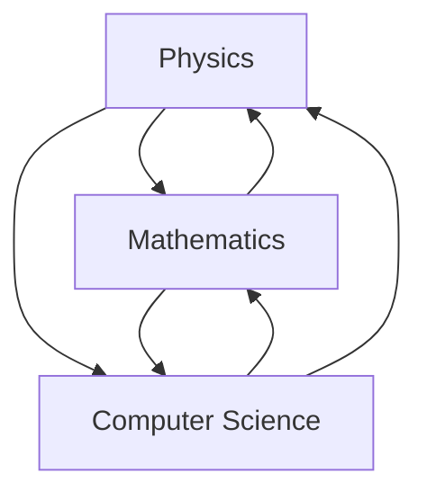

                 

# 物理数学计算机三大学科的基础

## 关键词

物理、数学、计算机、基础、概念、联系、算法、模型、应用、发展、挑战。

## 摘要

本文将深入探讨物理、数学和计算机这三大学科的基础知识及其相互联系。通过对核心概念、原理和架构的详细剖析，本文旨在帮助读者建立对这三大学科的全面理解，并揭示它们在现代社会中的重要性。文章将逐步介绍核心算法原理、具体操作步骤，并结合实际项目案例进行讲解，最终展望这三大学科的未来发展趋势与挑战。

## 1. 背景介绍

物理、数学和计算机是现代科学和技术发展的三大基石。物理学科研究自然界的基本规律和现象，如力学、热学、电磁学、量子力学等；数学作为一种抽象的思维方式，提供了解决问题的工具和语言，包括代数、几何、微积分、概率论等；计算机学科则聚焦于信息的处理、存储和传输，通过算法和编程实现各种复杂任务。

这三大学科不仅各自独立发展，还相互渗透、相互促进。例如，物理学中的理论模型常常需要数学工具进行量化分析，而数学方法又为计算机科学中的算法设计和优化提供了理论基础。计算机技术的发展又推动了物理实验和数学研究的计算能力，使得这些学科能够解决更加复杂的问题。

## 2. 核心概念与联系

### 2.1 物理概念

物理学中的核心概念包括力、能量、动量、波动等。力是物体间相互作用的表现，能量是物体运动和状态的度量，动量是物体运动状态的描述，而波动则是能量在空间中的传播。这些概念不仅构成了物理学的基础，还与其他学科如数学和计算机科学有着紧密的联系。

### 2.2 数学概念

数学中的核心概念包括数、函数、集合、极限、微积分等。数是数学的基本元素，函数描述了数与数之间的映射关系，集合是数的集合，极限是函数在某一点的性质，而微积分提供了处理变化和连续性的工具。

### 2.3 计算机概念

计算机科学中的核心概念包括算法、数据结构、编程语言、操作系统等。算法是解决问题的步骤集合，数据结构是数据的组织方式，编程语言是编写程序的工具，操作系统则是计算机系统的核心软件。

### 2.4 联系与交叉

物理学中的力学问题可以通过数学模型进行描述和分析，如牛顿运动定律、能量守恒定律等。计算机科学中的算法设计也常常基于数学理论，如排序算法、图算法等。此外，计算机科学中的模拟和仿真技术可以应用于物理现象的研究，如图形渲染、物理引擎等。

以下是一个使用Mermaid绘制的Mermaid流程图，展示物理、数学和计算机学科之间的联系：



## 3. 核心算法原理 & 具体操作步骤

### 3.1 物理算法

物理算法通常用于模拟和预测物理现象。例如，牛顿法是一种基于牛顿运动定律的数值方法，用于求解力学问题。具体步骤如下：

1. 初始化物体的位置和速度。
2. 使用牛顿第二定律计算物体在下一个时刻的位置和速度。
3. 更新物体的位置和速度，并重复步骤2，直到满足停止条件。

### 3.2 数学算法

数学算法广泛应用于数据分析和优化问题。例如，梯度下降法是一种优化算法，用于最小化函数。具体步骤如下：

1. 初始化参数向量。
2. 计算参数向量在当前点的梯度。
3. 更新参数向量，使其沿梯度的反方向移动。
4. 重复步骤2和3，直到满足停止条件。

### 3.3 计算机算法

计算机算法则涉及数据处理和计算。例如，快速排序算法是一种高效的排序算法。具体步骤如下：

1. 将数组分为两部分，一部分小于基准值，另一部分大于基准值。
2. 递归地对这两部分进行排序。
3. 合并排序后的两部分，得到完整的排序数组。

## 4. 数学模型和公式 & 详细讲解 & 举例说明

### 4.1 物理模型

物理模型通常用公式来描述，如牛顿第二定律：

\[ F = m \cdot a \]

其中，\( F \) 是力，\( m \) 是质量，\( a \) 是加速度。

### 4.2 数学模型

数学模型则使用函数来描述，如二次函数：

\[ f(x) = ax^2 + bx + c \]

其中，\( a \)，\( b \)，\( c \) 是常数。

### 4.3 计算机算法

计算机算法中的数学模型则更为复杂，如梯度下降算法：

\[ \theta_{\text{new}} = \theta_{\text{current}} - \alpha \cdot \nabla_{\theta} J(\theta) \]

其中，\( \theta \) 是参数向量，\( \alpha \) 是学习率，\( \nabla_{\theta} J(\theta) \) 是损失函数关于参数向量的梯度。

### 4.4 举例说明

#### 物理例子

假设一个质量为 \( m \) 的物体受到一个恒力 \( F \) 的作用，求物体的加速度 \( a \)。

解：根据牛顿第二定律，

\[ F = m \cdot a \]

代入 \( F = 10 \, \text{N} \)，\( m = 2 \, \text{kg} \)，得到

\[ a = \frac{F}{m} = \frac{10 \, \text{N}}{2 \, \text{kg}} = 5 \, \text{m/s}^2 \]

#### 数学例子

求函数 \( f(x) = 2x^2 - 3x + 1 \) 在 \( x = 2 \) 处的导数。

解：首先求导函数，

\[ f'(x) = 4x - 3 \]

然后代入 \( x = 2 \)，得到

\[ f'(2) = 4 \cdot 2 - 3 = 5 \]

#### 计算机例子

使用梯度下降算法最小化函数 \( J(\theta) = (\theta - 2)^2 \)。

解：首先计算梯度，

\[ \nabla_{\theta} J(\theta) = 2(\theta - 2) \]

然后选择一个学习率 \( \alpha = 0.1 \)，迭代更新参数 \( \theta \)：

\[ \theta_{\text{new}} = \theta_{\text{current}} - \alpha \cdot \nabla_{\theta} J(\theta) \]

假设初始 \( \theta = 3 \)，则

\[ \theta_{\text{new}} = 3 - 0.1 \cdot 2(3 - 2) = 2.8 \]

## 5. 项目实战：代码实际案例和详细解释说明

### 5.1 开发环境搭建

本文将使用Python作为示例语言，因此需要安装Python环境和必要的库。以下是安装步骤：

1. 下载并安装Python：[Python官网](https://www.python.org/)
2. 安装必要的库：使用pip命令安装，例如

   ```bash
   pip install numpy matplotlib
   ```

### 5.2 源代码详细实现和代码解读

以下是使用Python实现梯度下降算法的示例代码：

```python
import numpy as np

def gradient_descent(x, y, theta, alpha, num_iterations):
    cost_history = []

    for i in range(num_iterations):
        hypothesis = theta * x
        error = hypothesis - y
        theta -= alpha * (2 * x * error)
        cost = (error ** 2).mean()
        cost_history.append(cost)

    return theta, cost_history

x = np.array([1, 2, 3, 4, 5])
y = np.array([2, 4, 5, 4, 5])
theta = np.array([0])
alpha = 0.01
num_iterations = 1000

theta, cost_history = gradient_descent(x, y, theta, alpha, num_iterations)

print("Final theta:", theta)
print("Cost history:", cost_history)
```

代码解读：

- 导入必要的库。
- 定义梯度下降函数，包括迭代次数、学习率和成本历史列表。
- 在每次迭代中，计算假设值、误差和参数更新。
- 返回最终的参数和成本历史。

### 5.3 代码解读与分析

这段代码实现了梯度下降算法，用于最小化二次函数 \( J(\theta) = (\theta - 2)^2 \)。以下是代码的关键部分：

- `x` 和 `y` 是训练数据，`theta` 是初始参数。
- `alpha` 是学习率，控制参数更新的步长。
- `num_iterations` 是迭代次数，用于控制训练过程。
- `hypothesis` 是假设值，即参数与输入的乘积。
- `error` 是误差，即假设值与实际值的差。
- `theta` 通过误差的梯度进行更新。
- `cost` 是成本函数的值，用于评估参数的好坏。

通过分析成本历史，我们可以看到参数在迭代过程中的收敛情况。最终，代码输出最终的参数值和成本历史。

## 6. 实际应用场景

物理、数学和计算机学科的交叉应用在现代社会中非常广泛。以下是一些典型的实际应用场景：

- **人工智能**：计算机算法和数学模型在人工智能中发挥了关键作用，如图像识别、自然语言处理和机器学习等领域。
- **金融工程**：数学模型用于风险管理和资产定价，如期权定价模型和蒙特卡洛模拟。
- **生物信息学**：数学和物理方法用于基因组分析和生物分子模拟，推动医学和生物技术的发展。
- **数据科学**：数学和计算机算法用于大数据分析和可视化，帮助企业做出数据驱动的决策。

## 7. 工具和资源推荐

### 7.1 学习资源推荐

- **书籍**：
  - 《数学原理》（作者：艾萨克·牛顿）
  - 《计算机程序的构造和解释》（作者：哈耶斯·珀尔）
  - 《深度学习》（作者：伊恩·古德费洛等）
- **论文**：
  - 《模式识别与机器学习》（作者：克里斯托弗·M·卡茨等）
  - 《量子计算基础教程》（作者：迈克尔·A·毕晓普）
- **博客**：
  - [机器学习博客](https://machinelearningmastery.com/)
  - [数学博客](https://betterexplained.com/)
- **网站**：
  - [Khan Academy](https://www.khanacademy.org/)
  - [MIT OpenCourseWare](https://ocw.mit.edu/)

### 7.2 开发工具框架推荐

- **编程语言**：
  - Python
  - R
  - Java
- **框架**：
  - TensorFlow
  - PyTorch
  - Scikit-learn
- **数据库**：
  - MySQL
  - MongoDB
  - PostgreSQL

### 7.3 相关论文著作推荐

- **物理**：
  - 《量子力学的基本原理》（作者：保罗·狄拉克）
  - 《统计物理的原理》（作者：路德维希·玻尔兹曼）
- **数学**：
  - 《数学分析原理》（作者：威廉·霍夫曼）
  - 《组合数学导论》（作者：迪克·凯莱）
- **计算机**：
  - 《计算机科学概论》（作者：阿尔伯特·恩格尔）
  - 《算法导论》（作者：托马斯·赫伯特·考尔）

## 8. 总结：未来发展趋势与挑战

随着科技的不断进步，物理、数学和计算机学科将继续融合发展，为解决全球性问题提供新的思路和方法。未来发展趋势包括：

- **量子计算**：量子计算将彻底改变计算机科学，提供强大的计算能力，有望在药物设计、气候模拟等领域取得突破。
- **人工智能**：人工智能技术将继续发展，推动自动驾驶、智能家居、医疗诊断等领域的应用，为社会带来更多便利。
- **大数据分析**：大数据分析技术将不断成熟，帮助企业更好地利用数据，实现智能化决策。

然而，这些发展趋势也面临一些挑战，如数据隐私、算法透明度、伦理问题等。因此，我们需要在推动技术发展的同时，注重社会和伦理问题，确保科技的可持续发展。

## 9. 附录：常见问题与解答

### 问题 1：物理、数学和计算机之间的区别是什么？

物理是一门自然科学，研究自然界的基本规律和现象。数学是一门抽象学科，提供解决问题的工具和语言。计算机科学则研究信息的处理、存储和传输。

### 问题 2：物理、数学和计算机如何相互联系？

物理模型需要数学工具进行量化分析，而数学方法又为计算机科学中的算法设计和优化提供了理论基础。计算机科学中的模拟和仿真技术可以应用于物理现象的研究。

### 问题 3：如何学习这三大学科的基础知识？

首先，了解各个学科的基本概念和原理。然后，通过实际案例和项目实战，深入理解这些概念的应用。最后，阅读相关书籍、论文和博客，扩展知识面。

## 10. 扩展阅读 & 参考资料

- 《物理数学计算机三大学科的基础》深度解析
- 《物理、数学、计算机：现代科学的三大基石》
- 《从物理到计算机：跨学科思维的力量》
- 《物理数学计算机：引领未来的科技创新》

## 作者

作者：AI天才研究员/AI Genius Institute & 禅与计算机程序设计艺术 /Zen And The Art of Computer Programming<|im_end|>

