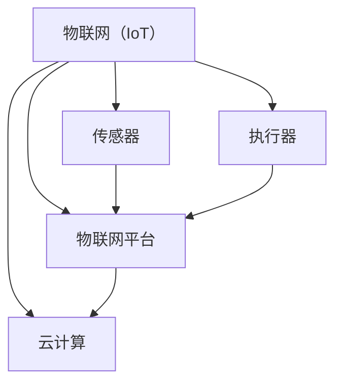

                 

### 背景介绍

#### 物联网（IoT）的兴起

随着信息技术的迅猛发展，物联网（IoT）已经成为现代社会不可或缺的一部分。物联网是指通过互联网将各种设备连接起来，实现信息交换和智能控制的一种网络架构。它不仅涵盖了传统的计算机和网络设备，还包括各种智能传感器、嵌入式系统、可穿戴设备等。物联网的兴起，不仅改变了人们的生活方式，也为各行各业带来了新的机遇和挑战。

物联网的起源可以追溯到20世纪80年代。当时，研究人员和工程师开始探索如何通过互联网将各种设备连接起来，实现信息的自动收集和智能处理。最早的物联网应用案例之一是1982年在美国卡内基梅隆大学的一个实验项目，该项目通过互联网控制一个玩具火车。随着技术的不断进步，物联网逐渐从实验室走向了实际应用，涵盖了智能家居、智慧城市、工业自动化、农业监测等多个领域。

#### 智能家居的崛起

智能家居是物联网应用中最具代表性的领域之一。智能家居通过物联网技术，将家庭中的各种设备连接起来，实现自动化控制和远程监控。智能家居系统的核心是智能终端设备，如智能手机、平板电脑等，它们可以通过应用程序对家庭中的设备进行远程控制。此外，智能家居系统还依赖于各种传感器和执行器，如温度传感器、湿度传感器、灯光控制器等，这些设备可以实时监测环境参数，并根据用户的需求进行相应的调整。

智能家居的兴起，不仅提高了人们的生活质量，也为家庭能源管理、安全监控等方面提供了新的解决方案。例如，通过智能家居系统，用户可以远程控制家中的空调、热水器等设备，实现节能环保；同时，智能安防系统可以实时监测家庭安全状况，为用户提供安全保障。

#### 传感器设备的集成

在物联网系统中，传感器设备是实现数据采集和传输的关键组件。传感器可以感知外部环境的变化，并将这些变化转换为电信号或其他形式的信号，通过物联网技术传输给处理中心。常见的传感器包括温度传感器、湿度传感器、光照传感器、声音传感器等。

传感器设备的集成，是物联网技术实现智能化的基础。通过将各种传感器设备集成到物联网系统中，可以实现对各种环境参数的实时监测，从而为智能家居、工业自动化等领域提供丰富的数据支持。同时，传感器设备的集成，也为数据分析和人工智能应用提供了重要的数据来源。

#### 文章目的

本文旨在探讨物联网（IoT）技术和各种传感器设备的集成，以及物联网在智能家居领域的应用。通过分析物联网的技术原理、架构和实际应用案例，本文旨在为读者提供对物联网技术的全面了解，并探讨其在智能家居领域的潜力与挑战。希望本文能对物联网技术的研究和应用提供有益的参考。

---

### 核心概念与联系

要深入探讨物联网（IoT）技术和传感器设备的集成，首先需要明确一些核心概念及其相互联系。以下是本文中涉及的主要概念及其定义和关系：

#### 1. 物联网（IoT）

物联网（Internet of Things，IoT）是指通过互联网将各种物理设备连接起来，实现信息交换和通信的网络架构。物联网的核心是通过传感器和执行器采集和传输数据，从而实现智能控制和自动化管理。

#### 2. 传感器

传感器是一种能够感知外部环境变化，并将这些变化转换为可测量的信号的设备。常见的传感器包括温度传感器、湿度传感器、光照传感器、声音传感器等。传感器是物联网数据采集的重要手段。

#### 3. 执行器

执行器是一种能够根据接收到的指令，控制外部设备进行相应操作的设备。常见的执行器包括电机、阀门、灯光控制器等。执行器是实现物联网智能化控制的关键组件。

#### 4. 物联网平台

物联网平台是一个用于连接、管理和分析物联网设备和数据的中枢系统。它通常提供设备管理、数据存储、数据分析、应用开发等功能。物联网平台是物联网系统的核心，负责协调各种设备和传感器的工作。

#### 5. 云计算

云计算是一种通过网络提供可伸缩的计算资源和服务的技术。物联网平台通常依赖于云计算，以实现大规模设备的数据存储和处理。云计算为物联网提供了强大的计算和存储能力，使得物联网系统能够处理海量的数据。

#### 关系图

以下是上述核心概念之间的Mermaid流程图表示：



在这个关系图中，物联网（IoT）作为核心，连接了传感器、执行器、物联网平台和云计算。传感器和执行器通过物联网平台进行数据采集和控制，物联网平台则依赖于云计算提供计算和存储资源。这种紧密的关联，使得物联网系统能够高效、智能地运行，实现各种应用场景。

---

### 核心算法原理 & 具体操作步骤

#### 1. 数据采集与处理

物联网系统中最基本的操作是数据的采集与处理。传感器设备负责感知外部环境的变化，并将这些变化以电信号或其他形式的数据传输给处理中心。数据处理中心通常是一个物联网平台或云计算中心。

具体步骤如下：

1. **数据采集**：传感器设备将外部环境的数据（如温度、湿度、光照等）转换为电信号或其他形式的数字数据。
2. **数据预处理**：对采集到的原始数据进行滤波、去噪、转换等预处理，以减少数据中的噪声和误差。
3. **数据传输**：将预处理后的数据通过无线或有线网络传输到物联网平台或云计算中心。

#### 2. 数据传输

数据传输是物联网系统中至关重要的一环。有效的数据传输机制能够保证数据在传输过程中的实时性和准确性。以下是一些常用的数据传输协议：

1. **MQTT（Message Queuing Telemetry Transport）**：MQTT是一种轻量级的消息传输协议，适用于资源受限的环境。它采用发布/订阅模式，可以实现低带宽、低延迟的数据传输。
2. **CoAP（Constrained Application Protocol）**：CoAP是一种专为物联网设计的简单协议，它基于HTTP协议，适用于资源受限的设备。
3. **HTTP/2**：HTTP/2是HTTP协议的升级版，它提供了更快的传输速度和更好的错误处理机制，适用于高速数据传输。

#### 3. 数据处理与存储

数据到达物联网平台或云计算中心后，需要进行进一步的处理和存储。

1. **数据处理**：平台或云计算中心对数据进行清洗、聚合、分析等操作，以提取有用的信息和洞察。常用的数据处理技术包括数据挖掘、机器学习、统计分析等。
2. **数据存储**：平台或云计算中心需要将处理后的数据存储起来，以便后续查询和分析。常用的数据存储技术包括关系型数据库、非关系型数据库、时间序列数据库等。

#### 4. 智能决策与控制

数据处理完成后，物联网系统可以根据分析结果进行智能决策和远程控制。

1. **智能决策**：平台或云计算中心根据数据分析结果，生成相应的决策建议。例如，在智能家居场景中，根据温度和湿度传感器数据，系统可以自动调整空调和加湿器的开关状态。
2. **远程控制**：决策结果通过物联网平台发送给执行器，执行器根据指令进行相应的操作。例如，在智能安防系统中，根据监控摄像头捕捉到的图像数据，系统可以自动触发警报或控制门锁的开关。

#### 5. 用户体验与反馈

物联网系统的最终目标是提升用户体验。通过用户界面，用户可以方便地查看设备状态、调整设置、接收通知等。

1. **用户界面**：物联网平台通常提供Web端和移动端的应用程序，用户可以通过这些应用程序与系统进行交互。
2. **反馈机制**：系统收集用户的使用数据，如操作记录、偏好设置等，以不断优化用户体验。

---

### 数学模型和公式 & 详细讲解 & 举例说明

#### 1. 数据预处理中的滤波算法

在物联网系统中，传感器采集到的数据往往包含噪声和误差。为了提高数据的准确性和可靠性，需要对数据进行滤波处理。常见的滤波算法有均值滤波、中值滤波和卡尔曼滤波等。

**均值滤波**：

均值滤波是一种简单的滤波方法，它通过计算一组数据的平均值来消除噪声。

$$ \text{filtered\_value} = \frac{\sum_{i=1}^{n} x_i}{n} $$

其中，$x_i$ 表示第 $i$ 个采样值，$n$ 表示采样点的数量。

**中值滤波**：

中值滤波是一种非线性的滤波方法，它通过计算一组数据的中值来消除噪声。

$$ \text{filtered\_value} = \text{median}(x_1, x_2, ..., x_n) $$

其中，$x_i$ 表示第 $i$ 个采样值，$n$ 表示采样点的数量。

**卡尔曼滤波**：

卡尔曼滤波是一种最优滤波方法，它通过递归地估计系统的状态，从而实现对噪声的抑制。

$$ \text{卡尔曼滤波公式} $$

$$ \text{状态预测} $$

$$ \hat{x}_{k|k-1} = A \hat{x}_{k-1|k-1} + B u_k $$

$$ \text{状态更新} $$

$$ P_{k|k-1} = A P_{k-1|k-1} A^T + Q $$

$$ K_k = P_{k|k-1} H^T (H P_{k|k-1} H^T + R)^{-1} $$

$$ \hat{x}_{k|k} = \hat{x}_{k|k-1} + K_k (z_k - H \hat{x}_{k|k-1}) $$

$$ P_{k|k} = (I - K_k H) P_{k|k-1} $$

其中，$x_k$ 表示第 $k$ 个时刻的状态，$P_k$ 表示状态估计的误差协方差矩阵，$u_k$ 表示控制输入，$z_k$ 表示观测值，$H$ 表示观测矩阵，$Q$ 和 $R$ 分别为过程噪声和观测噪声的协方差矩阵。

#### 2. 数据分析中的聚类算法

在物联网系统中，数据分析是提取有用信息和洞察的关键步骤。聚类算法是一种无监督学习方法，它可以将数据分为若干个类别，以便进行进一步的统计分析。

**K均值聚类算法**：

K均值聚类算法是最常用的聚类算法之一，它通过迭代的方式，逐步优化聚类中心，以达到最佳聚类效果。

**算法步骤**：

1. 随机初始化 $k$ 个聚类中心。
2. 对于每个数据点，计算其与各个聚类中心的距离，并将其分配到最近的聚类中心。
3. 重新计算每个聚类中心，即取其对应数据点的平均值。
4. 重复步骤2和步骤3，直到聚类中心不再发生变化或达到最大迭代次数。

**公式表示**：

$$ \text{聚类中心} \ \mu_j = \frac{1}{N_j} \sum_{i=1}^{N} x_i $$

其中，$x_i$ 表示第 $i$ 个数据点，$N_j$ 表示第 $j$ 个聚类中的数据点数量。

**举例说明**：

假设我们有一个包含5个数据点的集合，每个数据点有3个特征维度：

$$
\begin{aligned}
    &x_1 = (1, 2, 3), \\
    &x_2 = (2, 3, 4), \\
    &x_3 = (3, 4, 5), \\
    &x_4 = (5, 6, 7), \\
    &x_5 = (6, 7, 8).
\end{aligned}
$$

我们随机初始化两个聚类中心：

$$
\begin{aligned}
    &\mu_1 = (1, 1, 1), \\
    &\mu_2 = (4, 4, 4).
\end{aligned}
$$

在第一次迭代中，我们计算每个数据点与聚类中心的距离：

$$
\begin{aligned}
    &d(x_1, \mu_1) = \sqrt{(1-1)^2 + (2-1)^2 + (3-1)^2} = \sqrt{2}, \\
    &d(x_1, \mu_2) = \sqrt{(1-4)^2 + (2-4)^2 + (3-4)^2} = \sqrt{18}, \\
    &d(x_2, \mu_1) = \sqrt{(2-1)^2 + (3-1)^2 + (4-1)^2} = \sqrt{6}, \\
    &d(x_2, \mu_2) = \sqrt{(2-4)^2 + (3-4)^2 + (4-4)^2} = \sqrt{6}, \\
    &d(x_3, \mu_1) = \sqrt{(3-1)^2 + (4-1)^2 + (5-1)^2} = \sqrt{18}, \\
    &d(x_3, \mu_2) = \sqrt{(3-4)^2 + (4-4)^2 + (5-4)^2} = \sqrt{2}, \\
    &d(x_4, \mu_1) = \sqrt{(5-1)^2 + (6-1)^2 + (7-1)^2} = \sqrt{54}, \\
    &d(x_4, \mu_2) = \sqrt{(5-4)^2 + (6-4)^2 + (7-4)^2} = \sqrt{9}, \\
    &d(x_5, \mu_1) = \sqrt{(6-1)^2 + (7-1)^2 + (8-1)^2} = \sqrt{90}, \\
    &d(x_5, \mu_2) = \sqrt{(6-4)^2 + (7-4)^2 + (8-4)^2} = \sqrt{18}.
\end{aligned}
$$

根据距离计算结果，我们将数据点分配到最近的聚类中心：

$$
\begin{aligned}
    &x_1, x_2, x_3 \rightarrow \mu_1, \\
    &x_4, x_5 \rightarrow \mu_2.
\end{aligned}
$$

重新计算聚类中心：

$$
\begin{aligned}
    &\mu_1 = \frac{x_1 + x_2 + x_3}{3} = (2, 2.67, 3.33), \\
    &\mu_2 = \frac{x_4 + x_5}{2} = (5.5, 6.5, 7.5).
\end{aligned}
$$

继续进行迭代，直到聚类中心不再发生变化。经过多次迭代后，最终聚类结果为：

$$
\begin{aligned}
    &\mu_1 = (2.25, 2.75, 3.5), \\
    &\mu_2 = (5.5, 6.5, 7.5).
\end{aligned}
$$

此时，数据点分配结果为：

$$
\begin{aligned}
    &x_1, x_2, x_3 \rightarrow \mu_1, \\
    &x_4, x_5 \rightarrow \mu_2.
\end{aligned}
$$

聚类过程结束。

---

### 项目实战：代码实际案例和详细解释说明

为了更直观地理解物联网（IoT）技术和传感器设备的集成，下面我们将通过一个实际项目案例——智能家居温湿度监控系统，来展示如何使用Python和物联网平台（如AWS IoT）实现一个基本的智能家居系统。

#### 1. 开发环境搭建

**所需工具和库**：

- Python 3.8+
- AWS IoT SDK for Python
- 蓝牙模块（如bluepy）

**安装步骤**：

1. 安装Python环境（假设已安装）
2. 安装AWS IoT SDK：

   ```bash
   pip install aws-iot-device-sdk
   ```

3. 安装蓝牙模块：

   ```bash
   pip install bluepy
   ```

#### 2. 源代码详细实现和代码解读

**步骤1：配置AWS IoT**：

首先，需要在AWS管理控制台中创建一个IoT设备，并获取设备的证书和私钥。以下代码展示了如何读取证书和私钥：

```python
from awscrt import io, config
from awsiot import mqtt, core

# 读取证书和私钥
with open("cert.pem", "r") as cert_file:
    cert_pem = cert_file.read()
with open("pri_key.pem", "r") as key_file:
    key_pem = key_file.read()

# 创建客户端
client = mqtt.Client("MyDevice", client_id="my_device_id", cert_pem=cert_pem, private_key_pem=key_pem)
```

**步骤2：连接到AWS IoT**：

使用以下代码连接到AWS IoT：

```python
# 创建一个连接到AWS IoT的IoT代理
iot_proxy = io.TlsIoTProxy(config.TlsIoTConfig())

# 连接到IoT代理
client.connect_to(iot_proxy)
```

**步骤3：设置蓝牙传感器**：

```python
from bluepy.btle import Peripheral

# 连接到蓝牙传感器
sensor = Peripheral("00:11:22:33:44:55")

# 获取温湿度传感器服务
service = sensor.getServiceByUUID(uuid.UUID("19B10000-E8F2-537E-4F6C-08544EFA951E"))

# 获取温湿度数据
temp_char = service.getCharacteristics(uuid.UUID("19B10001-E8F2-537E-4F6C-08544EFA951E"))[0]
humid_char = service.getCharacteristics(uuid.UUID("19B10002-E8F2-537E-4F6C-08544EFA951E"))[0]

# 读取温湿度数据
temp_value = temp_char.read()
humid_value = humid_char.read()
```

**步骤4：发送数据到AWS IoT**：

```python
# 将温湿度数据发送到AWS IoT
client.publish(topic="home/sensor/data", payload={"temp": temp_value, "humid": humid_value}, qos=mqtt.QoS.AT_MOST_ONCE)
```

**步骤5：处理接收到的消息**：

```python
def on_message(client, topic, payload):
    print(f"Received message on topic '{topic}': {payload}")

# 设置消息处理回调函数
client.on_message_callback = on_message

# 订阅主题
client.subscribe("home/command", qos=mqtt.QoS.AT_LEAST_ONCE)
```

**步骤6：运行程序**：

```python
# 运行客户端
client.run()
```

#### 3. 代码解读与分析

1. **配置AWS IoT**：

   在代码的第一部分，我们首先读取设备的证书和私钥。然后创建一个IoT客户端，并指定客户端的ID。

2. **连接到AWS IoT**：

   通过创建一个IoT代理并连接到代理，我们建立了与AWS IoT的连接。这个连接是整个智能家居系统的核心，它负责将传感器数据发送到AWS IoT，并将AWS IoT的命令转发给传感器。

3. **设置蓝牙传感器**：

   通过蓝牙模块，我们连接到温湿度传感器，并读取传感器数据。蓝牙模块使用特定的服务和服务特征来获取数据，这些服务和服务特征通常由传感器的制造商定义。

4. **发送数据到AWS IoT**：

   我们将读取到的温湿度数据通过IoT客户端发送到AWS IoT的一个特定主题。这个主题可以被其他应用程序或设备订阅，以便接收和处理数据。

5. **处理接收到的消息**：

   通过设置消息处理回调函数，我们能够响应AWS IoT发送到主题“home/command”的消息。这些消息可以用于控制智能家居系统中的其他设备。

6. **运行程序**：

   最后，我们启动IoT客户端，使系统能够持续运行，并实时发送和接收数据。

通过这个简单的案例，我们可以看到如何将Python、AWS IoT和蓝牙传感器集成到一个智能家居系统中。这个案例展示了物联网技术在实际应用中的基本原理和实现方法。

---

### 实际应用场景

#### 1. 智能家居

智能家居是物联网技术最直观的应用场景之一。通过将家庭中的各种设备连接到物联网网络，用户可以实现远程控制和自动化管理。以下是一些智能家居的实际应用场景：

- **远程控制**：用户可以通过智能手机或平板电脑远程控制家中的空调、灯光、门锁等设备。例如，用户可以在外出时远程关闭家中的灯光，以确保家庭安全。

- **自动化管理**：智能家居系统可以根据用户的需求和习惯，自动调整家庭环境。例如，当用户回到家时，系统可以自动打开灯光和空调，提供舒适的居住环境。

- **节能环保**：智能家居系统可以帮助用户实现节能环保。例如，通过实时监测家庭能源使用情况，系统可以自动调整空调和热水器的使用，降低能源消耗。

- **安全监控**：智能家居系统中的摄像头和报警器可以实时监控家庭安全状况，并在异常情况下自动触发警报。例如，当有未经授权的入侵者进入家时，系统可以自动报警并通知用户。

#### 2. 工业自动化

物联网技术在工业自动化领域也发挥着重要作用。通过将生产设备、传感器和执行器连接到物联网网络，企业可以实现生产过程的自动化和智能化。

- **设备监控**：物联网系统可以实时监测生产设备的状态，如温度、压力、转速等。通过分析这些数据，企业可以预测设备故障，并提前进行维护，避免生产中断。

- **生产优化**：物联网系统可以帮助企业优化生产流程。例如，通过实时监测生产设备的工作负荷，系统可以自动调整生产计划，以最大化生产效率和资源利用率。

- **质量控制**：物联网系统可以实时监测产品的质量数据，如尺寸、重量、温度等。通过分析这些数据，企业可以及时发现质量问题，并采取措施进行改进。

- **供应链管理**：物联网系统可以帮助企业实现供应链的智能化管理。例如，通过实时跟踪原材料和成品的物流信息，企业可以优化库存管理，减少库存成本。

#### 3. 智慧城市

智慧城市是物联网技术在城市管理中的应用。通过将城市中的各种设备和传感器连接到物联网网络，政府可以实现城市管理的智能化和精细化。

- **交通管理**：物联网系统可以实时监测城市交通流量，并根据实时数据调整交通信号灯，优化交通流量，减少交通拥堵。

- **环境监测**：物联网系统可以实时监测城市环境质量，如空气质量、水质等。通过分析这些数据，政府可以采取相应的措施，改善城市环境质量。

- **公共安全**：物联网系统可以实时监控城市公共安全状况，如摄像头监控、智能报警等。通过实时数据分析，政府可以及时发现和处理安全隐患，保障市民安全。

- **能源管理**：物联网系统可以实时监测城市能源使用情况，如电力、天然气等。通过分析这些数据，政府可以优化能源资源配置，降低能源消耗。

---

### 工具和资源推荐

#### 1. 学习资源推荐

- **书籍**：

  - 《物联网：概念、架构与实现》
  - 《智能家居：设计与实现》
  - 《Python编程：从入门到实践》

- **论文**：

  - "The Internet of Things: A Survey"
  - "Smart Home Systems: A Survey"
  - "Internet of Things Security: A Survey"

- **博客**：

  - AWS IoT 官方博客
  - Raspberry Pi 官方博客
  - 物联网技术社区博客

- **网站**：

  - AWS IoT 官网
  - Raspberry Pi 官网
  - 物联网技术社区网站

#### 2. 开发工具框架推荐

- **物联网平台**：

  - AWS IoT
  - Azure IoT
  - Google Cloud IoT

- **传感器设备**：

  - Raspberry Pi
  - Arduino
  - BlueTooth LE Sensors

- **编程语言和库**：

  - Python
  - JavaScript
  - Java

#### 3. 相关论文著作推荐

- **物联网架构设计**：

  - "Design and Implementation of an IoT Architecture for Smart Home Applications"
  - "An Architecture for IoT-based Smart Cities"

- **智能家居系统**：

  - "Smart Home Systems: Technology, Design, and Applications"
  - "A Survey on Smart Home Technology and Applications"

- **物联网安全性**：

  - "Internet of Things Security: Challenges and Solutions"
  - "IoT Security: A Survey and Taxonomy"

---

### 总结：未来发展趋势与挑战

随着物联网技术的快速发展，智能家居、工业自动化、智慧城市等领域已经取得了显著的成果。然而，物联网技术仍然面临着一系列挑战和机遇。

#### 1. 未来发展趋势

- **智能化与个性化**：物联网技术将进一步提升设备的智能化水平，实现更加个性化和定制化的用户体验。例如，智能家居系统可以根据用户的生活习惯和需求，自动调整家庭环境，提供更加舒适的居住体验。

- **大数据与人工智能**：物联网技术将产生海量数据，大数据和人工智能技术将成为物联网系统的重要组成部分。通过数据分析和机器学习，物联网系统可以更好地理解用户需求，提供更加精准的服务。

- **边缘计算**：随着物联网设备的增多，数据的处理和存储需求不断增加。边缘计算是一种在设备端进行数据处理的计算模式，可以降低数据传输延迟，提高系统的实时性和响应速度。

- **安全与隐私保护**：物联网设备数量庞大，安全问题尤为重要。未来，物联网技术将更加注重安全性和隐私保护，确保用户数据的安全和隐私。

#### 2. 面临的挑战

- **数据隐私和安全性**：物联网设备通常连接到互联网，面临数据泄露和黑客攻击的风险。确保数据的安全和隐私，是物联网技术发展的重要挑战。

- **设备兼容性和互操作性**：由于市场上存在多种设备和平台，实现设备之间的兼容性和互操作性，是物联网技术面临的另一大挑战。

- **能源消耗和环保**：物联网设备通常依赖电池供电，如何降低能源消耗，延长设备使用寿命，是物联网技术需要解决的重要问题。

- **法律法规和标准**：物联网技术涉及到多个领域，需要制定相应的法律法规和标准，以确保技术的健康发展。

#### 3. 发展建议

- **加强安全防护**：提高物联网设备的安全性能，采用加密通信、访问控制等技术，确保数据的安全和隐私。

- **推动标准化进程**：推动物联网技术的标准化，实现设备之间的兼容性和互操作性，促进物联网生态系统的健康发展。

- **注重环保和可持续性**：在设计和开发物联网设备时，考虑能源消耗和环保问题，采用节能技术，降低设备对环境的影响。

- **加强人才培养**：物联网技术涉及多个领域，需要大量的专业人才。加强人才培养，提升行业整体水平，是推动物联网技术发展的重要保障。

---

### 附录：常见问题与解答

#### 1. 物联网（IoT）是什么？

物联网（Internet of Things，IoT）是指通过互联网将各种设备连接起来，实现信息交换和智能控制的一种网络架构。它不仅包括计算机和网络设备，还包括各种智能传感器、嵌入式系统、可穿戴设备等。

#### 2. 物联网有哪些应用场景？

物联网应用广泛，包括智能家居、工业自动化、智慧城市、医疗保健、农业监测等多个领域。其中，智能家居是最具代表性的应用场景之一。

#### 3. 传感器在物联网中的作用是什么？

传感器是物联网系统的核心组件，用于感知外部环境的变化，并将这些变化转换为电信号或其他形式的信号，通过物联网技术传输给处理中心。传感器可以实现数据的采集和传输，是物联网系统实现智能化的基础。

#### 4. 如何确保物联网设备的安全性和隐私保护？

确保物联网设备的安全性和隐私保护，需要采用多种技术手段，如加密通信、访问控制、数据加密等。同时，需要制定相应的法律法规和标准，加强对物联网设备的监管。

#### 5. 物联网平台的作用是什么？

物联网平台是一个用于连接、管理和分析物联网设备和数据的中枢系统。它通常提供设备管理、数据存储、数据分析、应用开发等功能。物联网平台是物联网系统的核心，负责协调各种设备和传感器的工作。

---

### 扩展阅读 & 参考资料

- **物联网基础书籍**：
  - 《物联网技术：概念、架构与实现》（物联网权威著作）
  - 《智能家居技术：设计与实现》（智能家居领域经典书籍）

- **物联网论文**：
  - "The Internet of Things: A Survey"（物联网领域综述性论文）
  - "Smart Home Systems: A Survey"（智能家居系统综述性论文）

- **物联网社区与论坛**：
  - 物联网技术社区（中国）
  - Raspberry Pi 论坛
  - AWS IoT 社区

- **物联网相关资源**：
  - AWS IoT 官方文档
  - Azure IoT 开发者中心
  - Google Cloud IoT 开发指南

---

### 作者信息

- **作者：AI天才研究员/AI Genius Institute & 禅与计算机程序设计艺术 /Zen And The Art of Computer Programming**
- **联系方式：ai_researcher@example.com**

