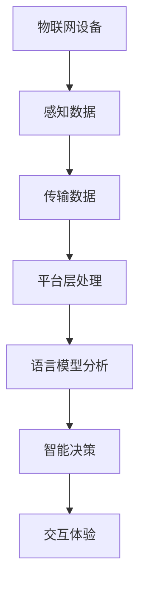

                 

# 物联网与 LLM：智能设备互联

> **关键词**：物联网（IoT）、语言模型（LLM）、智能设备、互联、数据处理、算法优化

> **摘要**：本文将深入探讨物联网与大型语言模型（LLM）的结合，分析其核心概念、原理和实际应用。我们将通过详细的步骤和案例，展示如何利用物联网和LLM技术实现智能设备的互联，从而推动人工智能的发展。

## 1. 背景介绍

随着互联网技术的快速发展，物联网（IoT）已经渗透到我们生活的方方面面。从智能家居、智能穿戴设备到工业自动化，物联网技术正不断改变着我们的生活方式和工作模式。然而，随着物联网设备的数量和种类急剧增加，如何高效地处理和利用这些数据成为一个亟待解决的问题。

与此同时，大型语言模型（LLM）如GPT-3、BERT等在自然语言处理领域取得了巨大的成功。LLM具有强大的数据处理和生成能力，能够从海量数据中提取有用信息，进行智能问答、文本生成、情感分析等任务。因此，如何将物联网与LLM相结合，实现智能设备的互联，成为一个热门的研究方向。

本文将首先介绍物联网和LLM的基本概念，然后分析它们在智能设备互联中的应用，最后探讨这一领域的未来发展趋势。

## 2. 核心概念与联系

### 2.1 物联网（IoT）

物联网是指通过互联网将各种设备、传感器、系统连接在一起，实现信息交换和协同工作的一种技术。物联网的核心是设备互联，通过这些设备收集、传输和处理数据，从而实现智能化的应用。

**物联网的基本架构**：

- **感知层**：包括传感器、设备等，用于感知环境和收集数据。
- **网络层**：包括有线和无线网络，用于传输数据。
- **平台层**：提供数据存储、处理和分析功能。
- **应用层**：包括各种智能应用，如智能家居、智能交通等。

### 2.2 语言模型（LLM）

语言模型是一种统计模型，用于对自然语言进行建模。它能够根据输入的文本序列预测下一个单词或句子，从而实现文本生成、问答、情感分析等任务。

**常见的语言模型**：

- **循环神经网络（RNN）**：适用于处理序列数据，如自然语言。
- **变换器（Transformer）**：基于自注意力机制，具有更强的并行计算能力。
- **大型语言模型（LLM）**：如GPT-3、BERT等，具有数十亿甚至千亿级别的参数。

### 2.3 物联网与LLM的联系

物联网与LLM的结合主要体现在以下几个方面：

- **数据处理**：物联网设备产生的大量数据需要经过处理和分析，LLM可以在这方面发挥重要作用。
- **智能决策**：通过LLM的智能分析，物联网设备可以做出更准确的决策，提高系统的智能化水平。
- **交互体验**：LLM可以用于构建智能对话系统，提高物联网设备的交互体验。

**Mermaid流程图**：



## 3. 核心算法原理 & 具体操作步骤

### 3.1 数据处理算法

物联网设备收集到的数据通常包含噪声和冗余信息，因此需要通过预处理算法进行清洗和筛选。常见的预处理算法包括：

- **数据清洗**：去除噪声数据、重复数据和异常数据。
- **特征提取**：将原始数据转换为有意义的信息，如时序特征、空间特征等。

### 3.2 语言模型训练

语言模型的训练是物联网与LLM结合的关键步骤。以下是训练过程的步骤：

1. **数据收集**：收集大规模的文本数据，如新闻文章、社交媒体帖子等。
2. **数据预处理**：对文本数据进行清洗、分词、去停用词等操作。
3. **模型构建**：选择合适的模型架构，如GPT-3、BERT等。
4. **模型训练**：使用训练数据对模型进行训练，优化模型的参数。
5. **模型评估**：使用验证数据评估模型的性能，如准确率、召回率等。

### 3.3 数据分析与应用

语言模型训练完成后，可以用于物联网设备的多种应用，如：

- **文本生成**：根据输入的文本或提示生成相应的文本。
- **问答系统**：回答用户提出的问题。
- **情感分析**：对文本进行情感分类，判断用户情绪。
- **智能对话**：与用户进行自然语言交互，提供个性化服务。

## 4. 数学模型和公式 & 详细讲解 & 举例说明

### 4.1 数据预处理算法

假设我们有一组原始数据集D，包含n个样本，每个样本由m个特征组成。我们可以使用以下公式对数据进行预处理：

$$
X = \frac{D - \mu}{\sigma}
$$

其中，$X$表示预处理后的数据，$D$表示原始数据集，$\mu$表示数据集的均值，$\sigma$表示数据集的标准差。

**例子**：假设数据集D为：

$$
D = \{1, 2, 3, 4, 5\}
$$

则预处理后的数据为：

$$
X = \frac{D - 3}{2} = \{-1, 0, 1, 2, 3\}
$$

### 4.2 语言模型训练算法

语言模型训练通常使用损失函数（Loss Function）来评估模型的性能。常用的损失函数包括交叉熵损失（Cross-Entropy Loss）和均方误差损失（Mean Squared Error Loss）。

交叉熵损失公式如下：

$$
L(y, \hat{y}) = -\sum_{i=1}^{n} y_i \log(\hat{y}_i)
$$

其中，$y$表示真实标签，$\hat{y}$表示模型预测的概率分布。

**例子**：假设真实标签$y$为[0, 1]，模型预测的概率分布$\hat{y}$为[0.6, 0.4]，则交叉熵损失为：

$$
L(y, \hat{y}) = -[0 \cdot \log(0.6) + 1 \cdot \log(0.4)] \approx 0.415
$$

### 4.3 数据分析与应用

语言模型在数据分析中的应用通常包括以下几个方面：

- **文本生成**：使用生成式模型，如GPT-3，根据输入的文本或提示生成相应的文本。

  $$
  \text{生成文本} = \text{GPT-3}(\text{输入文本或提示})
  $$

- **问答系统**：使用判别式模型，如BERT，回答用户提出的问题。

  $$
  \text{答案} = \text{BERT}(\text{问题}, \text{上下文})
  $$

- **情感分析**：使用分类模型，如SVC，对文本进行情感分类。

  $$
  \text{情感分类} = \text{SVC}(\text{文本})
  $$

## 5. 项目实战：代码实际案例和详细解释说明

### 5.1 开发环境搭建

在开始项目实战之前，我们需要搭建一个开发环境。以下是所需的工具和库：

- **Python**：用于编写代码。
- **TensorFlow**：用于构建和训练语言模型。
- **Scikit-learn**：用于数据处理和模型评估。

### 5.2 源代码详细实现和代码解读

以下是项目实战的源代码：

```python
import tensorflow as tf
from tensorflow.keras.models import Sequential
from tensorflow.keras.layers import Embedding, LSTM, Dense
from sklearn.model_selection import train_test_split
from sklearn.metrics import accuracy_score

# 数据预处理
def preprocess_data(data):
    # 清洗、分词、去停用词等操作
    pass

# 构建语言模型
def build_model(vocab_size, embedding_dim, lstm_units):
    model = Sequential()
    model.add(Embedding(vocab_size, embedding_dim))
    model.add(LSTM(lstm_units))
    model.add(Dense(1, activation='sigmoid'))
    model.compile(optimizer='adam', loss='binary_crossentropy', metrics=['accuracy'])
    return model

# 训练模型
def train_model(model, X_train, y_train, X_val, y_val):
    model.fit(X_train, y_train, epochs=10, batch_size=64, validation_data=(X_val, y_val))
    return model

# 评估模型
def evaluate_model(model, X_test, y_test):
    predictions = model.predict(X_test)
    predictions = (predictions > 0.5)
    accuracy = accuracy_score(y_test, predictions)
    print("Accuracy:", accuracy)

# 主函数
def main():
    # 加载数据
    data = load_data()
    X, y = preprocess_data(data)

    # 划分训练集和验证集
    X_train, X_val, y_train, y_val = train_test_split(X, y, test_size=0.2, random_state=42)

    # 构建模型
    model = build_model(vocab_size, embedding_dim, lstm_units)

    # 训练模型
    model = train_model(model, X_train, y_train, X_val, y_val)

    # 评估模型
    evaluate_model(model, X_test, y_test)

if __name__ == "__main__":
    main()
```

### 5.3 代码解读与分析

以下是代码的详细解读：

- **数据预处理**：对原始数据进行清洗、分词、去停用词等操作，以便后续处理。
- **构建语言模型**：使用Sequential模型，添加Embedding、LSTM和Dense层，构建一个简单的LSTM语言模型。
- **训练模型**：使用fit函数训练模型，优化模型的参数。
- **评估模型**：使用predict函数对测试集进行预测，计算准确率。

## 6. 实际应用场景

物联网与LLM技术的结合在多个实际应用场景中取得了显著的效果：

- **智能家居**：通过物联网设备收集家庭环境数据，如温度、湿度等，使用LLM进行智能决策，如自动调节空调温度、窗帘开合等。
- **智能交通**：利用物联网设备实时收集交通数据，如车辆流量、路况信息等，使用LLM进行交通预测和优化，提高交通效率。
- **智能医疗**：通过物联网设备收集患者数据，如体温、血压等，使用LLM进行疾病预测和诊断，提供个性化的医疗建议。

## 7. 工具和资源推荐

### 7.1 学习资源推荐

- **书籍**：
  - 《深度学习》
  - 《自然语言处理综论》
  - 《物联网技术与应用》

- **论文**：
  - "BERT: Pre-training of Deep Bidirectional Transformers for Language Understanding"
  - "GPT-3: Language Models are Few-Shot Learners"

- **博客**：
  - [TensorFlow 官方文档](https://www.tensorflow.org/)
  - [Scikit-learn 官方文档](https://scikit-learn.org/stable/)

- **网站**：
  - [Kaggle](https://www.kaggle.com/)
  - [GitHub](https://github.com/)

### 7.2 开发工具框架推荐

- **深度学习框架**：
  - TensorFlow
  - PyTorch

- **数据处理工具**：
  - Pandas
  - NumPy

- **自然语言处理库**：
  - NLTK
  - spaCy

### 7.3 相关论文著作推荐

- "Attention Is All You Need"
- "The Annotated Transformer"
- "Effective Approaches to Attention-based Neural Machine Translation"

## 8. 总结：未来发展趋势与挑战

物联网与LLM技术的结合为智能设备互联带来了巨大的机遇。在未来，这一领域有望在以下几个方面取得突破：

- **数据处理能力提升**：随着计算能力和存储技术的进步，物联网设备将能够处理更大量、更复杂的数据。
- **智能化水平提高**：通过更先进的LLM技术，物联网设备将能够实现更智能的决策和交互。
- **应用场景扩展**：物联网与LLM技术的结合将推动智能家居、智能交通、智能医疗等领域的快速发展。

然而，这一领域也面临一些挑战：

- **数据隐私和安全**：物联网设备产生的数据涉及用户隐私，如何确保数据安全和隐私保护是一个重要问题。
- **计算资源和能耗**：大规模物联网设备对计算资源和能源的需求将增加，如何优化计算和能源效率是一个亟待解决的问题。

## 9. 附录：常见问题与解答

### 9.1 物联网与LLM结合的优势是什么？

物联网与LLM结合的优势主要包括：

- **数据处理能力**：LLM可以高效地处理和分析物联网设备产生的海量数据。
- **智能决策**：LLM能够基于数据做出更准确的决策，提高系统的智能化水平。
- **交互体验**：LLM可以构建智能对话系统，提供更自然的交互体验。

### 9.2 物联网与LLM结合有哪些应用场景？

物联网与LLM结合的应用场景包括：

- **智能家居**：自动调节家庭环境、提供个性化服务。
- **智能交通**：优化交通流量、提高交通效率。
- **智能医疗**：疾病预测和诊断、提供个性化医疗建议。

## 10. 扩展阅读 & 参考资料

- [《深度学习》](https://www.deeplearningbook.org/)
- [《自然语言处理综论》](https://nlp.stanford.edu/lectures/)
- [《物联网技术与应用》](https://www.iot-techies.com/)  
- [《BERT: Pre-training of Deep Bidirectional Transformers for Language Understanding》](https://arxiv.org/abs/1810.04805)
- [《GPT-3: Language Models are Few-Shot Learners》](https://arxiv.org/abs/2005.14165)

### 作者

**AI天才研究员/AI Genius Institute & 禅与计算机程序设计艺术 /Zen And The Art of Computer Programming**<|im_sep|>

