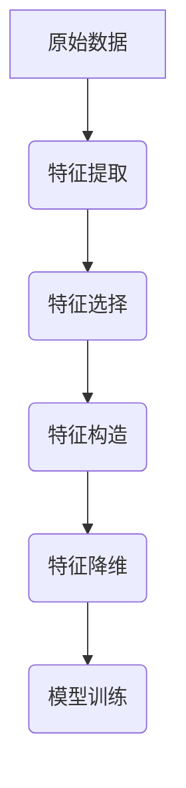

                 

### 背景介绍 Background Introduction

#### 特征工程的基本概念 Basic Concepts of Feature Engineering

特征工程（Feature Engineering）是机器学习和数据科学领域的一项关键技术。它涉及从原始数据中提取出有助于机器学习模型训练的特征，并进行适当的预处理和转换，以提升模型的性能和可解释性。简而言之，特征工程是数据转换的过程，其目的是使数据更适合于机器学习算法。

在机器学习流程中，特征工程处于核心位置。其重要性体现在以下几个方面：

1. **提升模型性能 Improve Model Performance**: 适当的特征工程可以显著提高模型的准确性和泛化能力。通过选择和构造有效的特征，我们可以使得模型能够更好地理解数据，从而提升其预测能力。

2. **减少过拟合 Reduce Overfitting**: 过拟合是指模型在训练数据上表现得很好，但在新的数据上表现不佳。特征工程可以通过简化模型和增加正则化项来减少过拟合。

3. **提升模型可解释性 Improve Model Interpretability**: 特征工程有助于提高模型的可解释性，使得非专业人士也能理解模型的工作原理。

#### 特征工程的发展历程 Development History of Feature Engineering

特征工程的历史可以追溯到传统的统计模型时代。在当时，研究人员通过探索数据，手工构建特征来提高模型性能。随着机器学习技术的发展，特征工程的方法也不断演进。

- **手动特征工程 Manual Feature Engineering**: 早期，特征工程主要是手工完成的，研究人员通过数据分析，直观地选择和构建特征。

- **自动化特征工程 Automated Feature Engineering**: 随着计算能力的提升和数据量的增加，自动化特征工程逐渐成为可能。自动化特征工程利用算法来自动选择和构建特征，减轻了人工工作量。

- **深度特征工程 Deep Feature Engineering**: 在深度学习中，特征工程变得更加重要。深度学习模型通常通过多层神经网络自动学习特征，但仍然需要通过调参和预处理来优化模型性能。

#### 为什么要进行特征工程？Why Feature Engineering is Necessary?

- **数据转换 Data Transformation**: 特征工程将原始数据转换成机器学习模型能够处理的格式，这包括数值化、归一化等操作。

- **数据简化 Data Simplification**: 通过特征选择，我们可以减少冗余特征，简化数据集，从而提高计算效率。

- **信息增强 Information Augmentation**: 特征工程可以增强数据的表达能力，使得模型能够更好地捕捉数据中的信息。

- **模型适应性 Model Adaptability**: 适当的特征工程可以提高模型在不同数据集上的适应性，增强其泛化能力。

通过特征工程，我们可以使得机器学习模型更加高效、准确和可解释。接下来，我们将深入探讨特征工程的核心概念和算法原理。

#### References

1. "Feature Engineering: A Practical Approach for Predictive Models" by Kjell Johnson and Geoffrey I. Webb.
2. "Practical Feature Engineering for Machine Learning" by Alex J. Taylor and Mhairi A. Hunter.
3. "Feature Engineering and Selection Techniques in Machine Learning: A Data Science Journal Review" by Roksana Bahreh et al.

---

## 2. 核心概念与联系 Core Concepts and Connections

### 特征提取 Feature Extraction

特征提取是从原始数据中提取有用信息的过程。它的目的是从复杂的数据集中识别出对预测任务有重要意义的特征。以下是一些常用的特征提取方法：

1. **统计特征**：如均值、方差、标准差、最大值、最小值等。

2. **频率特征**：如词频、文档频率等，常用于文本数据分析。

3. **文本特征**：如TF-IDF、Word2Vec、BERT等。

4. **图像特征**：如颜色直方图、纹理特征、形状特征等。

### 特征选择 Feature Selection

特征选择是特征工程中的重要步骤，旨在从大量特征中选择出对模型预测性能有显著贡献的特征。以下是一些常用的特征选择方法：

1. **过滤式特征选择 Filter Feature Selection**：通过计算特征与目标变量之间的相关性来进行特征选择。

2. **包裹式特征选择 Wrapper Feature Selection**：通过训练模型并评估不同特征组合对模型性能的影响来进行特征选择。

3. **嵌入式特征选择 Embedded Feature Selection**：在模型训练过程中自动进行特征选择。

### 特征构造 Feature Construction

特征构造是通过组合、转换和扩展原始特征来创建新的特征。以下是一些常用的特征构造方法：

1. **聚合特征 Aggregation Features**：如均值、中位数、最大值、最小值等。

2. **变换特征 Transformation Features**：如对数变换、平方根变换、归一化等。

3. **交互特征 Interaction Features**：如特征交叉、特征乘积等。

### 特征降维 Feature Dimensionality Reduction

特征降维是减少数据维度，同时保留关键信息的过程。以下是一些常用的特征降维方法：

1. **主成分分析 Principal Component Analysis (PCA)**：通过线性变换将数据投影到新的正交坐标系上。

2. **t-SNE t-Distributed Stochastic Neighbor Embedding**：用于高维数据的可视化。

3. **自编码器 Autoencoders**：通过训练编码器和解码器来学习数据的有效表示。

### Mermaid 流程图 Mermaid Flowchart

下面是一个简单的 Mermaid 流程图，展示了特征工程的核心步骤和相互关系：

通过这个流程图，我们可以清晰地看到特征工程中的各个环节是如何相互关联和协同工作的。

---

在接下来的章节中，我们将详细探讨特征工程中的核心算法原理和具体操作步骤，帮助读者深入理解这一关键技术。

