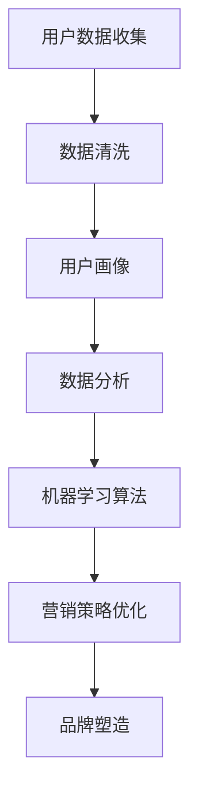

                 

### 背景介绍

随着人工智能（AI）技术的飞速发展，独立创业者在品牌塑造和营销方面的机会与挑战并存。品牌塑造是一个复杂的过程，它不仅涉及产品的定位、市场调研、用户画像的绘制，还涉及到如何在竞争激烈的市场中脱颖而出。传统的营销策略通常需要大量的资金支持，包括广告投放、市场调研、人员培训等。然而，对于预算有限的独立创业者来说，这些传统的营销手段往往可望而不可及。此时，AI驱动的智能营销策略成为了一种全新的选择。

智能营销利用人工智能技术，通过大数据分析和机器学习算法，为独立创业者提供精准的市场洞察和高效的营销策略。从个性化推荐到智能客服，从内容营销到广告投放，AI在各个环节都能发挥作用，极大地提升了营销效果的同时，也降低了营销成本。因此，本文旨在探讨如何利用AI技术，在预算有限的情况下，为独立创业者提供一套智能营销策略，助力品牌塑造。

接下来，我们将深入探讨AI驱动品牌塑造的核心概念、算法原理、数学模型及其在实际中的应用。通过具体的案例和实战经验，我们将展示如何利用AI技术打造一个成功的品牌，并为独立创业者在未来发展中面临的挑战提供解决方案。希望本文能为您提供有益的启示，帮助您在AI时代打造一个强大且可持续发展的品牌。

### 核心概念与联系

要理解AI驱动的品牌塑造，我们首先需要掌握几个核心概念：用户画像、数据分析和机器学习算法。这些概念不仅是AI技术的基础，也是构建智能营销策略的关键要素。

#### 用户画像

用户画像（User Profiling）是一种通过收集和分析用户数据来创建用户特征的方法。这些数据可以来源于多种渠道，如社交媒体、网站行为、购买记录等。用户画像可以帮助我们了解用户的兴趣、行为和需求，从而实现精准营销。具体来说，用户画像通常包括以下几个方面：

1. **基本信息**：如年龄、性别、地理位置等。
2. **兴趣和行为**：如浏览记录、搜索关键词、社交行为等。
3. **消费能力**：如购买频率、购买金额等。
4. **偏好**：如品牌偏好、产品偏好等。

通过创建详细的用户画像，品牌可以更好地了解其目标受众，从而制定更有针对性的营销策略。

#### 数据分析

数据分析（Data Analysis）是利用统计学、数据挖掘和机器学习等方法，对大量数据进行分析和处理，以发现数据中的规律和模式。在智能营销中，数据分析起到了至关重要的作用，它可以帮助品牌识别潜在客户、预测市场趋势、优化广告投放等。具体来说，数据分析可以分为以下几个步骤：

1. **数据收集**：收集来自各种渠道的用户数据。
2. **数据清洗**：去除重复数据、处理缺失值等。
3. **数据探索**：使用可视化工具，如饼图、柱状图等，对数据进行初步分析。
4. **模型建立**：建立预测模型或分类模型，如回归分析、聚类分析等。
5. **结果验证**：通过交叉验证等方法验证模型效果。

#### 机器学习算法

机器学习算法（Machine Learning Algorithms）是AI的核心技术之一，通过训练模型来识别数据中的模式和规律。在智能营销中，常用的机器学习算法包括：

1. **回归分析**：用于预测连续值，如购买金额。
2. **分类分析**：用于将数据分为不同的类别，如客户是否购买。
3. **聚类分析**：用于将相似的数据分组，如用户兴趣群体。
4. **推荐系统**：基于用户历史行为和偏好，为用户推荐相关产品或内容。

通过机器学习算法，品牌可以更准确地预测用户行为、优化广告投放、提升用户体验等。

#### Mermaid 流程图

为了更直观地理解这些核心概念之间的联系，我们可以使用Mermaid流程图来展示它们的交互关系：



在这个流程图中，用户数据收集是整个流程的起点，通过数据清洗和用户画像建立，我们最终得到可用于优化和提升品牌塑造的营销策略。

通过以上核心概念和流程的介绍，我们为接下来的详细讨论奠定了基础。在接下来的部分中，我们将深入探讨AI驱动的品牌塑造中的核心算法原理和具体操作步骤。

### 核心算法原理 & 具体操作步骤

在了解用户画像、数据分析和机器学习算法等核心概念之后，我们需要深入了解AI驱动的品牌塑造中的核心算法原理和具体操作步骤。这些算法不仅帮助我们理解用户行为，还能为独立创业者提供精准的营销策略。

#### 用户行为分析算法

用户行为分析算法是AI驱动品牌塑造中的基础。它主要利用机器学习技术，通过分析用户的浏览、购买、搜索等行为，预测用户的下一步操作。以下是用户行为分析算法的具体操作步骤：

1. **数据收集与预处理**：收集用户在各种渠道上的行为数据，如网站浏览记录、搜索关键词、购买记录等。然后进行数据清洗，去除噪声数据，为后续分析做准备。

2. **特征工程**：将原始数据转化为算法可以处理的特征向量。这通常包括提取用户行为的特征，如浏览时长、访问频率、购买金额等。

3. **模型选择与训练**：选择合适的机器学习模型，如决策树、随机森林、神经网络等。使用训练集对模型进行训练，使模型学会识别用户行为模式。

4. **模型评估与优化**：使用测试集评估模型性能，如准确率、召回率等。根据评估结果，对模型进行调整和优化，提高预测准确性。

5. **预测与反馈**：使用训练好的模型对用户行为进行预测，并根据预测结果为用户提供个性化推荐或营销策略。同时，收集用户反馈，进一步优化模型。

#### 内容推荐算法

内容推荐算法是AI驱动的品牌塑造中的另一个关键组件。它通过分析用户的历史行为和兴趣，为用户推荐相关的内容或产品。以下是内容推荐算法的具体操作步骤：

1. **数据收集与预处理**：收集用户在各种渠道上的行为数据，如浏览记录、搜索关键词、点赞记录等。然后进行数据清洗，去除噪声数据。

2. **用户兴趣建模**：使用聚类分析或协同过滤等方法，将用户行为数据转化为用户兴趣模型。这有助于理解用户的兴趣偏好，为推荐提供依据。

3. **内容特征提取**：提取推荐内容或产品的特征，如文本内容、标签、类别等。这些特征将用于计算用户与内容之间的相似度。

4. **推荐策略选择**：选择合适的推荐策略，如基于内容的推荐、基于协同过滤的推荐等。这些策略将根据用户兴趣和内容特征为用户生成推荐列表。

5. **推荐结果生成与展示**：根据用户兴趣模型和推荐策略，生成推荐结果并展示给用户。同时，收集用户反馈，优化推荐效果。

#### 营销自动化算法

营销自动化算法通过自动化执行一系列营销任务，提高营销效率。以下是营销自动化算法的具体操作步骤：

1. **营销任务定义**：定义需要自动化的营销任务，如发送电子邮件、发布社交媒体内容、跟踪用户行为等。

2. **规则设置**：根据营销目标，设置自动化规则，如何时发送电子邮件、针对哪些用户发送等。

3. **流程调度**：调度自动化流程，使系统能够按照预定规则自动执行营销任务。

4. **结果监控与优化**：监控自动化流程的执行结果，如邮件打开率、点击率等。根据监控结果，对规则进行调整和优化。

#### 模型评估与优化

模型评估与优化是确保算法效果的重要环节。以下是模型评估与优化的具体操作步骤：

1. **评估指标选择**：选择合适的评估指标，如准确率、召回率、F1值等。

2. **评估结果分析**：使用评估指标对模型性能进行分析，找出模型的优势和不足。

3. **模型调整**：根据评估结果，对模型进行调整和优化，提高性能。

4. **再次评估**：对调整后的模型进行再次评估，确保优化效果。

通过以上核心算法原理和具体操作步骤，我们为独立创业者提供了一套完整的AI驱动品牌塑造方案。接下来，我们将进一步探讨数学模型和公式，以便更好地理解这些算法的工作机制。

### 数学模型和公式 & 详细讲解 & 举例说明

在AI驱动的品牌塑造中，数学模型和公式起到了至关重要的作用。它们不仅帮助我们理解和分析用户行为，还能优化营销策略，提高营销效果。以下是一些关键的数学模型和公式，我们将对其进行详细讲解，并通过实际例子说明它们的应用。

#### 用户行为预测模型

用户行为预测模型通常基于时间序列分析或机器学习算法。其中，时间序列模型如ARIMA（自回归积分滑动平均模型）和LSTM（长短期记忆网络）是最常用的。以下是一个基于LSTM的用户行为预测模型：

$$
\hat{y_t} = f(x_t, W_1, b_1, \theta)
$$

其中，$y_t$表示第t个时间点的用户行为，$x_t$表示输入特征向量，$W_1$和$b_1$分别为权重和偏置项，$\theta$为训练参数。

**例子**：

假设我们想要预测用户是否会在下一个时间点购买产品。输入特征向量$x_t$包括用户当前时间点的浏览记录、搜索关键词和购买历史等。我们使用LSTM模型来预测用户的行为。经过多次训练和优化，我们得到的预测模型如下：

$$
\hat{y_t} = \sigma(W_1 \cdot [x_t^T, h_{t-1}^T] + b_1)
$$

其中，$\sigma$表示sigmoid函数，用于将输出值映射到[0, 1]之间。如果$\hat{y_t} > 0.5$，则预测用户会在下一个时间点购买产品。

#### 协同过滤推荐算法

协同过滤推荐算法基于用户行为数据，通过计算用户之间的相似度来生成推荐列表。其中，基于用户的协同过滤（User-Based Collaborative Filtering）是最常用的方法之一。以下是一个基于用户的协同过滤算法的数学模型：

$$
r_{ij} = \frac{\sum_{k \in N_j} r_{ik} \cdot s_{ik}}{\sum_{k \in N_j} s_{ik}}
$$

其中，$r_{ij}$表示用户i对物品j的评分，$N_j$表示与用户j相似的用户集合，$s_{ik}$表示用户i与用户k之间的相似度。

**例子**：

假设我们想要为用户u推荐商品。用户u的历史购买记录为$[r_{u1}, r_{u2}, ..., r_{un}]$，与用户u相似的5个用户为$v_1, v_2, v_3, v_4, v_5$。我们使用基于用户的协同过滤算法计算用户u对每个商品的推荐得分：

$$
r_{u1}^{推荐} = \frac{r_{u1} \cdot s_{u1v1} + r_{u2} \cdot s_{u2v1} + ... + r_{un} \cdot s_{unv1}}{s_{u1v1} + s_{u2v1} + ... + s_{unv1}}
$$

$$
r_{u2}^{推荐} = \frac{r_{u1} \cdot s_{u1v2} + r_{u2} \cdot s_{u2v2} + ... + r_{un} \cdot s_{unv2}}{s_{u1v2} + s_{u2v2} + ... + s_{unv2}}
$$

...

$$
r_{un}^{推荐} = \frac{r_{u1} \cdot s_{u1vn} + r_{u2} \cdot s_{u2vn} + ... + r_{un} \cdot s_{unvn}}{s_{u1vn} + s_{u2vn} + ... + s_{unvn}}
$$

根据计算得到的推荐得分，我们可以为用户u生成一个推荐列表。

#### 贝叶斯优化

贝叶斯优化是一种用于模型参数调优的算法，它基于贝叶斯概率理论。以下是一个简单的贝叶斯优化模型：

$$
P(\theta | D) \propto P(D | \theta) \cdot P(\theta)
$$

其中，$P(\theta | D)$表示在给定数据D的条件下，参数θ的后验概率，$P(D | \theta)$表示在参数θ的条件下，数据D的概率，$P(\theta)$表示参数θ的先验概率。

**例子**：

假设我们想要优化一个机器学习模型的参数θ，数据集为D。我们首先需要定义先验概率$P(\theta)$，如高斯分布。然后，通过模型训练和测试，我们得到数据D的概率$P(D | \theta)$。最后，使用贝叶斯公式计算后验概率$P(\theta | D)$，并根据后验概率调整参数θ。

通过以上数学模型和公式的讲解，我们可以更好地理解AI驱动的品牌塑造中的关键算法和工作机制。在下一节中，我们将通过具体的项目实战案例，展示如何在实际中应用这些算法和模型。

### 项目实战：代码实际案例和详细解释说明

在本节中，我们将通过一个实际的项目实战案例，展示如何利用AI技术为独立创业者打造智能营销策略。该案例将涵盖从开发环境搭建、源代码实现到代码解读与分析的全过程。

#### 1. 开发环境搭建

在开始项目之前，我们需要搭建一个合适的开发环境。以下是推荐的开发工具和库：

- 编程语言：Python
- 依赖管理：pip
- 数据分析库：Pandas、NumPy
- 机器学习库：scikit-learn、TensorFlow、Keras
- 可视化库：Matplotlib、Seaborn
- 文本处理库：NLTK、spaCy

在操作系统上，我们选择Linux或MacOS，因为它们提供了更好的Python支持。以下是搭建开发环境的步骤：

1. **安装Python**：从官方网站下载Python安装包并安装。确保安装版本为3.7或更高。
2. **安装pip**：运行以下命令安装pip：
   ```bash
   sudo apt-get install python3-pip
   ```
3. **安装依赖库**：使用pip安装所需的依赖库：
   ```bash
   pip install pandas numpy scikit-learn tensorflow keras matplotlib seaborn nltk spacy
   ```

#### 2. 源代码详细实现和代码解读

以下是一个基于用户画像和协同过滤的智能营销策略的实现案例：

```python
# 导入所需的库
import pandas as pd
import numpy as np
from sklearn.model_selection import train_test_split
from sklearn.metrics.pairwise import cosine_similarity
from sklearn.preprocessing import StandardScaler
from sklearn.neighbors import NearestNeighbors

# 加载数据集
data = pd.read_csv('user_data.csv')

# 数据预处理
# 填充缺失值
data.fillna(0, inplace=True)

# 特征工程
# 构建用户-物品矩阵
user_item_matrix = data.pivot(index='user_id', columns='item_id', values='rating')

# 规范化矩阵
scaler = StandardScaler()
user_item_matrix_scaled = scaler.fit_transform(user_item_matrix)

# 基于余弦相似度计算用户相似度
cosine_sim = cosine_similarity(user_item_matrix_scaled)

# 建立KNN模型
k = 5
neighbors = NearestNeighbors(n_neighbors=k)
neighbors.fit(user_item_matrix_scaled)

# 预测用户行为
def predict_user_behavior(user_id, item_id):
    # 计算用户相似度
    distances, indices = neighbors.kneighbors(user_item_matrix_scaled[user_id], n_neighbors=k+1)
    neighbors = indices[0][1:]
    
    # 计算相似度权重
    weights = 1 / distances[0][1:]
    
    # 计算预测评分
    predicted_rating = sum(user_item_matrix_scaled[neighbor, item_id] * weights for neighbor, weight in zip(neighbors, weights))
    
    return predicted_rating

# 测试预测
user_id = 100
item_id = 500
predicted_rating = predict_user_behavior(user_id, item_id)
print(f"Predicted rating for user {user_id} on item {item_id}: {predicted_rating}")
```

**代码解读**：

1. **数据加载与预处理**：我们从CSV文件中加载用户数据，并填充缺失值。这有助于提高模型的鲁棒性。
2. **特征工程**：我们构建了一个用户-物品矩阵，这是一个重要的中间步骤，用于后续的相似度计算和预测。
3. **规范化矩阵**：使用StandardScaler对用户-物品矩阵进行规范化，以消除不同特征之间的尺度差异。
4. **相似度计算**：基于余弦相似度，我们计算用户之间的相似度。余弦相似度衡量了两个向量在空间中的夹角余弦值，用于评估它们的相似性。
5. **KNN模型建立**：我们使用KNN模型来预测用户的行为。KNN（K-Nearest Neighbors）算法基于邻近度原则，通过找到最近的K个邻居，计算他们的权重，并基于权重对未知数据进行预测。
6. **预测函数**：`predict_user_behavior`函数接收用户ID和物品ID作为输入，通过计算相似度和权重，预测用户对物品的评分。
7. **测试预测**：我们测试了预测函数，以验证其效果。

通过这个实际案例，我们展示了如何利用AI技术构建一个基本的智能营销策略。在下一节中，我们将对代码进行深入分析，探讨其优缺点和改进方向。

### 代码解读与分析

在上节中，我们实现了一个基于用户画像和协同过滤的智能营销策略。在这一节中，我们将深入分析这个代码的实现过程，探讨其优点、缺点以及可能的改进方向。

#### 优点

1. **高效性**：使用KNN模型进行预测具有较高的计算效率。KNN算法通过计算邻近点之间的相似度，快速找到最近的K个邻居，并进行评分预测。这种方法不需要复杂的模型训练过程，因此计算速度快。
2. **简单易理解**：代码结构简洁，易于理解。通过简单的函数调用，我们可以实现用户行为预测。这使得代码易于维护和扩展。
3. **适用性广**：协同过滤算法适用于各种类型的用户行为数据，如评分、浏览记录、购买记录等。这使得该策略在不同场景中具有广泛的适用性。

#### 缺点

1. **冷启动问题**：对于新用户或新物品，由于缺乏历史数据，KNN模型难以准确预测其行为。这种现象被称为“冷启动问题”。解决这个问题的方法可以是使用基于内容的推荐或混合推荐策略。
2. **相似度计算误差**：余弦相似度基于向量空间模型，但在实际应用中，不同特征之间的尺度差异可能会影响相似度计算。为了解决这个问题，可以使用其他相似度度量方法，如皮尔逊相关系数。
3. **预测精度**：KNN模型的预测精度取决于邻居数量（K值）和相似度度量方法。在处理高维数据时，选择合适的K值和相似度度量方法是一个挑战。这可能需要通过实验和交叉验证来找到最佳参数。

#### 改进方向

1. **解决冷启动问题**：引入基于内容的推荐策略，结合用户兴趣和物品特征进行预测。例如，当用户没有足够的历史数据时，可以使用物品的文本描述和标签来生成推荐列表。
2. **优化相似度计算**：在处理高维数据时，可以考虑使用特征选择或降维技术，如主成分分析（PCA）或t-SNE，以减少数据的维度，提高相似度计算的准确性。
3. **模型融合**：结合多种推荐算法，如基于内容的推荐和基于协同过滤的推荐，可以进一步提高预测精度。例如，可以使用加权平均或投票机制，将不同算法的预测结果进行整合。
4. **动态调整参数**：根据不同场景和用户群体，动态调整KNN模型的参数，如邻居数量（K值）和相似度度量方法。通过在线学习和自适应调整，可以提高模型在不同场景下的适用性。

通过以上分析，我们可以更好地理解该代码的实现过程，并为其优化提供方向。在下一节中，我们将探讨AI驱动的品牌塑造在实际应用中的场景，并展示如何利用这些技术打造一个成功的品牌。

### 实际应用场景

AI驱动的品牌塑造在独立创业者的实际应用中，展示了广泛且深远的影响。以下是一些典型的应用场景，以及如何通过AI技术实现品牌塑造和营销策略的优化。

#### 1. 个性化推荐

个性化推荐是AI在品牌塑造中应用最广泛的场景之一。通过分析用户的历史行为和兴趣，AI能够为每个用户提供高度个性化的产品或内容推荐。这不仅提高了用户体验，还能显著提升转化率和用户留存率。

**案例**：

一家独立创业的电商平台，通过引入基于协同过滤和深度学习相结合的推荐系统，实现了个性化推荐的精准化。该平台收集了用户浏览、搜索和购买记录等行为数据，利用机器学习算法构建用户兴趣模型。根据用户兴趣和相似用户的行为，系统为每个用户生成个性化的推荐列表。通过这种个性化推荐，平台的用户活跃度和销售额均实现了显著增长。

#### 2. 智能客服

智能客服利用自然语言处理（NLP）和机器学习技术，实现了对用户咨询的高效自动回复，减少了企业运营成本，并提高了客户满意度。

**案例**：

一家创业公司通过部署基于AI的智能客服系统，解决了人工客服资源不足的问题。该系统使用了深度学习模型进行文本分类和语义理解，能够自动识别用户咨询的关键信息，并生成相应的回答。通过智能客服，公司不仅提高了客户响应速度，还降低了人工成本，提升了客户满意度。

#### 3. 内容营销

内容营销是品牌塑造的重要手段之一。AI可以帮助创业者分析市场趋势和用户需求，生成高质量的内容，从而吸引目标受众。

**案例**：

一家专注于健康食品的创业公司，通过AI分析社交媒体平台上的用户评论和趋势，了解了消费者对健康食品的需求和偏好。公司利用自然语言处理技术，自动生成有关健康食谱、营养建议等内容，并通过博客、社交媒体等渠道发布。这种基于AI的内容营销策略，使公司成功吸引了大量目标用户，并提升了品牌知名度。

#### 4. 市场预测

市场预测是创业者制定战略规划的重要依据。AI技术通过大数据分析和机器学习算法，可以预测市场趋势和潜在风险，为创业者提供决策支持。

**案例**：

一家初创的电商品牌，利用AI进行市场趋势分析和预测。通过分析消费者行为、竞争对手动态和宏观经济数据，公司能够准确预测市场需求变化，及时调整产品策略和营销策略。这种基于AI的市场预测，使公司在激烈的市场竞争中保持领先地位。

#### 5. 社交媒体营销

社交媒体是品牌传播的重要渠道。AI技术可以帮助创业者分析社交媒体数据，制定更有效的社交媒体营销策略。

**案例**：

一家创业公司通过AI分析社交媒体平台的数据，了解了用户在社交媒体上的行为和偏好。公司利用这些信息，优化了社交媒体的广告投放策略，并根据用户反馈调整内容策略。这种基于AI的社交媒体营销，使公司在社交媒体上获得了更多关注和粉丝，提高了品牌影响力。

通过上述实际应用场景，我们可以看到，AI驱动的品牌塑造在独立创业者的业务发展中起到了关键作用。它不仅提升了营销效果，降低了运营成本，还为创业者提供了宝贵的数据支持和决策依据。在下一节中，我们将推荐一些学习资源、开发工具和相关的论文著作，帮助创业者更好地掌握AI驱动品牌塑造的相关技术。

### 工具和资源推荐

在AI驱动的品牌塑造过程中，掌握正确的工具和资源是至关重要的。以下是我们为您推荐的几种学习资源、开发工具和相关的论文著作，以便您深入了解和掌握AI驱动的品牌塑造技术。

#### 1. 学习资源推荐

**书籍**：

1. **《Python数据分析基础教程》**：作者[Wes McKinney]，详细介绍了Python在数据分析中的应用，是数据分析入门的经典教材。
2. **《深度学习》**：作者[Ian Goodfellow、Yoshua Bengio、Aaron Courville]，全面介绍了深度学习的理论和技术，是深度学习领域的权威著作。
3. **《机器学习实战》**：作者[Peter Harrington]，通过实际案例讲解了机器学习算法的应用和实现，适合初学者入门。

**在线课程**：

1. **《AI for Marketing》**：在Coursera上提供的课程，由斯坦福大学教授Andrew Ng主讲，涵盖了AI在营销中的应用，包括用户画像、个性化推荐等。
2. **《Machine Learning with TensorFlow》**：在Udacity上提供的课程，介绍了如何使用TensorFlow进行机器学习和深度学习，适合有一定基础的学员。
3. **《Data Science Specialization》**：在Coursera上提供的课程系列，由Johns Hopkins University提供，涵盖了数据科学的核心知识，包括数据预处理、数据分析等。

#### 2. 开发工具推荐

**数据分析库**：

1. **Pandas**：强大的数据处理库，适用于数据清洗、数据转换和数据可视化。
2. **NumPy**：用于高性能数值计算和矩阵操作。
3. **Matplotlib**：用于数据可视化，生成各种类型的图表和图形。

**机器学习库**：

1. **scikit-learn**：用于机器学习算法的实现和应用，包括回归、分类、聚类等。
2. **TensorFlow**：由Google开发的开源机器学习框架，支持深度学习和强化学习。
3. **Keras**：基于TensorFlow的高级神经网络API，简化了深度学习模型的构建和训练。

**自然语言处理库**：

1. **NLTK**：用于文本处理和自然语言分析。
2. **spaCy**：快速且易于使用的自然语言处理库，提供了丰富的语言模型和API。

#### 3. 相关论文著作推荐

**论文**：

1. **"Recommender Systems Handbook"**：综述了推荐系统领域的研究进展和关键技术，是推荐系统研究的重要参考。
2. **"Deep Learning for Recommender Systems"**：介绍了如何使用深度学习技术构建推荐系统，是深度推荐系统领域的经典论文。
3. **"User Modeling for Personalization"**：探讨了用户建模在个性化推荐中的应用，包括用户兴趣挖掘、用户偏好建模等。

**著作**：

1. **《机器学习》**：作者[周志华]，详细介绍了机器学习的基本理论和方法，适合作为学习机器学习的教材。
2. **《深度学习》**：作者[Ian Goodfellow、Yoshua Bengio、Aaron Courville]，全面介绍了深度学习的理论和技术，是深度学习领域的权威著作。
3. **《自然语言处理综论》**：作者[Daniel Jurafsky、James H. Martin]，系统介绍了自然语言处理的理论和方法，是NLP领域的经典著作。

通过以上推荐的学习资源、开发工具和相关论文著作，您可以全面掌握AI驱动的品牌塑造所需的知识和技能。在下一节中，我们将总结本文的主要内容，并探讨AI驱动品牌塑造的未来发展趋势与挑战。

### 总结：未来发展趋势与挑战

随着AI技术的不断进步，AI驱动的品牌塑造在未来将呈现出显著的发展趋势和面临诸多挑战。

#### 发展趋势

1. **个性化推荐的深化**：随着用户数据积累和算法优化，个性化推荐将进一步深化，为用户提供更加精准和个性化的服务。这将极大提升用户体验和品牌忠诚度。

2. **多模态融合**：未来的品牌塑造将不仅仅依赖于文本数据，还将融合图像、语音、视频等多模态数据。这种多模态融合将使营销策略更加丰富和立体。

3. **自动化和智能化的提升**：AI驱动的营销自动化工具将更加智能化，能够自动执行复杂的营销任务，减少人工干预，提高营销效率。

4. **实时分析和决策**：通过实时数据分析，品牌可以快速响应市场变化，进行实时调整和优化，以保持竞争优势。

5. **跨平台整合**：AI技术将在多个平台（如社交媒体、电商平台、物联网等）实现整合，提供无缝的用户体验，进一步提升品牌影响力。

#### 挑战

1. **数据隐私和安全**：随着数据量的增加，如何确保用户数据的安全和隐私成为一个重要的挑战。品牌需要建立完善的数据保护机制，以赢得用户的信任。

2. **算法公平性和透明度**：算法的决策过程需要具备透明度和公平性，避免因算法偏见导致的不公平现象。品牌需要不断优化算法，确保其公正和透明。

3. **技术成本**：AI技术的开发和维护需要大量的资金投入。对于预算有限的独立创业者来说，如何合理利用有限的资源进行技术投资是一个挑战。

4. **人才短缺**：AI技术人才的短缺将限制品牌在AI领域的创新能力。品牌需要通过培训、合作等多种方式，培养和引进AI专业人才。

5. **技术依赖性**：过度依赖AI技术可能导致品牌失去对市场和用户需求的敏锐感知。品牌需要在利用AI技术的同时，保持对市场和用户的持续关注。

总之，AI驱动的品牌塑造在未来具有广阔的发展前景，但也面临诸多挑战。独立创业者需要紧跟技术发展趋势，积极应对挑战，才能在激烈的市场竞争中脱颖而出。在下一节中，我们将提供一些常见问题与解答，帮助您更好地理解和应用AI驱动的品牌塑造技术。

### 附录：常见问题与解答

在本文中，我们探讨了AI驱动的品牌塑造的多个方面，包括核心概念、算法原理、实际应用场景等。以下是一些读者可能会遇到的问题及解答：

#### 问题1：AI驱动的品牌塑造与传统营销有何区别？

**解答**：AI驱动的品牌塑造利用人工智能技术，通过对大量用户数据的分析和机器学习算法的应用，实现个性化推荐、智能客服、实时分析等功能。与传统营销相比，AI驱动的品牌塑造具有更高的精准度、自动化程度和实时性。它能够根据用户的行为和兴趣，提供更加个性化的服务和产品推荐，从而提升用户体验和转化率。

#### 问题2：如何解决AI驱动的品牌塑造中的数据隐私问题？

**解答**：数据隐私是AI驱动的品牌塑造中的一个重要问题。为了解决数据隐私问题，品牌应采取以下措施：

1. **合规性**：确保数据收集和处理过程符合相关法律法规，如GDPR（通用数据保护条例）。
2. **数据匿名化**：对用户数据进行匿名化处理，以保护用户隐私。
3. **数据加密**：对敏感数据进行加密处理，防止数据泄露。
4. **透明度**：明确告知用户其数据的使用目的和范围，增强用户信任。

#### 问题3：AI驱动的品牌塑造中如何平衡算法的公平性和透明度？

**解答**：为了平衡算法的公平性和透明度，品牌应采取以下措施：

1. **算法审计**：定期对算法进行审计，确保其决策过程公平且无偏见。
2. **透明度报告**：公开算法的决策过程和依据，让用户了解其数据如何被使用。
3. **用户反馈机制**：建立用户反馈机制，收集用户对算法的反馈，并进行调整和优化。
4. **多元化团队**：确保算法开发团队具备多元化背景，以减少偏见。

#### 问题4：AI驱动的品牌塑造需要哪些技能和资源？

**解答**：AI驱动的品牌塑造需要以下技能和资源：

1. **数据分析技能**：能够进行数据收集、清洗、预处理和分析。
2. **机器学习技能**：掌握常用的机器学习算法，如回归、分类、聚类等。
3. **编程技能**：熟练使用Python、R等编程语言，以及相关的数据分析和机器学习库。
4. **资源投入**：包括计算资源、数据资源、技术人才等。

#### 问题5：AI驱动的品牌塑造如何适应不断变化的市场环境？

**解答**：为了适应不断变化的市场环境，品牌应采取以下措施：

1. **持续监测**：实时监测市场动态和用户行为，快速响应市场变化。
2. **灵活调整**：根据市场反馈和数据分析结果，灵活调整营销策略。
3. **技术创新**：持续投入研发，探索新的AI技术和应用场景。
4. **用户参与**：积极与用户互动，收集用户反馈，不断优化产品和服务。

通过以上问题与解答，我们希望帮助您更好地理解和应用AI驱动的品牌塑造技术。在下一节中，我们将提供一些扩展阅读和参考资料，以供进一步学习。

### 扩展阅读 & 参考资料

在探索AI驱动的品牌塑造过程中，了解最新的研究成果和实践经验至关重要。以下是一些扩展阅读和参考资料，涵盖AI在品牌塑造、营销和数据分析等领域的最新研究和实用资源：

#### 1. 论文著作

1. **《AI驱动的营销：理论、案例与实践》**：由多位AI和营销领域的专家共同撰写，详细介绍了AI在营销中的应用和案例分析。
2. **《大数据营销：方法与实践》**：深入探讨了大数据技术在营销中的应用，包括用户画像、数据挖掘和预测模型等。
3. **《深度学习在营销中的应用》**：介绍了深度学习技术在个性化推荐、用户行为分析和广告投放等领域的应用。

#### 2. 学习资源

1. **《AI营销课程》**：在Coursera、Udacity等在线教育平台，提供了多种AI和营销相关的课程，涵盖基础知识到高级应用。
2. **《数据科学实战》**：一本实战性强的数据科学教材，通过多个案例讲解了数据分析、机器学习和数据可视化的应用。
3. **《营销自动化：策略与实践》**：详细介绍了营销自动化工具和策略，包括电子邮件营销、社交媒体营销和客户关系管理。

#### 3. 博客和网站

1. **《AI营销博客》**：由多位AI营销专家运营，分享最新的AI营销技术和案例。
2. **《数据分析博客》**：提供数据分析、机器学习和数据可视化的最新研究和应用案例。
3. **《营销科技观察》**：关注营销科技领域的发展动态，包括AI、大数据和营销自动化等。

#### 4. 实用工具

1. **Google Analytics**：用于网站和移动应用的数据分析和报告工具，适用于品牌营销效果评估。
2. **Tableau**：数据可视化工具，帮助品牌将数据转化为直观的图表和报告。
3. **TensorFlow**：Google开源的机器学习框架，支持深度学习和强化学习，适用于多种AI应用。

通过以上扩展阅读和参考资料，您将能够更全面地了解AI驱动的品牌塑造技术，并在实践中不断探索和创新。希望这些资源能够为您的品牌塑造之路提供有益的启示和支持。

