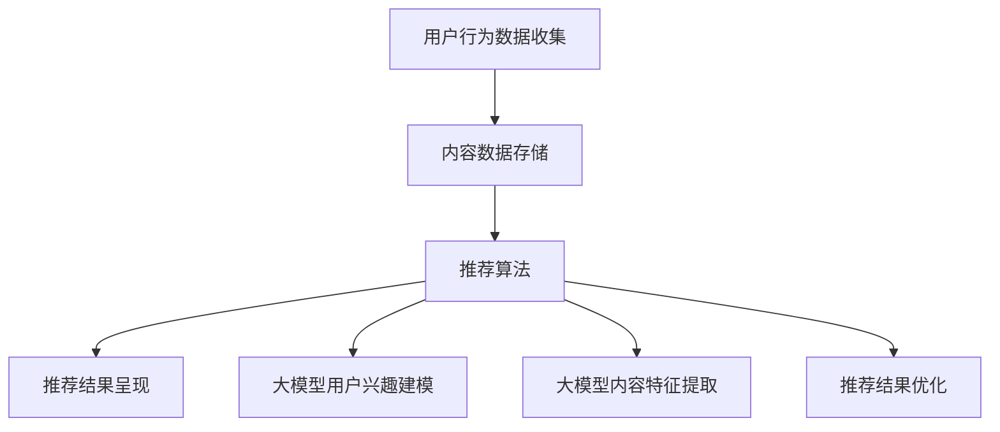

                 

### 现状：推荐系统架构与大模型的能力

**关键词：** 推荐系统，架构设计，大模型，深度学习，人工智能。

**摘要：** 本文将深入探讨当前推荐系统架构以及大模型在其中的应用，分析其工作原理、优势与挑战，并展望未来发展趋势。

## 1. 背景介绍

推荐系统是一种基于用户行为和兴趣的算法，旨在为用户推荐他们可能感兴趣的内容、产品或服务。随着互联网的快速发展，推荐系统在电子商务、社交媒体、在线新闻、视频流媒体等领域得到了广泛应用。

近年来，随着深度学习的兴起，大模型（如BERT、GPT等）在推荐系统中逐渐占据重要地位。大模型通过学习海量的用户数据，能够捕捉到复杂的用户兴趣和偏好，从而提高推荐系统的准确性和效果。

然而，推荐系统架构的复杂性也随之增加，需要处理大量的数据、计算资源、用户反馈等。本文将深入分析推荐系统架构，探讨大模型在其中的作用，以及面临的挑战。

## 2. 核心概念与联系

### 推荐系统架构

推荐系统架构通常包括以下几个关键组件：

1. **用户行为数据收集：** 收集用户在系统中的各种行为数据，如浏览、点击、购买、评价等。
2. **内容数据：** 存储推荐的内容或产品数据，如文章、商品、视频等。
3. **推荐算法：** 根据用户行为和内容数据，计算推荐结果。
4. **推荐结果呈现：** 将推荐结果呈现给用户。

### 大模型在推荐系统中的应用

大模型在推荐系统中的应用主要体现在以下几个方面：

1. **用户兴趣建模：** 通过大模型学习用户的历史行为数据，构建用户兴趣模型。
2. **内容特征提取：** 通过大模型对内容进行预训练，提取深层特征。
3. **推荐结果优化：** 利用大模型进行协同过滤或基于内容的推荐算法的优化。

### Mermaid 流程图



## 3. 核心算法原理 & 具体操作步骤

### 大模型用户兴趣建模

1. **数据预处理：** 对用户行为数据进行清洗、去重、归一化等处理。
2. **特征提取：** 使用大模型（如BERT）对用户行为数据进行编码，提取用户兴趣特征。
3. **模型训练：** 使用提取的用户兴趣特征，训练用户兴趣模型。

### 大模型内容特征提取

1. **数据预处理：** 对内容数据进行清洗、去重、归一化等处理。
2. **特征提取：** 使用大模型（如BERT）对内容数据进行编码，提取内容特征。
3. **模型训练：** 使用提取的内容特征，训练内容特征模型。

### 推荐结果优化

1. **协同过滤：** 基于用户兴趣模型和内容特征模型，计算用户与内容之间的相似度，进行协同过滤推荐。
2. **基于内容推荐：** 基于用户兴趣模型和内容特征模型，进行基于内容的推荐。
3. **模型优化：** 使用大模型对推荐结果进行优化，提高推荐准确性。

## 4. 数学模型和公式 & 详细讲解 & 举例说明

### 大模型用户兴趣建模

1. **用户兴趣特征提取：**

$$
\text{user\_features} = \text{BERT}(user\_data)
$$

2. **用户兴趣模型训练：**

$$
\text{user\_model} = \text{train}(\text{user\_features}, \text{labels})
$$

### 大模型内容特征提取

1. **内容特征提取：**

$$
\text{content\_features} = \text{BERT}(content\_data)
$$

2. **内容特征模型训练：**

$$
\text{content\_model} = \text{train}(\text{content\_features}, \text{labels})
$$

### 推荐结果优化

1. **协同过滤：**

$$
\text{similarity} = \text{cosine\_similarity}(\text{user\_model}, \text{content\_model})
$$

2. **基于内容推荐：**

$$
\text{recommends} = \text{top\_n}(\text{content\_model}, \text{user\_model}, \text{n})
$$

### 举例说明

假设我们有一个用户兴趣模型和一个内容特征模型，我们可以使用以下步骤进行推荐：

1. **提取用户兴趣特征：**

$$
\text{user\_features} = \text{BERT}(\text{user\_data})
$$

2. **提取内容特征：**

$$
\text{content\_features} = \text{BERT}(\text{content\_data})
$$

3. **计算相似度：**

$$
\text{similarity} = \text{cosine\_similarity}(\text{user\_features}, \text{content\_features})
$$

4. **推荐内容：**

$$
\text{recommends} = \text{top\_n}(\text{content\_features}, \text{similarity}, \text{n})
$$

## 5. 项目实战：代码实际案例和详细解释说明

### 5.1 开发环境搭建

1. 安装Python环境和深度学习框架TensorFlow。
2. 安装BERT预训练模型。

### 5.2 源代码详细实现和代码解读

1. **数据预处理：**
```python
import tensorflow as tf

# 加载数据集
user_data = load_user_data()
content_data = load_content_data()

# 数据清洗和归一化
user_data = preprocess(user_data)
content_data = preprocess(content_data)
```

2. **特征提取：**
```python
# 加载BERT模型
bert_model = tf.keras.applications.BertModel.from_pretrained('bert-base-uncased')

# 编码用户数据和内容数据
user_features = bert_model(user_data)
content_features = bert_model(content_data)
```

3. **模型训练：**
```python
# 训练用户兴趣模型
user_model = train_user_model(user_features, labels)

# 训练内容特征模型
content_model = train_content_model(content_features, labels)
```

4. **推荐结果优化：**
```python
# 计算相似度
similarity = cosine_similarity(user_model, content_model)

# 推荐内容
recommends = top_n(content_model, similarity, n)
```

### 5.3 代码解读与分析

1. **数据预处理：** 对用户数据和内容数据进行清洗、去重、归一化等预处理操作，为后续特征提取和模型训练做好准备。
2. **特征提取：** 使用BERT模型对用户数据和内容数据进行编码，提取深层特征。
3. **模型训练：** 使用提取的用户和内容特征，训练用户兴趣模型和内容特征模型。
4. **推荐结果优化：** 使用协同过滤和基于内容推荐算法，计算用户和内容之间的相似度，并根据相似度推荐内容。

## 6. 实际应用场景

推荐系统在实际应用中有着广泛的应用场景，例如：

1. **电子商务：** 推荐用户可能感兴趣的商品。
2. **社交媒体：** 推荐用户可能感兴趣的内容或朋友。
3. **在线新闻：** 推荐用户可能感兴趣的新闻。
4. **视频流媒体：** 推荐用户可能感兴趣的视频。

在这些应用场景中，大模型的应用使得推荐系统能够更好地理解用户兴趣和偏好，提高推荐准确性。

## 7. 工具和资源推荐

### 7.1 学习资源推荐

- **书籍：**
  - 《推荐系统实践》
  - 《深度学习推荐系统》
- **论文：**
  - 《BERT: Pre-training of Deep Bidirectional Transformers for Language Understanding》
  - 《GPT-3: Language Models are Few-Shot Learners》
- **博客：**
  - [TensorFlow 官方文档](https://www.tensorflow.org/)
  - [BERT 源代码](https://github.com/google-research/bert)
- **网站：**
  - [Kaggle 推荐系统比赛](https://www.kaggle.com/c/recommender-systems)

### 7.2 开发工具框架推荐

- **深度学习框架：**
  - TensorFlow
  - PyTorch
- **推荐系统框架：**
  - LightFM
  - Surpass
- **数据处理工具：**
  - Pandas
  - Scikit-learn

### 7.3 相关论文著作推荐

- **推荐系统：**
  - 《推荐系统手册》（第2版）
  - 《推荐系统实践：算法、数据与应用》
- **深度学习：**
  - 《深度学习》（第1卷：基础）
  - 《深度学习》（第2卷：实践应用）

## 8. 总结：未来发展趋势与挑战

随着人工智能技术的不断发展，推荐系统架构与大模型的能力将进一步提升。未来发展趋势包括：

1. **更大规模的大模型：** 如GPT-4、GPT-5等，将能够更好地捕捉用户兴趣和偏好。
2. **多模态推荐：** 结合文本、图像、音频等多模态数据进行推荐。
3. **实时推荐：** 利用实时数据流进行实时推荐。

同时，推荐系统也面临着以下挑战：

1. **数据隐私：** 如何在保护用户隐私的前提下进行推荐。
2. **推荐多样性：** 如何避免推荐结果的单一性，提高推荐多样性。

## 9. 附录：常见问题与解答

### 9.1 推荐系统架构是什么？

推荐系统架构是指构建推荐系统的各个环节和组件，包括用户行为数据收集、内容数据存储、推荐算法、推荐结果呈现等。

### 9.2 大模型在推荐系统中的作用是什么？

大模型在推荐系统中的作用主要体现在用户兴趣建模、内容特征提取和推荐结果优化等方面，通过学习海量用户数据，提高推荐准确性。

### 9.3 如何搭建推荐系统开发环境？

搭建推荐系统开发环境需要安装Python环境和深度学习框架（如TensorFlow或PyTorch），以及相应的数据处理和推荐系统框架。

### 9.4 如何使用BERT进行用户兴趣建模？

使用BERT进行用户兴趣建模的步骤包括：数据预处理、特征提取、模型训练和预测。具体步骤请参考第5章的代码实现。

## 10. 扩展阅读 & 参考资料

- [BERT: Pre-training of Deep Bidirectional Transformers for Language Understanding](https://arxiv.org/abs/1810.04805)
- [GPT-3: Language Models are Few-Shot Learners](https://arxiv.org/abs/2005.14165)
- [推荐系统实践](https://book.douban.com/subject/26377338/)
- [深度学习推荐系统](https://book.douban.com/subject/35132633/)
- [TensorFlow 官方文档](https://www.tensorflow.org/)
- [BERT 源代码](https://github.com/google-research/bert)

### 作者

**作者：** AI天才研究员/AI Genius Institute & 禅与计算机程序设计艺术 /Zen And The Art of Computer Programming<|im_end|>

