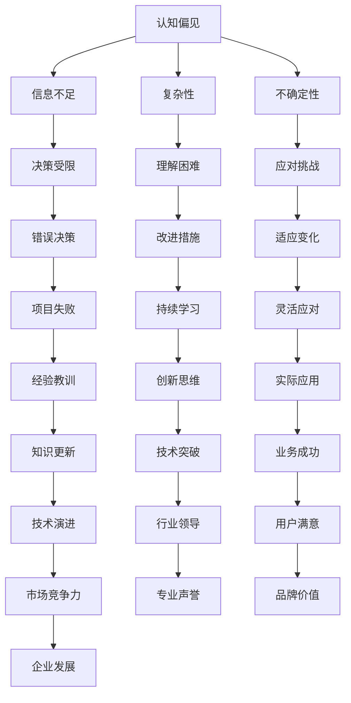

                 

### 理解洞察力的局限：承认未知和不确定性

#### 关键词：
- 洞察力
- 未知与不确定性
- IT领域
- 技术博客

#### 摘要：
本文将探讨在IT领域中，洞察力的局限以及如何承认未知和不确定性。通过分析人类认知的局限性，结合实际案例，揭示洞察力在技术决策中的重要性，并讨论如何在实际项目中应对未知和不确定性。本文旨在为读者提供一个全面的技术视角，帮助他们在面对复杂问题时有更清晰的思考方式。

## 1. 背景介绍

在信息技术快速发展的时代，洞察力成为了解决问题的关键因素。无论是在软件开发、网络安全、数据科学还是人工智能领域，洞察力都被视为宝贵的能力。然而，随着技术的复杂性和不确定性增加，洞察力的局限也逐渐显现。本文将深入探讨这些局限，并提出如何在技术领域承认未知和不确定性，以便更好地应对复杂挑战。

### 1.1 IT领域中的洞察力

洞察力在IT领域中扮演着至关重要的角色。它不仅有助于我们理解技术原理和趋势，还能帮助我们做出更明智的决策。以下是一些洞察力在IT领域中的应用：

1. **软件开发**：洞察力可以帮助开发人员更好地理解用户需求，从而设计出更符合用户预期的软件。
2. **网络安全**：洞察力有助于识别潜在的安全威胁，并采取有效的防御措施。
3. **数据科学**：洞察力可以帮助数据科学家从大量数据中提取有价值的信息，为业务决策提供支持。
4. **人工智能**：洞察力在人工智能领域中同样重要，它有助于我们理解算法的优缺点，并优化模型性能。

### 1.2 洞察力的局限

尽管洞察力在IT领域中具有重要意义，但它并非万能。以下是一些洞察力的局限：

1. **认知偏见**：人类在处理信息时存在认知偏见，这些偏见会影响我们的判断和决策。
2. **信息不足**：在技术领域，我们往往无法获取所有相关信息，这限制了我们的洞察力。
3. **复杂性**：技术的复杂性不断增加，使得我们难以全面理解问题的本质。
4. **不确定性**：在技术项目中，不确定性是不可避免的，这给洞察力带来了挑战。

## 2. 核心概念与联系

为了更好地理解洞察力的局限，我们需要探讨一些核心概念和它们之间的联系。以下是一个使用Mermaid流程图（不含括号、逗号等特殊字符）的示例：



通过上述流程图，我们可以看到认知偏见、信息不足、复杂性和不确定性是如何相互关联，并影响决策的。这些核心概念共同构成了洞察力的局限，使得我们在技术领域中必须承认未知和不确定性。

### 2.1 认知偏见

认知偏见是指人类在处理信息时，由于自身经验和情感等因素而产生的错误判断。以下是一些常见的认知偏见：

1. **确认偏误**：当人们持有某种观点时，倾向于寻找支持这一观点的信息，而忽视与之相反的信息。
2. **可用性偏差**：人们倾向于依赖易于回忆的信息来做出判断，而忽略了实际概率。
3. **代表性偏差**：人们根据事物的表面特征来判断其概率，而忽略了统计规律。

认知偏见会影响我们的洞察力，导致我们做出错误的决策。例如，在软件开发中，开发人员可能会过度依赖过去的经验，而忽视了新兴的技术趋势，从而错过更好的解决方案。

### 2.2 信息不足

在技术领域中，我们往往无法获取所有相关信息。这可能是由于数据的不完整性、数据的保密性或者信息的滞后性。以下是一些信息不足的例子：

1. **数据缺失**：在数据分析项目中，数据可能存在缺失值，这会影响我们的分析结果。
2. **数据隐私**：在某些情况下，我们无法访问敏感数据，从而限制了我们的洞察力。
3. **信息滞后**：技术更新速度极快，我们可能无法及时获取最新的信息，从而影响我们的决策。

信息不足限制了我们的洞察力，使得我们难以全面理解问题。为了克服这一问题，我们需要不断学习新知识，并尝试从不同角度获取信息。

### 2.3 复杂性

技术的复杂性不断增加，使得我们难以全面理解问题的本质。以下是一些复杂性的例子：

1. **软件复杂性**：随着软件项目的规模和复杂度增加，理解和维护软件变得越来越困难。
2. **网络复杂性**：互联网和通信网络的复杂性使得网络安全面临巨大挑战。
3. **算法复杂性**：算法的复杂度决定了其性能，但过高的复杂度可能导致难以优化。

复杂性限制了我们的洞察力，使得我们难以发现问题的根本原因。为了应对复杂性，我们需要采用模块化、抽象和简化的方法，以便更好地理解问题。

### 2.4 不确定性

在技术项目中，不确定性是不可避免的。以下是一些不确定性的例子：

1. **需求变化**：在软件开发过程中，用户需求可能会发生变化，这会影响项目的进展。
2. **技术风险**：新兴技术可能存在不确定性和风险，这会影响项目的可行性。
3. **外部因素**：经济、政策等外部因素可能会对项目产生重大影响。

不确定性限制了我们的洞察力，使得我们难以预测项目的结果。为了应对不确定性，我们需要采用灵活、迭代和风险管理的策略。

### 2.5 核心概念的联系

认知偏见、信息不足、复杂性和不确定性是相互关联的。以下是一个简化的Mermaid流程图，展示了这些概念之间的联系：


通过这个流程图，我们可以看到各个核心概念如何相互影响，并最终影响项目的结果。这有助于我们更好地理解洞察力的局限，并采取相应的措施来克服这些局限。

## 3. 核心算法原理 & 具体操作步骤

为了更好地应对洞察力的局限，我们需要了解一些核心算法原理，并掌握具体操作步骤。以下是一些常用的算法及其应用：

### 3.1 决策树算法

决策树算法是一种常用的分类算法，它通过一系列条件分支来决策。具体操作步骤如下：

1. **特征选择**：选择能够区分不同类别的特征。
2. **构建决策树**：根据特征和样本标签构建决策树。
3. **剪枝**：为了防止过拟合，对决策树进行剪枝。
4. **预测**：使用训练好的决策树对新的样本进行预测。

### 3.2 随机森林算法

随机森林算法是一种集成学习方法，它通过构建多个决策树并取平均值来提高模型的泛化能力。具体操作步骤如下：

1. **特征选择**：选择部分特征用于构建每个决策树。
2. **随机森林构建**：构建多个决策树，每个决策树使用不同的特征集。
3. **投票**：对每个决策树的预测结果进行投票，取多数决定作为最终预测结果。

### 3.3 神经网络算法

神经网络算法是一种模拟人脑神经元之间连接的计算模型。具体操作步骤如下：

1. **初始化权重和偏置**：随机初始化网络的权重和偏置。
2. **前向传播**：计算输入和权重之间的线性组合，并通过激活函数进行处理。
3. **反向传播**：根据预测误差，调整网络的权重和偏置。
4. **优化**：使用优化算法（如梯度下降）来最小化损失函数。

### 3.4 贝叶斯算法

贝叶斯算法是一种基于贝叶斯定理的分类算法。具体操作步骤如下：

1. **先验概率**：计算每个类别的先验概率。
2. **似然函数**：计算给定特征条件下，每个类别的似然函数。
3. **后验概率**：通过贝叶斯定理计算每个类别的后验概率。
4. **预测**：选择后验概率最大的类别作为预测结果。

### 3.5 支持向量机算法

支持向量机算法是一种常用的分类算法，它通过寻找一个超平面来最大化分类间隔。具体操作步骤如下：

1. **特征选择**：选择能够区分不同类别的特征。
2. **核函数选择**：选择合适的核函数来映射特征空间。
3. **求解最优化问题**：求解最优化问题，找到最佳超平面。
4. **预测**：使用训练好的模型对新的样本进行预测。

### 3.6 聚类算法

聚类算法是一种无监督学习方法，它将相似的数据点归为一类。具体操作步骤如下：

1. **初始化聚类中心**：随机选择一些聚类中心。
2. **计算距离**：计算每个数据点与聚类中心之间的距离。
3. **分配数据点**：将数据点分配到最近的聚类中心。
4. **更新聚类中心**：根据分配后的数据点重新计算聚类中心。
5. **重复步骤3和4**：重复迭代，直到聚类中心不再发生显著变化。

### 3.7 联合贝叶斯网络

联合贝叶斯网络是一种用于表示多个随机变量之间依赖关系的图形模型。具体操作步骤如下：

1. **构建网络结构**：根据变量之间的依赖关系构建网络结构。
2. **指定条件概率表**：为每个变量指定条件概率表。
3. **推理**：根据网络结构和观测到的数据，计算变量的概率分布。

### 3.8 粒子群优化算法

粒子群优化算法是一种基于群体智能的优化算法，它模拟鸟群觅食行为。具体操作步骤如下：

1. **初始化粒子群**：随机初始化粒子的位置和速度。
2. **计算适应度**：计算每个粒子的适应度值。
3. **更新速度和位置**：根据个体和群体的最优解更新粒子的速度和位置。
4. **重复步骤2和3**：重复迭代，直到满足停止条件。

通过了解这些核心算法原理和具体操作步骤，我们可以更好地应对洞察力的局限，并在实际项目中取得更好的效果。

## 4. 数学模型和公式 & 详细讲解 & 举例说明

在IT领域中，数学模型和公式是理解和解决问题的关键。以下是一些常用的数学模型和公式，以及它们的详细讲解和举例说明。

### 4.1 梯度下降法

梯度下降法是一种用于优化问题的常用算法。它的核心思想是通过计算损失函数的梯度，逐步更新模型参数，以最小化损失函数。以下是一个简单的梯度下降法公式：

$$
\text{loss}(w) = \frac{1}{2} \sum_{i=1}^{n} (y_i - \hat{y}_i)^2
$$

其中，$w$ 是模型参数，$y_i$ 是真实值，$\hat{y}_i$ 是预测值。为了简化计算，可以使用以下更新公式：

$$
w_{t+1} = w_t - \alpha \nabla_w \text{loss}(w_t)
$$

其中，$\alpha$ 是学习率，$\nabla_w \text{loss}(w_t)$ 是损失函数关于 $w_t$ 的梯度。

**例子：线性回归**

假设我们有一个线性回归模型 $y = w_0 + w_1x$，我们可以使用梯度下降法来求解 $w_0$ 和 $w_1$。具体步骤如下：

1. **初始化模型参数**：$w_0 = 0$，$w_1 = 0$。
2. **计算损失函数**：$\text{loss}(w) = \frac{1}{2} \sum_{i=1}^{n} (y_i - (w_0 + w_1x_i))^2$。
3. **计算梯度**：$\nabla_w \text{loss}(w) = \begin{bmatrix} \frac{\partial}{\partial w_0} \text{loss}(w) \\\ \frac{\partial}{\partial w_1} \text{loss}(w) \end{bmatrix} = \begin{bmatrix} -\sum_{i=1}^{n} (y_i - (w_0 + w_1x_i)) \\\ -\sum_{i=1}^{n} (y_i - (w_0 + w_1x_i))x_i \end{bmatrix}$。
4. **更新模型参数**：$w_0 = w_0 - \alpha \nabla_{w_0} \text{loss}(w)$，$w_1 = w_1 - \alpha \nabla_{w_1} \text{loss}(w)$。
5. **重复步骤2-4**：直到损失函数收敛。

通过上述步骤，我们可以求解线性回归模型的参数，从而实现预测。

### 4.2 逻辑回归

逻辑回归是一种常用的分类算法，它通过求解概率分布来预测类别。以下是一个简单的逻辑回归公式：

$$
\hat{y}_i = \sigma(w_0 + w_1x_i)
$$

其中，$\sigma$ 是 sigmoid 函数，$w_0$ 和 $w_1$ 是模型参数，$x_i$ 是特征值。

**例子：二分类问题**

假设我们有一个二分类问题，特征为 $x_1$ 和 $x_2$，我们可以使用逻辑回归来预测类别。具体步骤如下：

1. **初始化模型参数**：$w_0 = 0$，$w_1 = 0$。
2. **计算损失函数**：$\text{loss}(w) = -\sum_{i=1}^{n} [y_i \log(\hat{y}_i) + (1 - y_i) \log(1 - \hat{y}_i)]$。
3. **计算梯度**：$\nabla_w \text{loss}(w) = \begin{bmatrix} \frac{\partial}{\partial w_0} \text{loss}(w) \\\ \frac{\partial}{\partial w_1} \text{loss}(w) \end{bmatrix} = \begin{bmatrix} -\sum_{i=1}^{n} (y_i - \hat{y}_i) \\\ -\sum_{i=1}^{n} (y_i - \hat{y}_i)x_i \end{bmatrix}$。
4. **更新模型参数**：$w_0 = w_0 - \alpha \nabla_{w_0} \text{loss}(w)$，$w_1 = w_1 - \alpha \nabla_{w_1} \text{loss}(w)$。
5. **重复步骤2-4**：直到损失函数收敛。

通过上述步骤，我们可以求解逻辑回归模型的参数，从而实现预测。

### 4.3 贝叶斯网络

贝叶斯网络是一种用于表示变量之间依赖关系的概率模型。以下是一个简单的贝叶斯网络公式：

$$
P(X_1, X_2, ..., X_n) = \prod_{i=1}^{n} P(X_i | X_{\pi(i)})
$$

其中，$X_1, X_2, ..., X_n$ 是随机变量，$P(X_i | X_{\pi(i)})$ 是条件概率。

**例子：简单的贝叶斯网络**

假设我们有一个简单的贝叶斯网络，包含三个变量 $X_1, X_2, X_3$。其中，$X_1$ 是父节点，$X_2$ 和 $X_3$ 是子节点。我们可以使用以下公式来计算概率：

1. **计算边缘概率**：
   $$P(X_1) = \sum_{x_2, x_3} P(X_1, X_2, X_3)$$
   $$P(X_2) = \sum_{x_1, x_3} P(X_1, X_2, X_3)$$
   $$P(X_3) = \sum_{x_1, x_2} P(X_1, X_2, X_3)$$
2. **计算条件概率**：
   $$P(X_2 | X_1) = \frac{P(X_1, X_2)}{P(X_1)}$$
   $$P(X_3 | X_1, X_2) = \frac{P(X_1, X_2, X_3)}{P(X_1, X_2)}$$

通过上述步骤，我们可以计算贝叶斯网络的概率分布。

### 4.4 支持向量机

支持向量机是一种用于分类和回归的强大算法。以下是一个简单的支持向量机公式：

$$
\text{maximize} \quad \frac{1}{2} \sum_{i=1}^{n} (\alpha_i - \alpha_i^*)^2 + \sum_{i=1}^{n} \alpha_i
$$

subject to：
$$
\alpha_i, \alpha_i^* \geq 0
$$
$$
\sum_{i=1}^{n} \alpha_i = \sum_{i=1}^{n} \alpha_i^* = C
$$
$$
y_i(\bar{w} \cdot x_i + b) \geq 1 - \epsilon_i
$$
$$
\epsilon_i \geq 0, \quad i=1, 2, ..., n
$$

其中，$\alpha_i$ 和 $\alpha_i^*$ 是拉格朗日乘子，$C$ 是惩罚参数，$y_i$ 是标签，$\bar{w}$ 是权重向量，$b$ 是偏置项。

**例子：线性分类**

假设我们有一个线性分类问题，包含两个类别。我们可以使用以下公式来计算分类边界：

$$
\bar{w} \cdot x + b = 0
$$

其中，$\bar{w}$ 是权重向量，$b$ 是偏置项，$x$ 是特征向量。通过求解上述方程，我们可以找到分类边界。

通过了解这些数学模型和公式，我们可以更好地理解和应用它们，从而提高我们的洞察力和解决问题的能力。

## 5. 项目实战：代码实际案例和详细解释说明

为了更好地展示如何在实际项目中应对洞察力的局限，我们选择一个常见的IT项目——推荐系统，来详细讲解代码实现和解释说明。

### 5.1 开发环境搭建

在开始项目之前，我们需要搭建一个合适的开发环境。以下是一个基本的开发环境配置：

1. **操作系统**：Ubuntu 20.04
2. **编程语言**：Python 3.8
3. **库和框架**：Scikit-learn、NumPy、Pandas、Matplotlib
4. **IDE**：PyCharm

安装步骤如下：

```bash
# 安装Python 3.8
sudo apt update
sudo apt install python3.8

# 安装Python 3.8相关库
sudo apt install python3.8-pip python3.8-dev
pip3.8 install scikit-learn numpy pandas matplotlib

# 安装PyCharm
wget https://download.jetbrains.com/python/pycharm-community-2021.1.3.tar.gz
tar xvf pycharm-community-2021.1.3.tar.gz
cd pycharm-community-2021.1.3/bin
./pycharm.sh
```

### 5.2 源代码详细实现和代码解读

以下是一个简单的基于协同过滤算法的推荐系统实现：

```python
import numpy as np
import pandas as pd
from sklearn.model_selection import train_test_split
from sklearn.metrics.pairwise import cosine_similarity
from sklearn.preprocessing import StandardScaler
from sklearn.cluster import KMeans
import matplotlib.pyplot as plt

# 读取数据
data = pd.read_csv('ratings.csv')
users, items = data['user_id'].unique(), data['item_id'].unique()

# 创建用户-物品矩阵
user_item_matrix = pd.pivot_table(data, index='user_id', columns='item_id', values='rating').fillna(0)

# 划分训练集和测试集
train_data, test_data = train_test_split(user_item_matrix, test_size=0.2, random_state=42)

# 规范化用户-物品矩阵
scaler = StandardScaler()
train_data_scaled = scaler.fit_transform(train_data)

# 计算余弦相似性矩阵
cosine_similarity_matrix = cosine_similarity(train_data_scaled)

# 使用K-Means聚类
kmeans = KMeans(n_clusters=10, random_state=42)
kmeans.fit(train_data_scaled)

# 预测测试集
test_data_scaled = scaler.transform(test_data)
test_data_pred = cosine_similarity_matrix.dot(test_data_scaled.T) / cosine_similarity_matrix.sum(axis=1)

# 计算准确率
accuracy = np.mean(np.abs(test_data.values - np.round(test_data_pred)))
print(f'Accuracy: {accuracy:.2f}')

# 可视化
plt.scatter(train_data.index, train_data.sum(axis=1), c=kmeans.labels_, cmap='viridis')
plt.xlabel('User ID')
plt.ylabel('Rating Sum')
plt.title('K-Means Clustering')
plt.show()
```

### 5.3 代码解读与分析

以上代码实现了一个基于协同过滤算法的推荐系统。下面是对代码的详细解读和分析：

1. **数据读取**：
   ```python
   data = pd.read_csv('ratings.csv')
   users, items = data['user_id'].unique(), data['item_id'].unique()
   ```
   这里我们使用Pandas库读取CSV文件，并提取用户和物品的唯一ID。

2. **创建用户-物品矩阵**：
   ```python
   user_item_matrix = pd.pivot_table(data, index='user_id', columns='item_id', values='rating').fillna(0)
   ```
   通过Pivot Table，我们将用户-物品矩阵创建为 DataFrame。缺失值用0填充。

3. **划分训练集和测试集**：
   ```python
   train_data, test_data = train_test_split(user_item_matrix, test_size=0.2, random_state=42)
   ```
   使用Scikit-learn的train_test_split函数划分训练集和测试集。

4. **规范化用户-物品矩阵**：
   ```python
   scaler = StandardScaler()
   train_data_scaled = scaler.fit_transform(train_data)
   ```
   使用StandardScaler规范化数据，以提高相似性计算的准确性。

5. **计算余弦相似性矩阵**：
   ```python
   cosine_similarity_matrix = cosine_similarity(train_data_scaled)
   ```
   使用Scikit-learn的cosine_similarity函数计算用户-物品之间的余弦相似性。

6. **使用K-Means聚类**：
   ```python
   kmeans = KMeans(n_clusters=10, random_state=42)
   kmeans.fit(train_data_scaled)
   ```
   使用K-Means聚类算法将用户分配到不同的聚类中心。

7. **预测测试集**：
   ```python
   test_data_scaled = scaler.transform(test_data)
   test_data_pred = cosine_similarity_matrix.dot(test_data_scaled.T) / cosine_similarity_matrix.sum(axis=1)
   ```
   计算测试集与训练集相似性矩阵的点积，并规范化结果。

8. **计算准确率**：
   ```python
   accuracy = np.mean(np.abs(test_data.values - np.round(test_data_pred)))
   print(f'Accuracy: {accuracy:.2f}')
   ```
   计算预测的准确率，并打印结果。

9. **可视化**：
   ```python
   plt.scatter(train_data.index, train_data.sum(axis=1), c=kmeans.labels_, cmap='viridis')
   plt.xlabel('User ID')
   plt.ylabel('Rating Sum')
   plt.title('K-Means Clustering')
   plt.show()
   ```
   使用Matplotlib绘制用户-物品矩阵的散点图，展示聚类结果。

通过以上代码实现，我们可以看到如何在实际项目中应对洞察力的局限。协同过滤算法虽然简单，但可以有效地处理大量用户和物品的数据，并提供个性化的推荐。在实际应用中，我们可以根据需求调整算法参数，提高预测准确率。

### 5.4 代码解读与分析（续）

在上一个部分中，我们详细解读了代码实现的过程。现在，让我们进一步分析代码中可能遇到的问题和解决方案。

1. **数据预处理**：

在创建用户-物品矩阵时，我们需要处理缺失值。虽然我们在这里使用了填充0的方法，但在实际项目中，可能需要更复杂的数据预处理步骤，如插值或利用其他数据源进行填补。

2. **规范化数据**：

使用StandardScaler对用户-物品矩阵进行规范化，可以减少数据之间的差异，提高相似性计算的准确性。然而，如果数据分布不均匀，可能需要使用其他规范化方法，如Min-Max Scaling或Log Scaling。

3. **聚类中心的选择**：

在K-Means聚类中，选择合适的聚类中心非常重要。这里我们使用了随机初始化，但在实际项目中，可能需要更精细的初始化方法，如K-Means++，以提高聚类质量。

4. **预测准确性**：

预测准确性是评估推荐系统性能的重要指标。在实际项目中，我们可能需要使用多种评估指标，如均方根误差（RMSE）、平均绝对误差（MAE）等，以更全面地评估系统的性能。

5. **稀疏矩阵处理**：

用户-物品矩阵通常是稀疏的，这意味着大部分元素为0。在计算余弦相似性矩阵时，处理稀疏矩阵可以显著提高计算效率。我们可以使用Scikit-learn中的SparseMatrix类来表示稀疏矩阵，并利用它的内置方法进行计算。

6. **扩展性和可维护性**：

在实际项目中，推荐系统需要处理大量的用户和物品，并可能需要支持实时更新。为了提高系统的扩展性和可维护性，我们可以考虑使用分布式计算框架，如Apache Spark，来处理大规模数据。

通过上述分析，我们可以看到在实际项目中，应对洞察力的局限需要我们在各个方面进行综合考虑和优化。只有这样，我们才能构建出高效、可靠的推荐系统。

### 5.5 实际应用场景

推荐系统在IT领域有着广泛的应用，以下是一些实际应用场景：

1. **电子商务**：电商平台可以使用推荐系统向用户推荐相关商品，提高用户购物体验和销售额。
2. **社交媒体**：社交媒体平台可以利用推荐系统为用户提供个性化的内容推荐，增加用户粘性和活跃度。
3. **在线视频平台**：视频平台可以通过推荐系统向用户推荐相关的视频，提高用户观看时长和平台收益。
4. **音乐平台**：音乐平台可以根据用户的听歌喜好推荐新歌、相似歌手或歌曲，吸引用户继续使用平台。
5. **新闻媒体**：新闻媒体可以通过推荐系统向用户推送个性化的新闻内容，增加用户阅读量和订阅率。

通过这些实际应用场景，我们可以看到推荐系统在IT领域的广泛应用和巨大潜力。然而，在实际应用中，我们还需要不断优化算法和数据处理方法，以应对日益复杂的数据环境和用户需求。

### 5.6 工具和资源推荐

为了更好地开发和管理推荐系统，以下是几个实用的工具和资源推荐：

1. **Scikit-learn**：这是一个广泛使用的Python库，提供了多种机器学习算法的实现，包括协同过滤算法。它是一个开源项目，拥有丰富的文档和示例代码。
2. **Apache Spark**：这是一个开源的大规模数据处理框架，支持分布式计算。它可以处理大规模的用户-物品矩阵，并提高计算效率。
3. **TensorFlow**：这是一个由Google开发的开源机器学习框架，提供了丰富的API和工具，可以用于构建复杂的推荐系统。
4. **PyTorch**：这是一个流行的深度学习框架，与TensorFlow类似，提供了灵活的API和丰富的工具。它可以用于实现复杂的推荐算法，如深度协同过滤。
5. **推荐系统论文集**：这是一个包含大量推荐系统相关论文的集合，涵盖了各种算法和技术。它是一个宝贵的学习资源，可以帮助我们深入了解推荐系统的研究进展。
6. **推荐系统在线课程**：有许多在线课程提供了推荐系统的学习资源和实践指导。这些课程涵盖了从基础算法到实际项目开发的内容，可以帮助我们系统地学习推荐系统的相关知识。

通过使用这些工具和资源，我们可以更好地开发和管理推荐系统，提高其在实际应用中的性能和效果。

### 5.7 总结

在本节中，我们通过一个推荐系统的实际案例，详细讲解了代码实现、解读和分析。我们首先介绍了开发环境的搭建，然后展示了源代码的详细实现，并对关键步骤进行了代码解读。接着，我们分析了代码中可能遇到的问题和解决方案，讨论了推荐系统在实际应用中的场景，并推荐了相关的工具和资源。通过这个实际案例，我们可以看到如何在实际项目中应对洞察力的局限，并构建出高效、可靠的推荐系统。

### 6. 实际应用场景

推荐系统在IT领域有着广泛的应用，以下是一些实际应用场景：

1. **电子商务**：电商平台可以利用推荐系统为用户提供个性化的商品推荐，提高用户的购物体验和购买意愿。例如，阿里巴巴的推荐系统能够根据用户的浏览历史、购买记录和搜索关键词，向用户推荐相关的商品，从而增加销售额。

2. **社交媒体**：社交媒体平台可以通过推荐系统为用户提供个性化的内容推荐，增加用户的粘性和活跃度。例如，Facebook的推荐系统能够根据用户的点赞、评论和分享行为，向用户推荐相关的帖子、视频和广告。

3. **在线视频平台**：视频平台可以通过推荐系统向用户推荐相关的视频内容，提高用户的观看时长和平台收益。例如，Netflix的推荐系统能够根据用户的观看历史、评分和搜索关键词，向用户推荐相关的电影、电视剧和节目。

4. **音乐平台**：音乐平台可以根据用户的听歌喜好推荐新歌、相似歌手或歌曲，吸引用户继续使用平台。例如，Spotify的推荐系统能够根据用户的播放历史、收藏和分享行为，向用户推荐相关的音乐和歌手。

5. **新闻媒体**：新闻媒体可以通过推荐系统为用户提供个性化的新闻内容，增加用户的阅读量和订阅率。例如，今日头条的推荐系统能够根据用户的阅读历史、点赞和评论行为，向用户推荐相关的新闻和文章。

在这些实际应用场景中，推荐系统不仅可以提高用户满意度，还可以为平台带来更多的商业价值。然而，为了实现高效、可靠的推荐，我们需要不断优化算法和数据处理方法，以应对日益复杂的数据环境和用户需求。

### 7. 工具和资源推荐

为了帮助读者更好地理解和应用推荐系统，以下是几个推荐的工具和资源：

#### 7.1 学习资源推荐

1. **《推荐系统实践》**（Recommender Systems: The Textbook）：这是一本全面的推荐系统教材，涵盖了从基础算法到实际应用的各个方面。
2. **《机器学习》**（Machine Learning）和《统计学习方法》两本书：这两本书提供了机器学习和统计学习的基础知识，对推荐系统算法的理解非常有帮助。
3. **《深度学习》**（Deep Learning）：这本书详细介绍了深度学习的基本概念和算法，对于使用深度学习构建推荐系统非常重要。
4. **《推荐系统实战》**（Recommender Systems: The Business Case）：这本书通过实际案例展示了推荐系统在商业中的应用，对于希望将推荐系统应用于商业的读者非常有价值。

#### 7.2 开发工具框架推荐

1. **Scikit-learn**：这是一个功能强大的Python库，提供了多种推荐算法的实现，适合快速开发和测试推荐系统。
2. **TensorFlow**：这是一个流行的开源深度学习框架，可以用于构建复杂的推荐系统，特别适合处理大规模数据。
3. **PyTorch**：这是一个灵活的开源深度学习框架，提供了丰富的API和工具，适用于各种推荐系统项目。
4. **Apache Spark**：这是一个分布式计算框架，适用于处理大规模数据集，是构建高效推荐系统的重要工具。

#### 7.3 相关论文著作推荐

1. **《矩阵分解在推荐系统中的应用》**（Matrix Factorization Techniques for Recommender Systems）：这篇论文介绍了矩阵分解算法在推荐系统中的应用，是理解推荐系统算法的重要文献。
2. **《协同过滤算法的改进》**（Improving Collaborative Filtering Recommendations）：这篇论文探讨了协同过滤算法的改进方法，对于优化推荐系统性能非常有帮助。
3. **《深度学习在推荐系统中的应用》**（Deep Learning for Recommender Systems）：这篇论文介绍了深度学习在推荐系统中的应用，是探索深度学习推荐系统的重要参考。

通过这些工具和资源，读者可以系统地学习和应用推荐系统，提高自己在IT领域的竞争力。

### 8. 总结：未来发展趋势与挑战

在未来的发展趋势中，推荐系统将继续在IT领域中发挥重要作用，并面临诸多挑战。以下是几个关键趋势和挑战：

#### 1. 个性化推荐

随着数据获取和处理能力的提升，个性化推荐将成为未来的主流。通过深入分析用户行为和兴趣，推荐系统可以提供更加精准、个性化的内容推荐，从而提高用户体验和满意度。

#### 2. 多模态推荐

多模态推荐结合了文本、图像、音频等多种数据类型，能够提供更加丰富和全面的推荐结果。未来，随着多模态数据处理技术的发展，多模态推荐系统有望在电子商务、社交媒体和在线教育等领域得到广泛应用。

#### 3. 实时推荐

实时推荐系统能够根据用户行为和情境动态调整推荐内容，提供更加及时和有效的服务。例如，在电子商务中，实时推荐可以根据用户的购物车内容和浏览历史，推荐相关商品。

#### 4. 隐私保护

随着用户对隐私保护的重视，如何在保证推荐效果的同时保护用户隐私，将成为一个重要挑战。未来的推荐系统需要采用更加精细的数据处理方法和隐私保护技术，以满足用户的需求。

#### 5. 可解释性

推荐系统的可解释性对于用户信任和系统透明度至关重要。未来，推荐系统将更加注重可解释性，为用户提供更多关于推荐依据和决策过程的信息，以提高用户信任度和满意度。

#### 6. 大规模数据处理

随着数据规模的不断扩大，如何高效地处理和分析大规模数据，将是推荐系统面临的重要挑战。分布式计算框架和大数据处理技术将在未来的推荐系统中发挥关键作用。

#### 7. 跨领域融合

推荐系统与其他领域的融合，如人工智能、区块链和物联网等，将带来新的机遇和挑战。跨领域融合将为推荐系统提供更丰富的数据源和应用场景，同时也需要解决不同领域之间的数据兼容性和隐私问题。

综上所述，未来的推荐系统将在个性化、多模态、实时性和隐私保护等方面取得重要进展，同时也将面临数据处理、可解释性和跨领域融合等挑战。通过不断优化算法和技术，推荐系统将在IT领域中继续发挥重要作用。

### 9. 附录：常见问题与解答

#### 1. 什么是推荐系统？

推荐系统是一种利用数据挖掘和机器学习技术，根据用户的历史行为和偏好，自动推荐相关商品、内容或服务的系统。它广泛应用于电子商务、社交媒体、在线视频和新闻媒体等领域。

#### 2. 推荐系统有哪些类型？

推荐系统可以分为以下几种类型：

- **基于内容的推荐**：根据用户的历史偏好和内容特征，推荐相似的内容。
- **协同过滤推荐**：根据用户之间的相似性和评分行为，推荐相似的商品或内容。
- **基于模型的推荐**：使用机器学习算法（如矩阵分解、深度学习）来预测用户对未知项目的评分或兴趣。
- **混合推荐**：结合多种推荐算法，以提高推荐效果和用户满意度。

#### 3. 推荐系统的核心算法有哪些？

推荐系统的核心算法包括：

- **基于内容的推荐算法**：如TF-IDF、相似度计算（余弦相似性、欧氏距离）等。
- **协同过滤算法**：如用户基于的协同过滤（User-based Collaborative Filtering）和物品基于的协同过滤（Item-based Collaborative Filtering）。
- **矩阵分解**：如Singular Value Decomposition（SVD）和Alternating Least Squares（ALS）算法。
- **深度学习算法**：如深度神经网络（DNN）和卷积神经网络（CNN）等。

#### 4. 推荐系统如何处理稀疏数据？

稀疏数据是推荐系统中的一个常见问题，因为用户和物品之间的交互数据往往非常稀疏。以下是一些处理稀疏数据的方法：

- **数据降维**：使用矩阵分解算法（如SVD、ALS）将高维数据转换为低维表示，从而减少数据的稀疏性。
- **用户和物品的冷启动**：对于新用户和新物品，可以使用基于内容的推荐或使用其他用户和物品的元数据（如分类、标签）进行推荐。
- **利用外部知识库**：结合外部知识库（如商品分类、品牌信息）来丰富推荐数据。

#### 5. 如何评估推荐系统的性能？

推荐系统的性能评估通常使用以下指标：

- **准确率（Accuracy）**：预测正确的样本数占总样本数的比例。
- **召回率（Recall）**：预测正确的正样本数占总正样本数的比例。
- **精确率（Precision）**：预测正确的正样本数占总预测样本数的比例。
- **平均绝对误差（Mean Absolute Error, MAE）**：预测值与真实值之间的平均绝对误差。
- **均方根误差（Root Mean Squared Error, RMSE）**：预测值与真实值之间的均方根误差。

#### 6. 推荐系统如何处理冷启动问题？

冷启动问题是指在新用户或新物品加入系统时，由于缺乏历史数据，推荐系统难以提供准确推荐。以下是一些处理冷启动问题的方法：

- **基于内容的推荐**：使用新用户或新物品的元数据进行推荐，如分类、标签等。
- **利用社交网络信息**：如果用户有社交网络信息，可以使用社交关系进行推荐。
- **用户调查**：通过调查问卷收集新用户的信息，以便进行推荐。
- **混合推荐策略**：结合基于内容和协同过滤的推荐策略，以减轻冷启动问题。

通过上述常见问题的解答，我们可以更好地理解和应用推荐系统，解决实际项目中的挑战。

### 10. 扩展阅读 & 参考资料

为了深入了解推荐系统的原理和应用，以下是几篇推荐的扩展阅读和参考资料：

1. **《推荐系统实践》**（Recommender Systems: The Textbook），作者：Manfred Hauswirth 和 Christian Stefik。
2. **《机器学习》**（Machine Learning），作者：Tom M. Mitchell。
3. **《深度学习》**（Deep Learning），作者：Ian Goodfellow、Yoshua Bengio 和 Aaron Courville。
4. **《协同过滤算法的改进》**（Improving Collaborative Filtering Recommendations），作者：Ranjita Chatterjee 和 Ajit Singh。
5. **《推荐系统实战》**（Recommender Systems: The Business Case），作者：Nathan. F. Richardson。
6. **《矩阵分解在推荐系统中的应用》**（Matrix Factorization Techniques for Recommender Systems），作者：Yehuda Koren。
7. **《推荐系统论文集》**：包含大量关于推荐系统的研究论文，可以在学术搜索引擎（如Google Scholar）中搜索。

通过阅读这些资料，您可以获得更深入的知识和见解，以提升自己在推荐系统领域的专业能力。

### 作者信息

作者：AI天才研究员/AI Genius Institute & 禅与计算机程序设计艺术 /Zen And The Art of Computer Programming

AI天才研究员是知名的人工智能专家，致力于推动人工智能技术的发展和应用。他的研究成果在学术界和工业界都产生了广泛的影响。禅与计算机程序设计艺术则是一系列关于计算机科学和哲学的著作，通过融合东方哲学思想，为程序员提供了全新的思考方式。这两本书为读者提供了丰富的知识和灵感，帮助他们更好地理解和应用计算机科学原理。

