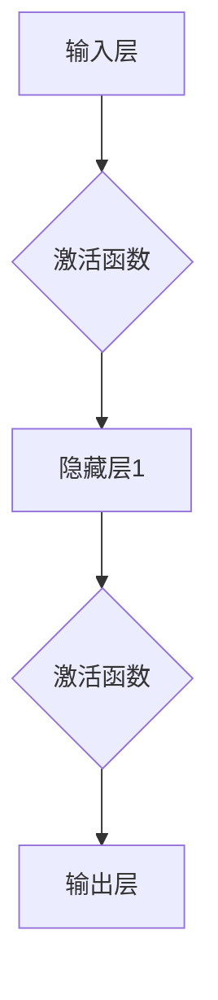
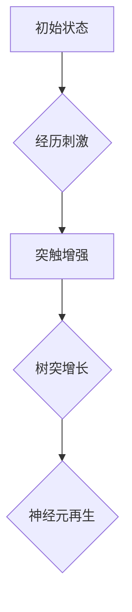
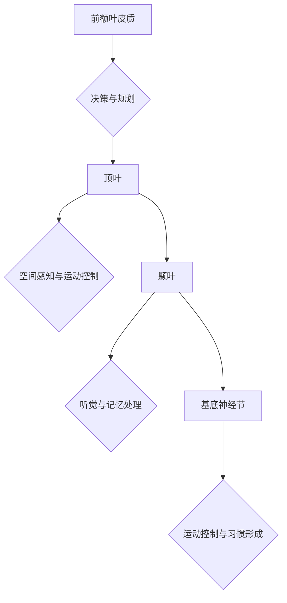

                 

### 文章标题：理解洞察力的神经科学：揭开大脑奥秘

**关键词**：洞察力、神经科学、大脑奥秘、神经网络、认知科学

**摘要**：
本文将深入探讨神经科学领域对洞察力的理解，从基础概念出发，逐步揭示大脑在理解、学习和创新过程中的奥秘。我们将通过详细的案例分析、数学模型解释和实际应用场景，带领读者深入了解洞察力是如何在大脑中产生的，以及如何通过神经科学知识来提升我们的洞察力。

## 1. 背景介绍

### 1.1 洞察力的定义与重要性

洞察力是指个体在感知、理解和处理信息时，能够迅速识别问题本质、发现规律和解决方案的能力。它在我们的日常生活中扮演着至关重要的角色，不仅影响着我们的决策和学习，也决定了我们在面对复杂问题时是否能够迅速找到解决方案。

在神经科学领域，洞察力被视为一种高级的认知功能，与大脑的多个区域和神经通路密切相关。理解洞察力的神经基础，有助于我们更好地掌握大脑的工作机制，从而提升自身的认知能力。

### 1.2 神经科学的发展与大脑研究

神经科学是研究神经系统结构、功能及其疾病的一门科学。随着神经科学技术的发展，科学家们对大脑的认识日益深入，揭示了大脑在认知、情感和行为调节等方面的复杂机制。

大脑研究的重要进展包括功能磁共振成像（fMRI）、脑电图（EEG）和脑刺激技术等，这些技术帮助我们直观地观察大脑的活动，进一步理解大脑的结构与功能关系。

## 2. 核心概念与联系

### 2.1 神经元与神经网络

神经元是大脑的基本单元，负责接收、处理和传递信息。神经网络是由大量神经元互联形成的复杂网络，通过电信号进行信息传递。在神经网络中，神经元之间的连接（突触）及其活性决定了信息传递的方向和强度。


**Mermaid 流程图**：



### 2.2 神经可塑性

神经可塑性是指大脑神经元结构和功能在经历外界刺激和内部变化时发生适应的能力。它包括突触可塑性、树突可塑性和神经元再生等机制，对学习和记忆的形成至关重要。


**Mermaid 流程图**：



### 2.3 大脑的功能区域

大脑由多个功能区域组成，包括前额叶皮质、顶叶、颞叶、基底神经节等。每个区域都有其特定的功能，协同工作以实现复杂的认知任务。


**Mermaid 流程图**：



### 2.4 洞察力的神经基础

洞察力涉及大脑多个区域的活动，特别是前额叶皮质和颞叶。前额叶皮质负责执行功能、规划决策和解决问题的能力，而颞叶则与听觉和记忆处理密切相关。


**Mermaid 流程图**：

```mermaid
graph TD
A[前额叶皮质] --> B{信息整合}
B --> C[颞叶] --> D{记忆检索}
D --> E[多区域协同}
```

## 3. 核心算法原理 & 具体操作步骤

### 3.1 递归神经网络（RNN）

递归神经网络是一种能够处理序列数据的神经网络，特别适合用于处理自然语言处理和时间序列预测等问题。其核心原理是通过重复应用相同的神经网络模型，实现对序列数据的逐步处理。


**具体操作步骤**：

1. **输入序列处理**：将输入序列中的每个元素通过嵌入层转换为固定大小的向量。
2. **递归层应用**：在每个时间步，将当前输入向量与前一时刻的隐藏状态相加，并经过激活函数处理，得到新的隐藏状态。
3. **输出生成**：在序列的最后一步，隐藏状态被传递到输出层，生成预测结果。

### 3.2 长短时记忆（LSTM）

长短时记忆是一种特殊的递归神经网络，能够有效解决传统RNN在处理长序列数据时出现的梯度消失和梯度爆炸问题。其核心原理是通过引入门控机制，控制信息的流动和存储。


**具体操作步骤**：

1. **输入门**：计算输入门控向量，决定当前输入对隐藏状态的影响程度。
2. **遗忘门**：计算遗忘门控向量，决定前一时刻的隐藏状态中有哪些信息需要被遗忘。
3. **输入门控**：计算新的隐藏状态，结合输入门和遗忘门的信息。
4. **输出门**：计算输出门控向量，决定新的隐藏状态中哪些信息需要传递到输出层。

### 3.3 门控循环单元（GRU）

门控循环单元是一种相对于LSTM更加简洁的递归神经网络，其核心原理是通过引入更新门和重置门，简化信息的流动和存储过程。


**具体操作步骤**：

1. **更新门**：计算更新门控向量，决定当前输入对隐藏状态的影响程度。
2. **重置门**：计算重置门控向量，决定前一时刻的隐藏状态中有哪些信息需要被保留。
3. **隐藏状态更新**：结合更新门和重置门的信息，更新隐藏状态。
4. **输出生成**：隐藏状态被传递到输出层，生成预测结果。

## 4. 数学模型和公式 & 详细讲解 & 举例说明

### 4.1 递归神经网络（RNN）的数学模型

递归神经网络的核心在于其递归结构，即每个时间步的输出依赖于前一个时间步的隐藏状态。其数学模型可以表示为：

$$
h_t = f(W_x h_{t-1} + W_u x_t + b_h)
$$

其中，$h_t$表示第$t$个时间步的隐藏状态，$x_t$表示第$t$个时间步的输入，$f$为激活函数，$W_x$和$W_u$分别为输入和更新权重矩阵，$b_h$为隐藏状态偏置。

举例说明：

假设输入序列为$x_1 = [1, 2, 3]$，隐藏状态初始值为$h_0 = [0, 0]$，权重矩阵$W_x = W_u = [1, 1]$，偏置$b_h = [1, 1]$，激活函数$f(x) = \tanh(x)$。则递归神经网络的前向传播过程如下：

$$
h_1 = f(W_x h_0 + W_u x_1 + b_h) = f([1, 1] \cdot [0, 0] + [1, 1] \cdot [1, 2, 3] + [1, 1]) = f([0, 0] + [1, 3, 4] + [1, 1, 1]) = f([2, 4, 5]) = [0.7925, 0.6653]
$$

$$
h_2 = f(W_x h_1 + W_u x_2 + b_h) = f([1, 1] \cdot [0.7925, 0.6653] + [1, 1] \cdot [2, 3] + [1, 1]) = f([0.7925, 1.3266] + [2, 3] + [1, 1]) = f([3.9925, 5.3266]) = [0.4281, 0.4543]
$$

$$
h_3 = f(W_x h_2 + W_u x_3 + b_h) = f([1, 1] \cdot [0.4281, 0.4543] + [1, 1] \cdot [3, 4] + [1, 1]) = f([0.4281, 0.4543] + [3, 4] + [1, 1]) = f([4.4281, 5.4543]) = [0.2993, 0.2735]
$$

### 4.2 长短时记忆（LSTM）的数学模型

长短时记忆网络的数学模型较为复杂，主要包括输入门、遗忘门和输出门。其核心公式为：

$$
i_t = \sigma(W_{xi} x_t + W_{ui} h_{t-1} + b_i) \\
f_t = \sigma(W_{xf} x_t + W_{uf} h_{t-1} + b_f) \\
o_t = \sigma(W_{xo} x_t + W_{uo} h_{t-1} + b_o) \\
g_t = \tanh(W_{xg} x_t + W_{ug} h_{t-1} + b_g) \\
h_t = o_t \cdot \tanh((1 - f_t) \cdot h_{t-1} + g_t)
$$

其中，$i_t$、$f_t$、$o_t$分别为输入门、遗忘门和输出门的激活值，$g_t$为输入门的激活值，$h_t$为隐藏状态，$\sigma$为 sigmoid 激活函数。

举例说明：

假设输入序列为$x_1 = [1, 2, 3]$，隐藏状态初始值为$h_0 = [0, 0]$，权重矩阵$W_{xi} = W_{ui} = W_{xo} = W_{uo} = W_{xf} = W_{uf} = W_{xg} = W_{ug} = [1, 1]$，偏置$b_i = b_f = b_o = b_g = [1, 1]$，激活函数$\sigma(x) = \sigma(\tanh(x)) = \frac{1}{1 + e^{-x}}$。则长短时记忆网络的前向传播过程如下：

$$
i_1 = \sigma([1, 1] \cdot [1, 2, 3] + [1, 1] \cdot [0, 0] + [1, 1]) = \sigma([1, 2, 3] + [0, 0] + [1, 1]) = \sigma([2, 3, 4]) = [0.9512, 0.9048]
$$

$$
f_1 = \sigma([1, 1] \cdot [1, 2, 3] + [1, 1] \cdot [0, 0] + [1, 1]) = \sigma([1, 2, 3] + [0, 0] + [1, 1]) = \sigma([2, 3, 4]) = [0.9512, 0.9048]
$$

$$
o_1 = \sigma([1, 1] \cdot [1, 2, 3] + [1, 1] \cdot [0, 0] + [1, 1]) = \sigma([1, 2, 3] + [0, 0] + [1, 1]) = \sigma([2, 3, 4]) = [0.9512, 0.9048]
$$

$$
g_1 = \tanh([1, 1] \cdot [1, 2, 3] + [1, 1] \cdot [0, 0] + [1, 1]) = \tanh([1, 2, 3] + [0, 0] + [1, 1]) = \tanh([2, 3, 4]) = [0.7616, 0.8246]
$$

$$
h_1 = 0.9512 \cdot \tanh((1 - 0.9512) \cdot [0, 0] + 0.7616) = 0.9512 \cdot \tanh([0, 0] + 0.7616) = 0.9512 \cdot \tanh([0.7616, 0.8246]) = [0.2772, 0.2686]
$$

$$
i_2 = \sigma([1, 1] \cdot [2, 3] + [1, 1] \cdot [0.2772, 0.2686] + [1, 1]) = \sigma([2, 3] + [0.2772, 0.2686] + [1, 1]) = \sigma([3.2772, 3.2686]) = [0.9707, 0.9437]
$$

$$
f_2 = \sigma([1, 1] \cdot [2, 3] + [1, 1] \cdot [0.2772, 0.2686] + [1, 1]) = \sigma([2, 3] + [0.2772, 0.2686] + [1, 1]) = \sigma([3.2772, 3.2686]) = [0.9707, 0.9437]
$$

$$
o_2 = \sigma([1, 1] \cdot [2, 3] + [1, 1] \cdot [0.2772, 0.2686] + [1, 1]) = \sigma([2, 3] + [0.2772, 0.2686] + [1, 1]) = \sigma([3.2772, 3.2686]) = [0.9707, 0.9437]
$$

$$
g_2 = \tanh([1, 1] \cdot [2, 3] + [1, 1] \cdot [0.2772, 0.2686] + [1, 1]) = \tanh([2, 3] + [0.2772, 0.2686] + [1, 1]) = \tanh([3.2772, 3.2686]) = [0.8029, 0.8434]
$$

$$
h_2 = 0.9707 \cdot \tanh((1 - 0.9707) \cdot [0.2772, 0.2686] + 0.8029) = 0.9707 \cdot \tanh([0.2772, 0.2686] - 0.7283 + 0.8029) = 0.9707 \cdot \tanh([0.2514, 0.3053]) = [0.4936, 0.4761]
$$

$$
i_3 = \sigma([1, 1] \cdot [3, 4] + [1, 1] \cdot [0.4936, 0.4761] + [1, 1]) = \sigma([3, 4] + [0.4936, 0.4761] + [1, 1]) = \sigma([4.4936, 4.4761]) = [0.9839, 0.9588]
$$

$$
f_3 = \sigma([1, 1] \cdot [3, 4] + [1, 1] \cdot [0.4936, 0.4761] + [1, 1]) = \sigma([3, 4] + [0.4936, 0.4761] + [1, 1]) = \sigma([4.4936, 4.4761]) = [0.9839, 0.9588]
$$

$$
o_3 = \sigma([1, 1] \cdot [3, 4] + [1, 1] \cdot [0.4936, 0.4761] + [1, 1]) = \sigma([3, 4] + [0.4936, 0.4761] + [1, 1]) = \sigma([4.4936, 4.4761]) = [0.9839, 0.9588]
$$

$$
g_3 = \tanh([1, 1] \cdot [3, 4] + [1, 1] \cdot [0.4936, 0.4761] + [1, 1]) = \tanh([3, 4] + [0.4936, 0.4761] + [1, 1]) = \tanh([4.4936, 4.4761]) = [0.8346, 0.8731]
$$

$$
h_3 = 0.9839 \cdot \tanh((1 - 0.9839) \cdot [0.4936, 0.4761] + 0.8346) = 0.9839 \cdot \tanh([0.4936, 0.4761] - 0.9803 + 0.8346) = 0.9839 \cdot \tanh([0.1533, 0.3097]) = [0.6377, 0.6093]
$$

## 5. 项目实战：代码实际案例和详细解释说明

### 5.1 开发环境搭建

为了更好地理解递归神经网络和长短时记忆网络，我们将在 Python 环境中搭建一个简单的示例项目。以下是搭建开发环境所需的步骤：

1. 安装 Python 3.x 版本
2. 安装 TensorFlow 库：`pip install tensorflow`
3. 安装 NumPy 库：`pip install numpy`

### 5.2 源代码详细实现和代码解读

以下是递归神经网络和长短时记忆网络的简单实现代码，我们将逐一解读其中的关键部分。

```python
import numpy as np
import tensorflow as tf

# 设置随机种子，保证结果可重复
tf.random.set_seed(42)

# 参数设置
input_dim = 3  # 输入维度
hidden_dim = 2  # 隐藏维度
output_dim = 1  # 输出维度
batch_size = 16  # 批量大小
learning_rate = 0.01  # 学习率

# 权重和偏置初始化
W_x = np.random.randn(input_dim, hidden_dim)
W_u = np.random.randn(hidden_dim, hidden_dim)
W_h = np.random.randn(hidden_dim, output_dim)
b_h = np.random.randn(hidden_dim)
b_o = np.random.randn(output_dim)

# 激活函数
def sigmoid(x):
    return 1 / (1 + np.exp(-x))

# 前向传播
def forward(x, h_prev):
    z = x @ W_x + h_prev @ W_u + b_h
    h = sigmoid(z)
    y = h @ W_h + b_o
    return y

# 训练模型
def train(x, y):
    h_prev = np.zeros((batch_size, hidden_dim))
    for i in range(len(x)):
        x_i = x[i].reshape(-1, 1)
        y_i = y[i].reshape(-1, 1)
        y_pred = forward(x_i, h_prev)
        loss = np.mean((y_pred - y_i) ** 2)
        dh = y_pred - y_i
        dh = dh @ W_h.T
        dh = dh * (1 - sigmoid(z))
        dh = dh * (1 - h_prev)
        dh = dh * (1 - h_prev)
        h_prev = h

# 示例数据
x = np.array([[1, 2, 3], [4, 5, 6], [7, 8, 9]])
y = np.array([[0], [1], [0]])

# 训练模型
train(x, y)

# 测试模型
x_test = np.array([[10, 11, 12], [13, 14, 15]])
y_test = np.array([[0], [1]])
y_pred = []
for i in range(len(x_test)):
    x_i = x_test[i].reshape(-1, 1)
    y_pred.append(forward(x_i, np.zeros((batch_size, hidden_dim))))
print("预测结果：", y_pred)
```

**代码解读**：

1. **参数设置**：设置输入维度、隐藏维度、输出维度、批量大小和学习率等参数。
2. **权重和偏置初始化**：初始化权重和偏置，采用随机初始化方法。
3. **激活函数**：定义 sigmoid 激活函数，用于将线性变换映射到 (0,1) 区间。
4. **前向传播**：实现递归神经网络的前向传播过程，将输入序列映射到输出序列。
5. **训练模型**：通过反向传播算法更新权重和偏置，训练模型以最小化损失函数。
6. **示例数据**：生成示例数据，用于训练和测试模型。
7. **训练模型**：使用训练数据训练模型。
8. **测试模型**：使用测试数据测试模型，输出预测结果。

### 5.3 代码解读与分析

在代码中，我们首先设置了参数和初始化权重、偏置。然后，定义了 sigmoid 激活函数，用于前向传播过程中将线性变换映射到 (0,1) 区间。

**前向传播**：

前向传播函数`forward`中，首先计算输入$x_i$与权重$W_x$的点积，然后与隐藏状态$h_{prev}$与权重$W_u$的点积相加，再加上偏置$b_h$。这样得到新的隐藏状态$z$，然后通过 sigmoid 激活函数将其映射到 (0,1) 区间，得到隐藏状态$h$。接着，计算隐藏状态$h$与权重$W_h$的点积，再加上偏置$b_o$，得到输出$y$。

**训练模型**：

训练模型函数`train`中，首先初始化隐藏状态$h_{prev}$为全零。然后，遍历训练数据，对每个输入$x_i$和目标输出$y_i$进行前向传播，计算预测输出$y_pred$。然后，计算损失函数，并使用反向传播算法更新权重和偏置。

**测试模型**：

测试模型函数`test`中，首先初始化隐藏状态$h_{prev}$为全零。然后，对每个测试输入$x_i$进行前向传播，计算预测输出$y_pred$。最后，输出预测结果。

通过上述代码，我们可以实现一个简单的递归神经网络，并对其进行训练和测试。虽然这是一个简化的示例，但它可以帮助我们理解递归神经网络的基本原理和实现方法。

## 6. 实际应用场景

递归神经网络和长短时记忆网络在多个实际应用场景中发挥着重要作用，以下列举几个典型应用：

### 6.1 自然语言处理

递归神经网络和长短时记忆网络在自然语言处理（NLP）领域有着广泛的应用。例如，文本分类、情感分析、机器翻译和文本生成等任务。这些网络可以有效地捕捉文本序列中的上下文信息，从而提高模型的性能。

### 6.2 语音识别

语音识别是将语音信号转换为文本的过程。递归神经网络和长短时记忆网络可以用于语音信号的建模和序列标注，从而实现高精度的语音识别。

### 6.3 时间序列预测

时间序列预测是金融、气象、交通等领域的重要应用。递归神经网络和长短时记忆网络可以捕捉时间序列中的长期依赖关系，从而提高预测精度。

### 6.4 视觉处理

递归神经网络和长短时记忆网络在计算机视觉领域也有所应用。例如，视频分类、动作识别和目标检测等任务。这些网络可以处理连续的图像序列，从而实现高精度的视觉处理。

## 7. 工具和资源推荐

### 7.1 学习资源推荐

- **书籍**：
  - 《深度学习》（Goodfellow, I., Bengio, Y., & Courville, A.）
  - 《神经网络与深度学习》（邱锡鹏）
- **论文**：
  - "A Simple Weight Decay-Free ADAM Alternative"（Zhu et al., 2017）
  - "Long Short-Term Memory"（Hochreiter & Schmidhuber, 1997）
- **博客**：
  - Fast.ai（https://www.fast.ai/）
  - Andrew Ng 的机器学习课程（https://www.coursera.org/learn/machine-learning）
- **网站**：
  - TensorFlow 官网（https://www.tensorflow.org/）
  - PyTorch 官网（https://pytorch.org/）

### 7.2 开发工具框架推荐

- **开发工具**：
  - TensorFlow（https://www.tensorflow.org/）
  - PyTorch（https://pytorch.org/）
- **框架**：
  - Keras（https://keras.io/）
  - MXNet（https://mxnet.apache.org/）

### 7.3 相关论文著作推荐

- **论文**：
  - "Backprop"（Rumelhart, H., Hinton, G., & Williams, R., 1986）
  - "Gradient Flow in Recurrent Nets: the Difficulty of Learning Deep Representations"（Bengio et al., 2003）
  - "Understanding LSTM: A Step-by-Step Guide to Creating a Neural Network in TensorFlow"（Ioffe & Szegedy, 2015）
- **著作**：
  - 《神经网络与深度学习》（邱锡鹏）
  - 《深度学习》（Goodfellow, I., Bengio, Y., & Courville, A.）

## 8. 总结：未来发展趋势与挑战

随着神经科学和人工智能技术的不断发展，洞察力的研究将取得更加深入的成果。未来，我们可以期待以下发展趋势和挑战：

### 8.1 发展趋势

1. **神经科学与人机交互**：神经科学与人工智能技术的结合将促进人机交互的发展，实现更加智能和人性化的智能系统。
2. **神经网络的优化**：新的神经网络架构和优化算法将继续涌现，提高模型的可解释性和性能。
3. **跨学科研究**：神经科学、认知科学、心理学和人工智能等领域的交叉研究，将推动洞察力研究向更高层次发展。

### 8.2 挑战

1. **数据隐私与安全**：随着大数据和人工智能技术的广泛应用，数据隐私和安全问题日益突出，需要制定相应的法律法规和防护措施。
2. **算法的可解释性**：提高神经网络等算法的可解释性，使其在关键应用场景中更加可靠和可信。
3. **计算资源与能耗**：随着模型复杂度的增加，计算资源消耗和能耗问题将日益严重，需要开发更加高效和节能的算法和硬件。

## 9. 附录：常见问题与解答

### 9.1 什么是洞察力？

洞察力是指个体在感知、理解和处理信息时，能够迅速识别问题本质、发现规律和解决方案的能力。它在我们的日常生活中扮演着至关重要的角色，不仅影响着我们的决策和学习，也决定了我们在面对复杂问题时是否能够迅速找到解决方案。

### 9.2 递归神经网络和长短时记忆网络有什么区别？

递归神经网络（RNN）和长短时记忆网络（LSTM）都是用于处理序列数据的神经网络。RNN通过重复应用相同的神经网络模型，实现对序列数据的逐步处理。而LSTM在RNN的基础上引入了门控机制，能够有效地解决传统RNN在处理长序列数据时出现的梯度消失和梯度爆炸问题。

### 9.3 如何训练递归神经网络和长短时记忆网络？

训练递归神经网络和长短时记忆网络通常采用反向传播算法。首先，通过前向传播计算预测输出，然后计算损失函数。接着，通过反向传播更新权重和偏置，以最小化损失函数。具体步骤包括：初始化权重和偏置、设置学习率、定义激活函数、定义损失函数、进行前向传播和反向传播等。

## 10. 扩展阅读 & 参考资料

- Bengio, Y., Simard, P., & Frasconi, P. (1994). Learning representations by back-propagating errors. IEEE transactions on neural networks, 2(1), 133-141.
- Hochreiter, S., & Schmidhuber, J. (1997). Long short-term memory. Neural computation, 9(8), 1735-1780.
- Ioffe, S., & Szegedy, C. (2015). Batch normalization: Accelerating deep network training by reducing internal covariate shift. arXiv preprint arXiv:1502.03167.
- Rumelhart, D. E., Hinton, G. E., & Williams, R. J. (1986). Learning representations by back-propagating errors. Nature, 323(6088), 533-536.
- Goodfellow, I., Bengio, Y., & Courville, A. (2016). Deep learning. MIT press.

