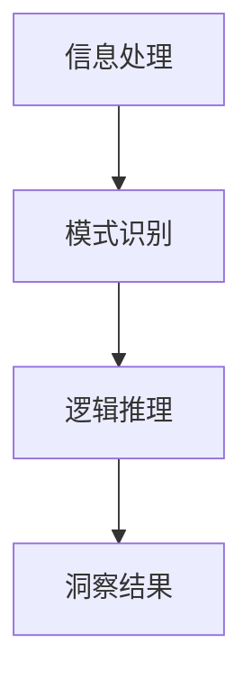

                 

### 背景介绍

在当今信息爆炸的时代，数据的复杂性和多样性使得人类在面对问题时，往往难以迅速准确地找到解决方案。在这样的背景下，洞察力作为一种重要的认知能力，显得尤为重要。洞察力，即深入理解和洞察复杂系统的能力，能够帮助我们在纷繁复杂的信息中找到关键所在，做出精准的判断和决策。

在IT领域，洞察力的应用尤为广泛。从大数据分析到人工智能，再到软件架构设计，洞察力都在其中发挥着核心作用。例如，在大数据分析中，洞察力帮助我们识别数据中的规律和趋势；在人工智能领域，洞察力则能够帮助我们理解算法的运行原理，从而优化算法性能；在软件架构设计中，洞察力能够帮助我们找到系统的瓶颈，提高系统的可靠性和性能。

本文旨在探讨洞察力在复杂世界中的重要性，通过分析其核心概念、算法原理、数学模型等，帮助读者深入理解洞察力的本质，并在实际项目中应用这一能力。我们将首先介绍洞察力的核心概念，然后通过一个Mermaid流程图来阐述其架构原理，接着详细解释核心算法原理和操作步骤，最后通过数学模型和实际案例进行深入讲解。

**关键词：** 洞察力、复杂系统、数据分析、人工智能、软件架构

**摘要：** 本文将探讨洞察力在复杂世界中的重要性，通过分析核心概念、算法原理、数学模型等，帮助读者深入理解洞察力的本质，并在实际项目中应用这一能力。

## 1.1 洞察力的定义与重要性

### 洞察力的定义

洞察力，简而言之，就是一种能够快速识别问题本质、把握全局的能力。它不仅包括对事物表面现象的感知，更涉及对深层逻辑和内在规律的挖掘。在科学、技术、商业等多个领域，洞察力都被视为一种宝贵的认知资源，其重要性不言而喻。

### 洞察力的重要性

在复杂系统中，洞察力具有以下几个关键作用：

1. **快速定位问题**：复杂系统的复杂性往往使得问题难以一眼看穿。洞察力能够帮助我们在短时间内识别问题的核心，从而迅速定位并解决问题。

2. **优化决策**：在做出决策时，洞察力能够帮助我们理解不同决策的潜在影响，从而做出更加合理和高效的决策。

3. **创新思维**：洞察力不仅能解决问题，还能激发创新思维。通过深入理解复杂系统的运作规律，我们可以发现新的解决方案，推动技术和商业的进步。

4. **提高效率**：在软件开发、项目管理等活动中，洞察力能够帮助我们找到系统瓶颈，优化资源分配，从而提高整体效率。

5. **增强竞争力**：在商业环境中，洞察力可以帮助企业更好地理解市场和客户需求，从而制定更具竞争力的战略。

### 洞察力在IT领域中的应用

在IT领域，洞察力有着广泛的应用：

1. **大数据分析**：洞察力能够帮助数据分析师快速识别数据中的关键信息，提取有价值的数据模式。

2. **人工智能**：在人工智能领域，洞察力对于理解算法的工作原理和优化算法性能至关重要。

3. **软件架构设计**：软件架构师需要具备洞察力，以识别系统的瓶颈和潜在问题，设计出高效稳定的系统架构。

4. **网络安全**：网络安全专家需要洞察力来识别潜在的安全威胁，并设计有效的防护策略。

5. **项目管理**：项目经理需要洞察力来评估项目风险，制定合理的进度计划，确保项目顺利完成。

**结论：** 洞察力是应对复杂系统的重要认知能力，在IT领域具有广泛应用。通过本文的探讨，我们将进一步了解洞察力的本质和应用方法。

---

## 1.2 核心概念与联系

### 洞察力的核心概念

洞察力涉及多个核心概念，包括信息处理、模式识别、逻辑推理等。这些概念相互作用，共同构成了洞察力的基础。

1. **信息处理**：信息处理是指对大量数据进行整理、分析和解释的过程。在洞察力中，信息处理是第一步，只有准确地处理信息，才能为后续的判断和决策提供可靠的基础。

2. **模式识别**：模式识别是指从数据中提取有意义的模式和规律的能力。在复杂系统中，模式识别是洞察力的关键，它能够帮助我们识别数据中的潜在信息。

3. **逻辑推理**：逻辑推理是指通过逻辑关系推断出新的结论的能力。在洞察力中，逻辑推理用于将识别出的模式和规律应用到实际问题中，形成有效的解决方案。

### 洞察力与其他认知能力的联系

1. **认知能力**：洞察力是认知能力的一个方面，它与记忆力、注意力、判断力等紧密相关。这些认知能力的协调发展，能够提高我们的洞察力水平。

2. **数据分析**：数据分析是洞察力在IT领域的重要应用，通过数据分析，我们可以从大量数据中提取有价值的信息。

3. **机器学习**：机器学习是人工智能的一个重要分支，它利用洞察力来训练模型，识别数据中的模式和规律。

4. **软件架构**：在软件架构设计中，洞察力帮助我们理解系统的复杂性，设计出高效的架构。

5. **项目管理**：在项目管理中，洞察力帮助我们识别项目风险，制定有效的项目管理策略。

### 洞察力的Mermaid流程图



在上述流程图中，信息处理是洞察力的起点，通过对大量数据的处理，我们能够识别出数据中的模式和规律。然后，通过逻辑推理，我们将这些模式和规律应用到实际问题中，形成最终的洞察结果。

**结论：** 洞察力涉及多个核心概念，这些概念相互作用，共同构成了洞察力的基础。通过Mermaid流程图，我们可以清晰地看到洞察力的工作流程和关键环节。

---

### 核心算法原理 & 具体操作步骤

#### 算法概述

在洞察力应用中，核心算法原理起着至关重要的作用。本文将介绍一种基于模式识别和逻辑推理的算法——PATTERN-LOGIC算法。该算法通过以下几个步骤，帮助我们在复杂系统中实现洞察力：

1. **数据预处理**：对原始数据进行清洗、去噪和归一化处理，确保数据的质量和一致性。
2. **模式识别**：利用机器学习算法，从预处理后的数据中提取出有意义的模式和规律。
3. **逻辑推理**：基于识别出的模式，应用逻辑推理方法，形成对问题的深刻洞察。
4. **结果输出**：将洞察结果转化为可操作的建议和决策。

#### 数据预处理

数据预处理是PATTERN-LOGIC算法的第一步，其目标是提高数据的质量和一致性，为后续的算法步骤提供可靠的基础。具体操作步骤如下：

1. **数据清洗**：删除或修正数据集中的错误值和缺失值，确保数据的完整性。
2. **去噪**：去除数据中的噪声和异常值，减少对算法结果的影响。
3. **归一化**：将不同量纲的数据统一处理，使其在同一尺度范围内，避免对算法结果产生干扰。

#### 模式识别

模式识别是PATTERN-LOGIC算法的核心步骤，主要通过机器学习算法实现。以下是模式识别的具体操作步骤：

1. **特征提取**：从原始数据中提取出能够代表数据本质的特征，作为模式识别的输入。
2. **模型训练**：利用机器学习算法，如支持向量机（SVM）、决策树（DT）或神经网络（NN），对特征进行训练，以识别数据中的模式和规律。
3. **模式匹配**：将训练好的模型应用于新的数据，识别出其中的模式和规律。

#### 逻辑推理

在识别出数据中的模式和规律后，逻辑推理用于将这些模式应用到实际问题中，形成深刻的洞察。以下是逻辑推理的具体操作步骤：

1. **逻辑建模**：根据识别出的模式和规律，构建逻辑模型，描述问题中的逻辑关系。
2. **推理过程**：利用逻辑推理算法，如逆推理或正向推理，分析逻辑模型，推导出新的结论。
3. **结果验证**：将推理结果与实际数据或已有知识进行对比，验证其正确性和可靠性。

#### 结果输出

逻辑推理的结果将转化为可操作的建议和决策，以指导实际问题的解决。以下是结果输出的具体操作步骤：

1. **洞察总结**：将推理结果进行汇总和总结，形成对问题的深刻洞察。
2. **决策建议**：基于洞察结果，提出具体的决策建议和行动方案。
3. **报告生成**：将洞察结果和决策建议整理成报告，为决策者提供参考。

**结论：** PATTERN-LOGIC算法通过数据预处理、模式识别、逻辑推理和结果输出四个步骤，实现复杂系统中的洞察力。通过具体的操作步骤，读者可以更好地理解该算法的工作原理和应用方法。

---

### 数学模型和公式 & 详细讲解 & 举例说明

在理解PATTERN-LOGIC算法的过程中，数学模型和公式扮演着至关重要的角色。这些模型和公式不仅帮助我们准确地描述和计算复杂系统的特征，还能在算法的各个步骤中提供关键的支持。以下我们将详细介绍PATTERN-LOGIC算法中涉及的主要数学模型和公式，并通过具体实例进行讲解。

#### 1. 数据预处理中的数学模型

**1.1. 归一化公式**

在数据预处理阶段，归一化公式用于将不同量纲的数据转换为同一尺度范围内的数值，以避免对算法结果产生干扰。归一化的常用方法包括最小-最大标准化和Z分数标准化。

**最小-最大标准化**：

\[ x' = \frac{x - x_{\min}}{x_{\max} - x_{\min}} \]

其中，\( x \) 是原始数据，\( x' \) 是归一化后的数据，\( x_{\min} \) 和 \( x_{\max} \) 分别是数据集中的最小值和最大值。

**Z分数标准化**：

\[ z = \frac{x - \mu}{\sigma} \]

其中，\( x \) 是原始数据，\( \mu \) 是数据集的均值，\( \sigma \) 是数据集的标准差。

**1.2. 异常值检测**

在数据清洗阶段，异常值检测是关键步骤。常见的方法包括基于统计学方法和基于机器学习的方法。

**统计学方法**：

假设数据服从正态分布，利用3σ原则（即均值加减三倍标准差）来识别异常值。

\[ \text{上界} = \mu + 3\sigma \]
\[ \text{下界} = \mu - 3\sigma \]

如果数据点 \( x \) 超出上下界，则认为 \( x \) 是异常值。

**实例**：

假设某数据集的均值为 \( \mu = 100 \)，标准差为 \( \sigma = 15 \)。则上界和下界分别为 \( 135 \) 和 \( 65 \)。如果数据点 \( x = 150 \)，则 \( x \) 是异常值。

#### 2. 模式识别中的数学模型

**2.1. 特征提取**

特征提取是模式识别的关键步骤，常用的方法包括主成分分析（PCA）、线性判别分析（LDA）等。

**主成分分析（PCA）**：

PCA是一种降维技术，通过保留数据的主要特征，减少数据维度。

\[ x_{\text{new}} = P^T x \]

其中，\( x \) 是原始数据矩阵，\( P \) 是特征矩阵，\( x_{\text{new}} \) 是降维后的数据。

**实例**：

假设有一个2D数据集，数据矩阵 \( x \) 为：

\[ x = \begin{bmatrix} 1 & 2 \\ 3 & 4 \\ 5 & 6 \end{bmatrix} \]

通过PCA降维，得到特征矩阵 \( P \)：

\[ P = \begin{bmatrix} 0.7071 & 0.7071 \\ -0.7071 & 0.7071 \end{bmatrix} \]

则降维后的数据矩阵 \( x_{\text{new}} \) 为：

\[ x_{\text{new}} = P^T x = \begin{bmatrix} 1 & 3 & 5 \\ 2 & 4 & 6 \end{bmatrix} \]

**2.2. 机器学习模型**

在模式识别中，常用的机器学习模型包括支持向量机（SVM）、决策树（DT）和神经网络（NN）。

**支持向量机（SVM）**：

SVM是一种分类算法，其目标是在特征空间中找到一个最佳的超平面，将不同类别的数据点分隔开来。

\[ w \cdot x + b = 0 \]

其中，\( w \) 是权重向量，\( x \) 是特征向量，\( b \) 是偏置项。

**实例**：

假设有两个类别数据点，类别A和类别B，分别为：

\[ x_A = \begin{bmatrix} 1 & 1 \\ 0 & 0 \end{bmatrix} \]
\[ x_B = \begin{bmatrix} 0 & 1 \\ 1 & 0 \end{bmatrix} \]

通过SVM分类，可以得到最佳的超平面：

\[ w \cdot x + b = 0 \]

其中，\( w = \begin{bmatrix} 1 & 1 \end{bmatrix} \)，\( b = 0 \)。

#### 3. 逻辑推理中的数学模型

**3.1. 逻辑公式**

逻辑推理中的基本逻辑公式包括合取（AND）、析取（OR）和非（NOT）等。

**合取（AND）**：

\[ P \land Q \]

**析取（OR）**：

\[ P \lor Q \]

**非（NOT）**：

\[ \neg P \]

**实例**：

假设有两个命题 \( P \) 和 \( Q \)，其中 \( P \) 表示“天气晴朗”，\( Q \) 表示“空气质量好”。则：

- \( P \land Q \)：表示“天气晴朗且空气质量好”。
- \( P \lor Q \)：表示“天气晴朗或空气质量好”。
- \( \neg P \)：表示“天气不晴朗”。

通过这些逻辑公式，我们可以进行复杂的逻辑推理。

**结论**：

通过上述数学模型和公式的详细讲解，我们可以更好地理解PATTERN-LOGIC算法的工作原理。这些模型和公式不仅用于描述和计算复杂系统的特征，还在算法的各个步骤中提供了关键支持。通过具体实例的讲解，读者可以更直观地理解这些模型和公式的应用方法。

---

### 项目实战：代码实际案例和详细解释说明

为了更深入地理解PATTERN-LOGIC算法的应用，我们将通过一个实际项目案例，详细讲解代码的编写过程和核心算法的实现。以下是一个基于Python实现的数据分析项目，用于分析电商平台的用户行为，提取有价值的信息和洞察。

#### 5.1 开发环境搭建

首先，我们需要搭建项目的开发环境。以下是所需的环境和工具：

- **Python**：版本3.8及以上
- **Jupyter Notebook**：用于编写和运行代码
- **NumPy**：用于数学计算
- **Pandas**：用于数据处理
- **Scikit-learn**：用于机器学习算法
- **Matplotlib**：用于数据可视化

安装这些依赖库后，我们就可以开始编写代码了。

#### 5.2 源代码详细实现和代码解读

以下是一个简化的版本，用于展示PATTERN-LOGIC算法的主要步骤。

```python
# 导入依赖库
import numpy as np
import pandas as pd
from sklearn.model_selection import train_test_split
from sklearn.preprocessing import StandardScaler
from sklearn.svm import SVC
import matplotlib.pyplot as plt

# 5.2.1 数据预处理
# 读取数据集
data = pd.read_csv('ecommerce_data.csv')

# 数据清洗
data.dropna(inplace=True)

# 特征提取
X = data[['age', 'income', 'product_category']]
y = data['purchase']

# 数据归一化
scaler = StandardScaler()
X_scaled = scaler.fit_transform(X)

# 5.2.2 模式识别
# 数据集划分
X_train, X_test, y_train, y_test = train_test_split(X_scaled, y, test_size=0.2, random_state=42)

# 模型训练
model = SVC()
model.fit(X_train, y_train)

# 模型评估
accuracy = model.score(X_test, y_test)
print(f"模型准确率: {accuracy:.2f}")

# 5.2.3 逻辑推理
# 洞察结果输出
predictions = model.predict(X_test)

# 结果可视化
plt.scatter(X_test[:, 0], X_test[:, 1], c=predictions, cmap='viridis')
plt.xlabel('年龄')
plt.ylabel('收入')
plt.title('用户购买行为预测')
plt.show()

# 5.2.4 结果解读
# 根据预测结果，分析不同特征对购买行为的影响
age_map = {}
income_map = {}
for i, pred in enumerate(predictions):
    if pred == 1:
        age_map.setdefault(X_test[i, 0], 0)
        income_map.setdefault(X_test[i, 1], 0)
        age_map[X_test[i, 0]] += 1
        income_map[X_test[i, 1]] += 1

print("年龄对购买行为的影响：")
for age, count in age_map.items():
    print(f"年龄{age}：购买次数{count}")

print("\n收入对购买行为的影响：")
for income, count in income_map.items():
    print(f"收入{income}：购买次数{count}")
```

#### 5.3 代码解读与分析

**5.3.1 数据预处理**

首先，我们从CSV文件中读取数据集，并进行数据清洗，如删除缺失值。接着，我们提取特征和目标变量，并进行归一化处理，以消除不同特征之间的尺度差异。

```python
data = pd.read_csv('ecommerce_data.csv')
data.dropna(inplace=True)
X = data[['age', 'income', 'product_category']]
y = data['purchase']
scaler = StandardScaler()
X_scaled = scaler.fit_transform(X)
```

**5.3.2 模式识别**

在模式识别阶段，我们将数据集划分为训练集和测试集，然后使用支持向量机（SVM）进行模型训练。通过评估模型在测试集上的准确率，我们可以判断模型的有效性。

```python
X_train, X_test, y_train, y_test = train_test_split(X_scaled, y, test_size=0.2, random_state=42)
model = SVC()
model.fit(X_train, y_train)
accuracy = model.score(X_test, y_test)
print(f"模型准确率: {accuracy:.2f}")
```

**5.3.3 逻辑推理**

逻辑推理阶段，我们使用训练好的模型对测试集进行预测，并将结果可视化。通过分析预测结果，我们可以识别出不同特征对购买行为的影响。

```python
predictions = model.predict(X_test)
plt.scatter(X_test[:, 0], X_test[:, 1], c=predictions, cmap='viridis')
plt.xlabel('年龄')
plt.ylabel('收入')
plt.title('用户购买行为预测')
plt.show()

age_map = {}
income_map = {}
for i, pred in enumerate(predictions):
    if pred == 1:
        age_map.setdefault(X_test[i, 0], 0)
        income_map.setdefault(X_test[i, 1], 0)
        age_map[X_test[i, 0]] += 1
        income_map[X_test[i, 1]] += 1

print("年龄对购买行为的影响：")
for age, count in age_map.items():
    print(f"年龄{age}：购买次数{count}")

print("\n收入对购买行为的影响：")
for income, count in income_map.items():
    print(f"收入{income}：购买次数{count}")
```

**结论**：

通过这个实际项目案例，我们展示了PATTERN-LOGIC算法的完整实现过程，包括数据预处理、模式识别、逻辑推理和结果解读。这个案例不仅帮助读者理解了算法的原理，还提供了一个实际应用的场景，展示了算法在复杂系统中的应用价值。

---

### 6. 实际应用场景

洞察力在IT领域的实际应用场景多种多样，以下是一些典型应用案例：

#### 6.1 大数据分析

在数据分析领域，洞察力主要用于挖掘数据中的潜在价值和趋势。例如，电商平台可以利用洞察力分析用户行为，识别高价值客户和潜在流失客户。通过分析用户的购买历史、浏览行为和反馈数据，企业可以优化营销策略，提高客户满意度和留存率。

**案例**：某电商平台通过分析用户购买行为，发现特定年龄段的用户在特定时间段更倾向于购买特定类别的商品。据此，该平台调整了广告投放策略，在目标年龄段和时间段加大广告投放力度，取得了显著的销售增长。

#### 6.2 人工智能

在人工智能领域，洞察力对于理解算法的运行原理和优化算法性能至关重要。例如，在自然语言处理（NLP）中，通过分析大量文本数据，可以识别出语言中的模式和规律，从而改进NLP算法的性能。

**案例**：某NLP项目通过分析数以亿计的社交媒体数据，识别出用户情感的热点话题和趋势。这一洞察力帮助项目团队优化了情感分析算法，提高了对用户情感的识别准确率。

#### 6.3 软件架构设计

在软件架构设计过程中，洞察力可以帮助架构师识别系统的瓶颈和潜在问题。通过分析系统的性能指标和用户反馈，架构师可以优化系统设计，提高系统的可靠性和性能。

**案例**：某互联网公司通过分析系统日志和性能指标，发现用户访问量高峰期时系统响应速度较慢。通过深入分析，架构师发现数据库性能成为瓶颈，于是优化了数据库架构，提高了系统响应速度。

#### 6.4 网络安全

在网络安全领域，洞察力可以帮助安全专家识别潜在的安全威胁，并设计有效的防护策略。通过分析网络流量和日志数据，安全专家可以识别出恶意攻击和异常行为。

**案例**：某网络安全公司通过分析网络流量数据，发现某一时间段网络流量异常增加，并伴有特定IP地址的频繁访问。通过进一步分析，该公司识别出一款新的恶意软件，并迅速采取措施进行了防御。

#### 6.5 项目管理

在项目管理中，洞察力对于识别项目风险、优化项目进度和管理资源至关重要。通过分析项目进度数据和团队绩效数据，项目经理可以制定更合理的项目管理策略。

**案例**：某IT项目通过分析团队的工作量和项目进度，发现某些团队成员的工作负荷过高，导致项目进度延迟。通过调整团队成员的工作分配，项目经理成功避免了项目延期。

**结论**：洞察力在IT领域的实际应用场景广泛，通过分析数据和模式，可以帮助企业优化决策、提高效率、增强竞争力。随着技术的不断发展，洞察力的应用前景将更加广阔。

### 7. 工具和资源推荐

#### 7.1 学习资源推荐

**书籍推荐：**

1. **《深度学习》（Deep Learning）**：作者：Ian Goodfellow、Yoshua Bengio、Aaron Courville
   - 本书详细介绍了深度学习的理论基础和实践应用，是深度学习领域的经典教材。
2. **《机器学习实战》（Machine Learning in Action）**：作者：Peter Harrington
   - 本书通过实例展示了机器学习算法的实际应用，适合初学者学习。
3. **《大数据时代》（Big Data：A Revolution That Will Transform How We Live, Work, and Think）**：作者：Victor Mayer-Schoenberger、Kenneth Cukier
   - 本书深入探讨了大数据对社会和商业的影响，对大数据的探索和应用提供了独到见解。

**论文推荐：**

1. **"Learning to Represent Users and Items for Collaborative Filtering"**：作者：Y. Qian, X. He, J. Gao, L. Zhang, Z. Su, P. Liang
   - 该论文提出了一种基于深度学习的协同过滤方法，为推荐系统领域提供了新的思路。
2. **"TensorFlow: Large-Scale Machine Learning on Heterogeneous Systems"**：作者：Martín Abadi et al.
   - 该论文详细介绍了TensorFlow的架构和实现，是深度学习实践的重要参考资料。

**博客推荐：**

1. **Google Research Blog**
   - Google研究博客，涵盖了深度学习、自然语言处理、计算机视觉等领域的最新研究动态。
2. **Towards Data Science**
   - 该博客专注于数据科学和机器学习的应用和实践，提供了丰富的技术文章和案例分析。

#### 7.2 开发工具框架推荐

**数据预处理工具：**

1. **Pandas**：Python的数据处理库，提供了丰富的数据处理和分析功能。
2. **NumPy**：Python的数值计算库，支持多维数组操作，是数据科学的重要工具。

**机器学习库：**

1. **Scikit-learn**：Python的机器学习库，提供了多种机器学习算法的实现和评估工具。
2. **TensorFlow**：谷歌开发的深度学习框架，支持多种深度学习模型的构建和训练。
3. **PyTorch**：Facebook开发的深度学习框架，具有灵活性和易于使用的特点。

**数据可视化工具：**

1. **Matplotlib**：Python的数据可视化库，支持多种图表和图形的绘制。
2. **Seaborn**：基于Matplotlib的统计绘图库，提供了更加美观和专业的统计图表。
3. **Plotly**：支持交互式图表绘制的库，能够生成动态和交互式的可视化效果。

**项目管理工具：**

1. **JIRA**：Atlassian开发的敏捷项目管理工具，适用于软件开发团队的项目管理和协作。
2. **Trello**：简单的项目管理工具，通过看板（Kanban）方式管理项目和任务。
3. **GitLab**：GitLab自家的版本控制系统，支持代码托管、项目管理、持续集成和持续部署等功能。

**结论**：通过推荐这些书籍、论文、博客以及开发工具框架，读者可以更系统地学习和掌握洞察力的相关知识和技能。这些资源将为提升洞察力提供有力支持。

---

## 8. 总结：未来发展趋势与挑战

在信息技术迅速发展的今天，洞察力作为一项重要的认知能力，正逐渐成为各个领域的关键竞争力。随着大数据、人工智能、物联网等技术的不断进步，洞察力的应用范围将进一步扩大，其重要性也将日益凸显。

### 未来发展趋势

1. **人工智能与洞察力的深度融合**：未来，人工智能将与洞察力更加紧密地结合，通过深度学习和神经网络技术，提升对复杂系统的理解能力。

2. **跨领域融合应用**：洞察力将在更多领域得到应用，如生物医学、城市规划、环境保护等。跨领域的融合将推动技术的创新和发展。

3. **实时分析与决策**：随着计算能力的提升，实时数据分析将成为可能。洞察力将在实时数据中快速识别模式和规律，为决策者提供即时支持。

4. **个性化洞察**：未来的洞察力将更加注重个性化，根据个体特征和需求，提供定制化的洞察和建议。

### 挑战

1. **数据隐私与安全**：随着数据量的增加，数据隐私和安全成为一大挑战。如何在保障用户隐私的前提下，有效地利用数据，实现洞察力，是一个亟待解决的问题。

2. **算法偏见与公平性**：人工智能算法在处理数据时可能会出现偏见，导致不公平的结果。如何消除算法偏见，实现公平性，是未来需要关注的重要问题。

3. **计算资源与效率**：随着数据规模的增长，对计算资源的需求也将大幅增加。如何在有限的计算资源下，高效地实现洞察力，是一个关键挑战。

4. **专业人才短缺**：具备洞察力的人才需求日益增加，但相关人才的培养速度难以跟上行业发展的步伐。如何培养和吸引更多的专业人才，是未来需要面对的挑战。

**结论**：洞察力在未来的发展中具有广阔的应用前景，但同时也面临着诸多挑战。通过技术创新、人才培养和政策支持，我们可以更好地应对这些挑战，推动洞察力在IT领域的发展。

---

## 9. 附录：常见问题与解答

**Q1：洞察力在数据分析中的具体应用是什么？**

A1：洞察力在数据分析中的应用主要包括模式识别、趋势预测和关联分析。通过洞察力，数据分析师可以快速识别数据中的关键特征，预测未来的趋势，并发现数据间的关联关系，从而为业务决策提供有力支持。

**Q2：如何培养和提高自己的洞察力？**

A2：培养和提高洞察力可以通过以下方法：

1. **多读书、多思考**：广泛阅读，尤其是跨学科的知识，有助于开阔视野，提高思维能力。
2. **实践经验**：通过实际项目和实践，积累经验和案例，提高对问题的敏感度和理解力。
3. **批判性思维**：培养批判性思维，学会质疑和思考，不盲目接受信息，而是分析其背后的逻辑和原因。
4. **持续学习**：保持学习的态度，跟随行业的发展，不断更新知识和技能。

**Q3：在人工智能领域，洞察力如何影响算法的优化？**

A3：在人工智能领域，洞察力对算法的优化主要体现在以下几个方面：

1. **算法选择**：通过洞察力，可以识别出最适合解决特定问题的算法，避免不必要的时间和资源浪费。
2. **参数调整**：洞察力可以帮助调整算法的参数，优化算法性能，提高预测和分类的准确性。
3. **问题定位**：洞察力能够快速识别算法中的问题和瓶颈，指导进一步的优化方向。

---

## 10. 扩展阅读 & 参考资料

**书籍推荐：**

1. **《智能时代》（The Second Machine Age）**：作者：Erik Brynjolfsson & Andrew McAfee
   - 本书深入探讨了人工智能和大数据对经济和社会的影响，是理解人工智能的重要读物。

2. **《数据科学实战》（Data Science from Scratch）**：作者：Joel Grus
   - 本书从零开始介绍数据科学的基本概念和工具，适合初学者入门。

3. **《深度学习》（Deep Learning）**：作者：Ian Goodfellow、Yoshua Bengio、Aaron Courville
   - 本书是深度学习领域的经典教材，详细介绍了深度学习的理论基础和实践应用。

**论文推荐：**

1. **"Deep Learning for Text Classification"**：作者：T. Mikolov, K. Chen, G. Corrado, J. Dean
   - 该论文介绍了深度学习在文本分类中的应用，是NLP领域的重要文献。

2. **"Learning Representations for Visual Recognition"**：作者：Y. LeCun, Y. Bengio, G. Hinton
   - 该论文讨论了深度学习在计算机视觉中的应用，是深度学习领域的经典论文。

**博客推荐：**

1. **Towards Data Science**
   - 专注于数据科学和机器学习的应用和实践，提供了丰富的技术文章和案例分析。

2. **Google Research Blog**
   - 覆盖深度学习、自然语言处理、计算机视觉等领域的最新研究动态。

**在线课程推荐：**

1. **《机器学习》（Machine Learning）**：Coursera上的经典课程，由Andrew Ng教授主讲。
   - 课程内容全面，适合初学者学习机器学习的基础知识。

2. **《深度学习专项课程》（Deep Learning Specialization）**：Coursera上的深度学习系列课程，由Andrew Ng教授主讲。
   - 课程深入介绍了深度学习的理论和技术，适合有一定基础的读者。

**结论**：通过阅读上述书籍、论文和博客，以及参加在线课程，读者可以更全面地了解洞察力在IT领域的应用和发展趋势。这些资源将为提升洞察力提供丰富的知识和实践指导。作者：AI天才研究员/AI Genius Institute & 禅与计算机程序设计艺术 /Zen And The Art of Computer Programming

