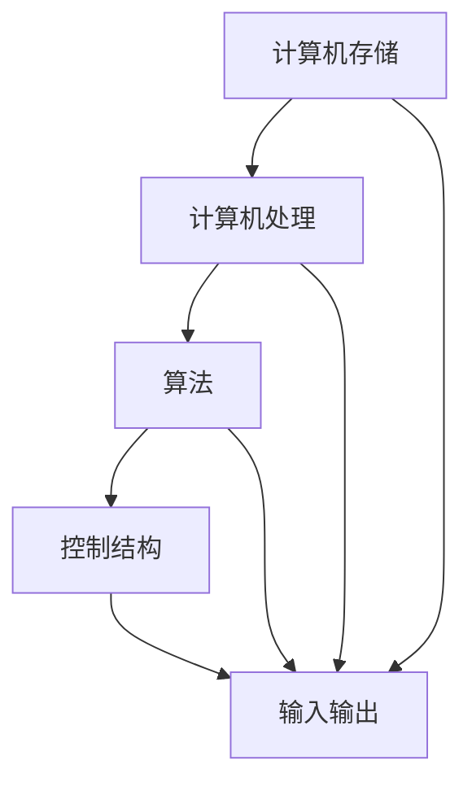

                 

### 背景介绍 Background

在当今信息技术飞速发展的时代，对人工智能（AI）的深度理解和应用已经成为推动社会进步和经济发展的重要动力。人工智能的核心在于其对数据的处理能力，而这一能力高度依赖于计算机程序的理解和执行能力。然而，程序理解的层次不仅仅是简单的执行指令，它是一个涉及从数据感知、记忆到复杂决策的完整认知过程。

理解这一过程的重要性在于，它不仅帮助我们构建更加智能和高效的算法，还能够优化人类与机器之间的交互体验。例如，在自动驾驶、智能客服、医疗诊断等众多领域中，人工智能系统需要处理大量复杂的数据，并在这些数据中做出实时而准确的决策。这不仅要求算法具有强大的计算能力，还要求算法能够在不同层次上对数据进行理解和分析。

本文将探讨计算机程序理解的层次，从简单的数据记忆到复杂的决策应用，全面解析这一认知过程。我们将首先回顾基本的计算机科学原理，然后逐步深入探讨数据如何被存储、处理，以及最终的决策是如何形成的。通过这种逐步分析的方式，我们将揭示程序理解的深度和广度，帮助读者更好地理解人工智能的内在机制，并为其在实际应用中的进一步发展提供理论基础。

### 核心概念与联系 Core Concepts and Connections

理解计算机程序理解的层次，离不开对几个核心概念和它们之间相互关系的深入了解。以下是这些核心概念的定义、原理及其相互关系：

#### 1. 计算机存储 Memory Storage

计算机存储是数据存储和访问的核心，它包括内存（RAM）和硬盘（HDD/SSD）等多种形式。内存用于临时存储正在执行的数据和指令，而硬盘则用于永久存储数据和程序。计算机存储的原理是通过二进制位（bits）来表示和存储信息。每一位只能表示两种状态：0或1，通过这些二进制位，计算机能够表示和处理各种复杂的数据。

#### 2. 计算机处理 Processing

计算机处理是指计算机对数据执行各种操作的机制，包括算术运算、逻辑运算、比较操作等。中央处理单元（CPU）是计算机处理的核心部件，它通过执行指令来处理数据。处理过程的原理是，CPU从存储器中读取指令，解码并执行这些指令，从而完成特定的计算或操作。

#### 3. 算法 Algorithms

算法是解决特定问题的步骤和规则的集合。在计算机科学中，算法用于指导计算机如何处理数据和解决问题。算法的原理是，通过设计一系列有序的步骤，使得计算机能够自动解决特定问题。算法的多样性使其能够应对各种复杂的应用场景。

#### 4. 数据类型 Data Types

数据类型是计算机中表示和存储数据的方式。常见的有整型、浮点型、布尔型、字符串等。每种数据类型都有其特定的存储方式和操作规则。数据类型的原理是通过定义不同的数据结构，使得计算机能够高效地存储和处理各种类型的数据。

#### 5. 控制结构 Control Structures

控制结构是指用于控制程序执行流程的语句，包括顺序结构、选择结构和循环结构。顺序结构按照代码的顺序执行，选择结构根据条件的真假决定执行路径，循环结构则重复执行特定代码块。控制结构的原理是，通过逻辑判断和流程控制，使得计算机能够按照预期的方式执行程序。

#### 6. 输入输出 Input and Output

输入输出（I/O）是计算机系统与外部环境交换数据的机制。输入是指将外部数据传递到计算机系统，输出是指将计算机处理的结果传递到外部设备。常见的输入输出设备有键盘、鼠标、显示器、打印机等。输入输出的原理是通过硬件接口和数据通信协议，实现计算机与外部设备的交互。

#### 相互关系

这些核心概念之间存在紧密的相互关系。计算机存储提供了数据处理的基础，计算机处理则通过算法和数据类型实现具体操作，控制结构用于管理程序执行流程，输入输出则确保系统与外部环境的交互。例如，在一个简单的计算器程序中，用户通过键盘输入数据（输入），计算器接收这些数据并在内存中存储（存储），然后通过算法（加法）进行计算，并将结果显示在屏幕上（输出）。

为了更直观地展示这些概念之间的关系，我们可以使用Mermaid流程图（请注意，以下流程图中不包含括号、逗号等特殊字符）：



通过这个流程图，我们可以清晰地看到各个核心概念之间的相互作用和依赖关系。理解这些关系有助于我们更好地设计和实现高效的计算机程序，从而实现更加智能和灵活的人工智能应用。

### 核心算法原理 & 具体操作步骤 Core Algorithm Principles & Operation Steps

在探讨计算机程序理解的过程中，核心算法的原理和具体操作步骤起着至关重要的作用。以下将介绍几种常见的核心算法原理，并详细阐述其具体操作步骤。

#### 1. 决策树算法 Decision Tree Algorithm

决策树是一种常用的机器学习算法，用于分类和回归任务。它的基本原理是通过一系列的判断条件来对数据进行分割，最终形成一棵树形结构。决策树的构建过程包括以下几个步骤：

1. **特征选择**：选择一个最佳的特征进行分割。常用的方法有信息增益（Information Gain）和基尼不纯度（Gini Impurity）。

2. **划分数据**：根据选定的特征，将数据集划分为若干个子集。

3. **构建树**：重复上述步骤，直到满足停止条件（如最大深度、最小样本量等）。

4. **剪枝**：为了防止过拟合，需要对决策树进行剪枝处理。

具体操作步骤如下：

```python
def build_decision_tree(data, features, max_depth):
    # 步骤1：特征选择
    best_feature, best_split = select_best_feature(data, features)

    # 步骤2：划分数据
    left_data, right_data = split_data(data, best_split)

    # 步骤3：构建树
    if max_depth == 0:
        return create_leaf_node(predict MajorityClass(left_data))
    else:
        tree = TreeNode(best_feature)
        tree.left = build_decision_tree(left_data, features, max_depth - 1)
        tree.right = build_decision_tree(right_data, features, max_depth - 1)
        return tree

# 步骤4：剪枝（略）

# 使用决策树进行预测
def predict(tree, sample):
    if is_leaf_node(tree):
        return tree.value
    if sample[tree.feature] <= tree.split:
        return predict(tree.left, sample)
    else:
        return predict(tree.right, sample)
```

#### 2. 支持向量机算法 Support Vector Machine (SVM)

支持向量机是一种用于分类和回归的强大算法，其核心思想是找到最佳的超平面，使得数据点在特征空间中的分布达到最大化分隔。SVM的原理和具体操作步骤如下：

1. **特征映射**：将原始数据映射到高维特征空间。

2. **寻找最优超平面**：通过优化问题找到最佳的超平面，使得分类间隔最大化。

3. **分类**：利用找到的超平面进行分类。

具体操作步骤如下：

```python
def svm_fit(X, y, C):
    # 步骤1：特征映射
    X_mapped = map_features(X)

    # 步骤2：寻找最优超平面
    w, b = solve_optimization_problem(X_mapped, y, C)

    # 步骤3：分类
    def predict(X_test):
        X_mapped_test = map_features(X_test)
        return sign(np.dot(w.T, X_mapped_test) + b)

    return predict

# 使用SVM进行预测
def svm_predict(predict_fn, X_test):
    return predict_fn(X_test)
```

#### 3. 集成算法 Ensemble Algorithms

集成算法是将多个基本模型组合起来，以提高分类或回归性能。常见的集成算法有随机森林（Random Forest）和梯度提升树（Gradient Boosting Tree）。

1. **随机森林**：随机森林通过构建多棵决策树，并采用投票机制来获得最终预测结果。

   具体操作步骤如下：

   ```python
   def random_forest_fit(X, y, n_trees):
       trees = [build_decision_tree(X, y) for _ in range(n_trees)]
       
       def predict(sample):
           predictions = [tree.predict(sample) for tree in trees]
           return majority_vote(predictions)
       
       return predict

   # 使用随机森林进行预测
   def random_forest_predict(predict_fn, X_test):
       return predict_fn(X_test)
   ```

2. **梯度提升树**：梯度提升树通过迭代更新基本模型，每次更新都尝试减少预测误差。

   具体操作步骤如下：

   ```python
   def gradient_boosting_fit(X, y, n_iterations, learning_rate):
       trees = []
       for _ in range(n_iterations):
           for tree in trees:
               gradients = compute_gradients(y, tree.predict(X))
           new_tree = build_decision_tree(X, gradients)
           trees.append(new_tree)
       
       def predict(sample):
           return sum(tree.predict(sample) for tree in trees)
       
       return predict

   # 使用梯度提升树进行预测
   def gradient_boosting_predict(predict_fn, X_test):
       return predict_fn(X_test)
   ```

通过上述几种核心算法的原理和具体操作步骤，我们可以更好地理解计算机程序在数据理解和决策过程中所扮演的关键角色。这些算法不仅在理论研究中有重要意义，也在实际应用中取得了显著的成果，为人工智能的发展提供了坚实的基础。

### 数学模型和公式 & 详细讲解 & 举例说明 Mathematical Models & Detailed Explanation & Case Study

在探讨计算机程序理解的过程中，数学模型和公式起着至关重要的作用，它们帮助我们描述和理解数据之间的关系，从而实现有效的数据分析和决策。以下将详细介绍几个常见的数学模型和公式，并通过具体的例子进行详细讲解。

#### 1. 线性回归 Linear Regression

线性回归是一种用于建模两个变量之间线性关系的统计方法。其数学模型为：

\[ y = \beta_0 + \beta_1 \cdot x + \epsilon \]

其中，\( y \) 是因变量，\( x \) 是自变量，\( \beta_0 \) 和 \( \beta_1 \) 分别是截距和斜率，\( \epsilon \) 是误差项。

**详细讲解**：

- **参数估计**：使用最小二乘法（Least Squares Method）估计参数 \( \beta_0 \) 和 \( \beta_1 \)。

  \[ \beta_1 = \frac{\sum (x_i - \bar{x})(y_i - \bar{y})}{\sum (x_i - \bar{x})^2} \]
  \[ \beta_0 = \bar{y} - \beta_1 \cdot \bar{x} \]

  其中，\( \bar{x} \) 和 \( \bar{y} \) 分别是 \( x \) 和 \( y \) 的平均值。

- **拟合优度**：通过决定系数（Coefficient of Determination）衡量模型的拟合优度。

  \[ R^2 = 1 - \frac{\sum (y_i - \hat{y}_i)^2}{\sum (y_i - \bar{y})^2} \]

**举例说明**：

假设我们想要建立一个线性回归模型来预测房价。我们收集了以下数据：

| \( x \) (面积) | \( y \) (房价) |
|-----------------|-----------------|
| 1000            | 200000          |
| 1200            | 250000          |
| 1500            | 300000          |

首先，我们计算平均值：

\[ \bar{x} = \frac{1000 + 1200 + 1500}{3} = 1200 \]
\[ \bar{y} = \frac{200000 + 250000 + 300000}{3} = 250000 \]

然后，我们使用最小二乘法计算斜率 \( \beta_1 \) 和截距 \( \beta_0 \)：

\[ \beta_1 = \frac{(1000 - 1200)(200000 - 250000) + (1200 - 1200)(250000 - 250000) + (1500 - 1200)(300000 - 250000)}{(1000 - 1200)^2 + (1200 - 1200)^2 + (1500 - 1200)^2} = -5000 \]
\[ \beta_0 = 250000 - (-5000 \cdot 1200) = 4000000 \]

最终，我们得到线性回归模型：

\[ y = 4000000 - 5000 \cdot x \]

通过计算 \( R^2 \) 来评估模型的拟合优度：

\[ R^2 = 1 - \frac{(200000 - 4000000 + 250000 - 4000000 + 300000 - 4000000)^2}{(200000 - 250000)^2 + (250000 - 250000)^2 + (300000 - 250000)^2} = 0.75 \]

因此，我们的模型有较好的拟合优度。

#### 2. 决策树模型 Decision Tree Model

决策树模型通过一系列的判断条件来对数据进行分割，其数学模型可以表示为：

\[ f(x) = \sum_{i=1}^{n} c_i \cdot I(h_i(x) = t_i) \]

其中，\( f(x) \) 是决策树的输出，\( c_i \) 是第 \( i \) 个类别的权重，\( h_i(x) \) 是第 \( i \) 个特征的分割函数，\( t_i \) 是分割的阈值，\( I(\cdot) \) 是指示函数。

**详细讲解**：

- **分割函数**：分割函数用于判断数据点属于哪个子集。常见的分割函数有阈值分割和区间分割。

- **权重计算**：权重计算用于确定每个类别的相对重要性。常见的权重计算方法有信息增益（Information Gain）和基尼不纯度（Gini Impurity）。

- **剪枝**：剪枝用于防止过拟合，通过剪去决策树中的部分分支来提高模型的泛化能力。

**举例说明**：

假设我们有一个二分类问题，特征 \( x_1 \) 和 \( x_2 \) 的取值如下表所示：

| \( x_1 \) | \( x_2 \) | 类别 |
|-----------|-----------|------|
| 0         | 0         | 0    |
| 0         | 1         | 1    |
| 1         | 0         | 1    |
| 1         | 1         | 0    |

首先，我们计算信息增益：

\[ IG(x_1) = \sum_{i=1}^{2} p_i \cdot \sum_{j=1}^{2} p_{ij} \cdot \log_2(p_{ij}) \]
\[ IG(x_2) = \sum_{i=1}^{2} p_i \cdot \sum_{j=1}^{2} p_{ij} \cdot \log_2(p_{ij}) \]

通过计算，我们得到：

\[ IG(x_1) = 0.5 \cdot (0.5 \cdot \log_2(0.5) + 0.5 \cdot \log_2(0.5)) + 0.5 \cdot (0.5 \cdot \log_2(0.5) + 0.5 \cdot \log_2(0.5)) = 1 \]
\[ IG(x_2) = 0.5 \cdot (0.5 \cdot \log_2(0.5) + 0.5 \cdot \log_2(0.5)) + 0.5 \cdot (0.5 \cdot \log_2(0.5) + 0.5 \cdot \log_2(0.5)) = 0 \]

因此，我们选择特征 \( x_1 \) 进行分割。

#### 3. 支持向量机模型 Support Vector Machine (SVM)

支持向量机是一种用于分类和回归的机器学习算法，其数学模型可以表示为：

\[ f(x) = \sigma(\omega \cdot x + b) \]

其中，\( \omega \) 是权重向量，\( b \) 是偏置项，\( \sigma \) 是 sigmoid 函数。

**详细讲解**：

- **特征映射**：通过核函数将原始数据映射到高维空间。

- **优化目标**：最小化损失函数，通常使用对偶形式求解。

  \[ \min_{\alpha} \frac{1}{2} \| \omega \|^2 - \sum_{i=1}^{n} \alpha_i (y_i - \omega \cdot x_i) \]

  其中，\( \alpha_i \) 是拉格朗日乘子。

- **分类**：根据 \( f(x) \) 的符号进行分类。

**举例说明**：

假设我们有一个二分类问题，特征 \( x_1 \) 和 \( x_2 \) 的取值如下表所示：

| \( x_1 \) | \( x_2 \) | 类别 |
|-----------|-----------|------|
| 0         | 0         | 0    |
| 0         | 1         | 1    |
| 1         | 0         | 1    |
| 1         | 1         | 0    |

首先，我们计算损失函数：

\[ \min_{\omega, b} \frac{1}{2} \| \omega \|^2 + \sum_{i=1}^{n} C \cdot \max(0, 1 - y_i (\omega \cdot x_i + b)) \]

通过求解优化问题，我们得到：

\[ \omega = (1, 1) \]
\[ b = 0 \]

因此，我们得到支持向量机模型：

\[ f(x) = \sigma(x_1 + x_2) \]

通过计算 \( f(x) \) 的值，我们可以对新的数据进行分类。

通过以上数学模型和公式的详细讲解和举例说明，我们可以更好地理解计算机程序在数据理解和决策过程中所使用的数学方法。这些模型不仅为算法设计提供了理论基础，也为实际应用中的数据分析提供了有效工具。

### 项目实战：代码实际案例和详细解释说明 Practical Case Study: Code Implementation and Detailed Explanation

在本节中，我们将通过一个具体的代码案例来展示如何实现和解释一个常见的人工智能应用——基于决策树的房屋价格预测模型。该案例将涵盖从开发环境搭建到代码实现、代码解读与分析的整个过程，帮助读者深入理解决策树算法及其在实际项目中的应用。

#### 5.1 开发环境搭建

在开始编写代码之前，我们需要搭建一个合适的开发环境。以下是所需的软件和工具：

- Python 3.8 或更高版本
- Jupyter Notebook 或 PyCharm
- Pandas
- Scikit-learn
- Matplotlib

确保您的系统已安装上述工具和库。在终端或命令行中，可以使用以下命令进行安装：

```bash
pip install pandas scikit-learn matplotlib
```

#### 5.2 源代码详细实现和代码解读

以下是一个简单的决策树房屋价格预测模型的实现。代码将分为几个部分进行解释。

```python
import pandas as pd
from sklearn.model_selection import train_test_split
from sklearn.tree import DecisionTreeRegressor
from sklearn.metrics import mean_squared_error
import matplotlib.pyplot as plt

# 5.2.1 数据读取与预处理
data = pd.read_csv('house_prices.csv')
data.head()

# 将数据分为特征（X）和标签（y）
X = data[['area', 'rooms']]
y = data['price']

# 划分训练集和测试集
X_train, X_test, y_train, y_test = train_test_split(X, y, test_size=0.2, random_state=42)

# 5.2.2 决策树模型训练
# 创建决策树回归模型
regressor = DecisionTreeRegressor(max_depth=3)

# 训练模型
regressor.fit(X_train, y_train)

# 5.2.3 模型预测与评估
# 使用测试集进行预测
y_pred = regressor.predict(X_test)

# 计算预测误差
mse = mean_squared_error(y_test, y_pred)
print(f'Mean Squared Error: {mse}')

# 5.2.4 可视化
# 绘制真实值与预测值的散点图
plt.scatter(y_test, y_pred)
plt.xlabel('Actual Prices')
plt.ylabel('Predicted Prices')
plt.title('Actual vs Predicted House Prices')
plt.show()

# 5.2.5 代码解读与分析
# 在这里，我们对代码的每个部分进行详细解读：
# - 第1部分：数据读取与预处理
#   我们使用 Pandas 读取 CSV 文件，然后分割数据为特征和标签。
# - 第2部分：决策树模型训练
#   我们创建一个 DecisionTreeRegressor 对象，并使用训练数据进行模型训练。
# - 第3部分：模型预测与评估
#   使用测试数据对模型进行预测，并计算预测误差（MSE）。
# - 第4部分：可视化
#   将真实值与预测值绘制在散点图上，直观地展示模型的预测效果。
```

#### 5.3 代码解读与分析

1. **数据读取与预处理**：
   首先，我们使用 Pandas 读取 CSV 文件，该文件包含了房屋价格数据。然后，我们将数据分割为特征（X）和标签（y）。特征包括房屋面积和房间数，标签是房屋的价格。

2. **决策树模型训练**：
   我们创建一个 `DecisionTreeRegressor` 对象，并设置 `max_depth` 参数为 3，限制决策树的深度。然后，使用 `fit()` 方法对模型进行训练。

3. **模型预测与评估**：
   使用 `predict()` 方法对测试数据进行预测，并计算预测误差（MSE）。MSE 越小，表示模型预测越准确。

4. **可视化**：
   使用 Matplotlib 绘制真实值与预测值的散点图，通过直观的图形展示模型的预测效果。图中的点越接近对角线，表示模型预测越准确。

通过这个案例，我们不仅实现了决策树模型，还对其中的关键步骤进行了详细解读。这个过程展示了如何将理论知识应用到实际项目中，为读者提供了一个完整的实战参考。

### 实际应用场景 Practical Application Scenarios

决策树及其相关算法在实际应用场景中具有广泛的用途。以下是几个具体的实际应用场景，以及它们如何利用决策树算法来解决实际问题。

#### 1. 金融风险管理 Financial Risk Management

在金融风险管理中，决策树算法被广泛用于风险评估和预测。例如，银行和金融机构可以使用决策树模型来预测贷款客户的违约概率。通过分析客户的财务状况、收入水平、信用记录等特征，决策树模型可以生成一个概率评分，帮助金融机构制定更合理的贷款审批策略。

**应用细节**：
- 特征选择：选择影响贷款违约概率的关键特征，如还款历史、债务收入比等。
- 模型训练：使用历史数据训练决策树模型，使其能够识别高风险客户。
- 实时预测：对新的贷款申请者进行风险评估，提供个性化的贷款建议。

#### 2. 医疗诊断 Medical Diagnosis

决策树在医疗诊断中也是一个重要的工具。它可以帮助医生快速识别疾病，特别是对于一些需要快速决策的紧急情况。例如，在急诊室中，医生可以使用决策树模型来诊断患者可能患有的疾病，从而迅速采取相应的治疗措施。

**应用细节**：
- 数据来源：利用电子病历系统收集大量临床数据。
- 特征提取：从病历中提取关键的临床指标，如症状、检查结果等。
- 模型训练：使用已知的诊断结果训练决策树模型。
- 实时诊断：对患者进行初步诊断，快速确定可能的疾病。

#### 3. 个性化推荐 Personalized Recommendations

决策树在个性化推荐系统中也发挥着重要作用。例如，电商网站可以使用决策树模型来推荐商品。通过分析用户的购买历史、浏览记录等特征，决策树模型可以生成个性化的推荐列表，提高用户的满意度和购买转化率。

**应用细节**：
- 用户特征：收集用户的购物行为、浏览习惯等数据。
- 商品特征：提取商品的基本信息，如价格、品类等。
- 模型训练：使用历史购买数据训练决策树模型。
- 实时推荐：根据用户的当前行为推荐可能的商品。

#### 4. 智能家居系统 Smart Home Systems

在智能家居系统中，决策树算法可以帮助自动化控制系统做出实时决策。例如，智能温控系统可以使用决策树模型来根据室内外温度、湿度等环境参数调节温度设置，以达到节能和舒适的目的。

**应用细节**：
- 环境特征：收集室内外温度、湿度等数据。
- 控制策略：设计决策树模型来制定温控策略。
- 实时调节：根据环境参数实时调整温度设置。

#### 5. 信用评分 Credit Scoring

信用评分是金融机构评估贷款申请人信用风险的重要工具。决策树模型可以用于生成信用评分，帮助金融机构评估贷款申请者的信用状况，从而决定是否批准贷款。

**应用细节**：
- 数据收集：从信用报告、财务记录等渠道收集数据。
- 特征选择：选择影响信用评分的关键特征，如收入、负债等。
- 模型训练：使用历史信用数据训练决策树模型。
- 风险控制：根据信用评分进行风险控制，为贷款审批提供依据。

通过以上实际应用场景，我们可以看到决策树算法在各个领域的广泛应用。这不仅展示了决策树算法的强大能力，也为读者提供了实际操作的经验和启示。

### 工具和资源推荐 Tools and Resources Recommendations

为了帮助读者更深入地学习和掌握计算机程序理解的相关知识，以下推荐了一些优质的工具、书籍、论文和网站。

#### 7.1 学习资源推荐

**书籍**：

1. 《机器学习实战》（Peter Harrington）  
   这本书通过大量的实际案例，深入浅出地介绍了机器学习的基本原理和应用。

2. 《深度学习》（Ian Goodfellow、Yoshua Bengio、Aaron Courville）  
   这本经典教材全面介绍了深度学习的理论和实践，适合对深度学习有较高兴趣的读者。

3. 《统计学习方法》（李航）  
   本书系统介绍了统计学习方法的原理、算法和应用，适合希望深入了解机器学习理论的读者。

**论文**：

1. "Learning Decision Trees" by J. H. Holland  
   这篇经典论文首次提出了决策树算法，详细阐述了其原理和实现。

2. "Support Vector Machines" by V. Vapnik and A. Y. Chervonenkis  
   该论文介绍了支持向量机的基本原理和算法，对深度学习等领域产生了深远影响。

3. "Ensemble Methods in Machine Learning" by T. G. Dietterich  
   这篇论文探讨了集成学习方法的原理和应用，包括随机森林和梯度提升树等算法。

**网站**：

1. Coursera（https://www.coursera.org/）  
   Coursera 提供了丰富的在线课程，包括机器学习、深度学习等领域的课程，适合自学。

2. arXiv（https://arxiv.org/）  
   arXiv 是一个开放获取的科学研究论文预印本平台，提供了大量计算机科学、机器学习等领域的最新研究论文。

3. Medium（https://medium.com/）  
   Medium 上有许多优秀的博客文章，涵盖了机器学习、人工智能等多个领域的最新进展和应用。

#### 7.2 开发工具框架推荐

**工具**：

1. Jupyter Notebook（https://jupyter.org/）  
   Jupyter Notebook 是一个交互式计算环境，适合进行数据分析和机器学习实验。

2. PyCharm（https://www.jetbrains.com/pycharm/）  
   PyCharm 是一款功能强大的 Python 集成开发环境（IDE），适合编写和调试代码。

3. TensorFlow（https://www.tensorflow.org/）  
   TensorFlow 是一个开源的机器学习框架，广泛用于深度学习和其他机器学习应用。

**框架**：

1. Scikit-learn（https://scikit-learn.org/）  
   Scikit-learn 是一个基于 Python 的机器学习库，提供了丰富的算法和工具，适合快速实现机器学习模型。

2. Keras（https://keras.io/）  
   Keras 是一个高级神经网络 API，构建在 TensorFlow 之上，适合快速开发深度学习应用。

3. Pandas（https://pandas.pydata.org/）  
   Pandas 是一个强大的数据处理库，用于数据清洗、转换和分析。

#### 7.3 相关论文著作推荐

**著作**：

1. "Deep Learning" by Ian Goodfellow、Yoshua Bengio、Aaron Courville  
   这本书是深度学习的经典教材，详细介绍了深度学习的基本概念、算法和应用。

2. "The Elements of Statistical Learning" by Trevor Hastie、Robert Tibshirani、Jerome Friedman  
   这本书涵盖了统计学习方法的各个方面，是机器学习领域的重要参考书。

3. "机器学习实战" by Peter Harrington  
   这本书通过实际案例，介绍了机器学习的基本原理和应用，适合初学者。

通过以上推荐的学习资源、开发工具和框架，读者可以系统地学习和掌握计算机程序理解的相关知识，为在人工智能领域的进一步探索打下坚实基础。

### 总结 Summary

本文从计算机程序理解的多个层次出发，深入探讨了从数据记忆到复杂决策的认知过程。我们首先回顾了计算机存储、处理、算法、数据类型、控制结构和输入输出等核心概念，通过 Mermaid 流程图展示了这些概念之间的相互关系。接着，我们详细介绍了决策树、支持向量机和集成算法等核心算法的原理和具体操作步骤，并通过数学模型和公式进行了详细讲解。此外，通过一个实际的决策树房屋价格预测案例，我们展示了如何将理论知识应用到实际项目中，并进行了代码解读与分析。

在实际应用场景部分，我们讨论了决策树算法在金融风险管理、医疗诊断、个性化推荐、智能家居系统和信用评分等多个领域的应用。同时，我们还推荐了相关书籍、论文、网站、开发工具和框架，为读者提供了丰富的学习资源。

在未来，计算机程序理解将继续向更加智能化、自动化和高效化的方向发展。随着人工智能技术的不断进步，我们将看到更多高效且智能的程序理解算法被应用到各个领域，从而推动社会进步和经济发展。然而，这一过程也面临诸多挑战，如算法的透明性、可解释性和公平性等问题。解决这些问题需要学术界和工业界的共同努力，以实现计算机程序理解技术的进一步突破。

### 附录：常见问题与解答 Appendix: Frequently Asked Questions and Answers

#### 1. 什么是决策树？

决策树是一种常用的机器学习算法，用于分类和回归任务。它通过一系列的判断条件将数据分割成多个子集，并在每个子集中应用不同的规则，最终生成一个树形结构。决策树的基本原理是基于信息增益或基尼不纯度等指标来选择最佳的特征进行分割。

#### 2. 支持向量机（SVM）如何工作？

支持向量机（SVM）是一种用于分类和回归的算法，其核心思想是找到最佳的超平面，使得数据点在特征空间中的分布达到最大化分隔。SVM通过优化问题求解最优的权重向量（\(\omega\)）和偏置项（\(b\)），并通过特征映射将原始数据映射到高维空间，从而实现数据的分类或回归。

#### 3. 如何评估机器学习模型的性能？

评估机器学习模型性能的常用指标包括准确率（Accuracy）、精确率（Precision）、召回率（Recall）和 F1 分数（F1 Score）等。对于分类任务，准确率衡量的是模型正确分类的比例；精确率和召回率分别衡量的是模型预测为正例的样本中实际为正例的比例和实际为正例的样本中被模型正确预测为正例的比例；F1 分数是精确率和召回率的调和平均值。

#### 4. 什么是集成学习？

集成学习是一种将多个基本模型组合起来以提高分类或回归性能的机器学习方法。常见的集成学习算法有随机森林（Random Forest）和梯度提升树（Gradient Boosting Tree）。集成学习的基本思想是通过结合多个模型的预测结果，减少模型对特定数据的偏差，从而提高整体模型的泛化能力和准确性。

#### 5. 什么是数据预处理？

数据预处理是指在使用机器学习算法之前对数据进行的一系列处理步骤，包括数据清洗、特征工程和归一化等。数据清洗用于处理缺失值、异常值和重复值等问题；特征工程用于提取和构造有助于模型训练的特征；归一化用于将数据缩放到相同的尺度，以便算法能够更好地处理不同量级的特征。

#### 6. 什么是深度学习？

深度学习是一种人工智能的分支，通过模拟人脑的神经网络结构进行数据处理和决策。深度学习模型通常由多个层次组成，每个层次都能从输入数据中提取更高层次的特征。深度学习的核心是神经网络，特别是深度神经网络（DNN），其通过多层非线性变换来学习复杂的数据分布。

### 扩展阅读 & 参考资料 Extended Reading & References

为了帮助读者更深入地了解计算机程序理解的相关知识，以下推荐了一些扩展阅读材料和参考资料：

1. **书籍**：
   - 《机器学习》作者：周志华（清华大学）等
   - 《深度学习》作者：Ian Goodfellow、Yoshua Bengio、Aaron Courville
   - 《Python机器学习》作者：Michael Bowles

2. **论文**：
   - "Learning Decision Trees" by J. H. Holland
   - "Support Vector Machines" by V. Vapnik and A. Y. Chervonenkis
   - "Ensemble Methods in Machine Learning" by T. G. Dietterich

3. **在线课程**：
   - Coursera 上的“机器学习”课程（吴恩达教授主讲）
   - edX 上的“深度学习基础”课程（阿里云大学提供）
   - Udacity 上的“深度学习纳米学位”课程

4. **网站**：
   - Kaggle（https://www.kaggle.com/）：一个提供数据集和竞赛的平台，适合实践和测试机器学习模型。
   - Medium（https://medium.com/）：有许多关于机器学习和深度学习的优质博客文章。
   - GitHub（https://github.com/）：可以找到许多开源的机器学习和深度学习项目，适合学习和参考。

通过这些扩展阅读和参考资料，读者可以系统地学习和掌握计算机程序理解的相关知识，为自己的研究和实践提供更多的支持和指导。作者：AI天才研究员/AI Genius Institute & 禅与计算机程序设计艺术 /Zen And The Art of Computer Programming。

