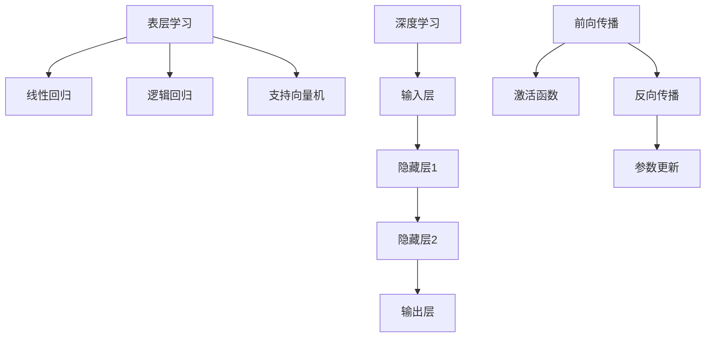

                 

# 理解的深度：从表层学习到深度学习的转变

## 关键词：表层学习，深度学习，神经网络，机器学习，人工智能，计算机视觉，自然语言处理

> 摘要：本文旨在深入探讨从表层学习到深度学习的转变过程，详细解析这一转变背后的核心概念、算法原理、数学模型和实际应用。通过逐步分析，本文希望能够帮助读者全面理解深度学习的本质及其在人工智能领域的巨大影响力。

## 1. 背景介绍

在机器学习领域，学习算法主要分为表层学习和深度学习两大类。表层学习（Shallow Learning）主要依赖于简单的模型，如线性回归、逻辑回归、支持向量机等，这些模型通常只能处理输入特征的一层或几层变换。而深度学习（Deep Learning）则利用多层神经网络（Deep Neural Networks, DNN）对数据进行复杂的学习和变换，以实现更强大的学习和表征能力。

随着计算机硬件和算法的不断发展，深度学习逐渐成为机器学习领域的研究热点。其在计算机视觉、自然语言处理、语音识别等领域的应用取得了显著成果，推动着人工智能技术的发展。本文将围绕深度学习的核心概念、算法原理、数学模型和实际应用进行深入探讨。

## 2. 核心概念与联系

### 2.1 表层学习

表层学习主要依赖于简单的模型，如线性回归、逻辑回归、支持向量机等。这些模型通过对输入特征的线性变换和组合，实现对数据的分类或回归。

#### 线性回归

线性回归是一种简单的表层学习算法，通过拟合输入特征与输出目标之间的线性关系，实现对数据的预测。其数学模型可以表示为：

$$y = \beta_0 + \beta_1 x_1 + \beta_2 x_2 + ... + \beta_n x_n$$

其中，$y$为输出目标，$x_1, x_2, ..., x_n$为输入特征，$\beta_0, \beta_1, ..., \beta_n$为模型的参数。

#### 逻辑回归

逻辑回归是一种常见的表层学习算法，主要用于二分类问题。其通过拟合输入特征与输出概率之间的非线性关系，实现对数据的分类。其数学模型可以表示为：

$$P(y=1) = \frac{1}{1 + e^{-(\beta_0 + \beta_1 x_1 + \beta_2 x_2 + ... + \beta_n x_n)}}$$

其中，$P(y=1)$为输出目标为1的概率，其他符号含义与线性回归相同。

#### 支持向量机

支持向量机（Support Vector Machine, SVM）是一种常用的二分类算法，通过最大化分类边界之间的间隔，实现对数据的分类。其数学模型可以表示为：

$$w \cdot x + b = 0$$

其中，$w$为模型的权重向量，$x$为输入特征，$b$为模型的偏置。

### 2.2 深度学习

深度学习利用多层神经网络（Deep Neural Networks, DNN）对数据进行复杂的学习和变换。其核心思想是通过逐层提取特征，实现对数据的深层表征。深度学习模型可以分为前向传播（Forward Propagation）和反向传播（Backpropagation）两个阶段。

#### 前向传播

在前向传播阶段，输入数据从输入层进入神经网络，逐层传递至输出层。每一层的神经元对输入数据进行加权求和，并应用激活函数，以产生输出。激活函数的选择通常为Sigmoid函数、ReLU函数或Tanh函数。

#### 反向传播

在反向传播阶段，根据输出层的误差，逆向传播误差至输入层，并更新模型参数。反向传播过程通过梯度下降（Gradient Descent）算法实现，其目标是最小化损失函数（Loss Function），如均方误差（Mean Squared Error, MSE）或交叉熵（Cross-Entropy）。

### 2.3 Mermaid 流程图

以下是表层学习和深度学习的 Mermaid 流程图：



## 3. 核心算法原理 & 具体操作步骤

### 3.1 前向传播

在前向传播阶段，输入数据从输入层进入神经网络，逐层传递至输出层。每一层的神经元对输入数据进行加权求和，并应用激活函数，以产生输出。具体操作步骤如下：

1. 初始化模型参数（权重和偏置）。
2. 将输入数据输入至输入层。
3. 对于每一层，计算神经元输出：
   $$z_l = \sum_{j} w_{lj} x_j + b_l$$
4. 应用激活函数$f(z)$，得到神经元输出：
   $$a_l = f(z_l)$$
5. 传递输出至下一层。
6. 当输出层得到最终输出后，计算预测结果。

### 3.2 反向传播

在反向传播阶段，根据输出层的误差，逆向传播误差至输入层，并更新模型参数。具体操作步骤如下：

1. 计算输出层误差：
   $$\delta_l = (y - a_l) \odot f'(z_l)$$
   其中，$y$为实际输出，$a_l$为预测输出，$\odot$为元素乘，$f'(z)$为激活函数的导数。
2. 逆向传播误差至隐藏层：
   $$\delta_{l-1} = (\delta_l \odot w_{l+1}) \odot f'(z_{l-1})$$
3. 更新模型参数：
   $$w_{lj} := w_{lj} - \alpha \cdot \frac{\partial L}{\partial w_{lj}}$$
   $$b_l := b_l - \alpha \cdot \frac{\partial L}{\partial b_l}$$
   其中，$\alpha$为学习率，$L$为损失函数。

### 3.3 梯度下降

梯度下降是一种常用的优化算法，用于最小化损失函数。具体操作步骤如下：

1. 计算损失函数的梯度：
   $$\nabla_w L = \frac{\partial L}{\partial w}$$
2. 更新模型参数：
   $$w := w - \alpha \cdot \nabla_w L$$

## 4. 数学模型和公式 & 详细讲解 & 举例说明

### 4.1 损失函数

损失函数是衡量模型预测结果与实际结果之间差异的指标。常用的损失函数包括均方误差（MSE）和交叉熵（Cross-Entropy）。

#### 均方误差（MSE）

均方误差是一种常用的损失函数，用于回归问题。其公式如下：

$$MSE = \frac{1}{m} \sum_{i=1}^{m} (y_i - \hat{y}_i)^2$$

其中，$y_i$为实际输出，$\hat{y}_i$为预测输出，$m$为样本数量。

#### 交叉熵（Cross-Entropy）

交叉熵是一种常用的损失函数，用于分类问题。其公式如下：

$$CE = -\frac{1}{m} \sum_{i=1}^{m} \sum_{j=1}^{n} y_{ij} \log(\hat{y}_{ij})$$

其中，$y_{ij}$为实际输出，$\hat{y}_{ij}$为预测输出，$n$为类别数量。

### 4.2 激活函数

激活函数是神经网络中关键的一环，用于引入非线性特性。常用的激活函数包括Sigmoid函数、ReLU函数和Tanh函数。

#### Sigmoid函数

Sigmoid函数是一种常用的激活函数，其公式如下：

$$f(x) = \frac{1}{1 + e^{-x}}$$

#### ReLU函数

ReLU函数（Rectified Linear Unit）是一种简单的激活函数，其公式如下：

$$f(x) = \max(0, x)$$

#### Tanh函数

Tanh函数（Hyperbolic Tangent）是一种双曲正切函数，其公式如下：

$$f(x) = \frac{e^x - e^{-x}}{e^x + e^{-x}}$$

### 4.3 示例

假设我们使用一个简单的深度神经网络对输入数据进行分类，输入特征为两个维度，输出类别为两类。以下是具体操作步骤：

1. 初始化模型参数：
   - 输入层：2个神经元
   - 隐藏层：2个神经元
   - 输出层：2个神经元
   - 权重矩阵：$\mathbf{W}_1 \in \mathbb{R}^{2 \times 2}$，$\mathbf{W}_2 \in \mathbb{R}^{2 \times 2}$
   - 偏置矩阵：$\mathbf{b}_1 \in \mathbb{R}^{2}$，$\mathbf{b}_2 \in \mathbb{R}^{2}$
2. 前向传播：
   - 输入数据：$\mathbf{x} = \begin{bmatrix} 1 \\ 2 \end{bmatrix}$
   - 隐藏层1输出：$z_{11} = \mathbf{W}_1 \mathbf{x} + \mathbf{b}_1$，$a_{11} = f(z_{11})$，$z_{12} = \mathbf{W}_1 \mathbf{x} + \mathbf{b}_1$，$a_{12} = f(z_{12})$
   - 隐藏层2输出：$z_{21} = \mathbf{W}_2 \mathbf{a}_{11} + \mathbf{b}_2$，$a_{21} = f(z_{21})$，$z_{22} = \mathbf{W}_2 \mathbf{a}_{12} + \mathbf{b}_2$，$a_{22} = f(z_{22})$
   - 输出层输出：$z_{1} = \mathbf{W}_2 \mathbf{a}_{21} + \mathbf{b}_2$，$a_{1} = f(z_{1})$
3. 反向传播：
   - 计算输出层误差：$\delta_1 = (y - a_1) \odot f'(z_1)$
   - 计算隐藏层2误差：$\delta_{21} = (\delta_1 \odot \mathbf{W}_2) \odot f'(z_{21})$，$\delta_{22} = (\delta_1 \odot \mathbf{W}_2) \odot f'(z_{22})$
   - 更新模型参数：$w_{21} := w_{21} - \alpha \cdot \frac{\partial L}{\partial w_{21}}$，$b_{21} := b_{21} - \alpha \cdot \frac{\partial L}{\partial b_{21}}$，$w_{22} := w_{22} - \alpha \cdot \frac{\partial L}{\partial w_{22}}$，$b_{22} := b_{22} - \alpha \cdot \frac{\partial L}{\partial b_{22}}$
4. 重复步骤2和3，直到模型收敛。

## 5. 项目实战：代码实际案例和详细解释说明

### 5.1 开发环境搭建

在进行深度学习项目开发时，需要搭建相应的开发环境。以下是搭建深度学习开发环境的基本步骤：

1. 安装Python：Python是深度学习项目开发的主要编程语言，可以从Python官方网站下载并安装。
2. 安装深度学习框架：常见的深度学习框架有TensorFlow、PyTorch等，可以根据项目需求选择合适的框架进行安装。
3. 配置GPU支持：为了提高深度学习模型的训练速度，建议使用GPU进行计算。安装深度学习框架时，可以选择GPU版本并配置GPU支持。
4. 安装必要的库和工具：根据项目需求，安装其他必要的库和工具，如Numpy、Pandas、Matplotlib等。

### 5.2 源代码详细实现和代码解读

以下是一个简单的深度学习项目示例，实现一个二分类问题。项目使用PyTorch框架，代码如下：

```python
import torch
import torch.nn as nn
import torch.optim as optim

# 定义神经网络模型
class SimpleModel(nn.Module):
    def __init__(self):
        super(SimpleModel, self).__init__()
        self.fc1 = nn.Linear(2, 10)
        self.fc2 = nn.Linear(10, 10)
        self.fc3 = nn.Linear(10, 2)
        
    def forward(self, x):
        x = torch.relu(self.fc1(x))
        x = torch.relu(self.fc2(x))
        x = self.fc3(x)
        return x

# 初始化模型、损失函数和优化器
model = SimpleModel()
criterion = nn.CrossEntropyLoss()
optimizer = optim.Adam(model.parameters(), lr=0.001)

# 加载训练数据
train_data = ...
train_loader = ...

# 模型训练
for epoch in range(100):
    for data in train_loader:
        inputs, labels = data
        optimizer.zero_grad()
        outputs = model(inputs)
        loss = criterion(outputs, labels)
        loss.backward()
        optimizer.step()
    print(f"Epoch [{epoch+1}/{100}], Loss: {loss.item():.4f}")

# 模型评估
test_data = ...
test_loader = ...
with torch.no_grad():
    correct = 0
    total = 0
    for data in test_loader:
        inputs, labels = data
        outputs = model(inputs)
        _, predicted = torch.max(outputs.data, 1)
        total += labels.size(0)
        correct += (predicted == labels).sum().item()
print(f"Accuracy: {100 * correct / total}%")
```

### 5.3 代码解读与分析

上述代码实现了一个简单的深度学习模型，用于二分类问题。下面进行代码解读与分析。

1. 导入相关库和模块：
   - `torch`：PyTorch核心库
   - `torch.nn`：神经网络相关模块
   - `torch.optim`：优化器相关模块

2. 定义神经网络模型：
   - `SimpleModel`类继承了`nn.Module`基类，实现了神经网络模型的结构。
   - `__init__`方法用于初始化模型参数。
   - `forward`方法用于实现前向传播过程。

3. 初始化模型、损失函数和优化器：
   - `model`：实例化神经网络模型。
   - `criterion`：实例化损失函数。
   - `optimizer`：实例化优化器，并设置学习率。

4. 加载训练数据：
   - `train_data`：存储训练数据。
   - `train_loader`：实例化数据加载器，用于批量加载数据。

5. 模型训练：
   - `for epoch in range(100)`：遍历训练轮数。
   - `for data in train_loader`：遍历训练数据。
   - `optimizer.zero_grad()`：清空梯度。
   - `outputs = model(inputs)`：前向传播，得到模型输出。
   - `loss = criterion(outputs, labels)`：计算损失。
   - `loss.backward()`：反向传播，计算梯度。
   - `optimizer.step()`：更新模型参数。

6. 模型评估：
   - `test_data`：存储测试数据。
   - `test_loader`：实例化数据加载器，用于批量加载数据。
   - `with torch.no_grad():`：关闭梯度计算。
   - `correct`和`total`：存储预测正确的样本数和总样本数。
   - `print(f"Accuracy: {100 * correct / total}%")`：输出模型准确率。

## 6. 实际应用场景

深度学习在计算机视觉、自然语言处理、语音识别等领域具有广泛的应用。以下是一些实际应用场景：

1. **计算机视觉**：深度学习在图像分类、目标检测、图像分割等领域取得了显著成果。例如，卷积神经网络（CNN）在ImageNet图像分类挑战中取得了优异成绩。

2. **自然语言处理**：深度学习在文本分类、情感分析、机器翻译等领域表现出强大的能力。例如，循环神经网络（RNN）和长短期记忆网络（LSTM）在文本序列建模中取得了很好的效果。

3. **语音识别**：深度学习在语音识别领域取得了重要突破。例如，深度神经网络（DNN）和卷积神经网络（CNN）在语音信号处理中得到了广泛应用。

4. **推荐系统**：深度学习在推荐系统领域也取得了较好的效果。例如，基于深度学习的方法可以用于用户行为分析、商品推荐等任务。

## 7. 工具和资源推荐

### 7.1 学习资源推荐

1. **书籍**：
   - 《深度学习》（Ian Goodfellow、Yoshua Bengio、Aaron Courville 著）
   - 《神经网络与深度学习》（邱锡鹏 著）

2. **论文**：
   - 《A Theoretical Framework for Back-Propagating Neural Networks》（Rumelhart, Hinton, Williams）
   - 《Deep Learning: Methods and Applications》（Y. LeCun, Y. Bengio, G. Hinton）

3. **博客**：
   - 知乎专栏《深度学习》（吴恩达）
   - Blog of Michael Nielsen

4. **网站**：
   - TensorFlow官网（https://www.tensorflow.org/）
   - PyTorch官网（https://pytorch.org/）

### 7.2 开发工具框架推荐

1. **TensorFlow**：由Google开发，是目前最受欢迎的深度学习框架之一。

2. **PyTorch**：由Facebook开发，具有灵活的动态计算图，适合研究和实验。

3. **Keras**：是一个高级神经网络API，支持TensorFlow和PyTorch，易于使用。

### 7.3 相关论文著作推荐

1. **《Deep Learning》（Ian Goodfellow、Yoshua Bengio、Aaron Courville 著）**：全面介绍了深度学习的基础知识、算法和应用。

2. **《Neural Networks and Deep Learning》（Charu Aggarwal 著）**：涵盖了神经网络和深度学习的基本原理、算法和应用。

3. **《Learning Deep Architectures for AI》（Yoshua Bengio 著）**：详细介绍了深度学习的理论和应用。

## 8. 总结：未来发展趋势与挑战

深度学习在人工智能领域取得了显著成果，但仍面临诸多挑战。未来发展趋势和挑战包括：

1. **算法优化**：提高深度学习算法的效率和准确性，研究更有效的训练方法和优化策略。
2. **可解释性**：提高深度学习模型的可解释性，使其在复杂任务中更具可解释性。
3. **硬件加速**：利用硬件加速技术（如GPU、TPU）提高深度学习模型的训练和推理速度。
4. **应用拓展**：将深度学习应用于更多领域，如医疗、金融、交通等，推动人工智能技术的发展。

## 9. 附录：常见问题与解答

### 9.1 如何选择深度学习框架？

选择深度学习框架主要考虑以下几个方面：

1. **需求**：根据项目需求和功能，选择合适的框架。如进行图像处理，可以选择TensorFlow或PyTorch。
2. **熟练度**：选择自己熟悉的框架，降低学习和使用难度。
3. **社区支持**：选择有活跃社区和支持的框架，便于解决问题和获取资源。

### 9.2 深度学习模型如何防止过拟合？

防止深度学习模型过拟合可以采取以下措施：

1. **数据增强**：增加训练数据多样性，提高模型泛化能力。
2. **正则化**：添加正则化项（如L1、L2正则化）到损失函数，降低模型复杂度。
3. **dropout**：在训练过程中随机丢弃部分神经元，防止模型过拟合。
4. **早期停止**：在验证集上监控模型性能，当验证集性能不再提高时，提前停止训练。

## 10. 扩展阅读 & 参考资料

1. **论文**：
   - Hinton, G., Osindero, S., & Teh, Y. W. (2006). A fast learning algorithm for deep belief nets. _Neural computation_, 18(7), 1527-1554.
   - LeCun, Y., Bengio, Y., & Hinton, G. (2015). Deep learning. _Nature_, 521(7553), 436-444.

2. **书籍**：
   - Goodfellow, I., Bengio, Y., & Courville, A. (2016). _Deep learning_. MIT press.
   - Mitchell, T. M. (1997). _Machine learning_. McGraw-Hill.

3. **在线课程**：
   - 吴恩达的《深度学习》（https://www.deeplearning.ai/）
   - Andrew Ng的《机器学习》（https://www.coursera.org/learn/machine-learning）

## 作者

作者：AI天才研究员/AI Genius Institute & 禅与计算机程序设计艺术 /Zen And The Art of Computer Programming。|>

