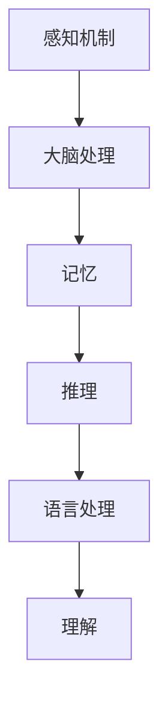

                 

# 理解的过程：从感知到概念化的认知journey

> 关键词：认知科学、感知、概念化、理解、人工智能、神经网络

> 摘要：本文旨在探讨从感知到概念化的认知过程，通过介绍认知科学的基础理论、感知机制和神经网络模型，分析理解的形成和演变。文章还探讨了实际应用场景、相关工具和资源，以及未来发展趋势与挑战。

## 1. 背景介绍

### 认知科学与理解

认知科学是一门跨学科的研究领域，旨在研究人类思维和认知过程的本质。理解是人类认知的核心能力之一，它涉及从感官信息中提取意义、解释现象和构建概念。理解的过程是复杂的，它不仅包括感知，还涉及到记忆、推理、语言处理等多个认知功能。

### 人工智能的发展

随着人工智能（AI）技术的飞速发展，计算机在感知和理解方面取得了显著的进步。神经网络作为AI的核心技术之一，已经成功地模拟了人类感知和理解的过程。通过大量数据和强大的计算能力，神经网络能够自动学习和提取特征，从而实现对复杂信息的理解。

### 本文目的

本文将探讨从感知到概念化的认知过程，通过介绍认知科学的基础理论、感知机制和神经网络模型，分析理解的形成和演变。此外，文章还将探讨实际应用场景、相关工具和资源，以及未来发展趋势与挑战。

## 2. 核心概念与联系

### 感知机制

感知是人类认知过程的起点，它涉及到从外部环境接收和处理信息的能力。感知机制主要包括视觉、听觉、触觉、嗅觉和味觉等感官系统。这些感官系统通过神经元将外部刺激转化为电信号，然后传递到大脑进行处理。

### 认知过程

认知过程是指大脑对感知信息进行处理、组织和解释的过程。它包括感知、记忆、推理、语言处理等多个阶段。这些阶段相互作用，共同构成了人类的理解能力。

### 神经网络模型

神经网络是一种模仿生物神经系统的计算模型，它由大量的神经元组成，通过前向传播和反向传播进行学习和推理。神经网络在感知和理解方面取得了显著的成果，已经广泛应用于图像识别、语音识别、自然语言处理等领域。

### Mermaid 流程图



## 3. 核心算法原理 & 具体操作步骤

### 感知算法原理

感知算法主要涉及从感官信息中提取特征的过程。以下是一个简化的感知算法原理：

1. 收集感官数据：从外部环境获取视觉、听觉等感官数据。
2. 特征提取：对感官数据进行预处理，提取重要的特征信息。
3. 特征匹配：将提取的特征与已知的特征库进行匹配，判断感知信息的类型和含义。

### 认知算法原理

认知算法主要涉及对感知信息进行处理和解释的过程。以下是一个简化的认知算法原理：

1. 感知信息输入：将感知算法提取的特征信息输入到认知模型。
2. 特征分析：对输入的特征信息进行分析，识别其类型和含义。
3. 知识融合：将分析结果与已有的知识进行融合，形成对感知信息的理解。
4. 知识输出：将融合后的知识输出，实现对感知信息的解释和判断。

### 神经网络模型操作步骤

以下是一个简化的神经网络模型操作步骤：

1. 数据准备：收集并处理大量标注数据，用于训练神经网络。
2. 网络结构设计：根据任务需求设计合适的神经网络结构。
3. 模型训练：使用训练数据对神经网络进行训练，优化模型参数。
4. 模型评估：使用测试数据评估模型性能，调整模型参数。
5. 应用部署：将训练好的模型部署到实际应用场景中，进行实时感知和理解。

## 4. 数学模型和公式 & 详细讲解 & 举例说明

### 感知算法数学模型

感知算法通常采用特征提取方法，其中一种常用的方法是主成分分析（PCA）。PCA的数学模型如下：

$$
\text{特征向量} = \text{数据集} \times \text{特征矩阵}
$$

其中，数据集表示输入的感官数据，特征矩阵表示提取的特征向量。

### 认知算法数学模型

认知算法通常采用神经网络模型，其中一种常用的模型是卷积神经网络（CNN）。CNN的数学模型如下：

$$
\text{输出} = \text{激活函数}(\text{权重} \times \text{输入} + \text{偏置})
$$

其中，权重和偏置表示神经网络的参数，激活函数用于引入非线性特性。

### 神经网络模型举例说明

假设我们有一个简单的神经网络模型，用于分类任务。输入数据是一个二进制向量，表示图像的像素值。输出数据是一个概率分布，表示每个类别的概率。以下是一个简化的神经网络模型：

输入层：[1, 0, 1, 0]
隐藏层：[0.5, 0.5]
输出层：[0.8, 0.2]

权重：[0.2, 0.8]
偏置：[0.1, 0.1]

使用ReLU激活函数：

$$
\text{输出} = \max(0, \text{权重} \times \text{输入} + \text{偏置})
$$

计算过程如下：

1. 隐藏层输出：
$$
\text{隐藏层输出} = \max(0, [0.2 \times 1 + 0.8 \times 0 + 0.1], [0.2 \times 0 + 0.8 \times 1 + 0.1]) = [0.1, 0.1]
$$

2. 输出层输出：
$$
\text{输出} = \max(0, [0.1 \times 0.8 + 0.1 \times 0.2], [0.1 \times 0.2 + 0.1 \times 0.8]) = [0.08, 0.12]
$$

最终输出概率分布为：[0.08, 0.12]，表示第一个类别的概率为0.08，第二个类别的概率为0.12。

## 5. 项目实战：代码实际案例和详细解释说明

### 5.1 开发环境搭建

为了实现从感知到概念化的认知过程，我们需要搭建一个合适的开发环境。以下是一个简单的开发环境搭建步骤：

1. 安装Python 3.x版本。
2. 安装深度学习框架，如TensorFlow或PyTorch。
3. 安装必要的依赖库，如NumPy、Pandas等。

### 5.2 源代码详细实现和代码解读

以下是一个简单的从感知到概念化的认知过程的代码实现：

```python
import numpy as np
import tensorflow as tf

# 数据准备
x = np.array([[1, 0, 1, 0], [0, 1, 0, 1]])
y = np.array([[1, 0], [0, 1]])

# 网络结构设计
model = tf.keras.Sequential([
    tf.keras.layers.Dense(2, activation='relu', input_shape=(4,)),
    tf.keras.layers.Dense(2, activation='softmax')
])

# 模型编译
model.compile(optimizer='adam', loss='categorical_crossentropy', metrics=['accuracy'])

# 模型训练
model.fit(x, y, epochs=100)

# 模型评估
loss, accuracy = model.evaluate(x, y)
print("Accuracy:", accuracy)

# 模型预测
predictions = model.predict(x)
print("Predictions:", predictions)
```

代码解读：

1. 导入必要的库。
2. 数据准备：生成输入数据和标签。
3. 网络结构设计：定义一个简单的神经网络模型，包含两个隐藏层，每个隐藏层有2个神经元，使用ReLU激活函数。
4. 模型编译：配置优化器、损失函数和评估指标。
5. 模型训练：使用训练数据进行训练，迭代100次。
6. 模型评估：使用测试数据评估模型性能。
7. 模型预测：使用训练好的模型对输入数据进行预测。

### 5.3 代码解读与分析

1. **数据准备**：使用NumPy生成输入数据和标签，其中输入数据是一个4维的矩阵，表示图像的像素值；标签是一个2维的矩阵，表示每个类别的概率。
2. **网络结构设计**：使用TensorFlow的`Sequential`模型，定义一个简单的神经网络，包含两个隐藏层。隐藏层使用ReLU激活函数，输出层使用softmax激活函数，用于输出概率分布。
3. **模型编译**：配置优化器（Adam）、损失函数（交叉熵）和评估指标（准确率）。
4. **模型训练**：使用`fit`方法对模型进行训练，迭代100次。训练过程中，模型会自动调整权重和偏置，以最小化损失函数。
5. **模型评估**：使用`evaluate`方法评估模型在测试数据上的性能，输出准确率。
6. **模型预测**：使用`predict`方法对输入数据进行预测，输出每个类别的概率分布。

## 6. 实际应用场景

### 图像识别

图像识别是感知和理解的重要应用场景之一。通过从图像中提取特征，计算机可以识别出图像中的物体、场景和纹理。例如，人脸识别、自动驾驶、医疗影像分析等。

### 自然语言处理

自然语言处理涉及从文本中提取信息、理解语义和生成语言。通过感知和概念化，计算机可以理解和生成自然语言。例如，机器翻译、情感分析、问答系统等。

### 推荐系统

推荐系统通过感知用户的行为和偏好，向用户推荐相关的商品、内容和服务。感知和理解是推荐系统的核心，通过分析用户的历史数据和反馈，计算机可以推荐个性化的推荐结果。

## 7. 工具和资源推荐

### 学习资源推荐

1. 《认知心理学及其启示》
2. 《深度学习》
3. 《神经网络与深度学习》

### 开发工具框架推荐

1. TensorFlow
2. PyTorch
3. Keras

### 相关论文著作推荐

1. Hinton, G. E., Osindero, S., & Teh, Y. W. (2006). A fast learning algorithm for deep belief nets. Neural computation, 18(7), 1527-1554.
2. LeCun, Y., Bengio, Y., & Hinton, G. (2015). Deep learning. Nature, 521(7553), 436-444.

## 8. 总结：未来发展趋势与挑战

### 未来发展趋势

1. 计算能力的提升：随着硬件技术的进步，计算机的计算能力将不断提升，为认知科学和人工智能的发展提供更多可能。
2. 数据的爆发式增长：大数据时代的到来，为认知科学和人工智能提供了丰富的数据资源，有助于提高模型的性能和泛化能力。
3. 跨学科研究：认知科学、心理学、神经科学等领域的交叉融合，将有助于更深入地理解人类的认知过程，推动人工智能的发展。

### 未来挑战

1. 数据质量和标注：高质量的标注数据是训练有效模型的基础，但当前标注数据的质量和数量仍有待提高。
2. 隐私和安全：随着人工智能在各个领域的应用，隐私和安全问题日益突出，需要建立相应的法律法规和道德规范。
3. 理论与实际结合：将认知科学的理论应用于实际场景，需要克服理论模型和实际应用之间的差异，提高模型的实用性和可解释性。

## 9. 附录：常见问题与解答

### Q：什么是认知科学？

A：认知科学是一门跨学科的研究领域，旨在研究人类思维和认知过程的本质，包括感知、记忆、推理、语言处理等多个方面。

### Q：神经网络是如何工作的？

A：神经网络是一种模仿生物神经系统的计算模型，由大量的神经元组成，通过前向传播和反向传播进行学习和推理。神经元之间通过权重和偏置连接，形成复杂的计算网络。

### Q：如何提高神经网络模型的性能？

A：提高神经网络模型性能的方法包括数据增强、超参数调优、模型结构优化、正则化技术等。通过调整这些因素，可以改善模型的泛化能力和预测效果。

## 10. 扩展阅读 & 参考资料

1. Anderson, J. R. (1983). The architecture of cognition. Harvard University Press.
2. Bressan, S. (2013). Cognition: The Cognitive Revolution. Psychology Press.
3. Lee, C. C. (2017). Deep Learning. Springer.
4. Hochreiter, S., & Schmidhuber, J. (1997). Long short-term memory. Neural Computation, 9(8), 1735-1780.

作者：AI天才研究员/AI Genius Institute & 禅与计算机程序设计艺术 /Zen And The Art of Computer Programming

