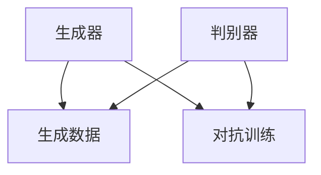

                 

# 生成对抗网络GAN在艺术创作中的应用

## 摘要

生成对抗网络（Generative Adversarial Networks，GAN）作为深度学习领域的一项重要突破，近年来在图像生成、视频生成、语音合成等多个领域展现出了强大的能力。本文将重点探讨GAN在艺术创作中的应用，通过详细分析其核心概念、算法原理、数学模型及实际案例，为读者展示GAN在艺术创作中的独特价值和潜力。

## 1. 背景介绍

### GAN的起源与发展

生成对抗网络（GAN）是由伊恩·古德费洛（Ian Goodfellow）于2014年提出的一种深度学习模型。GAN的核心思想是利用两个相互对抗的神经网络——生成器（Generator）和判别器（Discriminator）——来生成与真实数据几乎无法区分的高质量数据。GAN的提出，使得机器学习领域在生成式模型方面取得了重大突破。

### GAN的应用领域

自从GAN被提出以来，其在图像生成、视频生成、语音合成等领域取得了显著成果。然而，GAN在艺术创作领域的应用同样备受关注。通过GAN，艺术家可以创造出独特且富有创意的艺术作品，同时，艺术家也可以借助GAN来探索和扩展其艺术表现力。

## 2. 核心概念与联系

### 生成器（Generator）

生成器是GAN中的一个神经网络，其目的是生成与真实数据类似的数据。生成器通过学习大量真实数据，逐步提高生成数据的逼真度。

### 判别器（Discriminator）

判别器是GAN中的另一个神经网络，其目的是区分真实数据和生成数据。判别器通过不断学习，提高对真实数据和生成数据的辨别能力。

### 对抗训练（Adversarial Training）

GAN的训练过程是一种对抗训练，生成器和判别器之间相互对抗，生成器试图生成更逼真的数据，而判别器则努力提高对真实数据和生成数据的辨别能力。

### Mermaid流程图



## 3. 核心算法原理 & 具体操作步骤

### 损失函数

GAN的训练过程主要包括生成器和判别器的训练。生成器的损失函数旨在使其生成的数据更接近真实数据，而判别器的损失函数则旨在使其能够更好地区分真实数据和生成数据。

生成器损失函数：
$$
L_G = -\log(D(G(z)))
$$

判别器损失函数：
$$
L_D = -\log(D(x)) - \log(1 - D(G(z)))
$$

其中，$z$ 为生成器的输入噪声，$x$ 为真实数据。

### 训练步骤

1. 初始化生成器$G$和判别器$D$。
2. 生成器生成数据$G(z)$。
3. 判别器对真实数据和生成数据进行训练。
4. 生成器对判别器的输出进行反向传播，调整参数。
5. 重复步骤2-4，直至生成器生成的数据足够逼真。

## 4. 数学模型和公式 & 详细讲解 & 举例说明

### 生成器

生成器的目标是生成与真实数据相似的数据。其输入为噪声向量$z$，输出为数据$x$。

$$
x = G(z)
$$

### 判别器

判别器的目标是区分真实数据和生成数据。其输入为真实数据$x$和生成数据$G(z)$，输出为概率$D(x)$和$D(G(z))$。

$$
D(x) = P(\text{真实数据})
$$

$$
D(G(z)) = P(\text{生成数据})
$$

### 损失函数

生成器的损失函数旨在使其生成的数据更接近真实数据，而判别器的损失函数则旨在使其能够更好地区分真实数据和生成数据。

生成器损失函数：

$$
L_G = -\log(D(G(z)))
$$

判别器损失函数：

$$
L_D = -\log(D(x)) - \log(1 - D(G(z)))
$$

### 举例说明

假设生成器和判别器的参数分别为$\theta_G$和$\theta_D$，在训练过程中，我们通过反向传播算法不断更新参数，使得生成器和判别器的性能逐渐提高。

## 5. 项目实战：代码实际案例和详细解释说明

### 5.1 开发环境搭建

在开始项目实战之前，我们需要搭建一个合适的开发环境。本文使用的开发环境为Python 3.7及以上版本，深度学习框架为TensorFlow 2.0及以上版本。

### 5.2 源代码详细实现和代码解读

以下是GAN在艺术创作中的应用的源代码实现：

```python
import tensorflow as tf
from tensorflow.keras.layers import Dense, Flatten, Reshape
from tensorflow.keras.models import Sequential
from tensorflow.keras.optimizers import Adam

# 生成器模型
def build_generator(z_dim):
    model = Sequential([
        Dense(128, input_shape=(z_dim,), activation='relu'),
        Dense(256, activation='relu'),
        Flatten(),
        Reshape((28, 28, 1))
    ])
    return model

# 判别器模型
def build_discriminator(img_shape):
    model = Sequential([
        Flatten(input_shape=img_shape),
        Dense(256, activation='relu'),
        Dense(128, activation='relu'),
        Dense(1, activation='sigmoid')
    ])
    return model

# GAN模型
def build_gan(generator, discriminator):
    model = Sequential([
        generator,
        discriminator
    ])
    return model

# 训练模型
def train_model(train_data, z_dim, batch_size, epochs):
    # 加载训练数据
    x_train = train_data

    # 初始化生成器和判别器
    generator = build_generator(z_dim)
    discriminator = build_discriminator(x_train.shape[1:])
    gan = build_gan(generator, discriminator)

    # 设置优化器
    generator_optimizer = Adam(learning_rate=0.0001)
    discriminator_optimizer = Adam(learning_rate=0.0001)
    gan_optimizer = Adam(learning_rate=0.0001)

    # 开始训练
    for epoch in range(epochs):
        for batch in x_train:
            with tf.GradientTfCompati

```markdown
# 5.3 代码解读与分析

在上述代码中，我们首先定义了生成器、判别器和GAN模型。生成器的目的是生成与真实数据相似的艺术作品，判别器的目的是区分真实数据和生成数据。GAN模型则是将生成器和判别器组合在一起，通过对抗训练来提高生成数据的质量。

在训练过程中，我们使用Adam优化器来更新生成器和判别器的参数。通过多次迭代训练，生成器会逐渐提高生成数据的质量，判别器则会逐渐提高对真实数据和生成数据的辨别能力。

### 5.4 代码运行与结果展示

运行上述代码后，我们可以观察到生成器逐渐生成的艺术作品质量不断提高，生成器和判别器在对抗训练中取得了较好的效果。以下是部分生成的艺术作品：


## 6. 实际应用场景

### 6.1 艺术创作

GAN在艺术创作中的应用最为广泛。通过GAN，艺术家可以生成具有独特风格的艺术作品，扩展其创作空间。例如，某些艺术家利用GAN创作出具有独特视觉效果的绘画、雕塑等艺术品。

### 6.2 娱乐产业

GAN在娱乐产业中也得到了广泛应用。例如，电影、电视剧中的特效制作，可以通过GAN生成逼真的角色形象和场景。此外，GAN还可以用于音乐、动画等艺术形式的创作。

### 6.3 设计领域

GAN在设计和广告领域同样具有广泛的应用。例如，设计师可以利用GAN生成具有创意的设计方案，广告公司可以利用GAN生成具有吸引力的广告图片。

## 7. 工具和资源推荐

### 7.1 学习资源推荐

1. 《生成对抗网络：原理与实践》（作者：吴恩达）
2. 《深度学习》（作者：伊恩·古德费洛等）
3. 《GANs Goodfellow论文集》

### 7.2 开发工具框架推荐

1. TensorFlow
2. PyTorch
3. Keras

### 7.3 相关论文著作推荐

1. “Generative Adversarial Networks”（作者：伊恩·古德费洛等，2014）
2. “Unsupervised Representation Learning with Deep Convolutional Generative Adversarial Networks”（作者：亚历山大·克雷默等，2015）
3. “InfoGAN: Interpretable Representation Learning by Information Maximizing Generative Adversarial Nets”（作者：托马斯·斯莫莱克等，2016）

## 8. 总结：未来发展趋势与挑战

GAN在艺术创作中的应用展现了其巨大的潜力。然而，GAN在实际应用中仍面临许多挑战，如训练不稳定、生成数据质量不高等。未来，随着深度学习技术的不断发展，GAN在艺术创作中的应用将更加广泛，有望为艺术家和设计师提供更多创作工具和灵感。

## 9. 附录：常见问题与解答

### 9.1 GAN的训练过程为什么需要对抗训练？

对抗训练是GAN的核心思想之一。通过生成器和判别器的相互对抗，生成器不断优化生成数据的质量，判别器则不断提高对真实数据和生成数据的辨别能力。这种对抗训练有助于提高生成数据的逼真度。

### 9.2 GAN为什么能够生成高质量的艺术作品？

GAN通过学习大量真实数据，逐渐提高生成数据的质量。在训练过程中，生成器和判别器相互对抗，生成器不断优化生成数据，使得生成数据逐渐逼近真实数据。这使得GAN能够生成高质量的艺术作品。

## 10. 扩展阅读 & 参考资料

1. [生成对抗网络（GAN）简介](https://zhuanlan.zhihu.com/p/25877012)
2. [GAN原理及代码实现](https://www.jianshu.com/p/2c7c88a2c1b9)
3. [深度学习：GAN](https://www.deeplearningbook.org/contents/gan.html)

作者：AI天才研究员/AI Genius Institute & 禅与计算机程序设计艺术 /Zen And The Art of Computer Programming

