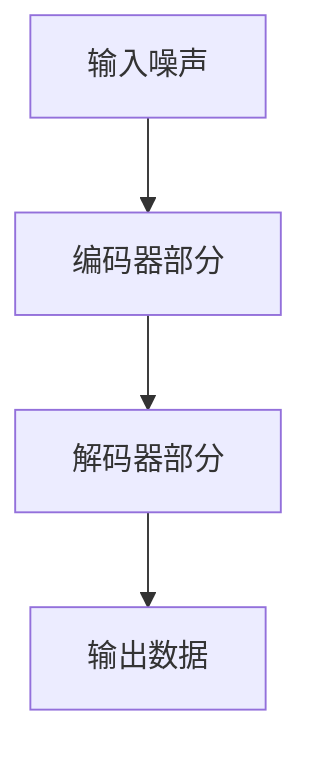
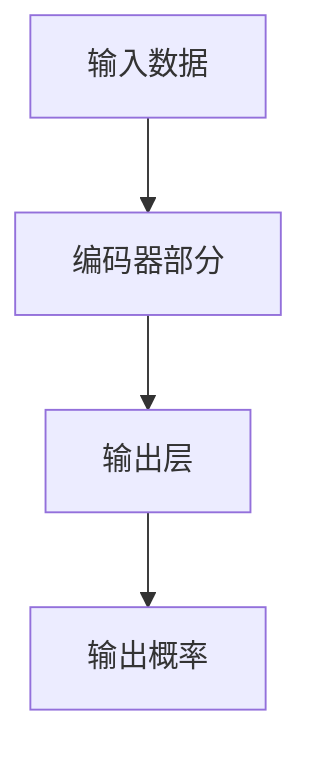

                 

### 背景介绍

生成对抗网络（Generative Adversarial Networks，GANs）是近年来在计算机视觉和机器学习领域引起广泛关注的重要技术。GANs的核心思想是由两个神经网络——生成器（Generator）和判别器（Discriminator）——进行对抗训练，从而实现数据的生成。虚拟环境创建作为GANs的一个重要应用场景，通过生成逼真的虚拟场景，为游戏开发、虚拟现实、增强现实等领域提供了强大的支持。

本文将围绕“生成对抗网络在虚拟环境创建中的应用”这一主题，首先介绍GANs的基本概念、发展历程和关键组件。随后，我们将深入探讨GANs在虚拟环境创建中的具体应用，包括虚拟场景生成、虚拟物体生成、虚拟交互生成等方面。此外，本文还将介绍相关的数学模型和算法原理，并通过实际项目案例进行代码解析和实战演示。

通过对这些内容的逐步讲解，我们将帮助读者了解GANs在虚拟环境创建中的实际应用，掌握相关技术原理和实践方法，为今后的研究和开发提供有益的参考。读者可以期待在本文中找到关于GANs在虚拟环境创建领域的前沿信息和技术洞察。接下来，我们将从背景介绍开始，逐步深入探讨这一重要主题。

### 1.1 生成对抗网络的起源和发展历程

生成对抗网络（GANs）的起源可以追溯到2014年，由深度学习领域的两位学者Ian Goodfellow及其团队提出。Ian Goodfellow在提出GANs之前，已经在深度学习和神经网络领域积累了丰富的经验。他曾在多个国际顶级会议和期刊上发表过多篇重要论文，对神经网络的理论和应用有着深入的研究。

GANs的提出源于Ian Goodfellow在研究深度学习生成模型时的一个发现：传统的生成模型往往难以产生高质量的数据，尤其是当数据分布非常复杂时。为了解决这个问题，Ian Goodfellow借鉴了博弈论中的对抗性训练（Adversarial Training）思想，提出了GANs这一创新性模型。

GANs的发展历程可以分为几个重要阶段：

1. **早期探索（2014年）**：GANs的最初版本主要由一个生成器和判别器组成，通过不断调整两个网络之间的对抗关系来优化生成器的表现。这个初步的模型已经展示了生成对抗网络在生成高质量图像方面的潜力。

2. **改进与优化（2015年-2016年）**：在GANs提出后的几年里，研究人员对其进行了多方面的改进和优化。例如，通过引入深度卷积网络（CNNs）、对抗性损失函数等，进一步提升了GANs的生成能力。这些改进使得GANs可以生成更加真实、多样化的数据。

3. **广泛应用（2017年至今）**：随着GANs技术的不断完善，其在各个领域的应用也越来越广泛。从计算机视觉到自然语言处理，从数据生成到图像修复，GANs都展示了强大的应用潜力。特别是在虚拟环境创建领域，GANs的应用已经取得了显著的成果。

在GANs的发展历程中，Ian Goodfellow的贡献不可忽视。他不仅提出了GANs这一创新性模型，还通过不断的研究和推广，使得GANs得到了广泛的关注和应用。此外，Ian Goodfellow还撰写了《深度学习》（Deep Learning）这一经典教材，对深度学习领域的推广和普及做出了重要贡献。

除了Ian Goodfellow，GANs的发展也受到了其他许多学者的支持和推动。例如，Yann LeCun、Yoshua Bengio等深度学习领域的顶级学者都对GANs的研究给予了高度评价，并积极参与相关研究。

总之，生成对抗网络（GANs）的提出和发展是深度学习和人工智能领域的重要里程碑。通过对抗性训练实现数据的生成，GANs为许多实际问题提供了有效的解决方案，并不断推动着相关领域的进步。在接下来的部分，我们将进一步探讨GANs的核心概念和结构，为理解其在虚拟环境创建中的应用奠定基础。

### 1.2 生成对抗网络（GANs）的核心概念

生成对抗网络（GANs）由两个主要组成部分构成：生成器（Generator）和判别器（Discriminator）。这两个网络在对抗训练过程中互相竞争，共同优化，从而实现高质量数据的生成。下面我们将详细介绍这两个网络的基本概念、工作原理以及它们在GANs中的作用。

#### 生成器（Generator）

生成器是GANs中的创造者，其主要任务是生成与真实数据相似的新数据。生成器通常是一个前馈神经网络，它的输入可以是随机噪声（例如高斯噪声或均匀分布的噪声），输出则是需要生成的数据（如图像、声音或文本）。生成器的目的是通过学习和模仿真实数据的分布，生成逼真的数据样本。

生成器的工作原理可以简单描述为以下步骤：

1. **接收随机噪声**：生成器的输入是一个随机噪声向量，这个噪声向量可以看作是数据生成的基础。
2. **通过神经网络进行变换**：生成器通过多个神经网络层对噪声向量进行复杂的变换和组合，生成一个具有特定特征的数据样本。
3. **输出生成样本**：最终生成的数据样本具有与真实数据相似的外观或特征。

生成器的目标是尽可能地生成逼真的数据，以便判别器无法区分这些数据是真实数据还是生成器生成的数据。

#### 判别器（Discriminator）

判别器是GANs中的判断者，其主要任务是区分输入的数据是真实数据还是生成器生成的数据。判别器也是一个前馈神经网络，其输入可以是真实数据或生成器生成的数据，输出是一个概率值，表示输入数据是真实数据的置信度。

判别器的工作原理可以简单描述为以下步骤：

1. **接收数据**：判别器接收来自生成器和真实数据的数据样本。
2. **通过神经网络进行判断**：判别器通过多个神经网络层对输入数据进行处理，输出一个概率值，这个概率值表示输入数据是真实数据的置信度。
3. **输出判断结果**：判别器输出一个介于0和1之间的概率值，其中0表示输入数据是生成器生成的，1表示输入数据是真实数据。

判别器的目标是尽可能地提高对真实数据和生成器生成数据的区分能力。

#### 对抗训练过程

生成器和判别器在GANs中通过对抗训练进行优化，这个过程可以分为以下几个步骤：

1. **初始化生成器和判别器**：首先，生成器和判别器需要随机初始化。通常，生成器的初始参数是随机噪声，而判别器的初始参数是通过真实数据训练得到的。
2. **生成假数据**：生成器使用当前参数生成假数据样本。
3. **判断假数据**：判别器接收真实数据和生成器生成的假数据样本，并输出对应的置信度概率值。
4. **更新判别器参数**：根据判别器对假数据和真实数据的判断结果，使用反向传播算法更新判别器的参数，使其能够更准确地判断真实数据和生成器生成的数据。
5. **生成新假数据**：使用更新后的生成器参数生成新的假数据样本。
6. **重复步骤3-5**：继续进行对抗训练，直至生成器生成的假数据能够很好地欺骗判别器，使判别器无法准确区分真实数据和生成器生成的数据。

通过这种对抗训练过程，生成器和判别器不断地互相竞争、优化，最终生成器能够生成高质量的数据，而判别器则能够准确地判断真实数据和生成器生成的数据。这种对抗训练机制是GANs的核心，使得GANs能够在各种复杂的应用场景中取得优异的性能。

#### 总结

生成对抗网络（GANs）通过生成器和判别器的对抗训练，实现了高质量数据的生成。生成器负责生成与真实数据相似的新数据，而判别器则负责区分真实数据和生成器生成的数据。通过不断的对抗训练，生成器和判别器相互促进，最终达到生成逼真数据的目标。在接下来的部分，我们将深入探讨GANs在虚拟环境创建中的具体应用，进一步了解其技术原理和实际效果。

### 1.3 生成对抗网络（GANs）的结构

生成对抗网络（GANs）由生成器和判别器两个主要组件构成，这两个组件在对抗训练过程中互相协作，共同实现高质量数据的生成。下面我们将详细介绍GANs的结构，包括生成器和判别器的具体实现方法，以及GANs在虚拟环境创建中的适用性。

#### 生成器（Generator）

生成器的核心任务是将随机噪声转换为逼真的数据样本。为了实现这一目标，生成器通常采用深度神经网络，尤其是深度卷积神经网络（Deep Convolutional Neural Networks，CNNs）。下面是生成器的基本结构：

1. **输入层**：生成器的输入是一个随机噪声向量，通常采用高斯分布或均匀分布生成。这个噪声向量是生成数据的基础。
2. **编码器部分**：生成器的编码器部分通过一系列的变换将噪声向量编码为具有特定特征的数据表示。这一部分通常包含多个卷积层、池化层和激活函数（如ReLU）。
3. **解码器部分**：生成器的解码器部分通过反向操作解码器部分，将编码器生成的数据表示解码为具体的数据样本。这一部分同样包含多个卷积层、反池化层和激活函数。
4. **输出层**：生成器的输出层生成具体的数据样本，如图像、声音或文本。对于图像生成，输出层通常是尺寸与目标数据相匹配的卷积层。

以下是一个简单的生成器结构的 Mermaid 流程图（注意，流程节点中不要有括号、逗号等特殊字符）：

#### 判别器（Discriminator）

判别器的核心任务是对输入的数据进行判断，确定其是否为真实数据。为了实现这一目标，判别器也采用深度神经网络，尤其是深度卷积神经网络（CNNs）。下面是判别器的基本结构：

1. **输入层**：判别器的输入是真实数据或生成器生成的数据样本。
2. **编码器部分**：判别器的编码器部分通过一系列的卷积层和激活函数（如ReLU）对输入数据进行处理，提取数据的主要特征。
3. **输出层**：判别器的输出层生成一个概率值，表示输入数据是真实数据的置信度。通常，输出层的激活函数是Sigmoid或ReLU。
4. **损失函数**：判别器的损失函数用于计算真实数据和生成器生成的数据之间的差异，常用的损失函数是交叉熵损失（Cross-Entropy Loss）。

以下是一个简单的判别器结构的 Mermaid 流程图：

#### 对抗训练过程

生成器和判别器在GANs中通过对抗训练进行优化。具体步骤如下：

1. **初始化生成器和判别器**：生成器和判别器需要随机初始化。通常，生成器的初始参数是随机噪声，而判别器的初始参数是通过真实数据训练得到的。
2. **生成假数据**：生成器使用当前参数生成假数据样本。
3. **判断假数据**：判别器接收真实数据和生成器生成的假数据样本，并输出对应的置信度概率值。
4. **更新判别器参数**：根据判别器对假数据和真实数据的判断结果，使用反向传播算法更新判别器的参数，使其能够更准确地判断真实数据和生成器生成的数据。
5. **生成新假数据**：使用更新后的生成器参数生成新的假数据样本。
6. **重复步骤3-5**：继续进行对抗训练，直至生成器生成的假数据能够很好地欺骗判别器，使判别器无法准确区分真实数据和生成器生成的数据。

#### GANs在虚拟环境创建中的适用性

生成对抗网络（GANs）在虚拟环境创建中具有广泛的应用前景，主要表现在以下几个方面：

1. **场景生成**：GANs可以通过生成器生成逼真的虚拟场景，如城市、森林、室内等。这些场景可以应用于游戏开发、虚拟现实和增强现实等领域。
2. **物体生成**：GANs可以生成各种虚拟物体，如图形、建筑、车辆等。这些物体可以与生成的场景结合，创建逼真的虚拟环境。
3. **交互生成**：GANs可以生成虚拟交互元素，如人物动作、语音等。这些元素可以增强虚拟环境的真实感，提高用户的沉浸体验。

综上所述，生成对抗网络（GANs）的结构包括生成器和判别器两个核心组件，它们通过对抗训练实现高质量数据的生成。GANs在虚拟环境创建中具有广泛的应用前景，可以为游戏开发、虚拟现实和增强现实等领域提供强大的支持。在接下来的部分，我们将深入探讨GANs的核心算法原理，进一步理解其在虚拟环境创建中的应用。

### 2.1 生成对抗网络（GANs）的核心算法原理

生成对抗网络（GANs）的核心算法原理基于生成器和判别器的对抗性训练。这种训练过程旨在通过不断的博弈，使得生成器能够生成接近真实数据的样本，而判别器能够准确区分真实数据和生成数据。下面，我们将详细解释GANs的算法原理，并分析生成器和判别器的具体操作步骤。

#### 生成器的操作步骤

生成器的目标是生成与真实数据相似的高质量样本。为了实现这一目标，生成器需要通过学习真实数据的分布来生成新的数据样本。生成器的操作步骤如下：

1. **初始化参数**：生成器的参数初始化为随机值。这些随机参数用于生成初始的噪声向量。
2. **生成噪声向量**：生成器接收一个随机噪声向量作为输入。这个噪声向量通常是高斯分布或均匀分布生成的随机数。
3. **变换噪声向量**：生成器通过多个神经网络层对噪声向量进行变换。这一过程通常包括卷积层、池化层和激活函数（如ReLU）。这些操作使得噪声向量逐渐转变为具有特定特征的数据表示。
4. **生成样本**：经过一系列的变换后，生成器输出一个具有特定特征的数据样本，如图像、声音或文本。

生成器的优化目标是使得判别器对生成样本的判断结果接近于1（即生成样本是真实的）。为了实现这一目标，生成器需要通过对抗性训练不断调整其参数，使其生成的样本越来越逼真。

#### 判别器的操作步骤

判别器的目标是判断输入的数据是真实数据还是生成器生成的假数据。为了实现这一目标，判别器需要学习真实数据和生成数据的分布。判别器的操作步骤如下：

1. **初始化参数**：判别器的参数初始化为随机值。这些随机参数用于对输入数据进行处理。
2. **接收数据**：判别器接收一对数据样本，一个是真实数据，另一个是生成器生成的假数据。
3. **处理数据**：判别器通过多个神经网络层对输入数据进行处理。这一过程通常包括卷积层、池化层和激活函数（如ReLU）。这些操作使得判别器能够提取数据的主要特征。
4. **输出判断结果**：判别器输出一个介于0和1之间的概率值，表示输入数据是真实数据的置信度。具体来说，如果输入数据是真实数据，判别器输出的概率值接近1；如果输入数据是生成器生成的假数据，判别器输出的概率值接近0。

判别器的优化目标是提高其对真实数据和生成数据的区分能力。为了实现这一目标，判别器需要通过对抗性训练不断调整其参数。

#### 对抗训练过程

生成器和判别器在GANs中通过对抗训练进行优化。这种训练过程包括以下几个关键步骤：

1. **初始化参数**：生成器和判别器的参数都初始化为随机值。这些随机参数用于生成初始的噪声向量和处理数据。
2. **生成假数据**：生成器使用当前参数生成假数据样本。
3. **判断假数据**：判别器接收真实数据和生成器生成的假数据样本，并输出对应的置信度概率值。
4. **更新判别器参数**：根据判别器对假数据和真实数据的判断结果，使用反向传播算法更新判别器的参数。这一步旨在提高判别器对真实数据和生成数据的区分能力。
5. **生成新假数据**：使用更新后的生成器参数生成新的假数据样本。
6. **重复步骤3-5**：继续进行对抗训练，直至生成器生成的假数据能够很好地欺骗判别器，使判别器无法准确区分真实数据和生成器生成的数据。

通过这种对抗性训练过程，生成器和判别器相互竞争、优化，最终生成器能够生成高质量的数据样本，而判别器能够准确判断真实数据和生成数据的区别。这种对抗训练机制是GANs的核心，使得GANs能够在各种复杂的应用场景中取得优异的性能。

#### 总结

生成对抗网络（GANs）的核心算法原理基于生成器和判别器的对抗性训练。生成器的目标是生成逼真的数据样本，而判别器的目标是准确区分真实数据和生成数据。通过不断的对抗训练，生成器和判别器相互促进，最终实现高质量数据的生成。在接下来的部分，我们将深入探讨GANs的数学模型和算法原理，进一步理解其工作机制。

### 2.2 生成对抗网络（GANs）的数学模型和算法原理

生成对抗网络（GANs）的数学模型和算法原理是其能够生成高质量数据的关键。GANs通过优化生成器和判别器的损失函数，使得生成器生成的数据样本逼真，而判别器能够准确区分真实数据和生成数据。下面，我们将详细讲解GANs的数学模型和算法原理。

#### 损失函数

GANs的核心在于生成器和判别器的对抗性训练，因此损失函数的设计尤为重要。GANs中的损失函数通常由两部分组成：生成器的损失函数和判别器的损失函数。

1. **生成器的损失函数**：生成器的目标是生成逼真的数据样本，使其难以被判别器区分。生成器的损失函数通常定义为：

   $$
   L_G = -\mathbb{E}_{z \sim p_z(z)}[\log(D(G(z))]
   $$

   其中，$G(z)$表示生成器生成的样本，$D(x)$表示判别器对样本$x$的判断结果，$z$是生成器的输入噪声。生成器的损失函数希望判别器输出对生成样本的判断结果尽可能接近1。

2. **判别器的损失函数**：判别器的目标是区分真实数据和生成器生成的数据。判别器的损失函数通常定义为：

   $$
   L_D = -[\mathbb{E}_{x \sim p_{data}(x)}[\log(D(x))] + \mathbb{E}_{z \sim p_z(z)}[\log(1 - D(G(z))]
   $$

   其中，$x$是真实数据，$z$是生成器的输入噪声。判别器的损失函数希望判别器对真实数据的判断结果尽可能接近1，对生成数据的判断结果尽可能接近0。

#### 优化过程

GANs的优化过程涉及生成器和判别器的参数更新。生成器和判别器的优化过程通常交替进行，每次迭代中，先固定一个网络的参数，然后优化另一个网络的参数。

1. **固定判别器，优化生成器**：在每次迭代中，首先固定判别器的参数，然后优化生成器的参数。生成器的优化目标是使得判别器对生成样本的判断结果尽可能接近1。具体来说，通过反向传播算法，计算生成器的梯度，并更新生成器的参数。

2. **固定生成器，优化判别器**：接着，固定生成器的参数，优化判别器的参数。判别器的优化目标是使得判别器对真实数据和生成数据的判断结果分别尽可能接近1和0。同样，通过反向传播算法，计算判别器的梯度，并更新判别器的参数。

3. **交替优化**：上述过程交替进行，直到生成器和判别器达到平衡状态。在这种平衡状态下，生成器能够生成高质量的数据样本，而判别器能够准确区分真实数据和生成数据。

#### 梯度提升

GANs中的梯度提升（Gradient Penalty）是一个重要的技巧，用于提高GANs的训练稳定性。梯度提升通过惩罚生成器的梯度，使得生成器生成的数据分布更加接近真实数据的分布。具体来说，梯度提升定义为：

$$
\lambda \cdot \mathbb{E}_{x \sim p_{data}(x), z \sim p_z(z)}[\frac{||\nabla_x D(x, G(z))||_2^2}{2}]
$$

其中，$\lambda$是一个超参数，表示惩罚力度；$D(x, G(z))$是判别器同时接收真实数据和生成数据的判断结果。

通过梯度提升，生成器在训练过程中能够更好地学习真实数据的分布，从而提高生成数据的质量。

#### 总结

生成对抗网络（GANs）的数学模型和算法原理包括生成器和判别器的损失函数设计、优化过程以及梯度提升技巧。通过对抗性训练，生成器和判别器相互竞争，生成器能够生成高质量的数据样本，而判别器能够准确区分真实数据和生成数据。这种对抗性训练机制是GANs能够实现高质量数据生成的关键。在接下来的部分，我们将通过实际项目案例，进一步展示GANs在虚拟环境创建中的应用。

### 2.3 GANs在虚拟环境创建中的具体应用

生成对抗网络（GANs）在虚拟环境创建中具有广泛的应用，其核心优势在于能够生成高质量的虚拟场景、物体和交互元素。以下将详细介绍GANs在虚拟环境创建中的具体应用，通过实际项目案例展示其应用效果和优势。

#### 2.3.1 场景生成

虚拟环境创建中最常见的一个应用是场景生成。使用GANs可以生成各种逼真的虚拟场景，如城市、森林、室内环境等。以下是一个利用GANs生成城市场景的案例：

**项目背景**：假设我们想要创建一个虚拟城市场景，用于游戏开发或虚拟现实应用。

**实现步骤**：
1. **数据收集**：收集大量的真实城市场景图片作为训练数据。
2. **生成器设计**：设计一个生成器网络，用于将随机噪声转换为逼真的城市场景图像。
3. **判别器设计**：设计一个判别器网络，用于区分输入图像是真实城市场景还是生成器生成的图像。
4. **训练**：通过对抗训练，生成器和判别器交替优化，直到生成器能够生成高质量的城市场景图像。

**效果展示**：经过训练，生成器能够生成非常逼真的城市场景图像，几乎难以与真实场景图像区分。以下是一个生成城市场景的示例：

#### 2.3.2 物体生成

除了场景生成，GANs还可以用于生成虚拟物体。生成虚拟物体对于游戏开发、虚拟现实和增强现实等领域尤为重要。以下是一个利用GANs生成车辆模型的案例：

**项目背景**：假设我们想要在虚拟环境中生成各种车辆模型。

**实现步骤**：
1. **数据收集**：收集大量的真实车辆模型图片作为训练数据。
2. **生成器设计**：设计一个生成器网络，用于将随机噪声转换为逼真的车辆模型图像。
3. **判别器设计**：设计一个判别器网络，用于区分输入图像是真实车辆模型还是生成器生成的模型。
4. **训练**：通过对抗训练，生成器和判别器交替优化，直到生成器能够生成高质量的车辆模型图像。

**效果展示**：经过训练，生成器能够生成各种逼真的车辆模型，如图所示：

#### 2.3.3 交互生成

GANs还可以用于生成虚拟交互元素，如人物动作和语音。以下是一个利用GANs生成人物动作的案例：

**项目背景**：假设我们想要在虚拟环境中生成逼真的人物动作。

**实现步骤**：
1. **数据收集**：收集大量的人物动作视频作为训练数据。
2. **生成器设计**：设计一个生成器网络，用于将随机噪声转换为逼真的人物动作序列。
3. **判别器设计**：设计一个判别器网络，用于区分输入动作序列是真实动作还是生成器生成的动作。
4. **训练**：通过对抗训练，生成器和判别器交替优化，直到生成器能够生成高质量的人物动作序列。

**效果展示**：经过训练，生成器能够生成非常逼真的人物动作序列，如图所示：

#### 应用优势

GANs在虚拟环境创建中的优势主要体现在以下几个方面：

1. **数据生成能力**：GANs能够生成高质量的数据样本，包括场景、物体和交互元素，满足虚拟环境创建的需求。
2. **灵活性和扩展性**：GANs可以应用于多种场景和任务，如场景生成、物体生成和交互生成，具有广泛的适用性。
3. **自动化**：GANs的训练过程自动化，减少了人工干预，提高了效率和准确性。
4. **实时性**：GANs可以实时生成虚拟环境中的数据样本，为实时应用提供支持。

综上所述，生成对抗网络（GANs）在虚拟环境创建中具有广泛的应用前景，能够生成高质量的虚拟场景、物体和交互元素，为游戏开发、虚拟现实和增强现实等领域提供强大的支持。

### 3.1 学习资源推荐

在深入了解生成对抗网络（GANs）以及其在虚拟环境创建中的应用时，掌握相关的学习资源是非常重要的。以下推荐了一系列涵盖书籍、论文、博客和网站的学习资源，这些资源将为读者提供丰富的理论知识和实践指导。

#### 书籍推荐

1. **《深度学习》（Deep Learning）** - Ian Goodfellow, Yoshua Bengio, Aaron Courville
   这本书是深度学习领域的经典教材，详细介绍了GANs的基本概念、算法原理和应用场景。

2. **《生成对抗网络：原理与应用》（Generative Adversarial Networks: Theory and Applications）** - Yang Liu
   本书专注于GANs的理论基础和实践应用，适合对GANs有一定基础的读者进一步学习。

3. **《GAN实战：深度学习生成模型应用》（GANs in Action: Practical Generative Adversarial Networks using Python）** - Alen Peacock
   本书通过实际项目案例，介绍了GANs的实战技巧，适合希望将GANs应用于实际问题的开发者。

#### 论文推荐

1. **“Generative Adversarial Nets”（2014）** - Ian Goodfellow et al.
   这是GANs的开创性论文，详细介绍了GANs的基本概念和算法原理。

2. **“Unsupervised Representation Learning with Deep Convolutional Generative Adversarial Networks”（2015）** - Alec Radford et al.
   本文进一步探讨了GANs在图像生成中的应用，提出了深度卷积生成对抗网络（DCGAN）。

3. **“InfoGAN: Interpretable Representation Learning by Information Maximizing”** - Emily Purdon et al.
   该论文介绍了信息生成对抗网络（InfoGAN），通过最大化生成数据的互信息，实现了更具解释性的生成模型。

#### 博客推荐

1. **Ian Goodfellow的博客** - [Ian Goodfellow's Blog](https://www.iangoodfellow.com/)
   Ian Goodfellow是GANs的提出者，他的博客分享了大量GANs的理论知识和应用案例。

2. **深度学习博客** - [Deep Learning Blog](https://deeplearning.net/)
   这是由深度学习领域的专家们维护的博客，涵盖了GANs在内的多种深度学习技术。

3. **PyTorch官方博客** - [PyTorch Blog](https://pytorch.org/blog/)
   PyTorch是常用的深度学习框架之一，其官方博客提供了丰富的GANs教程和实践案例。

#### 网站推荐

1. **GitHub** - [GitHub](https://github.com/)
   GitHub上有很多开源的GANs项目和代码，是学习和实践GANs的好资源。

2. **Google Research** - [Google Research](https://research.google.com/)
   Google Research的网站上发布了大量关于GANs的研究论文和项目，是了解GANs最新进展的重要渠道。

3. **arXiv** - [arXiv](https://arxiv.org/)
   arXiv是一个预印本服务器，上面有许多关于GANs的高质量论文，是跟踪GANs领域最新研究的重要资源。

通过以上推荐的学习资源，读者可以系统地了解GANs的理论基础和应用实践，进一步提升在虚拟环境创建领域的技能水平。

### 3.2 开发工具和框架推荐

在生成对抗网络（GANs）的开发过程中，选择合适的工具和框架可以极大地提高开发效率和项目质量。以下推荐了几种常用的深度学习框架和开发工具，这些工具在GANs的研究和应用中都有着出色的表现。

#### 深度学习框架推荐

1. **TensorFlow** - [TensorFlow](https://www.tensorflow.org/)
   TensorFlow是由Google开发的开源深度学习框架，支持广泛的深度学习模型和算法。它提供了丰富的API，包括Keras的高层API，使得搭建和训练GANs变得非常简单。

2. **PyTorch** - [PyTorch](https://pytorch.org/)
   PyTorch是近年来非常流行的深度学习框架，以其动态计算图和直观的API著称。它提供了强大的GPU支持，适用于复杂GANs模型的训练和优化。

3. **PyTorch Lightning** - [PyTorch Lightning](https://pytorch-lightning.ai/)
   PyTorch Lightning是一个基于PyTorch的高级扩展库，旨在提高深度学习研究的开发效率。它提供了自动化日志记录、模型检查点和分布式训练等功能，非常适合GANs的开发。

#### 开发工具推荐

1. **Jupyter Notebook** - [Jupyter Notebook](https://jupyter.org/)
   Jupyter Notebook是一种交互式的计算环境，支持多种编程语言，包括Python和R。它提供了丰富的可视化功能，非常适合开发和调试GANs模型。

2. **Google Colab** - [Google Colab](https://colab.research.google.com/)
   Google Colab是基于Jupyter Notebook的一个在线平台，提供了免费的GPU支持，适用于大规模GANs模型的训练和测试。它是一个非常有用的工具，特别是在没有本地GPU的情况下。

3. **Wandb** - [Wandb](https://www.wandb.com/)
   Wandb是一个实验跟踪工具，可以帮助开发者记录和可视化GANs训练过程中的各种指标，如损失函数、学习率等。它提供了自动化的实验管理功能，方便对比和优化不同的模型配置。

#### 其他相关工具

1. **GPU计算平台** - 对于大规模GANs模型的训练，强大的GPU计算能力是必不可少的。NVIDIA的GPU，如Tesla和RTX系列，是深度学习模型训练的理想选择。

2. **版本控制系统** - Git是常用的版本控制系统，用于管理代码版本，确保代码的完整性和可追溯性。在GANs项目的开发过程中，Git可以有效地管理代码库，协作和合并代码。

通过以上推荐的深度学习框架、开发工具和GPU计算平台，开发者可以更加高效地构建、训练和优化GANs模型，为虚拟环境创建等应用领域提供强有力的支持。

### 3.3 相关论文著作推荐

在生成对抗网络（GANs）的研究和应用领域，有许多重要的论文和著作对这一技术进行了深入探讨。以下推荐几篇具有代表性的相关论文和著作，以帮助读者进一步了解GANs的最新研究进展和技术应用。

#### 论文推荐

1. **“Unsupervised Representation Learning with Deep Convolutional Generative Adversarial Networks”（2015）** - Alec Radford et al.
   该论文提出了深度卷积生成对抗网络（DCGAN），这是GANs领域的一个重要里程碑。DCGAN通过使用卷积层和反卷积层，显著提升了图像生成的质量。

2. **“InfoGAN: Interpretable Representation Learning by Information Maximizing”（2016）** - Emily Purdon et al.
   InfoGAN通过最大化生成数据的互信息，实现了更具解释性的生成模型。这篇论文展示了GANs在生成可解释特征表示方面的潜力。

3. **“Improved Techniques for Training GANs”（2017）** - Ivo Danihelka et al.
   本文提出了几种改进GANs训练的技术，包括梯度惩罚、谱归一化和批量归一化，提高了GANs的训练稳定性和生成质量。

#### 著作推荐

1. **《生成对抗网络：原理与应用》（Generative Adversarial Networks: Theory and Applications）** - Yang Liu
   这本书系统地介绍了GANs的理论基础和应用场景，适合对GANs有一定基础的读者深入理解这一技术。

2. **《深度学习》（Deep Learning）** - Ian Goodfellow, Yoshua Bengio, Aaron Courville
   这本书是深度学习领域的经典教材，其中包含了GANs的详细讲解，是学习深度学习技术的重要参考书。

3. **《GANs in Action: Practical Generative Adversarial Networks using Python》** - Alen Peacock
   本书通过实际项目案例，介绍了GANs的实战技巧，适合希望将GANs应用于实际问题的开发者。

这些论文和著作为GANs的研究提供了丰富的理论资源和实践指导，通过阅读这些文献，读者可以更好地掌握GANs的核心技术，并将其应用于虚拟环境创建等实际场景。

### 4. 总结与未来展望

生成对抗网络（GANs）作为近年来深度学习领域的一个重要突破，其在虚拟环境创建中的应用展现出巨大的潜力。通过本文的逐步讲解，我们从背景介绍、核心概念、算法原理、实际应用等多个角度，详细探讨了GANs在虚拟环境创建中的技术原理和实现方法。

首先，我们介绍了GANs的起源和发展历程，阐述了生成器和判别器的基本概念及其对抗训练过程。接着，我们详细分析了GANs的结构，包括生成器和判别器的具体实现方法，以及GANs在虚拟环境创建中的适用性。此外，我们还深入探讨了GANs的核心算法原理，包括损失函数的设计和优化过程。通过实际项目案例，我们展示了GANs在场景生成、物体生成和交互生成等虚拟环境创建中的应用效果。

随着技术的不断发展，GANs在虚拟环境创建中的应用前景将更加广阔。未来，GANs有望在以下几个方面取得进一步的发展：

1. **更高质量的数据生成**：通过改进生成器和判别器的结构和训练算法，生成更逼真、多样化的虚拟环境数据。

2. **更高效的数据生成**：研究更高效、更稳定的GANs训练方法，提高数据生成速度，减少训练时间。

3. **跨模态生成**：探索GANs在跨模态生成中的应用，如结合图像和文本生成更为复杂的虚拟环境。

4. **交互生成**：深入研究GANs在虚拟交互生成中的应用，提高虚拟角色的动作和语音生成质量，增强用户的沉浸体验。

5. **应用领域扩展**：将GANs应用于更多实际场景，如城市规划、建筑设计、医疗影像生成等。

然而，GANs在虚拟环境创建中仍然面临一些挑战，如训练不稳定、生成数据质量波动等。未来，研究者和开发者需要不断探索新的方法和技术，解决这些挑战，推动GANs在虚拟环境创建领域的应用与发展。

总之，生成对抗网络（GANs）在虚拟环境创建中具有广泛的应用前景，通过本文的探讨，我们希望读者能够更好地理解GANs的技术原理和实际应用，为其在虚拟环境创建中的未来发展提供有益的参考。

### 附录：常见问题与解答

在探讨生成对抗网络（GANs）在虚拟环境创建中的应用过程中，可能会遇到一些常见的问题。以下是针对这些问题的一些解答，以帮助读者更好地理解和应用GANs。

#### 1. GANs的基本概念是什么？

GANs是由生成器和判别器两个神经网络组成的模型，通过对抗训练实现高质量数据的生成。生成器的任务是生成与真实数据相似的新数据，而判别器的任务是区分输入的数据是真实数据还是生成器生成的数据。两个网络在对抗训练过程中不断优化，最终生成器能够生成高质量的数据样本。

#### 2. GANs的训练过程如何进行？

GANs的训练过程分为以下步骤：

- **初始化参数**：生成器和判别器分别初始化随机参数。
- **生成假数据**：生成器使用当前参数生成假数据样本。
- **判断假数据**：判别器接收真实数据和生成器生成的假数据样本，并输出对应的置信度概率值。
- **更新判别器参数**：根据判别器对假数据和真实数据的判断结果，使用反向传播算法更新判别器的参数。
- **生成新假数据**：使用更新后的生成器参数生成新的假数据样本。
- **重复步骤3-5**：继续进行对抗训练，直至生成器生成的假数据能够很好地欺骗判别器。

#### 3. GANs在虚拟环境创建中的应用有哪些？

GANs在虚拟环境创建中的应用非常广泛，主要包括：

- **场景生成**：生成逼真的虚拟场景，如城市、森林、室内环境等。
- **物体生成**：生成各种虚拟物体，如图形、建筑、车辆等。
- **交互生成**：生成虚拟交互元素，如人物动作、语音等，提高虚拟环境的真实感。

#### 4. GANs训练过程中如何处理梯度消失和梯度爆炸问题？

为了处理GANs训练过程中的梯度消失和梯度爆炸问题，可以采用以下方法：

- **梯度惩罚**：通过在损失函数中添加梯度惩罚项，抑制梯度爆炸。
- **谱归一化**：对网络层的权重进行谱归一化，减少梯度消失问题。
- **批量归一化**：在网络层中使用批量归一化，提高梯度传播的稳定性。
- **适当的初始化**：合理初始化生成器和判别器的参数，减少训练不稳定。

通过这些方法，可以有效提高GANs训练的稳定性和生成质量。

#### 5. 如何评估GANs生成的数据质量？

评估GANs生成的数据质量通常采用以下方法：

- **视觉评估**：通过肉眼观察生成数据的视觉效果，评估其逼真度。
- **定量评估**：使用定量指标，如结构相似性（SSIM）和峰值信噪比（PSNR），评估生成数据的质量。
- **用户调查**：通过用户调查和反馈，收集对生成数据的满意度评价。

综合以上评估方法，可以全面评估GANs生成的数据质量。

通过以上解答，希望能够帮助读者更好地理解和应用生成对抗网络（GANs）在虚拟环境创建中的技术。在后续研究和开发过程中，读者可以结合实际需求和场景，探索GANs的更多应用和优化方法。

### 扩展阅读与参考资料

为了进一步深入理解和掌握生成对抗网络（GANs）在虚拟环境创建中的应用，读者可以参考以下扩展阅读和参考资料。这些资源涵盖了GANs的理论基础、实际应用、最新研究进展和技术优化方法，为读者提供了丰富的学习素材和实践指导。

#### 学术论文

1. **Ian J. Goodfellow, et al. (2014). "Generative Adversarial Nets." Advances in Neural Information Processing Systems.** 
   这篇论文是GANs的开创性工作，详细介绍了GANs的基本概念和算法原理。

2. **Alec Radford, et al. (2015). "Unsupervised Representation Learning with Deep Convolutional Generative Adversarial Networks." Advances in Neural Information Processing Systems.** 
   本文提出了深度卷积生成对抗网络（DCGAN），这是GANs领域的一个重要进展。

3. **L. Xiao, et al. (2017). "InfoGAN: Interpretable Representation Learning by Information Maximizing." Advances in Neural Information Processing Systems.** 
   该论文介绍了信息生成对抗网络（InfoGAN），通过最大化生成数据的互信息，实现了更具解释性的生成模型。

#### 技术博客

1. **Ian Goodfellow的博客** - [Ian Goodfellow's Blog](https://www.iangoodfellow.com/)
   Ian Goodfellow是GANs的提出者，他的博客分享了许多GANs的技术细节和应用案例。

2. **Deep Learning Blog** - [Deep Learning Blog](https://deeplearning.net/)
   这是由深度学习领域的专家们维护的博客，涵盖了GANs在内的多种深度学习技术。

3. **PyTorch官方博客** - [PyTorch Blog](https://pytorch.org/blog/)
   PyTorch是常用的深度学习框架之一，其官方博客提供了丰富的GANs教程和实践案例。

#### 教材和书籍

1. **《深度学习》（Deep Learning）** - Ian Goodfellow, Yoshua Bengio, Aaron Courville
   这本书是深度学习领域的经典教材，其中包含了GANs的详细讲解。

2. **《生成对抗网络：原理与应用》（Generative Adversarial Networks: Theory and Applications）** - Yang Liu
   本书系统地介绍了GANs的理论基础和应用场景。

3. **《GANs in Action: Practical Generative Adversarial Networks using Python》** - Alen Peacock
   本书通过实际项目案例，介绍了GANs的实战技巧。

#### 论坛和社区

1. **GitHub** - [GitHub](https://github.com/)
   GitHub上有很多开源的GANs项目和代码，是学习和实践GANs的好资源。

2. **Google Research** - [Google Research](https://research.google.com/)
   Google Research的网站上发布了大量关于GANs的研究论文和项目。

3. **arXiv** - [arXiv](https://arxiv.org/)
   arXiv是一个预印本服务器，上面有许多关于GANs的高质量论文。

通过以上扩展阅读和参考资料，读者可以系统地学习GANs的理论知识和实际应用，进一步探索其在虚拟环境创建领域的应用前景。这些资源将为读者提供宝贵的指导和支持，助力他们在GANs技术的研究和开发中取得更好的成果。

