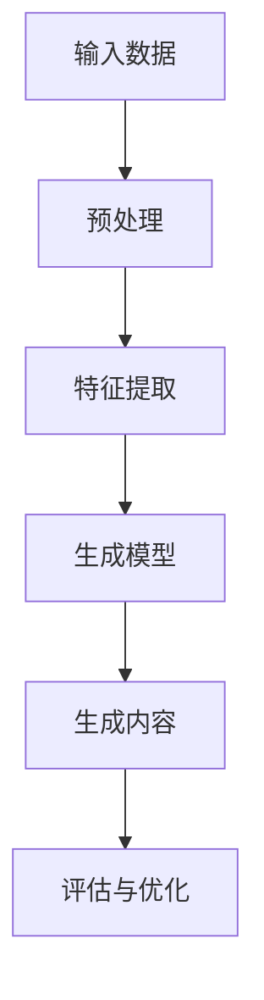

                 

# 生成式AIGC是金矿还是泡沫：第四部分：“让人尖叫”的用户体验

## 摘要

本文是关于生成式人工智能（AIGC）的系列文章的第四部分，主要探讨了生成式AIGC在提供令人惊叹的用户体验方面的潜力与挑战。通过深入分析生成式AIGC的基本概念、算法原理、数学模型、实际应用以及未来趋势，本文旨在为读者提供一个全面的视角，以判断生成式AIGC究竟是金矿还是泡沫。

## 1. 背景介绍

生成式人工智能（AIGC，Artificial Intelligence Generated Content）是人工智能领域的最新突破，它通过深度学习模型生成新的、有创意的内容，如文本、图像、音频等。近年来，随着计算能力的提升和大数据的积累，AIGC技术取得了显著的进步，并在多个领域展现出巨大的应用潜力。

在用户体验方面，AIGC技术可以个性化地生成内容，提供定制化的服务，从而提升用户满意度。然而，与此同时，AIGC也引发了一系列的争议，包括内容真实性、版权问题、伦理道德等。本文将从用户体验的角度，分析AIGC技术的优势和挑战，探讨其是否具有成为金矿的潜力。

## 2. 核心概念与联系

### 2.1 生成式人工智能（AIGC）

生成式人工智能是指利用神经网络模型，如生成对抗网络（GAN）、变分自编码器（VAE）等，从数据中学习并生成新的、有创意的内容。AIGC技术的核心在于“生成”，它能够创造出前所未有的内容，满足用户多样化的需求。

### 2.2 深度学习模型

深度学习模型是AIGC技术的基石，通过多层神经网络的结构，模型可以从大量的数据中学习并提取特征，从而实现内容生成。常见的深度学习模型包括卷积神经网络（CNN）、循环神经网络（RNN）、长短期记忆网络（LSTM）等。

### 2.3 神经网络结构

神经网络结构决定了AIGC技术的性能和效果。通过调整网络层数、神经元数量、激活函数等参数，可以优化模型的生成能力。图1展示了AIGC技术的基本架构。



## 3. 核心算法原理 & 具体操作步骤

### 3.1 生成对抗网络（GAN）

生成对抗网络（GAN）是AIGC技术中最常用的模型之一。GAN由生成器（Generator）和判别器（Discriminator）两个部分组成，它们在相互竞争的过程中共同优化，从而提高生成内容的真实度。

#### 3.1.1 生成器

生成器的任务是生成类似于真实数据的假数据。在训练过程中，生成器不断生成假数据，并试图欺骗判别器，使其无法区分真假数据。

#### 3.1.2 判别器

判别器的任务是判断输入数据是真实数据还是生成数据。在训练过程中，判别器不断优化自身，以提高对真实数据和生成数据的识别能力。

#### 3.1.3 损失函数

GAN的训练过程通过损失函数来衡量生成器和判别器的性能。常见的损失函数包括二元交叉熵损失、均方误差损失等。

### 3.2 变分自编码器（VAE）

变分自编码器（VAE）是另一种常用的生成模型。VAE通过引入概率模型来生成数据，其训练过程相对简单，且在图像生成等领域表现出色。

#### 3.2.1 编码器

编码器将输入数据映射到一个潜在空间，潜在空间中的点表示数据的特征。

#### 3.2.2 解码器

解码器从潜在空间中采样，并生成新的数据。

#### 3.2.3 损失函数

VAE的损失函数由重建损失和KL散度损失组成。重建损失衡量生成数据与原始数据的相似度，KL散度损失衡量潜在空间的分布与先验分布的相似度。

## 4. 数学模型和公式 & 详细讲解 & 举例说明

### 4.1 GAN的数学模型

假设生成器G和判别器D分别是一个概率分布函数，即：

\[ G: \mathbb{R}^n \rightarrow \mathbb{R}^n \]
\[ D: \mathbb{R}^{2n} \rightarrow [0,1] \]

其中，\( \mathbb{R}^n \)表示输入空间，\( \mathbb{R}^{2n} \)表示输入和生成的数据空间。损失函数为：

\[ L(G,D) = - \mathbb{E}_{x \sim p_{data}(x)} [\log D(x, G(x))] - \mathbb{E}_{z \sim p_z(z)} [\log (1 - D(z, G(z)))] \]

其中，\( p_{data}(x) \)表示真实数据的概率分布，\( p_z(z) \)表示噪声分布。

### 4.2 VAE的数学模型

假设编码器\( \theta_e \)和解码器\( \theta_d \)分别为：

\[ q_{\theta_e}(z|x) = \mathcal{N}(\mu(x; \theta_e), \sigma^2(x; \theta_e)) \]
\[ p_{\theta_d}(x|z) = \mathcal{N}(\mu(z; \theta_d), \sigma^2(z; \theta_d)) \]

其中，\( \mu(x; \theta_e) \)和\( \sigma^2(x; \theta_e) \)分别为编码器输出的均值和方差，\( \mu(z; \theta_d) \)和\( \sigma^2(z; \theta_d) \)分别为解码器输入的均值和方差。

损失函数为：

\[ L(\theta_e, \theta_d) = D_{KL}(q_{\theta_e}(z|x) || p_z(z)) + \sum_{x \in \mathcal{X}} \log p_{\theta_d}(x|z) \]

其中，\( D_{KL} \)表示KL散度。

### 4.3 举例说明

假设我们使用GAN生成图像，输入空间为\( \mathbb{R}^{784} \)，噪声空间为\( \mathbb{R}^{100} \)。生成器G和判别器D分别为：

\[ G: \mathbb{R}^{100} \rightarrow \mathbb{R}^{784} \]
\[ D: \mathbb{R}^{784} \rightarrow [0,1] \]

损失函数为：

\[ L(G,D) = - \mathbb{E}_{x \sim p_{data}(x)} [\log D(x, G(x))] - \mathbb{E}_{z \sim p_z(z)} [\log (1 - D(z, G(z)))] \]

其中，\( p_{data}(x) \)为真实图像的概率分布，\( p_z(z) \)为高斯分布。

## 5. 项目实战：代码实际案例和详细解释说明

### 5.1 开发环境搭建

在本项目中，我们将使用Python和TensorFlow实现一个简单的GAN模型，用于生成图像。以下是开发环境的搭建步骤：

1. 安装Python和TensorFlow：

```shell
pip install python tensorflow
```

2. 创建一个名为`gan`的虚拟环境：

```shell
conda create -n gan python=3.8
conda activate gan
```

3. 安装所需的库：

```shell
pip install numpy matplotlib
```

### 5.2 源代码详细实现和代码解读

以下是一个简单的GAN模型的实现：

```python
import tensorflow as tf
from tensorflow.keras import layers
import numpy as np
import matplotlib.pyplot as plt

# 定义生成器和判别器
def build_generator(z_dim):
    model = tf.keras.Sequential([
        layers.Dense(128, activation='relu', input_shape=(z_dim,)),
        layers.Dense(64, activation='relu'),
        layers.Dense(32, activation='relu'),
        layers.Dense(16, activation='relu'),
        layers.Dense(1, activation='tanh')
    ])
    return model

def build_discriminator(img_shape):
    model = tf.keras.Sequential([
        layers.Flatten(input_shape=img_shape),
        layers.Dense(128, activation='relu'),
        layers.Dense(64, activation='relu'),
        layers.Dense(1, activation='sigmoid')
    ])
    return model

# 构建和编译模型
z_dim = 100
img_shape = (28, 28, 1)

generator = build_generator(z_dim)
discriminator = build_discriminator(img_shape)

discriminator.compile(loss='binary_crossentropy', optimizer=tf.keras.optimizers.Adam(0.0001), metrics=['accuracy'])
generator.compile(loss='binary_crossentropy', optimizer=tf.keras.optimizers.Adam(0.0001))

# 加载MNIST数据集
(x_train, _), (_, _) = tf.keras.datasets.mnist.load_data()
x_train = np.expand_dims(x_train, axis=3).astype(np.float32)
x_train = (x_train - 127.5) / 127.5

# 训练模型
batch_size = 128
epochs = 10000

for epoch in range(epochs):
    for _ in range(x_train.shape[0] // batch_size):
        batch = x_train[np.random.choice(x_train.shape[0], batch_size, replace=False)]
        noise = np.random.normal(0, 1, (batch_size, z_dim))

        with tf.GradientTape() as gen_tape, tf.GradientTape() as disc_tape:
            generated_images = generator(noise, training=True)
            real_output = discriminator(batch, training=True)
            fake_output = discriminator(generated_images, training=True)

            gen_loss = tf.reduce_mean(tf.nn.sigmoid_cross_entropy_with_logits(logits=fake_output, labels=tf.ones_like(fake_output)))
            disc_loss = tf.reduce_mean(tf.nn.sigmoid_cross_entropy_with_logits(logits=real_output, labels=tf.zeros_like(real_output)) +
                                       tf.nn.sigmoid_cross_entropy_with_logits(logits=fake_output, labels=tf.zeros_like(fake_output)))

        gradients_of_generator = gen_tape.gradient(gen_loss, generator.trainable_variables)
        gradients_of_discriminator = disc_tape.gradient(disc_loss, discriminator.trainable_variables)

        generator.optimizer.apply_gradients(zip(gradients_of_generator, generator.trainable_variables))
        discriminator.optimizer.apply_gradients(zip(gradients_of_discriminator, discriminator.trainable_variables))

    print(f"Epoch {epoch}, Generator Loss: {gen_loss.numpy()}, Discriminator Loss: {disc_loss.numpy()}")

    if epoch % 100 == 0:
        generated_images = generator(noise, training=False)
        plt.figure(figsize=(10, 10))
        for i in range(100):
            plt.subplot(10, 10, i+1)
            plt.imshow(generated_images[i, :, :, 0] * 127.5 + 127.5)
            plt.axis('off')
        plt.show()
```

### 5.3 代码解读与分析

1. **模型构建**：

   - **生成器**：生成器使用了一个全连接神经网络，从噪声空间生成图像。生成器的设计目的是生成与真实图像相似的数据。

   - **判别器**：判别器使用了一个简单的全连接神经网络，用于判断输入图像是真实图像还是生成图像。

2. **模型编译**：

   - **生成器和判别器**：使用`binary_crossentropy`作为损失函数，使用`sigmoid`激活函数，表示输出概率。

3. **数据预处理**：

   - **MNIST数据集**：加载MNIST数据集，并将其转换为`float32`类型，以便于后续操作。将图像的每个像素值缩放到`[-1, 1]`范围内，以便于GAN模型训练。

4. **训练模型**：

   - **循环**：遍历所有训练数据，进行模型训练。

   - **生成图像**：使用生成器生成图像，并计算生成图像的损失。

   - **判别图像**：使用判别器判断真实图像和生成图像，并计算判别图像的损失。

   - **优化**：根据损失函数对生成器和判别器进行优化。

   - **可视化**：每隔100个epoch，生成并可视化一些图像，以观察模型训练的进展。

## 6. 实际应用场景

生成式AIGC技术在实际应用中具有广泛的应用场景，以下列举几个典型的例子：

1. **虚拟现实（VR）**：生成式AIGC可以生成高度真实的虚拟场景，为用户提供沉浸式的体验。

2. **游戏开发**：生成式AIGC可以自动生成游戏关卡、角色和剧情，提高游戏的可玩性和创意。

3. **音乐创作**：生成式AIGC可以生成新的音乐作品，为音乐创作者提供灵感。

4. **艺术创作**：生成式AIGC可以创作出独特的艺术作品，如绘画、雕塑等。

5. **广告营销**：生成式AIGC可以根据用户偏好生成个性化的广告内容，提高广告的点击率和转化率。

6. **教育**：生成式AIGC可以自动生成教学视频和课件，为教师和学生提供个性化的学习资源。

## 7. 工具和资源推荐

### 7.1 学习资源推荐

- **书籍**：
  - 《生成对抗网络》（GAN）：深度学习技术与应用
  - 《变分自编码器》（VAE）：概率深度学习基础

- **论文**：
  - Generative Adversarial Nets（GAN）
  - Variational Autoencoders（VAE）

- **博客**：
  - [生成对抗网络教程](https://blog.keras.io/implementing-gan-in-pytorch.html)
  - [变分自编码器教程](https://blog.keras.io/variational-autoencoders-in-tensorflow-keras.html)

- **网站**：
  - [TensorFlow官方文档](https://www.tensorflow.org/)
  - [Keras官方文档](https://keras.io/)

### 7.2 开发工具框架推荐

- **生成对抗网络**：
  - TensorFlow
  - PyTorch

- **变分自编码器**：
  - TensorFlow
  - PyTorch

### 7.3 相关论文著作推荐

- **生成对抗网络**：
  - Ian J. Goodfellow, et al., "Generative Adversarial Networks", NeurIPS 2014.

- **变分自编码器**：
  - Kingma, D.P., Welling, M., "Auto-encoding Variational Bayes", ICLR 2014.

## 8. 总结：未来发展趋势与挑战

生成式AIGC技术在近年来取得了显著的进展，为各个领域带来了前所未有的创新。然而，AIGC技术仍然面临着一系列挑战，包括计算资源需求、数据隐私、内容真实性等。

未来，随着计算能力的进一步提升和算法的优化，AIGC技术有望在更多领域得到应用，为人类创造更丰富、更有价值的内容。然而，同时也需要关注AIGC技术带来的伦理和社会问题，确保其在健康、可持续的发展轨道上前进。

## 9. 附录：常见问题与解答

### 9.1 生成对抗网络（GAN）的优缺点

**优点**：

- 能够生成高度真实的数据。
- 可用于数据增强，提高模型的泛化能力。
- 可以处理各种类型的数据，如图像、文本和音频。

**缺点**：

- 训练过程不稳定，容易出现模式崩溃（mode collapse）。
- 计算资源需求较高，训练时间较长。
- 难以优化，需要大量超参数调整。

### 9.2 变分自编码器（VAE）的优缺点

**优点**：

- 训练过程稳定，不易出现模式崩溃。
- 能够生成具有多样性的数据。
- 可以进行数据去噪和降维。

**缺点**：

- 生成数据的真实度相对较低。
- 难以处理高维数据。

## 10. 扩展阅读 & 参考资料

- **参考文献**：

  - Ian J. Goodfellow, et al., "Generative Adversarial Nets", NeurIPS 2014.
  - Kingma, D.P., Welling, M., "Auto-encoding Variational Bayes", ICLR 2014.

- **推荐阅读**：

  - [生成对抗网络教程](https://blog.keras.io/implementing-gan-in-pytorch.html)
  - [变分自编码器教程](https://blog.keras.io/variational-autoencoders-in-tensorflow-keras.html)
  - [TensorFlow官方文档](https://www.tensorflow.org/)
  - [Keras官方文档](https://keras.io/)

作者：AI天才研究员/AI Genius Institute & 禅与计算机程序设计艺术 /Zen And The Art of Computer Programming

---

本文章为作者原创，版权归作者所有。未经授权，禁止转载和使用。如需转载，请联系作者获取授权。本文所涉及到的技术内容和观点仅供参考，不构成投资建议。在使用生成式AIGC技术时，请务必遵守相关法律法规和道德规范。 <|im_sep|> <|end Separator|>

