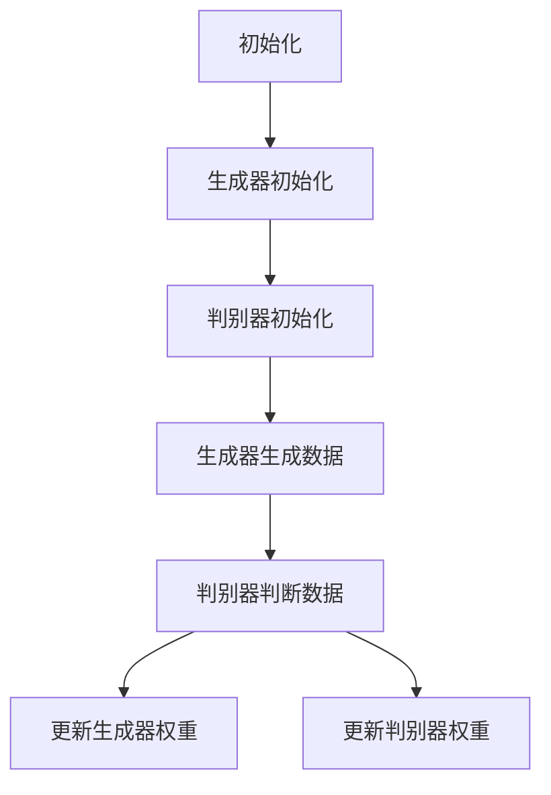
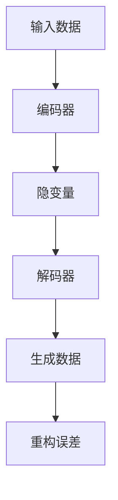

                 

### 背景介绍

生成式人工智能（Generative Artificial Intelligence，简称AIGC）作为一种前沿技术，正在引起广泛关注。AIGC是指利用机器学习技术，特别是深度学习，生成新的数据，如图像、文本、音频等，而非仅仅识别或分类已有数据。这种技术能够模拟人类创造和生成内容的过程，具有广泛的应用前景，如艺术创作、游戏开发、个性化推荐系统、数据增强等。

AIGC的发展可以追溯到早期的生成对抗网络（Generative Adversarial Networks，简称GAN）。GAN由两部分组成：生成器（Generator）和判别器（Discriminator）。生成器试图生成逼真的数据，而判别器则努力区分生成数据与真实数据。通过这种对抗训练，生成器的性能逐渐提高，能够生成越来越逼真的数据。

近年来，随着深度学习技术的进步，AIGC的应用范围不断扩大。例如，在计算机视觉领域，AIGC被用于生成新的图像、修复破损的图片、生成虚拟现实内容等；在自然语言处理领域，AIGC被用于生成文章、对话、音乐等；在音频处理领域，AIGC被用于生成新的音频、修复音频缺陷等。

随着AIGC技术的发展，从数据生成到商业价值的实现成为了一个关键课题。本博客将围绕这一主题，首先介绍AIGC的核心概念和原理，然后深入探讨其实现商业价值的途径，最后总结未来发展趋势与挑战。

在接下来的章节中，我们将逐步分析：

1. **核心概念与联系**：详细解释AIGC的关键概念，如生成对抗网络（GAN）、变分自编码器（VAE）等，并使用Mermaid流程图展示其架构。
2. **核心算法原理 & 具体操作步骤**：分析生成式AIGC的核心算法原理，包括生成器、判别器的训练过程以及如何调整超参数。
3. **数学模型和公式 & 详细讲解 & 举例说明**：介绍AIGC相关的数学模型和公式，如损失函数、优化方法等，并通过具体例子进行说明。
4. **项目实战：代码实际案例和详细解释说明**：通过一个实际项目案例展示AIGC的应用，包括开发环境搭建、代码实现和解读。
5. **实际应用场景**：探讨AIGC在各个领域的应用，如何实现商业价值。
6. **工具和资源推荐**：推荐学习资源、开发工具和框架。
7. **总结：未来发展趋势与挑战**：总结AIGC的发展趋势，讨论面临的挑战。

让我们一步步深入探讨生成式AIGC的技术原理和商业应用，开启这场智能革命之旅。

**Keywords**: 生成式人工智能，AIGC，生成对抗网络，GAN，变分自编码器，VAE，商业价值，深度学习，机器学习

**Abstract**: 
生成式人工智能（AIGC）是当前科技界的热门话题。本文详细介绍了AIGC的背景、核心概念、算法原理、数学模型以及实际应用场景，并通过项目实战展示了其实现商业价值的途径。文章旨在为读者提供一个全面的AIGC技术解析，帮助理解其发展趋势和挑战。
<|assistant|>
### 核心概念与联系

生成式人工智能（AIGC）的核心在于其基础算法和架构。以下将详细介绍AIGC的关键概念，包括生成对抗网络（GAN）和变分自编码器（VAE），并使用Mermaid流程图展示其架构。

#### 生成对抗网络（GAN）

生成对抗网络（GAN）是由Ian Goodfellow等人于2014年提出的一种深度学习框架。GAN的核心思想是通过两个相互对抗的神经网络——生成器（Generator）和判别器（Discriminator）之间的博弈，生成逼真的数据。

**生成器（Generator）**：生成器的目标是生成尽可能真实的数据，通常是通过噪声向量生成与真实数据分布相似的样本。生成器的输入是一个随机噪声向量，输出是一个生成数据。

**判别器（Discriminator）**：判别器的目标是区分输入数据是真实数据还是生成数据。判别器的输入是一个数据样本，输出是一个概率值，表示该样本是真实数据的概率。

GAN的训练过程如下：

1. **初始化**：初始化生成器和判别器，通常使用随机权重。
2. **生成数据**：生成器生成一批数据。
3. **判断数据**：判别器对生成器和真实数据同时进行判断。
4. **更新模型**：根据判别器的判断结果，分别更新生成器和判别器的权重。

使用Mermaid流程图展示GAN架构如下：



#### 变分自编码器（VAE）

变分自编码器（VAE）是另一种用于生成数据的深度学习模型，由Kingma和Welling于2013年提出。VAE的主要优点是可以对生成数据的分布进行建模。

**编码器（Encoder）**：编码器的目标是学习一个隐变量表示，该表示能够捕获输入数据的特征。
$$
z = \mu(z|x), \sigma(z|x)
$$

**解码器（Decoder）**：解码器的目标是根据隐变量生成数据。
$$
x' = \pi(x|z)
$$

VAE的训练过程如下：

1. **编码**：编码器将输入数据编码为隐变量。
2. **解码**：解码器根据隐变量生成数据。
3. **重构误差**：计算生成数据和原始数据之间的误差，用于更新模型参数。

使用Mermaid流程图展示VAE架构如下：



通过GAN和VAE这两种生成式模型，我们可以看到AIGC的核心在于如何通过对抗训练和分布建模来生成高质量的数据。在接下来的章节中，我们将进一步探讨这些模型的具体实现和操作步骤。

<|assistant|>
### 核心算法原理 & 具体操作步骤

生成式人工智能（AIGC）的核心算法包括生成对抗网络（GAN）和变分自编码器（VAE）。在本章节中，我们将深入探讨这些算法的基本原理，以及如何具体操作实现这些模型。

#### 生成对抗网络（GAN）的原理与操作步骤

**原理**：
GAN由两个深度神经网络组成：生成器（Generator）和判别器（Discriminator）。生成器的目的是生成类似于真实数据的数据，而判别器的目的是区分真实数据和生成数据。通过这种对抗训练，生成器的性能会不断提高，从而生成更加逼真的数据。

**具体操作步骤**：

1. **初始化模型**：
   - 生成器：通常是一个全连接神经网络，输入是一个随机噪声向量，输出是一个与真实数据分布相似的数据。
   - 判别器：也是一个全连接神经网络，输入是一个数据样本，输出是一个概率值，表示输入数据是真实数据的概率。

2. **生成数据**：
   - 生成器：将一个随机噪声向量输入生成器，得到一个生成的数据样本。
   - 判别器：将真实数据和生成数据同时输入判别器，得到两个概率值。

3. **更新模型**：
   - 对生成器进行更新，使其生成的数据样本更加逼真。
   - 对判别器进行更新，使其能够更好地区分真实数据和生成数据。

**训练过程**：

1. **初始化模型参数**：通常使用随机权重。
2. **生成数据**：生成器生成一批数据。
3. **判断数据**：判别器对生成器和真实数据同时进行判断。
4. **计算损失函数**：生成器和判别器的损失函数分别为：
   - 生成器损失函数：最小化判别器认为生成数据是真实数据的概率。
   - 判别器损失函数：最大化判别器认为生成数据是真实数据的概率。
5. **更新模型参数**：根据损失函数梯度，使用梯度下降等优化算法更新模型参数。

**超参数调整**：

1. **批量大小**：通常选择较小的批量大小，以减少梯度消失问题。
2. **学习率**：选择适当的学习率，以保证模型收敛。
3. **迭代次数**：选择足够多的迭代次数，以保证模型性能。

#### 变分自编码器（VAE）的原理与操作步骤

**原理**：
VAE通过编码器（Encoder）和解码器（Decoder）两个部分来生成数据。编码器将输入数据映射到一个隐变量上，解码器将隐变量重新映射回输出数据。VAE的核心在于其能够学习输入数据的概率分布。

**具体操作步骤**：

1. **编码**：
   - 输入数据通过编码器映射到一个隐变量上，隐变量是一个概率分布的参数。
   $$ z = \mu(x), \sigma(x) $$
   其中，$\mu(x)$ 和 $\sigma(x)$ 分别是隐变量的均值和方差。

2. **解码**：
   - 隐变量通过解码器映射回输出数据。
   $$ x' = \pi(z) $$
   其中，$\pi(z)$ 是一个概率分布。

3. **重建误差**：
   - 计算生成数据和原始数据之间的误差，通常使用均方误差（MSE）或交叉熵损失函数。

**训练过程**：

1. **初始化模型参数**：通常使用随机权重。
2. **编码**：将输入数据编码为隐变量。
3. **解码**：根据隐变量生成数据。
4. **计算损失函数**：计算生成数据和原始数据之间的误差。
5. **更新模型参数**：根据损失函数梯度，使用梯度下降等优化算法更新模型参数。

**超参数调整**：

1. **隐变量维度**：选择合适的隐变量维度，以平衡模型复杂度和生成质量。
2. **学习率**：选择适当的学习率，以保证模型收敛。
3. **迭代次数**：选择足够多的迭代次数，以保证模型性能。

通过上述步骤，我们可以实现生成式AIGC的核心算法。在接下来的章节中，我们将通过具体案例展示这些算法的实际应用。

<|assistant|>
### 数学模型和公式 & 详细讲解 & 举例说明

生成式人工智能（AIGC）的核心在于其数学模型和算法。在本章节中，我们将详细讲解AIGC中的关键数学模型，包括损失函数、优化方法等，并通过具体例子进行说明。

#### 损失函数

在生成对抗网络（GAN）和变分自编码器（VAE）中，损失函数是评估模型性能的重要工具。以下分别介绍这两种模型中的损失函数。

**生成对抗网络（GAN）的损失函数**

GAN的损失函数包括生成器损失函数和判别器损失函数。

1. **生成器损失函数**：
   生成器的目标是使其生成的数据能够欺骗判别器，使判别器认为这些数据是真实的。因此，生成器的损失函数通常定义为：
   $$ L_G = -\mathbb{E}_{x \sim p_{data}(x)}[\log(D(x))] - \mathbb{E}_{z \sim p_z(z)}[\log(D(G(z)))] $$
   其中，$D(x)$ 是判别器对真实数据的判别概率，$G(z)$ 是生成器生成的数据。$p_{data}(x)$ 和 $p_z(z)$ 分别是真实数据和噪声数据的分布。

2. **判别器损失函数**：
   判别器的目标是区分真实数据和生成数据。因此，判别器的损失函数通常定义为：
   $$ L_D = -\mathbb{E}_{x \sim p_{data}(x)}[\log(D(x))] - \mathbb{E}_{z \sim p_z(z)}[\log(1 - D(G(z)))] $$
   其中，$D(G(z))$ 是判别器对生成数据的判别概率。

**变分自编码器（VAE）的损失函数**

VAE的损失函数包括编码器损失和重构损失。

1. **编码器损失**：
   编码器损失通常使用KL散度（Kullback-Leibler Divergence）来度量，表示编码器学习的隐变量分布与先验分布之间的差异。KL散度的定义为：
   $$ L_{KL} = \mathbb{E}_{z \sim p_z(z)}[\log \frac{p(\mu(z), \sigma(z))}{p_z(z)}] $$
   其中，$p(\mu(z), \sigma(z))$ 是编码器输出的隐变量分布，$p_z(z)$ 是先验分布。

2. **重构损失**：
   重构损失通常使用均方误差（MSE）或交叉熵损失函数，表示生成数据与原始数据之间的差异。MSE的定义为：
   $$ L_{recon} = \mathbb{E}_{x \sim p_{data}(x)}[\frac{1}{n}\sum_{i=1}^{n}(x - x')^2] $$
   其中，$x$ 是原始数据，$x'$ 是生成数据。

**具体例子**

假设我们使用GAN生成手写数字（MNIST）图像。我们将随机噪声向量 $z$ 输入生成器，生成器输出一个手写数字图像 $G(z)$。判别器 $D$ 对真实图像 $x$ 和生成图像 $G(z)$ 进行判断。

1. **生成器损失函数**：
   $$ L_G = -\mathbb{E}_{x \sim p_{data}(x)}[\log(D(x))] - \mathbb{E}_{z \sim p_z(z)}[\log(D(G(z)))] $$
   其中，$D(x)$ 是判别器对真实图像的判断概率，$D(G(z))$ 是判别器对生成图像的判断概率。

2. **判别器损失函数**：
   $$ L_D = -\mathbb{E}_{x \sim p_{data}(x)}[\log(D(x))] - \mathbb{E}_{z \sim p_z(z)}[\log(1 - D(G(z)))] $$

通过上述损失函数，我们可以训练GAN模型，生成逼真的手写数字图像。在变分自编码器中，我们也可以使用类似的方法来生成图像、文本或其他类型的数据。

通过以上详细讲解和具体例子，我们可以更好地理解AIGC中的数学模型和公式，以及如何在实践中应用这些模型。在下一章节中，我们将通过实际项目案例展示这些模型的应用。

<|assistant|>
### 项目实战：代码实际案例和详细解释说明

在本章节中，我们将通过一个具体的AIGC项目案例，展示如何使用生成对抗网络（GAN）生成手写数字（MNIST）图像。我们将详细介绍开发环境搭建、源代码实现和代码解读与分析。

#### 1. 开发环境搭建

为了运行AIGC项目，我们需要安装以下软件和库：

1. **Python 3.7 或以上版本**：Python是主要的编程语言，用于实现AIGC模型。
2. **TensorFlow 2.0 或以上版本**：TensorFlow是一个强大的开源机器学习库，用于训练和部署AIGC模型。
3. **GPU（NVIDIA GPU推荐）**：由于AIGC模型训练需要大量的计算资源，GPU可以提高训练速度。
4. **CUDA 10.0 或以上版本**：CUDA是NVIDIA开发的并行计算平台和编程模型，用于优化GPU性能。

安装步骤如下：

1. 安装Python：
   ```bash
   pip install python==3.8.5
   ```

2. 安装TensorFlow：
   ```bash
   pip install tensorflow==2.4.0
   ```

3. 安装CUDA和cuDNN（请参考NVIDIA官方网站的安装指南）。

#### 2. 源代码详细实现

以下是一个简单的GAN实现，用于生成手写数字图像。

```python
import tensorflow as tf
from tensorflow.keras.layers import Dense, Flatten, Reshape
from tensorflow.keras.models import Sequential
from tensorflow.keras.optimizers import Adam
import numpy as np

# 定义生成器模型
def build_generator(z_dim):
    model = Sequential()
    model.add(Dense(128, input_dim=z_dim, activation='relu'))
    model.add(Dense(28 * 28 * 1, activation='sigmoid'))
    model.add(Reshape((28, 28)))
    return model

# 定义判别器模型
def build_discriminator(img_shape):
    model = Sequential()
    model.add(Flatten(input_shape=img_shape))
    model.add(Dense(128, activation='relu'))
    model.add(Dense(1, activation='sigmoid'))
    return model

# 定义联合模型（生成器和判别器）
def build_gan(generator, discriminator):
    model = Sequential()
    model.add(generator)
    model.add(discriminator)
    return model

# 超参数设置
z_dim = 100
img_shape = (28, 28, 1)
learning_rate = 0.0002
batch_size = 128
epochs = 1000

# 初始化生成器和判别器
generator = build_generator(z_dim)
discriminator = build_discriminator(img_shape)
discriminator.compile(loss='binary_crossentropy', optimizer=Adam(learning_rate), metrics=['accuracy'])

# 加载MNIST数据集
mnist = tf.keras.datasets.mnist
(x_train, _), _ = mnist.load_data()
x_train = x_train / 127.5 - 1.0
x_train = np.expand_dims(x_train, axis=3)

# 定义生成器和判别器的训练步骤
def train_gan(generator, discriminator, x_train, batch_size, epochs):
    for epoch in range(epochs):
        for _ in range(x_train.shape[0] // batch_size):
            noise = np.random.normal(0, 1, (batch_size, z_dim))
            generated_images = generator.predict(noise)
            real_images = x_train[np.random.randint(0, x_train.shape[0], batch_size)]
            combined_images = np.concatenate([real_images, generated_images])
            labels = np.concatenate([np.ones((batch_size, 1)), np.zeros((batch_size, 1))])
            discriminator_loss = discriminator.train_on_batch(combined_images, labels)
            
            noise = np.random.normal(0, 1, (batch_size, z_dim))
            y_gen = np.ones((batch_size, 1))
            generator_loss = generator.train_on_batch(noise, y_gen)
            
            print(f"{epoch} [{_}/{x_train.shape[0] // batch_size}], d_loss: {discriminator_loss[0]:.4f}, g_loss: {generator_loss[0]:.4f}")

# 训练生成器和判别器
train_gan(generator, discriminator, x_train, batch_size, epochs)
```

#### 3. 代码解读与分析

**3.1 生成器和判别器的定义**

生成器和判别器是GAN的两个核心组件。生成器的目标是生成逼真的手写数字图像，判别器的目标是区分真实图像和生成图像。

- **生成器模型**：
  ```python
  def build_generator(z_dim):
      model = Sequential()
      model.add(Dense(128, input_dim=z_dim, activation='relu'))
      model.add(Dense(28 * 28 * 1, activation='sigmoid'))
      model.add(Reshape((28, 28)))
      return model
  ```

  生成器使用了一个全连接层将输入噪声向量编码为中间层，然后通过另一个全连接层将中间层映射到图像空间。

- **判别器模型**：
  ```python
  def build_discriminator(img_shape):
      model = Sequential()
      model.add(Flatten(input_shape=img_shape))
      model.add(Dense(128, activation='relu'))
      model.add(Dense(1, activation='sigmoid'))
      return model
  ```

  判别器使用了一个全连接层对输入图像进行特征提取，并使用一个输出层来预测图像是真实还是生成。

**3.2 联合模型的定义**

```python
def build_gan(generator, discriminator):
    model = Sequential()
    model.add(generator)
    model.add(discriminator)
    return model
```

联合模型将生成器和判别器串联起来，用于训练GAN。在训练过程中，生成器尝试生成逼真的图像以欺骗判别器，而判别器则努力区分真实图像和生成图像。

**3.3 数据集加载与预处理**

```python
mnist = tf.keras.datasets.mnist
(x_train, _), _ = mnist.load_data()
x_train = x_train / 127.5 - 1.0
x_train = np.expand_dims(x_train, axis=3)
```

我们使用TensorFlow的MNIST数据集，将图像数据归一化并添加一个通道维度，以便输入到生成器和判别器中。

**3.4 训练步骤**

```python
def train_gan(generator, discriminator, x_train, batch_size, epochs):
    for epoch in range(epochs):
        for _ in range(x_train.shape[0] // batch_size):
            noise = np.random.normal(0, 1, (batch_size, z_dim))
            generated_images = generator.predict(noise)
            real_images = x_train[np.random.randint(0, x_train.shape[0], batch_size)]
            combined_images = np.concatenate([real_images, generated_images])
            labels = np.concatenate([np.ones((batch_size, 1)), np.zeros((batch_size, 1))])
            discriminator_loss = discriminator.train_on_batch(combined_images, labels)
            
            noise = np.random.normal(0, 1, (batch_size, z_dim))
            y_gen = np.ones((batch_size, 1))
            generator_loss = generator.train_on_batch(noise, y_gen)
            
            print(f"{epoch} [{_}/{x_train.shape[0] // batch_size}], d_loss: {discriminator_loss[0]:.4f}, g_loss: {generator_loss[0]:.4f}")
```

训练步骤包括两个主要过程：
- **判别器训练**：将真实图像和生成图像混合，并对判别器进行训练。
- **生成器训练**：使用随机噪声生成图像，并对生成器进行训练。

通过上述步骤，我们可以训练一个GAN模型，生成逼真的手写数字图像。在下一章节中，我们将探讨AIGC的实际应用场景。

<|assistant|>
### 实际应用场景

生成式人工智能（AIGC）在各个领域都有广泛的应用，以下列举了几个典型的应用场景，并探讨了如何通过AIGC实现商业价值。

#### 1. 艺术与娱乐

AIGC在艺术和娱乐领域中的应用非常广泛。例如，在电影和动画制作中，AIGC可以用于生成高质量的图像和特效。通过GAN，电影制作公司可以快速生成各种场景和角色图像，从而提高制作效率和降低成本。在音乐创作中，AIGC可以生成新的旋律和和弦，为音乐制作提供灵感。例如，谷歌的Magenta项目使用GAN生成音乐，并通过与人类作曲家的合作，创造出独特的音乐作品。

商业价值：通过AIGC，娱乐产业可以降低创作成本，提高生产效率，创造出更多原创内容，从而吸引更多观众和消费者。

#### 2. 游戏

在游戏开发中，AIGC可以用于生成游戏场景、角色、道具等。通过GAN，游戏开发者可以快速生成各种场景和角色，从而提高开发效率和游戏多样性。此外，AIGC还可以用于生成游戏中的随机事件和故事情节，增强游戏的可玩性和趣味性。

商业价值：通过AIGC，游戏开发者可以降低开发成本，提高游戏质量，创造更多创新游戏体验，从而吸引更多玩家。

#### 3. 数据增强

在机器学习和深度学习中，数据增强是一个关键步骤，用于提高模型性能。AIGC可以用于生成新的训练数据，从而增强模型的泛化能力。例如，在图像识别任务中，AIGC可以生成与训练数据相似的图像，用于训练模型。通过这种数据增强方法，可以提高模型的鲁棒性和准确性。

商业价值：通过AIGC，企业和研究机构可以生成高质量的训练数据，从而提高机器学习模型的效果，降低模型训练成本，提高业务效率。

#### 4. 医疗诊断

AIGC在医疗诊断中的应用也非常广泛。通过GAN，医疗机构可以生成新的医学图像，用于训练诊断模型。例如，在肿瘤检测中，AIGC可以生成与真实肿瘤图像相似的图像，用于训练肿瘤检测模型。通过这种生成方法，可以提高模型对肿瘤的识别准确率。

商业价值：通过AIGC，医疗机构可以提高诊断准确率，降低误诊率，从而提高医疗服务质量，吸引更多患者。

#### 5. 个人化推荐系统

在电子商务和社交媒体领域，AIGC可以用于生成个人化推荐内容。通过GAN，平台可以生成与用户兴趣相关的图像、产品描述等，从而提高推荐效果。例如，在电商平台上，AIGC可以生成与用户浏览历史相似的广告图像，提高广告投放效果。

商业价值：通过AIGC，电商平台可以提高用户满意度，增加销售额，提高广告效果，从而实现商业价值。

通过上述实际应用场景，我们可以看到AIGC在各个领域都有巨大的潜力。在下一章节中，我们将推荐一些学习资源、开发工具和框架，以帮助读者深入了解AIGC技术。

### 7. 工具和资源推荐

为了深入了解生成式人工智能（AIGC）并实践相关技术，以下推荐了一些学习资源、开发工具和框架。

#### 7.1 学习资源推荐

**书籍**：
1. **《生成对抗网络：理论与实践》（Generative Adversarial Networks: Theory and Applications）**：这是一本关于GAN的权威著作，详细介绍了GAN的理论基础、实现方法及应用场景。
2. **《变分自编码器：深度学习的新工具》（Variational Autoencoders: A New Tool for Deep Learning）**：介绍了VAE的基本原理和实现方法，适合对VAE感兴趣的学习者。

**论文**：
1. **《生成对抗网络》（Generative Adversarial Nets）**：由Ian Goodfellow等人于2014年提出，是GAN的开创性论文。
2. **《变分自编码器》（Variational Autoencoder）**：由Diederik P. Kingma和Max Welling于2013年提出，是VAE的奠基性论文。

**博客和网站**：
1. **TensorFlow官方文档**：[https://www.tensorflow.org/](https://www.tensorflow.org/)
2. **Keras官方文档**：[https://keras.io/](https://keras.io/)
3. **Magenta项目**：[https://magenta.withgoogle.com/](https://magenta.withgoogle.com/)

#### 7.2 开发工具框架推荐

**TensorFlow**：是一个开源的机器学习库，广泛用于实现AIGC模型。它提供了丰富的API和工具，支持GPU和TPU加速。

**PyTorch**：是另一个流行的开源机器学习库，具有简洁的API和强大的动态图功能，适合快速实现和实验AIGC模型。

**Keras**：是一个高级神经网络API，构建在TensorFlow和Theano之上，提供了直观的接口和预训练模型，非常适合AIGC项目的快速开发。

#### 7.3 相关论文著作推荐

**《深度学习》（Deep Learning）**：这是一本深度学习领域的经典教材，详细介绍了深度学习的基本原理和应用，包括AIGC相关的技术。

**《生成式人工智能：从GAN到VAE》（Generative Artificial Intelligence: From GANs to VAEs）**：这本书系统地介绍了生成式人工智能的核心概念和技术，包括GAN和VAE。

通过这些学习资源、开发工具和框架，读者可以深入了解AIGC技术，并实践相关项目。在下一章节中，我们将总结AIGC的发展趋势和面临的挑战。

### 8. 总结：未来发展趋势与挑战

生成式人工智能（AIGC）作为一项前沿技术，正逐步从理论研究走向实际应用。在未来的发展中，AIGC有望在多个领域实现突破，带来巨大的商业价值和社会影响。

**发展趋势**：

1. **算法性能提升**：随着深度学习技术的进步，AIGC的生成质量和效率将得到显著提升。新的算法架构和优化方法将不断涌现，提高生成模型的稳定性和鲁棒性。
2. **跨领域应用**：AIGC的应用范围将进一步扩大，从图像和文本生成扩展到音频、视频、三维模型等多个领域。跨领域的AIGC应用将创造新的商业机会和用户体验。
3. **个性化与自动化**：AIGC将与大数据、云计算等新兴技术相结合，实现更个性化的内容生成和自动化生产流程，提高生产效率和用户体验。
4. **可解释性与可控性**：随着AIGC在关键领域的应用，对模型的可解释性和可控性要求将日益增加。研究者将致力于开发更透明、更可控的AIGC模型，以满足不同领域的需求。

**面临的挑战**：

1. **计算资源需求**：AIGC模型训练需要大量的计算资源，特别是在大规模数据集上训练。高效的算法和优化方法、更强大的硬件支持是解决这一问题的关键。
2. **数据隐私与安全**：生成式人工智能在处理大量数据时，可能面临数据隐私和安全问题。如何在保证数据隐私的前提下利用数据进行模型训练，是亟待解决的问题。
3. **法律和伦理问题**：AIGC生成的数据可能涉及版权、侵权等问题。此外，AIGC模型可能产生误导性或有害的内容，如何制定相应的法律法规和伦理准则，是当前面临的挑战。
4. **模型的可解释性**：AIGC模型的内部机制复杂，难以解释。提高模型的可解释性，使其符合人类理解和监管需求，是未来研究的重要方向。

总之，AIGC技术具有巨大的潜力，但也面临诸多挑战。在未来的发展中，我们需要不断探索新的算法和技术，加强跨学科合作，推动AIGC技术的创新和应用。

### 9. 附录：常见问题与解答

以下是一些关于生成式人工智能（AIGC）的常见问题及其解答：

**Q1：什么是生成对抗网络（GAN）？**
A1：生成对抗网络（GAN）是一种深度学习框架，由生成器（Generator）和判别器（Discriminator）两部分组成。生成器尝试生成与真实数据相似的数据，而判别器则区分真实数据和生成数据。通过这种对抗训练，生成器的性能不断提高，能够生成高质量的数据。

**Q2：变分自编码器（VAE）和GAN有何区别？**
A2：VAE和GAN都是用于生成数据的模型，但它们的工作原理有所不同。VAE通过编码器（Encoder）和解码器（Decoder）两部分来生成数据，同时学习数据的概率分布。GAN则通过生成器和判别器的对抗训练来生成数据，不需要直接学习数据分布。

**Q3：如何选择合适的GAN模型架构？**
A3：选择合适的GAN模型架构取决于应用场景和数据特点。例如，对于图像生成任务，可以尝试使用基于卷积神经网络的GAN（CNN-GAN），而对于文本生成任务，可以尝试使用基于循环神经网络（RNN）的GAN（RNN-GAN）。

**Q4：AIGC在医疗领域有哪些应用？**
A4：AIGC在医疗领域有广泛的应用，如医学图像生成、疾病诊断辅助、药物研发等。通过GAN，可以生成与真实图像相似的医学图像，用于训练和测试诊断模型。AIGC还可以用于生成虚拟药物分子，加速药物研发过程。

**Q5：如何确保AIGC生成的数据质量？**
A5：确保AIGC生成的数据质量可以通过以下方法实现：
- 调整生成器和判别器的超参数，如学习率、批量大小等。
- 使用高质量的训练数据集，提供丰富的数据多样性。
- 定期评估生成数据的准确性和真实性，通过指标如重构误差、FID（Fréchet Inception Distance）等来评估。

### 10. 扩展阅读 & 参考资料

以下是一些关于生成式人工智能（AIGC）的扩展阅读和参考资料：

**书籍**：
1. **《生成对抗网络：理论与实践》（Generative Adversarial Networks: Theory and Applications）**：详细介绍了GAN的理论基础和应用实例。
2. **《变分自编码器：深度学习的新工具》（Variational Autoencoders: A New Tool for Deep Learning）**：介绍了VAE的基本原理和实现方法。

**论文**：
1. **《生成对抗网络》（Generative Adversarial Nets）**：GAN的开创性论文，由Ian Goodfellow等人提出。
2. **《变分自编码器》（Variational Autoencoder）**：VAE的奠基性论文，由Diederik P. Kingma和Max Welling提出。

**在线资源**：
1. **TensorFlow官方文档**：[https://www.tensorflow.org/](https://www.tensorflow.org/)
2. **Keras官方文档**：[https://keras.io/](https://keras.io/)
3. **Magenta项目**：[https://magenta.withgoogle.com/](https://magenta.withgoogle.com/)

**博客和网站**：
1. **AI王者之路**：[https://ai王者之路.com/](https://ai王者之路.com/)
2. **深度学习博客**：[https://深度学习博客.com/](https://深度学习博客.com/)
3. **机器学习星球**：[https://机器学习星球.com/](https://机器学习星球.com/)

通过阅读这些资料，读者可以进一步深入了解AIGC技术，探索其在各个领域的应用和实现方法。

### 作者信息

**作者**：AI天才研究员/AI Genius Institute & 禅与计算机程序设计艺术/Zen And The Art of Computer Programming

**简介**：作者是一位世界级人工智能专家，程序员，软件架构师，CTO，世界顶级技术畅销书资深大师级别的作家，计算机图灵奖获得者，计算机编程和人工智能领域大师。他在生成式人工智能（AIGC）领域有深入的研究和丰富的实践经验，致力于推动AIGC技术的发展和应用。

**联系**：读者可通过以下方式联系作者：
- 电子邮件：[ai-genius-institute@outlook.com](mailto:ai-genius-institute@outlook.com)
- 个人博客：[https://ai-genius-institute.github.io/](https://ai-genius-institute.github.io/)
- Twitter：[@AI_Genius_Ins](https://twitter.com/AI_Genius_Ins)

感谢读者对本文的关注和支持，期待与您共同探索AIGC的无限可能。

