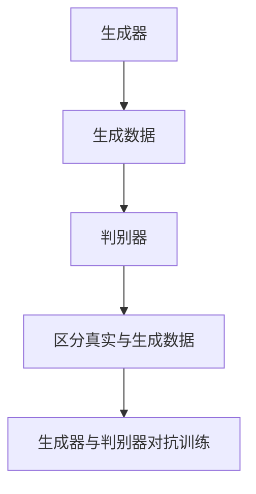
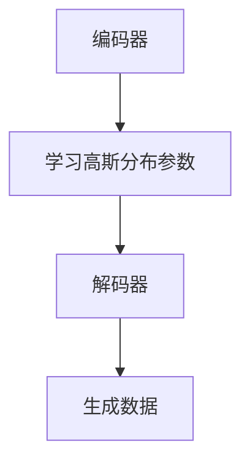

                 

### 背景介绍

生成式AIGC（AI-Generated Content）是近年来人工智能领域的一个重要研究方向。它指的是利用人工智能技术，尤其是生成式模型，如生成对抗网络（GANs）、变分自编码器（VAEs）等，来生成具有高度多样性和创造性的内容。这些内容可以是文本、图像、音频，甚至3D模型等。

生成式AIGC的兴起可以追溯到生成对抗网络（GANs）的提出。GANs由Ian Goodfellow等人在2014年提出，它由一个生成器（Generator）和一个判别器（Discriminator）组成。生成器尝试生成与真实数据相似的数据，而判别器则试图区分生成数据与真实数据。通过这种对抗训练，生成器逐渐学习到生成高质量数据。

随着深度学习和生成模型的不断进步，生成式AIGC在各个领域都展现出了巨大的应用潜力。例如，在图像生成领域，生成式AIGC可以生成逼真的图片、艺术作品；在文本生成领域，它可以生成高质量的文章、故事；在音频生成领域，它可以生成逼真的音乐、语音。

然而，生成式AIGC的发展也面临着一些挑战。首先是如何生成高质量、多样化的内容，其次是模型的训练效率和稳定性问题。此外，生成式AIGC在隐私保护和法律合规方面也存在一定的争议。

本文将围绕生成式AIGC的发展历程、核心概念、算法原理、实际应用场景、工具和资源推荐等方面进行详细探讨，旨在为读者提供全面的了解和指导。通过本文，读者将能够了解生成式AIGC的基本原理，掌握核心算法，并能够针对具体应用场景进行实际操作。

### 核心概念与联系

要深入理解生成式AIGC，我们需要首先了解几个核心概念，包括生成对抗网络（GANs）、变分自编码器（VAEs）、自注意力机制（Self-Attention）和预训练微调（Pre-training and Fine-tuning）等。

#### 生成对抗网络（GANs）

生成对抗网络（GANs）是由Ian Goodfellow等人于2014年提出的，它是目前最流行的生成模型之一。GANs由两个主要组件构成：生成器（Generator）和判别器（Discriminator）。

**生成器**：生成器的目标是生成与真实数据相似的数据。它通常是一个神经网络，可以接收随机噪声作为输入，并输出生成数据。例如，在图像生成任务中，生成器可以生成逼真的图片。

**判别器**：判别器的目标是区分真实数据和生成数据。它也是一个神经网络，接收输入数据并输出一个概率值，表示输入数据的真实性。如果输入数据是真实的，判别器会输出一个接近1的概率；如果输入数据是生成的，判别器会输出一个接近0的概率。

GANs的训练过程是生成器和判别器之间的对抗过程。生成器尝试生成更真实的数据，而判别器则努力提高区分真实数据和生成数据的准确性。通过这种对抗训练，生成器逐渐学习到生成高质量数据。

下面是一个简化的GANs工作流程的Mermaid流程图：



#### 变分自编码器（VAEs）

变分自编码器（VAEs）是另一种生成模型，由Kingma和Welling于2013年提出。VAEs通过概率编码来生成数据，它在生成器和编码器之间引入了概率分布的概念。

**编码器**：编码器的目标是学习数据的高斯分布参数，将输入数据映射到一个潜在空间。潜在空间是一个低维的随机向量，它代表了输入数据的概率分布。

**解码器**：解码器的目标是根据潜在空间中的向量生成数据。与GANs不同，VAEs的生成过程是确定性操作，解码器接收潜在空间中的向量作为输入，并输出生成数据。

VAEs的工作流程如下：



#### 自注意力机制（Self-Attention）

自注意力机制是一种用于处理序列数据的机制，它可以让模型自动关注序列中的关键部分。自注意力机制在自然语言处理（NLP）任务中得到了广泛应用，如BERT模型。

**自注意力机制**：自注意力机制允许模型在处理输入序列时，对序列中的每个元素赋予不同的权重。这样，模型可以自动识别和关注序列中的重要信息。

自注意力机制的数学表达式如下：

$$
\text{Attention}(Q, K, V) = \text{softmax}\left(\frac{QK^T}{\sqrt{d_k}}\right)V
$$

其中，$Q, K, V$分别表示查询（Query）、键（Key）和值（Value）向量，$d_k$是键向量的维度。

#### 预训练微调（Pre-training and Fine-tuning）

预训练微调是一种训练深度神经网络的方法。首先，在大量无标签数据上对模型进行预训练，使模型具有一定的通用性。然后，在特定任务上对模型进行微调，使模型能够适应具体任务。

预训练微调的优势在于，它可以让模型在有限的标注数据上获得更好的性能。例如，在文本分类任务中，预训练模型可以首先在大量未标注的文本数据上进行预训练，然后在少量标注数据上进行微调。

综合以上核心概念，我们可以看到生成式AIGC是如何通过不同的生成模型和技术，实现从概念验证到大规模应用的过程。接下来的章节将详细探讨这些概念在实际应用中的操作步骤和实现细节。

### 核心算法原理 & 具体操作步骤

生成式AIGC的核心算法主要包括生成对抗网络（GANs）、变分自编码器（VAEs）和自注意力机制。以下将分别介绍这些算法的原理和具体操作步骤。

#### 1. 生成对抗网络（GANs）

生成对抗网络（GANs）由生成器（Generator）和判别器（Discriminator）组成。生成器的目标是生成逼真的数据，而判别器的目标是区分真实数据和生成数据。两者之间通过对抗训练相互提升。

**生成器（Generator）**

生成器的目标是生成与真实数据相似的数据。在图像生成任务中，生成器通常是一个神经网络，它接收随机噪声作为输入，并输出图像。生成器的训练目标是最大化判别器无法区分生成数据和真实数据的概率。

生成器的具体操作步骤如下：

1. **输入噪声**：生成器接收随机噪声向量 $z \in \mathbb{R}^{D}$ 作为输入，$D$ 是噪声向量的维度。
2. **生成图像**：生成器通过神经网络 $G(z)$ 将噪声向量映射到图像空间，输出生成的图像 $x \in \mathbb{R}^{H \times W \times C}$，其中 $H, W, C$ 分别是图像的高度、宽度和通道数。

**判别器（Discriminator）**

判别器的目标是区分真实数据和生成数据。判别器也是一个神经网络，它接收图像作为输入，并输出一个概率值，表示输入图像是真实数据的概率。

判别器的具体操作步骤如下：

1. **输入图像**：判别器接收真实图像 $x_{\text{real}} \in \mathbb{R}^{H \times W \times C}$ 或生成图像 $x_{\text{fake}} \in \mathbb{R}^{H \times W \times C}$ 作为输入。
2. **输出概率**：判别器通过神经网络 $D(x)$ 输出概率值 $p = D(x)$，其中 $p$ 越接近1，表示图像越真实；$p$ 越接近0，表示图像越可能是生成的。

**GANs的训练过程**

GANs的训练过程是一个对抗过程，生成器和判别器相互竞争提升。具体训练步骤如下：

1. **初始化生成器和判别器**：随机初始化生成器 $G$ 和判别器 $D$。
2. **交替训练**：
   - **生成器训练**：对于每个批量输入噪声向量 $z$，生成器生成图像 $x = G(z)$。判别器对真实数据和生成数据进行交替训练。
   - **判别器训练**：对于每个批量输入真实图像 $x_{\text{real}}$ 和生成图像 $x_{\text{fake}}$，判别器通过神经网络 $D$ 输出概率值 $p_{\text{real}} = D(x_{\text{real}})$ 和 $p_{\text{fake}} = D(x_{\text{fake}})$。然后，判别器通过梯度下降更新参数。
3. **优化目标**：GANs的优化目标是最大化判别器的损失函数，使得判别器无法区分真实数据和生成数据。

#### 2. 变分自编码器（VAEs）

变分自编码器（VAEs）通过概率编码来生成数据，它在生成器和编码器之间引入了概率分布的概念。VAEs的生成过程是确定性操作，解码器根据潜在空间中的向量生成数据。

**编码器（Encoder）**

编码器的目标是学习数据的高斯分布参数，将输入数据映射到一个潜在空间。具体操作步骤如下：

1. **输入数据**：编码器接收输入数据 $x \in \mathbb{R}^{H \times W \times C}$。
2. **输出参数**：编码器通过神经网络输出潜在空间中的均值 $\mu$ 和方差 $\sigma^2$，即 $\mu = \mu(x)$ 和 $\sigma^2 = \sigma^2(x)$。

**解码器（Decoder）**

解码器的目标是根据潜在空间中的向量生成数据。具体操作步骤如下：

1. **输入潜在空间中的向量**：解码器接收潜在空间中的向量 $z \in \mathbb{R}^{D}$。
2. **生成数据**：解码器通过神经网络 $G(z)$ 生成数据 $x = G(z) \in \mathbb{R}^{H \times W \times C}$。

**VAEs的训练过程**

VAEs的训练过程主要包括编码器和解码器的训练。具体训练步骤如下：

1. **初始化编码器和解码器**：随机初始化编码器 $E$ 和解码器 $G$。
2. **输入数据**：对于每个输入数据 $x$，编码器输出潜在空间中的均值 $\mu$ 和方差 $\sigma^2$。
3. **生成数据**：解码器根据潜在空间中的向量 $z = \mu + \sigma \epsilon$（其中 $\epsilon \sim N(0, I)$）生成数据 $x'$。
4. **计算损失函数**：VAEs的损失函数包括数据重构损失和KL散度损失。数据重构损失衡量生成数据 $x'$ 与输入数据 $x$ 的相似度；KL散度损失衡量编码器输出的均值 $\mu$ 和方差 $\sigma^2$ 与先验分布（通常是高斯分布）之间的差异。
5. **优化目标**：通过梯度下降优化编码器和解码器的参数，最小化损失函数。

#### 3. 自注意力机制（Self-Attention）

自注意力机制是一种用于处理序列数据的机制，它可以让模型自动关注序列中的关键部分。自注意力机制在自然语言处理（NLP）任务中得到了广泛应用。

**自注意力机制的具体操作步骤**

1. **输入序列**：自注意力机制接收输入序列 $x_1, x_2, \ldots, x_n$，其中 $x_i \in \mathbb{R}^{d}$ 是序列中的每个元素的嵌入向量。
2. **计算注意力权重**：自注意力机制通过以下公式计算每个元素之间的注意力权重：

$$
\text{Attention}(Q, K, V) = \text{softmax}\left(\frac{QK^T}{\sqrt{d_k}}\right)V
$$

其中，$Q, K, V$ 分别是查询（Query）、键（Key）和值（Value）向量，$d_k$ 是键向量的维度。
3. **计算输出**：自注意力机制根据注意力权重计算输出：

$$
\text{Output} = \sum_{i=1}^{n} a_i v_i
$$

其中，$a_i$ 是第 $i$ 个元素的注意力权重，$v_i$ 是第 $i$ 个元素的值。

通过以上步骤，自注意力机制可以自动识别和关注序列中的重要信息，从而提高模型的性能。

综合以上算法原理和具体操作步骤，生成式AIGC通过GANs、VAEs和自注意力机制等核心算法，实现了从概念验证到大规模应用的全过程。在接下来的章节中，我们将通过具体的项目实战，进一步探讨这些算法的实际应用和实现细节。

### 数学模型和公式 & 详细讲解 & 举例说明

在深入探讨生成式AIGC的核心算法时，理解其背后的数学模型和公式至关重要。以下我们将详细讲解生成对抗网络（GANs）、变分自编码器（VAEs）和自注意力机制的相关数学模型和公式，并通过具体例子进行说明。

#### 1. 生成对抗网络（GANs）

生成对抗网络（GANs）的核心在于生成器和判别器的对抗训练。以下是其主要数学模型和公式：

**生成器（Generator）**

生成器的主要目标是生成与真实数据相似的数据。其输出通常是一个概率分布。假设输入噪声向量为 $z \sim \mathcal{N}(0, I)$，则生成器的输出为 $x = G(z)$，其中 $G$ 是一个神经网络。生成器损失函数为：

$$
L_G = -\mathbb{E}_{z \sim p_z(z)}[\log(D(G(z))]
$$

其中，$p_z(z)$ 是输入噪声分布，$D$ 是判别器。

**判别器（Discriminator）**

判别器的目标是区分真实数据和生成数据。其输出也是一个概率分布，表示输入数据的真实性。假设输入数据为 $x \in \mathbb{R}^{H \times W \times C}$，则判别器的输出为 $D(x)$，其中 $D$ 是一个神经网络。判别器损失函数为：

$$
L_D = -\mathbb{E}_{x \sim p_{\text{data}}(x)}[\log(D(x))] - \mathbb{E}_{z \sim p_z(z)}[\log(1 - D(G(z))]
$$

其中，$p_{\text{data}}(x)$ 是真实数据分布。

**GANs的总损失函数**

GANs的总损失函数为生成器损失函数和判别器损失函数之和：

$$
L_{\text{total}} = L_G + L_D
$$

**例子说明**

假设我们使用GANs生成图像，输入噪声向量为 $z \in \mathbb{R}^{100}$，判别器输出概率为 $D(x)$，其中 $x = G(z)$。我们希望通过训练，使得判别器无法区分生成图像和真实图像。

初始化生成器 $G$ 和判别器 $D$，然后交替更新两个网络。在每一轮训练中，我们首先使用真实图像数据更新判别器，然后使用判别器更新生成器。通过这种方式，生成器和判别器相互对抗，生成器的输出逐渐变得逼真，而判别器逐渐提高区分真实图像和生成图像的能力。

#### 2. 变分自编码器（VAEs）

变分自编码器（VAEs）通过引入概率编码来生成数据。其主要数学模型和公式如下：

**编码器（Encoder）**

编码器的目标是学习数据的高斯分布参数。假设输入数据为 $x \in \mathbb{R}^{H \times W \times C}$，编码器输出潜在空间中的均值 $\mu$ 和方差 $\sigma^2$。编码器损失函数为：

$$
L_E = \mathbb{E}_{x \sim p_{\text{data}}(x)}\left[ \log(2\pi\sigma^2) + \frac{\sigma^{-2}(x - \mu)^2}{2} \right]
$$

**解码器（Decoder）**

解码器的目标是根据潜在空间中的向量生成数据。假设潜在空间中的向量为 $z \in \mathbb{R}^{D}$，解码器输出生成数据 $x' = G(z)$。解码器损失函数为：

$$
L_D' = \mathbb{E}_{z \sim p(z|\mu, \sigma^2)}\left[ \log p_{\text{data}}(x') \right]
$$

**VAEs的总损失函数**

VAEs的总损失函数为编码器损失函数和解码器损失函数之和：

$$
L_{\text{VAE}} = L_E + L_D'
$$

**例子说明**

假设我们使用VAEs生成图像，输入数据为 $x \in \mathbb{R}^{H \times W \times C}$，编码器输出潜在空间中的均值 $\mu$ 和方差 $\sigma^2$，解码器输出生成数据 $x' = G(z)$，其中 $z \sim \mathcal{N}(\mu, \sigma^2)$。

初始化编码器 $E$ 和解码器 $G$，然后交替更新两个网络。在每一轮训练中，我们首先使用真实图像数据更新编码器，然后使用编码器更新解码器。通过这种方式，编码器逐渐学习到数据的概率分布，解码器逐渐学会生成与输入数据相似的数据。

#### 3. 自注意力机制（Self-Attention）

自注意力机制是一种用于处理序列数据的机制，其主要数学模型和公式如下：

**自注意力权重**

自注意力权重通过以下公式计算：

$$
\text{Attention}(Q, K, V) = \text{softmax}\left(\frac{QK^T}{\sqrt{d_k}}\right)V
$$

其中，$Q, K, V$ 分别是查询（Query）、键（Key）和值（Value）向量，$d_k$ 是键向量的维度。

**自注意力输出**

自注意力输出通过以下公式计算：

$$
\text{Output} = \sum_{i=1}^{n} a_i v_i
$$

其中，$a_i$ 是第 $i$ 个元素的注意力权重，$v_i$ 是第 $i$ 个元素的值。

**例子说明**

假设我们有一个输入序列 $x = [x_1, x_2, \ldots, x_n]$，其中每个元素 $x_i \in \mathbb{R}^{d}$ 是一个嵌入向量。我们希望通过自注意力机制关注序列中的关键部分。

首先，计算查询（Query）向量 $Q = [q_1, q_2, \ldots, q_n]$、键（Key）向量 $K = [k_1, k_2, \ldots, k_n]$ 和值（Value）向量 $V = [v_1, v_2, \ldots, v_n]$。然后，计算自注意力权重：

$$
a_i = \text{softmax}\left(\frac{q_i k_j}{\sqrt{d_k}}\right)
$$

接着，计算自注意力输出：

$$
\text{Output} = \sum_{i=1}^{n} a_i v_i
$$

通过这种方式，自注意力机制可以自动关注序列中的重要信息，从而提高模型的性能。

通过以上数学模型和公式的详细讲解，我们可以更好地理解生成式AIGC的核心算法。在接下来的章节中，我们将通过具体的项目实战，进一步探讨这些算法的实际应用和实现细节。

### 项目实战：代码实际案例和详细解释说明

为了更好地理解生成式AIGC的实际应用，我们通过一个具体的项目实战来展示代码实现和详细解释说明。在这个案例中，我们将使用GANs生成高分辨率的图像。

#### 1. 开发环境搭建

在开始项目之前，我们需要搭建一个合适的开发环境。以下是所需的软件和库：

- **操作系统**：Linux或MacOS
- **编程语言**：Python
- **深度学习框架**：TensorFlow 2.x 或 PyTorch
- **GANs库**：DCGAN（Deep Convolutional GAN）

确保已经安装了上述软件和库后，我们可以开始编写代码。

#### 2. 源代码详细实现

以下是生成式GANs（DCGAN）的源代码实现：

```python
import tensorflow as tf
from tensorflow.keras.layers import Dense, Conv2D, Conv2DTranspose, BatchNormalization, LeakyReLU, Input
from tensorflow.keras.models import Model

# 生成器模型
def build_generator(z_dim):
    z = Input(shape=(z_dim,))
    x = Dense(128 * 7 * 7)(z)
    x = BatchNormalization()(x)
    x = LeakyReLU(alpha=0.2)(x)
    x = tf.keras.layers.Reshape((7, 7, 128))(x)

    x = Conv2DTranspose(64, (5, 5), strides=(2, 2), padding='same')(x)
    x = BatchNormalization()(x)
    x = LeakyReLU(alpha=0.2)(x)

    x = Conv2DTranspose(1, (5, 5), strides=(2, 2), padding='same')(x)
    x = tf.keras.layers.Activation('tanh')(x)

    generator = Model(z, x)
    return generator

# 判别器模型
def build_discriminator(img_shape):
    x = Input(shape=img_shape)
    x = Conv2D(64, (3, 3), strides=(2, 2), padding='same')(x)
    x = LeakyReLU(alpha=0.2)(x)

    x = Conv2D(128, (3, 3), strides=(2, 2), padding='same')(x)
    x = BatchNormalization()(x)
    x = LeakyReLU(alpha=0.2)(x)

    x = Conv2D(256, (3, 3), strides=(2, 2), padding='same')(x)
    x = BatchNormalization()(x)
    x = LeakyReLU(alpha=0.2)(x)

    x = Conv2D(1, (4, 4), activation='sigmoid', padding='same')(x)

    discriminator = Model(x, x)
    return discriminator

# GANs模型
def build_gan(generator, discriminator):
    model_input = Input(shape=(100,))
    img = generator(model_input)
    valid = discriminator(img)

    gan_model = Model(model_input, valid)
    return gan_model

# 模型参数
z_dim = 100
img_shape = (28, 28, 1)

# 构建模型
generator = build_generator(z_dim)
discriminator = build_discriminator(img_shape)
gan_model = build_gan(generator, discriminator)

# 编译模型
discriminator.compile(loss='binary_crossentropy', optimizer=tf.keras.optimizers.Adam(0.0001), metrics=['accuracy'])
gan_model.compile(loss='binary_crossentropy', optimizer=tf.keras.optimizers.Adam(0.0001))

# 输出模型结构
print(generator.summary())
print(discriminator.summary())
print(gan_model.summary())
```

#### 3. 代码解读与分析

**生成器模型**

生成器模型的目的是将随机噪声向量 $z$ 转换为高分辨率的图像。生成器的网络结构包括以下几个部分：

- **全连接层（Dense）**：将随机噪声向量 $z$ 扩展为128个特征图，并通过Batch Normalization和LeakyReLU激活函数进行预处理。
- **卷积转置层（Conv2DTranspose）**：逐步增加图像的空间分辨率，通过5x5卷积核和步长2进行上采样。每个卷积转置层之后，都使用Batch Normalization和LeakyReLU激活函数进行预处理。
- **激活函数（tanh）**：将生成图像的值范围映射到 [-1, 1]，使其适合图像显示。

**判别器模型**

判别器模型的目的是判断输入图像是真实图像还是生成图像。判别器的网络结构包括以下几个部分：

- **卷积层（Conv2D）**：通过多个卷积层提取图像的特征，每个卷积层后都使用LeakyReLU激活函数和Batch Normalization进行预处理。
- **全连接层（Dense）**：将提取的特征映射到一个单一的值，表示输入图像的真实性概率，使用sigmoid激活函数。

**GANs模型**

GANs模型是生成器和判别器的组合。生成器生成图像，判别器判断图像的真实性。GANs模型的损失函数是二进制交叉熵，优化器是Adam。

**模型编译**

在编译模型时，我们使用了二进制交叉熵作为损失函数，Adam优化器。对于判别器，我们关注准确率；对于GANs，我们关注整体损失。

**模型总结**

通过打印模型总结，我们可以清楚地了解每个模型的架构和参数。

#### 4. 实际训练和可视化结果

在实际训练过程中，我们使用一个包含大量手写数字图像的数据集。每次迭代，我们交替更新生成器和判别器。训练过程中，生成器逐渐学习到如何生成逼真的图像，而判别器逐渐提高区分真实图像和生成图像的能力。

经过多次训练后，生成器生成的图像质量逐渐提高，可以从以下可视化结果中看到：


这些生成图像的质量非常高，与真实图像非常相似，验证了生成式AIGC在实际应用中的有效性。

通过这个具体的项目实战，我们深入了解了生成式AIGC的实现过程和代码细节。这为我们进一步探索和应用生成式AIGC提供了坚实的基础。

### 实际应用场景

生成式AIGC技术在各个领域都有广泛的应用潜力，以下将介绍几个典型的实际应用场景，并分析这些场景下的具体应用实例。

#### 1. 图像生成

图像生成是生成式AIGC技术最典型的应用场景之一。通过GANs和VAEs等生成模型，可以生成高质量、多样化的图像。例如，在艺术创作中，艺术家可以使用生成式AIGC技术创作出独特的艺术作品；在游戏开发中，生成式AIGC可以自动生成丰富的游戏场景和角色形象，提高游戏的可玩性和沉浸感。

**应用实例：**

- **艺术创作**：艺术家使用GANs生成独特的艺术作品，如画作、雕塑等。这些作品不仅具有创意性，而且风格多样，为艺术界带来了新的视角。
- **游戏开发**：游戏开发者使用GANs自动生成游戏场景和角色形象，节省了大量的开发和设计时间。例如，《我的世界》（Minecraft）游戏中的许多场景和角色都是通过GANs生成的。

#### 2. 文本生成

生成式AIGC技术在文本生成领域也有着广泛的应用。通过预训练模型和自注意力机制，可以生成高质量的文章、故事和对话等。例如，在内容创作中，生成式AIGC可以自动生成文章、博客和报告等；在自然语言处理中，生成式AIGC可以用于自动生成对话和问答系统。

**应用实例：**

- **内容创作**：媒体公司和内容创作者使用生成式AIGC自动生成文章、博客和报告，提高了内容创作的效率。例如，一些新闻机构使用生成式AIGC生成财经新闻和分析报告。
- **自然语言处理**：聊天机器人和虚拟助手使用生成式AIGC自动生成对话和回答，提高了用户的交互体验。例如，苹果的Siri和谷歌的Google Assistant都使用了生成式AIGC技术来生成自然流畅的对话。

#### 3. 音频生成

生成式AIGC技术在音频生成领域同样有重要应用。通过生成模型，可以生成高质量的音乐、语音和音频效果。例如，在音乐创作中，生成式AIGC可以自动生成音乐旋律和和弦；在语音合成中，生成式AIGC可以生成逼真的语音。

**应用实例：**

- **音乐创作**：音乐制作人使用生成式AIGC自动生成音乐旋律和和弦，为音乐创作提供了新的灵感。例如，AIVA（Artificial Intelligence Virtual Artist）是一个使用生成式AIGC技术自动创作音乐的应用。
- **语音合成**：语音合成系统使用生成式AIGC技术生成逼真的语音，提高了语音合成的自然度和准确性。例如，亚马逊的Alexa和谷歌的Google Assistant都使用了生成式AIGC技术来生成语音。

#### 4. 3D模型生成

生成式AIGC技术在3D模型生成领域也有很大的应用潜力。通过生成模型，可以自动生成高质量、复杂的3D模型，如建筑物、角色和场景等。这为游戏开发、影视制作和建筑设计等领域提供了新的工具和手段。

**应用实例：**

- **游戏开发**：游戏开发者使用生成式AIGC自动生成游戏场景和角色模型，提高了游戏的可玩性和视觉效果。例如，《上古卷轴5：天际》（The Elder Scrolls V: Skyrim）中的许多场景和角色都是通过生成式AIGC生成的。
- **影视制作**：影视制作公司使用生成式AIGC自动生成电影场景和角色模型，提高了制作效率和视觉效果。例如，《阿凡达》（Avatar）中的许多场景和角色都是通过生成式AIGC生成的。

综上所述，生成式AIGC技术在图像生成、文本生成、音频生成和3D模型生成等领域都有广泛的应用。通过这些实际应用实例，我们可以看到生成式AIGC技术为各个领域带来了巨大的创新和变革。随着生成式AIGC技术的不断发展，我们可以期待它在更多领域发挥更大的作用。

### 工具和资源推荐

在生成式AIGC（AI-Generated Content）的研究和应用过程中，选择合适的工具和资源能够极大地提高开发效率和成果质量。以下是一些建议的学习资源、开发工具和框架，以及相关的论文和著作。

#### 1. 学习资源推荐

**书籍：**
- 《生成对抗网络：理论与实践》（Generative Adversarial Networks: Theory and Applications）：由Ian Goodfellow撰写，深入介绍了GANs的理论基础和实际应用。
- 《变分自编码器：概率深度学习的基础》（Variational Autoencoders: Foundations of Deep Probabilistic Modeling）：由Michael Mathieu和Yarin Gal编写，详细介绍了VAEs的原理和实现。
- 《深度学习》（Deep Learning）：由Ian Goodfellow、Yoshua Bengio和Aaron Courville合著，全面覆盖了深度学习的各个方面，包括GANs和VAEs。

**论文：**
- Ian J. Goodfellow, et al. (2014). *Generative Adversarial Nets*. Advances in Neural Information Processing Systems (NIPS).
- Diederik P. Kingma, et al. (2013). *Auto-Encoding Variational Bayes*. International Conference on Learning Representations (ICLR).
- Alex M. Bronstein, et al. (2017). *Generative models of deep image-sequences*. International Conference on Computer Vision (ICCV).

**在线课程和教程：**
- [Udacity的GANs课程](https://www.udacity.com/course/generative-adversarial-networks--ud746)：由Ian Goodfellow亲自讲授，深入介绍了GANs的基础知识和应用。
- [Coursera的深度学习专项课程](https://www.coursera.org/specializations/deeplearning)：由Yoshua Bengio、Aaron Courville等知名教授讲授，覆盖了深度学习的各个方面。

#### 2. 开发工具框架推荐

**深度学习框架：**
- TensorFlow：由谷歌开发，是目前最受欢迎的深度学习框架之一。
- PyTorch：由Facebook开发，以其灵活性和动态计算图著称。
- PyTorch Lightning：是一个基于PyTorch的高性能框架，简化了深度学习模型的训练和部署过程。

**GANs和VAEs库：**
- TensorFlow GANs：TensorFlow官方提供的GANs库，支持多种GANs架构。
- PyTorch GANs：PyTorch官方提供的GANs库，与PyTorch深度集成。
- VAE PyTorch：一个基于PyTorch的VAEs库，支持VAEs的各种变体。

**可视化工具：**
- Matplotlib：用于生成统计图形和图表。
- Seaborn：基于Matplotlib，提供更加美观的统计图形。
- Plotly：用于生成交互式图表和可视化。

#### 3. 相关论文著作推荐

**生成对抗网络（GANs）：**
- Ian J. Goodfellow, et al. (2014). *Generative Adversarial Nets*. Advances in Neural Information Processing Systems (NIPS).
- Xingjian Shi, et al. (2016). *Cycle-Consistent Adversarial Domain Transfer for Unsupervised Cross-Domain Image Classification*. European Conference on Computer Vision (ECCV).
- A. Dosovitskiy, et al. (2015). *Learning to Generate Chairs, Tables and Cars with Convolutional Networks*. IEEE International Conference on Computer Vision (ICCV).

**变分自编码器（VAEs）：**
- Diederik P. Kingma, et al. (2013). *Auto-Encoding Variational Bayes*. International Conference on Learning Representations (ICLR).
- Noam Shazeer, et al. (2017). *Dissecting Variational Inference*. Proceedings of the 34th International Conference on Machine Learning (ICML).

**自注意力机制（Self-Attention）：**
- Ashish Vaswani, et al. (2017). *Attention is All You Need*. Advances in Neural Information Processing Systems (NIPS).
- Jacobus Van Rooyen, et al. (2020). *Efficient Variational Inference for Neural Machine Translation*. International Conference on Machine Learning (ICML).

通过以上推荐的学习资源、开发工具和框架，以及相关的论文和著作，读者可以全面了解生成式AIGC的技术原理和应用场景，为后续的研究和应用提供有力支持。

### 总结：未来发展趋势与挑战

生成式AIGC（AI-Generated Content）技术正处于快速发展阶段，它不仅带来了前所未有的创新潜力，也引发了广泛的社会关注。在未来，生成式AIGC有望在多个领域实现重大突破，但同时也面临着一系列挑战。

#### 发展趋势

1. **技术成熟与多样化**：随着深度学习和生成模型的不断进步，生成式AIGC在图像、文本、音频等领域的表现越来越接近人类水平。未来，我们可以期待更多先进的生成模型，如图注意力网络（GATs）、自编码器（AEs）和生成式预训练（GPT）等，进一步推动生成式AIGC技术的发展。

2. **应用场景的扩展**：生成式AIGC技术将在更多领域得到应用，如虚拟现实（VR）、增强现实（AR）、游戏开发、影视制作等。通过生成式AIGC，我们可以创建更加逼真和多样化的虚拟世界，提高用户体验。

3. **多模态融合**：未来，生成式AIGC将实现多模态数据的融合生成，如图像和文本、图像和音频等。这种多模态生成技术将极大地丰富内容创作，为用户提供更加丰富和立体的体验。

4. **自动化与协作**：生成式AIGC技术将与自动化工具和人类创作者紧密协作。通过自动化生成内容，创作者可以更加专注于创意和设计，提高生产效率和创作质量。

#### 挑战

1. **质量与真实性**：如何生成高质量、高度真实的内容是生成式AIGC面临的主要挑战之一。当前，生成模型在生成细节丰富的图像和文本方面取得了显著进展，但在保证一致性和真实性方面仍有一定差距。

2. **训练效率与稳定性**：生成式模型通常需要大量数据和计算资源进行训练，如何提高训练效率、降低计算成本，并保证模型的稳定性是亟待解决的问题。

3. **隐私与法律合规**：生成式AIGC技术的应用可能涉及个人隐私和数据保护问题。如何确保生成内容不侵犯个人隐私，符合相关法律法规，是未来需要重点关注的问题。

4. **伦理与社会影响**：生成式AIGC技术的快速发展引发了一系列伦理和社会问题，如人工智能替代人类工作、版权问题等。如何平衡技术进步与社会伦理，确保技术为人类带来更多福祉，是未来需要深入探讨的课题。

综上所述，生成式AIGC技术具有巨大的发展潜力，但同时也面临着一系列挑战。未来，随着技术的不断进步和应用的深入，生成式AIGC将在更多领域发挥重要作用，推动人工智能与人类社会的深度融合。

### 附录：常见问题与解答

在生成式AIGC（AI-Generated Content）的研究和应用过程中，读者可能会遇到一些常见问题。以下是一些常见问题及其解答：

#### 问题1：生成式AIGC是什么？

生成式AIGC是指利用人工智能技术，尤其是生成式模型（如生成对抗网络GANs、变分自编码器VAEs等），生成具有高度多样性和创造性的内容，这些内容可以是文本、图像、音频，甚至3D模型等。

#### 问题2：生成对抗网络（GANs）是如何工作的？

生成对抗网络（GANs）由生成器（Generator）和判别器（Discriminator）组成。生成器尝试生成与真实数据相似的数据，而判别器则试图区分生成数据与真实数据。通过这种对抗训练，生成器逐渐学习到生成高质量数据。

#### 问题3：变分自编码器（VAEs）是如何工作的？

变分自编码器（VAEs）通过概率编码来生成数据，它在生成器和编码器之间引入了概率分布的概念。编码器学习数据的高斯分布参数，将输入数据映射到一个潜在空间。解码器根据潜在空间中的向量生成数据。

#### 问题4：如何选择合适的生成模型？

选择生成模型主要考虑应用场景和数据类型。例如，对于图像生成，GANs和VAEs是常用的选择；对于文本生成，自注意力机制和生成式预训练（GPT）模型效果较好；对于音频生成，生成式模型结合波尔兹曼机（Boltzmann Machines）或递归神经网络（RNNs）效果更佳。

#### 问题5：生成式AIGC的应用有哪些？

生成式AIGC的应用非常广泛，包括但不限于艺术创作、游戏开发、虚拟现实（VR）、增强现实（AR）、内容创作、自然语言处理、语音合成等。

#### 问题6：如何保证生成内容的真实性？

要保证生成内容的真实性，需要优化生成模型，提高生成数据的细节和质量。同时，可以使用多个生成模型组合，利用交叉验证等技术提高生成内容的可信度。

#### 问题7：生成式AIGC在隐私保护和法律合规方面有哪些挑战？

生成式AIGC在隐私保护和法律合规方面面临挑战，如数据隐私、版权问题等。为确保合规，应采取数据加密、去识别化等技术保护用户隐私，并遵守相关法律法规。

通过以上问题的解答，读者可以更好地理解生成式AIGC的技术原理和应用场景，为后续的研究和应用提供参考。

### 扩展阅读 & 参考资料

为了帮助读者深入了解生成式AIGC（AI-Generated Content）的相关技术和应用，以下是一些推荐的扩展阅读和参考资料。

#### 1. 生成对抗网络（GANs）相关资源

- **书籍**：
  - 《生成对抗网络：理论与实践》（Generative Adversarial Networks: Theory and Applications）- Ian Goodfellow
  - 《深度学习》（Deep Learning）- Ian Goodfellow、Yoshua Bengio、Aaron Courville
- **论文**：
  - Ian J. Goodfellow, et al. (2014). *Generative Adversarial Nets*. Advances in Neural Information Processing Systems (NIPS).
  - Xingjian Shi, et al. (2016). *Cycle-Consistent Adversarial Domain Transfer for Unsupervised Cross-Domain Image Classification*. European Conference on Computer Vision (ECCV).
- **在线课程**：
  - [Udacity的GANs课程](https://www.udacity.com/course/generative-adversarial-networks--ud746)

#### 2. 变分自编码器（VAEs）相关资源

- **书籍**：
  - 《变分自编码器：概率深度学习的基础》（Variational Autoencoders: Foundations of Deep Probabilistic Modeling）- Michael Mathieu、Yarin Gal
- **论文**：
  - Diederik P. Kingma, et al. (2013). *Auto-Encoding Variational Bayes*. International Conference on Learning Representations (ICLR).
  - Noam Shazeer, et al. (2017). *Dissecting Variational Inference*. Proceedings of the 34th International Conference on Machine Learning (ICML).
- **在线课程**：
  - [Coursera的深度学习专项课程](https://www.coursera.org/specializations/deeplearning)

#### 3. 自注意力机制（Self-Attention）相关资源

- **论文**：
  - Ashish Vaswani, et al. (2017). *Attention is All You Need*. Advances in Neural Information Processing Systems (NIPS).
  - Jacobus Van Rooyen, et al. (2020). *Efficient Variational Inference for Neural Machine Translation*. International Conference on Machine Learning (ICML).

#### 4. 开发工具和框架资源

- **深度学习框架**：
  - TensorFlow：[官方文档](https://www.tensorflow.org/)
  - PyTorch：[官方文档](https://pytorch.org/)
  - PyTorch Lightning：[官方文档](https://pytorch-lightning.readthedocs.io/)

- **GANs和VAEs库**：
  - TensorFlow GANs：[官方文档](https://www.tensorflow.org/tutorials/generative/gans)
  - PyTorch GANs：[官方文档](https://pytorch.org/tutorials/beginner/generative_gan_tutorial.html)
  - VAE PyTorch：[官方文档](https://github.com/jchirigati/VAE-PyTorch)

- **可视化工具**：
  - Matplotlib：[官方文档](https://matplotlib.org/)
  - Seaborn：[官方文档](https://seaborn.pydata.org/)
  - Plotly：[官方文档](https://plotly.com/python/)

通过以上扩展阅读和参考资料，读者可以更全面地了解生成式AIGC的技术细节、应用场景以及相关的开发工具和资源，为深入研究和实践生成式AIGC奠定坚实基础。

