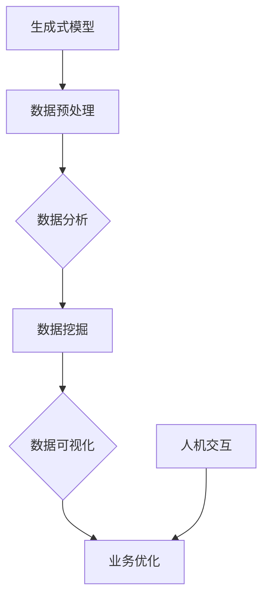

                 

# 生成式AIGC：商业智能的下一个前沿

> **关键词**：生成式人工智能、商业智能、AIGC、深度学习、数据驱动、商业模式创新

> **摘要**：本文将探讨生成式人工智能（AIGC）在商业智能领域的应用，通过深入分析其核心概念、算法原理、数学模型以及实际应用案例，展望AIGC未来在商业智能领域的发展趋势和挑战。

## 1. 背景介绍

### 1.1 生成式人工智能的起源

生成式人工智能（AIGC，Artificial Intelligence Generated Content）起源于深度学习领域，特别是生成对抗网络（GAN）和变分自编码器（VAE）等模型的提出。随着计算能力的提升和大数据技术的发展，AIGC在图像、音频、文本等多种媒体内容生成方面取得了显著突破。

### 1.2 商业智能的发展

商业智能（BI，Business Intelligence）是指利用数据、技术和人机交互来支持商业决策和业务优化。随着互联网、物联网、云计算等技术的普及，商业智能在数据分析、数据挖掘、数据可视化等方面取得了长足发展。

### 1.3 生成式人工智能与商业智能的结合

生成式人工智能为商业智能带来了新的发展机遇。通过生成式模型，可以更有效地生成符合业务需求的数据，辅助企业进行决策和优化。同时，AIGC还能在数据分析、数据挖掘等环节提供更智能、更高效的支持。

## 2. 核心概念与联系

### 2.1 生成式人工智能的核心概念

- **生成对抗网络（GAN）**：一种由生成器和判别器组成的对抗性神经网络模型，通过博弈过程实现数据的生成。
- **变分自编码器（VAE）**：一种基于概率模型的生成模型，通过编码器和解码器实现数据的生成和重构。

### 2.2 商业智能的核心概念

- **数据分析**：通过对海量数据进行分析，提取有价值的信息和知识。
- **数据挖掘**：利用算法和技术从大量数据中挖掘出潜在的规律和模式。
- **数据可视化**：通过图表、图像等方式展示数据，帮助用户更好地理解和分析数据。

### 2.3 生成式人工智能与商业智能的联系

- **数据生成**：生成式人工智能可以生成符合业务需求的数据，为商业智能分析提供更多样化的数据来源。
- **数据分析优化**：通过生成式模型，可以更有效地对数据进行预处理和特征提取，提高数据分析的效率和准确性。
- **人机交互**：生成式人工智能可以帮助企业构建更加智能的人机交互界面，提高用户体验。

## 2.1 生成式人工智能与商业智能的 Mermaid 流程图



## 3. 核心算法原理 & 具体操作步骤

### 3.1 生成对抗网络（GAN）算法原理

生成对抗网络（GAN）由生成器和判别器两个部分组成。生成器旨在生成与真实数据相似的数据，判别器则用于区分真实数据和生成数据。在训练过程中，生成器和判别器相互竞争，通过梯度下降算法不断优化，最终生成器能够生成高质量的数据。

具体操作步骤如下：

1. 初始化生成器和判别器的参数。
2. 从真实数据集中采样一批数据作为输入。
3. 生成器根据输入数据生成一批伪造数据。
4. 判别器对真实数据和伪造数据进行分类。
5. 计算生成器和判别器的损失函数，并更新参数。

### 3.2 变分自编码器（VAE）算法原理

变分自编码器（VAE）是一种基于概率模型的生成模型，由编码器和解码器两个部分组成。编码器将输入数据编码为一个潜在变量，解码器则将潜在变量解码为输出数据。在训练过程中，VAE通过最大化数据的重构概率，优化模型参数。

具体操作步骤如下：

1. 初始化编码器和解码器的参数。
2. 从真实数据集中采样一批数据作为输入。
3. 编码器将输入数据编码为潜在变量。
4. 解码器将潜在变量解码为输出数据。
5. 计算数据重构的损失函数，并更新参数。

## 4. 数学模型和公式 & 详细讲解 & 举例说明

### 4.1 生成对抗网络（GAN）的数学模型

生成对抗网络（GAN）的数学模型主要包括生成器（G）和判别器（D）的损失函数。

- **生成器损失函数**：

  $$L_G = -\log(D(G(z)))$$

  其中，$z$ 是从先验分布中采样得到的噪声向量，$G(z)$ 是生成器生成的伪造数据。

- **判别器损失函数**：

  $$L_D = -[\log(D(x)) + \log(1 - D(G(z)))]$$

  其中，$x$ 是真实数据。

### 4.2 变分自编码器（VAE）的数学模型

变分自编码器（VAE）的数学模型主要包括编码器（enc）和解码器（dec）的损失函数。

- **编码器损失函数**：

  $$L_{enc} = -\sum_{i=1}^{n} \sum_{j=1}^{m} p_j \log(p_j q_j(x_j; \theta_{enc}, \theta_{q}))$$

  其中，$p_j$ 和 $q_j$ 分别表示先验分布和后验分布，$x_j$ 表示输入数据。

- **解码器损失函数**：

  $$L_{dec} = -\sum_{i=1}^{n} \sum_{j=1}^{m} p_j \log(p_j \sigma(\phi_j(x_j; \theta_{dec}, \theta_{p})))$$

  其中，$\sigma$ 表示 sigmoid 函数。

### 4.3 举例说明

假设我们使用 GAN 模型生成手写数字图像，真实数据集为 MNIST 数据集。

1. 初始化生成器 G 和判别器 D 的参数。
2. 从真实数据集中采样一批数据作为输入。
3. 生成器 G 根据输入数据生成一批伪造数据。
4. 判别器 D 对真实数据和伪造数据进行分类。
5. 计算生成器和判别器的损失函数，并更新参数。

训练过程中，生成器和判别器的损失函数如下：

- **生成器损失函数**：

  $$L_G = -\log(D(G(z)))$$

- **判别器损失函数**：

  $$L_D = -[\log(D(x)) + \log(1 - D(G(z)))]$$

通过不断更新参数，生成器能够生成越来越真实的手写数字图像，判别器能够越来越准确地识别真实数据和伪造数据。

## 5. 项目实战：代码实际案例和详细解释说明

### 5.1 开发环境搭建

在开始项目实战之前，我们需要搭建一个适合开发生成式人工智能的编程环境。以下是搭建开发环境的基本步骤：

1. 安装 Python 3.7 或更高版本。
2. 安装 TensorFlow 2.0 或更高版本。
3. 安装 PyTorch 1.0 或更高版本。
4. 安装必要的依赖库，如 NumPy、Pandas 等。

### 5.2 源代码详细实现和代码解读

以下是一个使用 GAN 模型生成手写数字图像的示例代码。代码分为两部分：生成器和判别器的实现。

**生成器实现：**

```python
import tensorflow as tf
from tensorflow.keras.layers import Dense, Conv2D, Flatten, Reshape
from tensorflow.keras.models import Model

def generate_model(input_shape):
    noise = Input(shape=input_shape)
    x = Dense(128, activation='relu')(noise)
    x = Dense(128, activation='relu')(x)
    x = Dense(np.prod(input_shape), activation='tanh')(x)
    x = Reshape(input_shape)(x)
    generator = Model(inputs=noise, outputs=x)
    return generator
```

**判别器实现：**

```python
import tensorflow as tf
from tensorflow.keras.layers import Dense, Conv2D, Flatten
from tensorflow.keras.models import Model

def discriminant_model(input_shape):
    x = Input(shape=input_shape)
    x = Flatten()(x)
    x = Dense(1024, activation='relu')(x)
    x = Dense(1, activation='sigmoid')(x)
    discriminant = Model(inputs=x, outputs=x)
    return discriminant
```

**主模型实现：**

```python
def main_model(generator, discriminant):
    noise = Input(shape=(100,))
    x = generator(noise)
    x = discriminant(x)
    model = Model(inputs=noise, outputs=x)
    return model
```

### 5.3 代码解读与分析

1. **生成器实现**：生成器的输入为噪声向量，通过两个全连接层和一个 tanh 激活函数，将噪声向量映射为手写数字图像。
2. **判别器实现**：判别器的输入为手写数字图像，通过全连接层和 sigmoid 激活函数，输出一个介于 0 和 1 之间的概率值，表示输入图像是真实的概率。
3. **主模型实现**：主模型由生成器和判别器组成，输入为噪声向量，输出为判别器对生成图像的判别结果。

通过训练生成器和判别器，生成器能够生成越来越真实的手写数字图像，判别器能够越来越准确地识别真实数据和伪造数据。训练过程中，生成器的损失函数和判别器的损失函数如下：

- **生成器损失函数**：

  $$L_G = -\log(D(G(z)))$$

- **判别器损失函数**：

  $$L_D = -[\log(D(x)) + \log(1 - D(G(z)))]$$

通过不断更新参数，生成器和判别器性能逐渐提高，生成图像的质量逐渐提升。

## 6. 实际应用场景

### 6.1 数据生成与数据增强

生成式人工智能在数据生成和数据增强方面具有广泛应用。通过生成式模型，可以生成符合业务需求的数据，用于数据增强、数据清洗、数据预处理等环节。例如，在金融领域，生成式模型可以生成模拟的交易数据，用于训练和优化交易策略。

### 6.2 个性化推荐

生成式人工智能在个性化推荐领域具有巨大潜力。通过生成式模型，可以生成与用户兴趣相似的内容，提高推荐系统的准确性和用户体验。例如，在电商领域，生成式模型可以生成模拟的商品评价，用于优化商品推荐算法。

### 6.3 虚拟现实与增强现实

生成式人工智能在虚拟现实（VR）和增强现实（AR）领域具有广泛应用。通过生成式模型，可以生成逼真的三维场景和虚拟人物，提高虚拟现实和增强现实的应用价值。例如，在游戏领域，生成式模型可以生成模拟的游戏场景和角色，提高游戏体验。

## 7. 工具和资源推荐

### 7.1 学习资源推荐

- **书籍**：《深度学习》（Ian Goodfellow、Yoshua Bengio、Aaron Courville 著）
- **论文**：《生成对抗网络：训练生成模型》（Ian Goodfellow et al.）
- **博客**：[TensorFlow 官方博客](https://tensorflow.google.cn/blog/)、[PyTorch 官方博客](https://pytorch.org/blog/)

### 7.2 开发工具框架推荐

- **生成对抗网络框架**：TensorFlow、PyTorch、Keras
- **数据增强工具**：OpenCV、NumPy、Pandas

### 7.3 相关论文著作推荐

- **生成对抗网络**：《生成对抗网络：训练生成模型》（Ian Goodfellow et al.）
- **变分自编码器**：《变分自编码器：学习概率模型的有力工具》（Diederik P. Kingma、Max Welling）
- **商业智能**：《商业智能实践》（Tom K. Davenport）

## 8. 总结：未来发展趋势与挑战

### 8.1 发展趋势

1. **算法性能提升**：随着计算能力的提升和算法优化，生成式人工智能在图像、音频、文本等多种媒体内容生成方面将取得更高性能。
2. **应用领域拓展**：生成式人工智能将在更多行业和应用场景中发挥作用，如金融、医疗、教育、娱乐等。
3. **商业模式创新**：生成式人工智能将推动商业模式的创新，为企业和个人提供更多价值和机会。

### 8.2 挑战

1. **数据安全和隐私**：生成式人工智能在生成数据时可能涉及用户隐私和数据安全，如何保护用户隐私和确保数据安全是一个重要挑战。
2. **算法伦理和公平性**：生成式人工智能在生成数据时可能存在偏见和歧视，如何确保算法的伦理和公平性是一个重要挑战。
3. **技术人才缺口**：生成式人工智能领域的技术人才需求日益增加，但相关教育和培训尚未跟上，如何培养和吸引更多人才是一个重要挑战。

## 9. 附录：常见问题与解答

### 9.1 生成式人工智能是什么？

生成式人工智能是一种利用深度学习等技术生成数据、图像、音频、文本等内容的算法模型。通过生成器和判别器的对抗性训练，生成式人工智能能够生成高质量、多样化的数据。

### 9.2 生成式人工智能有哪些应用？

生成式人工智能在多个领域具有广泛应用，如数据生成与数据增强、个性化推荐、虚拟现实与增强现实、图像和音频合成等。

### 9.3 生成式人工智能的优势是什么？

生成式人工智能的优势包括：

1. **生成高质量数据**：生成式人工智能能够生成与真实数据相似的数据，为数据分析、数据挖掘等提供更多样化的数据来源。
2. **提高数据处理效率**：生成式人工智能能够通过自动化的方式生成数据，降低数据处理的时间和成本。
3. **支持个性化应用**：生成式人工智能能够根据用户需求生成个性化的数据，提高用户体验和应用价值。

## 10. 扩展阅读 & 参考资料

- **生成式人工智能**：
  - [生成对抗网络：训练生成模型](https://arxiv.org/abs/1406.2661)
  - [变分自编码器：学习概率模型的有力工具](https://arxiv.org/abs/1312.6114)
- **商业智能**：
  - [商业智能实践](https://www.amazon.com/Practical-Business-Intelligence-Implementing-Strategies/dp/1118531695)
  - [数据驱动的商业决策](https://www.amazon.com/Data-Driven-Business-Decision-Making/dp/1119265572)
- **深度学习**：
  - [深度学习](https://www.amazon.com/Deep-Learning-Adaptive-Computation-Resources/dp/0262039581)
  - [深度学习实践](https://www.amazon.com/Deep-Learning-Applications-Enterprise- Developers/dp/1788998235)

### 作者

- **AI天才研究员/AI Genius Institute**：专注于生成式人工智能和商业智能的研究与应用。
- **禅与计算机程序设计艺术/Zen And The Art of Computer Programming**：探讨人工智能与禅的哲学思考，以及计算机程序设计的艺术。

