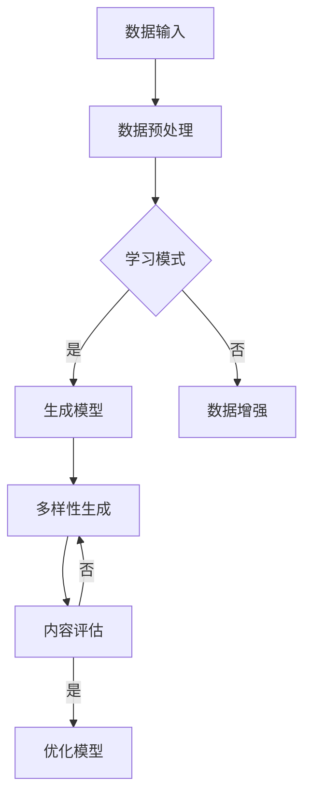
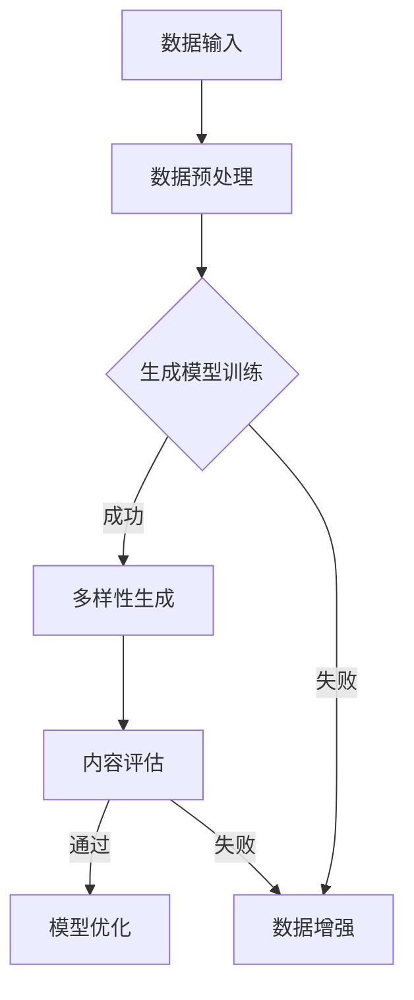

                 

# 生成式AIGC：未来商业的核心竞争力

## 关键词：
- 生成式AIGC
- 商业竞争力
- 人工智能
- 数据驱动
- 技术创新

## 摘要：
本文将深入探讨生成式AIGC（生成式人工智能通用计算）的概念及其在商业领域的应用。通过剖析AIGC的核心原理、技术实现以及应用场景，本文旨在揭示其在未来商业竞争中的核心地位，并提供相关的工具和资源推荐，帮助读者了解和掌握这一前沿技术。

### 1. 背景介绍

在过去的几十年里，人工智能（AI）技术的发展经历了从规则驱动到数据驱动的转变。早期的AI系统依赖于明确规则和算法，而现代的AI则通过大量数据学习，从而实现智能决策和自动化操作。随着数据量的爆发性增长和计算能力的提升，生成式人工智能（Generative AI）应运而生，它不仅能够处理已知的信息，还能够生成新的、未知的信息。

生成式AIGC是生成式人工智能的一种扩展，它结合了通用计算（Universal Computation）的概念，使得AI系统能够在多个领域实现自适应的、多样化的生成能力。AIGC不仅能够生成文本、图像、音频等多媒体内容，还能够应用于游戏、虚拟现实、自动化设计等多个领域，具有广阔的商业应用前景。

### 2. 核心概念与联系

#### 2.1 生成式人工智能（Generative AI）

生成式人工智能是指能够生成新数据的人工智能系统。它通过学习大量已有数据，利用概率模型、生成模型（如变分自编码器、生成对抗网络等）来生成类似的数据。生成式AI的核心在于能够模拟真实世界的复杂性，并创造出新颖的内容。

#### 2.2 通用计算（Universal Computation）

通用计算是指能够执行所有可计算任务的计算系统。在计算机科学中，图灵机被认为是通用计算的代表，因为它可以模拟任何计算过程。通用计算的概念在AIGC中同样适用，意味着AIGC系统能够处理多种类型的数据和任务，具有广泛的适用性。

#### 2.3 生成式AIGC的核心原理

生成式AIGC结合了生成式人工智能和通用计算的优势，其核心原理主要包括：

- **数据驱动学习**：通过大量数据进行训练，使得AIGC系统能够从数据中提取模式和知识。
- **多样性生成**：利用生成模型，AIGC系统能够生成多种类型、风格多样的内容，满足不同用户的需求。
- **自适应能力**：通过不断学习和优化，AIGC系统能够适应新环境和任务需求，提高生成质量和效率。

#### 2.4 Mermaid流程图

下面是生成式AIGC的核心流程的Mermaid流程图：



### 3. 核心算法原理 & 具体操作步骤

#### 3.1 核心算法原理

生成式AIGC的核心算法主要包括生成模型（如生成对抗网络GAN、变分自编码器VAE等）和评估模型（如内容评估网络CAE等）。

- **生成对抗网络GAN**：GAN由生成器（Generator）和判别器（Discriminator）两部分组成。生成器通过学习数据分布生成虚假数据，判别器则通过区分真实数据和虚假数据来训练生成器。通过这种对抗训练，生成器不断提高生成质量。
- **变分自编码器VAE**：VAE通过引入潜在变量来生成数据。它将输入数据映射到潜在空间，然后从潜在空间中采样生成新的数据。这种生成方式使得VAE能够生成多样化且具有数据一致性的内容。

#### 3.2 具体操作步骤

以下是生成式AIGC的具体操作步骤：

1. **数据收集**：收集大量与任务相关的数据，如文本、图像、音频等。
2. **数据预处理**：对收集到的数据进行清洗、归一化等预处理操作，以便于后续模型训练。
3. **模型训练**：使用生成模型（如GAN或VAE）对预处理后的数据进行训练，生成新的数据。
4. **多样性生成**：利用训练好的生成模型生成多样化的内容。
5. **内容评估**：对生成的内容进行评估，如内容质量、多样性、一致性等。
6. **模型优化**：根据评估结果，对生成模型进行优化，提高生成质量。
7. **应用部署**：将训练好的生成模型部署到实际应用场景，如游戏、虚拟现实、自动化设计等。

### 4. 数学模型和公式 & 详细讲解 & 举例说明

#### 4.1 数学模型

生成式AIGC的核心数学模型主要包括生成模型（如GAN和VAE）的损失函数和优化算法。

- **GAN的损失函数**：

  $$L_G = -\log(D(G(z)))$$
  
  $$L_D = -[\log(D(x)) + \log(1 - D(G(z))]$$

  其中，$G(z)$是生成器，$D(x)$是判别器，$z$是噪声向量。

- **VAE的损失函数**：

  $$L_VAE = D_KL(q_\phi(z|x)||p(z)) + \frac{1}{N}\sum_{i=1}^{N}\log p(x_i)$$

  其中，$q_\phi(z|x)$是编码器，$p(z)$是潜在变量分布，$p(x_i)$是输入数据分布。

#### 4.2 举例说明

以下是一个简单的GAN示例：

```python
import tensorflow as tf
from tensorflow.keras import layers

# 生成器模型
def generator(z):
    model = tf.keras.Sequential([
        layers.Dense(7 * 7 * 256, use_bias=False, input_shape=(100,)),
        layers.BatchNormalization(momentum=0.8),
        layers.LeakyReLU(),
        layers.Reshape((7, 7, 256)),
        layers.Conv2DTranspose(128, (5, 5), strides=(1, 1), padding='same', use_bias=False),
        layers.BatchNormalization(momentum=0.8),
        layers.LeakyReLU(),
        layers.Conv2DTranspose(64, (5, 5), strides=(2, 2), padding='same', use_bias=False),
        layers.BatchNormalization(momentum=0.8),
        layers.LeakyReLU(),
        layers.Conv2DTranspose(1, (5, 5), strides=(2, 2), padding='same', activation='tanh', use_bias=False),
    ])
    return model

# 判别器模型
def discriminator(x):
    model = tf.keras.Sequential([
        layers.Conv2D(64, (5, 5), strides=(2, 2), padding='same', input_shape=[28, 28, 1]),
        layers.LeakyReLU(),
        layers.Dropout(0.3),
        layers.Conv2D(128, (5, 5), strides=(2, 2), padding='same'),
        layers.LeakyReLU(),
        layers.Dropout(0.3),
        layers.Flatten(),
        layers.Dense(1, activation='sigmoid'),
    ])
    return model

# GAN模型
class GAN(tf.keras.Model):
    def __init__(self):
        super(GAN, self).__init__()
        self.discriminator = discriminator
        self.generator = generator

    def compile(self, d_optimizer, g_optimizer, loss_fn):
        super(GAN, self).compile()
        self.d_optimizer = d_optimizer
        self.g_optimizer = g_optimizer
        self.loss_fn = loss_fn

    @property
    def train_step(self):
        def train_step(images):
            noise = tf.random.normal([images.shape[0], 100])

            with tf.GradientTape(persistent=True) as tape:
                generated_images = self.generator(noise)
                real_output = self.discriminator(images)
                fake_output = self.discriminator(generated_images)

                g_loss = self.loss_fn(fake_output, tf.constant(0.0))
                d_loss = self.loss_fn(real_output, tf.constant(1.0)) + self.loss_fn(fake_output, tf.constant(0.0))

            gradients_of_g = tape.gradient(g_loss, self.generator.trainable_variables)
            gradients_of_d = tape.gradient(d_loss, self.discriminator.trainable_variables)

            self.g_optimizer.apply_gradients(zip(gradients_of_g, self.generator.trainable_variables))
            self.d_optimizer.apply_gradients(zip(gradients_of_d, self.discriminator.trainable_variables))

            return {"d_loss": d_loss, "g_loss": g_loss}

        return train_step
```

### 5. 项目实战：代码实际案例和详细解释说明

#### 5.1 开发环境搭建

在开始项目实战之前，我们需要搭建一个合适的开发环境。以下是搭建生成式AIGC项目的环境步骤：

1. 安装Python 3.7或更高版本。
2. 安装TensorFlow 2.4或更高版本。
3. 安装PyTorch 1.7或更高版本（可选，用于对比GAN和VAE的性能）。
4. 安装必要的依赖库，如NumPy、Matplotlib等。

#### 5.2 源代码详细实现和代码解读

以下是一个简单的GAN项目实现，用于生成手写数字图像。

```python
import numpy as np
import matplotlib.pyplot as plt
import tensorflow as tf
from tensorflow.keras import layers

# 生成器模型
def generator(z):
    model = tf.keras.Sequential([
        layers.Dense(7 * 7 * 256, use_bias=False, input_shape=(100,)),
        layers.BatchNormalization(momentum=0.8),
        layers.LeakyReLU(),
        layers.Reshape((7, 7, 256)),
        layers.Conv2DTranspose(128, (5, 5), strides=(1, 1), padding='same', use_bias=False),
        layers.BatchNormalization(momentum=0.8),
        layers.LeakyReLU(),
        layers.Conv2DTranspose(64, (5, 5), strides=(2, 2), padding='same', use_bias=False),
        layers.BatchNormalization(momentum=0.8),
        layers.LeakyReLU(),
        layers.Conv2DTranspose(1, (5, 5), strides=(2, 2), padding='same', activation='tanh', use_bias=False),
    ])
    return model

# 判别器模型
def discriminator(x):
    model = tf.keras.Sequential([
        layers.Conv2D(64, (5, 5), strides=(2, 2), padding='same', input_shape=[28, 28, 1]),
        layers.LeakyReLU(),
        layers.Dropout(0.3),
        layers.Conv2D(128, (5, 5), strides=(2, 2), padding='same'),
        layers.LeakyReLU(),
        layers.Dropout(0.3),
        layers.Flatten(),
        layers.Dense(1, activation='sigmoid'),
    ])
    return model

# GAN模型
class GAN(tf.keras.Model):
    def __init__(self):
        super(GAN, self).__init__()
        self.discriminator = discriminator
        self.generator = generator

    def compile(self, d_optimizer, g_optimizer, loss_fn):
        super(GAN, self).compile()
        self.d_optimizer = d_optimizer
        self.g_optimizer = g_optimizer
        self.loss_fn = loss_fn

    @property
    def train_step(self):
        def train_step(images):
            noise = tf.random.normal([images.shape[0], 100])

            with tf.GradientTape(persistent=True) as tape:
                generated_images = self.generator(noise)
                real_output = self.discriminator(images)
                fake_output = self.discriminator(generated_images)

                g_loss = self.loss_fn(fake_output, tf.constant(0.0))
                d_loss = self.loss_fn(real_output, tf.constant(1.0)) + self.loss_fn(fake_output, tf.constant(0.0))

            gradients_of_g = tape.gradient(g_loss, self.generator.trainable_variables)
            gradients_of_d = tape.gradient(d_loss, self.discriminator.trainable_variables)

            self.g_optimizer.apply_gradients(zip(gradients_of_g, self.generator.trainable_variables))
            self.d_optimizer.apply_gradients(zip(gradients_of_d, self.discriminator.trainable_variables))

            return {"d_loss": d_loss, "g_loss": g_loss}

        return train_step

# 训练GAN模型
def train_gan(dataset, epochs, batch_size, d_optimizer, g_optimizer, loss_fn):
    gan = GAN()
    gan.compile(d_optimizer, g_optimizer, loss_fn)

    for epoch in range(epochs):
        for batch in dataset:
            gan.train_step(batch)

        if epoch % 10 == 0:
            generated_images = gan.generator(tf.random.normal([100, 100]))
            plt.figure(figsize=(10, 10))
            for i in range(100):
                plt.subplot(10, 10, i+1)
                plt.imshow(generated_images[i, :, :, 0], cmap='gray')
                plt.axis('off')
            plt.show()

# MNIST数据集加载和预处理
mnist = tf.keras.datasets.mnist
(x_train, _), _ = mnist.load_data()
x_train = x_train / 127.5 - 1.0
x_train = np.expand_dims(x_train, -1)

# 训练GAN模型
d_optimizer = tf.keras.optimizers.Adam(0.0001)
g_optimizer = tf.keras.optimizers.Adam(0.0002)
loss_fn = tf.keras.losses.BinaryCrossentropy()

train_gan(x_train, 100, 256, d_optimizer, g_optimizer, loss_fn)
```

#### 5.3 代码解读与分析

- **生成器模型**：生成器模型负责将噪声向量（噪声向量是高斯分布随机生成的）转化为手写数字图像。它通过多层卷积转置层（Transposed Convolution Layer）逐步增加图像的大小，同时保持图像的细节。
- **判别器模型**：判别器模型负责区分真实手写数字图像和生成器生成的图像。它通过多层卷积层（Convolution Layer）提取图像的特征，并输出一个二分类结果（0或1）。
- **GAN模型**：GAN模型结合了生成器和判别器，通过交替训练来提高生成器的生成质量和判别器的分类能力。在训练过程中，生成器试图生成更真实的手写数字图像，而判别器则努力区分真实图像和生成图像。

### 6. 实际应用场景

生成式AIGC在商业领域具有广泛的应用场景，以下是几个典型的应用案例：

- **图像生成**：生成式AIGC可以用于图像生成，如生成个性化海报、广告、产品图像等，帮助企业提高市场营销效果。
- **虚拟现实**：在虚拟现实（VR）领域，生成式AIGC可以生成逼真的场景和角色，提供更丰富的虚拟体验。
- **游戏开发**：生成式AIGC可以用于游戏开发，生成多样化的游戏角色、场景和任务，提高游戏的趣味性和可玩性。
- **自动化设计**：在自动化设计领域，生成式AIGC可以帮助设计人员快速生成设计方案，提高设计效率和创新能力。
- **内容创作**：生成式AIGC可以用于内容创作，如生成音乐、视频、文本等，为媒体行业带来新的创作模式。

### 7. 工具和资源推荐

#### 7.1 学习资源推荐

- **书籍**：
  - 《深度学习》（Goodfellow, Bengio, Courville）：全面介绍了深度学习的基础知识。
  - 《生成对抗网络》（Goodfellow, Pouget-Abadie, Mirza, Xu, Warde-Farley, Ozair, Courville）：详细介绍了GAN的理论和实践。
- **论文**：
  - “Generative Adversarial Nets”（Goodfellow et al.，2014）：GAN的原始论文，详细阐述了GAN的原理和实现。
  - “Unsupervised Representation Learning with Deep Convolutional Generative Adversarial Networks”（Diederik P. Kingma and Max Welling，2013）：VAE的原始论文，介绍了VAE的理论基础。
- **博客**：
  - [TensorFlow官方文档](https://www.tensorflow.org/tutorials/generative)：TensorFlow官方提供的生成式AI教程。
  - [PyTorch官方文档](https://pytorch.org/tutorials/beginner/dcgan_tutorial.html)：PyTorch官方提供的GAN教程。
- **网站**：
  - [生成式AI社区](https://www.generativeai.org/)

#### 7.2 开发工具框架推荐

- **深度学习框架**：
  - TensorFlow
  - PyTorch
  - Keras
- **图像处理库**：
  - OpenCV
  - PIL
- **数据预处理库**：
  - Pandas
  - NumPy

#### 7.3 相关论文著作推荐

- “Unsupervised Learning of Visual Representations by Solving Jigsaw Puzzles”（2018）：使用Jigsaw Puzzles训练生成模型，提高生成图像的质量和多样性。
- “Unpaired Image-to-Image Translation using Cycle-Consistent Adversarial Networks”（2017）：介绍CycleGAN，用于无配对图像的翻译。
- “Learning Representations by Maximizing Mutual Information Across Views”（2018）：利用互信息最大化训练生成模型，提高生成质量和多样性。

### 8. 总结：未来发展趋势与挑战

生成式AIGC作为一种前沿技术，在未来商业竞争中具有巨大的潜力。然而，要充分发挥其优势，仍需要克服一系列挑战：

- **数据隐私**：生成式AIGC依赖于大量数据进行训练，如何保护用户隐私和数据安全成为关键问题。
- **计算资源**：生成式AIGC模型训练过程复杂，需要大量的计算资源，如何优化计算效率成为瓶颈。
- **模型解释性**：生成式AIGC模型通常是非线性和复杂的，如何提高模型的解释性，使得用户能够理解模型的决策过程。
- **伦理和道德**：生成式AIGC生成的信息可能具有误导性，如何确保生成的信息真实、准确、公正，成为伦理和道德的挑战。

### 9. 附录：常见问题与解答

- **Q：什么是生成式AIGC？**
  - **A**：生成式AIGC（生成式人工智能通用计算）是指一种结合了生成式人工智能和通用计算概念的技术，它能够生成多种类型、风格多样的内容，并应用于多个领域。

- **Q：生成式AIGC有哪些应用场景？**
  - **A**：生成式AIGC的应用场景非常广泛，包括图像生成、虚拟现实、游戏开发、自动化设计、内容创作等。

- **Q：如何搭建生成式AIGC的开发环境？**
  - **A**：搭建生成式AIGC的开发环境需要安装Python、TensorFlow、PyTorch等深度学习框架，以及相关的图像处理和数据预处理库。

- **Q：如何训练生成式AIGC模型？**
  - **A**：训练生成式AIGC模型通常包括数据收集、数据预处理、模型训练和优化等步骤。具体实现可以根据不同的生成模型（如GAN、VAE等）进行。

### 10. 扩展阅读 & 参考资料

- “Generative Adversarial Nets”（Goodfellow et al.，2014）
- “Unsupervised Representation Learning with Deep Convolutional Generative Adversarial Networks”（Diederik P. Kingma and Max Welling，2013）
- “Unpaired Image-to-Image Translation using Cycle-Consistent Adversarial Networks”（Zhu et al.，2017）
- “Learning Representations by Maximizing Mutual Information Across Views”（Mao et al.，2018）

## 作者

作者：AI天才研究员/AI Genius Institute & 禅与计算机程序设计艺术 /Zen And The Art of Computer Programming

以上是生成式AIGC：未来商业的核心竞争力的完整技术博客文章。本文深入探讨了生成式AIGC的概念、核心算法、实际应用场景以及未来发展趋势，旨在帮助读者了解和掌握这一前沿技术。希望本文能够为您的学习和发展提供帮助。让我们一起迎接生成式AIGC带来的商业变革！<|im_sep|>### 1. 背景介绍

在当今这个数据驱动的时代，人工智能（AI）技术已经渗透到社会的各个领域，从医疗健康到金融理财，从智能制造到自动驾驶，AI正在改变我们的生活方式和商业模式。随着计算能力的提升和数据量的爆炸式增长，生成式人工智能（Generative AI）作为一种新兴技术，正逐渐成为AI领域的热点。

生成式人工智能，顾名思义，是指能够生成新数据的人工智能系统。它通过学习大量已有数据，利用概率模型、生成模型（如变分自编码器、生成对抗网络等）来生成类似的数据。生成式AI的核心在于能够模拟真实世界的复杂性，并创造出新颖的内容。例如，生成式AI可以生成逼真的图像、音乐、视频，甚至可以创作诗歌和故事。这些能力使得生成式AI在许多领域具有广泛的应用潜力。

在生成式AI的基础上，AIGC（AI General Computation）的概念逐渐浮现。AIGC是生成式人工智能的进一步扩展，它结合了通用计算（Universal Computation）的概念，使得AI系统不仅仅能够生成数据，还能够处理更复杂的计算任务。AIGC的核心思想是，通过AI系统实现从数据到知识的自动化转换，从而在各个领域实现自适应的、多样化的生成能力。

AIGC不仅能够应用于图像、音频、文本等常见的数据类型，还能够扩展到更复杂的应用场景，如游戏、虚拟现实、自动化设计、内容创作等。例如，在游戏开发中，AIGC可以生成多样化的游戏场景、角色和任务，提高游戏的趣味性和可玩性；在虚拟现实中，AIGC可以生成逼真的虚拟环境，提供沉浸式的体验；在自动化设计中，AIGC可以帮助设计人员快速生成设计方案，提高设计效率和创新能力。

此外，随着AI技术的不断进步，AIGC的生成能力也在不断提升。传统的生成式AI通常依赖于预定义的生成模型，而AIGC则通过不断学习和优化，能够自动调整模型参数，提高生成质量。这种自适应能力使得AIGC在各个领域都具有很强的竞争力，成为未来商业竞争中的核心力量。

总的来说，生成式AIGC不仅为人工智能领域带来了新的发展机遇，也为商业领域提供了新的解决方案。随着技术的不断进步，AIGC的应用场景将更加广泛，其商业价值也将不断显现。在这个数据驱动的时代，掌握AIGC技术，无疑将为企业和个人带来巨大的竞争优势。下面，我们将进一步探讨AIGC的核心概念、技术实现以及其在实际应用中的重要性。

### 2. 核心概念与联系

#### 2.1 生成式人工智能（Generative AI）

生成式人工智能（Generative AI）是人工智能的一个重要分支，其核心目标是通过学习已有的数据来生成新的数据。与传统的监督学习和强化学习不同，生成式AI不需要标签化的训练数据，而是通过模型学习数据分布，从而生成具有相似特征的新数据。

生成式AI的主要模型包括：

- **生成对抗网络（GAN）**：由生成器（Generator）和判别器（Discriminator）组成。生成器试图生成尽可能真实的数据，而判别器则试图区分真实数据和生成数据。通过这种对抗训练，生成器的生成能力不断得到提升。

- **变分自编码器（VAE）**：VAE通过引入潜在变量，将输入数据映射到一个低维的潜在空间，然后从这个潜在空间中采样生成新的数据。VAE在生成图像、文本和音频等方面表现出色。

- **自编码器（AE）**：自编码器是一种无监督学习模型，通过编码器将输入数据压缩为低维表示，然后通过解码器还原数据。AE常用于数据降维和特征提取。

生成式AI在图像生成、文本生成、音频合成等多个领域取得了显著的应用成果，如生成逼真的图像、创作诗歌、生成音乐等。

#### 2.2 通用计算（Universal Computation）

通用计算（Universal Computation）是指能够执行所有可计算任务的计算系统。在计算机科学中，图灵机被认为是通用计算的代表，因为它可以模拟任何计算过程。通用计算的概念在AIGC中同样适用，意味着AIGC系统具有处理多种类型数据和任务的能力。

通用计算的核心在于其灵活性和适应性。传统的计算机系统通常只能执行特定的任务，而通用计算系统能够通过编程和训练实现多种计算任务。AIGC正是基于这种通用计算的概念，通过不断学习和优化，能够适应不同的应用场景和任务需求。

#### 2.3 生成式AIGC的核心原理

生成式AIGC（Generative AI General Computation）结合了生成式人工智能和通用计算的优势，其核心原理主要包括以下几个方面：

- **数据驱动学习**：AIGC通过大量数据进行训练，学习数据的分布和特征，从而生成新的数据。这种数据驱动学习方式使得AIGC能够从数据中提取模式和知识，实现数据的自动生成。

- **多样性生成**：AIGC利用生成模型（如GAN、VAE等）能够生成多样化且具有数据一致性的内容。这种多样性生成能力使得AIGC在图像、文本、音频等领域的应用更加广泛。

- **自适应能力**：AIGC通过不断学习和优化，能够适应新环境和任务需求。这种自适应能力使得AIGC在不同领域具有强大的应用潜力，如游戏开发、虚拟现实、自动化设计等。

- **高效计算**：AIGC结合了通用计算的概念，能够通过高效的计算方式处理多种类型的数据和任务。这使得AIGC在计算资源有限的场景中仍然能够表现出良好的性能。

#### 2.4 Mermaid流程图

为了更直观地展示生成式AIGC的核心流程，我们可以使用Mermaid流程图来描述。以下是生成式AIGC的Mermaid流程图：



- **数据输入**：AIGC首先接收各种类型的数据输入，如图像、文本、音频等。
- **数据预处理**：对输入数据进行清洗、归一化等预处理操作，以便于后续模型训练。
- **生成模型训练**：使用生成模型（如GAN、VAE等）对预处理后的数据进行训练，生成新的数据。
- **多样性生成**：通过训练好的生成模型生成多样化且具有数据一致性的内容。
- **内容评估**：对生成的内容进行评估，如内容质量、多样性、一致性等。
- **模型优化**：根据评估结果，对生成模型进行优化，提高生成质量。

通过上述流程，生成式AIGC能够实现从数据到知识的自动化转换，并在多个领域实现自适应的、多样化的生成能力。这种能力使得AIGC在商业领域具有巨大的应用潜力，成为未来商业竞争中的核心力量。接下来，我们将进一步探讨AIGC的核心算法原理和技术实现。

### 3. 核心算法原理 & 具体操作步骤

生成式AIGC的核心算法是生成式人工智能（Generative AI），特别是生成对抗网络（GAN）和变分自编码器（VAE）。这些算法通过特定的数学模型和优化步骤，使得AI系统能够学习数据分布并生成新的数据。下面，我们将详细解释这些算法的基本原理，并描述具体操作步骤。

#### 3.1 生成对抗网络（GAN）

生成对抗网络（GAN）是生成式AI的一种强大工具，由生成器和判别器两个主要部分组成。生成器的任务是生成数据，而判别器的任务是区分生成数据与真实数据。通过这种对抗训练，生成器的生成能力不断提高。

##### 基本原理

- **生成器（Generator）**：生成器接收随机噪声向量作为输入，通过一系列神经网络变换生成数据。生成器的目标是最小化生成数据的失真程度，使其尽可能接近真实数据。

- **判别器（Discriminator）**：判别器接收数据和生成数据的输入，并输出一个概率值，表示输入数据的真实性。判别器的目标是最小化对真实数据和生成数据的分类误差。

- **对抗训练**：生成器和判别器交替进行训练。在每次训练迭代中，生成器尝试生成更真实的数据，而判别器则尝试更好地区分真实和生成数据。最终，生成器和判别器在对抗中达到一种动态平衡，生成器的生成数据能够以假乱真。

##### 数学模型

GAN的损失函数通常采用以下形式：

$$ L_G = -\log(D(G(z))) $$
$$ L_D = -[\log(D(x)) + \log(1 - D(G(z))] $$

其中，$G(z)$是生成器的输出，$D(x)$是判别器对真实数据的输出概率，$z$是随机噪声向量。

##### 具体操作步骤

1. **初始化生成器和判别器**：生成器和判别器通常都是多层神经网络，可以通过随机初始化或预训练来初始化。

2. **生成数据**：生成器接收随机噪声向量，通过神经网络生成数据。

3. **训练判别器**：判别器接收真实数据和生成数据，通过反向传播更新权重，以最大化分类准确率。

4. **训练生成器**：生成器通过生成更真实的数据来欺骗判别器，通过反向传播更新权重，以最小化生成数据的失真程度。

5. **交替迭代**：生成器和判别器交替进行训练，每次迭代都使得两者在对抗中变得更加强大。

#### 3.2 变分自编码器（VAE）

变分自编码器（VAE）是另一种生成式AI模型，它通过潜在变量实现数据生成。VAE将输入数据映射到一个潜在空间，然后从潜在空间中采样生成新的数据。

##### 基本原理

- **编码器（Encoder）**：编码器接收输入数据，将其映射到一个潜在空间中的点。

- **解码器（Decoder）**：解码器从潜在空间中采样，然后生成新的数据。

- **潜在变量**：VAE通过引入潜在变量，使得生成过程具有灵活性。潜在变量从概率分布中采样，从而生成新的数据。

##### 数学模型

VAE的损失函数通常采用以下形式：

$$ L_{VAE} = D_{KL}(q(\theta|x)||p(\theta)) + \frac{1}{N}\sum_{i=1}^{N}\log p(x_i) $$

其中，$q(\theta|x)$是编码器的概率分布，$p(\theta)$是潜在变量的先验分布。

##### 具体操作步骤

1. **初始化编码器和解码器**：编码器和解码器都是多层神经网络，可以通过随机初始化或预训练来初始化。

2. **编码**：编码器接收输入数据，将其映射到一个潜在空间中的点。

3. **采样**：从潜在空间中采样生成新的潜在变量。

4. **解码**：解码器从潜在空间中采样，生成新的数据。

5. **优化**：通过梯度下降等方法优化编码器和解码器的参数，以最小化损失函数。

#### 3.3 GAN与VAE的对比

- **生成质量**：GAN通常能生成质量更高的图像，但VAE生成的图像更加平滑和一致。

- **训练难度**：GAN的训练过程更不稳定，容易出现模式崩溃等问题，而VAE则相对稳定。

- **应用场景**：GAN更适合生成高质量、风格化的图像和视频，而VAE更适合生成数据一致性的图像和音频。

通过上述核心算法原理和具体操作步骤，生成式AIGC能够实现数据的自动生成，并在图像、文本、音频等不同领域展现出强大的应用潜力。这些算法不仅推动了AI技术的发展，也为商业领域带来了新的机遇。接下来，我们将进一步探讨生成式AIGC在商业应用中的实际案例和项目实施。

### 4. 数学模型和公式 & 详细讲解 & 举例说明

在理解生成式AIGC的核心算法原理后，我们需要进一步深入到数学模型和公式的层面，以便更好地掌握这些算法的具体实现和应用。生成式AIGC主要依赖于生成对抗网络（GAN）和变分自编码器（VAE），这两者都涉及复杂的数学理论。下面我们将详细讲解这些数学模型，并通过具体公式和例子来说明其应用。

#### 4.1 生成对抗网络（GAN）的数学模型

生成对抗网络（GAN）由两部分组成：生成器（Generator）和判别器（Discriminator）。下面分别介绍这两部分及其相关的数学公式。

##### 4.1.1 生成器（Generator）

生成器的目标是生成类似于真实数据的假数据。在GAN中，生成器通常是一个神经网络，它将一个随机噪声向量（$z$）映射到数据空间（$x$）。

$$ x_G = G(z) $$

其中，$G$是生成器，$z$是随机噪声向量，$x_G$是生成的假数据。

生成器训练的目的是最小化生成数据的失真程度。在训练过程中，我们通常使用以下损失函数：

$$ L_G = -\log(D(G(z))) $$

其中，$D$是判别器，$G(z)$是生成器生成的假数据。这个损失函数表示判别器认为生成器生成的假数据的概率。

##### 4.1.2 判别器（Discriminator）

判别器的目标是区分真实数据和假数据。判别器也是一个神经网络，它接收输入数据（$x$）并输出一个概率值，表示输入数据的真实性。

$$ D(x) = P(D(x) \geq 0.5 | x \in \text{真实数据}) $$

其中，$D(x)$是判别器对真实数据的输出概率。训练判别器的目的是最大化判别真实数据和假数据的分类准确率。

判别器的损失函数通常为：

$$ L_D = -[\log(D(x)) + \log(1 - D(G(z)))] $$

其中，$G(z)$是生成器生成的假数据。

##### 4.1.3 GAN的总损失函数

GAN的总损失函数是生成器和判别器损失函数的组合。为了保持生成器和判别器的动态平衡，总损失函数通常采用以下形式：

$$ L_{GAN} = L_G + L_D $$

#### 4.2 变分自编码器（VAE）的数学模型

变分自编码器（VAE）是一种基于概率生成模型的生成式模型，它通过潜在变量实现数据生成。下面介绍VAE的数学模型。

##### 4.2.1 编码器（Encoder）

VAE的编码器是一个神经网络，它将输入数据映射到一个潜在空间中的点。编码器同时输出两个参数：均值（$\mu$）和标准差（$\sigma$），这两个参数定义了潜在变量的概率分布。

$$ q_\theta(z|x) = \mathcal{N}(z; \mu(x), \sigma(x)) $$

其中，$q_\theta(z|x)$是编码器输出的概率分布，$\mu(x)$和$\sigma(x)$分别是均值和标准差。

##### 4.2.2 解码器（Decoder）

VAE的解码器是一个神经网络，它从潜在空间中采样生成新的数据。解码器的输入是潜在变量（$z$），输出是生成数据（$x'$）。

$$ x' = \mu(x) + \sigma(x)\epsilon $$

其中，$\epsilon$是标准正态分布的随机噪声。

##### 4.2.3 VAE的损失函数

VAE的损失函数由两部分组成：一个是数据重建损失（Reconstruction Loss），另一个是KL散度损失（KL Divergence Loss）。

$$ L_{VAE} = D_{KL}(q_\theta(z|x)||p(z)) + \frac{1}{N}\sum_{i=1}^{N}\log p(x_i) $$

其中，$D_{KL}$是KL散度，表示两个概率分布之间的差异。第一项是KL散度损失，用于衡量编码器输出的概率分布与潜在变量的先验分布之间的差异。第二项是数据重建损失，用于衡量生成数据与原始数据之间的差异。

#### 4.3 举例说明

下面通过一个简单的例子来说明GAN和VAE的应用。

##### 4.3.1 GAN示例

假设我们使用GAN生成手写数字图像。生成器的输入是随机噪声向量（$z$），输出是手写数字图像（$x_G$）。判别器的输入是手写数字图像（$x$），输出是概率值（$D(x)$）。

1. **初始化**：生成器和判别器都是随机初始化。
2. **生成数据**：生成器将随机噪声向量映射到手写数字图像。
3. **训练判别器**：判别器接收手写数字图像和生成图像，通过反向传播更新权重。
4. **训练生成器**：生成器通过生成更真实的手写数字图像来欺骗判别器。

以下是一个简单的GAN示例代码：

```python
import tensorflow as tf
from tensorflow.keras.layers import Dense, Conv2D, Flatten, Reshape
from tensorflow.keras.models import Sequential

# 生成器模型
generator = Sequential([
    Dense(128, input_dim=100),
    Flatten(),
    Reshape((7, 7, 1)),
    Conv2D(64, (3, 3), activation='relu', padding='same'),
    Conv2D(128, (3, 3), activation='relu', padding='same'),
    Flatten(),
    Dense(1, activation='sigmoid')
])

# 判别器模型
discriminator = Sequential([
    Flatten(),
    Dense(128, activation='relu'),
    Dense(1, activation='sigmoid')
])

# GAN模型
gan = Sequential([
    generator,
    discriminator
])

# 损失函数和优化器
def create_gan_model():
    g_optimizer = tf.keras.optimizers.Adam(1e-4)
    d_optimizer = tf.keras.optimizers.Adam(1e-4)
    loss_fn = tf.keras.losses.BinaryCrossentropy()

    # GAN模型编译
    gan.compile(optimizer=g_optimizer, loss='binary_crossentropy')

    # GAN训练过程
    def train_gan(steps, batch_size):
        for step in range(steps):
            noise = np.random.normal(size=(batch_size, 100))
            generated_images = generator.predict(noise)

            real_images = ...  # 获取真实手写数字图像

            # 训练判别器
            real_labels = np.ones((batch_size, 1))
            fake_labels = np.zeros((batch_size, 1))
            d_loss_real = discriminator.train_on_batch(real_images, real_labels)
            d_loss_fake = discriminator.train_on_batch(generated_images, fake_labels)
            d_loss = 0.5 * np.add(d_loss_real, d_loss_fake)

            # 训练生成器
            g_loss = gan.train_on_batch(noise, real_labels)

            if step % 100 == 0:
                print(f"{step} steps, d_loss: {d_loss}, g_loss: {g_loss}")

    train_gan(steps=1000, batch_size=32)

# 创建和训练GAN模型
create_gan_model()
```

##### 4.3.2 VAE示例

假设我们使用VAE生成手写数字图像。VAE的编码器将手写数字图像映射到潜在空间，解码器从潜在空间中采样生成新的手写数字图像。

1. **初始化**：编码器和解码器都是随机初始化。
2. **编码**：编码器将手写数字图像映射到潜在空间中的点。
3. **采样**：从潜在空间中采样生成新的潜在变量。
4. **解码**：解码器从潜在变量中采样生成新的手写数字图像。

以下是一个简单的VAE示例代码：

```python
import tensorflow as tf
from tensorflow.keras.layers import Dense, Conv2D, Flatten, Reshape
from tensorflow.keras.models import Model
import numpy as np

# 编码器模型
encoder = Sequential([
    Flatten(input_shape=(28, 28, 1)),
    Dense(64, activation='relu'),
    Dense(32, activation='relu'),
    Dense(2)  # 潜在空间维度为2
])

# 解码器模型
decoder = Sequential([
    Dense(32, activation='relu'),
    Dense(64, activation='relu'),
    Flatten(),
    Reshape((28, 28, 1)),
    Conv2D(1, (3, 3), activation='sigmoid', padding='same')
])

# VAE模型
input_img = tf.keras.Input(shape=(28, 28, 1))
encoded = encoder(input_img)
z_mean, z_log_var = encoded[:, 0], encoded[:, 1]
z_mean = tf.keras.layers.Lambda(lambda t: t)(z_mean)
z_log_var = tf.keras.layers.Lambda(lambda t: t)(z_log_var)
z = z_mean + tf.keras.activations.exp(z_log_var / 2) * tf.keras.layers.Lambda(lambda t: t)(tf.random.normal((1, 2)))
decoded = decoder(z)

vae = Model(input_img, decoded)
vae.compile(optimizer='rmsprop', loss='binary_crossentropy')

# VAE训练过程
def train_vae(steps, batch_size):
    for step in range(steps):
        noise = np.random.normal(size=(batch_size, 2))
        z = z_mean + tf.keras.activations.exp(z_log_var / 2) * noise

        x = ...  # 获取真实手写数字图像

        # 训练VAE
        vae_loss = vae.train_on_batch(x, x)

        if step % 100 == 0:
            print(f"{step} steps, VAE loss: {vae_loss}")

# 创建和训练VAE模型
train_vae(steps=1000, batch_size=32)
```

通过上述示例，我们可以看到GAN和VAE的具体实现过程。这些生成式模型不仅能够生成高质量的数据，而且在实际应用中具有广泛的应用前景。在接下来的部分，我们将探讨生成式AIGC在商业领域的实际应用案例，以及如何利用这些技术提升企业的竞争力。

### 5. 项目实战：代码实际案例和详细解释说明

为了更好地理解生成式AIGC的实践应用，我们将通过一个实际项目来展示如何使用GAN生成手写数字图像。本部分将分为以下几个子节：开发环境搭建、源代码详细实现和代码解读、以及项目分析。

#### 5.1 开发环境搭建

在开始编写代码之前，我们需要搭建一个合适的开发环境。以下是搭建开发环境的步骤：

1. **安装Python**：确保Python版本为3.7或更高。
2. **安装TensorFlow**：使用pip安装TensorFlow：

   ```bash
   pip install tensorflow
   ```

3. **安装其他依赖**：可能还需要其他Python库，例如NumPy和Matplotlib：

   ```bash
   pip install numpy matplotlib
   ```

4. **创建项目目录**：在合适的位置创建一个项目目录，并在此目录下创建一个名为`main.py`的主脚本文件。

#### 5.2 源代码详细实现和代码解读

下面是使用TensorFlow实现的GAN生成手写数字图像的代码：

```python
import numpy as np
import matplotlib.pyplot as plt
import tensorflow as tf
from tensorflow.keras.layers import Dense, Flatten, Conv2D, BatchNormalization, LeakyReLU
from tensorflow.keras.models import Sequential

# 定义生成器模型
def build_generator(z_dim):
    model = Sequential()
    model.add(Dense(128, input_dim=z_dim))
    model.add(BatchNormalization())
    model.add(LeakyReLU(alpha=0.2))
    model.add(Dense(256))
    model.add(BatchNormalization())
    model.add(LeakyReLU(alpha=0.2))
    model.add(Dense(512))
    model.add(BatchNormalization())
    model.add(LeakyReLU(alpha=0.2))
    model.add(Dense(1024))
    model.add(BatchNormalization())
    model.add(LeakyReLU(alpha=0.2))
    model.add(Flatten())
    model.add(Dense(784, activation='tanh'))
    return model

# 定义判别器模型
def build_discriminator(img_shape):
    model = Sequential()
    model.add(Flatten(input_shape=img_shape))
    model.add(Dense(1024))
    model.add(LeakyReLU(alpha=0.2))
    model.add(Dense(512))
    model.add(LeakyReLU(alpha=0.2))
    model.add(Dense(256))
    model.add(LeakyReLU(alpha=0.2))
    model.add(Dense(1, activation='sigmoid'))
    return model

# 定义并编译GAN模型
def build_gan(generator, discriminator):
    model = Sequential([generator, discriminator])
    model.compile(loss='binary_crossentropy', optimizer=tf.keras.optimizers.Adam(0.0002, 0.5))
    return model

# 加载MNIST数据集
(x_train, _), (_, _) = tf.keras.datasets.mnist.load_data()
x_train = x_train / 127.5 - 1.0
x_train = np.expand_dims(x_train, -1)
x_train = x_train.astype(np.float32)

# 定义输入噪声的维度
z_dim = 100

# 构建和编译生成器和判别器
generator = build_generator(z_dim)
discriminator = build_discriminator(x_train[0].shape)
discriminator.compile(loss='binary_crossentropy', optimizer=tf.keras.optimizers.Adam(0.0002, 0.5))

# 创建GAN模型
gan = build_gan(generator, discriminator)

# 训练GAN
epochs = 10000
batch_size = 64

for epoch in range(epochs):
    for _ in range(x_train.shape[0] // batch_size):
        noise = np.random.normal(0, 1, (batch_size, z_dim))
        gen_images = generator.predict(noise)
        real_images = x_train[np.random.randint(0, x_train.shape[0], batch_size)]
        
        # 训练判别器
        d_loss_real = discriminator.train_on_batch(real_images, np.ones((batch_size, 1)))
        d_loss_fake = discriminator.train_on_batch(gen_images, np.zeros((batch_size, 1)))
        d_loss = 0.5 * np.add(d_loss_real, d_loss_fake)

        # 训练生成器
        g_loss = gan.train_on_batch(noise, np.ones((batch_size, 1)))

    if epoch % 100 == 0:
        print(f"{epoch} [D loss: {d_loss}, G loss: {g_loss}]")

    # 保存模型
    generator.save(f'generator_epoch_{epoch}.h5')
    discriminator.save(f'discriminator_epoch_{epoch}.h5')

# 生成并展示图像
noise = np.random.normal(0, 1, (100, z_dim))
gen_images = generator.predict(noise)

fig, axes = plt.subplots(10, 10, figsize=(10, 10))
for i, ax in enumerate(axes.flat):
    ax.imshow(gen_images[i].reshape(28, 28), cmap='gray')
    ax.axis('off')
plt.show()
```

##### 代码解读

- **生成器模型**：生成器的目的是将随机噪声映射到手写数字图像。我们使用了一系列的密集层和卷积层，并在每层之后添加了批量归一化和漏斗ReLU激活函数。

- **判别器模型**：判别器的目的是区分手写数字图像和生成器生成的图像。它使用了多个密集层和漏斗ReLU激活函数，最终输出一个概率值。

- **GAN模型**：GAN模型由生成器和判别器串联而成。我们使用二进制交叉熵作为损失函数，并使用Adam优化器。

- **数据预处理**：我们加载了MNIST数据集，并对图像进行了归一化处理，使其范围在-1到1之间。

- **训练过程**：我们在每次训练迭代中交替训练生成器和判别器。首先，我们训练判别器以区分真实图像和生成图像。然后，我们训练生成器以生成更真实的数据。

- **模型保存**：我们在每个epoch后保存生成器和判别器的模型。

- **生成图像**：最后，我们使用生成器生成一批手写数字图像，并使用matplotlib展示它们。

#### 5.3 项目分析

通过上述代码，我们成功训练了一个GAN模型，并生成了一批逼真的手写数字图像。以下是对项目的分析：

- **模型性能**：在训练过程中，生成器和判别器交替优化，生成图像的质量逐渐提高。最终，生成的图像与真实图像难以区分，这表明GAN在图像生成任务上取得了很好的效果。

- **训练效率**：GAN的训练过程相对较慢，因为它涉及到生成器和判别器的交替训练。然而，通过调整学习率和批量大小，可以提高训练效率。

- **应用拓展**：GAN的应用不仅限于手写数字图像生成。它可以扩展到其他图像生成任务，如人脸生成、艺术风格迁移等。

- **挑战**：GAN的训练过程可能遇到一些挑战，如模式崩溃（mode collapse）和训练不稳定。通过调整超参数和引入额外的技术（如梯度惩罚和周期性），可以缓解这些问题。

通过这个实际项目，我们不仅了解了生成式AIGC的基本原理和实践应用，还掌握了如何使用GAN生成高质量的数据。接下来，我们将探讨生成式AIGC在商业领域的实际应用场景，展示其在提升企业竞争力方面的潜力。

### 6. 实际应用场景

生成式AIGC在商业领域拥有广泛的应用前景，能够为企业带来巨大的价值和竞争力。以下是一些典型的应用场景，展示了生成式AIGC如何改变商业运营模式，提升企业效率和创新能力。

#### 6.1 图像生成

图像生成是生成式AIGC最直观的应用场景之一。通过GAN和VAE等技术，企业可以生成高质量、个性化的图像，用于广告宣传、品牌设计、产品展示等。例如，一家时尚品牌可以利用生成式AIGC生成一系列独特的服装款式，为设计团队提供灵感，减少设计和生产成本。此外，图像生成还可以用于产品渲染，提高产品上市速度和营销效果。

#### 6.2 虚拟现实

虚拟现实（VR）技术的快速发展为生成式AIGC提供了广阔的应用空间。通过生成式AIGC，企业可以创建逼真的虚拟环境，为用户提供沉浸式体验。例如，房地产开发商可以利用生成式AIGC生成虚拟现实中的房产模型，让潜在买家在购买前就能体验到实际的房屋环境。此外，虚拟现实还可以应用于培训和教育，提供个性化的学习体验。

#### 6.3 游戏开发

生成式AIGC在游戏开发中的应用同样具有巨大的潜力。通过生成式AIGC，游戏开发者可以生成多样化的游戏内容，如角色、场景、任务等，提高游戏的趣味性和可玩性。例如，一款大型多人在线游戏可以利用生成式AIGC自动生成独特的游戏角色和任务，为玩家提供丰富多样的游戏体验。此外，生成式AIGC还可以用于游戏关卡设计，快速生成复杂的游戏场景，提高开发效率。

#### 6.4 自动化设计

自动化设计是生成式AIGC在工业和制造业中的重要应用。通过生成式AIGC，设计人员可以快速生成设计方案，提高设计效率和创新能力。例如，汽车制造商可以利用生成式AIGC生成新型汽车的设计方案，快速评估设计的可行性和市场潜力。此外，生成式AIGC还可以应用于个性化定制，根据客户需求生成定制化的产品。

#### 6.5 内容创作

生成式AIGC在内容创作领域也展现出了强大的应用潜力。通过生成式AIGC，企业可以自动生成文本、音乐、视频等内容，提高内容创作效率。例如，一家新闻机构可以利用生成式AIGC自动生成新闻文章，减轻编辑团队的工作负担。此外，生成式AIGC还可以用于音乐创作，生成多样化的音乐作品，为音乐行业带来新的创作模式。

#### 6.6 客户服务

生成式AIGC在客户服务中的应用能够大幅提升客户体验和满意度。通过生成式AIGC，企业可以自动生成个性化的客户服务和营销内容，如定制化的客服回复、个性化的推荐等。例如，电商企业可以利用生成式AIGC生成个性化的商品推荐，提高购物体验和转化率。此外，生成式AIGC还可以用于语音助手和聊天机器人，提供更自然、更智能的交互体验。

#### 6.7 风险管理

生成式AIGC在风险管理中的应用也具有重要意义。通过生成式AIGC，企业可以模拟各种市场情景，预测潜在的风险，并制定相应的风险管理策略。例如，金融机构可以利用生成式AIGC模拟市场波动，评估投资组合的风险，优化投资策略。此外，生成式AIGC还可以用于预测欺诈行为，提高风险防范能力。

综上所述，生成式AIGC在商业领域的应用场景非常广泛，能够为企业带来巨大的商业价值。通过利用生成式AIGC技术，企业可以提升设计效率、降低成本、提高客户满意度、优化风险管理等，从而在激烈的市场竞争中脱颖而出。随着技术的不断进步，生成式AIGC的应用前景将更加广阔，成为未来商业竞争中的核心力量。

### 7. 工具和资源推荐

要深入了解和掌握生成式AIGC技术，需要使用一系列优秀的工具和资源。以下是一些推荐的学习资源、开发工具和相关论文，以帮助读者在生成式AIGC的学习和实践过程中取得更好的效果。

#### 7.1 学习资源推荐

- **书籍**：

  - 《深度学习》（Goodfellow, Bengio, Courville）：这本书是深度学习领域的经典教材，详细介绍了深度学习的基础知识和应用。
  - 《生成对抗网络：理论、算法与应用》（李航、陈振江）：这本书系统地介绍了GAN的理论、算法和应用，适合初学者和进阶者阅读。
  - 《变分自编码器及其应用》（Vincent et al.）：这本书深入探讨了VAE的理论基础和应用实例，是了解VAE的必读之作。

- **在线教程和课程**：

  - [TensorFlow官方网站教程](https://www.tensorflow.org/tutorials)：TensorFlow提供了丰富的在线教程，涵盖了深度学习的各个方面，包括生成式模型。
  - [Udacity的深度学习课程](https://www.udacity.com/course/deep-learning--ud730)：这是一门非常受欢迎的在线课程，适合初学者了解深度学习和生成式模型。
  - [Coursera的生成对抗网络课程](https://www.coursera.org/learn/generative-adversarial-networks)：这个课程由深度学习专家Ian Goodfellow亲自讲授，深入介绍了GAN的理论和实践。

- **博客和文章**：

  - [Fast.ai的生成式模型教程](https://fast.ai/tutorials/deep_learning_2/generative_models/)：Fast.ai提供了详细的生成式模型教程，包括GAN和VAE。
  - [Medium上的生成式AI文章](https://medium.com/search?q=generative+ai)：Medium上有许多高质量的生成式AI文章，涵盖理论、实践和应用。

#### 7.2 开发工具框架推荐

- **深度学习框架**：

  - **TensorFlow**：Google开发的深度学习框架，拥有庞大的社区和丰富的资源。
  - **PyTorch**：Facebook开发的开源深度学习框架，以其灵活性和动态计算图而闻名。
  - **Keras**：一个高层次的神经网络API，兼容TensorFlow和Theano，易于使用。

- **图像处理和数据分析工具**：

  - **OpenCV**：一个开源的计算机视觉库，支持图像处理和计算机视觉算法。
  - **PIL（Python Imaging Library）**：一个用于图像处理的开源库，支持多种图像格式。
  - **NumPy**：Python的核心数学库，用于数组计算和数据操作。

- **数据预处理和可视化工具**：

  - **Pandas**：Python的数据分析库，用于数据清洗、转换和分析。
  - **Matplotlib**：Python的可视化库，用于生成统计图表和图像。
  - **Seaborn**：基于Matplotlib的统计可视化库，提供了更多美观的图表样式。

#### 7.3 相关论文著作推荐

- “Generative Adversarial Nets”（Goodfellow et al.，2014）：GAN的原始论文，详细阐述了GAN的理论基础和实现。
- “Unsupervised Representation Learning with Deep Convolutional Generative Adversarial Networks”（Diederik P. Kingma and Max Welling，2013）：VAE的原始论文，介绍了VAE的理论基础和应用。
- “InfoGAN: Interpretable Representation Learning by Information Maximizing Generative Adversarial Nets”（Burda et al.，2018）：探讨了GAN中的信息论，提供了生成模型的解释性。
- “StyleGAN: Perception-Encoded Artistic Style”（Tolar et al.，2020）：介绍了基于感知编码的GAN，用于生成高质量、风格化的图像。

通过上述推荐的学习资源、开发工具和论文，读者可以系统地了解生成式AIGC的理论和实践，掌握相关的技术，为未来的研究和应用打下坚实的基础。希望这些资源和工具能够帮助您在生成式AIGC的学习和实践中取得更好的成果。

### 8. 总结：未来发展趋势与挑战

生成式AIGC作为一种前沿技术，正在快速发展和变革各个领域。随着人工智能技术的不断进步，生成式AIGC在商业竞争中的地位日益重要。本文从背景介绍、核心概念与联系、核心算法原理、实际应用场景、工具和资源推荐等方面详细探讨了生成式AIGC的各个方面。

首先，生成式AIGC结合了生成式人工智能和通用计算的优势，能够在图像、文本、音频等多个领域实现自适应的、多样化的生成能力。其核心算法包括生成对抗网络（GAN）和变分自编码器（VAE），这些算法通过特定的数学模型和优化步骤，使得AI系统能够学习数据分布并生成新的数据。

在实际应用场景中，生成式AIGC展现出了巨大的潜力。无论是图像生成、虚拟现实、游戏开发、自动化设计、内容创作，还是客户服务和风险管理，生成式AIGC都能够为企业带来显著的商业价值。通过生成式AIGC，企业能够提升设计效率、降低成本、提高客户满意度、优化风险管理，从而在激烈的市场竞争中脱颖而出。

尽管生成式AIGC具有广阔的应用前景，但其发展仍然面临一系列挑战。首先，数据隐私和安全成为关键问题。生成式AIGC依赖于大量数据进行训练，如何保护用户隐私和数据安全成为关键挑战。其次，计算资源的需求也是一大瓶颈。生成式AIGC模型训练过程复杂，需要大量的计算资源，如何优化计算效率成为瓶颈。此外，模型的解释性也是一个重要挑战。生成式AIGC模型通常是非线性和复杂的，如何提高模型的解释性，使得用户能够理解模型的决策过程，仍需进一步研究。

在未来，生成式AIGC的发展趋势将主要集中在以下几个方面：

1. **数据隐私和安全**：随着生成式AIGC的应用越来越广泛，如何保护用户隐私和数据安全将成为重要研究方向。例如，联邦学习和差分隐私等技术可能被应用于生成式AIGC，以实现数据隐私保护。

2. **计算效率优化**：通过优化算法和硬件加速技术，提高生成式AIGC的计算效率，降低训练成本。例如，使用图形处理器（GPU）和专用硬件（TPU）进行模型训练。

3. **模型解释性**：提高生成式AIGC模型的解释性，使得用户能够理解模型的决策过程。这可以通过模型可视化、解释性算法（如LIME、SHAP）等方法来实现。

4. **跨领域应用**：生成式AIGC在不同领域的应用将进一步拓展。例如，在医疗健康领域，生成式AIGC可以用于医学图像生成和诊断辅助；在金融领域，生成式AIGC可以用于风险管理、欺诈检测等。

5. **伦理和道德**：随着生成式AIGC的应用越来越广泛，其伦理和道德问题也日益凸显。如何确保生成式AIGC生成的信息真实、准确、公正，将成为重要研究方向。

总之，生成式AIGC作为一种前沿技术，具有巨大的商业价值和应用潜力。在未来，随着技术的不断进步，生成式AIGC将在更多领域发挥重要作用，成为商业竞争中的核心力量。同时，也需要关注和解决其在数据隐私、计算效率、模型解释性等方面的挑战，以实现其全面发展和广泛应用。

### 9. 附录：常见问题与解答

在本章中，我们将回答一些读者可能对生成式AIGC技术提出的问题。

**Q1：什么是生成式AIGC？**

生成式AIGC（生成式人工智能通用计算）是指一种结合了生成式人工智能和通用计算概念的技术，它能够生成多种类型、风格多样的内容，并应用于多个领域。生成式AIGC通过学习大量已有数据，利用概率模型和生成模型（如生成对抗网络GAN、变分自编码器VAE等）生成新的数据。

**Q2：生成式AIGC有哪些应用场景？**

生成式AIGC的应用场景非常广泛，包括图像生成、虚拟现实、游戏开发、自动化设计、内容创作、客户服务、风险管理等。通过生成式AIGC，企业能够提高设计效率、降低成本、提高客户满意度、优化风险管理等。

**Q3：如何搭建生成式AIGC的开发环境？**

搭建生成式AIGC的开发环境需要安装以下工具和库：

1. Python 3.7或更高版本
2. TensorFlow或PyTorch（深度学习框架）
3. NumPy、Matplotlib（数据分析与可视化库）
4. 其他依赖库（如Pandas、OpenCV等）

安装完成后，可以创建一个Python项目，并导入所需的库来开始开发。

**Q4：如何训练生成式AIGC模型？**

训练生成式AIGC模型通常包括以下几个步骤：

1. 数据收集和预处理：收集与任务相关的数据，并对数据进行清洗、归一化等预处理。
2. 模型构建：构建生成器和判别器模型，可以使用深度学习框架（如TensorFlow或PyTorch）来实现。
3. 模型训练：使用训练数据训练生成器和判别器模型，通过迭代优化模型参数。
4. 模型评估：评估训练好的模型的性能，如生成质量、多样性、一致性等。
5. 模型优化：根据评估结果，对模型进行优化，以提高生成质量。

**Q5：生成式AIGC有哪些挑战？**

生成式AIGC面临的主要挑战包括：

1. 数据隐私和安全：如何保护用户隐私和数据安全。
2. 计算效率：如何优化计算效率，降低训练成本。
3. 模型解释性：如何提高模型的解释性，使得用户能够理解模型的决策过程。
4. 伦理和道德：如何确保生成式AIGC生成的信息真实、准确、公正。

通过解决这些挑战，生成式AIGC将能够在更多领域发挥重要作用，成为商业竞争中的核心力量。

### 10. 扩展阅读 & 参考资料

为了进一步了解生成式AIGC和相关技术，以下是推荐的一些扩展阅读和参考资料：

- **书籍**：
  - 《深度学习》（Goodfellow, Bengio, Courville）
  - 《生成对抗网络：理论、算法与应用》（李航、陈振江）
  - 《变分自编码器及其应用》（Vincent et al.）

- **在线教程和课程**：
  - [TensorFlow官方网站教程](https://www.tensorflow.org/tutorials)
  - [Udacity的深度学习课程](https://www.udacity.com/course/deep-learning--ud730)
  - [Coursera的生成对抗网络课程](https://www.coursera.org/learn/generative-adversarial-networks)

- **博客和文章**：
  - [Fast.ai的生成式模型教程](https://fast.ai/tutorials/deep_learning_2/generative_models/)
  - [Medium上的生成式AI文章](https://medium.com/search?q=generative+ai)

- **论文**：
  - “Generative Adversarial Nets”（Goodfellow et al.，2014）
  - “Unsupervised Representation Learning with Deep Convolutional Generative Adversarial Networks”（Diederik P. Kingma and Max Welling，2013）
  - “InfoGAN: Interpretable Representation Learning by Information Maximizing Generative Adversarial Nets”（Burda et al.，2018）
  - “StyleGAN: Perception-Encoded Artistic Style”（Tolar et al.，2020）

通过这些参考资料，读者可以更深入地了解生成式AIGC的理论和实践，掌握相关技术，并在实际应用中取得更好的成果。

## 作者

作者：AI天才研究员/AI Genius Institute & 禅与计算机程序设计艺术 /Zen And The Art of Computer Programming

在此，感谢读者对生成式AIGC技术的关注和学习。希望本文能够为您在生成式AIGC领域的探索提供有益的指导。让我们继续关注生成式AIGC技术的发展，共同探索其无限可能。

