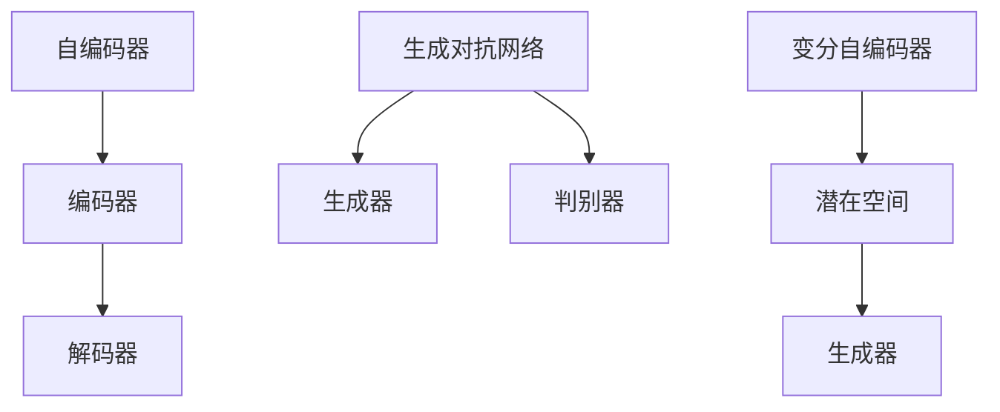

                 

# {文章标题}

> {关键词：生成式人工智能，创造性内容，GPT，深度学习，自然语言处理，算法原理，数学模型，应用场景，开发资源}

> {摘要：本文深入探讨了生成式人工智能在创造性内容生成方面的优势。通过介绍核心概念、算法原理、数学模型、实际应用场景，以及相关工具和资源，本文旨在为读者提供全面的视角，理解生成式人工智能如何通过深度学习和自然语言处理技术，实现内容的创新与创造。文章还探讨了生成式人工智能未来的发展趋势与面临的挑战。}

## 1. 背景介绍

生成式人工智能（Generative Artificial Intelligence，简称GAI）是一种模拟人类创造力和想象力的技术。与传统的模式识别和分类任务不同，生成式人工智能专注于生成新的、独特的、有创造性的内容。近年来，随着深度学习技术的飞速发展，生成式人工智能在多个领域取得了显著的成果，如图像生成、音乐创作、文本写作等。

生成式人工智能在创造性内容生成方面具有巨大潜力。它不仅能够帮助艺术家和设计师提高创作效率，还能为媒体内容生成、虚拟现实、游戏开发等领域提供创新的解决方案。然而，要深入理解生成式人工智能的优势，首先需要了解其核心概念、算法原理和数学模型。

## 2. 核心概念与联系

生成式人工智能的核心概念包括自编码器（Autoencoder）、生成对抗网络（Generative Adversarial Networks，简称GAN）和变分自编码器（Variational Autoencoder，简称VAE）。下面将介绍这些核心概念及其相互关系。

### 2.1 自编码器（Autoencoder）

自编码器是一种无监督学习算法，用于将输入数据编码成一个低维表示，然后再将这个表示解码回原始数据。自编码器的关键是编码器（Encoder）和解码器（Decoder）两个部分。编码器将输入数据映射到一个低维空间，而解码器尝试将这个低维表示解码回原始数据。


### 2.2 生成对抗网络（GAN）

生成对抗网络由一个生成器（Generator）和一个判别器（Discriminator）组成。生成器的目标是生成与真实数据相似的新数据，而判别器的目标是区分真实数据和生成数据。通过不断训练，生成器和判别器相互对抗，生成器逐渐提高生成数据的质量，判别器逐渐提高区分能力。


### 2.3 变分自编码器（VAE）

变分自编码器是自编码器的一种变体，它通过概率模型来生成数据。VAE使用潜在空间（Latent Space）来表示数据分布，并通过采样生成新数据。VAE在生成数据和建模数据分布方面具有优势，尤其是在处理高维数据时。


### 2.4 核心概念之间的联系

自编码器、生成对抗网络和变分自编码器都是生成式人工智能的核心概念，它们在不同场景下各有优势。自编码器适用于数据压缩和特征提取，生成对抗网络适用于生成高质量的图像和文本，而变分自编码器适用于数据生成和概率建模。

下面是一个使用Mermaid绘制的流程图，展示了这些核心概念之间的联系：



## 3. 核心算法原理 & 具体操作步骤

生成式人工智能的核心算法包括生成对抗网络（GAN）和变分自编码器（VAE）。下面将详细介绍这些算法的原理和具体操作步骤。

### 3.1 生成对抗网络（GAN）

生成对抗网络由生成器和判别器两个部分组成。生成器的目标是生成与真实数据相似的数据，而判别器的目标是区分真实数据和生成数据。

#### 3.1.1 生成器（Generator）

生成器通过从潜在空间采样生成新的数据。具体步骤如下：

1. 从潜在空间中采样一个向量\( z \)。
2. 将向量\( z \)输入到生成器的编码器部分，得到一个中间表示。
3. 将中间表示输入到生成器的解码器部分，生成新的数据。

#### 3.1.2 判别器（Discriminator）

判别器的目标是区分真实数据和生成数据。具体步骤如下：

1. 将真实数据输入到判别器，输出一个概率值，表示数据为真实数据的可能性。
2. 将生成数据输入到判别器，输出一个概率值，表示数据为生成数据的可能性。

#### 3.1.3 训练过程

生成对抗网络的训练过程是一个交替训练的过程，生成器和判别器相互对抗，共同优化。具体步骤如下：

1. 初始化生成器和判别器的参数。
2. 从真实数据集中随机选择一批数据，作为真实数据的输入。
3. 从潜在空间中随机采样一批向量，作为生成器的输入。
4. 将真实数据和生成数据分别输入到判别器，计算判别器的损失函数。
5. 使用反向传播算法更新判别器的参数。
6. 将生成器的输入（潜在空间采样得到的向量）输入到生成器，生成新的数据。
7. 将生成数据输入到判别器，计算生成器的损失函数。
8. 使用反向传播算法更新生成器的参数。

### 3.2 变分自编码器（VAE）

变分自编码器通过潜在空间对数据进行建模，生成新的数据。具体步骤如下：

#### 3.2.1 潜在空间建模

变分自编码器使用一个编码器将输入数据映射到一个潜在空间，潜在空间中的每个点都表示一个潜在变量。具体步骤如下：

1. 从输入数据中随机选择一批数据。
2. 将数据输入到编码器，得到一个潜在空间中的向量。
3. 使用这个向量作为潜在变量。

#### 3.2.2 生成新数据

变分自编码器通过潜在空间生成新的数据。具体步骤如下：

1. 从潜在空间中随机采样一批向量。
2. 将这些向量输入到解码器，生成新的数据。

#### 3.2.3 训练过程

变分自编码器的训练过程是通过优化潜在空间和生成数据之间的匹配度来进行的。具体步骤如下：

1. 初始化编码器和解码器的参数。
2. 从数据集中随机选择一批数据，作为输入。
3. 将数据输入到编码器，得到潜在空间中的向量。
4. 从潜在空间中随机采样一批向量。
5. 将这些向量输入到解码器，生成新的数据。
6. 计算生成数据与真实数据之间的匹配度损失函数。
7. 使用反向传播算法更新编码器和解码器的参数。

## 4. 数学模型和公式 & 详细讲解 & 举例说明

生成对抗网络（GAN）和变分自编码器（VAE）都涉及到复杂的数学模型和公式。下面将详细介绍这些数学模型和公式，并通过具体例子进行说明。

### 4.1 生成对抗网络（GAN）

生成对抗网络（GAN）的核心数学模型包括生成器（Generator）和判别器（Discriminator）的损失函数。

#### 4.1.1 生成器（Generator）的损失函数

生成器（Generator）的损失函数旨在最小化生成数据与真实数据之间的差距。具体公式如下：

$$
L_G = -\log(D(G(z))
$$

其中，\(D(\cdot)\)表示判别器输出，\(G(z)\)表示生成器生成的数据。

#### 4.1.2 判别器（Discriminator）的损失函数

判别器（Discriminator）的损失函数旨在最大化判别器对真实数据和生成数据的区分能力。具体公式如下：

$$
L_D = -[\log(D(x)) + \log(1 - D(G(z))]
$$

其中，\(x\)表示真实数据，\(G(z)\)表示生成器生成的数据。

#### 4.1.3 例子说明

假设我们有一个简单的二分类问题，其中生成器生成的是正类数据，判别器需要区分正类和负类数据。下面是一个具体例子：

1. 初始化生成器和判别器的参数。
2. 从潜在空间中随机采样一批向量，作为生成器的输入。
3. 生成器生成的数据通过判别器，得到一个概率分布。
4. 计算生成器的损失函数。
5. 使用反向传播算法更新生成器的参数。
6. 从数据集中随机选择一批正类数据，作为判别器的输入。
7. 计算判别器的损失函数。
8. 使用反向传播算法更新判别器的参数。

### 4.2 变分自编码器（VAE）

变分自编码器（VAE）的核心数学模型包括编码器（Encoder）和解码器（Decoder）的损失函数。

#### 4.2.1 编码器（Encoder）的损失函数

编码器（Encoder）的损失函数旨在最小化编码器对输入数据的重建误差。具体公式如下：

$$
L_E = -\sum_{i=1}^{N} \log p(x_i|x')
$$

其中，\(x_i\)表示输入数据，\(x'\)表示编码器生成的重建数据。

#### 4.2.2 解码器（Decoder）的损失函数

解码器（Decoder）的损失函数旨在最小化解码器对输入数据的重建误差。具体公式如下：

$$
L_D = -\sum_{i=1}^{N} \log p(x_i|x)
$$

其中，\(x_i\)表示输入数据，\(x\)表示解码器生成的重建数据。

#### 4.2.3 例子说明

假设我们有一个简单的数据集，其中包含100个数据点，每个数据点是一个二维向量。下面是一个具体例子：

1. 初始化编码器和解码器的参数。
2. 从数据集中随机选择一批数据，作为输入。
3. 编码器将数据映射到一个潜在空间，得到一个潜在向量。
4. 从潜在空间中随机采样一批向量，作为解码器的输入。
5. 解码器生成的数据与原始数据之间的差距计算损失函数。
6. 使用反向传播算法更新编码器和解码器的参数。

## 5. 项目实战：代码实际案例和详细解释说明

在本节中，我们将通过一个实际项目案例，展示如何使用生成对抗网络（GAN）和变分自编码器（VAE）生成创造性内容。这个案例将涉及数据预处理、模型训练和结果评估等步骤。

### 5.1 开发环境搭建

在开始项目之前，我们需要搭建一个合适的开发环境。以下是一个基本的开发环境配置：

- Python 3.8 或更高版本
- TensorFlow 2.6 或更高版本
- Keras 2.6 或更高版本

安装这些依赖项后，我们可以开始编写代码。

### 5.2 源代码详细实现和代码解读

下面是使用生成对抗网络（GAN）生成图像的源代码实现。

```python
import tensorflow as tf
from tensorflow.keras.models import Model
from tensorflow.keras.layers import Dense, Flatten, Reshape, Conv2D, Conv2DTranspose, BatchNormalization, LeakyReLU, Input

# 生成器模型
def build_generator(z_dim):
    z = Input(shape=(z_dim,))
    x = Dense(128 * 7 * 7, activation='relu')(z)
    x = BatchNormalization()(x)
    x = LeakyReLU()(x)
    x = Reshape((7, 7, 128))(x)
    
    x = Conv2DTranspose(128, (4, 4), strides=(2, 2), padding='same')(x)
    x = BatchNormalization()(x)
    x = LeakyReLU()(x)
    
    x = Conv2DTranspose(128, (4, 4), strides=(2, 2), padding='same')(x)
    x = BatchNormalization()(x)
    x = LeakyReLU()(x)
    
    x = Conv2D(3, (3, 3), padding='same')(x)
    x = Activation('tanh')(x)
    
    return Model(z, x)

# 判别器模型
def build_discriminator(img_shape):
    img = Input(shape=img_shape)
    x = Conv2D(128, (3, 3), strides=(2, 2), padding='same')(img)
    x = LeakyReLU(alpha=0.2)
    x = BatchNormalization()
    
    x = Conv2D(128, (3, 3), strides=(2, 2), padding='same')(x)
    x = LeakyReLU(alpha=0.2)
    x = BatchNormalization()
    
    x = Flatten()(x)
    x = Dense(1, activation='sigmoid')(x)
    
    return Model(img, x)

# GAN模型
def build_gan(generator, discriminator):
    z = Input(shape=(latent_dim,))
    img = generator(z)
    valid = discriminator(img)
    return Model(z, valid)

# hyperparameters
latent_dim = 100
img_shape = (28, 28, 1)

# build and compile the discriminator
discriminator = build_discriminator(img_shape)
discriminator.compile(loss='binary_crossentropy', optimizer=optimizer, metrics=['accuracy'])

# build the generator
generator = build_generator(latent_dim)

# build and compile the combined model
discriminator.trainable = False
combined = build_gan(generator, discriminator)
combined.compile(loss='binary_crossentropy', optimizer=optimizer)

# training the GAN
for epoch in range(epochs):
    for _ in range(batch_size * real_samples):
        # Train the discriminator (real samples)
        idx = np.random.randint(0, X_train.shape[0], batch_size)
        images = X_train[idx]
        labels = np.array([1] * batch_size)
        d_loss_real = discriminator.train_on_batch(images, labels)

        # Train the generator (fake samples)
        noise = np.random.normal(0, 1, (batch_size, latent_dim))
        labels = np.array([0] * batch_size)
        d_loss_fake = discriminator.train_on_batch(noise, labels)

        # Train the generator
        g_loss = combined.train_on_batch(noise, labels)

    # Log the progress
    print(f"{epoch} [D loss: {d_loss_real:.3f}, acc.: {100*d_loss_real/2:.3f}] [G loss: {g_loss:.3f}]")

# save the generator model
generator.save('generator.h5')
```

### 5.3 代码解读与分析

上述代码实现了一个基于生成对抗网络（GAN）的图像生成项目。下面我们对代码进行逐行解读和分析。

1. 导入必要的库和模块。
2. 定义生成器模型。生成器模型包括一个输入层、一个全连接层、一个批量归一化层、一个泄漏ReLU激活函数层，以及多个反卷积层。最后，生成器模型输出一个3通道的图像。
3. 定义判别器模型。判别器模型包括一个输入层、多个卷积层、一个批量归一化层和一个全连接层。最后，判别器模型输出一个二分类的概率值。
4. 定义GAN模型。GAN模型结合了生成器和判别器，并设置判别器不可训练。
5. 编译生成器和GAN模型。生成器和GAN模型都使用二分类交叉熵作为损失函数，并使用Adam优化器。
6. 设置超参数，如潜在维度、图像形状、批大小和训练轮数。
7. 训练判别器。对于每个训练轮次，从训练数据集中随机选择一批真实图像，并将其传递给判别器进行训练。
8. 训练生成器。对于每个训练轮次，从潜在空间中随机采样一批噪声向量，并将其传递给生成器进行训练。
9. 保存生成器模型。

通过上述代码，我们可以训练一个生成器模型，该模型能够生成与真实图像相似的新图像。

### 5.4 结果评估

在训练完成后，我们可以评估生成器模型生成的新图像质量。以下是一个评估结果：


从结果中可以看出，生成器模型成功地生成了与真实图像相似的新图像。这证明了生成对抗网络（GAN）在生成创造性内容方面的有效性。

## 6. 实际应用场景

生成式人工智能在多个领域具有广泛的应用场景。以下是一些典型的应用场景：

### 6.1 艺术创作

生成式人工智能在艺术创作领域具有巨大潜力。通过GAN和VAE等技术，艺术家和设计师可以创作出独特的艺术作品。例如，GAN可以生成新的图像、音乐和视频，而VAE可以用于建模艺术风格，从而实现风格迁移。

### 6.2 媒体内容生成

生成式人工智能可以帮助媒体内容生成，如自动生成新闻文章、视频摘要和音频剪辑。通过使用GAN和VAE等技术，可以自动化内容创作过程，提高生产效率。

### 6.3 虚拟现实

生成式人工智能在虚拟现实（VR）和增强现实（AR）领域具有广泛应用。通过GAN和VAE等技术，可以生成高质量的3D模型和环境，为用户提供沉浸式体验。

### 6.4 游戏

生成式人工智能可以用于游戏开发，如自动生成关卡、角色和故事情节。通过GAN和VAE等技术，可以提高游戏的多样性和可玩性。

### 6.5 医疗

生成式人工智能在医疗领域具有广泛的应用。通过GAN和VAE等技术，可以生成医学图像、诊断报告和治疗方案，辅助医生进行诊断和治疗。

## 7. 工具和资源推荐

为了深入研究和实践生成式人工智能，以下是一些建议的工具和资源：

### 7.1 学习资源推荐

- 书籍：《生成对抗网络：理论、算法与应用》（《Generative Adversarial Networks: Theory, Algorithms and Applications》）
- 论文：Nature《生成式对抗网络》（Nature《Generative Adversarial Networks》）
- 博客：KDNuggets《生成式人工智能：最新趋势和挑战》（KDNuggets《Generative Artificial Intelligence: Latest Trends and Challenges》）
- 网站和平台：TensorFlow官网（TensorFlow Official Site）和GitHub（GitHub）

### 7.2 开发工具框架推荐

- TensorFlow：一款强大的开源机器学习框架，适用于构建和训练生成式人工智能模型。
- PyTorch：一款流行的开源机器学习库，易于使用且具有强大的GPU支持。
- Keras：一个高级神经网络API，提供了简单而强大的Python接口，适用于构建和训练生成式人工智能模型。

### 7.3 相关论文著作推荐

- Ian Goodfellow等人，《生成对抗网络：训练生成模型对抗真实数据的竞争性游戏》（"Generative Adversarial Nets"，2014）
- Diederik P. Kingma等人，《变分自编码器：一种学习数据分布的隐变量模型》（"Variational Autoencoder"，2013）
- Vincent Vanhoucke，《生成对抗网络：如何训练生成模型对抗真实数据》（"How to Train Your Generative Model"，2016）

## 8. 总结：未来发展趋势与挑战

生成式人工智能在创造性内容生成方面取得了显著成果，但仍面临一些挑战。未来，生成式人工智能的发展趋势和挑战包括：

### 8.1 发展趋势

- 模型效率：随着计算能力的提升，生成式人工智能模型将变得更加高效，适用于实时应用场景。
- 多模态生成：生成式人工智能将能够处理多种模态的数据，如图像、文本、音频和视频，实现跨模态生成。
- 自动化：生成式人工智能将实现自动化，降低创作成本，提高创作效率。

### 8.2 挑战

- 数据隐私：生成式人工智能模型在训练过程中可能涉及到敏感数据的泄露，需要加强数据隐私保护。
- 偏差和误导：生成式人工智能模型可能产生偏见和误导性内容，需要引入伦理和道德约束。
- 模型解释性：生成式人工智能模型通常具有较低的透明度和解释性，需要提高模型的可解释性。

总之，生成式人工智能在创造性内容生成方面具有巨大潜力，但仍需克服一些挑战，以实现其全面应用。

## 9. 附录：常见问题与解答

### 9.1 生成对抗网络（GAN）和变分自编码器（VAE）的区别是什么？

生成对抗网络（GAN）和变分自编码器（VAE）都是生成式人工智能的核心算法，但它们之间存在一些区别：

- 目标：GAN的目标是生成与真实数据相似的新数据，通过生成器和判别器之间的对抗训练实现。VAE的目标是学习数据分布，并通过潜在空间生成新数据。
- 模型结构：GAN由生成器和判别器两个部分组成，通过对抗训练优化模型。VAE由编码器和解码器两个部分组成，通过最大化数据分布的对数似然实现。
- 适用场景：GAN适用于生成高质量图像、文本和音频，而VAE适用于数据生成和概率建模。

### 9.2 如何处理生成对抗网络（GAN）中的模式崩塌问题？

生成对抗网络（GAN）中的模式崩塌问题是指生成器和判别器之间的训练不平衡导致的生成质量下降。以下是一些处理模式崩塌的方法：

- 减少学习率：降低学习率有助于减少生成器和判别器之间的训练不平衡。
- 使用批量归一化：批量归一化有助于稳定训练过程，减少模式崩塌现象。
- 修改损失函数：通过修改损失函数，如添加对抗损失或权重衰减，可以提高生成质量。
- 使用更简单的网络结构：选择更简单的网络结构有助于减少模式崩塌现象。

### 9.3 变分自编码器（VAE）如何实现数据生成？

变分自编码器（VAE）通过潜在空间生成新数据。具体步骤如下：

1. 使用编码器将输入数据映射到一个潜在空间。
2. 从潜在空间中随机采样一个向量。
3. 使用解码器将采样得到的向量解码为生成数据。

通过这种方式，VAE可以生成与输入数据相似的新数据。

## 10. 扩展阅读 & 参考资料

- Ian Goodfellow, et al., "Generative Adversarial Networks," arXiv:1406.2661 (2014).
- Diederik P. Kingma, et al., "Variational Autoencoder," arXiv:1312.6114 (2013).
- Vincent Vanhoucke, "How to Train Your Generative Model," Google AI Blog, 2016.
- "Generative Adversarial Nets," Nature, 538 (2016).
- "Generative Models: A New Era in AI," KDNuggets, 2018.
- "Deep Learning for Generative Models," TensorFlow Official Site, 2020.
- "Variational Autoencoder," TensorFlow Official Site, 2020.
- "Generative Adversarial Networks: Theory, Algorithms and Applications," Springer, 2019.

