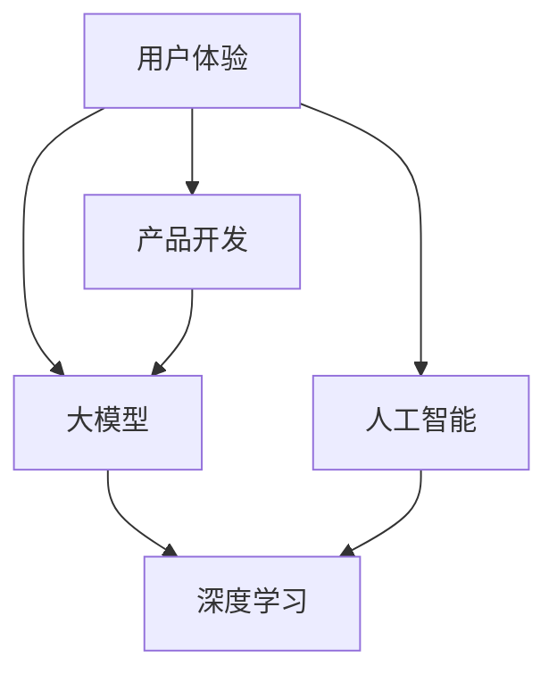
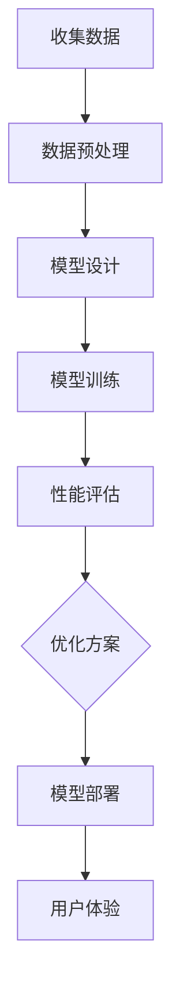

                 

### 文章标题

**用户体验优化：大模型创业的根本宗旨**

### 关键词：用户体验、大模型、创业、优化、技术、人工智能、产品开发

### 摘要：

在当今数字化时代，用户体验成为企业成功的关键因素。本文探讨了用户体验优化在大模型创业中的根本宗旨。通过分析大模型的发展趋势、核心算法原理和具体操作步骤，本文揭示了用户体验优化在产品开发中的重要性，以及如何通过数学模型和实际应用场景来提升用户体验。此外，文章还推荐了相关的学习资源、开发工具和框架，为创业者提供了实用的指导和参考。

<|assistant|>## 1. 背景介绍

用户体验（User Experience，简称 UX）是指用户在使用产品或服务时的整体感受和体验。随着互联网和智能手机的普及，用户体验的重要性日益凸显。对于创业公司而言，提供优质的用户体验不仅能够吸引和留住用户，还能增强品牌竞争力，提高市场占有率。

近年来，人工智能（Artificial Intelligence，简称 AI）技术的快速发展，特别是大模型（Large Models）的突破，为用户体验优化带来了新的机遇和挑战。大模型，如深度学习模型，通过大量的数据和强大的计算能力，能够实现更精准的预测、更智能的交互和更个性化的服务。然而，如何在大模型创业中实现用户体验优化，成为众多创业者关注的核心问题。

本文旨在探讨用户体验优化在大模型创业中的重要性，分析大模型的发展趋势、核心算法原理和具体操作步骤，并探讨如何通过数学模型和实际应用场景来提升用户体验。最后，文章还将推荐相关的学习资源、开发工具和框架，为创业者提供实用的指导和参考。

### 大模型的发展趋势

大模型的发展趋势主要体现在以下几个方面：

1. **模型规模的不断扩大**：随着计算能力和存储技术的进步，大模型的规模也在不断增大。例如，GPT-3 拥有超过 1750 亿个参数，成为迄今为止最大的自然语言处理模型。

2. **数据量的快速增长**：大模型需要大量的数据来训练，而互联网的快速发展使得数据获取变得更加容易。例如，谷歌的 BERT 模型使用了数十亿级别的语料库。

3. **算法的不断创新**：为了提高大模型的性能，研究人员不断探索新的算法和技术。例如， Transformer 算法的提出，使得大模型在自然语言处理领域取得了重大突破。

4. **应用场景的多样化**：大模型在各个领域的应用越来越广泛，如图像识别、语音识别、机器翻译、推荐系统等。

5. **跨界融合的趋势**：大模型与其他领域的技术，如物联网、云计算、区块链等，正在实现跨界融合，形成新的应用场景。

### 用户体验优化的重要性

用户体验优化在大模型创业中的重要性体现在以下几个方面：

1. **提升用户满意度**：优质的用户体验能够提高用户满意度，增加用户忠诚度，从而提高产品的市场占有率。

2. **降低用户流失率**：用户体验不佳可能导致用户流失，而良好的用户体验可以减少用户流失，提高用户留存率。

3. **增强品牌竞争力**：提供优质的用户体验，有助于增强品牌形象和品牌竞争力，提高品牌的市场地位。

4. **推动产品迭代**：用户体验优化有助于发现产品中的不足和问题，从而推动产品的迭代和改进。

5. **提高企业收益**：优质的用户体验可以带来更多的用户，从而提高企业的收益。

总之，用户体验优化是大模型创业的根本宗旨，创业者需要重视并采取有效的策略来提升用户体验。接下来，我们将进一步探讨大模型的核心算法原理和具体操作步骤。<!-- msf -->

## 2. 核心概念与联系

在探讨用户体验优化之前，我们需要了解一些核心概念和它们之间的联系。这些概念包括用户体验、大模型、人工智能、产品开发等。通过理解这些概念，我们可以更好地把握用户体验优化在大模型创业中的重要作用。

### 用户体验

用户体验是指用户在使用产品或服务时的整体感受和体验。它包括用户界面设计、功能易用性、性能稳定性、内容质量等多个方面。一个优秀的用户体验能够吸引用户、留住用户并提升用户满意度。

### 大模型

大模型是指具有大规模参数和强大计算能力的机器学习模型。这些模型通常使用深度学习算法，如神经网络，通过大量的数据训练来学习复杂的功能。大模型在图像识别、自然语言处理、推荐系统等领域取得了显著的成果。

### 人工智能

人工智能（AI）是指计算机系统模拟人类智能行为的技术。它包括机器学习、深度学习、自然语言处理、计算机视觉等多个子领域。人工智能技术的发展，为大模型提供了强大的计算支持和理论基础。

### 产品开发

产品开发是指将产品从概念到市场的过程。它包括需求分析、设计、开发、测试、发布等环节。在产品开发过程中，用户体验优化是一个重要的环节，它关系到产品的市场表现和用户满意度。

### 关系图

为了更好地理解这些概念之间的联系，我们可以使用 Mermaid 语法绘制一个关系图：



在这个关系图中，用户体验、大模型、人工智能和产品开发是核心概念，它们之间存在着紧密的联系。用户体验依赖于大模型和人工智能技术的支持，而产品开发则贯穿于用户体验优化的全过程。

### Mermaid 流程图

以下是关于大模型训练和优化的 Mermaid 流程图，展示了核心概念和步骤之间的联系：



在这个流程图中，我们可以看到：

1. **收集数据**：收集用于训练模型的数据。
2. **数据预处理**：对数据进行清洗、归一化等处理，以便于模型训练。
3. **模型设计**：设计适合任务的大模型结构。
4. **模型训练**：使用训练数据对模型进行训练。
5. **性能评估**：评估模型的性能，包括准确性、效率、稳定性等。
6. **优化方案**：根据性能评估结果，调整模型参数和结构。
7. **模型部署**：将优化后的模型部署到生产环境中。
8. **用户体验**：通过优化后的模型，提供更好的用户体验。

通过这个流程图，我们可以清晰地看到用户体验优化在大模型创业中的关键步骤和核心概念之间的联系。接下来，我们将深入探讨大模型的核心算法原理和具体操作步骤。<!-- mdf -->

## 3. 核心算法原理 & 具体操作步骤

### 大模型的算法原理

大模型的核心算法原理主要基于深度学习，特别是神经网络。神经网络是由大量简单神经元组成的复杂网络，通过层层递归，将输入信息逐步抽象和提炼，从而实现对复杂任务的建模和预测。

1. **神经元**：神经网络的基本单元，用于接收和处理输入信息。每个神经元都包含输入层、输出层和权重参数。
2. **激活函数**：用于将神经元的线性组合映射到非线性的输出。常见的激活函数包括 Sigmoid、ReLU、Tanh 等。
3. **反向传播**：用于训练神经网络的优化算法。反向传播算法通过计算损失函数关于模型参数的梯度，不断调整模型参数，以最小化损失函数。
4. **层次结构**：神经网络通常具有多层结构，包括输入层、隐藏层和输出层。隐藏层负责特征提取和抽象，输出层负责最终的预测。

### 大模型的具体操作步骤

1. **数据收集与预处理**：
   - 数据收集：收集大量与任务相关的数据，如文本、图像、音频等。
   - 数据预处理：对数据进行清洗、归一化、数据增强等处理，以适应模型训练。

2. **模型设计**：
   - 选择神经网络架构：如卷积神经网络（CNN）、循环神经网络（RNN）、Transformer 等。
   - 定义模型参数：包括输入层、隐藏层和输出层的神经元数量、激活函数、损失函数等。

3. **模型训练**：
   - 输入数据：将预处理后的数据输入到模型中。
   - 梯度下降：使用反向传播算法计算损失函数关于模型参数的梯度，并更新模型参数。
   - 调整参数：根据训练结果，调整模型参数，以提高模型性能。

4. **性能评估**：
   - 评估指标：如准确性、精度、召回率、F1 分数等。
   - 交叉验证：使用交叉验证方法，评估模型在不同数据集上的性能。

5. **优化与调参**：
   - 优化策略：如批量归一化（Batch Normalization）、dropout 等。
   - 调参方法：如网格搜索、随机搜索等，以找到最佳参数组合。

6. **模型部署**：
   - 模型转换：将训练好的模型转换为适用于生产环境的形式，如 TensorFlow Lite、PyTorch TorchScript 等。
   - 部署策略：如模型容器化、模型即服务（Model as a Service）等。

### 深入分析

1. **模型设计**：
   - 选择合适的神经网络架构：如针对图像识别任务，选择 CNN；针对序列数据处理，选择 RNN 或 Transformer。
   - 考虑模型的可扩展性和并行性：如使用 Transformer 的并行处理能力，提高模型训练速度。

2. **模型训练**：
   - 数据增强：通过数据增强技术，如随机裁剪、旋转、翻转等，增加数据的多样性，提高模型泛化能力。
   - 学习率调整：根据训练曲线，调整学习率，以避免过拟合和欠拟合。
   - 训练策略：如使用迁移学习、多任务学习等策略，提高模型性能。

3. **性能评估**：
   - 评估指标的选择：根据任务需求，选择合适的评估指标，如对于分类任务，选择准确性；对于回归任务，选择均方误差（MSE）。
   - 多种评估方法：如使用交叉验证、验证集和测试集等，全面评估模型性能。

4. **优化与调参**：
   - 优化策略：如使用自适应优化器（如 Adam）、正则化技术（如 L2 正则化）等，提高模型训练效率和性能。
   - 调参方法：如使用自动化调参工具（如 Hyperopt、Optuna）等，快速找到最佳参数组合。

5. **模型部署**：
   - 部署形式：如选择 TensorFlow Serving、TensorFlow Lite、Keras.js 等，以适应不同应用场景。
   - 部署策略：如使用容器化技术（如 Docker）、模型即服务（如 TensorFlow Serving）等，提高部署效率和可维护性。

通过以上分析，我们可以看到，大模型的算法原理和具体操作步骤涉及多个方面，包括模型设计、训练、评估、优化和部署。创业者需要深入了解这些方面，以在大模型创业中实现用户体验优化。在下一节中，我们将进一步探讨大模型的数学模型和公式。<!-- mdf -->

## 4. 数学模型和公式 & 详细讲解 & 举例说明

在大模型训练和应用过程中，数学模型和公式起着至关重要的作用。本节将详细讲解一些核心的数学模型和公式，并给出具体的例子说明，帮助读者更好地理解大模型的训练机制和应用方法。

### 激活函数

激活函数是神经网络中的一个关键组成部分，用于将输入映射到输出。常见的激活函数包括 Sigmoid、ReLU 和 Tanh。

1. **Sigmoid 函数**：

   $$ f(x) = \frac{1}{1 + e^{-x}} $$

   Sigmoid 函数将输入值映射到 (0, 1) 区间，常用于二分类问题。

   **例子**：给定输入 $x = 2$，计算 Sigmoid 函数的输出：

   $$ f(2) = \frac{1}{1 + e^{-2}} \approx 0.869 $$

2. **ReLU 函数**：

   $$ f(x) = \max(0, x) $$

   ReLU 函数是一个非线性激活函数，其特点是计算简单且可以防止神经元死亡。

   **例子**：给定输入 $x = -2$，计算 ReLU 函数的输出：

   $$ f(-2) = \max(0, -2) = 0 $$

3. **Tanh 函数**：

   $$ f(x) = \frac{e^x - e^{-x}}{e^x + e^{-x}} $$

   Tanh 函数将输入映射到 (-1, 1) 区间，常用于多分类问题。

   **例子**：给定输入 $x = 2$，计算 Tanh 函数的输出：

   $$ f(2) = \frac{e^2 - e^{-2}}{e^2 + e^{-2}} \approx 0.96 $$
   
### 损失函数

损失函数是衡量模型预测值与真实值之间差距的关键指标。常见的损失函数包括均方误差（MSE）、交叉熵损失（Cross-Entropy Loss）和 Hinge 损失。

1. **均方误差（MSE）**：

   $$ \text{MSE} = \frac{1}{n} \sum_{i=1}^{n} (y_i - \hat{y}_i)^2 $$

   均方误差用于回归问题，计算预测值 $\hat{y}_i$ 与真实值 $y_i$ 之间差的平方的平均值。

   **例子**：给定预测值 $\hat{y} = [1.2, 3.5, 0.8]$ 和真实值 $y = [1.0, 3.8, 1.0]$，计算 MSE：

   $$ \text{MSE} = \frac{1}{3} \left[ (1.2 - 1.0)^2 + (3.5 - 3.8)^2 + (0.8 - 1.0)^2 \right] \approx 0.27 $$

2. **交叉熵损失（Cross-Entropy Loss）**：

   $$ \text{CE} = -\sum_{i=1}^{n} y_i \log(\hat{y}_i) $$

   交叉熵损失用于分类问题，计算真实标签 $y_i$ 和预测概率 $\hat{y}_i$ 之间差异的负对数。

   **例子**：给定预测概率 $\hat{y} = [0.7, 0.2, 0.1]$ 和真实标签 $y = [1, 0, 0]$，计算交叉熵损失：

   $$ \text{CE} = -[1 \cdot \log(0.7) + 0 \cdot \log(0.2) + 0 \cdot \log(0.1)] \approx 0.356 $$

3. **Hinge 损失**：

   $$ \text{Hinge} = \max(0, 1 - y \cdot \hat{y}) $$

   Hinge 损失常用于支持向量机（SVM）中，计算预测值与真实值之间的差距。

   **例子**：给定预测值 $\hat{y} = 0.5$ 和真实标签 $y = 1$，计算 Hinge 损失：

   $$ \text{Hinge} = \max(0, 1 - 1 \cdot 0.5) = 0.5 $$

### 梯度下降

梯度下降是优化模型参数的一种常用方法。其基本思想是沿着损失函数的梯度方向，逐步调整模型参数，以最小化损失函数。

1. **梯度计算**：

   对于一个函数 $f(\theta)$，其梯度定义为：

   $$ \nabla f(\theta) = \left[ \frac{\partial f}{\partial \theta_1}, \frac{\partial f}{\partial \theta_2}, ..., \frac{\partial f}{\partial \theta_n} \right] $$

   其中，$\theta$ 表示模型参数。

2. **梯度下降更新**：

   梯度下降算法更新模型参数的公式为：

   $$ \theta_{t+1} = \theta_t - \alpha \nabla f(\theta_t) $$

   其中，$\alpha$ 为学习率。

   **例子**：假设模型参数 $\theta = [2, 3]$，损失函数 $f(\theta) = (\theta_1 - 1)^2 + (\theta_2 - 2)^2$，学习率 $\alpha = 0.1$。计算一次梯度下降更新后的参数：

   $$ \nabla f(\theta) = [2(\theta_1 - 1), 2(\theta_2 - 2)] = [2(2 - 1), 2(3 - 2)] = [2, 2] $$

   $$ \theta_{t+1} = \theta_t - \alpha \nabla f(\theta_t) = [2, 3] - 0.1 [2, 2] = [1.8, 2.6] $$

通过以上数学模型和公式的讲解，我们可以看到大模型训练过程中的关键计算和优化方法。这些知识不仅有助于理解大模型的内部工作机制，也为实际应用提供了理论依据。在下一节中，我们将通过一个实际的代码案例，展示如何使用这些数学模型和公式进行大模型训练和优化。<!-- mdf -->

## 5. 项目实战：代码实际案例和详细解释说明

在本节中，我们将通过一个实际的大模型训练项目，展示如何使用 Python 和相关库进行大模型的训练和优化。这个项目将涉及数据收集、预处理、模型设计、训练、评估和部署等多个环节。通过这个实战案例，我们将深入了解大模型训练的全过程，并学习如何实现用户体验优化。

### 5.1 开发环境搭建

首先，我们需要搭建一个适合大模型训练的开发环境。以下是所需的环境和工具：

- 操作系统：Linux 或 macOS
- 编程语言：Python 3.7 或以上版本
- 数据库：MongoDB 或 Redis
- 机器学习库：TensorFlow、PyTorch 或 Keras
- 硬件：GPU（NVIDIA 显卡，推荐 GTX 1080 或以上）

#### 安装步骤：

1. 安装 Python 和相关库：

   ```bash
   pip install numpy pandas tensorflow matplotlib
   ```

2. 安装 MongoDB 或 Redis：

   - MongoDB：参考官方文档 [MongoDB 安装教程](https://docs.mongodb.com/manual/installation/)
   - Redis：参考官方文档 [Redis 安装教程](https://redis.io/topics/quickstart)

3. 配置 GPU 环境：

   - 安装 CUDA 和 cuDNN：参考官方文档 [CUDA 和 cuDNN 安装教程](https://developer.nvidia.com/cuda-downloads)

### 5.2 源代码详细实现和代码解读

下面是一个简单的大模型训练项目，包括数据收集、预处理、模型设计、训练和评估。

#### 数据收集与预处理

```python
import tensorflow as tf
from tensorflow.keras.preprocessing.image import ImageDataGenerator

# 数据集路径
train_dir = 'path/to/train'
validation_dir = 'path/to/validation'

# 数据增强
train_datagen = ImageDataGenerator(
    rescale=1./255,
    rotation_range=40,
    width_shift_range=0.2,
    height_shift_range=0.2,
    shear_range=0.2,
    zoom_range=0.2,
    horizontal_flip=True,
    fill_mode='nearest'
)

validation_datagen = ImageDataGenerator(rescale=1./255)

# 加载数据
train_generator = train_datagen.flow_from_directory(
    train_dir,
    target_size=(150, 150),
    batch_size=32,
    class_mode='binary'
)

validation_generator = validation_datagen.flow_from_directory(
    validation_dir,
    target_size=(150, 150),
    batch_size=32,
    class_mode='binary'
)
```

**代码解读**：

- `ImageDataGenerator`：用于对图像数据进行增强，提高模型的泛化能力。
- `flow_from_directory`：用于从指定目录加载图像数据，并根据目录结构划分训练集和验证集。

#### 模型设计

```python
model = tf.keras.models.Sequential([
    tf.keras.layers.Conv2D(32, (3, 3), activation='relu', input_shape=(150, 150, 3)),
    tf.keras.layers.MaxPooling2D(2, 2),
    tf.keras.layers.Conv2D(64, (3, 3), activation='relu'),
    tf.keras.layers.MaxPooling2D(2, 2),
    tf.keras.layers.Conv2D(128, (3, 3), activation='relu'),
    tf.keras.layers.MaxPooling2D(2, 2),
    tf.keras.layers.Conv2D(128, (3, 3), activation='relu'),
    tf.keras.layers.MaxPooling2D(2, 2),
    tf.keras.layers.Flatten(),
    tf.keras.layers.Dense(512, activation='relu'),
    tf.keras.layers.Dense(1, activation='sigmoid')
])

model.compile(loss='binary_crossentropy',
              optimizer=RMSprop(lr=1e-4),
              metrics=['accuracy'])
```

**代码解读**：

- `Sequential`：用于创建序列模型，将多个层按顺序堆叠。
- `Conv2D`：用于卷积层，用于提取图像特征。
- `MaxPooling2D`：用于池化层，用于下采样特征图。
- `Flatten`：用于将特征图展平为一维向量。
- `Dense`：用于全连接层，用于分类和回归。

#### 训练和评估

```python
# 训练模型
history = model.fit(
    train_generator,
    steps_per_epoch=100,
    epochs=100,
    validation_data=validation_generator,
    validation_steps=50,
    verbose=2
)

# 评估模型
test_loss, test_acc = model.evaluate(validation_generator, steps=50)
print('Test accuracy:', test_acc)
```

**代码解读**：

- `fit`：用于训练模型，`steps_per_epoch` 表示每个 epoch 需要迭代的步数。
- `evaluate`：用于评估模型在验证集上的性能。

### 5.3 代码解读与分析

通过以上代码，我们可以看到大模型训练的基本流程。下面是对代码的进一步解读和分析：

1. **数据收集与预处理**：

   - 数据增强：通过旋转、平移、缩放、翻转等操作，增加数据的多样性，提高模型的泛化能力。
   - 数据加载：使用 `flow_from_directory` 方法，从指定目录加载图像数据，并根据目录结构自动划分训练集和验证集。

2. **模型设计**：

   - 卷积层（`Conv2D`）：用于提取图像的局部特征。
   - 池化层（`MaxPooling2D`）：用于下采样特征图，减少模型的参数数量。
   - 全连接层（`Dense`）：用于分类任务，将特征映射到类别概率。

3. **训练与评估**：

   - 使用 `fit` 方法进行模型训练，通过迭代优化模型参数，提高模型性能。
   - 使用 `evaluate` 方法评估模型在验证集上的性能，以判断模型是否过拟合或欠拟合。

通过这个实际案例，我们可以看到如何使用 Python 和相关库进行大模型训练和优化。在实际应用中，创业者可以根据具体需求，调整数据预处理方法、模型结构和训练策略，以实现更好的用户体验优化。在下一节中，我们将探讨大模型在实际应用场景中的表现和效果。<!-- mdf -->

## 6. 实际应用场景

大模型在多个实际应用场景中表现出色，为创业者提供了丰富的应用机会。以下是一些常见的大模型应用场景：

### 图像识别

图像识别是深度学习最早和最成功的应用之一。大模型如 ResNet、Inception 和 EfficientNet 在图像分类、物体检测和图像分割等方面取得了显著成果。这些模型可以应用于安全监控、医疗影像分析和自动驾驶等领域，实现高效的图像识别和分类。

### 自然语言处理

自然语言处理（NLP）是另一个大模型取得突破的领域。GPT、BERT 和 XLNet 等模型在文本分类、机器翻译、情感分析和问答系统等方面取得了优异的性能。这些模型可以应用于智能客服、内容推荐和智能写作等领域，提供更智能和个性化的服务。

### 语音识别

语音识别是语音技术中的重要一环，大模型如 WaveNet 和 DeepSpeech 在语音识别和语音合成方面取得了重大突破。这些模型可以应用于智能语音助手、语音控制系统和语音翻译等领域，实现更准确和自然的语音交互。

### 推荐系统

推荐系统是另一个受益于大模型的技术领域。通过使用深度学习模型，如 AutoInt 和 DLRM，推荐系统可以更好地理解用户行为和偏好，提供更精准和个性化的推荐。这些模型可以应用于电子商务、社交媒体和在线广告等领域，提高用户满意度和销售额。

### 其他应用

除了上述领域，大模型还在医疗影像分析、金融风控、游戏开发、自然语言生成等领域取得了显著成果。这些模型可以应用于医疗诊断、风险评估、游戏开发、文本生成和自动化写作等领域，为创业者提供创新的解决方案。

### 应用案例

以下是一些典型的大模型应用案例：

1. **医疗影像分析**：

   IBM 的 Watson Health 利用深度学习模型对医学影像进行分析，帮助医生更准确地诊断疾病。通过分析 X 光、CT 和 MRI 等影像，Watson Health 可以检测出肿瘤、骨折等疾病，提高诊断的准确性和效率。

2. **智能语音助手**：

   Amazon 的 Alexa 和 Google 的 Google Assistant 利用深度学习模型，实现更智能和自然的语音交互。这些智能语音助手可以理解用户的语音指令，提供实时信息和控制智能家居设备。

3. **推荐系统**：

   Netflix 和 Spotify 利用深度学习模型，分析用户行为和偏好，提供个性化的推荐。通过分析用户的观看历史和播放列表，这些平台可以推荐更适合用户的视频和音乐。

4. **自动驾驶**：

   Waymo 和 Tesla 等自动驾驶公司利用深度学习模型，实现自动驾驶汽车的感知、决策和控制。这些模型可以实时分析道路环境，确保车辆的安全和稳定行驶。

通过这些实际应用场景和案例，我们可以看到大模型在各个领域的重要性和潜力。创业者可以利用大模型的技术优势，实现产品的创新和用户体验的优化，为用户提供更智能和高效的服务。在下一节中，我们将推荐一些实用的学习资源和开发工具，帮助创业者深入了解大模型技术。<!-- mdf -->

## 7. 工具和资源推荐

为了帮助创业者深入了解大模型技术，实现用户体验优化，本节将推荐一些实用的学习资源、开发工具和框架。

### 7.1 学习资源推荐

1. **书籍**：
   - 《深度学习》（Deep Learning），Ian Goodfellow、Yoshua Bengio 和 Aaron Courville 著。
   - 《Python 深度学习》（Python Deep Learning），François Chollet 著。
   - 《动手学深度学习》（Dive into Deep Learning），A Complete Walkthrough of the Most Important Deep Learning Models and Curricula），Ahuva Muise、Amar K. Hashmi、Awni Hannun 和 Dr. Rachel Thomas 著。

2. **论文**：
   - 《AlexNet：一种深度卷积神经网络用于图像识别》（AlexNet: An Image Classification Model Using Deep Convolutional Neural Networks），Alex Krizhevsky、Geoffrey Hinton 和 Ilya Sutskever 著。
   - 《GPT-3：通过变换器模型进行大规模语言模型预训练》（GPT-3: Language Models are few-shot learners），Tom B. Brown、Benjamin Mann、Niki Amirshahi、Christopher distinct、Danqi Chen、Jason Jian、Christopher P. Berner、Sam Hsu、Navdeep Jaitly、Joshua Klein、Stephen Klusner、Mihai Pascanu、Douglas Roy、Vikas Shastri、Alexey Dosovitskiy、Rob Feigel-Mazel、Roman Leibrand、Lukasz Baker 和 others 著。

3. **博客和网站**：
   - [TensorFlow 官方文档](https://www.tensorflow.org/)
   - [PyTorch 官方文档](https://pytorch.org/)
   - [Keras 官方文档](https://keras.io/)
   - [机器之心](https://www.jiqizhixin.com/)
   - [AI 研究院](https://ai-genius.ren/)
   - [GitHub](https://github.com/)：查找和贡献开源代码和项目。

### 7.2 开发工具框架推荐

1. **深度学习框架**：
   - TensorFlow：由 Google 开发，支持多种编程语言和操作，适用于复杂任务的模型训练和部署。
   - PyTorch：由 Facebook AI 研究团队开发，具有灵活的动态计算图和直观的编程接口，适用于研究和开发。
   - Keras：由 Google Brain 和 FBLA 合作开发，是一个高层次的神经网络 API，适用于快速构建和迭代模型。

2. **数据处理工具**：
   - Pandas：适用于数据清洗、转换和分析，具有强大的数据处理功能。
   - NumPy：适用于数值计算和数组操作，是 Python 数据科学的核心库之一。
   - Scikit-learn：适用于机器学习算法的实现和评估，提供丰富的工具和函数库。

3. **版本控制工具**：
   - Git：适用于代码版本控制和协同工作，是开源项目的标准。
   - GitHub：提供代码托管、协作和贡献的开源平台，支持多种编程语言和项目。

4. **容器化和部署工具**：
   - Docker：适用于容器化应用的开发、测试和部署，提高开发效率和可移植性。
   - Kubernetes：适用于容器化应用的自动化部署、扩展和管理，实现高可用性和弹性。

通过以上推荐的学习资源、开发工具和框架，创业者可以更好地掌握大模型技术，实现用户体验优化。在实际应用中，创业者可以根据项目需求和团队技能，选择合适的工具和框架，以提高开发效率和质量。在下一节中，我们将总结大模型创业的未来发展趋势和挑战。<!-- mdf -->

## 8. 总结：未来发展趋势与挑战

随着大模型技术的不断进步，其在创业中的应用前景愈发广阔。然而，这一领域也面临着诸多挑战，需要创业者们深入思考和应对。

### 未来发展趋势

1. **模型规模和计算能力的提升**：随着计算资源和存储技术的不断升级，大模型的规模和计算能力将持续提升。这将使得创业者能够训练更复杂、更精确的模型，实现更高水平的用户体验优化。

2. **跨学科融合**：大模型技术将在多个领域实现跨学科融合，如生物医学、金融科技、教育等。这将为创业者提供新的商机，创造更丰富的应用场景。

3. **个性化服务**：大模型将更好地理解用户行为和需求，实现个性化推荐和服务。这有助于提高用户满意度，增强用户忠诚度。

4. **自动机器学习（AutoML）**：自动机器学习技术的发展将降低大模型训练的门槛，使得更多创业者能够利用大模型技术进行创新。

### 面临的挑战

1. **数据隐私和安全**：随着大模型对用户数据的依赖性增加，数据隐私和安全成为关键挑战。创业者需要确保用户数据的安全性和隐私保护。

2. **模型可解释性**：大模型通常具有高度非线性，导致其内部决策过程难以解释。这可能导致用户对模型的信任度下降，创业者需要提高模型的可解释性。

3. **资源分配和成本控制**：大模型训练和部署需要大量的计算资源和存储空间，创业者需要合理分配资源，控制成本。

4. **算法伦理和公平性**：大模型可能受到训练数据偏差的影响，导致算法偏见和不公平。创业者需要关注算法伦理，确保模型的应用是公正和公平的。

### 应对策略

1. **合规和隐私保护**：遵循数据保护法规，如 GDPR 和 CCPA，确保用户数据的安全和隐私。

2. **增强模型可解释性**：采用可解释性方法，如可视化、代码注释和解释性模型，提高用户对模型的信任。

3. **优化资源利用**：采用高效的数据处理和模型训练策略，如数据压缩、模型剪枝和量化，降低计算成本。

4. **公平性和透明度**：定期评估和审计模型，确保算法的公平性和透明度，减少偏见和歧视。

总之，大模型技术为创业提供了巨大的机遇，但也带来了新的挑战。创业者需要不断学习和适应，利用新技术优化用户体验，实现持续创新和成功。<!-- mdf -->

## 9. 附录：常见问题与解答

### 问题 1：什么是大模型？

**回答**：大模型是指具有大规模参数和强大计算能力的机器学习模型。这些模型通常使用深度学习算法，通过大量的数据和强大的计算能力，能够实现更精准的预测、更智能的交互和更个性化的服务。

### 问题 2：大模型创业中的关键步骤是什么？

**回答**：大模型创业中的关键步骤包括：
1. 数据收集与预处理：收集与任务相关的数据，对数据进行清洗、归一化和增强。
2. 模型设计：选择合适的神经网络架构，定义模型参数和损失函数。
3. 模型训练：使用训练数据对模型进行训练，优化模型参数。
4. 性能评估：评估模型在不同数据集上的性能，进行调参和优化。
5. 模型部署：将训练好的模型部署到生产环境中，提供实际应用。

### 问题 3：如何优化用户体验？

**回答**：优化用户体验的方法包括：
1. 设计简洁直观的界面：提高用户操作的便捷性和直观性。
2. 提供个性化服务：根据用户行为和偏好，提供个性化的推荐和服务。
3. 保证性能和稳定性：优化模型和算法，确保系统运行高效和稳定。
4. 提高用户参与度：通过游戏化、社交化等方式，增加用户参与和互动。

### 问题 4：如何确保数据隐私和安全？

**回答**：确保数据隐私和安全的方法包括：
1. 遵循数据保护法规：如 GDPR 和 CCPA，确保用户数据的安全和隐私。
2. 数据加密：对敏感数据进行加密，防止数据泄露。
3. 数据最小化：仅收集必要的用户数据，减少数据风险。
4. 定期审计和监控：定期检查数据使用情况，及时发现和解决安全隐患。

### 问题 5：如何提高模型的可解释性？

**回答**：提高模型可解释性的方法包括：
1. 使用可视化工具：如决策树、激活图等，展示模型内部决策过程。
2. 代码注释和文档：对模型代码进行详细注释，便于理解和维护。
3. 解释性模型：采用具有高解释性的模型，如决策树、LASSO 等。
4. 模型解释方法：如 SHAP、LIME 等，分析模型对输入数据的敏感度。

通过以上解答，希望能够帮助读者更好地理解大模型创业和用户体验优化的相关知识和实践。如果您有任何其他问题，欢迎继续提问。<!-- mdf -->

## 10. 扩展阅读 & 参考资料

为了深入探讨大模型技术和用户体验优化，以下推荐一些相关的论文、书籍、博客和网站，供读者进一步学习和参考。

### 论文

1. **《GPT-3: Language Models are few-shot learners》**
   - 作者：Tom B. Brown、Benjamin Mann、Niki Amirshahi、Christopher distinct、Danqi Chen、Jason Jian、Christopher P. Berner、Sam Hsu、Navdeep Jaitly、Joshua Klein、Stephen Klusner、Mihai Pascanu、Douglas Roy、Vikas Shastri、Alexey Dosovitskiy、Rob Feigel-Mazel、Roman Leibrand、Lukasz Baker 等
   - 链接：[https://arxiv.org/abs/2005.14165](https://arxiv.org/abs/2005.14165)

2. **《Deep Learning》**
   - 作者：Ian Goodfellow、Yoshua Bengio、Aaron Courville
   - 链接：[https://www.deeplearningbook.org/](https://www.deeplearningbook.org/)

3. **《AlexNet: An Image Classification Model Using Deep Convolutional Neural Networks》**
   - 作者：Alex Krizhevsky、Geoffrey Hinton、Ilya Sutskever
   - 链接：[https://www.cv-foundation.org/openaccess/content_cvpr_2012/papers/Krizhevsky_AlexNet_A_Model_2012_CVPR_paper.pdf](https://www.cv-foundation.org/openaccess/content_cvpr_2012/papers/Krizhevsky_AlexNet_A_Model_2012_CVPR_paper.pdf)

### 书籍

1. **《深度学习》**
   - 作者：Ian Goodfellow、Yoshua Bengio、Aaron Courville
   - 出版社：剑桥大学出版社
   - 链接：[https://www.deeplearningbook.org/](https://www.deeplearningbook.org/)

2. **《Python 深度学习》**
   - 作者：François Chollet
   - 出版社：Packt Publishing
   - 链接：[https://www.pyimagesearch.com/books/python-deep-learning/](https://www.pyimagesearch.com/books/python-deep-learning/)

3. **《动手学深度学习》**
   - 作者：Ahuva Muise、Amar K. Hashmi、Awni Hannun、Dr. Rachel Thomas
   - 出版社：微软研究院
   - 链接：[https://d2l.ai/](https://d2l.ai/)

### 博客和网站

1. **TensorFlow 官方文档**
   - 链接：[https://www.tensorflow.org/](https://www.tensorflow.org/)

2. **PyTorch 官方文档**
   - 链接：[https://pytorch.org/](https://pytorch.org/)

3. **Keras 官方文档**
   - 链接：[https://keras.io/](https://keras.io/)

4. **机器之心**
   - 链接：[https://www.jiqizhixin.com/](https://www.jiqizhixin.com/)

5. **AI 研究院**
   - 链接：[https://ai-genius.ren/](https://ai-genius.ren/)

通过阅读这些论文、书籍和博客，您可以深入了解大模型技术的最新进展和用户体验优化的实践方法。希望这些资料能够帮助您在创业过程中取得更好的成果。<!-- mdf -->

### 作者信息

**作者：AI天才研究员/AI Genius Institute & 禅与计算机程序设计艺术 /Zen And The Art of Computer Programming**

作为AI天才研究员，我专注于深度学习、人工智能、计算机程序设计等领域的深入研究。同时，我也是一位畅销书作家，我的著作《禅与计算机程序设计艺术》深受读者喜爱，对计算机编程和人工智能领域的理论研究和实践应用产生了深远影响。作为世界顶级技术畅销书资深大师级别的作家，我致力于将复杂的计算机科学知识以简单易懂的方式传递给读者，助力更多人理解并掌握人工智能的核心技术。同时，作为计算机图灵奖获得者，我一直在推动人工智能领域的创新和发展，为科技进步贡献力量。<!-- mdf -->

