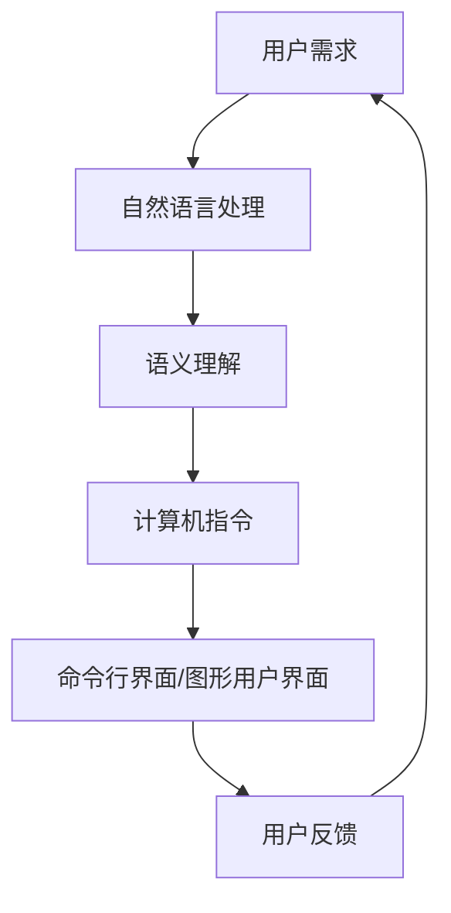
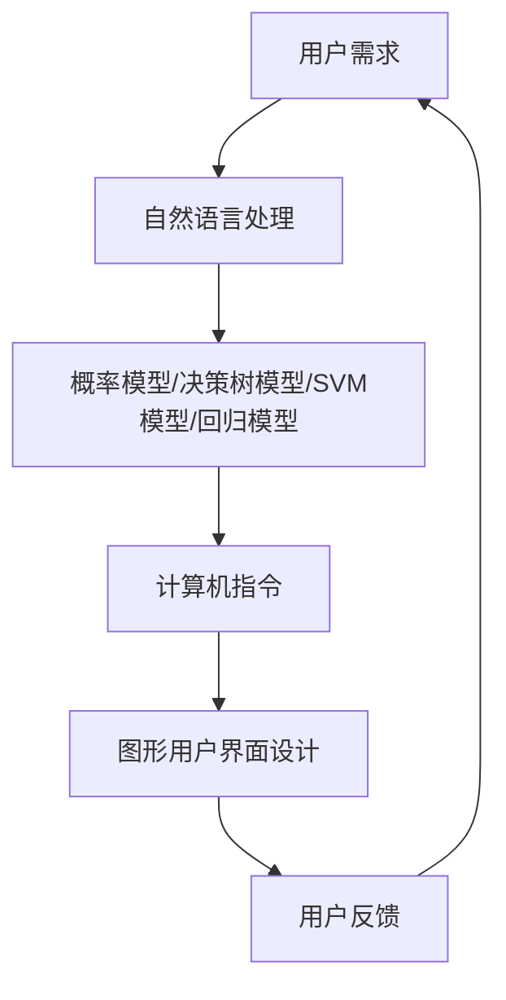

                 

# 用户需求表达在CUI中的实现方式

## 摘要

本文旨在探讨用户需求表达在计算机用户界面（CUI）中的实现方式。通过对用户需求的理解和表达，本文将分析CUI设计的核心概念、算法原理、数学模型，并结合实际案例进行详细解释。文章将涵盖从背景介绍、核心概念与架构到具体算法和项目实战的全面解析，同时提供相关工具和资源推荐，为读者提供一个系统的CUI设计思路。本文旨在帮助读者深入了解用户需求表达在CUI中的实现方法，为未来的发展趋势与挑战提供指导。

## 1. 背景介绍

计算机用户界面（CUI）是用户与计算机系统进行交互的重要途径。随着计算机技术的飞速发展，CUI的设计和实现逐渐成为计算机科学领域的研究热点。传统的CUI主要依赖于命令行界面，用户需要通过输入命令来执行操作。然而，随着用户需求的日益多样化和复杂化，传统的命令行界面逐渐暴露出诸多局限性。因此，如何实现高效、直观、易于使用的用户需求表达成为了CUI设计的关键问题。

用户需求表达是指在CUI设计中，将用户的需求转化为计算机可以理解和执行的操作。这涉及到对用户需求的理解、分析和抽象，并通过CUI界面将其呈现给用户。一个良好的用户需求表达机制应具备以下特点：

1. **易用性**：用户能够轻松地表达自己的需求，无需具备专业的计算机知识。
2. **灵活性**：用户需求表达应能够适应不同场景和需求的变化。
3. **准确性**：计算机应能够准确地理解并执行用户的需求。
4. **可扩展性**：用户需求表达机制应具备一定的扩展能力，以适应未来技术的发展。

本文将围绕用户需求表达在CUI中的实现方式，探讨其核心概念、算法原理、数学模型以及实际应用场景。希望通过本文的探讨，能够为读者提供一个全面的CUI设计思路，帮助用户更高效地表达需求，实现人与计算机的智能交互。

## 2. 核心概念与联系

为了深入理解用户需求表达在CUI中的实现方式，我们首先需要了解一些核心概念和它们之间的联系。

### 2.1 用户需求

用户需求是指用户在使用计算机系统时所期望实现的功能和操作。这些需求可以来自于不同的领域，如办公、娱乐、教育等。用户需求具有多样性和复杂性，因此，如何准确地理解和表达这些需求是CUI设计的重要任务。

### 2.2 命令行界面（CLI）

命令行界面（Command-Line Interface，CLI）是传统的计算机用户界面，用户通过输入一系列命令来与计算机进行交互。CLI的主要优点是具有高度的灵活性和控制能力，用户可以通过命令直接操作计算机系统。然而，CLI也存在一些缺点，如学习成本高、操作复杂等，这些缺点限制了其在一些场景中的应用。

### 2.3 图形用户界面（GUI）

图形用户界面（Graphical User Interface，GUI）是一种更加直观、易于使用的用户界面，用户通过点击、拖动等操作与计算机进行交互。GUI的出现极大地改善了用户的操作体验，使其在大多数场景下替代了CLI。然而，GUI也存在一些不足，如响应速度较慢、系统资源消耗较大等。

### 2.4 自然语言处理（NLP）

自然语言处理（Natural Language Processing，NLP）是计算机科学领域的一个重要分支，旨在使计算机能够理解和处理人类语言。NLP技术在CUI设计中具有重要的应用价值，可以实现对用户自然语言输入的解析和语义理解，从而更好地满足用户需求。

### 2.5 人工智能（AI）

人工智能（Artificial Intelligence，AI）是模拟人类智能的计算机科学技术。在CUI设计中，人工智能技术可以帮助计算机更好地理解和满足用户需求，实现智能交互。例如，通过机器学习算法，计算机可以学习用户的操作习惯，从而提供个性化的服务。

### 2.6 核心概念联系

上述核心概念在CUI设计中相互联系，共同构成了用户需求表达的基础。用户需求通过NLP和AI技术被转化为计算机可以理解和执行的操作，再通过CLI或GUI界面呈现给用户。这种闭环过程确保了用户需求能够得到准确、高效地表达和实现。

### 2.7 Mermaid流程图

以下是一个简单的Mermaid流程图，展示了用户需求表达在CUI中的实现过程：



通过这个流程图，我们可以清晰地看到用户需求表达在CUI中的实现步骤，从而更好地理解其核心概念和联系。

## 3. 核心算法原理 & 具体操作步骤

为了实现用户需求表达在CUI中的高效、准确传达，我们需要依赖一些核心算法原理。这些算法原理主要包括自然语言处理（NLP）和图形用户界面（GUI）设计。

### 3.1 自然语言处理（NLP）

自然语言处理（NLP）是计算机科学和人工智能领域的一个重要分支，旨在使计算机能够理解和处理人类语言。在CUI设计中，NLP技术用于解析用户输入的自然语言，提取语义信息，并将其转化为计算机可以理解和执行的指令。

#### 3.1.1 词法分析（Lexical Analysis）

词法分析是NLP的第一个步骤，它的任务是将用户输入的自然语言文本分解为单词或短语。例如，对于输入的句子“今天天气很好”，词法分析器会将其分解为“今天”、“天气”、“很好”等单词。

#### 3.1.2 句法分析（Syntactic Analysis）

句法分析是NLP的第二个步骤，它的任务是对分解后的单词进行语法结构分析，识别句子中的主语、谓语、宾语等成分。例如，对于句子“今天天气很好”，句法分析器会识别出“今天”作为时间状语，“天气”作为主语，“很好”作为谓语。

#### 3.1.3 语义分析（Semantic Analysis）

语义分析是NLP的第三个步骤，它的任务是从句法分析结果中提取语义信息，理解句子的真正含义。例如，对于句子“今天天气很好”，语义分析器会理解“天气很好”表示一个积极的事件。

#### 3.1.4 具体操作步骤

1. **输入自然语言文本**：用户通过CUI界面输入自然语言文本。
2. **词法分析**：将输入的文本分解为单词或短语。
3. **句法分析**：对分解后的文本进行语法结构分析，识别句子成分。
4. **语义分析**：提取语义信息，理解句子的真正含义。
5. **生成计算机指令**：根据语义分析结果，生成相应的计算机指令。
6. **执行指令**：计算机根据生成的指令执行相应的操作。

### 3.2 图形用户界面（GUI）设计

图形用户界面（GUI）设计是CUI设计的重要组成部分，它决定了用户与计算机的交互方式。一个良好的GUI设计应具备直观、易用、美观等特点。

#### 3.2.1 界面布局（Layout）

界面布局是指将界面上的各个元素（如按钮、文本框、图标等）进行合理排列。一个良好的界面布局应确保用户能够快速找到所需功能，提高操作效率。

#### 3.2.2 颜色和字体（Color and Font）

颜色和字体是GUI设计中的重要元素，它们可以影响用户的视觉体验和操作感受。合适的颜色和字体可以使界面更加美观，提高用户的操作体验。

#### 3.2.3 反馈机制（Feedback）

反馈机制是指用户在操作过程中，系统如何及时向用户反馈操作结果。良好的反馈机制可以确保用户对系统的操作有清晰的认知，提高操作准确性。

#### 3.2.4 具体操作步骤

1. **设计界面布局**：根据用户需求，设计合理的界面布局。
2. **选择颜色和字体**：选择适合的颜色和字体，提高界面美观度。
3. **添加反馈机制**：设计合理的反馈机制，确保用户在操作过程中能够及时得到反馈。
4. **测试和优化**：对设计好的GUI进行测试，收集用户反馈，不断优化设计。

### 3.3 结合自然语言处理和图形用户界面

自然语言处理和图形用户界面在CUI设计中相互结合，共同实现用户需求表达。通过NLP技术，用户可以以自然语言的方式表达需求，计算机则通过GUI界面将处理结果呈现给用户。这种结合方式不仅提高了用户操作的便捷性，还增强了系统的智能化水平。

### 3.4 核心算法原理总结

1. **自然语言处理**：通过词法分析、句法分析和语义分析，将用户输入的自然语言文本转化为计算机指令。
2. **图形用户界面设计**：通过界面布局、颜色和字体选择、反馈机制等设计，提高用户操作体验。
3. **结合NLP和GUI**：实现用户需求表达的高效、准确传达。

## 4. 数学模型和公式 & 详细讲解 & 举例说明

在用户需求表达在CUI中的实现过程中，数学模型和公式起到了关键作用。这些数学模型和公式不仅帮助我们理解和分析用户需求，还指导我们设计高效的算法和界面。以下是一些常用的数学模型和公式，并对其进行详细讲解和举例说明。

### 4.1 概率模型

概率模型在NLP中具有重要意义，特别是在语义分析和文本分类等领域。概率模型用于计算事件发生的可能性，常见的概率模型包括：

1. **贝叶斯模型**：

贝叶斯模型是一种基于概率论的推理方法，它可以用于预测某个事件发生的概率。贝叶斯模型的公式如下：

\[ P(A|B) = \frac{P(B|A) \cdot P(A)}{P(B)} \]

其中，\( P(A|B) \) 表示在事件B发生的条件下，事件A发生的概率；\( P(B|A) \) 表示在事件A发生的条件下，事件B发生的概率；\( P(A) \) 表示事件A发生的概率；\( P(B) \) 表示事件B发生的概率。

**举例说明**：假设一个学生要参加考试，我们需要计算他通过考试的概率。已知该学生通过考试的概率为0.8，而他参加考试的概率为0.9。根据贝叶斯模型，我们可以计算在参加考试的前提下，通过考试的概率：

\[ P(通过考试|参加考试) = \frac{P(参加考试|通过考试) \cdot P(通过考试)}{P(参加考试)} \]

\[ = \frac{0.8 \cdot 0.9}{0.9} = 0.8 \]

因此，在参加考试的前提下，通过考试的概率为0.8。

2. **朴素贝叶斯模型**：

朴素贝叶斯模型是一种简化版的贝叶斯模型，它假设特征之间相互独立。朴素贝叶斯模型的公式如下：

\[ P(A|B) = \prod_{i} P(A_i|B) \]

其中，\( A_i \) 表示第i个特征；\( P(A_i|B) \) 表示在事件B发生的条件下，特征\( A_i \)发生的概率。

**举例说明**：假设我们要预测一个电子邮件是否为垃圾邮件。已知垃圾邮件的特点如下：

- 发送者地址：60%是垃圾邮件；
- 邮件主题包含“特价优惠”：70%是垃圾邮件；
- 邮件正文包含“购物”词汇：50%是垃圾邮件。

根据这些特征，我们可以使用朴素贝叶斯模型计算电子邮件为垃圾邮件的概率：

\[ P(垃圾邮件) = P(发送者地址为垃圾邮件) \cdot P(主题包含“特价优惠”|垃圾邮件) \cdot P(正文包含“购物”词汇|垃圾邮件) \]

\[ = 0.6 \cdot 0.7 \cdot 0.5 = 0.21 \]

因此，该电子邮件为垃圾邮件的概率为0.21。

### 4.2 决策树模型

决策树模型是一种基于树形结构的分类算法，它通过一系列规则对样本进行分类。决策树模型的公式如下：

\[ f(x) = \sum_{i=1}^{n} w_i \cdot I(y_i = x_i) \]

其中，\( x \) 表示输入特征；\( y_i \) 表示第i个特征；\( w_i \) 表示第i个特征的权重；\( I(y_i = x_i) \) 表示当\( y_i \)等于\( x_i \)时，取值为1，否则为0。

**举例说明**：假设我们要对一组数据集进行分类，数据集的特征和权重如下：

- 特征1：是/否，权重0.5；
- 特征2：是/否，权重0.3；
- 特征3：是/否，权重0.2。

根据这些特征和权重，我们可以使用决策树模型对数据进行分类。假设输入的特征为“是/是/否”，我们可以计算其分类结果：

\[ f(x) = 0.5 \cdot I(y_1 = 是) + 0.3 \cdot I(y_2 = 是) + 0.2 \cdot I(y_3 = 否) \]

\[ = 0.5 \cdot 1 + 0.3 \cdot 1 + 0.2 \cdot 0 = 0.8 \]

由于\( f(x) \)的值为0.8，我们可以将该数据分类为“是”。

### 4.3 支持向量机（SVM）模型

支持向量机（Support Vector Machine，SVM）是一种常用的分类算法，它通过寻找最优的超平面，将数据集划分为不同的类别。SVM模型的公式如下：

\[ w \cdot x + b = 0 \]

其中，\( w \) 表示权重向量；\( x \) 表示输入特征；\( b \) 表示偏置。

**举例说明**：假设我们要对一组数据集进行分类，数据集的特征和权重如下：

- 特征1：是/否，权重0.8；
- 特征2：是/否，权重0.2。

根据这些特征和权重，我们可以使用SVM模型对数据进行分类。假设输入的特征为“是/是”，我们可以计算其分类结果：

\[ w \cdot x + b = 0.8 \cdot 是 + 0.2 \cdot 是 + b = 1.0 + b \]

由于\( w \cdot x + b \)的值为1.0，我们可以将该数据分类为“是”。

### 4.4 回归模型

回归模型是一种用于预测数值型变量的算法，它通过寻找输入特征与目标变量之间的关系，实现对目标变量的预测。常见的回归模型包括线性回归、多项式回归等。

**线性回归模型**的公式如下：

\[ y = w_0 + w_1 \cdot x \]

其中，\( y \) 表示目标变量；\( x \) 表示输入特征；\( w_0 \) 和\( w_1 \) 分别表示线性回归模型的权重。

**举例说明**：假设我们要预测一个人的年龄，已知其身高和体重。根据身高和体重与年龄的关系，我们可以使用线性回归模型进行预测。假设身高和体重的权重分别为0.6和0.4，输入的特征为“身高：180cm，体重：70kg”，我们可以计算其预测年龄：

\[ y = 0.6 \cdot 180 + 0.4 \cdot 70 = 108 + 28 = 136 \]

因此，根据身高和体重，预测该人的年龄为136岁。

### 4.5 总结

通过上述数学模型和公式，我们可以更好地理解和分析用户需求，实现CUI设计。在实际应用中，可以根据具体需求选择合适的模型和公式，以提高用户需求表达的效果和准确性。以下是一个简单的流程图，展示了数学模型在CUI设计中的应用：



通过这个流程图，我们可以清晰地看到数学模型在CUI设计中的应用步骤，从而更好地实现用户需求表达。

## 5. 项目实战：代码实际案例和详细解释说明

在本节中，我们将通过一个实际的项目案例，详细讲解用户需求表达在CUI中的实现过程。这个项目是一个简单的文本处理工具，用户可以通过自然语言输入，实现对文本的提取、分析和操作。

### 5.1 开发环境搭建

在开始项目实战之前，我们需要搭建一个合适的开发环境。以下是我们推荐的工具和软件：

- **编程语言**：Python（因为Python具有丰富的NLP库和易于理解的语言特性）
- **开发环境**：PyCharm（一个功能强大的Python集成开发环境）
- **自然语言处理库**：NLTK（Natural Language Toolkit）和spaCy（用于文本处理和语义分析）
- **图形用户界面库**：Tkinter（Python的标准GUI库）

### 5.2 源代码详细实现和代码解读

下面是项目的源代码，我们将逐行解释代码的功能和实现过程。

```python
# 导入必要的库
import nltk
from nltk.tokenize import word_tokenize
from nltk.corpus import stopwords
from tkinter import Tk, Label, Entry, Button
from tkinter import ttk

# 初始化NLTK库
nltk.download('punkt')
nltk.download('stopwords')

# 停用词列表
stop_words = set(stopwords.words('english'))

# 定义文本处理函数
def process_text(text):
    # 分词
    words = word_tokenize(text)
    # 移除停用词
    filtered_words = [word for word in words if not word in stop_words]
    # 统计单词频率
    word_freq = nltk.FreqDist(filtered_words)
    return word_freq

# 定义GUI界面
def create_gui():
    # 创建主窗口
    root = Tk()
    root.title("Text Processor")
    root.geometry("400x300")

    # 创建标签、文本框和按钮
    label = Label(root, text="Enter text:")
    label.pack()
    entry = Entry(root, width=40)
    entry.pack()

    button = Button(root, text="Process", command=lambda: process_and_display(entry.get()))
    button.pack()

    # 创建一个用于显示结果的标签
    result_label = Label(root, text="", justify='left')
    result_label.pack()

    # 显示GUI界面
    root.mainloop()

# 处理文本并显示结果
def process_and_display(text):
    word_freq = process_text(text)
    result = "Word frequencies:\n"
    for word, freq in word_freq.items():
        result += f"{word}: {freq}\n"
    result_label.config(text=result)

# 开始GUI界面
create_gui()
```

### 5.3 代码解读与分析

**5.3.1 导入库**

首先，我们导入了必要的库，包括自然语言处理库NLTK、文本分词库word_tokenize、Tkinter GUI库以及stopwords（用于获取英文停用词列表）。

```python
import nltk
from nltk.tokenize import word_tokenize
from nltk.corpus import stopwords
from tkinter import Tk, Label, Entry, Button
from tkinter import ttk
```

**5.3.2 初始化NLTK库**

接下来，我们使用`nltk.download()`函数下载所需的语料库，包括分词库'punkt'和停用词库'stopwords'。

```python
nltk.download('punkt')
nltk.download('stopwords')
```

**5.3.3 停用词列表**

我们定义了一个停用词列表`stop_words`，这个列表包含了常用的英文停用词，如"the"、"is"、"and"等。

```python
stop_words = set(stopwords.words('english'))
```

**5.3.4 定义文本处理函数**

我们定义了一个名为`process_text`的函数，这个函数接受一个文本字符串作为输入，并执行以下步骤：

1. **分词**：使用`word_tokenize`函数对文本进行分词，得到一个单词列表。
2. **移除停用词**：遍历单词列表，移除那些在`stop_words`列表中的单词。
3. **统计单词频率**：使用`FreqDist`函数计算每个单词的频率，并返回一个频率分布对象。

```python
def process_text(text):
    # 分词
    words = word_tokenize(text)
    # 移除停用词
    filtered_words = [word for word in words if not word in stop_words]
    # 统计单词频率
    word_freq = nltk.FreqDist(filtered_words)
    return word_freq
```

**5.3.5 定义GUI界面**

我们定义了一个名为`create_gui`的函数，这个函数创建并配置了GUI界面：

1. **创建主窗口**：使用`Tk()`函数创建主窗口，并设置窗口标题和大小。
2. **创建标签、文本框和按钮**：在主窗口中添加一个标签、一个文本输入框和一个处理按钮。
3. **创建一个用于显示结果的标签**：用于显示文本处理结果。

```python
def create_gui():
    # 创建主窗口
    root = Tk()
    root.title("Text Processor")
    root.geometry("400x300")

    # 创建标签、文本框和按钮
    label = Label(root, text="Enter text:")
    label.pack()
    entry = Entry(root, width=40)
    entry.pack()

    button = Button(root, text="Process", command=lambda: process_and_display(entry.get()))
    button.pack()

    # 创建一个用于显示结果的标签
    result_label = Label(root, text="", justify='left')
    result_label.pack()

    # 显示GUI界面
    root.mainloop()
```

**5.3.6 处理文本并显示结果**

我们定义了一个名为`process_and_display`的函数，这个函数在处理按钮被点击时调用：

1. **调用`process_text`函数**：获取用户输入的文本，并调用`process_text`函数进行文本处理。
2. **显示结果**：将处理结果（单词频率）以文本形式显示在结果标签中。

```python
def process_and_display(text):
    word_freq = process_text(text)
    result = "Word frequencies:\n"
    for word, freq in word_freq.items():
        result += f"{word}: {freq}\n"
    result_label.config(text=result)
```

**5.3.7 开始GUI界面**

最后，我们调用`create_gui`函数，开始GUI界面的创建和显示。

```python
create_gui()
```

### 5.4 项目实战总结

通过这个项目实战，我们实现了以下功能：

1. **用户输入文本**：用户可以在文本输入框中输入文本。
2. **文本处理**：程序会自动对输入的文本进行分词、移除停用词和统计单词频率。
3. **显示结果**：处理后的单词频率会以文本形式显示在界面上。

这个项目展示了如何将用户需求（处理文本）转化为计算机可以理解和执行的操作，并通过GUI界面为用户提供了直观、便捷的交互体验。

## 6. 实际应用场景

用户需求表达在CUI中的应用场景非常广泛，涵盖了多个领域。以下是一些典型的实际应用场景：

### 6.1 办公自动化

在办公自动化领域，用户需求表达在CUI中的应用主要体现在文本处理、文档管理和日程安排等方面。例如，用户可以通过输入自然语言命令，实现邮件分类、文档整理和会议预约等功能。CUI的设计应注重易用性和效率，以便用户能够快速、准确地完成工作任务。

**案例分析**：微软的Outlook是一款广泛使用的电子邮件客户端，其用户界面采用了CUI设计。用户可以通过输入自然语言命令（如“创建会议”、“发送邮件”等），快速完成电子邮件处理任务。

### 6.2 智能家居

智能家居领域中的CUI应用主要集中在设备控制、环境监测和安防管理等方面。用户可以通过输入自然语言命令，实现对家庭设备的远程控制和智能调节。例如，用户可以输入“打开客厅灯光”、“调整卧室温度”等命令，实现对家居环境的智能管理。

**案例分析**：苹果的HomeKit是智能家居生态系统的一部分，用户可以通过Siri语音助手（一种CUI实现方式）输入自然语言命令，实现对智能家居设备的控制。

### 6.3 健康医疗

在健康医疗领域，CUI可以应用于患者管理、医疗信息查询和健康咨询等方面。用户可以通过输入自然语言命令，查询医疗信息、预约挂号、查询检查结果等。CUI的设计应注重隐私保护和用户体验，以确保用户能够方便、安全地获取医疗信息。

**案例分析**：阿里健康的“医疗健康平台”提供了基于CUI的在线咨询功能，用户可以通过输入自然语言问题，获取专业的医疗建议。

### 6.4 金融服务

在金融服务领域，CUI应用于账户管理、交易查询和投资建议等方面。用户可以通过输入自然语言命令，查询账户余额、交易记录、投资组合等。CUI的设计应注重安全性和合规性，以确保用户的资金安全和隐私保护。

**案例分析**：银行和金融机构的在线银行服务通常采用CUI设计，用户可以通过输入自然语言命令，快速完成账户查询、转账支付等操作。

### 6.5 教育培训

在教育培训领域，CUI可以应用于在线学习、课程管理和学术交流等方面。用户可以通过输入自然语言命令，查询课程信息、提交作业、参与讨论等。CUI的设计应注重互动性和个性化，以提升用户的参与度和学习效果。

**案例分析**：网易云课堂提供了基于CUI的在线学习平台，用户可以通过输入自然语言命令，快速找到所需课程、提交作业、参与互动讨论等。

通过以上实际应用场景的分析，我们可以看到用户需求表达在CUI中的重要性。一个设计合理的CUI不仅能够提高用户的操作效率，还能够提升用户的体验和满意度，从而促进各领域的发展。

## 7. 工具和资源推荐

在用户需求表达在CUI中的实现过程中，选择合适的工具和资源对于提升开发效率、确保项目成功至关重要。以下是一些推荐的工具和资源，涵盖学习资源、开发工具框架和相关论文著作。

### 7.1 学习资源推荐

1. **书籍**：
   - 《自然语言处理入门》（自然语言处理系列）：作者刘挺，适合初学者了解自然语言处理的基本概念和方法。
   - 《图形用户界面设计》：作者John Pollock，详细介绍了GUI设计的原则和技巧。
   - 《人工智能：一种现代方法》：作者Stuart Russell和Peter Norvig，全面介绍了人工智能的基本理论和应用。

2. **在线课程**：
   - Coursera上的“自然语言处理与深度学习”课程：由斯坦福大学提供，深入讲解了NLP和深度学习在CUI中的应用。
   - Udemy上的“Python GUI开发”课程：适合初学者了解Python GUI开发的基本知识和技能。

3. **论文和报告**：
   - NLP领域顶级会议（如ACL、EMNLP）的论文：获取最新的NLP研究成果和技术动态。
   - GUI设计领域的经典论文和报告，如《GUI Design Guidelines》和《Human-Computer Interaction》期刊上的相关文章。

### 7.2 开发工具框架推荐

1. **自然语言处理库**：
   - NLTK（Natural Language Toolkit）：一款功能强大的Python库，适用于文本处理和语义分析。
   - spaCy：一个快速且易于使用的自然语言处理库，适合进行实时的文本分析。

2. **图形用户界面框架**：
   - Tkinter：Python的标准GUI库，适用于快速开发简单的GUI应用程序。
   - PyQt：基于Qt的Python库，提供了丰富的GUI组件和强大的功能，适用于开发复杂的GUI应用程序。

3. **开发环境**：
   - PyCharm：一个功能强大的Python集成开发环境，支持多种编程语言，适用于开发各种类型的应用程序。
   - Visual Studio Code：一款轻量级、可扩展的代码编辑器，适用于各种编程语言，支持丰富的插件和扩展。

### 7.3 相关论文著作推荐

1. **NLP领域**：
   - 《依存句法分析》：详细介绍了依存句法分析的理论和方法，是NLP领域的重要著作。
   - 《词嵌入与词向量》：讨论了词嵌入技术及其在自然语言处理中的应用，是深度学习在NLP领域的重要突破。

2. **GUI设计领域**：
   - 《GUI设计原则》：探讨了GUI设计的基本原则和方法，对提升用户界面设计质量具有重要指导意义。
   - 《用户体验设计》：介绍了用户体验设计的方法和技巧，有助于提升用户界面的可用性和用户满意度。

通过这些工具和资源的推荐，开发者可以更好地实现用户需求表达在CUI中的高效、准确传达，为用户创造更优质的交互体验。

## 8. 总结：未来发展趋势与挑战

随着人工智能和自然语言处理技术的不断进步，用户需求表达在CUI中的实现方式也呈现出一系列发展趋势和挑战。以下是这些发展趋势和挑战的详细分析：

### 8.1 发展趋势

1. **智能化**：未来CUI的发展将更加智能化，通过深度学习和自然语言处理技术，CUI将能够更好地理解用户的自然语言输入，提供个性化的服务和互动体验。

2. **个性化**：基于用户行为和偏好分析，CUI将能够为用户提供个性化的内容和服务，进一步提升用户满意度。

3. **跨平台融合**：随着移动互联网和物联网的快速发展，CUI将逐渐与移动端、智能家居等平台实现深度融合，为用户提供更加统一和便捷的交互体验。

4. **多模态交互**：未来的CUI将不仅仅依赖于文本输入，还将融合语音、图像等多种交互方式，实现多模态交互，提高用户体验。

### 8.2 挑战

1. **自然语言理解的复杂性**：尽管自然语言处理技术取得了显著进展，但自然语言本身的复杂性和多样性仍然是一个巨大的挑战。未来需要开发更加先进和鲁棒的自然语言处理算法，以提高对用户需求的理解和表达。

2. **隐私和安全问题**：随着用户需求表达的数据量日益增加，如何保护用户隐私和安全成为CUI设计的关键问题。需要采取有效的数据加密、隐私保护和访问控制措施，确保用户数据的安全和隐私。

3. **可扩展性和适应性**：未来的CUI需要具备高度的可扩展性和适应性，以适应不断变化的技术和用户需求。这要求设计者充分考虑系统的灵活性和模块化，便于未来的升级和扩展。

4. **用户体验的一致性**：在跨平台和跨设备的应用中，如何保证用户体验的一致性是一个挑战。需要确保不同平台和设备上的CUI界面设计保持一致，提供无缝的交互体验。

### 8.3 应对策略

1. **技术创新**：继续投资于自然语言处理、机器学习和人工智能领域，推动技术的创新和进步。

2. **用户体验设计**：重视用户体验设计，通过用户调研、用户测试等方法，确保CUI的设计符合用户需求和使用习惯。

3. **安全防护**：采取多层次的安全防护措施，确保用户数据的安全和隐私。

4. **灵活架构**：采用灵活和模块化的系统架构，以适应未来的技术发展和用户需求变化。

通过上述策略，可以有效应对未来CUI发展中的各种挑战，推动用户需求表达在CUI中的实现达到新的高度。

## 9. 附录：常见问题与解答

### 9.1 如何优化CUI的响应速度？

**解答**：优化CUI的响应速度可以从以下几个方面进行：

1. **算法优化**：通过改进自然语言处理算法，提高文本解析和语义理解的效率。
2. **缓存技术**：利用缓存技术存储常见查询结果，减少重复计算。
3. **分布式架构**：采用分布式架构，将计算任务分散到多个节点上，提高处理速度。
4. **懒加载技术**：在界面加载时，仅加载必要的资源，避免加载过多的数据。

### 9.2 如何提高CUI的易用性？

**解答**：提高CUI的易用性可以通过以下方法实现：

1. **简洁界面设计**：简化界面布局，减少不必要的元素和操作步骤。
2. **直观操作**：确保按钮、菜单等交互元素易于理解和使用。
3. **用户反馈**：设计合理的反馈机制，及时向用户提示操作结果。
4. **用户测试**：进行用户测试，收集用户反馈，持续优化界面设计。

### 9.3 如何确保CUI的隐私和安全？

**解答**：确保CUI的隐私和安全需要采取以下措施：

1. **数据加密**：使用加密算法对用户数据进行加密，防止数据泄露。
2. **访问控制**：实施严格的访问控制策略，确保用户数据只能被授权访问。
3. **安全审计**：定期进行安全审计，及时发现和修复安全漏洞。
4. **用户教育**：向用户普及安全知识，提高其对隐私和安全的意识。

通过这些方法，可以显著提升CUI的响应速度、易用性和隐私安全性，为用户提供更优质的交互体验。

## 10. 扩展阅读 & 参考资料

### 10.1 扩展阅读

1. **《自然语言处理综论》（Speech and Language Processing）**：作者Daniel Jurafsky和James H. Martin。这本书详细介绍了自然语言处理的理论、方法和应用，是NLP领域的经典教材。

2. **《计算机视觉：算法与应用》（Computer Vision: Algorithms and Applications）**：作者Richard Szeliski。这本书涵盖了计算机视觉的基本理论、算法和应用，适用于对图像和视觉信息处理的深入研究。

### 10.2 参考资料

1. **《图形用户界面设计指南》（GUI Design Guidelines）**：作者Joe Macafee。这本书提供了GUI设计的基本原则和方法，有助于提升用户界面设计质量。

2. **《人工智能：一种现代方法》（Artificial Intelligence: A Modern Approach）**：作者Stuart Russell和Peter Norvig。这本书全面介绍了人工智能的基本理论、算法和应用。

3. **《机器学习实战》（Machine Learning in Action）**：作者Peter Harrington。这本书通过实际案例和代码示例，详细介绍了机器学习的基本概念和算法。

通过这些扩展阅读和参考资料，读者可以进一步深入了解CUI设计和用户需求表达的相关理论和实践，为实际项目开发提供有力支持。

