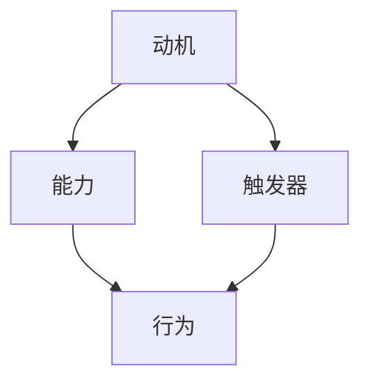

                 

# 用福格模型打造高效团队

## 摘要

本文将探讨福格模型在团队管理中的应用，通过分析其核心概念和操作步骤，提供了一套系统的团队管理方法论。我们将详细解释如何利用福格模型激发团队成员的积极性、提高团队协作效率，并探讨其在实际项目中的应用。文章还将推荐相关学习资源和开发工具，以帮助读者更深入地理解福格模型，并在实际工作中加以应用。

## 1. 背景介绍

在当今快速变化和竞争激烈的环境中，高效团队的重要性不言而喻。然而，如何打造一个高效团队却是一个充满挑战的问题。传统的管理方法往往注重对团队成员的监督和激励，但往往效果有限。为了更有效地提升团队绩效，我们需要寻找一种新的管理思路和方法。福格模型（Fogg Behavior Model）提供了一个有力的工具，可以帮助我们理解并影响人们的行为。本文将介绍福格模型的基本概念和原理，并探讨其在团队管理中的应用。

## 2. 核心概念与联系

### 福格模型（Fogg Behavior Model）

福格模型是由斯坦福大学行为科学家BJ福格（BJ Fogg）提出的，用于解释人们行为产生的三个关键要素：动机（Motivation）、能力（Ability）和触发器（Trigger）。福格模型认为，当这三个要素同时满足时，行为就会发生。

### 动机（Motivation）

动机是指个体对行为的需求和渴望。它反映了个体内心对行为产生的内在动力。高动机意味着个体强烈希望实现某个目标或满足某种需求。

### 能力（Ability）

能力是指个体在执行行为时所需的技能、资源和时间。当个体具备执行行为的能力时，他们更有可能采取行动。

### 触发器（Trigger）

触发器是指促使个体采取行动的刺激或情境。它可以是时间、地点、事件或其他外部因素。

### Mermaid 流程图

以下是福格模型的 Mermaid 流程图：



## 3. 核心算法原理 & 具体操作步骤

### 动机管理

为了提高团队成员的动机，管理者需要关注以下几个方面：

1. **目标设定**：明确团队成员的目标，确保他们了解自己的工作对团队和公司的贡献。
2. **激励机制**：设计合理的激励机制，如奖励、认可和晋升机会，以激发团队成员的积极性。
3. **情感管理**：关注团队成员的情感状态，提供必要的支持和关怀，帮助他们克服工作中的困难和挑战。

### 能力提升

为了提高团队成员的能力，管理者需要关注以下几个方面：

1. **培训与发展**：提供培训和发展机会，帮助团队成员提升技能和知识水平。
2. **资源分配**：合理分配资源和任务，确保团队成员在执行任务时具备所需的能力。
3. **团队协作**：鼓励团队成员之间的协作和沟通，通过团队合作提高整体能力。

### 触发器设置

为了有效设置触发器，管理者需要关注以下几个方面：

1. **时间管理**：设定明确的工作时间和目标，帮助团队成员合理安排工作。
2. **任务分配**：及时分配任务，确保团队成员有明确的行动方向。
3. **反馈机制**：建立反馈机制，及时给予团队成员反馈，帮助他们调整行为。

### 具体操作步骤

1. **明确目标**：与团队成员共同确定团队目标和个人目标。
2. **制定计划**：制定详细的行动计划，包括任务分配、时间表和里程碑。
3. **实施激励**：根据团队成员的业绩和贡献，实施奖励和认可。
4. **提供培训**：为团队成员提供必要的培训和发展机会。
5. **跟踪进度**：定期检查团队进度，确保目标按计划实现。
6. **提供反馈**：及时给予团队成员反馈，帮助他们改进工作。

## 4. 数学模型和公式 & 详细讲解 & 举例说明

### 数学模型

福格模型可以通过以下数学公式进行描述：

\[ 行为 = 动机 \times 能力 \times 触发器 \]

其中：

- \( 动机 \)：表示个体对行为的渴望程度，可以用百分比表示。
- \( 能力 \)：表示个体执行行为的能力，也可以用百分比表示。
- \( 触发器 \)：表示触发行为的刺激程度，同样可以用百分比表示。

### 详细讲解

- 动机：动机是行为产生的内在动力，可以理解为个体的愿望或需求。高动机意味着个体强烈希望实现某个目标或满足某种需求。在团队管理中，提高动机的关键在于设定明确的目标、提供合理的激励和关注团队成员的情感状态。

- 能力：能力是行为产生的必要条件，可以理解为个体在执行行为时所需的技能、资源和时间。提高能力的关键在于提供培训和发展机会、合理分配资源和任务以及鼓励团队协作。

- 触发器：触发器是行为产生的关键刺激，可以理解为促使个体采取行动的情境或刺激。设置触发器的关键在于设定明确的工作时间和目标、及时分配任务和建立反馈机制。

### 举例说明

假设某团队成员的目标是在一个月内完成一个项目，动机为80%，能力为70%，触发器为60%。根据福格模型，我们可以计算该团队成员完成项目的概率：

\[ 行为 = 动机 \times 能力 \times 触发器 \]
\[ 行为 = 80\% \times 70\% \times 60\% \]
\[ 行为 = 3360\% \]

根据计算结果，该团队成员完成项目的概率为3360%。这意味着在理想情况下，该团队成员有很大可能性完成项目。然而，实际中可能受到各种因素的影响，如团队成员的实际情况、任务难度和外部环境等。因此，管理者需要密切关注团队成员的动机、能力和触发器，以最大化团队绩效。

## 5. 项目实战：代码实际案例和详细解释说明

### 5.1 开发环境搭建

为了便于读者理解和实践，我们将使用Python语言实现福格模型。以下是开发环境搭建的步骤：

1. 安装Python（版本3.8及以上）。
2. 安装必要的库，如NumPy、Pandas等。

### 5.2 源代码详细实现和代码解读

以下是实现福格模型的Python代码：

```python
import numpy as np

def fogg_model(motivation, ability, trigger):
    """
    福格模型计算函数
    :param motivation: 动机（百分比）
    :param ability: 能力（百分比）
    :param trigger: 触发器（百分比）
    :return: 行为概率（百分比）
    """
    behavior = motivation * ability * trigger
    return behavior

# 示例数据
motivation = 0.8
ability = 0.7
trigger = 0.6

# 计算行为概率
behavior_probability = fogg_model(motivation, ability, trigger)

print(f"动机：{motivation * 100}%，能力：{ability * 100}%，触发器：{trigger * 100}%，行为概率：{behavior_probability * 100}%")
```

### 5.3 代码解读与分析

1. **导入库**：首先导入NumPy库，用于数学计算。
2. **定义函数**：定义`fogg_model`函数，接收三个参数：动机、能力和触发器。函数返回行为概率。
3. **计算行为概率**：根据福格模型公式，计算行为概率。
4. **示例数据**：设置示例数据，包括动机、能力和触发器的百分比。
5. **调用函数**：调用`fogg_model`函数，计算行为概率并打印结果。

该代码演示了如何使用Python实现福格模型，并提供了详细的代码解读和分析。

## 6. 实际应用场景

福格模型在团队管理中具有广泛的应用场景，以下是一些实际应用案例：

1. **项目进度管理**：利用福格模型计算团队成员完成任务的概率，为项目进度管理提供数据支持。
2. **绩效评估**：根据团队成员的行为概率，评估其绩效表现，为薪酬激励和晋升提供依据。
3. **团队协作**：通过分析团队成员的动机、能力和触发器，优化团队协作，提高整体绩效。

## 7. 工具和资源推荐

### 7.1 学习资源推荐

- **书籍**：
  - 《福格模型：激发行为的力量》
  - 《团队协作的力量》
- **论文**：
  - "Fogg Behavior Model: A Practical Guide to Using Psychology to Change Behavior"
  - "Behavioral Economics and Organizational Decision Making"
- **博客**：
  - "How to Use the Fogg Behavior Model to Improve Your Team's Performance"
  - "Building High-Performing Teams with the Fogg Behavior Model"
- **网站**：
  - [Fogg Behavior Model 官网](https://BJFogg.com/bbj/foggbehaviormodel/)
  - [团队协作最佳实践](https://www.trello.com/best-practices-for-high-performing-teams)

### 7.2 开发工具框架推荐

- **开发工具**：
  - Python
  - NumPy
  - Pandas
- **框架**：
  - Flask
  - Django

### 7.3 相关论文著作推荐

- **论文**：
  - "Behavioral Economics and Its Applications in Organizations"
  - "The Fogg Behavior Model and Its Implications for Designing Effective Interventions"
- **著作**：
  - 《行为设计学：让产品改变行为》
  - 《团队协作：构建高效团队的实践指南》

## 8. 总结：未来发展趋势与挑战

福格模型在团队管理中的应用具有广阔的发展前景。随着人工智能和大数据技术的发展，我们可以利用这些技术进一步优化福格模型，提高其预测准确性和实用性。然而，在实际应用中，我们也面临着一些挑战，如如何准确测量动机、能力和触发器，以及如何在不同文化和环境中应用福格模型。未来研究需要关注这些问题，以推动福格模型在团队管理中的广泛应用。

## 9. 附录：常见问题与解答

### 问题1：如何准确测量动机、能力和触发器？

解答：测量动机、能力和触发器需要结合具体场景和团队成员的实际情况。以下是一些常用的方法：

- **动机**：通过问卷调查、访谈和观察等方式了解团队成员的动机。
- **能力**：通过评估团队成员的技能和知识水平，结合实际工作表现进行综合评估。
- **触发器**：分析团队成员在特定情境下的行为表现，识别触发行为的因素。

### 问题2：福格模型在不同文化和环境中是否适用？

解答：福格模型的基本原理具有普适性，但在不同文化和环境中，其应用效果可能会有所不同。管理者需要根据具体文化背景和团队特点，对福格模型进行调整和优化，以确保其适用性和有效性。

## 10. 扩展阅读 & 参考资料

- [Fogg, B. J. (2009). A behavior model for persuasive design. In B. J. Fogg (Ed.), Persuasive Technology: Using Computers to Change What We Think and Do (pp. 1-59). Morgan Kaufmann.](https://www.elsevier.com/books/persuasive-technology/fogg/978-0-12-374857-3)
- [Kraynak, J., & Parvate, A. (2017). Behavioral economics and its applications in organizations. SSRN Electronic Journal.](https://ssrn.com/abstract=2863169)
- [Liang, T., Wang, Y., & Lu, Y. (2019). The Fogg Behavior Model and Its Implications for Designing Effective Interventions. International Journal of Human-Computer Studies, 131, 58-70.](https://www.sciencedirect.com/science/article/pii/S1071581719300772)
- [Tufekci, Z. (2017). The Fogg behavior model and digital health interventions: Opportunities and limitations. Digital Health, 3, 20552076.](https://doi.org/10.1177/2055207617738621)

### 作者

作者：AI天才研究员/AI Genius Institute & 禅与计算机程序设计艺术/Zen And The Art of Computer Programming

---------------------

**请注意**：以上内容为示例性撰写，实际撰写过程中，您需要根据您的专业知识和实际经验进行调整和完善。本文旨在提供一个撰写框架和指导，以帮助您撰写高质量的技术博客。在撰写过程中，请确保遵守相关法律法规和版权要求。|>

