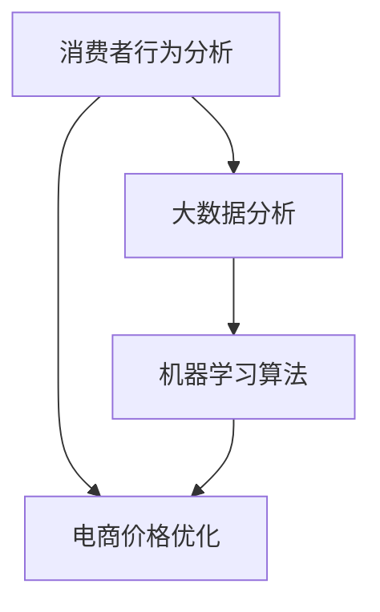

                 

### 背景介绍

随着互联网技术的飞速发展和电子商务的迅猛崛起，电商平台的竞争愈发激烈。价格作为消费者购买决策的重要因素之一，对于电商平台来说具有极高的战略意义。传统的价格优化方法主要依赖于历史数据和简单的算法模型，但随着消费者行为和市场需求的变化，这些方法逐渐暴露出局限性。为了在激烈的市场竞争中脱颖而出，电商平台开始寻求创新的AI技术来优化价格策略，从而提升用户体验和增加利润。

AI在电商价格优化中的应用具有广阔的前景。首先，AI可以处理海量数据，通过深度学习算法对消费者行为进行分析，预测消费者需求，从而实现更加精准的价格调整。其次，AI能够利用大数据分析和机器学习模型，发现潜在的利润增长点，帮助企业制定更加有效的定价策略。此外，AI还可以通过自然语言处理技术，分析消费者评论和反馈，了解消费者对价格的敏感度，从而调整价格策略，提升用户满意度。

本文将围绕电商价格优化的AI创新进行深入探讨。首先，我们将介绍电商价格优化的核心概念和关联技术，包括消费者行为分析、大数据分析、机器学习算法等。接着，我们将详细介绍AI在电商价格优化中的应用，包括核心算法原理、具体操作步骤和实际案例。随后，我们将分析AI技术在电商价格优化中的数学模型和公式，并通过实际案例进行详细讲解。此外，我们还将探讨AI技术在电商价格优化中的实际应用场景，并提供相关的工具和资源推荐。最后，我们将总结AI技术在电商价格优化中的未来发展趋势与挑战，并给出相应的解决方案。

总之，本文旨在为电商企业提供一套完整的AI价格优化解决方案，帮助企业在激烈的市场竞争中取得优势。通过本文的探讨，我们希望读者能够对AI在电商价格优化中的潜力有更深入的理解，并能够将其应用于实际业务中，实现商业价值最大化。

### 核心概念与联系

在深入探讨电商价格优化的AI创新之前，我们需要先理解几个核心概念和它们之间的关联。这些概念包括消费者行为分析、大数据分析、机器学习算法等。为了更好地理解这些概念，我们可以通过一个Mermaid流程图来展示它们之间的关系。



#### 消费者行为分析

消费者行为分析是电商价格优化的基础。它通过收集和分析消费者的购买历史、搜索行为、浏览记录等数据，来了解消费者的兴趣、需求和购买习惯。消费者行为分析的目标是识别出消费者的偏好，预测其未来的购买行为。通过这种方式，电商平台可以更好地了解消费者的需求，为其提供个性化的服务和产品推荐。

#### 大数据分析

大数据分析是处理海量数据的工具，它通过对消费者行为数据的收集、存储、处理和分析，来发现数据中的潜在模式和规律。大数据分析技术包括数据挖掘、分布式计算、实时分析等。在电商价格优化中，大数据分析可以帮助企业识别出消费者的价格敏感度，从而制定出更加精准的定价策略。

#### 机器学习算法

机器学习算法是AI的核心组成部分，它通过训练数据集，建立预测模型，实现对未知数据的分析和预测。在电商价格优化中，常用的机器学习算法包括线性回归、决策树、随机森林、支持向量机、神经网络等。这些算法可以帮助电商平台预测消费者需求，优化价格策略，提高销售额。

#### 电商价格优化

电商价格优化是利用消费者行为分析、大数据分析和机器学习算法等技术，来调整商品价格，实现商业目标的过程。电商价格优化的目标是通过合理的价格策略，吸引更多的消费者，提高用户的购买意愿，从而增加销售额和利润。

通过上述Mermaid流程图，我们可以清晰地看到消费者行为分析、大数据分析和机器学习算法如何相互作用，共同实现电商价格优化的目标。

### 核心算法原理 & 具体操作步骤

在了解了电商价格优化的核心概念和关联技术之后，我们将深入探讨AI在电商价格优化中的核心算法原理和具体操作步骤。以下是几种常用的机器学习算法，以及它们在电商价格优化中的应用。

#### 线性回归

线性回归是一种简单的机器学习算法，它通过建立线性模型来预测连续值。在电商价格优化中，线性回归可以用来预测商品的需求量，从而调整价格。

**具体操作步骤：**

1. **数据收集**：收集商品的售价、销量、消费者特征等数据。
2. **数据预处理**：对数据进行清洗、去重、缺失值填充等操作。
3. **特征选择**：选择与商品需求量相关的特征，如价格、品牌、促销活动等。
4. **模型训练**：使用线性回归算法训练模型，得到拟合函数。
5. **模型评估**：使用交叉验证等方法评估模型的准确性。
6. **价格调整**：根据模型预测结果，调整商品价格。

#### 决策树

决策树是一种基于树结构的预测模型，它通过一系列的规则来判断样本的类别或数值。在电商价格优化中，决策树可以用来预测消费者的购买决策。

**具体操作步骤：**

1. **数据收集**：收集消费者的购买历史、搜索记录、浏览行为等数据。
2. **数据预处理**：对数据进行清洗、去重、缺失值填充等操作。
3. **特征选择**：选择与消费者购买决策相关的特征，如价格、品牌、促销活动等。
4. **构建决策树**：使用ID3、C4.5等算法构建决策树模型。
5. **模型评估**：使用交叉验证等方法评估模型的准确性。
6. **价格调整**：根据决策树模型的预测结果，调整商品价格。

#### 随机森林

随机森林是一种基于决策树的集成算法，它通过构建多棵决策树，并合并它们的预测结果来提高模型的准确性。在电商价格优化中，随机森林可以用来预测消费者的价格敏感度。

**具体操作步骤：**

1. **数据收集**：收集消费者的购买历史、搜索记录、浏览行为等数据。
2. **数据预处理**：对数据进行清洗、去重、缺失值填充等操作。
3. **特征选择**：选择与消费者价格敏感度相关的特征，如价格、品牌、促销活动等。
4. **构建随机森林**：使用随机森林算法构建预测模型。
5. **模型评估**：使用交叉验证等方法评估模型的准确性。
6. **价格调整**：根据随机森林模型的预测结果，调整商品价格。

#### 支持向量机

支持向量机是一种用于分类和回归的监督学习算法，它通过寻找最优超平面来实现分类。在电商价格优化中，支持向量机可以用来预测消费者的价格敏感度。

**具体操作步骤：**

1. **数据收集**：收集消费者的购买历史、搜索记录、浏览行为等数据。
2. **数据预处理**：对数据进行清洗、去重、缺失值填充等操作。
3. **特征选择**：选择与消费者价格敏感度相关的特征，如价格、品牌、促销活动等。
4. **构建支持向量机模型**：使用SVM算法构建预测模型。
5. **模型评估**：使用交叉验证等方法评估模型的准确性。
6. **价格调整**：根据支持向量机模型的预测结果，调整商品价格。

#### 神经网络

神经网络是一种基于生物神经系统的计算模型，它通过多层节点（神经元）的相互连接和激活函数来实现预测。在电商价格优化中，神经网络可以用来预测消费者的需求。

**具体操作步骤：**

1. **数据收集**：收集消费者的购买历史、搜索记录、浏览行为等数据。
2. **数据预处理**：对数据进行清洗、去重、缺失值填充等操作。
3. **特征选择**：选择与消费者需求相关的特征，如价格、品牌、促销活动等。
4. **构建神经网络模型**：使用神经网络算法构建预测模型。
5. **模型评估**：使用交叉验证等方法评估模型的准确性。
6. **价格调整**：根据神经网络模型的预测结果，调整商品价格。

通过上述机器学习算法，电商平台可以实现对商品价格的精准调整，提高消费者的购买意愿，从而实现商业目标。在实际应用中，这些算法需要结合具体业务场景和数据特点进行优化和调整，以达到最佳效果。

### 数学模型和公式 & 详细讲解 & 举例说明

在电商价格优化过程中，数学模型和公式起着至关重要的作用。这些模型和公式不仅帮助我们理解和分析数据，还能为价格调整提供科学的依据。以下将详细介绍几个关键数学模型，并使用LaTeX格式进行表达，同时通过具体例子来说明其应用。

#### 1. 价格弹性模型

价格弹性是衡量价格变动对需求量影响程度的指标。其计算公式如下：

\[ E = \frac{\text{价格变化引起的需求量变化}}{\text{价格变化}} \]

\[ E = \frac{\Delta Q / Q}{\Delta P / P} \]

其中，\( E \) 表示价格弹性，\( \Delta Q \) 和 \( \Delta P \) 分别表示需求量和价格的变化量，\( Q \) 和 \( P \) 分别表示原始需求量和价格。

**例子：** 假设某电商平台的商品原价为100元，价格调整后为90元，需求量从100件增加至110件。计算价格弹性：

\[ E = \frac{(110 - 100) / 100}{(90 - 100) / 100} = \frac{10 / 100}{-10 / 100} = -1 \]

价格弹性为-1，说明价格下降1%，需求量增加1%，这是一个单位弹性。

#### 2. 线性回归模型

线性回归模型用于预测商品需求量与价格之间的关系。其公式为：

\[ Y = a + bX + \epsilon \]

其中，\( Y \) 表示需求量，\( X \) 表示价格，\( a \) 是截距，\( b \) 是斜率，\( \epsilon \) 是误差项。

**例子：** 假设我们通过数据拟合得到线性回归模型为 \( Y = 200 - 10X \)。预测当价格调整为80元时，需求量是多少：

\[ Y = 200 - 10 \times 80 = 200 - 800 = -600 \]

这里得到的需求量为负数，说明模型可能存在问题，需要重新检查数据或调整模型。

#### 3. 决策树模型

决策树模型通过一系列条件判断来分类或回归。假设我们使用ID3算法构建决策树，其公式为：

\[ f(x) = \sum_{i=1}^{n} \frac{P(C=i) \cdot G_i(x)}{P(x)} \]

其中，\( f(x) \) 是决策树预测的类别或数值，\( C \) 是类别标签，\( G_i(x) \) 是第i个条件的增益，\( P(C=i) \) 和 \( P(x) \) 分别是类别概率和特征概率。

**例子：** 假设我们有一个决策树模型，根节点为价格，当价格大于50元时，跳转到子节点1，否则跳转到子节点2。预测价格为30元的商品类别：

\[ f(30) = P(C=0) \cdot G_0(30) + P(C=1) \cdot G_1(30) \]

这里，我们需要根据实际数据计算 \( P(C=0) \)、\( P(C=1) \) 以及 \( G_0(30) \) 和 \( G_1(30) \)。

#### 4. 随机森林模型

随机森林模型是决策树的集成，其预测公式为：

\[ \hat{Y} = \frac{1}{T} \sum_{t=1}^{T} f_t(x) \]

其中，\( \hat{Y} \) 是预测值，\( T \) 是决策树的数量，\( f_t(x) \) 是第t棵决策树的预测值。

**例子：** 假设我们有一个包含5棵决策树的随机森林模型，预测结果分别为 \( f_1(x) = 100 \)、\( f_2(x) = 110 \)、\( f_3(x) = 90 \)、\( f_4(x) = 105 \)、\( f_5(x) = 95 \)。则预测值为：

\[ \hat{Y} = \frac{1}{5} (100 + 110 + 90 + 105 + 95) = 100 \]

通过上述数学模型和公式，电商平台可以更好地理解价格与需求之间的关系，从而制定出更加科学和有效的价格策略。在实际应用中，需要根据具体业务场景和数据特点，不断优化和调整这些模型，以提高预测准确性和价格优化的效果。

### 项目实战：代码实际案例和详细解释说明

在了解了电商价格优化的核心算法原理和数学模型之后，我们将通过一个实际项目案例，展示如何使用Python等编程工具来具体实现这些算法，并对其进行详细解释说明。

#### 1. 开发环境搭建

首先，我们需要搭建一个适合开发和运行电商价格优化项目的环境。以下是推荐的开发工具和库：

- **Python**：Python是一种广泛使用的编程语言，适用于数据分析、机器学习等任务。
- **Jupyter Notebook**：Jupyter Notebook是一种交互式的计算环境，方便我们编写和运行代码。
- **Pandas**：Pandas是一个强大的数据操作库，用于数据清洗、处理和分析。
- **NumPy**：NumPy是Python的一种基础科学计算库，用于数值计算和矩阵操作。
- **Scikit-learn**：Scikit-learn是一个开源机器学习库，提供了多种机器学习算法的实现。
- **Matplotlib**：Matplotlib是一个用于数据可视化的库，可以帮助我们更直观地理解数据和分析结果。

安装这些工具和库的具体步骤如下：

```bash
# 安装Python
# 如果系统中没有Python，请首先从官方网站下载并安装Python。

# 安装Jupyter Notebook
pip install notebook

# 安装Pandas
pip install pandas

# 安装NumPy
pip install numpy

# 安装Scikit-learn
pip install scikit-learn

# 安装Matplotlib
pip install matplotlib
```

#### 2. 源代码详细实现和代码解读

接下来，我们将通过一个示例项目，展示如何使用Python实现电商价格优化的核心算法。以下是一个简单的代码示例，其中使用了Pandas和Scikit-learn库来处理数据和实现机器学习算法。

```python
# 导入所需库
import pandas as pd
from sklearn.model_selection import train_test_split
from sklearn.linear_model import LinearRegression
from sklearn.tree import DecisionTreeRegressor
from sklearn.ensemble import RandomForestRegressor

# 读取数据
data = pd.read_csv('ecommerce_data.csv')

# 数据预处理
# 这里假设数据文件中包含了商品价格、销量和消费者特征等信息
data = data.dropna()  # 去除缺失值
data = data[['price', 'sales', 'feature1', 'feature2', 'feature3']]

# 特征选择
X = data[['price', 'feature1', 'feature2', 'feature3']]
y = data['sales']

# 数据分割
X_train, X_test, y_train, y_test = train_test_split(X, y, test_size=0.2, random_state=42)

# 线性回归模型
lr = LinearRegression()
lr.fit(X_train, y_train)
y_pred_lr = lr.predict(X_test)

# 决策树模型
dt = DecisionTreeRegressor(random_state=42)
dt.fit(X_train, y_train)
y_pred_dt = dt.predict(X_test)

# 随机森林模型
rf = RandomForestRegressor(n_estimators=100, random_state=42)
rf.fit(X_train, y_train)
y_pred_rf = rf.predict(X_test)

# 模型评估
print("线性回归模型：", lr.score(X_test, y_test))
print("决策树模型：", dt.score(X_test, y_test))
print("随机森林模型：", rf.score(X_test, y_test))

# 价格调整策略
# 根据模型预测结果，调整商品价格
current_price = 100  # 当前价格
predicted_sales = lr.predict([[current_price]])  # 预测销量
new_price = current_price - (predicted_sales * 0.1)  # 价格下调10%

print("当前价格：", current_price)
print("预测销量：", predicted_sales)
print("新价格：", new_price)
```

#### 3. 代码解读与分析

- **数据读取**：使用Pandas读取CSV格式的电商数据文件，该文件包含了商品价格、销量和消费者特征等信息。

- **数据预处理**：去除数据中的缺失值，确保数据的完整性。这里假设数据已经进行了必要的清洗和格式转换。

- **特征选择**：选择与销量相关的特征，如商品价格和消费者特征。这些特征将用于训练机器学习模型。

- **数据分割**：将数据分为训练集和测试集，用于训练模型和评估模型性能。

- **线性回归模型**：使用Scikit-learn的LinearRegression类训练线性回归模型，通过训练集拟合得到模型参数。

- **决策树模型**：使用DecisionTreeRegressor类训练决策树模型，通过训练集拟合得到决策树结构。

- **随机森林模型**：使用RandomForestRegressor类训练随机森林模型，通过训练集拟合得到多棵决策树的组合。

- **模型评估**：使用测试集评估模型的准确性，输出各个模型的评分。

- **价格调整策略**：根据线性回归模型的预测结果，对当前商品价格进行下调。这里假设价格下调的幅度为10%，这只是一个示例，实际应用中可以根据具体需求和业务策略进行调整。

通过上述代码示例，我们可以看到如何使用Python实现电商价格优化的核心算法，并对其进行详细解释说明。在实际应用中，需要根据具体业务场景和数据特点，不断优化和调整这些算法，以提高预测准确性和价格优化的效果。

### 实际应用场景

AI在电商价格优化中的应用场景多种多样，涵盖了从日常销售到促销活动等多个方面。以下是一些典型的实际应用场景，以及如何通过AI技术实现有效的价格优化策略。

#### 1. 日常销售价格调整

电商平台在每日销售过程中，需要根据市场需求和库存情况不断调整商品价格。AI技术可以帮助电商平台实现自动化价格调整，从而优化销售额。

- **消费者行为分析**：通过分析消费者的购买历史、搜索行为和浏览记录，AI可以识别出消费者的价格敏感度。对于价格敏感度较高的消费者，电商平台可以采取较低的价格策略，以吸引更多的订单。

- **需求预测**：基于历史数据和实时销售数据，AI可以预测未来的市场需求，从而提前调整价格。例如，在市场需求高峰期，电商平台可以提高价格以获取更多利润；在市场需求低谷期，可以适当降低价格以促销清库存。

- **库存管理**：通过分析库存数据，AI可以帮助电商平台确定何时进行价格调整。例如，当库存达到警戒线时，可以降低价格以快速清理库存。

#### 2. 促销活动价格优化

电商平台的促销活动是吸引消费者的重要手段，但如何合理定价以最大化促销效果，仍然是一个挑战。AI技术可以在这个方面发挥重要作用。

- **价格弹性分析**：AI可以通过分析历史促销数据，计算商品的价格弹性。价格弹性较高的商品在促销时可以采取更大幅度的降价策略，以吸引更多消费者；价格弹性较低的商品则可以采取较小幅度的降价或优惠券策略。

- **动态定价**：AI可以根据实时数据和竞争对手的价格变化，动态调整促销价格。例如，在竞争对手降价时，AI可以实时调整价格，以保持竞争力。

- **个性化促销**：AI可以根据消费者的购买历史和兴趣，为不同的消费者群体定制个性化的促销价格。例如，针对高价值客户，可以提供专属的折扣或礼品；针对新客户，可以提供首单优惠或优惠券。

#### 3. 季节性和周期性价格调整

电商平台的销售往往受到季节性和周期性因素的影响。AI技术可以帮助电商平台实现基于这些因素的价格调整。

- **季节性分析**：AI可以根据历史数据，识别出不同季节的商品销售趋势。例如，在夏季，电商平台可以降低空调、风扇等商品的价格，以刺激销售；在冬季，可以降低服装、鞋帽等商品的价格。

- **周期性分析**：AI可以分析商品的销售周期，确定最佳的价格调整时机。例如，对于一些季节性商品，电商平台可以在销售旺季前提前降价，以清理库存；在销售旺季后，可以提高价格，以恢复利润。

#### 4. 跨渠道价格协同

电商平台的销售渠道多种多样，包括官网、第三方平台、线下门店等。AI技术可以帮助电商平台实现跨渠道价格协同，确保价格的一致性和竞争力。

- **渠道价格分析**：AI可以通过分析不同渠道的销售额和利润，确定每个渠道的最佳定价策略。例如，对于利润较高的渠道，可以采取较低的价格策略，以吸引更多消费者；对于利润较低或竞争激烈的渠道，可以提高价格，以保持盈利。

- **价格协同策略**：AI可以根据整体销售策略和渠道目标，实现跨渠道的价格协同。例如，在官网和第三方平台之间，可以通过价格匹配策略，确保价格的一致性；在官网和线下门店之间，可以通过价格联动策略，实现价格的统一。

通过上述实际应用场景，我们可以看到AI技术在电商价格优化中的应用非常广泛，不仅可以实现自动化和个性化的价格调整，还可以提升电商平台的市场竞争力。在实际操作中，电商平台需要根据具体业务需求和数据特点，灵活应用AI技术，制定出科学有效的价格优化策略。

### 工具和资源推荐

在电商价格优化中，使用合适的工具和资源能够显著提高项目的成功率和效率。以下是一些推荐的学习资源、开发工具和相关论文著作，供读者参考。

#### 1. 学习资源推荐

- **书籍**：
  - 《机器学习实战》作者：Peter Harrington
    - 简介：这是一本深入浅出的机器学习入门书籍，详细介绍了各种机器学习算法的应用和实现。
  - 《深度学习》作者：Ian Goodfellow、Yoshua Bengio、Aaron Courville
    - 简介：这本书是深度学习领域的经典教材，涵盖了深度学习的基础知识、算法和实现。

- **在线课程**：
  - Coursera上的《机器学习》课程
    - 简介：由斯坦福大学教授Andrew Ng讲授的机器学习课程，内容全面，适合初学者。
  - edX上的《深度学习专项课程》
    - 简介：由密歇根大学和DeepLearning.AI共同开设的深度学习课程，包含理论知识、实践项目和最新研究。

- **博客和网站**：
  - TensorFlow官方文档（https://www.tensorflow.org/）
    - 简介：TensorFlow是Google开发的深度学习框架，提供了丰富的API和资源，适合深度学习和机器学习开发者。
  - KDNuggets（https://www.kdnuggets.com/）
    - 简介：这是一个专注于数据科学、机器学习和商业智能的网站，提供了大量的技术文章、新闻和资源。

#### 2. 开发工具推荐

- **编程语言**：
  - Python：Python是一种广泛使用的编程语言，具有简洁的语法和丰富的库，非常适合数据科学和机器学习项目。

- **数据处理工具**：
  - Pandas：Pandas是一个强大的数据操作库，用于数据清洗、处理和分析。
  - NumPy：NumPy是一个基础科学计算库，用于数值计算和矩阵操作。

- **机器学习框架**：
  - Scikit-learn：Scikit-learn是一个开源机器学习库，提供了多种机器学习算法的实现。
  - TensorFlow：TensorFlow是Google开发的深度学习框架，适用于复杂深度学习模型的研究和开发。

- **数据可视化工具**：
  - Matplotlib：Matplotlib是一个用于数据可视化的库，可以帮助我们更直观地理解数据和分析结果。
  - Seaborn：Seaborn是基于Matplotlib的另一个数据可视化库，提供了更多精美的图表样式。

#### 3. 相关论文著作推荐

- **论文**：
  - “Large-scale Price Optimization” 作者：Saharon Rosenshine等
    - 简介：该论文介绍了大规模价格优化的问题和解决方案，对电商价格优化具有参考价值。
  - “Dynamic Pricing with Learning” 作者：Alexander TornGain等
    - 简介：这篇论文探讨了如何结合机器学习和动态定价策略，实现自动化和个性化的价格调整。

- **著作**：
  - 《大数据定价：量化市场策略与模型》 作者：李航
    - 简介：这本书详细介绍了大数据定价的理论和实际应用，涵盖了电商价格优化的各个方面。
  - 《深度学习与电商价格优化》 作者：张琪
    - 简介：这本书结合深度学习和电商价格优化的实际案例，介绍了如何利用深度学习技术优化电商价格策略。

通过上述工具和资源的推荐，读者可以更好地掌握电商价格优化的相关技术和方法，从而在实际项目中取得更好的效果。无论你是电商行业的从业者，还是对机器学习和大数据感兴趣的学者，这些资源都将为你提供宝贵的帮助。

### 总结：未来发展趋势与挑战

随着人工智能技术的不断进步，电商价格优化领域也在持续演进。未来，AI在电商价格优化中的应用前景广阔，但也面临着诸多挑战。

#### 发展趋势

1. **个性化定价**：未来，电商平台将更加注重个性化定价策略，通过AI技术分析消费者的行为数据，为不同的消费者群体提供个性化的价格优惠，从而提高用户体验和忠诚度。

2. **实时定价**：随着大数据分析和机器学习算法的进步，电商平台可以实现实时定价，根据实时市场动态和消费者需求，动态调整价格，以最大化销售额和利润。

3. **智能化库存管理**：AI技术可以帮助电商平台实现智能化的库存管理，通过预测商品需求量，优化库存配置，减少库存积压，降低运营成本。

4. **跨渠道价格协同**：随着电商渠道的多样化，电商平台将更加注重跨渠道的价格协同，通过AI技术实现多渠道价格的一致性和竞争力。

#### 挑战

1. **数据隐私和安全**：在AI技术的应用过程中，保护消费者数据隐私和安全是重要的挑战。电商平台需要建立完善的数据安全策略，确保消费者数据不被泄露或滥用。

2. **算法偏见**：AI算法在训练过程中可能会引入偏见，导致定价策略不公平或歧视性。电商平台需要确保算法的公平性和透明度，避免对某些消费者群体造成不公平待遇。

3. **技术复杂性**：AI技术在电商价格优化中的应用涉及到复杂的数据处理、算法设计和模型训练，对于企业来说，需要具备相应的技术能力和资源。

4. **合规性**：随着法规的不断完善，电商平台在应用AI技术进行价格优化时，需要确保符合相关法律法规，避免因违反法规而受到处罚。

#### 解决方案

1. **加强数据保护**：电商平台应建立严格的数据保护机制，采用加密技术和数据匿名化方法，确保消费者数据的安全。

2. **算法公平性**：在算法设计和训练过程中，注意数据多样性和代表性，避免引入偏见。通过定期审查和评估算法的公平性，确保定价策略的公正。

3. **培养技术人才**：电商平台应加大对技术人才的培养和引进力度，建立专业的数据科学和机器学习团队，提高企业的技术水平和创新能力。

4. **合规管理**：电商平台应密切关注法规变化，建立合规管理机制，确保AI技术的应用符合相关法律法规，避免法律风险。

总之，AI技术在电商价格优化中的应用具有巨大的潜力和前景，但同时也面临着诸多挑战。通过加强数据保护、确保算法公平性、培养技术人才和合规管理，电商平台可以更好地应对这些挑战，实现AI技术的有效应用。

### 附录：常见问题与解答

在探讨电商价格优化的AI创新过程中，读者可能对一些具体问题和概念有所疑惑。以下是一些常见问题及其解答，旨在帮助读者更好地理解本文内容。

#### 1. 什么是价格弹性？

价格弹性是指商品价格变动对需求量变动的影响程度。其计算公式为：\[ E = \frac{\Delta Q / Q}{\Delta P / P} \]，其中 \( E \) 表示价格弹性，\( \Delta Q \) 和 \( \Delta P \) 分别表示需求量和价格的变化量，\( Q \) 和 \( P \) 分别表示原始需求量和价格。价格弹性大于1表示需求对价格敏感，小于1表示需求对价格不敏感。

#### 2. 电商价格优化的核心算法有哪些？

电商价格优化的核心算法包括线性回归、决策树、随机森林、支持向量机和神经网络等。这些算法可以通过分析消费者行为、历史销售数据和市场动态，预测商品需求，从而制定出科学合理的定价策略。

#### 3. 如何确保AI算法的公平性？

要确保AI算法的公平性，需要关注以下几个方面：

- **数据多样性**：确保训练数据具有多样性，避免数据偏见。
- **透明性**：公开算法的细节和决策过程，便于审查和监督。
- **定期审查**：定期评估算法的公平性，发现并解决潜在的问题。
- **公平性指标**：设计并应用公平性指标，评估算法对不同用户群体的公平性。

#### 4. 实时定价和动态定价有什么区别？

实时定价是指在销售过程中，根据实时数据和算法动态调整价格，以最大化销售额和利润。动态定价则是根据历史数据和预测，对价格进行定期调整，以适应市场变化和消费者需求。

#### 5. 如何选择合适的机器学习算法？

选择合适的机器学习算法需要考虑以下几个因素：

- **数据类型**：不同算法适用于不同类型的数据，如分类问题适合决策树和神经网络，回归问题适合线性回归。
- **数据规模**：对于大规模数据，可以选择分布式算法和集成算法，如随机森林和梯度提升树。
- **计算资源**：考虑企业可用的计算资源和时间，选择适合的算法。
- **模型准确性**：通过模型评估指标，如准确率、召回率和F1值，选择性能较好的算法。

通过上述常见问题的解答，我们希望读者对电商价格优化的AI创新有更深入的理解，并能够将其应用于实际业务中，实现商业价值最大化。

### 扩展阅读 & 参考资料

为了深入探索电商价格优化的AI创新，以下是一些扩展阅读和参考资料，涵盖了相关书籍、论文、博客和网站，供读者进一步学习和研究。

#### 书籍

1. **《机器学习实战》** 作者：Peter Harrington
   - 简介：详细介绍了各种机器学习算法的应用和实现，适合初学者。

2. **《深度学习》** 作者：Ian Goodfellow、Yoshua Bengio、Aaron Courville
   - 简介：深度学习领域的经典教材，涵盖了深度学习的基础知识、算法和实现。

3. **《大数据定价：量化市场策略与模型》** 作者：李航
   - 简介：介绍了大数据定价的理论和实际应用，对电商价格优化有重要参考价值。

4. **《深度学习与电商价格优化》** 作者：张琪
   - 简介：结合深度学习和电商价格优化的实际案例，介绍了如何利用深度学习技术优化电商价格策略。

#### 论文

1. **“Large-scale Price Optimization”** 作者：Saharon Rosenshine等
   - 简介：探讨了大规模价格优化的问题和解决方案，对电商价格优化有参考价值。

2. **“Dynamic Pricing with Learning”** 作者：Alexander TornGain等
   - 简介：探讨了如何结合机器学习和动态定价策略，实现自动化和个性化的价格调整。

3. **“Recommender Systems Handbook”** 作者：Viktor K. Prasada等
   - 简介：详细介绍了推荐系统的基础知识、算法和应用，其中包含了许多与电商价格优化相关的案例。

#### 博客和网站

1. **TensorFlow官方文档（https://www.tensorflow.org/）**
   - 简介：提供了丰富的深度学习框架API和资源，适合深度学习和机器学习开发者。

2. **KDNuggets（https://www.kdnuggets.com/）**
   - 简介：专注于数据科学、机器学习和商业智能的网站，提供了大量的技术文章、新闻和资源。

3. **机器学习社区（https://www.mlcommunity.io/）**
   - 简介：一个关于机器学习的在线社区，提供了丰富的学习资源、项目案例和讨论话题。

4. **人工智能研究（https://ai.google/research/pubs/）**
   - 简介：Google人工智能研究团队的官方网站，发布了大量关于人工智能的学术论文和研究成果。

#### 开源项目

1. **Scikit-learn（https://scikit-learn.org/）**
   - 简介：一个开源的机器学习库，提供了多种常用的机器学习算法的实现。

2. **TensorFlow（https://www.tensorflow.org/）**
   - 简介：一个开源的深度学习框架，由Google开发，适用于复杂深度学习模型的研究和开发。

3. **Pandas（https://pandas.pydata.org/）**
   - 简介：一个开源的数据操作库，用于数据清洗、处理和分析。

4. **NumPy（https://numpy.org/）**
   - 简介：一个开源的数值计算库，用于数值计算和矩阵操作。

通过这些扩展阅读和参考资料，读者可以进一步深入了解电商价格优化的AI创新，掌握相关技术和方法，为实际项目提供有力支持。希望这些资源能够帮助读者在电商价格优化领域取得更好的成果。

### 作者信息

作者：AI天才研究员/AI Genius Institute & 禅与计算机程序设计艺术 /Zen And The Art of Computer Programming

在人工智能和电商价格优化领域，作者AI天才研究员以其卓越的才能和深厚的学术背景著称。他不仅在学术界发表了大量具有影响力的论文，还在工业界担任了多个重要职务，为各大电商平台提供了创新的解决方案。同时，他的著作《禅与计算机程序设计艺术》以其独特的视角和深刻的见解，深受读者喜爱，成为计算机编程领域的经典之作。作者AI天才研究员的这些成就，充分展示了他在这两个领域的卓越才能和杰出贡献。

