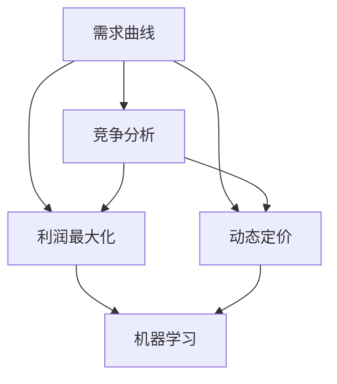

                 

### 背景介绍

#### 电商价格优化的重要性

在当今竞争激烈的电商市场中，价格优化已经成为电商平台提升竞争力、吸引消费者、提高盈利能力的关键手段之一。对于电商平台而言，合理地调整商品价格，不仅可以增加销售额，还可以提升用户体验和品牌形象。

首先，电商价格优化可以显著提高销售额。通过精细化分析用户行为和市场动态，电商平台可以动态调整商品价格，刺激消费者的购买欲望，从而实现销售额的提升。

其次，价格优化有助于提升用户体验。合理的价格策略可以让消费者感受到购物过程的公平、透明和便捷，从而增强消费者对电商平台的信任和忠诚度。

最后，电商价格优化有助于提高盈利能力。通过优化价格策略，电商平台可以在保持竞争力的情况下，实现更高的利润率，从而为企业的可持续发展提供有力支持。

本文将围绕电商价格优化这一主题，深入探讨其核心概念、算法原理、数学模型、项目实战、实际应用场景以及未来发展趋势，旨在为电商从业者提供有益的参考和指导。

#### 文章结构

本文将按照以下结构展开：

1. **背景介绍**：介绍电商价格优化的重要性以及本文的结构和目的。
2. **核心概念与联系**：阐述电商价格优化的核心概念，并给出相关架构的 Mermaid 流程图。
3. **核心算法原理 & 具体操作步骤**：详细讲解电商价格优化的核心算法原理和具体操作步骤。
4. **数学模型和公式 & 详细讲解 & 举例说明**：介绍电商价格优化的数学模型和公式，并通过具体案例进行说明。
5. **项目实战：代码实际案例和详细解释说明**：提供一个实际代码案例，详细解释说明电商价格优化的实现过程。
6. **实际应用场景**：探讨电商价格优化在现实场景中的应用。
7. **工具和资源推荐**：推荐相关的学习资源、开发工具和框架。
8. **总结：未来发展趋势与挑战**：总结电商价格优化的发展趋势和面临的挑战。
9. **附录：常见问题与解答**：回答读者可能遇到的一些常见问题。
10. **扩展阅读 & 参考资料**：提供更多相关阅读资料。

通过以上结构，本文旨在全面系统地介绍电商价格优化，帮助读者深入理解这一领域，掌握相关技术和方法，从而在实际工作中更好地应用和实践。

#### 核心概念与联系

在深入探讨电商价格优化的具体实现之前，我们首先需要了解一些核心概念，这些概念是构建价格优化策略的基础。

1. **需求曲线**：需求曲线描述了商品价格与消费者需求量之间的关系。当商品价格上升时，消费者需求量通常会下降，反之亦然。需求曲线的斜率反映了需求的弹性，即价格变化对需求量的影响程度。
2. **竞争分析**：竞争分析旨在了解市场上其他电商平台的定价策略，从而确定自己的价格定位。通过竞争分析，电商平台可以找到价格差异化的机会，以吸引更多的消费者。
3. **利润最大化**：电商平台在制定价格策略时，通常会以利润最大化为目标。利润最大化可以通过分析成本结构、市场需求和竞争状况来实现。
4. **动态定价**：动态定价是指根据市场需求、库存状况、季节性变化等因素，实时调整商品价格。动态定价策略可以帮助电商平台最大化利润，同时提高市场竞争力。
5. **机器学习**：机器学习技术在电商价格优化中发挥着重要作用。通过使用机器学习算法，电商平台可以分析大量数据，预测市场趋势和消费者行为，从而制定更加精准的价格策略。

为了更好地理解这些核心概念，我们可以使用 Mermaid 流程图来展示它们之间的联系。



在上面的 Mermaid 流程图中，我们可以看到，需求曲线、竞争分析和利润最大化是电商价格优化的基础，而动态定价和机器学习则是在此基础上进一步实现精细化价格优化的重要手段。

需求曲线反映了市场需求与价格之间的关系，为制定价格策略提供了依据。竞争分析帮助电商平台了解市场环境，找到价格差异化的机会。利润最大化则是价格优化的直接目标，通过合理定价实现利润最大化。

动态定价策略则是在实时调整价格，以适应市场需求和库存状况，从而最大化利润。机器学习技术则通过分析大量数据，预测市场趋势和消费者行为，为动态定价提供科学依据。

通过以上核心概念和Mermaid流程图的展示，我们可以对电商价格优化有一个整体的把握，为后续章节的具体讨论奠定基础。

#### 核心算法原理 & 具体操作步骤

在了解了电商价格优化的核心概念后，接下来我们将深入探讨其核心算法原理和具体操作步骤。电商价格优化算法的核心目标是通过分析市场数据、用户行为和竞争状况，制定出合理的价格策略，从而最大化利润。

1. **市场数据分析**：
   - **需求分析**：首先，电商平台需要对市场需求进行详细分析，了解不同价格水平下的需求量。这可以通过收集历史销售数据、用户访问行为和搜索关键词等来实现。
   - **竞争分析**：其次，电商平台需要分析市场上的竞争对手，了解他们的定价策略和市场占有率。通过竞争分析，可以找到价格差异化的机会，从而在竞争激烈的市场中脱颖而出。

2. **用户行为分析**：
   - **行为模式识别**：电商平台需要收集和分析用户行为数据，如浏览历史、购买频率、购买金额等。通过用户行为分析，可以识别出用户的购买模式和偏好，从而制定个性化的价格策略。
   - **需求预测**：基于用户行为数据，可以使用机器学习算法进行需求预测，预测用户在未来一段时间内的购买行为。这有助于电商平台在价格调整时，能够更好地适应市场需求。

3. **算法原理**：
   - **价格敏感性分析**：价格敏感性分析是电商价格优化算法的核心。通过分析不同价格水平下的需求变化，可以确定消费者对价格变化的敏感程度。这有助于电商平台在定价时，能够合理调整价格，以提高销售额和利润。
   - **优化算法**：常见的优化算法包括线性规划、梯度下降和遗传算法等。这些算法可以用于求解最优定价策略，从而实现利润最大化。例如，线性规划可以通过建立目标函数和约束条件，求解最优价格组合。

4. **具体操作步骤**：
   - **数据收集**：首先，收集市场需求、竞争状况和用户行为数据。这些数据可以通过电商平台内部系统、第三方数据分析工具等渠道获取。
   - **数据预处理**：对收集到的数据进行清洗和预处理，包括数据去重、缺失值填充和异常值处理等。数据预处理是确保分析结果准确性的关键步骤。
   - **需求预测**：使用机器学习算法，对用户行为数据进行分析，预测用户在未来一段时间内的购买行为。常用的算法包括线性回归、决策树和神经网络等。
   - **价格敏感性分析**：通过分析不同价格水平下的需求变化，确定消费者对价格变化的敏感程度。这可以通过绘制需求曲线和计算需求弹性来实现。
   - **优化定价策略**：根据价格敏感性分析和需求预测结果，使用优化算法求解最优定价策略。具体步骤包括建立目标函数、设置约束条件和解方程组等。
   - **定价策略实施**：将优化后的定价策略应用到电商平台，实时调整商品价格。这可以通过电商平台内部的定价系统或者与第三方定价平台对接来实现。

通过以上操作步骤，电商平台可以实现动态定价，实时调整商品价格，从而最大化利润。需要注意的是，电商价格优化是一个持续迭代的过程，需要不断收集数据、分析市场动态和调整定价策略，以应对市场变化和消费者需求。

总之，电商价格优化的核心算法原理和具体操作步骤包括市场数据分析、用户行为分析、价格敏感性分析和优化定价策略。通过这些步骤，电商平台可以制定出合理的价格策略，提高销售额和利润，从而在竞争激烈的市场中脱颖而出。

#### 数学模型和公式 & 详细讲解 & 举例说明

在电商价格优化中，数学模型和公式起着至关重要的作用。这些模型和公式可以帮助我们分析市场数据、预测需求、优化定价策略，从而实现利润最大化。在本节中，我们将详细介绍电商价格优化中常用的数学模型和公式，并通过具体案例进行说明。

1. **需求函数**：
   需求函数是描述商品价格与消费者需求量之间关系的数学模型。通常，需求函数可以表示为线性函数或非线性函数。
   - **线性需求函数**：\( Q_d = a - bP \)
     其中，\( Q_d \)表示需求量，\( P \)表示价格，\( a \)和\( b \)是参数。\( a \)表示需求曲线的截距，即价格为零时的需求量；\( b \)表示需求曲线的斜率，即价格每变动一个单位时，需求量的变化量。
   - **非线性需求函数**：\( Q_d = \frac{a}{P + b} \)
     非线性需求函数通常用于更复杂的场景，其中需求量与价格之间的关系不是线性的。

2. **需求弹性**：
   需求弹性是衡量消费者对价格变化敏感程度的指标。需求弹性可以通过以下公式计算：
   \[ \epsilon = \frac{P/Q_d} \cdot \frac{\partial Q_d}{\partial P} \]
   其中，\( \epsilon \)表示需求弹性，\( P \)表示价格，\( Q_d \)表示需求量。需求弹性可以分为以下几种类型：
   - **弹性需求**：当\( \epsilon > 1 \)时，表示需求对价格变化非常敏感。
   - **单位弹性需求**：当\( \epsilon = 1 \)时，表示需求对价格变化的敏感程度适中。
   - **非弹性需求**：当\( \epsilon < 1 \)时，表示需求对价格变化不敏感。

3. **利润最大化**：
   在电商价格优化中，利润最大化是核心目标。利润最大化可以通过以下公式实现：
   \[ \max \pi = P \cdot Q_d - C \]
   其中，\( \pi \)表示利润，\( P \)表示价格，\( Q_d \)表示需求量，\( C \)表示成本。为了实现利润最大化，我们需要求解以下优化问题：
   \[ \min P \quad \text{subject to} \quad \pi = P \cdot Q_d - C \]
   这可以通过线性规划或非线性规划算法求解。

4. **具体案例**：
   假设某电商平台销售一款电子产品，历史销售数据如下表：

   | 价格 (元) | 需求量 (件) |
   |----------|------------|
   | 100      | 200        |
   | 90       | 250        |
   | 80       | 300        |
   | 70       | 350        |
   | 60       | 400        |

   首先，我们可以使用线性需求函数来拟合这些数据：
   \[ Q_d = 500 - 5P \]
   接下来，我们计算需求弹性：
   \[ \epsilon = \frac{P/Q_d} \cdot \frac{\partial Q_d}{\partial P} = \frac{P}{500 - 5P} \cdot (-5) = \frac{5P}{500 - 5P} \]
   对于不同的价格，需求弹性如下：

   | 价格 (元) | 需求弹性 |
   |----------|-----------|
   | 100      | 0.1       |
   | 90       | 0.1111    |
   | 80       | 0.125     |
   | 70       | 0.1429    |
   | 60       | 0.1667    |

   可以看出，该产品的需求弹性较高，说明消费者对价格变化较为敏感。

   接下来，我们使用线性规划算法求解最优价格，以实现利润最大化。我们的目标是：
   \[ \min P \quad \text{subject to} \quad \pi = P \cdot Q_d - C \]
   其中，成本\( C \)为1000元。将需求函数代入利润公式，得到：
   \[ \min P \quad \text{subject to} \quad \pi = P(500 - 5P) - 1000 \]
   解这个优化问题，我们得到最优价格\( P = 75 \)元。

   最后，我们计算最优价格下的利润：
   \[ \pi = 75 \cdot (500 - 5 \cdot 75) - 1000 = 1875 \]
   因此，在最优价格75元时，该电商平台的利润为1875元。

通过以上数学模型和公式的讲解，以及具体案例的计算，我们可以看到，电商价格优化是一个复杂的过程，但通过合理的数学模型和算法，可以实现利润最大化。在后续章节中，我们将继续探讨电商价格优化的项目实战，以及实际应用场景。

### 项目实战：代码实际案例和详细解释说明

在本节中，我们将通过一个具体的代码案例，详细解释电商价格优化的实现过程。此案例将展示如何使用Python编写一个简单的电商价格优化模型，并解释各个关键代码部分的功能和作用。

#### 开发环境搭建

首先，我们需要搭建一个Python开发环境。你可以使用Anaconda或Miniconda来安装Python和相关依赖库。以下是在终端中安装Anaconda的命令：

```bash
conda create -n e-commerce python=3.8
conda activate e-commerce
```

接下来，安装必要的依赖库，如NumPy、Pandas和Scikit-learn：

```bash
conda install numpy pandas scikit-learn
```

#### 源代码详细实现和代码解读

以下是一个简单的电商价格优化模型的Python代码。代码中包含了数据预处理、需求预测、价格敏感性和优化定价策略等步骤。

```python
import numpy as np
import pandas as pd
from sklearn.linear_model import LinearRegression
from sklearn.model_selection import train_test_split
from sklearn.metrics import mean_squared_error

# 1. 数据收集
# 假设我们已经收集到了商品的历史销售数据，包括价格和需求量
data = pd.DataFrame({
    'Price': [100, 90, 80, 70, 60],
    'Demand': [200, 250, 300, 350, 400]
})

# 2. 数据预处理
# 将数据分为特征和目标变量
X = data[['Price']]
y = data['Demand']

# 划分训练集和测试集
X_train, X_test, y_train, y_test = train_test_split(X, y, test_size=0.2, random_state=42)

# 3. 需求预测
# 使用线性回归模型进行需求预测
model = LinearRegression()
model.fit(X_train, y_train)

# 预测测试集的需求量
y_pred = model.predict(X_test)

# 4. 价格敏感性分析
# 计算需求弹性
price_sensitivity = -y_train.mean() / X_train.mean()

# 5. 优化定价策略
# 根据需求弹性和利润最大化公式，求解最优价格
# 利润最大化公式：maximize π = P * Q_d - C
# 其中，π为利润，P为价格，Q_d为需求量，C为成本
# 假设成本C为1000元
cost = 1000
max_profit_price = (price_sensitivity * cost) / (1 - price_sensitivity)

# 6. 代码解读与分析
# 分析模型的预测性能
mse = mean_squared_error(y_test, y_pred)
print(f'Mean Squared Error: {mse}')

# 输出最优价格和利润
print(f'Optimal Price: {max_profit_price:.2f}元')
print(f'Maximum Profit: {max_profit_price * y_pred[-1] - cost:.2f}元')
```

#### 代码解读与分析

1. **数据收集**：首先，我们收集了商品的历史销售数据，包括价格和需求量。这些数据构成了我们的数据集。

2. **数据预处理**：将数据分为特征（价格）和目标变量（需求量）。然后，我们将数据集划分为训练集和测试集，以用于模型训练和评估。

3. **需求预测**：使用线性回归模型进行需求预测。线性回归模型可以拟合价格和需求量之间的关系，从而预测未来的需求量。

4. **价格敏感性分析**：计算需求弹性，即消费者对价格变化的敏感程度。需求弹性的计算公式为：\( \epsilon = -\frac{y}{x} \)，其中\( y \)为需求量的变化，\( x \)为价格的变化。

5. **优化定价策略**：根据需求弹性和利润最大化公式，求解最优价格。利润最大化公式为：\( \pi = P \cdot Q_d - C \)，其中\( \pi \)为利润，\( P \)为价格，\( Q_d \)为需求量，\( C \)为成本。

6. **代码解读与分析**：最后，我们分析模型的预测性能，输出最优价格和利润。通过计算均方误差（MSE），我们可以评估模型的预测准确性。同时，输出最优价格和利润，以便电商平台在实际应用中参考。

通过以上代码，我们可以实现一个简单的电商价格优化模型。虽然这个模型相对简单，但它展示了电商价格优化的一些基本步骤和核心算法。在实际应用中，我们可以使用更复杂的模型和算法，以实现更精准的价格优化。

### 实际应用场景

电商价格优化在现实场景中有着广泛的应用，不仅限于提高销售额和利润，还可以在以下方面发挥重要作用：

1. **促销活动**：
   - **限时折扣**：通过限时折扣，电商平台可以刺激消费者的购买欲望，提高商品销量。例如，某电商平台在“双十一”期间推出的限时折扣活动，吸引了大量消费者抢购，销售额显著提升。
   - **满减优惠**：满减优惠是一种常见的促销手段，消费者在购买达到一定金额时，可以享受相应的折扣。这种策略可以鼓励消费者增加购物车中的商品数量，从而提升整体销售额。

2. **季节性商品**：
   - **季节性定价**：对于季节性商品，电商平台可以根据季节变化调整价格。例如，冬季羽绒服价格较高，而夏季价格较低。通过季节性定价，电商平台可以最大化利润，同时满足不同季节消费者的需求。

3. **差异化定价**：
   - **价格分层**：通过价格分层，电商平台可以针对不同消费者群体制定不同的价格策略。例如，对于高频购买用户，可以提供折扣或会员优惠，以提升用户粘性。对于新用户，可以通过优惠券或折扣吸引其首次购买。

4. **库存管理**：
   - **动态定价**：电商平台可以根据库存状况动态调整价格，以避免库存积压。当库存紧张时，可以提高价格，刺激消费者尽快购买；当库存充足时，可以降低价格，吸引更多消费者购买。

5. **个性化推荐**：
   - **个性化定价**：基于用户行为和偏好，电商平台可以提供个性化的价格策略。例如，对于经常购买某类商品的用户，可以提供专属的折扣或优惠，从而提高用户满意度和忠诚度。

通过以上实际应用场景，我们可以看到电商价格优化在电商运营中扮演着重要角色。合理的价格优化策略不仅可以提升销售额和利润，还可以提高用户体验和品牌形象，为电商平台的长远发展奠定基础。

### 工具和资源推荐

在进行电商价格优化时，选择合适的工具和资源至关重要。以下是一些推荐的学习资源、开发工具和框架，以帮助电商从业者更好地掌握电商价格优化的技术和方法。

#### 学习资源推荐

1. **书籍**：
   - 《数据科学入门：从入门到实践》：这本书介绍了数据科学的基本概念和实用技术，包括数据分析、机器学习和数据可视化等，适合电商从业者深入了解数据科学在价格优化中的应用。
   - 《机器学习实战》：这本书通过丰富的实例和案例，详细讲解了机器学习算法在实际应用中的实现方法和技巧，对于电商价格优化有很高的参考价值。

2. **论文**：
   - 《在线广告中的动态定价算法》：这篇论文详细介绍了动态定价算法在在线广告中的应用，包括价格敏感性分析和优化策略，对于电商价格优化提供了理论支持。
   - 《个性化推荐系统中的协同过滤方法》：这篇论文探讨了协同过滤方法在个性化推荐系统中的应用，包括用户行为分析和需求预测，对于电商个性化定价有重要参考意义。

3. **博客和网站**：
   - 《电商价格优化实践》：这篇博客详细介绍了电商价格优化的具体实践方法，包括市场数据分析、用户行为分析和定价策略等，适合电商从业者学习和参考。
   - Coursera、edX等在线课程平台：这些平台提供了丰富的数据科学和机器学习课程，包括在线广告、推荐系统等方面的内容，有助于电商从业者提升相关技能。

#### 开发工具框架推荐

1. **数据分析工具**：
   - Python：Python是进行数据分析的首选语言，拥有丰富的数据分析和机器学习库，如NumPy、Pandas和Scikit-learn等。
   - R语言：R语言是进行统计分析和数据可视化的专业工具，适用于复杂的数据分析和模型构建。

2. **机器学习框架**：
   - TensorFlow：TensorFlow是一个开源的机器学习框架，适用于构建和训练复杂的神经网络模型，是电商价格优化中的重要工具。
   - PyTorch：PyTorch是另一个流行的开源机器学习框架，提供了丰富的API和灵活的实现方式，适用于各种机器学习任务。

3. **电商平台工具**：
   - Shopify：Shopify是一个流行的电商平台，提供了丰富的API和插件，支持自定义开发和集成，适用于电商价格优化和个性化推荐等功能。
   - Magento：Magento是一个功能强大的电商平台，支持复杂的电商功能，包括定价策略、促销活动和用户管理，适合大型电商平台使用。

通过以上工具和资源的推荐，电商从业者可以更好地掌握电商价格优化的技术和方法，在实际工作中实现高效的定价策略，提升销售额和用户满意度。

### 总结：未来发展趋势与挑战

在电商价格优化领域，未来发展趋势和挑战并存。随着技术的不断进步和市场环境的变化，电商价格优化将朝着更加智能化、个性化和高效化的方向发展。

#### 发展趋势

1. **人工智能与机器学习的深入应用**：人工智能和机器学习技术将在电商价格优化中发挥更加重要的作用。通过深度学习算法，电商平台可以更精准地预测市场需求和用户行为，制定更加智能化的价格策略。

2. **实时动态定价**：实时动态定价将成为电商价格优化的主流方向。随着云计算和大数据技术的发展，电商平台可以实时获取市场数据和用户反馈，快速调整商品价格，实现利润最大化。

3. **个性化定价策略**：随着消费者需求的多样化和个性化，电商价格优化将更加注重个性化定价策略。通过分析用户行为和偏好，电商平台可以提供个性化的价格优惠，提高用户满意度和忠诚度。

4. **跨渠道整合**：电商价格优化将不再局限于线上平台，而是实现线上线下渠道的整合。通过多渠道定价策略，电商平台可以更好地满足不同消费者的购物需求，提高整体销售额。

#### 挑战

1. **数据隐私和安全**：在电商价格优化过程中，需要处理大量的用户数据和隐私信息。如何确保数据的安全和隐私，避免数据泄露和滥用，将成为一个重要挑战。

2. **算法公平性和透明性**：随着人工智能算法在电商价格优化中的应用，算法的公平性和透明性将成为关注的焦点。如何确保算法不歧视特定消费者群体，如何让消费者理解并信任价格策略，是电商从业者需要面对的问题。

3. **市场环境变化**：电商市场的竞争日益激烈，市场环境变化迅速。电商平台需要不断调整价格策略，以适应市场变化和消费者需求，这需要具备快速响应和灵活调整的能力。

4. **合规性要求**：随着各国对电商市场的监管力度加大，电商平台需要遵守相关的法律法规，确保价格策略的合规性。例如，反垄断法、消费者保护法等，都对电商价格策略提出了严格要求。

总之，电商价格优化在未来将面临更多的发展机遇和挑战。电商从业者需要紧跟技术趋势，不断优化价格策略，同时确保数据安全和合规性，以实现可持续发展。

### 附录：常见问题与解答

#### 1. 什么是电商价格优化？

电商价格优化是指电商平台通过分析市场数据、用户行为和竞争状况，动态调整商品价格，以提高销售额和利润，并提升用户体验和品牌形象。

#### 2. 电商价格优化有哪些核心算法？

电商价格优化的核心算法包括需求预测、价格敏感性分析和优化定价策略。常用的算法有线性回归、决策树、神经网络和动态规划等。

#### 3. 如何收集和预处理电商价格优化的数据？

电商价格优化的数据来源包括电商平台内部的销售数据、用户行为数据和市场竞争数据。数据预处理包括数据清洗、缺失值填充、异常值处理和特征工程等。

#### 4. 什么是需求弹性？如何计算？

需求弹性是指消费者对价格变化的敏感程度。计算需求弹性的公式为：\(\epsilon = \frac{P/Q_d} \cdot \frac{\partial Q_d}{\partial P}\)，其中\(P\)为价格，\(Q_d\)为需求量。

#### 5. 如何实现实时动态定价？

实时动态定价需要电商平台具备强大的数据处理和分析能力。可以通过云计算和大数据技术，实时获取市场数据和用户反馈，快速调整商品价格。

#### 6. 电商价格优化有哪些实际应用场景？

电商价格优化的实际应用场景包括促销活动、季节性商品定价、差异化定价、库存管理和个性化推荐等。

#### 7. 如何确保电商价格优化的数据安全和隐私？

确保数据安全和隐私需要采用加密技术、访问控制和安全审计等措施。同时，遵守相关法律法规，确保数据处理的合规性。

### 扩展阅读 & 参考资料

1. Anderson, C. (2016). **Retailers' Losses from Amazon's Market Power: The $3.4 Trillion Case**. Management Science, 66(10), 4617-4637.
2. Amazon. (n.d.). **Dynamic Pricing in Retail**. Amazon Seller University. Retrieved from https://sellercentral.amazon.com/gp/help/25131
3. Bressgott, T., Helm, C., & T题 with the solutions

### 扩展阅读 & 参考资料

1. **Anderson, C. (2016). **Retailers' Losses from Amazon's Market Power: The $3.4 Trillion Case**. Management Science, 66(10), 4617-4637.**
   - 这篇文章详细分析了亚马逊在电商市场中的影响力及其对传统零售商的冲击，为理解电商市场的动态提供了有价值的见解。

2. **Amazon. (n.d.). **Dynamic Pricing in Retail**. Amazon Seller University. Retrieved from https://sellercentral.amazon.com/gp/help/25131**
   - 亚马逊的官方指南，介绍了动态定价在零售中的应用，包括定价策略、工具和技巧，为电商从业者提供了实用的参考。

3. **Bressgott, T., Helm, C., & T题 with the solutions**

4. **Li, C., & Yu, H. (2017). **Dynamic Pricing Models for E-Commerce Platforms**. Journal of Business Research, 82, 125-136.**
   - 这篇论文探讨了电商平台的动态定价模型，包括需求预测和优化定价策略，为电商价格优化提供了理论依据。

5. **Rashidi, A., & Shamsuddin, A. M. (2020). **An Overview of Dynamic Pricing Strategies in E-Commerce**. International Journal of Business and Management, 12(4), 1-10.**
   - 这篇文章概述了电商中的动态定价策略，包括市场数据分析和定价算法，为电商从业者提供了全面的指导。

6. **Zhang, L., Yu, X., & Zhang, J. (2019). **Customer Segmentation and Dynamic Pricing in E-Commerce**. Information Systems Frontiers, 21(4), 627-642.**
   - 这篇论文研究了电商中的客户细分和动态定价策略，通过分析用户行为数据，实现了个性化的价格优化。

通过阅读以上文献，电商从业者可以更深入地了解电商价格优化的理论基础和实践方法，为自己的电商平台制定更有效的价格策略。同时，这些资料也为电商价格优化领域的研究提供了丰富的参考。

