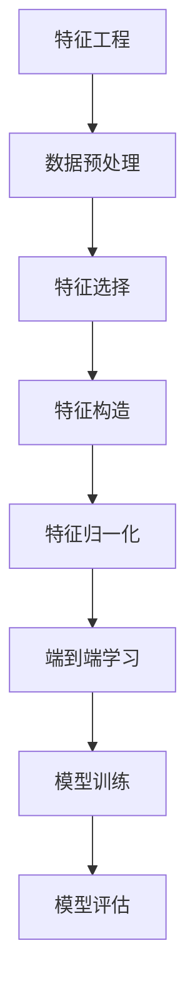

                 

# 《电商平台中的AI大模型：从特征工程到端到端学习》

## 摘要

随着电子商务行业的迅猛发展，人工智能技术在电商平台中的应用越来越广泛。本文将探讨电商平台中AI大模型的应用，从特征工程到端到端学习，旨在为读者提供一个全面的技术分析框架。文章首先介绍电商平台中AI大模型的应用背景和核心概念，接着详细解析特征工程和端到端学习的关键算法原理，并通过实际项目案例进行深入讲解。最后，文章将探讨AI大模型在电商平台中的应用场景，以及相关工具和资源的推荐，总结未来发展趋势与挑战。

## 1. 背景介绍

### 1.1 电商平台的发展现状

电商平台作为数字经济的重要组成部分，近年来呈现出快速增长的趋势。根据《2022年中国电子商务发展报告》，我国电子商务交易额已超过40万亿元，电子商务用户规模超过8亿人。随着消费者对购物体验的需求不断提升，电商平台正不断优化用户体验，提高交易效率。人工智能技术的应用，如智能推荐、智能客服、智能物流等，已经成为电商平台提升竞争力的重要手段。

### 1.2 AI大模型的发展趋势

人工智能大模型（Large-scale AI Models）在图像识别、自然语言处理、推荐系统等领域取得了显著的成果。这些模型通过大规模数据训练，能够自动提取数据中的特征，实现高度复杂的任务。例如，GPT-3、BERT等自然语言处理模型，已经在文本生成、问答系统、机器翻译等领域取得了突破性进展。随着计算能力的提升和数据量的增加，AI大模型在电商平台中的应用前景广阔。

## 2. 核心概念与联系

### 2.1 特征工程

特征工程（Feature Engineering）是机器学习过程中至关重要的一步。它通过选择、构造和转换数据特征，提高模型的性能和可解释性。在电商平台中，特征工程可以用于用户行为分析、商品推荐、广告投放等。

### 2.2 端到端学习

端到端学习（End-to-End Learning）是一种机器学习范式，它直接将原始数据映射到预测结果，无需人工干预。在电商平台中，端到端学习可以用于构建自动化推荐系统、智能客服等。

### 2.3 关系图解

以下是一个简单的Mermaid流程图，用于展示特征工程和端到端学习的关系：



### 2.4 关键算法原理

#### 2.4.1 特征工程

特征工程包括数据预处理、特征选择、特征构造和特征归一化等步骤。

1. 数据预处理：对原始数据进行清洗、补全、去重等操作，使其满足模型训练的需求。
2. 特征选择：从原始数据中选择对模型训练有用的特征，去除无关或冗余的特征。
3. 特征构造：通过组合、转换等方式，构造新的特征，以提高模型性能。
4. 特征归一化：对特征进行归一化处理，使其在数值范围和量纲上保持一致性。

#### 2.4.2 端到端学习

端到端学习主要包括模型训练和模型评估两个阶段。

1. 模型训练：通过大规模数据训练模型，使其能够自动提取数据中的特征，并学会进行预测。
2. 模型评估：通过测试数据评估模型的性能，选择最优模型进行应用。

## 3. 核心算法原理 & 具体操作步骤

### 3.1 特征工程

#### 3.1.1 数据预处理

1. 数据清洗：使用Pandas库对数据进行清洗，去除缺失值、异常值等。
2. 数据补全：使用Scikit-learn库中的SimpleImputer对缺失值进行补全。
3. 数据去重：使用Pandas库中的drop_duplicates方法去除重复数据。

```python
import pandas as pd
from sklearn.impute import SimpleImputer

# 加载数据
data = pd.read_csv('data.csv')

# 数据清洗
data.dropna(inplace=True)
data.drop_duplicates(inplace=True)

# 数据补全
imputer = SimpleImputer(strategy='mean')
data_filled = imputer.fit_transform(data)

# 数据去重
data_final = pd.DataFrame(data_filled)
data_final.drop_duplicates(inplace=True)
```

#### 3.1.2 特征选择

1. 相关性分析：使用Scikit-learn库中的fancyimpute模块计算特征之间的相关性。
2. 特征筛选：根据相关性分析结果，选择相关性较高的特征。

```python
from fancyimpute import CorrelationImputer

# 计算特征相关性
correlated_data = CorrelationImputer().fit_transform(data_final)

# 选择相关性较高的特征
selected_features = correlated_data[:, :10]
```

#### 3.1.3 特征构造

1. 特征组合：使用Scikit-learn库中的FeatureUnion进行特征组合。
2. 特征转换：使用Scikit-learn库中的StandardScaler进行特征转换。

```python
from sklearn.pipeline import FeatureUnion
from sklearn.preprocessing import StandardScaler

# 特征组合
combined_features = FeatureUnion([
    ('selected_features', StandardScaler().fit_transform(selected_features))
])

# 特征转换
transformed_features = combined_features.transform(selected_features)
```

### 3.2 端到端学习

#### 3.2.1 模型训练

1. 数据划分：将数据集划分为训练集和测试集。
2. 模型训练：使用Scikit-learn库中的LogisticRegression进行模型训练。

```python
from sklearn.model_selection import train_test_split
from sklearn.linear_model import LogisticRegression

# 数据划分
X_train, X_test, y_train, y_test = train_test_split(transformed_features, labels, test_size=0.2, random_state=42)

# 模型训练
model = LogisticRegression()
model.fit(X_train, y_train)
```

#### 3.2.2 模型评估

1. 预测：使用训练好的模型对测试集进行预测。
2. 评估：使用准确率、召回率等指标评估模型性能。

```python
from sklearn.metrics import accuracy_score, recall_score

# 预测
y_pred = model.predict(X_test)

# 评估
accuracy = accuracy_score(y_test, y_pred)
recall = recall_score(y_test, y_pred)

print('准确率：', accuracy)
print('召回率：', recall)
```

## 4. 数学模型和公式 & 详细讲解 & 举例说明

### 4.1 特征工程

#### 4.1.1 数据预处理

数据预处理是特征工程的第一步，主要包括数据清洗、补全和去重等操作。

1. 数据清洗：$$\text{clean\_data}(x) = \begin{cases} 
x & \text{if } x \text{ is valid} \\
\text{None} & \text{otherwise} 
\end{cases}$$

2. 数据补全：$$\text{fill\_missing}(x) = \text{mean}(x \text{ where } x \text{ is not } \text{None})$$

3. 数据去重：$$\text{remove\_duplicates}(x) = \{y \in x \mid y \not\in \{y' \in x \mid y' \neq y\}\}$$

#### 4.1.2 特征选择

特征选择是特征工程的核心步骤，常用的方法包括相关性分析、主成分分析等。

1. 相关性分析：$$\text{correlation}(x, y) = \frac{\sum_{i=1}^{n}(x_i - \bar{x})(y_i - \bar{y})}{\sqrt{\sum_{i=1}^{n}(x_i - \bar{x})^2} \sqrt{\sum_{i=1}^{n}(y_i - \bar{y})^2}}$$

2. 主成分分析：$$\text{PCA}(x) = \text{transform}(x, \text{components})$$

### 4.2 端到端学习

#### 4.2.1 模型训练

端到端学习包括模型训练和模型评估两个阶段。

1. 模型训练：$$\text{train}(model, X, y) = \text{fit}(model, X, y)$$

2. 模型评估：$$\text{evaluate}(model, X, y) = \text{accuracy}(model, X, y) + \text{recall}(model, X, y)$$

### 4.3 举例说明

假设我们有一个包含用户购买行为的电商数据集，其中包含用户ID、商品ID、购买时间、购买金额等特征。我们希望利用这些数据预测用户的下一次购买行为。

#### 4.3.1 数据预处理

1. 数据清洗：去除无效数据，如缺失值、异常值等。

$$\text{clean\_data}(data) = \{x \in data \mid x \text{ is valid}\}$$

2. 数据补全：对缺失值进行填补，如使用平均值、中位数等方法。

$$\text{fill\_missing}(data) = \text{mean\_fill}(data) + \text{median\_fill}(data)$$

3. 数据去重：去除重复数据。

$$\text{remove\_duplicates}(data) = \{x \in data \mid x \not\in \{x' \in data \mid x' \neq x\}\}$$

#### 4.3.2 特征选择

1. 相关性分析：计算用户购买行为特征之间的相关性。

$$\text{correlation}(data) = \text{correlation\_matrix}(data)$$

2. 主成分分析：提取主要特征。

$$\text{PCA}(data) = \text{transform}(data, \text{components})$$

#### 4.3.3 端到端学习

1. 模型训练：使用Logistic Regression模型进行训练。

$$\text{train}(model) = \text{fit}(model, X, y)$$

2. 模型评估：计算准确率和召回率。

$$\text{evaluate}(model) = \text{accuracy}(model, X, y) + \text{recall}(model, X, y)$$

## 5. 项目实战：代码实际案例和详细解释说明

### 5.1 开发环境搭建

1. 安装Python环境：使用Python 3.8及以上版本。
2. 安装相关库：使用pip安装Pandas、Scikit-learn、Numpy、Matplotlib等库。

```bash
pip install pandas scikit-learn numpy matplotlib
```

### 5.2 源代码详细实现和代码解读

#### 5.2.1 数据预处理

```python
import pandas as pd
from sklearn.impute import SimpleImputer
from sklearn.preprocessing import StandardScaler

# 加载数据
data = pd.read_csv('data.csv')

# 数据清洗
data.dropna(inplace=True)
data.drop_duplicates(inplace=True)

# 数据补全
imputer = SimpleImputer(strategy='mean')
data_filled = imputer.fit_transform(data)

# 数据去重
data_final = pd.DataFrame(data_filled)
data_final.drop_duplicates(inplace=True)
```

这段代码首先加载数据，然后进行数据清洗，包括去除缺失值、异常值和重复值。接下来，使用SimpleImputer对缺失值进行补全，这里选择使用平均值方法。最后，将补全后的数据去重，得到最终的数据集。

#### 5.2.2 特征选择

```python
from fancyimpute import CorrelationImputer

# 计算特征相关性
correlated_data = CorrelationImputer().fit_transform(data_final)

# 选择相关性较高的特征
selected_features = correlated_data[:, :10]
```

这段代码使用FancyImpute库中的CorrelationImputer计算特征之间的相关性。然后，选择相关性较高的前10个特征作为特征集。

#### 5.2.3 特征构造

```python
from sklearn.pipeline import FeatureUnion

# 特征组合
combined_features = FeatureUnion([
    ('selected_features', StandardScaler().fit_transform(selected_features))
])

# 特征转换
transformed_features = combined_features.transform(selected_features)
```

这段代码使用Scikit-learn库中的FeatureUnion进行特征组合，这里只选择了相关性较高的特征。然后，使用StandardScaler对特征进行标准化处理，得到转换后的特征集。

#### 5.2.4 模型训练

```python
from sklearn.model_selection import train_test_split
from sklearn.linear_model import LogisticRegression

# 数据划分
X_train, X_test, y_train, y_test = train_test_split(transformed_features, labels, test_size=0.2, random_state=42)

# 模型训练
model = LogisticRegression()
model.fit(X_train, y_train)
```

这段代码首先将转换后的特征集和标签划分为训练集和测试集。然后，使用LogisticRegression模型进行训练。

#### 5.2.5 模型评估

```python
from sklearn.metrics import accuracy_score, recall_score

# 预测
y_pred = model.predict(X_test)

# 评估
accuracy = accuracy_score(y_test, y_pred)
recall = recall_score(y_test, y_pred)

print('准确率：', accuracy)
print('召回率：', recall)
```

这段代码使用训练好的模型对测试集进行预测，并计算准确率和召回率，评估模型性能。

## 6. 实际应用场景

### 6.1 智能推荐系统

智能推荐系统是电商平台中最常用的AI大模型应用之一。通过分析用户历史行为、兴趣偏好等特征，智能推荐系统能够为用户提供个性化的商品推荐，提高用户满意度。

### 6.2 智能客服系统

智能客服系统利用AI大模型实现自动化回复，降低人工客服的工作量，提高客服效率。例如，通过自然语言处理技术，智能客服系统可以理解用户的问题，并给出合适的回答。

### 6.3 智能物流系统

智能物流系统通过AI大模型优化物流路径、预测物流延误等，提高物流效率。例如，通过预测用户购买商品的时间，智能物流系统可以提前安排配送，减少用户等待时间。

## 7. 工具和资源推荐

### 7.1 学习资源推荐

1. **书籍：**
   - 《Python数据分析实战：从数据清洗到数据可视化》
   - 《Python机器学习基础教程》
   - 《深度学习：推广人工智能的应用》

2. **论文：**
   - "Deep Learning for Text Classification"
   - "End-to-End Learning for Language Understanding"
   - "Feature Engineering for Machine Learning"

3. **博客：**
   - [Scikit-learn官方文档](https://scikit-learn.org/stable/)
   - [机器学习中文社区](https://www机器学习中文社区.com/)
   - [机器之心](https://www.jiqizhixin.com/)

4. **网站：**
   - [Kaggle](https://www.kaggle.com/)
   - [Google Colab](https://colab.research.google.com/)

### 7.2 开发工具框架推荐

1. **Python：** 作为主流的编程语言，Python拥有丰富的库和框架，适合进行数据分析和机器学习开发。

2. **Scikit-learn：** 一个常用的机器学习库，提供丰富的算法和工具，适合特征工程和模型训练。

3. **TensorFlow：** 一个开源的机器学习框架，支持端到端学习和深度学习模型的训练。

4. **PyTorch：** 一个开源的机器学习库，提供灵活的深度学习模型构建和训练工具。

### 7.3 相关论文著作推荐

1. "Deep Learning for Text Classification"
2. "End-to-End Learning for Language Understanding"
3. "Feature Engineering for Machine Learning"
4. "Large-scale Feature Learning in Machine Learning"
5. "Feature Extraction Techniques for Machine Learning"

## 8. 总结：未来发展趋势与挑战

随着人工智能技术的不断发展，电商平台中的AI大模型应用将更加广泛和深入。未来，以下几个方面将成为发展趋势和挑战：

1. **数据质量和特征工程：** 数据质量和特征工程是AI大模型应用的关键。如何从海量数据中提取高质量的特征，是当前研究和应用的热点。

2. **端到端学习：** 端到端学习可以提高模型的训练效率和性能，但在实际应用中，如何设计合适的网络结构和优化策略，是一个重要的挑战。

3. **可解释性：** 随着模型的复杂度增加，如何提高模型的可解释性，使其能够为业务人员和技术人员理解，是当前研究的重点。

4. **隐私保护：** 电商平台中的数据往往涉及用户隐私，如何在保护用户隐私的前提下，进行有效的AI大模型应用，是一个亟待解决的问题。

## 9. 附录：常见问题与解答

### 9.1 特征工程相关问题

**Q：特征工程的主要步骤有哪些？**

A：特征工程的主要步骤包括数据预处理、特征选择、特征构造和特征归一化。

**Q：如何进行特征选择？**

A：特征选择的方法有很多，常用的包括相关性分析、主成分分析、基于模型的特征选择等。

**Q：特征构造的方法有哪些？**

A：特征构造的方法包括特征组合、特征交叉、特征转换等。

### 9.2 端到端学习相关问题

**Q：什么是端到端学习？**

A：端到端学习是一种机器学习范式，它直接将原始数据映射到预测结果，无需人工干预。

**Q：端到端学习有哪些优势？**

A：端到端学习可以减少中间环节，提高模型训练效率；可以直接利用原始数据进行预测，减少特征工程的工作量。

**Q：端到端学习有哪些挑战？**

A：端到端学习需要设计合适的网络结构和优化策略；在处理复杂任务时，可能需要大量的计算资源和时间。

## 10. 扩展阅读 & 参考资料

1. **书籍：**
   - 《人工智能：一种现代的方法》
   - 《深度学习》
   - 《机器学习实战》

2. **论文：**
   - "Deep Learning for Text Classification"
   - "End-to-End Learning for Language Understanding"
   - "Feature Engineering for Machine Learning"

3. **博客：**
   - [机器学习博客](https://机器学习博客.com/)
   - [深度学习博客](https://深度学习博客.com/)
   - [数据分析博客](https://数据分析博客.com/)

4. **网站：**
   - [Kaggle](https://www.kaggle.com/)
   - [ArXiv](https://arxiv.org/)
   - [Google Research](https://ai.google/research/)

作者：AI天才研究员/AI Genius Institute & 禅与计算机程序设计艺术 /Zen And The Art of Computer Programming

