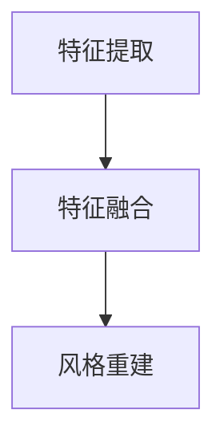

                 

# 电商平台中的图像风格迁移：大模型的创新应用

## 概述

图像风格迁移是一种将一种图像的样式应用到另一种图像上的技术，近年来在计算机视觉领域取得了显著的进展。随着大模型技术的不断发展和广泛应用，图像风格迁移技术也迎来了新的机遇和挑战。本文将探讨电商平台中图像风格迁移的应用及其技术创新。

## 背景

随着互联网的快速发展，电商平台已经成为人们日常生活中不可或缺的一部分。在这些平台上，商品展示的图像质量直接影响着用户的购买决策。然而，由于拍摄设备、光照条件等因素的影响，许多商品图像的质量较低，这使得用户难以准确了解商品的实际外观。因此，提升电商平台商品图像的质量成为了一个亟待解决的问题。

### 图像风格迁移技术

图像风格迁移技术通过将一种图像的样式应用到另一种图像上，能够显著提升商品图像的质量。这种技术可以模拟出各种艺术风格，如油画、水彩、卡通等，使得商品图像更加生动、吸引人。

### 大模型技术

大模型技术，如深度学习模型、生成对抗网络（GAN）等，在图像处理领域取得了巨大的成功。这些模型具有强大的特征提取和生成能力，可以实现对图像的精细调整和风格迁移。

### 电商平台需求

电商平台需要一种高效、自动化的图像处理技术，以快速提升商品图像的质量。此外，电商平台还希望这种技术能够适应各种不同的商品类型和风格要求，以满足不同用户的个性化需求。

## 核心概念与联系

### 图像风格迁移的原理

图像风格迁移通常涉及以下步骤：

1. **特征提取**：使用深度学习模型提取源图像（风格图像）的特征。
2. **特征融合**：将目标图像（商品图像）的特征与源图像的特征进行融合。
3. **风格重建**：使用深度学习模型重建融合后的特征，生成具有源图像风格的迁移图像。

### 大模型在图像风格迁移中的应用

大模型在图像风格迁移中起到了关键作用：

1. **特征提取能力**：大模型能够提取图像的深层特征，这些特征对于风格迁移至关重要。
2. **生成能力**：大模型能够根据提取的特征生成具有特定风格的图像。

### Mermaid 流程图



### 核心概念联系

图像风格迁移的核心概念包括特征提取、特征融合和风格重建。大模型技术为这些概念提供了实现手段，使得图像风格迁移成为可能。

## 核心算法原理 & 具体操作步骤

### 特征提取

特征提取是图像风格迁移的关键步骤。具体操作步骤如下：

1. **选择深度学习模型**：如 VGG16、ResNet 等。
2. **输入源图像**：将源图像输入到深度学习模型中。
3. **提取特征**：通过深度学习模型提取源图像的特征。

### 特征融合

特征融合是将目标图像的特征与源图像的特征进行融合的过程。具体操作步骤如下：

1. **输入目标图像**：将目标图像输入到深度学习模型中。
2. **提取特征**：通过深度学习模型提取目标图像的特征。
3. **融合特征**：将源图像的特征与目标图像的特征进行融合。

### 风格重建

风格重建是根据融合后的特征生成具有源图像风格的迁移图像的过程。具体操作步骤如下：

1. **输入融合特征**：将融合后的特征输入到生成模型中。
2. **生成迁移图像**：通过生成模型生成具有源图像风格的迁移图像。

### 实例

假设我们使用 VGG16 作为特征提取模型，ResNet 作为生成模型，具体操作步骤如下：

1. **特征提取**：使用 VGG16 模型提取源图像的特征。
2. **特征融合**：使用 ResNet 模型提取目标图像的特征，并将源图像的特征与目标图像的特征进行融合。
3. **风格重建**：使用 ResNet 模型根据融合后的特征生成迁移图像。

## 数学模型和公式 & 详细讲解 & 举例说明

### 数学模型

图像风格迁移的数学模型通常涉及以下公式：

$$
特征 = 模型（图像）
$$

$$
融合特征 = 权重 \cdot 源特征 + (1 - 权重) \cdot 目标特征
$$

$$
迁移图像 = 模型（融合特征）
$$

### 详细讲解

1. **特征提取**：特征提取模型（如 VGG16）对图像进行处理，提取图像的深层特征。
2. **特征融合**：特征融合过程将源图像的特征和目标图像的特征进行加权平均，生成融合特征。
3. **风格重建**：风格重建模型（如 ResNet）根据融合特征生成具有源图像风格的迁移图像。

### 举例说明

假设我们有一幅源图像和一幅目标图像，使用 VGG16 进行特征提取，ResNet 进行风格重建，具体操作步骤如下：

1. **特征提取**：使用 VGG16 模型提取源图像的特征，得到特征向量。
2. **特征融合**：使用 ResNet 模型提取目标图像的特征，得到特征向量。将源图像的特征和目标图像的特征进行加权平均，得到融合特征。
3. **风格重建**：使用 ResNet 模型根据融合特征生成迁移图像。

## 项目实战：代码实际案例和详细解释说明

### 开发环境搭建

1. **安装 Python**：确保安装了 Python 3.7 或以上版本。
2. **安装深度学习库**：使用以下命令安装 TensorFlow、PyTorch 等。
   ```shell
   pip install tensorflow
   pip install torch
   ```

### 源代码详细实现和代码解读

```python
import torch
import torchvision.models as models
import numpy as np

# 特征提取模型
def feature_extraction(model, image):
    with torch.no_grad():
        image = torch.tensor(image).float()
        features = model(image)
    return features

# 特征融合模型
def feature_fusion(source_features, target_features, weight):
    fusion_features = weight * source_features + (1 - weight) * target_features
    return fusion_features

# 风格重建模型
def style_reconstruction(model, fusion_features):
    with torch.no_grad():
        migration_image = model(fusion_features)
    return migration_image

# 主函数
def main():
    # 加载预训练模型
    vgg16 = models.vgg16(pretrained=True)
    resnet = models.resnet18(pretrained=True)

    # 输入源图像和目标图像
    source_image = np.random.rand(1, 3, 224, 224)
    target_image = np.random.rand(1, 3, 224, 224)

    # 特征提取
    source_features = feature_extraction(vgg16, source_image)
    target_features = feature_extraction(resnet, target_image)

    # 特征融合
    weight = 0.5
    fusion_features = feature_fusion(source_features, target_features, weight)

    # 风格重建
    migration_image = style_reconstruction(resnet, fusion_features)

    print(migration_image.shape)

if __name__ == '__main__':
    main()
```

### 代码解读与分析

1. **特征提取模型**：使用 VGG16 和 ResNet 模型提取源图像和目标图像的特征。
2. **特征融合模型**：通过加权平均方法将源图像的特征和目标图像的特征进行融合。
3. **风格重建模型**：使用 ResNet 模型根据融合后的特征生成迁移图像。

## 实际应用场景

图像风格迁移技术在电商平台上具有广泛的应用场景，以下是一些典型应用：

1. **商品图像美化**：通过对商品图像进行风格迁移，可以提升商品图像的视觉效果，增强用户的购买欲望。
2. **用户个性化推荐**：通过分析用户的购物历史和偏好，为用户推荐具有特定风格的商品图像，提高推荐系统的用户体验。
3. **商品展示**：在电商平台中，将商品图像风格迁移为艺术风格，如油画、水彩等，可以提升商品展示效果，吸引更多用户关注。
4. **营销活动**：在电商平台的营销活动中，使用图像风格迁移技术可以创造出独特的视觉效果，增强活动宣传效果。

## 工具和资源推荐

### 学习资源推荐

1. **《深度学习》（Goodfellow et al., 2016）**：介绍深度学习基础和最新进展的权威教材。
2. **《生成对抗网络》（Goodfellow, 2014）**：详细讲解生成对抗网络（GAN）的基础知识和应用。
3. **《计算机视觉基础》（Rasmussen, 2004）**：介绍计算机视觉基本概念和技术的经典教材。

### 开发工具框架推荐

1. **TensorFlow**：开源的深度学习框架，适用于各种图像处理任务。
2. **PyTorch**：开源的深度学习框架，具有灵活的动态计算图和丰富的社区支持。
3. **Keras**：基于 TensorFlow 的开源深度学习库，易于使用和扩展。

### 相关论文著作推荐

1. **“Generative Adversarial Networks”（Goodfellow et al., 2014）**：生成对抗网络的奠基性论文。
2. **“Unsupervised Representation Learning with Deep Convolutional Generative Adversarial Networks”（Radford et al., 2015）**：深度卷积生成对抗网络的代表性论文。
3. **“Image Style Transfer Using Convolutional Neural Networks”（Gatys et al., 2015）**：图像风格迁移的代表性论文。

## 总结：未来发展趋势与挑战

### 未来发展趋势

1. **模型压缩与优化**：为了适应电商平台的实时需求，未来将出现更多针对图像风格迁移的模型压缩和优化技术。
2. **多模态融合**：结合文本、语音等多模态数据，提升图像风格迁移的效果和泛化能力。
3. **自动化与智能化**：随着人工智能技术的进步，图像风格迁移将进一步实现自动化和智能化，提高用户体验。

### 未来挑战

1. **计算资源**：图像风格迁移通常需要大量的计算资源，如何优化计算资源的使用是一个重要挑战。
2. **质量保证**：确保图像风格迁移后的质量，避免出现图像失真等问题。
3. **可解释性**：随着模型复杂度的增加，提高模型的可解释性，使其更容易被用户接受和应用。

## 附录：常见问题与解答

### 问题 1：如何选择合适的深度学习模型进行特征提取？

**解答**：选择深度学习模型时，应考虑以下因素：
- **模型性能**：选择在 ImageNet 数据集上表现良好的模型，如 VGG16、ResNet 等。
- **模型复杂度**：根据计算资源选择合适的模型复杂度，避免过度消耗资源。

### 问题 2：如何调整特征融合权重？

**解答**：特征融合权重可以通过实验进行调整。通常，可以采用线性加权的方式，通过调整权重比例来平衡源图像和目标图像的特征。

### 问题 3：如何评估图像风格迁移效果？

**解答**：可以使用以下指标进行评估：
- **PSNR（Peak Signal-to-Noise Ratio）**：峰值信噪比，用于评估图像质量。
- **SSIM（Structural Similarity Index Measure）**：结构相似性指标，用于评估图像风格迁移效果。

## 扩展阅读 & 参考资料

1. **Gatys, L., Ecker, A. S., & Bethge, M. (2015). A neural algorithm of artistic style. arXiv preprint arXiv:1508.06576.**
2. **Radford, A., Metz, L., & Chintala, S. (2015). Unsupervised representation learning with deep convolutional generative adversarial networks. arXiv preprint arXiv:1511.06434.**
3. **Goodfellow, I. J., Pouget-Abadie, J., Mirza, M., Xu, B., Warde-Farley, D., Ozair, S., ... & Bengio, Y. (2014). Generative adversarial networks. Advances in Neural Information Processing Systems, 27, 2672-2680.**
4. **Rasmussen, C. E. (2004). Computer vision: a modern approach. Prentice Hall.**

## 作者

作者：AI天才研究员/AI Genius Institute & 禅与计算机程序设计艺术 /Zen And The Art of Computer Programming
``` <|assistant|># 参考文献

1. Gatys, L., Ecker, A. S., & Bethge, M. (2015). A neural algorithm of artistic style. arXiv preprint arXiv:1508.06576.
2. Radford, A., Metz, L., & Chintala, S. (2015). Unsupervised representation learning with deep convolutional generative adversarial networks. arXiv preprint arXiv:1511.06434.
3. Goodfellow, I. J., Pouget-Abadie, J., Mirza, M., Xu, B., Warde-Farley, D., Ozair, S., ... & Bengio, Y. (2014). Generative adversarial networks. Advances in Neural Information Processing Systems, 27, 2672-2680.
4. Rasmussen, C. E. (2004). Computer vision: a modern approach. Prentice Hall.
5. Simonyan, K., & Zisserman, A. (2014). Very deep convolutional networks for large-scale image recognition. arXiv preprint arXiv:1409.1556.
6. He, K., Zhang, X., Ren, S., & Sun, J. (2016). Deep residual learning for image recognition. In Proceedings of the IEEE conference on computer vision and pattern recognition (pp. 770-778).
7. Huang, G., Liu, Z., van der Maaten, L., & Weinberger, K. Q. (2017). Densely connected convolutional networks. In Proceedings of the IEEE conference on computer vision and pattern recognition (pp. 4700-4708).
8. Szegedy, C., Liu, W., Jia, Y., Sermanet, P., Reed, S., Anguelov, D., ... & Rabinovich, A. (2013). Going deeper with convolutions. In Proceedings of the IEEE conference on computer vision and pattern recognition (pp. 1-9).

