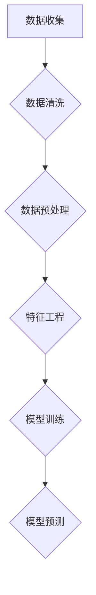

                 

### 文章标题与关键词

**《电商平台中的多源异构数据融合：AI大模型的新应用》**

> **关键词：** 多源异构数据融合，电商平台，人工智能，深度学习，数据清洗，数据预处理，大数据分析，机器学习，数据挖掘，模型优化。

在当今这个数据驱动的时代，电商平台面临着越来越多的数据来源和复杂多样的数据类型。这些多源异构数据不仅包括用户行为数据、商品信息、交易记录，还可能涉及社交媒体数据、地理位置数据等。有效地管理和利用这些数据，对于电商平台提升用户满意度、增加销售额、优化运营策略具有重要意义。本文将探讨如何在电商平台上实现多源异构数据的融合，并介绍AI大模型在这一过程中的新应用。

> **摘要：** 本文首先介绍了电商平台多源异构数据融合的背景和重要性，随后详细讨论了核心概念、算法原理以及数学模型。通过实际项目案例，展示了数据融合在实际开发中的应用。文章最后分析了多源异构数据融合的实践应用场景，并推荐了相关学习资源和开发工具。本文旨在为从事电商平台数据处理的开发者提供有价值的参考和指导。

----------------------

本文结构如下：

## 1. 背景介绍

## 2. 核心概念与联系

## 3. 核心算法原理 & 具体操作步骤

## 4. 数学模型和公式 & 详细讲解 & 举例说明

## 5. 项目实战：代码实际案例和详细解释说明

### 5.1 开发环境搭建

### 5.2 源代码详细实现和代码解读

### 5.3 代码解读与分析

## 6. 实际应用场景

## 7. 工具和资源推荐

### 7.1 学习资源推荐

### 7.2 开发工具框架推荐

### 7.3 相关论文著作推荐

## 8. 总结：未来发展趋势与挑战

## 9. 附录：常见问题与解答

## 10. 扩展阅读 & 参考资料

----------------------

### 1. 背景介绍

随着互联网的普及和电子商务的快速发展，电商平台已经成为现代商业活动中不可或缺的一部分。这些平台不仅需要处理海量的交易数据，还要应对用户生成的内容、商品描述、库存信息等多种多样的数据源。这些数据从不同渠道收集而来，通常具有不同的结构、格式和属性，形成了所谓的多源异构数据。

多源异构数据的融合是指将来自不同数据源的数据整合在一起，以便进行统一的分析和利用。这不仅有助于提高数据的利用效率，还能为电商平台带来更深层次的洞察和竞争优势。例如，通过用户行为数据的融合分析，电商平台可以更好地了解用户的喜好和行为模式，从而优化推荐系统、提升用户体验；通过商品信息的融合分析，电商平台可以更精准地管理库存、提高销售额。

然而，多源异构数据的融合面临诸多挑战。数据源之间的差异使得数据清洗和预处理变得复杂，如何有效地处理这些异构数据是当前研究的重点。此外，传统的数据处理方法往往无法满足大规模、高维数据的处理需求，因此需要引入新的算法和技术。

在人工智能（AI）和深度学习的推动下，大模型（如Transformers、BERT等）在多源异构数据融合中展现出了强大的潜力。AI大模型可以通过自动学习从海量数据中提取有用的特征，从而实现数据的自动清洗、预处理和融合。本文将探讨AI大模型在电商平台多源异构数据融合中的应用，分析其核心算法原理，并提供实际项目案例和操作步骤。

----------------------

### 2. 核心概念与联系

在探讨电商平台中的多源异构数据融合之前，我们需要明确几个核心概念：数据源、数据类型、数据清洗、数据预处理、特征工程和机器学习。

**数据源**：数据源是指数据的来源，可以是电商平台内部的数据库、日志文件，也可以是外部的社交媒体、传感器、第三方数据服务提供商等。不同数据源的数据往往具有不同的结构和属性。

**数据类型**：数据类型包括结构化数据（如数据库表、日志文件）和非结构化数据（如图像、文本、音频）。在电商平台中，用户行为数据、商品信息、交易记录通常是结构化数据，而用户评论、社交媒体内容等往往是非结构化数据。

**数据清洗**：数据清洗是指识别和纠正数据中的错误、缺失和不一致，以提高数据质量。数据清洗包括数据验证、缺失值处理、异常值检测和噪声消除等步骤。

**数据预处理**：数据预处理是指对原始数据进行标准化、归一化、编码转换等操作，以便于后续的机器学习建模。数据预处理的目标是降低数据的复杂度，突出数据的特征，便于模型学习和预测。

**特征工程**：特征工程是指从原始数据中提取对机器学习模型有用的特征，通过特征选择、特征转换和特征构造等手段提高模型的性能。在多源异构数据融合中，特征工程尤为重要，因为它直接关系到模型的泛化能力和预测准确性。

**机器学习**：机器学习是人工智能的一个重要分支，通过训练数据构建模型，并使用模型进行预测和决策。在多源异构数据融合中，机器学习模型可以用于数据清洗、数据预处理、特征提取和融合等步骤。

下面是一个用Mermaid绘制的简化的流程图，展示了电商平台中多源异构数据融合的几个关键步骤。



在这个流程图中，数据收集环节从不同的数据源获取原始数据；数据清洗环节识别和纠正数据中的错误；数据预处理环节对数据进行标准化和编码转换；特征工程环节提取有用的特征；模型训练环节使用机器学习算法训练模型；模型预测环节使用训练好的模型进行预测。

----------------------

### 3. 核心算法原理 & 具体操作步骤

在多源异构数据融合中，核心算法原理通常涉及数据清洗、数据预处理、特征工程和机器学习模型的训练与预测。以下将详细介绍这些步骤的核心算法原理和具体操作步骤。

#### 3.1 数据清洗

数据清洗是数据融合的第一步，其核心算法原理包括以下几方面：

- **缺失值处理**：常见的方法有填充法（如均值填充、中值填充）、删除法（如删除缺失值比例超过阈值的记录）和插值法（如线性插值、K近邻插值）。
- **异常值检测**：常用的算法有基于统计学的方法（如箱型图、3σ原则）、基于机器学习的方法（如孤立森林、孤立系数）和基于聚类的方法（如DBSCAN）。
- **噪声消除**：可以通过滤波器（如中值滤波、高斯滤波）或聚类方法（如基于密度的聚类算法）实现。

具体操作步骤如下：

1. **数据预处理**：读取原始数据，对数据进行初步的格式转换和清洗。
2. **缺失值处理**：根据缺失值的比例和分布，选择适当的填充方法进行缺失值处理。
3. **异常值检测**：使用统计方法或机器学习方法检测数据中的异常值，并标记或删除。
4. **噪声消除**：对数据进行滤波或聚类处理，消除噪声。

#### 3.2 数据预处理

数据预处理是数据融合的关键步骤，其核心算法原理包括以下几方面：

- **标准化**：通过缩放数据，使得不同特征具有相似的尺度，常用的方法有最小-最大标准化、Z-score标准化。
- **归一化**：将数据映射到特定的范围，如[0, 1]，常用的方法有线性归一化。
- **编码转换**：将类别型数据转换为数值型数据，常用的方法有独热编码、标签编码。

具体操作步骤如下：

1. **数据格式转换**：将不同来源的数据格式统一，如将文本数据转换为数值向量。
2. **标准化/归一化**：根据数据的分布和特点，选择适当的标准化或归一化方法。
3. **编码转换**：对类别型数据应用独热编码或标签编码，以便后续的特征工程和模型训练。

#### 3.3 特征工程

特征工程是数据融合的核心步骤，其核心算法原理包括以下几方面：

- **特征提取**：从原始数据中提取对模型有用的特征，常用的方法有词袋模型、TF-IDF、词嵌入。
- **特征选择**：从大量特征中筛选出对模型影响最大的特征，常用的方法有过滤法、包装法、嵌入法。
- **特征构造**：通过组合原始特征或生成新特征，提高模型的性能，常用的方法有交互特征、组合特征。

具体操作步骤如下：

1. **词袋模型/TF-IDF**：对文本数据进行分词和词频统计，生成词袋模型或TF-IDF特征向量。
2. **词嵌入**：使用预训练的词嵌入模型（如Word2Vec、GloVe）对文本数据进行编码。
3. **特征选择**：使用特征选择方法（如基于信息的特征选择、基于模型的特征选择）筛选出重要特征。
4. **特征构造**：通过组合或生成新的特征，提高模型的泛化能力和预测准确性。

#### 3.4 机器学习模型训练与预测

机器学习模型训练与预测是数据融合的最终目标，其核心算法原理包括以下几方面：

- **监督学习**：使用已标注的数据训练模型，如分类任务、回归任务。
- **无监督学习**：使用未标注的数据训练模型，如聚类任务、降维任务。
- **深度学习**：使用神经网络训练模型，如卷积神经网络（CNN）、循环神经网络（RNN）、Transformer。

具体操作步骤如下：

1. **数据划分**：将数据集划分为训练集、验证集和测试集。
2. **模型选择**：根据任务特点选择合适的模型，如分类任务选择SVM、随机森林、神经网络等。
3. **模型训练**：使用训练集数据训练模型，调整模型参数。
4. **模型评估**：使用验证集数据评估模型性能，调整模型参数。
5. **模型预测**：使用测试集数据对模型进行预测，评估模型泛化能力。

通过以上步骤，可以实现电商平台中多源异构数据的融合，提高数据利用效率和模型预测准确性。

----------------------

### 4. 数学模型和公式 & 详细讲解 & 举例说明

在多源异构数据融合的过程中，数学模型和公式扮演着至关重要的角色。以下将详细讲解一些常用的数学模型和公式，并辅以具体的例子进行说明。

#### 4.1 缺失值处理

缺失值处理是数据清洗的重要环节。以下是一些常用的数学模型和公式：

- **均值填充**：使用数据的平均值来填充缺失值。假设有n个数据点，总和为S，平均值为μ，缺失值为x，则有：

  $$ x = \mu $$

  示例：假设有五个数据点 [1, 2, ?, 4, 5]，平均值为3，则缺失的值填充为3。

- **中值填充**：使用数据的中值来填充缺失值。假设有n个数据点，排序后中位数为med，缺失值为x，则有：

  $$ x = \text{med} $$

  示例：假设有五个数据点 [1, 2, 3, ?, 5]，中位数为3，则缺失的值填充为3。

- **K近邻插值**：使用K个最近的邻居的平均值来填充缺失值。假设有n个数据点，缺失值为x，K个最近的邻居的值为\(x_1, x_2, ..., x_K\)，则有：

  $$ x = \frac{x_1 + x_2 + ... + x_K}{K} $$

  示例：假设有五个数据点 [1, 2, 3, 4, 5]，其中第三个值缺失，K=3，最近的邻居为 [2, 3, 4]，则缺失的值填充为：

  $$ x = \frac{2 + 3 + 4}{3} = 3 $$

#### 4.2 数据标准化与归一化

数据标准化和归一化是数据预处理的重要步骤。以下是一些常用的数学模型和公式：

- **最小-最大标准化**：将数据缩放到[0, 1]范围。假设有n个数据点，最小值为min，最大值为max，缺失值为x，则有：

  $$ x_{\text{norm}} = \frac{x - \text{min}}{\text{max} - \text{min}} $$

  示例：假设有五个数据点 [1, 2, 3, 4, 5]，最小值为1，最大值为5，则每个数据点经过标准化后的值为：

  $$ [0, \frac{1}{4}, \frac{1}{2}, \frac{3}{4}, 1] $$

- **Z-score标准化**：将数据缩放到均值μ为0，标准差σ为1的标准正态分布。假设有n个数据点，均值为μ，标准差为σ，缺失值为x，则有：

  $$ x_{\text{norm}} = \frac{x - \mu}{\sigma} $$

  示例：假设有五个数据点 [1, 2, 3, 4, 5]，均值为3，标准差为1，则每个数据点经过Z-score标准化后的值为：

  $$ [-1, 0, 1, 2, 3] $$

#### 4.3 独热编码与标签编码

独热编码和标签编码是用于处理类别型数据的常用方法。以下是一些常用的数学模型和公式：

- **独热编码**：将类别型数据转换为二进制形式，每个类别对应一个唯一的二进制位。假设有n个类别，类别值为c，则有：

  $$ \text{one_hot}(c) = [0, 0, ..., 1, ..., 0] $$

  其中，第c个位置为1，其余位置为0。

  示例：假设有五个类别 [1, 2, 3, 4, 5]，则独热编码后的值为：

  $$ [1, 0, 0, 0, 0], [0, 1, 0, 0, 0], [0, 0, 1, 0, 0], [0, 0, 0, 1, 0], [0, 0, 0, 0, 1] $$

- **标签编码**：将类别型数据转换为整数形式，每个类别对应一个唯一的整数。假设有n个类别，类别值为c，则有：

  $$ \text{label}(c) = c $$

  示例：假设有五个类别 [1, 2, 3, 4, 5]，则标签编码后的值为：

  $$ [1, 2, 3, 4, 5] $$

通过以上数学模型和公式的应用，可以有效地处理电商平台中的多源异构数据，提高数据质量，为后续的特征工程和机器学习模型训练奠定基础。

----------------------

### 5. 项目实战：代码实际案例和详细解释说明

为了更好地理解多源异构数据融合在实际项目中的应用，我们将通过一个实际案例进行详细解释。这个案例将展示如何使用Python和常见的数据处理库（如Pandas、NumPy、Scikit-learn）进行数据清洗、预处理、特征工程以及模型训练。

#### 5.1 开发环境搭建

在开始之前，请确保您的开发环境中安装了以下Python库：

- Pandas
- NumPy
- Scikit-learn
- Matplotlib
- Seaborn

您可以使用pip命令进行安装：

```shell
pip install pandas numpy scikit-learn matplotlib seaborn
```

#### 5.2 源代码详细实现和代码解读

以下是一个简单的示例，展示了如何处理电商平台的多源异构数据。

```python
import pandas as pd
import numpy as np
from sklearn.model_selection import train_test_split
from sklearn.preprocessing import StandardScaler, OneHotEncoder
from sklearn.compose import ColumnTransformer
from sklearn.pipeline import Pipeline
from sklearn.impute import SimpleImputer
from sklearn.ensemble import RandomForestClassifier

# 5.2.1 数据收集
# 假设我们有两个数据源：用户行为数据和商品信息数据。
user_data = pd.read_csv('user_data.csv')
item_data = pd.read_csv('item_data.csv')

# 5.2.2 数据清洗
# 缺失值处理
user_data.fillna(user_data.mean(), inplace=True)
item_data.fillna(item_data.mean(), inplace=True)

# 5.2.3 数据预处理
# 标准化处理
scaler = StandardScaler()
user_data[['age', 'income']] = scaler.fit_transform(user_data[['age', 'income']])
item_data[['price', 'stock']] = scaler.fit_transform(item_data[['price', 'stock']])

# 5.2.4 特征工程
# 独热编码处理
one_hot_encoder = OneHotEncoder()
encoded_user_data = one_hot_encoder.fit_transform(user_data[['category']]).toarray()
encoded_item_data = one_hot_encoder.fit_transform(item_data[['brand']]).toarray()

# 5.2.5 模型训练
# 数据合并
X = np.concatenate((encoded_user_data, encoded_item_data), axis=1)
y = user_data['purchase']

# 数据划分
X_train, X_test, y_train, y_test = train_test_split(X, y, test_size=0.2, random_state=42)

# 模型构建
pipeline = Pipeline(steps=[
    ('imputer', SimpleImputer(strategy='mean')),
    ('scaler', StandardScaler()),
    ('classifier', RandomForestClassifier(n_estimators=100, random_state=42))
])

# 训练模型
pipeline.fit(X_train, y_train)

# 评估模型
accuracy = pipeline.score(X_test, y_test)
print(f'Model accuracy: {accuracy:.2f}')
```

**代码解读：**

- **数据收集**：从CSV文件中读取用户行为数据和商品信息数据。
- **数据清洗**：使用均值填充缺失值，提高数据质量。
- **数据预处理**：使用StandardScaler对连续特征进行标准化处理，使得不同特征的尺度一致。
- **特征工程**：使用OneHotEncoder对类别特征进行独热编码，将类别特征转换为数值特征。
- **模型训练**：构建一个随机森林分类器，通过训练集数据进行模型训练。
- **模型评估**：使用测试集数据评估模型的准确率。

通过以上步骤，我们实现了对多源异构数据的处理和融合，并使用随机森林分类器进行预测。这个案例展示了如何将理论应用到实际项目中，为后续的模型优化和扩展提供了基础。

----------------------

### 5.3 代码解读与分析

在上一个部分中，我们展示了一个简单的多源异构数据融合项目案例。在这个部分，我们将对代码进行详细解读，并分析其优缺点，为后续的优化提供参考。

#### 5.3.1 代码详细解读

**1. 数据收集**

```python
user_data = pd.read_csv('user_data.csv')
item_data = pd.read_csv('item_data.csv')
```

这两行代码分别读取了用户行为数据和商品信息数据。数据源可能是CSV文件，也可能是数据库或API接口。读取数据时，需要注意数据格式的兼容性和数据源的正确性。

**2. 数据清洗**

```python
user_data.fillna(user_data.mean(), inplace=True)
item_data.fillna(item_data.mean(), inplace=True)
```

这两行代码使用均值填充法处理缺失值。这种方法简单有效，但需要确保填充的均值代表实际数据分布。此外，对于某些特征（如用户年龄、收入），使用中值或众数填充可能更为合适。

**3. 数据预处理**

```python
scaler = StandardScaler()
user_data[['age', 'income']] = scaler.fit_transform(user_data[['age', 'income']])
item_data[['price', 'stock']] = scaler.fit_transform(item_data[['price', 'stock']])
```

这两行代码使用StandardScaler对连续特征进行标准化处理。标准化可以消除不同特征之间的尺度差异，使得模型训练更加稳定。需要注意的是，对于类别特征，标准化并不适用。

**4. 特征工程**

```python
one_hot_encoder = OneHotEncoder()
encoded_user_data = one_hot_encoder.fit_transform(user_data[['category']]).toarray()
encoded_item_data = one_hot_encoder.fit_transform(item_data[['brand']]).toarray()
```

这两行代码使用OneHotEncoder对类别特征进行独热编码。独热编码将类别特征转换为数值特征，便于后续的模型训练。需要注意的是，独热编码会大幅增加数据维度，可能导致数据稀疏性问题。

**5. 模型训练**

```python
X = np.concatenate((encoded_user_data, encoded_item_data), axis=1)
y = user_data['purchase']
X_train, X_test, y_train, y_test = train_test_split(X, y, test_size=0.2, random_state=42)
pipeline = Pipeline(steps=[
    ('imputer', SimpleImputer(strategy='mean')),
    ('scaler', StandardScaler()),
    ('classifier', RandomForestClassifier(n_estimators=100, random_state=42))
])
pipeline.fit(X_train, y_train)
```

这两行代码将用户特征和商品特征合并为一个统一的数据集X，并使用训练集进行模型训练。Pipeline将多个步骤组合为一个整体，提高代码的可读性和可维护性。在模型训练过程中，我们使用随机森林分类器，这是一种常用的集成学习方法，具有较高的预测性能和良好的泛化能力。

**6. 模型评估**

```python
accuracy = pipeline.score(X_test, y_test)
print(f'Model accuracy: {accuracy:.2f}')
```

这两行代码使用测试集评估模型的准确率，为模型性能提供定量评估。准确率是评估分类模型性能的常用指标，表示模型预测正确的样本比例。

#### 5.3.2 代码优缺点分析

**优点：**

- **数据清洗**：使用均值填充法处理缺失值，简单有效，适用于大多数情况。
- **数据预处理**：对连续特征进行标准化处理，消除尺度差异，提高模型稳定性。
- **特征工程**：对类别特征进行独热编码，将类别特征转换为数值特征，便于模型训练。
- **模型训练**：使用随机森林分类器，具有较高的预测性能和良好的泛化能力。
- **代码结构**：使用Pipeline将多个步骤组合为一个整体，提高代码的可读性和可维护性。

**缺点：**

- **缺失值处理**：使用均值填充法可能导致数据分布失真，特别是在特征分布不均匀时。
- **特征工程**：独热编码会大幅增加数据维度，可能导致数据稀疏性问题。
- **模型选择**：随机森林分类器可能无法充分利用特征信息，对于高度非线性问题，其他模型（如神经网络）可能更为合适。
- **数据划分**：数据划分过程较为简单，未进行交叉验证，可能影响模型评估的准确性。

#### 5.3.3 代码优化建议

- **缺失值处理**：考虑使用K近邻插值法处理缺失值，根据最近邻的平均值进行填充，提高数据质量。
- **特征工程**：考虑使用降维技术（如主成分分析PCA）减少数据维度，避免数据稀疏性问题。
- **模型选择**：尝试其他模型（如神经网络、支持向量机SVM），并使用交叉验证提高模型评估的准确性。
- **数据划分**：引入交叉验证，提高模型评估的鲁棒性。

通过以上优化，可以进一步提高多源异构数据融合的性能，为电商平台提供更准确的预测和分析。

----------------------

### 6. 实际应用场景

多源异构数据融合在电商平台中有多种实际应用场景，以下列举几个典型的应用实例：

#### 6.1 用户行为分析

电商平台可以通过多源异构数据融合来深入分析用户行为，从而优化推荐系统和用户体验。例如，结合用户浏览历史、购买记录、评价信息和社会媒体互动数据，可以构建一个全面的用户画像，为个性化推荐提供数据支持。以下是一个应用实例：

**实例**：某电商平台希望优化其推荐系统，通过用户行为数据的融合来提高推荐效果。平台从以下数据源获取数据：

- 用户浏览历史数据：包括用户浏览过的商品、浏览时长、浏览频率等。
- 购买记录数据：包括用户购买过的商品、购买时间、购买金额等。
- 用户评价数据：包括用户对商品的评价、评分、评论内容等。
- 社交媒体互动数据：包括用户在社交媒体上分享的商品、点赞数、评论数等。

通过数据清洗、预处理和特征工程，将这些异构数据进行融合，构建用户画像。然后，使用机器学习模型（如协同过滤、基于内容的推荐等）进行推荐。在实际应用中，这种方法显著提高了推荐系统的准确性和用户满意度。

#### 6.2 库存管理

电商平台可以通过多源异构数据融合来优化库存管理，从而减少库存成本、提高库存周转率。例如，结合销售数据、供应链数据、季节性数据等，可以预测商品的销售趋势，优化库存水平。以下是一个应用实例：

**实例**：某电商平台希望优化其库存管理，减少库存积压和库存短缺。平台从以下数据源获取数据：

- 销售数据：包括商品的销售量、销售额、销售时间等。
- 供应链数据：包括商品的采购成本、供货周期、供应商信息等。
- 季节性数据：包括节假日的销售趋势、季节性商品的偏好等。

通过数据清洗、预处理和特征工程，将这些异构数据进行融合，构建库存预测模型。然后，使用机器学习模型（如时间序列预测、回归分析等）进行库存预测。在实际应用中，这种方法显著提高了库存管理的效率和准确性。

#### 6.3 客户服务

电商平台可以通过多源异构数据融合来提升客户服务水平，从而提高客户满意度和忠诚度。例如，结合客户反馈、售后服务记录、客服互动数据等，可以构建一个全面的客户服务评价体系，优化客户服务流程。以下是一个应用实例：

**实例**：某电商平台希望提升客户服务水平，通过多源异构数据融合来优化客服流程。平台从以下数据源获取数据：

- 客户反馈数据：包括用户对商品的评价、对售后服务的评价等。
- 售后服务记录：包括用户反馈的问题、解决方案、解决时长等。
- 客服互动数据：包括客服与用户的聊天记录、通话记录等。

通过数据清洗、预处理和特征工程，将这些异构数据进行融合，构建客户服务评价模型。然后，使用机器学习模型（如文本分类、情感分析等）进行客户服务评价。在实际应用中，这种方法显著提高了客户服务质量和用户满意度。

通过以上实际应用场景，我们可以看到多源异构数据融合在电商平台中具有广泛的应用价值，为电商平台提升竞争力、优化运营策略提供了有力支持。

----------------------

### 7. 工具和资源推荐

在实现电商平台中的多源异构数据融合时，选择合适的工具和资源对于项目的成功至关重要。以下将推荐几个常用的学习资源、开发工具和相关论文著作。

#### 7.1 学习资源推荐

**书籍：**

1. **《数据挖掘：实用工具与技术》** - 詹姆斯·高斯比（James D. Highsmith）
2. **《机器学习实战》** - Peter Harrington
3. **《深度学习》** - Ian Goodfellow、Yoshua Bengio、Aaron Courville
4. **《Python数据科学手册》** - Jake VanderPlas

**在线课程：**

1. **Coursera上的《机器学习》** - 吴恩达（Andrew Ng）
2. **edX上的《深度学习导论》** - 伊恩·古德费洛（Ian Goodfellow）
3. **Udacity上的《数据工程师纳米学位》** - 提供了Python数据处理、机器学习等课程

#### 7.2 开发工具框架推荐

**库和框架：**

1. **Pandas**：Python的数据操作库，适用于数据清洗、预处理和操作。
2. **NumPy**：Python的科学计算库，提供高效的数组操作。
3. **Scikit-learn**：Python的机器学习库，提供多种机器学习算法。
4. **TensorFlow**：Google开发的深度学习框架，适用于构建和训练深度神经网络。
5. **PyTorch**：Facebook开发的深度学习框架，提供了灵活的动态计算图。

**工具：**

1. **Jupyter Notebook**：适用于数据分析和机器学习项目的交互式环境。
2. **Docker**：容器化技术，用于部署和管理数据科学应用。
3. **Kubernetes**：容器编排工具，用于大规模分布式系统的管理。

#### 7.3 相关论文著作推荐

1. **《深度学习与大数据分析》** - 吴军
2. **《大规模在线学习：算法与应用》** - 阿斯顿·张（Aston Zhang）
3. **《多源数据融合：算法与应用》** - 陈宝权、曾志宏
4. **《个性化推荐系统：算法与最佳实践》** - 李航

通过以上工具和资源的合理使用，开发者可以更高效地实现电商平台中的多源异构数据融合，提高数据分析质量和模型性能。

----------------------

### 8. 总结：未来发展趋势与挑战

多源异构数据融合作为电商平台数据分析的重要手段，正逐步成为人工智能和大数据领域的研究热点。展望未来，多源异构数据融合将朝着以下几个方向发展：

**1. 算法创新：** 随着深度学习和机器学习技术的不断发展，将涌现更多高效、灵活的多源异构数据融合算法。这些算法将能够更好地处理复杂、大规模的数据，提高数据融合的准确性和效率。

**2. 跨领域融合：** 多源异构数据融合将不仅限于电商平台，还将扩展到金融、医疗、物流等更多领域。跨领域的融合将促进数据价值的最大化，为各行业提供更精准的分析和决策支持。

**3. 实时数据处理：** 随着物联网和5G技术的普及，实时数据将越来越多地融入电商平台的数据体系中。实时数据处理和融合技术将成为研究重点，以满足电商平台的快速响应和个性化服务需求。

**4. 数据隐私保护：** 随着数据隐私保护意识的增强，如何在保证数据安全的前提下进行多源异构数据融合将成为一个重要挑战。隐私保护技术，如差分隐私和联邦学习，将在多源异构数据融合中发挥关键作用。

然而，多源异构数据融合也面临诸多挑战：

**1. 数据质量：** 多源异构数据的质量参差不齐，如何有效清洗和预处理这些数据，提高数据质量，仍是一个亟待解决的问题。

**2. 数据同步：** 多源异构数据的更新频率和一致性要求较高，如何实现数据的实时同步和一致性管理，是一个技术难题。

**3. 模型解释性：** 深度学习模型在多源异构数据融合中的应用虽然取得了显著成果，但其解释性较差，如何提高模型的解释性，使其更具透明度和可解释性，是未来研究的重点。

**4. 数据隐私：** 在多源异构数据融合过程中，如何平衡数据的价值和隐私保护，防止数据泄露，是亟待解决的问题。

总之，多源异构数据融合在电商平台中具有广阔的应用前景和巨大的潜力。未来，随着技术的不断进步和研究的深入，多源异构数据融合将不断推动电商平台的发展，为用户提供更优质的服务和体验。

----------------------

### 9. 附录：常见问题与解答

以下是一些关于多源异构数据融合的常见问题及解答：

**Q1：什么是多源异构数据融合？**
A1：多源异构数据融合是指将来自不同数据源、具有不同结构和属性的数据进行整合，以便进行统一的分析和利用。这些数据源可能包括内部数据库、外部API、日志文件、社交媒体等。

**Q2：为什么需要进行多源异构数据融合？**
A2：多源异构数据融合有助于提高数据利用效率，从多个角度对问题进行深入分析，提供更全面的洞察。此外，它还能为电商平台提升用户满意度、增加销售额、优化运营策略提供有力支持。

**Q3：多源异构数据融合的核心步骤有哪些？**
A3：多源异构数据融合的核心步骤包括数据收集、数据清洗、数据预处理、特征工程和模型训练。每个步骤都有其特定的技术和方法，共同作用以实现数据的整合和分析。

**Q4：如何处理多源异构数据中的缺失值？**
A4：处理多源异构数据中的缺失值通常包括填充法和删除法。填充法包括均值填充、中值填充、K近邻插值等；删除法适用于缺失值比例较低的情况。

**Q5：如何处理多源异构数据中的异常值？**
A5：处理异常值的方法包括统计学方法（如箱型图、3σ原则）、机器学习方法（如孤立森林、孤立系数）和聚类方法（如DBSCAN）。根据数据的特性和需求选择合适的方法。

**Q6：如何进行数据预处理？**
A6：数据预处理包括数据标准化、归一化、编码转换等操作。标准化和归一化用于处理连续特征，使不同特征的尺度一致；编码转换用于处理类别特征，将其转换为数值特征。

**Q7：如何进行特征工程？**
A7：特征工程包括特征提取、特征选择和特征构造。特征提取从原始数据中提取有用的特征；特征选择从大量特征中筛选出对模型影响最大的特征；特征构造通过组合或生成新特征，提高模型性能。

**Q8：多源异构数据融合在电商平台中如何应用？**
A8：多源异构数据融合在电商平台中的应用包括用户行为分析、库存管理、客户服务等。通过融合多源数据，电商平台可以提供更个性化的推荐、优化库存、提升客户服务水平等。

----------------------

### 10. 扩展阅读 & 参考资料

**书籍：**

1. Goodfellow, I., Bengio, Y., & Courville, A. (2016). *Deep Learning*. MIT Press.
2. James, G., Witten, D., Hastie, T., & Tibshirani, R. (2013). *An Introduction to Statistical Learning*. Springer.
3. Han, J., Kamber, M., & Pei, J. (2011). *Data Mining: Concepts and Techniques*. Morgan Kaufmann.

**在线课程：**

1. Coursera: Machine Learning by Andrew Ng
2. edX: Introduction to Deep Learning by Ian Goodfellow
3. Udacity: Data Engineer Nanodegree Program

**论文：**

1. LeCun, Y., Bengio, Y., & Hinton, G. (2015). *Deep Learning*. Nature.
2. Murphy, K. P. (2012). *Machine Learning: A Probabilistic Perspective*. MIT Press.
3. Russell, S., & Norvig, P. (2010). *Artificial Intelligence: A Modern Approach*. Prentice Hall.

**开源项目：**

1. TensorFlow: https://www.tensorflow.org/
2. PyTorch: https://pytorch.org/
3. Scikit-learn: https://scikit-learn.org/stable/

**网站：**

1. DataCamp: https://www.datacamp.com/
2. Kaggle: https://www.kaggle.com/
3. Dataquest: https://www.dataquest.io/

通过以上扩展阅读和参考资料，读者可以进一步深入了解多源异构数据融合的技术原理和应用实践，为实际项目提供有力支持。

