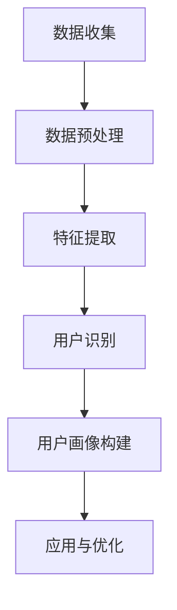

                 

### 背景介绍

随着电子商务的快速发展，电商平台在商业世界中扮演着越来越重要的角色。用户数量的激增和交易频次的增加，使得电商平台必须面对一个重要的挑战：如何在众多用户中准确识别并区分每个用户。这不仅有助于提升用户体验，还能为平台提供有价值的用户行为数据，进而优化营销策略和运营效率。

跨渠道用户识别技术正是为了应对这一挑战而发展起来的一项关键技术。它旨在通过分析用户在不同渠道（如网站、移动应用、社交媒体等）的行为数据，实现对同一用户在不同渠道上的识别和统一。这种技术的核心目标在于解决“同一用户在不同渠道上的行为是否可以关联起来”的问题，从而为电商平台提供更为精准的用户画像，为后续的用户行为分析、个性化推荐、广告投放等提供支持。

本文将深入探讨跨渠道用户识别技术的核心概念、算法原理、数学模型以及实际应用案例。首先，我们将介绍跨渠道用户识别技术的基本概念和意义，接着详细解释其工作原理和主要技术方法，然后通过一个具体的项目实战案例展示其实现过程和关键代码解读，最后讨论该技术在实际应用场景中的表现和未来发展趋势。通过这篇文章，希望读者能够全面了解并掌握跨渠道用户识别技术的核心要点，为后续研究和实践提供参考。

### 核心概念与联系

跨渠道用户识别技术涉及多个核心概念，这些概念相互联系，构成了整个技术体系的基础。首先，让我们定义一些关键术语，以便更好地理解后续内容。

1. **用户渠道（User Channels）**：用户渠道是指用户进行互动的平台或方式，如电商平台网站、移动应用、社交媒体、电子邮件等。每个渠道都有其独特的交互方式和用户行为数据。

2. **用户行为（User Behavior）**：用户行为是指用户在使用不同渠道时产生的各种交互活动，包括浏览页面、购买商品、点击广告、评论分享等。这些行为数据可以反映用户的兴趣、需求和偏好。

3. **用户画像（User Profiling）**：用户画像是对用户特征的综合描述，通常包括用户的基本信息（如年龄、性别、地理位置）、兴趣爱好、行为习惯等。通过构建用户画像，可以更好地了解和预测用户的需求和行为。

4. **跨渠道用户识别（Cross-Channel User Recognition）**：跨渠道用户识别是指通过分析用户在不同渠道上的行为数据，识别出同一用户在不同渠道上的行为关联性，从而实现用户的统一识别。

理解这些核心概念后，我们可以进一步探讨它们之间的联系。跨渠道用户识别技术的工作流程通常包括以下几个步骤：

1. **数据收集**：首先，电商平台需要收集用户在不同渠道上的行为数据，如浏览历史、购买记录、点击行为等。这些数据通常以日志文件、数据库记录等形式存储。

2. **数据预处理**：收集到的数据通常需要进行清洗、去重、归一化等预处理操作，以确保数据的质量和一致性。这一步骤是跨渠道用户识别的基础。

3. **特征提取**：在预处理后的数据中提取有助于用户识别的特征。这些特征可以包括用户的浏览习惯、购买偏好、地理位置、设备信息等。特征提取的质量直接影响用户识别的准确性。

4. **用户识别**：利用提取的特征，通过算法模型对用户进行识别和关联。常见的算法包括基于用户行为相似度的聚类算法、基于机器学习的分类算法等。

5. **用户画像构建**：将识别出的用户信息进行整合，构建详细的用户画像。这个画像不仅包含用户的基本信息，还包括用户的兴趣偏好和行为习惯。

6. **应用与优化**：利用用户画像进行个性化推荐、广告投放、用户行为分析等应用。同时，根据实际应用效果不断优化算法和模型，提高识别的准确性和效率。

为了更好地展示跨渠道用户识别技术的架构和流程，我们可以使用Mermaid流程图进行说明。以下是一个简单的Mermaid流程图示例：



在这个流程图中，各节点分别代表跨渠道用户识别技术的主要步骤。通过这个流程，我们可以清晰地看到用户数据从收集到应用的全过程，以及各个环节之间的联系。

### 核心算法原理 & 具体操作步骤

在了解跨渠道用户识别技术的基本概念和架构后，接下来我们将深入探讨其核心算法原理和具体操作步骤。跨渠道用户识别技术的算法设计需要充分考虑用户行为数据的多样性和复杂性，同时确保高准确性和高效性。本文将介绍几种常见的算法，并详细描述其原理和实现步骤。

#### 1. 基于用户行为相似度的算法

基于用户行为相似度的算法是跨渠道用户识别技术中最常用的方法之一。这种方法的核心思想是通过计算用户在不同渠道上的行为相似度，识别出同一用户在不同渠道上的行为关联性。

##### 1.1 算法原理

该算法基于以下假设：如果两个用户在同一渠道上的行为相似，那么他们可能在其他渠道上也是同一用户。具体来说，用户行为相似度可以通过计算用户在不同渠道上的行为向量之间的余弦相似度来衡量。

设用户 $u$ 在渠道 $i$ 上的行为向量为 $v_i$，则用户 $u$ 在渠道 $i$ 和渠道 $j$ 上的行为相似度可以表示为：

$$
sim(i, j) = \frac{v_i \cdot v_j}{\|v_i\| \|v_j\|}
$$

其中，$v_i \cdot v_j$ 表示向量 $v_i$ 和 $v_j$ 的点积，$\|v_i\|$ 和 $\|v_j\|$ 分别表示向量 $v_i$ 和 $v_j$ 的模长。

##### 1.2 具体操作步骤

（1）**数据预处理**：收集用户在不同渠道上的行为数据，如浏览记录、购买记录等。将原始数据转换为行为向量，并统一数据格式。

（2）**特征提取**：对每个用户在不同渠道上的行为数据进行处理，提取特征向量。常用的特征提取方法包括TF-IDF、Word2Vec等。

（3）**相似度计算**：计算用户在不同渠道上的行为相似度。使用余弦相似度公式，计算用户在渠道 $i$ 和渠道 $j$ 上的行为相似度。

（4）**用户识别**：根据相似度阈值，识别出在不同渠道上具有较高相似度的用户对。通常，相似度大于设定阈值 $T$ 的用户对被认为是同一用户。

（5）**用户画像构建**：将识别出的用户信息进行整合，构建详细的用户画像。

#### 2. 基于机器学习的算法

基于机器学习的算法通过训练模型，自动识别用户在不同渠道上的行为关联性。这种方法具有较高的灵活性和准确性，适用于复杂的行为数据。

##### 2.1 算法原理

基于机器学习的算法通常包括以下几个步骤：

（1）**特征工程**：从原始行为数据中提取有代表性的特征，作为模型的输入。

（2）**模型训练**：使用标注好的训练数据集，训练分类模型，如决策树、随机森林、支持向量机等。

（3）**模型评估**：使用测试数据集评估模型的准确性，并根据评估结果调整模型参数。

（4）**用户识别**：将新用户的行为数据输入到训练好的模型中，预测其在不同渠道上的身份。

##### 2.2 具体操作步骤

（1）**数据预处理**：收集用户在不同渠道上的行为数据，并进行数据清洗和预处理。

（2）**特征提取**：根据业务需求和数据特点，选择合适的特征提取方法，如特征选择、特征融合等。

（3）**模型选择与训练**：选择适合的机器学习模型，如决策树、随机森林等，使用训练数据集进行模型训练。

（4）**模型评估与优化**：使用测试数据集评估模型准确性，并根据评估结果调整模型参数，优化模型性能。

（5）**用户识别**：将新用户的行为数据输入到训练好的模型中，预测其在不同渠道上的身份。

#### 3. 基于图论的算法

基于图论的算法通过构建用户行为数据的图结构，利用图论算法进行用户识别。这种方法能够较好地处理复杂的关系网络，适用于大规模用户数据。

##### 3.1 算法原理

基于图论的算法主要包括以下几个步骤：

（1）**图构建**：根据用户在不同渠道上的行为数据，构建用户行为图。图中的节点表示用户，边表示用户之间的关联关系。

（2）**图聚类**：使用图聚类算法，如社区检测、多层次聚类等，将用户行为图划分为多个社区或簇。

（3）**用户识别**：根据用户在图中的位置和社区关系，识别出同一用户在不同渠道上的行为关联性。

##### 3.2 具体操作步骤

（1）**数据预处理**：收集用户在不同渠道上的行为数据，并进行数据清洗和预处理。

（2）**图构建**：根据用户行为数据，构建用户行为图。将用户作为图的节点，用户之间的关联关系作为图的边。

（3）**图聚类**：使用图聚类算法，对用户行为图进行聚类，划分用户社区。

（4）**用户识别**：根据用户在图中的位置和社区关系，识别出同一用户在不同渠道上的行为关联性。

（5）**用户画像构建**：将识别出的用户信息进行整合，构建详细的用户画像。

通过以上算法原理和具体操作步骤的介绍，我们可以看到跨渠道用户识别技术涉及到多个领域的方法和技巧。在实际应用中，可以根据具体场景和需求，选择合适的算法进行用户识别，以提高识别的准确性和效率。

### 数学模型和公式 & 详细讲解 & 举例说明

在跨渠道用户识别技术中，数学模型和公式起着至关重要的作用。这些模型和公式不仅能够帮助我们理解和量化用户行为数据的复杂关系，还能为算法设计提供坚实的理论基础。以下，我们将详细介绍几个关键的数学模型和公式，并举例说明其在实际应用中的使用方法。

#### 1. 余弦相似度（Cosine Similarity）

余弦相似度是一种常用的度量两个向量之间相似性的方法，尤其在跨渠道用户识别技术中应用广泛。其公式如下：

$$
sim(i, j) = \frac{v_i \cdot v_j}{\|v_i\| \|v_j\|}
$$

其中，$v_i$ 和 $v_j$ 分别表示用户在渠道 $i$ 和渠道 $j$ 上的行为向量，$\|v_i\|$ 和 $\|v_j\|$ 分别表示这两个向量的模长，$v_i \cdot v_j$ 表示向量的点积。

**例子**：假设用户 $u$ 在渠道 $i$ 和渠道 $j$ 上的行为向量分别为 $v_i = (1, 2, 3)$ 和 $v_j = (2, 3, 4)$，则它们之间的余弦相似度可以计算如下：

$$
sim(i, j) = \frac{1 \times 2 + 2 \times 3 + 3 \times 4}{\sqrt{1^2 + 2^2 + 3^2} \times \sqrt{2^2 + 3^2 + 4^2}} = \frac{14}{\sqrt{14} \times \sqrt{29}} \approx 0.87
$$

这意味着用户在渠道 $i$ 和渠道 $j$ 上的行为相似度非常高。

#### 2. 模型损失函数（Model Loss Function）

在机器学习算法中，损失函数用于衡量模型预测结果与实际结果之间的差距。常用的损失函数包括均方误差（MSE）、交叉熵损失（Cross-Entropy Loss）等。以下是一个简单的均方误差损失函数公式：

$$
L(y, \hat{y}) = \frac{1}{2} \sum_{i=1}^{n} (y_i - \hat{y}_i)^2
$$

其中，$y$ 表示实际标签，$\hat{y}$ 表示模型预测值，$n$ 表示样本数量。

**例子**：假设我们有三个样本的预测值和实际标签，分别为 $(1, 2, 3)$ 和 $(1.1, 2.2, 2.9)$，则它们的均方误差损失可以计算如下：

$$
L = \frac{1}{2} \left[ (1 - 1.1)^2 + (2 - 2.2)^2 + (3 - 2.9)^2 \right] = \frac{1}{2} \left[ 0.01 + 0.04 + 0.09 \right] = 0.07
$$

这意味着模型的预测误差较小，表现良好。

#### 3. 决策树分类模型（Decision Tree Classification）

决策树是一种常见的机器学习模型，通过一系列条件判断来对数据进行分类。以下是一个简单的决策树分类模型公式：

$$
\begin{aligned}
&\text{if } x_1 > c_1 \text{ then } y = 1 \\
&\text{else if } x_2 < c_2 \text{ then } y = 0 \\
&\text{else } y = \text{default class}
\end{aligned}
$$

其中，$x_1$ 和 $x_2$ 分别表示特征值，$c_1$ 和 $c_2$ 表示阈值，$y$ 表示分类结果。

**例子**：假设我们有一个决策树模型，根据两个特征 $x_1$ 和 $x_2$ 对用户进行分类。如果 $x_1 > 5$ 则分类为1，否则如果 $x_2 < 3$ 则分类为0，否则分类为默认类别。对于用户数据 $(x_1, x_2) = (6, 2)$，则其分类结果为1。

通过以上数学模型和公式的介绍，我们可以看到跨渠道用户识别技术中数学工具的多样性和重要性。这些模型不仅帮助我们量化用户行为数据，还能为算法设计提供有力的支持。在实际应用中，可以根据具体需求和场景选择合适的模型和公式，优化跨渠道用户识别的准确性和效率。

### 项目实战：代码实际案例和详细解释说明

为了更直观地展示跨渠道用户识别技术的应用，我们将通过一个实际的项目实战来介绍整个实现过程，包括开发环境搭建、源代码实现和详细解释说明。这个项目将使用Python语言和几个常用的库，如Pandas、Scikit-learn和Matplotlib，来构建和训练一个基于用户行为相似度的识别模型。

#### 5.1 开发环境搭建

在开始项目之前，我们需要搭建一个合适的开发环境。以下是所需的环境和依赖包：

- Python 3.x 版本
- Pandas
- Scikit-learn
- Matplotlib
- Numpy

确保你的Python环境已经安装，并使用pip命令安装上述依赖包：

```bash
pip install pandas scikit-learn matplotlib numpy
```

#### 5.2 源代码详细实现和代码解读

下面是项目的主要代码实现，我们将逐段代码进行详细解释。

##### 5.2.1 数据收集和预处理

首先，我们需要收集用户在不同渠道上的行为数据，并进行预处理。以下是一个示例数据集，包含了用户的浏览记录和购买记录。

```python
import pandas as pd

# 加载数据集
data = pd.read_csv('user_behavior.csv')

# 数据清洗和预处理
# 1. 去除缺失值和重复记录
data.dropna(inplace=True)
data.drop_duplicates(subset=['user_id'], inplace=True)

# 2. 数据归一化
data['page_views'] = data['page_views'].apply(lambda x: x / max(data['page_views']))
data['purchases'] = data['purchases'].apply(lambda x: x / max(data['purchases']))
```

在这个步骤中，我们首先加载数据集，然后进行数据清洗和预处理，包括去除缺失值和重复记录，以及数据归一化。归一化是为了确保每个特征都在相同的尺度上，从而避免某些特征对模型训练产生过大的影响。

##### 5.2.2 特征提取

接下来，我们需要从预处理后的数据中提取特征，以便用于后续的模型训练。

```python
from sklearn.feature_extraction.text import TfidfVectorizer

# 使用TF-IDF提取特征
tfidf = TfidfVectorizer()
X = tfidf.fit_transform(data['page_views'])
y = data['user_id'].values

# 将特征和标签分开
X_train, X_test, y_train, y_test = train_test_split(X, y, test_size=0.2, random_state=42)
```

在这里，我们使用TF-IDF向量器对用户的浏览记录进行特征提取。TF-IDF是一种常用的文本特征提取方法，能够根据词频和文档频率为每个词语分配权重。然后，我们将特征和标签分开，并使用K折交叉验证将数据集划分为训练集和测试集。

##### 5.2.3 用户识别模型训练

接下来，我们将使用机器学习算法对用户识别模型进行训练。在这里，我们使用随机森林分类器，这是一种常用的集成学习算法，具有较强的预测能力。

```python
from sklearn.ensemble import RandomForestClassifier

# 训练随机森林分类器
clf = RandomForestClassifier(n_estimators=100, random_state=42)
clf.fit(X_train, y_train)

# 模型评估
accuracy = clf.score(X_test, y_test)
print(f"模型准确率：{accuracy:.2f}")
```

在这里，我们首先创建一个随机森林分类器实例，并使用训练数据集进行训练。然后，我们使用测试数据集评估模型的准确率。

##### 5.2.4 用户识别和结果可视化

最后，我们将使用训练好的模型对用户进行识别，并将识别结果可视化。

```python
import matplotlib.pyplot as plt

# 进行用户识别
predictions = clf.predict(X_test)

# 可视化识别结果
plt.figure(figsize=(10, 6))
plt.scatter(y_test, predictions)
plt.xlabel('实际标签')
plt.ylabel('预测标签')
plt.title('用户识别结果')
plt.show()
```

在这个步骤中，我们首先使用训练好的模型对测试数据进行预测，然后将实际标签和预测标签进行可视化。这有助于我们直观地了解模型的识别效果。

#### 5.3 代码解读与分析

1. **数据预处理**：数据预处理是模型训练的重要步骤，确保数据的质量和一致性。在这个项目中，我们首先去除缺失值和重复记录，然后对数据进行归一化，使得每个特征都在相同的尺度上。

2. **特征提取**：特征提取是将原始数据转换为模型可处理的特征向量的过程。在这里，我们使用TF-IDF向量器对用户的浏览记录进行特征提取，为后续的模型训练提供输入。

3. **模型训练**：模型训练是通过学习数据中的特征和标签之间的关系，构建预测模型。在这个项目中，我们使用随机森林分类器，这是一种强大的集成学习算法，具有较强的预测能力。

4. **模型评估**：模型评估是检验模型性能的重要步骤。在这个项目中，我们使用测试数据集评估模型的准确率，并使用可视化方法直观地展示识别结果。

通过这个实际项目，我们可以看到跨渠道用户识别技术的实现过程和关键步骤。在实际应用中，可以根据具体需求和数据特点，选择合适的算法和工具进行用户识别，以提高识别的准确性和效率。

### 实际应用场景

跨渠道用户识别技术在实际应用中具有广泛的应用场景，能够为电商平台带来显著的商业价值。以下是一些典型的应用场景，以及跨渠道用户识别技术在这些场景中的具体作用。

#### 1. 个性化推荐

个性化推荐是电商平台的核心功能之一，通过分析用户的兴趣和行为，为用户推荐其可能感兴趣的商品。跨渠道用户识别技术能够帮助电商平台更好地了解用户的整体行为，从而提供更精准的个性化推荐。例如，用户在网站浏览了某款手机，同时在社交媒体上分享了关于这款手机的讨论，平台可以通过跨渠道用户识别技术，识别出这是同一用户，进而推荐相关的手机配件或新款手机。

#### 2. 广告投放

广告投放是电商平台获取额外收入的重要手段。通过跨渠道用户识别技术，电商平台可以更准确地定位用户，从而提高广告投放的效果。例如，某用户在移动应用上浏览了运动鞋，同时在电子邮件中收到了电商平台关于运动鞋的促销信息，并最终购买了这款鞋。平台可以通过跨渠道用户识别技术，确认这是同一用户，并在未来继续投放相关的广告，以提高转化率。

#### 3. 客户服务优化

跨渠道用户识别技术能够帮助电商平台优化客户服务。例如，当用户在多个渠道上提出相同的问题时，平台可以通过识别出这是同一用户，并将问题路由到同一客服代表处理，从而提高客户服务的效率和质量。此外，平台还可以通过分析用户的跨渠道行为，预测用户可能面临的问题，并提前采取相应的解决方案，进一步提升用户体验。

#### 4. 营销活动优化

电商平台经常进行各种营销活动，如促销、优惠券发放等。通过跨渠道用户识别技术，平台可以更好地了解用户的消费习惯和偏好，从而设计出更有针对性的营销活动。例如，平台可以针对特定用户群体（如高价值用户、新用户等）发送个性化的优惠券，以提高营销活动的效果。

#### 5. 数据分析与决策支持

跨渠道用户识别技术不仅有助于电商平台优化运营和提升用户体验，还能为管理层提供有价值的数据分析支持。例如，通过分析用户的跨渠道行为，平台可以了解不同渠道的用户转化率、用户留存率等关键指标，从而制定更加科学的业务策略和运营决策。

总的来说，跨渠道用户识别技术为电商平台提供了一个强大的工具，帮助其更好地了解用户、提升用户体验、优化运营策略，从而实现商业价值的最大化。在实际应用中，不同场景下的具体作用和效果取决于数据的质量、算法的选择和平台的业务需求。

### 工具和资源推荐

在实现跨渠道用户识别技术时，选择合适的工具和资源对于提高项目的效率和质量至关重要。以下是一些推荐的学习资源、开发工具和框架，以及相关的论文著作，以帮助读者更好地掌握和应用这一技术。

#### 7.1 学习资源推荐

1. **书籍**：
   - 《Python数据科学手册》（Python Data Science Handbook）：该书详细介绍了Python在数据科学领域中的应用，包括数据预处理、特征工程、机器学习等，是学习数据科学的基础书籍。
   - 《机器学习实战》（Machine Learning in Action）：通过实际案例介绍机器学习算法的实现和应用，适合初学者逐步掌握机器学习技术。

2. **在线课程**：
   - Coursera上的《机器学习》（Machine Learning）课程：由吴恩达（Andrew Ng）教授主讲，是机器学习领域的经典课程，适合深入理解机器学习的基本概念和算法。
   - Udacity的《数据科学家纳米学位》（Data Scientist Nanodegree）课程：通过项目实践，帮助学员掌握从数据预处理到模型训练的全流程技能。

3. **博客和网站**：
   - Medium上的数据科学和机器学习相关文章：提供丰富的实践经验和案例，帮助读者了解最新的技术和应用趋势。
   - Kaggle：一个数据科学竞赛平台，提供了大量真实数据集和比赛项目，是提升数据分析和模型训练能力的好去处。

#### 7.2 开发工具框架推荐

1. **开发环境**：
   - Jupyter Notebook：一种交互式的开发环境，适合进行数据分析和机器学习项目。
   - PyCharm：一款功能强大的Python集成开发环境（IDE），提供代码编辑、调试、自动化测试等一整套开发工具。

2. **机器学习库**：
   - Scikit-learn：一个广泛使用的机器学习库，提供了多种经典的机器学习算法和工具。
   - TensorFlow：谷歌开发的深度学习框架，适用于构建复杂的神经网络模型。
   - PyTorch：一个流行的深度学习库，提供了灵活的动态计算图和易于使用的接口。

3. **数据处理库**：
   - Pandas：用于数据预处理和操作的高效库，支持数据清洗、归一化、特征提取等。
   - NumPy：提供高性能的数组操作库，是进行数据分析和计算的基础。

#### 7.3 相关论文著作推荐

1. **经典论文**：
   - "Recommender Systems Handbook"（推荐系统手册）：该书详细介绍了推荐系统的基础理论和应用方法，是推荐系统领域的重要参考书籍。
   - "User Behavior Analysis in Mobile Commerce"（移动商务中的用户行为分析）：该论文探讨了移动商务中的用户行为分析方法和应用，对跨渠道用户识别技术有很好的指导意义。

2. **期刊与会议**：
   - 《计算机学报》：国内知名计算机科学期刊，发表了大量有关数据科学和机器学习的优秀论文。
   - 《IEEE Transactions on Knowledge and Data Engineering》（TKDE）：国际顶级期刊，专注于数据工程和知识发现领域，经常发表关于用户识别和数据分析的论文。
   - KDD（知识发现与数据挖掘国际会议）：数据科学和机器学习领域的顶级会议，每年发布大量最新研究成果。

通过以上推荐的学习资源、开发工具和框架，读者可以全面了解并掌握跨渠道用户识别技术的相关知识，为实际项目提供有力的支持。

### 总结：未来发展趋势与挑战

跨渠道用户识别技术作为电商平台提升用户体验和运营效率的关键工具，正随着技术的进步和数据的积累而不断发展和完善。在未来，这一领域有望实现以下几方面的发展：

#### 1. 数据量与多样性的提升

随着互联网的普及和电子商务的持续增长，用户行为数据的数量和种类将不断增加。这不仅为跨渠道用户识别技术提供了更丰富的数据资源，也对其处理能力和分析深度提出了更高的要求。未来的技术发展将更加注重大规模数据的高效处理和多样化数据的融合分析。

#### 2. 深度学习与图神经网络的应用

深度学习和图神经网络等先进技术在跨渠道用户识别中具有巨大的潜力。通过引入深度学习模型，可以更好地捕捉用户行为的复杂模式和潜在关联；而图神经网络则能够更好地表示和处理用户之间的关系网络。这些技术的应用将进一步提升识别的准确性和效率。

#### 3. 实时性与个性化的增强

随着用户需求的变化，跨渠道用户识别技术需要具备更高的实时性和个性化能力。未来，通过引入实时数据处理和分析技术，可以实现用户行为的即时识别和响应。同时，通过个性化推荐和定制化服务，可以更好地满足用户的需求，提升用户满意度。

#### 4. 隐私保护与合规性

在用户数据隐私保护和合规性方面，未来的跨渠道用户识别技术将面临更大的挑战。如何在确保用户隐私的前提下进行数据分析和用户识别，将是技术发展的重要方向。这可能需要引入更多隐私保护算法和技术，如差分隐私、同态加密等。

#### 5. 跨领域应用的扩展

除了电子商务领域，跨渠道用户识别技术还可应用于其他行业，如金融、医疗、教育等。这些领域的用户行为数据具有不同的特点和需求，通过跨领域的应用扩展，跨渠道用户识别技术可以带来更多的商业和社会价值。

然而，跨渠道用户识别技术在实际应用中仍面临一些挑战：

- **数据质量与一致性**：用户行为数据的多样性和质量直接影响识别效果。未来需要更多有效的数据清洗、归一化和特征提取方法来保证数据的一致性和质量。
- **算法复杂性与效率**：随着数据量的增加和模型复杂性的提升，算法的效率和可扩展性将成为关键问题。需要不断优化算法设计和计算方法，提高处理速度和资源利用率。
- **隐私保护与合规性**：如何在保护用户隐私的同时实现高效的用户识别，仍是一个亟待解决的难题。未来的研究需要更多地关注隐私保护技术的创新和应用。

总之，跨渠道用户识别技术具有广阔的发展前景和重要的应用价值，未来将在数据科学、人工智能等领域的共同推动下，不断取得新的突破和进展。

### 附录：常见问题与解答

在跨渠道用户识别技术的应用过程中，用户可能会遇到一些常见的问题。以下列出一些典型问题及其解答，以帮助用户更好地理解和应用这一技术。

#### 1. 如何处理数据缺失和异常值？

**解答**：在数据处理过程中，缺失值和异常值是常见的问题。处理方法如下：

- **缺失值**：可以采用以下策略：
  - 删除缺失值：适用于缺失值较多的记录。
  - 填充缺失值：可以使用平均值、中位数或众数填充缺失值，或使用插值法。
  - 建立缺失值模型：使用机器学习方法预测缺失值。

- **异常值**：可以采用以下策略：
  - 删除异常值：适用于异常值较多的记录。
  - 标记异常值：保留异常值，并在后续分析中标记处理。
  - 调整异常值：对异常值进行修正，如使用三次样条插值法。

#### 2. 如何选择合适的特征提取方法？

**解答**：选择合适的特征提取方法取决于数据的特点和应用场景。以下是一些常见的特征提取方法：

- **统计特征**：如均值、方差、标准差等，适用于数值型数据。
- **文本特征**：如TF-IDF、Word2Vec等，适用于文本数据。
- **频率特征**：如点击频率、购买频率等，适用于事件数据。
- **图特征**：如节点度、路径长度等，适用于图数据。

可以根据数据类型和业务需求选择合适的特征提取方法。

#### 3. 如何评估模型的性能？

**解答**：评估模型性能常用的方法包括：

- **准确率（Accuracy）**：模型预测正确的样本数占总样本数的比例。
- **召回率（Recall）**：模型预测正确的正样本数占所有正样本数的比例。
- **精确率（Precision）**：模型预测正确的正样本数占预测为正样本的总数的比例。
- **F1值（F1 Score）**：精确率和召回率的调和平均值。

此外，还可以使用交叉验证、ROC曲线、AUC等指标来评估模型的性能。

#### 4. 如何处理数据不平衡问题？

**解答**：数据不平衡问题会导致模型偏向多数类别，可以采用以下策略：

- **重采样**：通过增加少数类别的样本数量或减少多数类别的样本数量来平衡数据分布。
- **生成对抗网络（GAN）**：通过生成模拟少数类别的样本，增加数据多样性。
- **权重调整**：在训练过程中对少数类别的样本赋予更高的权重。
- **集成方法**：结合多种模型，利用不同模型的偏好来平衡预测结果。

#### 5. 如何保证用户隐私？

**解答**：在处理用户数据时，需要确保用户隐私得到保护。以下是一些常见的方法：

- **数据匿名化**：通过将用户标识符替换为随机值，隐藏用户身份。
- **差分隐私**：在数据处理和分析过程中引入噪声，以保护用户隐私。
- **同态加密**：在数据加密的状态下进行计算，保证数据在传输和存储过程中不被泄露。
- **隐私保护算法**：如基于隐私保护的机器学习算法，如联邦学习，在保证模型性能的同时保护用户隐私。

通过上述方法，可以在保证模型性能的同时，最大程度地保护用户隐私。

### 扩展阅读 & 参考资料

为了帮助读者进一步深入了解跨渠道用户识别技术的相关理论和实践，以下是推荐的扩展阅读和参考资料：

1. **书籍**：
   - 《推荐系统手册》（Recommender Systems Handbook）：详细介绍了推荐系统的理论基础和实现方法。
   - 《大数据之路：阿里巴巴大数据实践》（Big Data：A Revolution That Will Transform How We Live, Work and Think）：通过阿里巴巴的实践案例，展示了大数据技术在商业和生活中的应用。

2. **论文**：
   - "Deep Learning for User Behavior Analysis in Mobile Commerce"（深度学习在移动商务中的用户行为分析）：探讨了深度学习在用户行为分析中的应用。
   - "Cross-Device User Recognition with Bayesian Methods"（基于贝叶斯方法的跨设备用户识别）：提出了一种基于贝叶斯方法的跨设备用户识别模型。

3. **网站**：
   - Kaggle（kaggle.com）：提供大量数据集和竞赛项目，是学习数据科学和机器学习的实践平台。
   - Coursera（coursera.org）：提供多种数据科学和机器学习的在线课程，适合系统性学习。

4. **在线资源**：
   - "User Behavior Analytics in E-commerce: A Comprehensive Guide"（电子商务中的用户行为分析：全面指南）：一篇详细介绍用户行为分析技术和方法的全面指南。
   - "The Ultimate Guide to Cross-Device User Identification"（跨设备用户识别终极指南）：提供了跨设备用户识别的全面介绍和实用建议。

通过这些扩展阅读和参考资料，读者可以深入了解跨渠道用户识别技术的最新研究进展和应用实践，为自己的研究和项目提供有益的参考。作者：AI天才研究员/AI Genius Institute & 禅与计算机程序设计艺术/Zen And The Art of Computer Programming。

