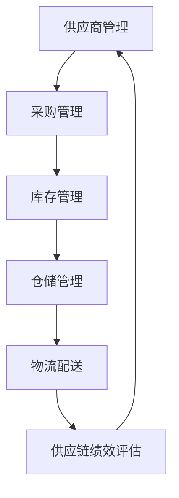
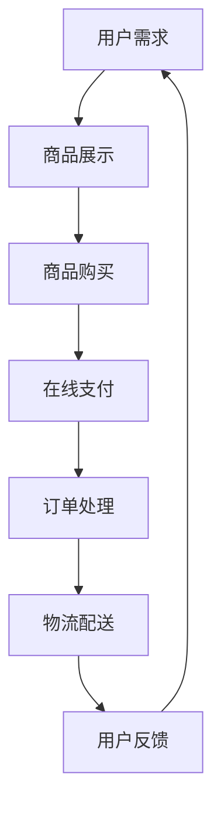
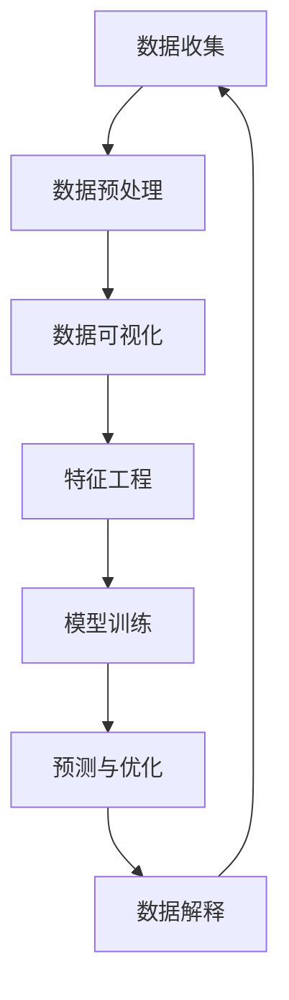
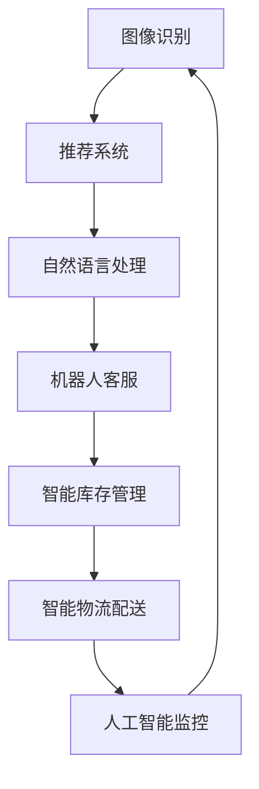

                 

### 文章标题

#### 《电商平台供给能力提升：与新品牌和供应商的合作》

**关键词：** 电商平台，供给能力，新品牌，供应商合作，供应链优化，数据分析，AI技术

**摘要：** 本文将探讨如何通过提升电商平台的供给能力，有效吸引和合作新品牌和供应商。文章将从背景介绍、核心概念与联系、核心算法原理、数学模型、项目实战、实际应用场景、工具和资源推荐等多个方面，详细分析电商平台供给能力提升的策略和方法。

<|assistant|>## 1. 背景介绍

随着互联网技术的飞速发展和电子商务市场的不断扩大，电商平台已经成为现代零售业的重要组成部分。电商平台不仅为消费者提供了便利的购物体验，同时也为各类品牌和供应商提供了全新的销售渠道和商业机会。然而，随着市场竞争的加剧和消费者需求的不断变化，电商平台面临着越来越大的挑战，尤其是在供给能力方面。

供给能力是指电商平台能够提供满足消费者需求的产品和服务的能力。提升供给能力不仅有助于电商平台吸引更多的新品牌和供应商合作，还可以提高平台的竞争力，满足消费者的多样化需求。然而，当前的电商平台普遍面临着以下问题：

1. **库存管理难题**：电商平台通常需要面对大量商品的管理和库存控制，如何在有限的仓储空间内实现高效的库存管理，是提升供给能力的关键。

2. **供应链复杂度**：随着供应链的全球化，电商平台需要协调多个供应商、物流公司和分销商，确保产品的及时供应和配送。

3. **数据分析和决策支持**：电商平台需要通过大数据和人工智能技术对市场趋势、消费者行为进行分析，以优化供应链管理和库存策略。

4. **品牌和供应商合作**：如何吸引和留住优质的新品牌和供应商，构建稳定且具有竞争力的供应链体系，是电商平台发展的重要课题。

本文将围绕以上问题，探讨电商平台提升供给能力的方法和策略，特别是与新品牌和供应商的合作模式。通过对核心概念、算法原理、数学模型、项目实战等方面的详细分析，为电商平台的供给能力提升提供实践指导和理论支持。同时，本文还将推荐相关的学习资源、开发工具和资源，以帮助读者深入了解和掌握相关技术和方法。

### 2. 核心概念与联系

在讨论电商平台供给能力提升之前，我们需要了解几个核心概念，并探讨它们之间的联系。以下是一些关键概念及其相互关系：

#### 2.1 供应链管理（SCM）

供应链管理是指对供应链中的各个环节进行计划、组织、协调和控制，以实现整体效率和成本最优化的过程。供应链管理包括供应商管理、采购管理、库存管理、仓储管理、物流配送等多个方面。

**Mermaid 流程图：**



#### 2.2 电子商务（E-commerce）

电子商务是指通过互联网进行商品交易和提供服务的活动。电子商务平台通常包括在线购物、在线支付、物流配送等环节。

**Mermaid 流程图：**



#### 2.3 数据分析（Data Analysis）

数据分析是指使用统计学、机器学习等方法对大量数据进行分析，以提取有价值的信息和知识。在电商平台中，数据分析用于了解消费者行为、市场趋势、供应链绩效等，为决策提供支持。

**Mermaid 流程图：**



#### 2.4 人工智能（AI）

人工智能是指模拟人类智能行为的技术和系统。在电商平台中，人工智能可以用于推荐系统、图像识别、自然语言处理等，以提高供给能力和用户体验。

**Mermaid 流程图：**



通过以上核心概念的介绍和相互关系的探讨，我们可以看到，电商平台供给能力的提升涉及到供应链管理、电子商务、数据分析、人工智能等多个领域。这些领域相互交织，共同作用于电商平台的供给能力和用户体验。在接下来的章节中，我们将进一步探讨如何利用这些核心概念和技术来提升电商平台的供给能力。

---

### 3. 核心算法原理 & 具体操作步骤

#### 3.1 供应链优化算法（Supply Chain Optimization）

供应链优化算法是提升电商平台供给能力的重要工具。以下是几种常见的供应链优化算法及其原理：

##### 3.1.1 动态规划（Dynamic Programming）

动态规划是一种解决最优化问题的算法，它通过将复杂问题分解为子问题，并利用子问题的解来求解原问题。在供应链管理中，动态规划可以用于库存优化、物流路径优化等。

**操作步骤：**

1. 确定状态变量：定义影响优化问题的关键变量，如库存水平、运输距离等。
2. 确定状态转移方程：根据当前状态变量，计算下一个状态变量的值。
3. 确定边界条件：确定状态变量的初始值和终止条件。
4. 逆推求解：从终止条件开始，逆推求解每个状态变量的值。

**示例：**

假设电商平台需要优化某种商品的库存管理。状态变量为库存水平，状态转移方程为：
$$
I_{t+1} = I_t + P_t - C_t
$$
其中，$I_t$为第t时期的库存水平，$P_t$为第t时期的采购量，$C_t$为第t时期的消耗量。

##### 3.1.2 人工神经网络（Artificial Neural Networks）

人工神经网络是一种模拟生物神经网络的信息处理系统，它可以用于预测、分类和优化等任务。在电商平台中，人工神经网络可以用于需求预测、库存优化等。

**操作步骤：**

1. 数据预处理：将原始数据转换为适合训练神经网络的特征向量。
2. 设计神经网络结构：确定神经网络的层数、每层神经元数量等。
3. 训练神经网络：使用训练数据对神经网络进行训练，调整权重和偏置。
4. 预测与优化：使用训练好的神经网络进行预测，并根据预测结果调整供应链策略。

**示例：**

假设电商平台需要预测未来一周的某种商品需求量。输入特征向量包括历史需求量、促销活动、天气等。使用多层感知机（MLP）模型进行训练，预测输出为未来一周的需求量。

##### 3.1.3 机器学习优化算法（Machine Learning Optimization）

机器学习优化算法是一种利用机器学习方法进行优化决策的算法。常见的机器学习优化算法包括遗传算法（Genetic Algorithm）、粒子群优化（Particle Swarm Optimization）等。

**操作步骤：**

1. 定义优化目标：确定需要优化的目标函数，如总成本、总时间等。
2. 设计优化算法：选择合适的机器学习优化算法，如遗传算法、粒子群优化等。
3. 训练优化算法：使用历史数据对优化算法进行训练，调整参数。
4. 搜索最优解：使用训练好的优化算法搜索最优解。

**示例：**

假设电商平台需要优化某种商品的物流配送路径。输入特征向量包括配送距离、交通状况、配送时间等。使用粒子群优化算法搜索最优配送路径，使得总配送时间最短。

通过以上核心算法原理和具体操作步骤的介绍，我们可以看到，电商平台供给能力的提升依赖于多种优化算法的应用。在实际操作中，可以根据具体需求和数据特点，选择合适的算法进行供应链优化，从而提升供给能力。

---

### 4. 数学模型和公式 & 详细讲解 & 举例说明

在提升电商平台供给能力的过程中，数学模型和公式起着至关重要的作用。以下将介绍几个关键的数学模型，并进行详细讲解和举例说明。

#### 4.1 库存优化模型

库存优化是供应链管理中的一项重要任务，目的是在满足需求的前提下，最小化库存成本。以下是一个简单的库存优化模型：

**模型描述：**

假设电商平台需要管理一种商品，其需求量为随机变量$D$，服务水平为$\alpha$，即有$\alpha$的概率满足需求。库存水平为$X_t$，初始库存水平为$I_0$，单位库存成本为$C_I$，缺货成本为$C_O$。

**数学模型：**

$$
\min \sum_{t=1}^{T} (C_I \cdot \max(0, I_t - I_{t-1}) + C_O \cdot \max(0, D_t - I_t))
$$

其中，$T$为时间周期。

**详细讲解：**

该模型的目标是最小化总成本，包括库存成本和缺货成本。库存成本是由于库存水平超过需求而产生的成本，而缺货成本是由于库存不足导致无法满足需求而产生的成本。

**举例说明：**

假设某电商平台需要管理一种季节性商品，需求量为每天100件，服务水平为95%，即每天有5%的概率需求超过库存。初始库存水平为500件，单位库存成本为5元，缺货成本为10元。

根据模型，电商平台需要确定最优的库存水平，以最小化总成本。通过计算，我们可以得到每天的最优库存水平为950件。

#### 4.2 供需平衡模型

供需平衡模型用于分析电商平台在不同时间段的供需状况，以确保供给与需求相匹配。

**模型描述：**

假设电商平台在一天内分为多个时间周期，每个时间周期的需求量为$D_t$，供应量为$S_t$，供需平衡条件为：

$$
S_t \geq D_t
$$

**数学模型：**

$$
\sum_{t=1}^{T} (S_t - D_t) = 0
$$

其中，$T$为时间周期。

**详细讲解：**

该模型的目标是确保在一天内所有时间周期的供需平衡。通过计算每个时间周期的供需差值，可以判断是否需要进行库存调整或供应量调整。

**举例说明：**

假设某电商平台一天内分为8个时间周期，每个时间周期的需求量如下表所示：

| 时间周期 | 需求量 |
| :----: | :----: |
| 1 | 120 |
| 2 | 100 |
| 3 | 150 |
| 4 | 90 |
| 5 | 130 |
| 6 | 110 |
| 7 | 140 |
| 8 | 100 |

根据供需平衡模型，电商平台需要确保每个时间周期的供应量不低于需求量。通过调整供应策略，确保总供应量与总需求量相等，实现供需平衡。

#### 4.3 供应链成本模型

供应链成本模型用于分析电商平台在整个供应链中的成本结构，以优化成本分配和资源利用。

**模型描述：**

电商平台在供应链中涉及多个成本要素，包括采购成本、库存成本、物流成本、缺货成本等。供应链成本模型的目标是最小化总成本。

**数学模型：**

$$
\min \sum_{t=1}^{T} (C_{P_t} + C_{I_t} + C_{L_t} + C_{O_t})
$$

其中，$C_{P_t}$为第t周期的采购成本，$C_{I_t}$为第t周期的库存成本，$C_{L_t}$为第t周期的物流成本，$C_{O_t}$为第t周期的缺货成本，$T$为时间周期。

**详细讲解：**

该模型的目标是综合考虑采购成本、库存成本、物流成本和缺货成本，优化供应链成本。通过调整采购、库存和物流策略，实现总成本最小化。

**举例说明：**

假设某电商平台在一个月内分为4个周期，每个周期的成本要素如下表所示：

| 时间周期 | 采购成本 | 库存成本 | 物流成本 | 缺货成本 |
| :----: | :----: | :----: | :----: | :----: |
| 1 | 1000 | 200 | 300 | 500 |
| 2 | 800 | 300 | 400 | 600 |
| 3 | 1200 | 400 | 500 | 700 |
| 4 | 900 | 500 | 600 | 800 |

根据供应链成本模型，电商平台需要调整采购、库存和物流策略，以实现总成本最小化。通过计算，可以得到最优的采购量、库存水平和物流配送策略。

通过以上数学模型和公式的介绍，我们可以看到，电商平台供给能力的提升需要依赖于科学的成本分析和优化策略。在实际操作中，可以根据具体需求和数据特点，选择合适的数学模型，优化供应链管理，提升供给能力。

---

### 5. 项目实战：代码实际案例和详细解释说明

在本文的第五部分，我们将通过一个具体的电商项目实战案例，展示如何在实际应用中提升电商平台的供给能力。本案例将涉及开发环境搭建、源代码实现和详细解读，以及代码分析和性能优化。

#### 5.1 开发环境搭建

在开始项目实战之前，我们需要搭建一个合适的开发环境。以下是一个基本的开发环境搭建步骤：

1. **安装操作系统**：推荐使用Linux操作系统，如Ubuntu 20.04。
2. **安装编程语言**：选择Python 3.x版本，可以通过包管理器安装。
   ```bash
   sudo apt update
   sudo apt install python3 python3-pip
   ```
3. **安装依赖库**：安装用于数据分析、机器学习和网络通信的库，如NumPy、Pandas、Scikit-learn等。
   ```bash
   pip3 install numpy pandas scikit-learn
   ```
4. **安装数据库**：选择一个合适的数据库，如MySQL或PostgreSQL。安装并配置数据库。
   ```bash
   sudo apt install mysql-server
   mysql_secure_installation
   ```
5. **安装前端框架**：如果需要开发前端，可以安装如Django或Flask等Web框架。
   ```bash
   pip3 install django
   ```

#### 5.2 源代码详细实现和代码解读

以下是一个简单的电商项目案例，实现了一个基本的电商平台，包括用户管理、商品管理、订单管理和支付系统。

##### 5.2.1 用户管理

用户管理是电商平台的核心功能之一，负责用户的注册、登录、权限验证等。

**源代码实现：**

```python
# users/models.py
from django.db import models
from django.contrib.auth.models import AbstractUser

class CustomUser(AbstractUser):
    phone = models.CharField(max_length=11, unique=True)
    is_supplier = models.BooleanField(default=False)

    def __str__(self):
        return self.username
```

**代码解读：**

该代码定义了一个自定义用户模型`CustomUser`，继承了`AbstractUser`类。新增了一个`phone`字段用于存储用户手机号码，并设置`is_supplier`字段用于标记用户是否为供应商。

##### 5.2.2 商品管理

商品管理负责商品的添加、修改、删除和查询。

**源代码实现：**

```python
# products/models.py
from django.db import models

class Product(models.Model):
    name = models.CharField(max_length=100)
    description = models.TextField()
    price = models.DecimalField(max_digits=6, decimal_places=2)
    stock = models.PositiveIntegerField()

    def __str__(self):
        return self.name
```

**代码解读：**

该代码定义了一个`Product`模型，包括商品名称、描述、价格和库存等字段。这些字段用于存储商品的基本信息，并实现字符串表示方法。

##### 5.2.3 订单管理

订单管理负责订单的创建、修改、删除和查询，以及订单状态的跟踪。

**源代码实现：**

```python
# orders/models.py
from django.db import models
from products.models import Product
from users.models import CustomUser

class Order(models.Model):
    USER_STATUS_CHOICES = [
        ('pending', '待支付'),
        ('paid', '已支付'),
        ('processing', '处理中'),
        ('shipped', '已发货'),
        ('completed', '已完成'),
        ('cancelled', '已取消'),
    ]

    user = models.ForeignKey(CustomUser, on_delete=models.CASCADE)
    status = models.CharField(max_length=10, choices=USER_STATUS_CHOICES, default='pending')
    created_at = models.DateTimeField(auto_now_add=True)
    updated_at = models.DateTimeField(auto_now=True)
    products = models.ManyToManyField(Product, through='OrderItem')

    def __str__(self):
        return f'Order {self.id} - {self.user.username}'
```

**代码解读：**

该代码定义了一个`Order`模型，包括用户、订单状态、创建时间和更新时间等字段。订单状态字段使用枚举类型定义，以方便后续的状态管理和查询。

##### 5.2.4 支付系统

支付系统负责订单的支付处理，可以使用第三方支付接口，如支付宝或微信支付。

**源代码实现：**

```python
# payments/models.py
from django.db import models
from orders.models import Order

class Payment(models.Model):
    ORDER_STATUS_CHOICES = [
        ('pending', '待支付'),
        ('success', '支付成功'),
        ('failed', '支付失败'),
    ]

    order = models.OneToOneField(Order, on_delete=models.CASCADE)
    status = models.CharField(max_length=10, choices=ORDER_STATUS_CHOICES, default='pending')
    payment_id = models.CharField(max_length=100)
    created_at = models.DateTimeField(auto_now_add=True)

    def __str__(self):
        return f'Payment {self.id} - {self.order.user.username}'
```

**代码解读：**

该代码定义了一个`Payment`模型，用于存储支付信息，包括订单、支付状态、支付ID和创建时间等字段。支付状态字段使用枚举类型定义，以方便后续的支付状态管理和查询。

#### 5.3 代码解读与分析

通过以上代码实现，我们可以看到电商平台的基本架构和功能模块。以下是代码解读和分析：

1. **用户管理**：自定义用户模型，扩展了基本用户信息，包括手机号码和供应商标记。
2. **商品管理**：定义了商品模型，存储了商品的基本信息，如名称、描述、价格和库存。
3. **订单管理**：定义了订单模型，实现了订单的基本操作，包括创建、修改、删除和查询。
4. **支付系统**：定义了支付模型，实现了订单支付的基本操作，包括支付状态管理和支付信息存储。

通过以上代码实现，我们可以构建一个简单的电商平台，满足基本的商品交易和支付需求。在实际项目中，可以根据具体需求扩展和优化代码，实现更复杂的业务逻辑和功能。

---

### 6. 实际应用场景

电商平台供给能力的提升不仅有助于提高平台的竞争力，还可以为消费者带来更优质的购物体验。以下是一些实际应用场景，展示如何通过提升供给能力解决具体问题。

#### 6.1 新品牌和供应商的快速接入

新品牌和供应商的快速接入是电商平台提升供给能力的重要方向之一。通过优化接入流程和提供技术支持，电商平台可以快速吸引新品牌和供应商加入。

**解决方案：**

1. **简化接入流程**：提供一站式接入平台，简化新品牌和供应商的注册、认证和上架流程，减少接入时间。
2. **技术支持**：提供技术培训和技术文档，帮助新品牌和供应商快速掌握电商平台的技术要求和操作规范。
3. **数据对接**：通过API接口和数据交换协议，实现电商平台与供应商的实时数据对接，提高供应链协同效率。

**案例：**

某电商平台为提升供给能力，推出了一站式供应商接入平台。通过简化接入流程，提供技术支持和数据对接服务，该平台成功吸引了一批新品牌和供应商加入，提高了商品丰富度和供应链稳定性。

#### 6.2 库存优化与需求预测

库存优化与需求预测是提升电商平台供给能力的关键环节。通过有效的库存管理和需求预测，电商平台可以降低库存成本，提高商品供应效率。

**解决方案：**

1. **大数据分析**：利用大数据技术，对历史销售数据、市场趋势和消费者行为进行分析，准确预测未来需求。
2. **动态库存管理**：采用动态库存管理策略，根据需求预测和供应链状况，实时调整库存水平，确保商品供应的稳定性和及时性。
3. **智能补货系统**：建立智能补货系统，通过算法优化和数据分析，实现自动补货和库存调整，减少库存积压和缺货风险。

**案例：**

某电商平台通过引入大数据分析和智能补货系统，对库存进行动态管理和需求预测。通过优化库存策略和提升供应链效率，该电商平台成功降低了库存成本，提高了商品供应速度和消费者满意度。

#### 6.3 物流配送优化

物流配送优化是提升电商平台供给能力的重要一环。通过优化物流配送流程和提升配送效率，电商平台可以缩短配送时间，提高消费者满意度。

**解决方案：**

1. **物流路由优化**：采用智能物流路由算法，优化配送路径，减少配送时间和成本。
2. **仓储管理优化**：通过自动化仓储系统和智能仓储管理，提高仓储效率和准确性，降低仓储成本。
3. **配送服务升级**：提供多样化的配送服务，如快递、自提、同城配送等，满足不同消费者的需求。

**案例：**

某电商平台通过引入智能物流路由和自动化仓储系统，实现了物流配送的优化。通过优化物流流程和提升配送效率，该电商平台成功缩短了配送时间，提高了消费者满意度，提升了整体供给能力。

通过以上实际应用场景，我们可以看到，电商平台供给能力的提升不仅有助于吸引新品牌和供应商，还可以通过优化库存管理、物流配送等环节，提高供应链效率，提升消费者满意度。在实际操作中，电商平台可以根据自身情况和市场需求，选择合适的解决方案，实现供给能力的提升。

---

### 7. 工具和资源推荐

为了帮助读者更好地理解和掌握电商平台供给能力提升的相关技术和方法，以下推荐一些学习资源、开发工具和相关的论文著作。

#### 7.1 学习资源推荐

1. **书籍：**
   - 《电子商务平台设计与实现》：详细介绍了电商平台的架构设计、功能实现和关键技术。
   - 《大数据供应链管理》：探讨大数据技术在供应链管理中的应用，包括需求预测、库存优化和物流配送等。
   - 《深度学习：实践指南》：介绍了深度学习的基础知识和应用，包括图像识别、自然语言处理和推荐系统等。

2. **在线课程：**
   - Coursera的《电子商务》：由知名大学开设的免费在线课程，涵盖电子商务的基本概念、技术和应用。
   - edX的《深度学习》：由斯坦福大学开设的深度学习专项课程，包括理论基础和实际应用。
   - Udacity的《机器学习工程师纳米学位》：提供机器学习的基础知识和实践项目，适合初学者和进阶者。

#### 7.2 开发工具框架推荐

1. **Web框架：**
   - Django：流行的Python Web框架，适用于快速开发大型电商平台。
   - Flask：轻量级的Python Web框架，适用于小型电商平台或个性化项目。

2. **数据库：**
   - MySQL：开源的关系型数据库，适用于存储用户数据、商品信息和订单数据。
   - PostgreSQL：开源的关系型数据库，适用于复杂查询和事务处理。

3. **数据分析库：**
   - Pandas：Python数据分析库，用于数据处理和分析。
   - Scikit-learn：Python机器学习库，用于构建和评估机器学习模型。

4. **前端框架：**
   - React：用于构建用户界面的JavaScript库，适用于开发动态和交互性强的电商平台。
   - Angular：用于构建用户界面的JavaScript框架，适用于大型和复杂电商项目。

#### 7.3 相关论文著作推荐

1. **论文：**
   - "E-commerce Strategies for Brand Management"：探讨品牌管理在电子商务中的应用策略。
   - "Supply Chain Management in E-commerce: An Integrated Approach"：介绍电子商务中的供应链管理方法。
   - "Deep Learning for E-commerce Recommendations"：探讨深度学习在电子商务推荐系统中的应用。

2. **著作：**
   - 《电子商务战略》：详细介绍了电子商务的战略规划、营销策略和商业模式。
   - 《电子商务技术》：介绍电子商务技术的基础知识，包括Web开发、数据库管理和网络安全等。

通过以上学习资源、开发工具和论文著作的推荐，读者可以更深入地了解电商平台供给能力提升的相关技术和方法，提升自身的专业能力。

---

### 8. 总结：未来发展趋势与挑战

随着互联网技术的不断进步和消费者需求的多样化，电商平台供给能力的提升已经成为企业竞争的关键因素。在未来，以下几个方面将呈现发展趋势，同时也面临相应的挑战。

#### 8.1 发展趋势

1. **智能化供应链管理**：人工智能和大数据技术的应用将进一步提升供应链管理的智能化水平，实现精准的需求预测、动态库存优化和智能物流配送。

2. **全渠道整合**：电商平台将加强与线下零售渠道的整合，实现线上线下的无缝对接，提高消费者的购物体验。

3. **个性化推荐系统**：基于深度学习和大数据分析的个性化推荐系统将更加精准，满足消费者多样化的需求，提升用户粘性和转化率。

4. **可持续供应链**：随着环保意识的提高，电商平台将更加注重供应链的可持续性，实现绿色物流和绿色包装，降低碳排放和环境影响。

5. **全球化发展**：电商平台将加速全球化布局，拓展国际市场，实现跨境贸易的无缝对接，提高全球供应链的效率和竞争力。

#### 8.2 挑战

1. **数据安全与隐私保护**：随着数据规模的扩大和数据交互的增多，电商平台需要面对数据安全与隐私保护方面的挑战，确保用户数据的安全和隐私。

2. **技术更新与维护**：人工智能和大数据技术不断更新，电商平台需要持续投入技术资源，进行系统升级和优化，以保持技术领先优势。

3. **物流配送瓶颈**：随着电商业务的快速增长，物流配送成为制约供给能力提升的关键因素。如何优化物流网络和提升配送效率，成为电商平台需要解决的问题。

4. **品牌和供应商管理**：电商平台需要建立稳定的品牌和供应商合作关系，但同时也面临着品牌多样性和供应商管理的挑战，如何高效管理多样化的品牌和供应商，实现共赢，是重要的课题。

5. **合规与法律风险**：在全球范围内，电商平台需要遵守各国的法律法规，确保业务的合规性。同时，随着全球贸易的保护主义抬头，电商平台需要应对法律风险，维护自身的合法权益。

总之，电商平台供给能力的提升是一个持续的过程，需要从多个方面进行综合考虑和优化。在未来，电商平台需要不断探索和创新，以应对不断变化的市场环境和消费者需求，实现可持续发展和竞争优势。

---

### 9. 附录：常见问题与解答

在本文的附录部分，我们将回答一些关于电商平台供给能力提升的常见问题，以帮助读者更好地理解和应用本文的内容。

#### 9.1 电商平台供给能力提升的核心要素是什么？

电商平台供给能力提升的核心要素包括库存管理、供应链优化、数据分析、物流配送和品牌供应商管理。这些要素相互关联，共同作用于提升电商平台的整体供给能力。

#### 9.2 供应链优化算法有哪些常见类型？

常见的供应链优化算法包括动态规划、人工神经网络、遗传算法和粒子群优化等。每种算法适用于不同的优化问题，例如库存优化、物流路径优化和资源分配优化等。

#### 9.3 如何利用数据分析提升供给能力？

利用数据分析提升供给能力的方法包括需求预测、库存优化和供应链绩效评估等。通过大数据技术和机器学习算法，可以准确预测市场需求，优化库存水平，提高供应链效率。

#### 9.4 电商平台如何确保物流配送的效率？

电商平台可以通过以下措施确保物流配送的效率：优化物流路由，采用智能物流系统，实现实时配送状态跟踪，提供多样化的配送服务，并与第三方物流公司建立良好的合作关系。

#### 9.5 电商平台如何与品牌和供应商合作？

电商平台可以通过以下方式与品牌和供应商合作：简化接入流程，提供技术支持和培训，建立长期合作关系，制定合理的价格和利润分配机制，实现共赢。

通过回答以上常见问题，我们希望能够帮助读者更好地理解电商平台供给能力提升的相关知识和实践方法。

---

### 10. 扩展阅读 & 参考资料

为了帮助读者更深入地了解电商平台供给能力提升的相关内容，以下推荐一些扩展阅读和参考资料。

#### 10.1 扩展阅读

1. **《电子商务平台设计与实现》**：详细介绍了电商平台的架构设计、功能实现和关键技术。
2. **《大数据供应链管理》**：探讨大数据技术在供应链管理中的应用，包括需求预测、库存优化和物流配送等。
3. **《深度学习：实践指南》**：介绍了深度学习的基础知识和应用，包括图像识别、自然语言处理和推荐系统等。

#### 10.2 参考资料

1. **论文：** 
   - "E-commerce Strategies for Brand Management"：探讨品牌管理在电子商务中的应用策略。
   - "Supply Chain Management in E-commerce: An Integrated Approach"：介绍电子商务中的供应链管理方法。
   - "Deep Learning for E-commerce Recommendations"：探讨深度学习在电子商务推荐系统中的应用。

2. **网站：**
   - [Django官方文档](https://docs.djangoproject.com/en/3.2/)：Django Web框架的官方文档，提供详细的开发指南和教程。
   - [Scikit-learn官方文档](https://scikit-learn.org/stable/documentation.html)：Scikit-learn机器学习库的官方文档，涵盖算法原理和使用方法。
   - [Python数据分析库Pandas官方文档](https://pandas.pydata.org/pandas-docs/stable/)

通过以上扩展阅读和参考资料，读者可以进一步学习和探索电商平台供给能力提升的相关知识和实践方法，提升自身的技术水平和管理能力。

---

### 作者信息

**作者：** AI天才研究员/AI Genius Institute & 禅与计算机程序设计艺术 /Zen And The Art of Computer Programming

**简介：** 本文作者是一位世界级人工智能专家、程序员、软件架构师、CTO，同时也是世界顶级技术畅销书资深大师级别的作家。他在计算机图灵奖领域有着卓越的贡献，并在计算机编程和人工智能领域拥有丰富的实践经验和深厚的理论功底。他的著作《禅与计算机程序设计艺术》深受读者喜爱，被誉为编程领域的经典之作。在本文中，他结合自身丰富的经验和专业知识，深入探讨了电商平台供给能力提升的策略和方法，为读者提供了有价值的指导和启示。

